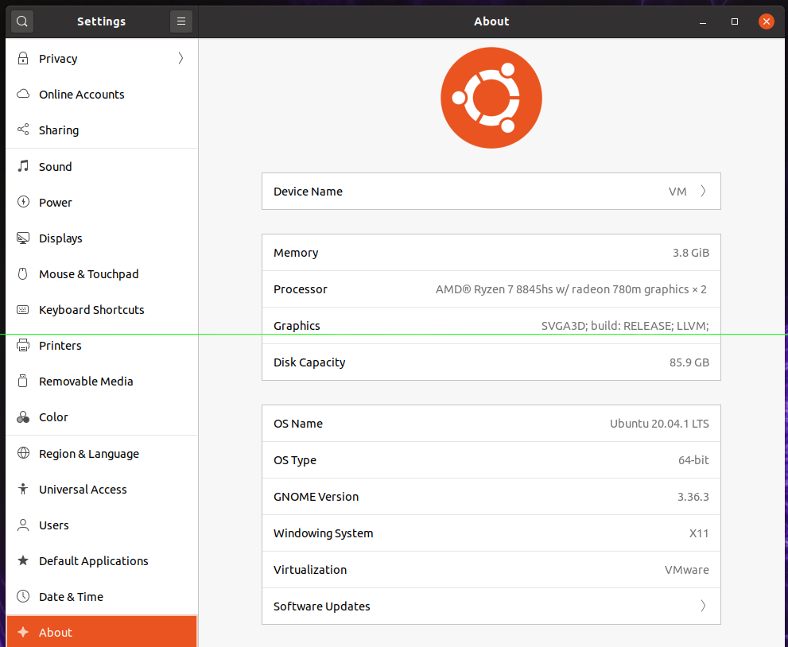
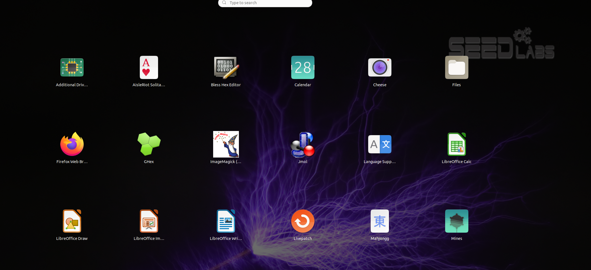
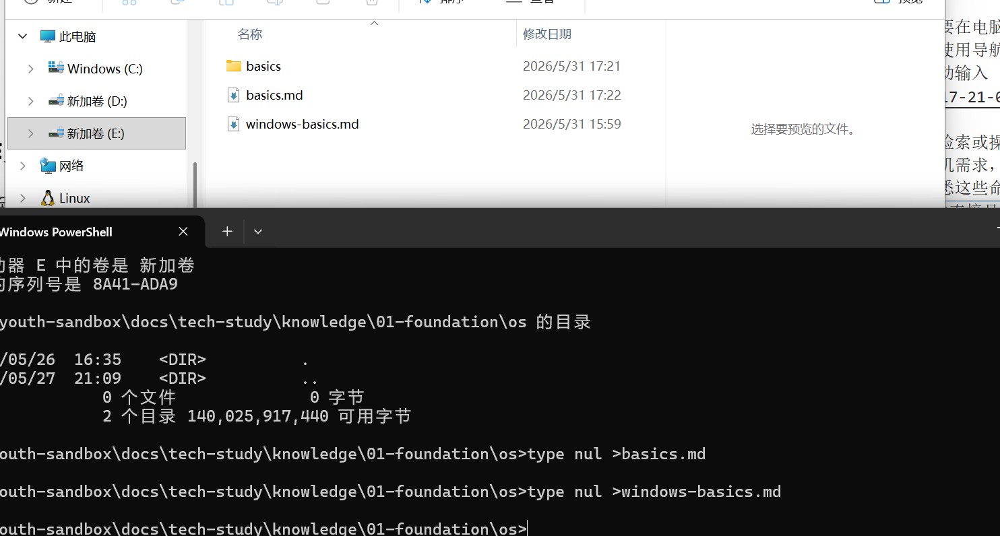
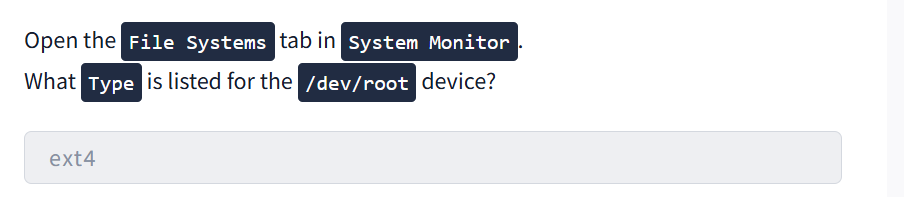

# os-basics
## 简介
### 什么是操作系统
操作系统提供了至关重要的协调和组织工作，
把电脑想象成一个繁忙的机场，它的所有组件都在协同运作。
**硬件**（中央处理器，内存（存储、连接设备）：跑道、飞机、燃料系统、雷达和其他物理基础设施。
**应用程序**（网页浏览器、游戏启动器）：各航空公司及其乘客，都在尝试起飞、降落和请求服务。
**操作系统**（Windows，Linux（macOS）：整个空中交通管制系统，指挥所有这些活动。它安排资源、管理交通、解决冲突并确保安全。
### 操作系统的特点
1. 并发性：两个或多个事件在同一时间间隔内发生
   ```
    并行性：两个或多个事件在同一时刻发生
    并发在宏观上看起来是并行
   ``` 
2. 共享性：系统中的资源可以被内存中两个或多个并发的进程（线程）共同使用
   ```
    互斥共享方式：两个音乐播放软件不能同时使用一台音箱播放音乐
    同时访问方式：宏观上，不同游戏可以同时访问内存中某个存储单元的数据
   ```
3. 虚拟性：通过某种技术把一个物理实体变为若干个逻辑上的对应物
   ```
    时分复用技术：虚拟处理机技术（并发），虚拟设备技术（打印机）
    空分复用技术：虚拟磁盘技术（C、D、E盘），虚拟存储器（内存）技术
   ``` 
4. 异步性：表现为每个进程以不可预知的节奏，断断续续的推进
### 操作系统的功能
1. 提供用户与硬件的接口
   1. 命令行接口
      1. 联机命令（交互式命令）
      2. 脱机命令（批处理命令）
   2. 系统调用
   3. 图形化界面
2. 文件管理
3. 设备管理
4. 进程管理
5. 内存管理
| 操作系统责任 | 操作系统做什么 | 例子 |
|--------------|----------------|------|
| 进程管理 | 创建、安排、确定优先级并终止正在运行的程序。操作系统决定每个进程所需的 CPU 时间，使得多任务处理感觉流畅无缝。 | 同时打开多个应用程序，例如浏览器、音乐播放器和社交媒体，而不会导致电脑卡顿 |
| 内存管理 | 分配内存，保护应用程序的内存免受其他进程的占用，并在应用程序关闭时回收内存。当物理内存不足时，操作系统使用虚拟内存来保持系统稳定。 | 同时打开多个应用程序，操作系统为每个程序分配独立的内存空间，并保持彼此隔离，避免互相干扰 |
| 文件系统管理 | 将文件整理到目录中，处理命名、路径、权限、元数据（名称、大小、类型、时间戳）。 | 创建新文件夹、保存照片或将文件设置为“只读” |
| 用户管理 | 处理多个用户帐户、身份验证和权限，以确定谁可以访问哪些内容。 | 使用密码登录系统，并确保其他用户帐户无法访问您的私人文件 |
| 设备管理 | 加载驱动程序并提供通用接口（硬件抽象层），以便应用程序可以发出“打印此内容”或“播放此声音”等指令。 | 插入新鼠标、打印机或外置硬盘后即可立即使用，无需手动配置 |
### 系统特权层
系统的不同部分以不同的权限级别运行。某些组件可以直接与硬件通信，而常规应用程序则在更安全、受限的环境中运行
**内核空间**：是内核运行的地方，内核是操作系统中直接管理硬件和系统资源的部分。它拥有不受限制的访问权限
**用户空间**：所有标准应用程序运行的地方。用户空间中的应用程序被刻意限制不能直接访问硬件。每当它们需要打开或保存文件、播放声音或连接 Wi-Fi 时，都必须发出系统调用，请求内核代表它们执行这些操作。
### 操作系统安全
操作系统负责处理
**身份验证**：通过登录密码和生物识别技术验证您的身份
**权限**：精确控制每个用户和应用被允许读取、写入或执行哪些内容。
**隔离**：将每个进程置于其自身的保护空间内（内核/用户空间分离）
**系统保护**：防止关键系统文件和设置被未经授权的更改
### 操作系统信息查看
可以在setting中的about中查看操作系统相关信息

## 操作系统交互
### 操作系统接口
#### 图形化用户界面GUI
它以图形化的方式呈现你想要在电脑上访问的所有信息。文件夹图标、应用程序窗口和设置菜单。我们可以把它比作使用导航应用程序。轻敲输入你想去的地方的图标，应用程序就会为你生成路线，无需手动输入

#### 命令行界面CLI
可以输入特定的文本命令来检索或操作信息。无需点击图标，而是使用系统能够理解的词语和语法，准确地告诉计算机需求，能够获得更高的精确度、控制力和速度，尤其是在处理高级任务时，但这需要熟悉这些命令。回到地图的比喻。使用命令行界面这就像输入目的地的精确GPS坐标一样。它直接且极其准确，但前提是知道要输入的正确信息
就拿操作文件系统举例，使用命令行会比使用图形化界面便捷、流畅很多
### 操作系统格局
并非所有操作系统都相同。不同的设备和用途需要不同的设计，从手机到数据中心的网络服务器，莫不如此。以下是在实际应用中会遇到的五大类操作系统
| 操作系统类型 | 主要用例 | 主要特征 |
|--------------|----------|----------|
| 桌面 | 个人电脑、日常工作、游戏、内容创作 | 丰富的图形界面，可同时运行多个应用程序，以用户为中心 |
| 服务器 | 网站托管、数据库、云服务、后端 | 无头（无图形用户界面）、最大限度提高正常运行时间、支持多用户、支持远程访问 |
| 移动 | 智能手机和平板电脑 | 触控式用户界面、节能省电、始终在线、应用沙盒 |
| 嵌入式 | 家用电器、汽车、物联网设备、智能电视、路由器 | 体积小巧，可在有限的硬件上运行 |
| 虚拟/云 | 实验室机器、容器、云实例 | 轻量级、可扩展、快速部署 |
### 真实世界的操作系统
1. 桌面操作系统

- **Windows**：个人电脑上使用最广泛的操作系统，包括 Windows 10（已停止支持）和 Windows 11。
- **macOS**：苹果公司的桌面操作系统，以其精美的图形用户界面和与其他苹果设备的集成而闻名。Sonoma（14）、Sequoia（15）、Tahoe（26）。
- **Linux**：并非单一操作系统，而是一系列开源操作系统的统称，例如 Ubuntu、Debian 和 Fedora 等发行版。

2. 服务器操作系统

- **Windows**：用于大型网络、数据中心和企业环境，服务器版本包括 2016、2019、2022 和 2025。
- **Linux**：绝大多数网络服务器使用 Linux，因其可靠性和开源特性备受信赖，例如 Ubuntu Server、Debian、CentOS 和 Red Hat。
- **Unix**：用于大型企业、金融、电信、政府机构；例如 IBM AIX、Oracle Solaris。

3. 移动操作系统

- **Android**：使用最广泛的移动操作系统，运行于手机、平板电脑和智能设备上。Android 14-16，厂商版本。
- **iOS**：苹果公司运行于 iPhone、iPad 和其他设备上的移动操作系统，包括 iOS 17、18 和 26。

4. 嵌入式和物联网设备

- **嵌入式 Linux**：内置于具有专用功能的设备的专用操作系统，例如 OpenWrt、Ubuntu Core 和 Yocto 项目。
- **实时操作系统**：专为需要保证响应时间的应用而设计（例如飞机控制系统），例如 FreeRTOS、VxWorks 和 QNX。

5. 虚拟和云

- **云/虚拟机**：托管网站、应用程序和流媒体服务的大型数据中心，例如 Ubuntu LTS、Amazon Linux 和 Rocky Linux。
- **容器优化**：轻量级的虚拟机替代方案，仅打包应用程序及其依赖项，例如 Alpine Linux、Bottlerocket AWS 和 Flatcar Linux。
### 为什么会有这么多操作系统？
不同的设备和环境对操作系统提出了不同的要求。笔记本电脑必须易于使用并支持多任务处理。服务器需要稳定性、安全性，并且必须能够持续不间断地运行。移动设备需要高能效和硬件集成以延长电池续航时间。嵌入式系统则使用专为特定用途设计的轻量级操作系统。
开发这些操作系统的公司和社区也有各自的目标。有些侧重于易用性、性能、安全性、开放性或可定制性。由于每个环境重视的功能各不相同，因此没有哪个操作系统能够完美适用于所有情况。取而代之的是，一个操作系统生态系统应运而生。
## 小结
关键术语
- 内核空间：有直接硬件访问权限的高度特权区域，也是内核的所在地，内核直接管理硬件和系统资源。
- 用户空间：常规应用程序运行的区域，其权限受到限制，以确保安全性和系统稳定性。
- 命令行界面：基于文本的界面，可以通过输入命令来精确、快速地控制系统
## 拓展

### /dev/root 到底是什么
/dev/root 不是一个真实的物理设备节点
通常 /dev/ 目录下应该有设备文件，比如 /dev/sda、/dev/nvme0n1，但 /dev/root 很少作为一个实际的块设备文件存在。它更多是一个 内核内部或 initramfs 早期使用的符号/占位符。
Linux 内核启动时通过 root=/dev/sda2 或 root=UUID=... 指定根文件系统。在根文件系统挂载的早期阶段、设备节点还未完全准备好时，内核会临时将该设备命名为 ROOT_DEV，而某些用户态工具（如 mount、findmnt、旧版 df）或者 GUI 工具在解析 /proc/mounts 时，如果无法获得规范的主设备号/次设备号对应的真实设备名，就会显示为 /dev/root。