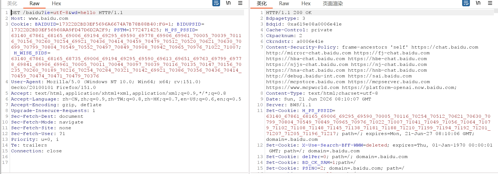
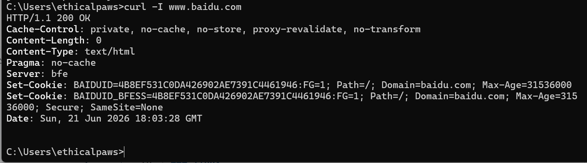
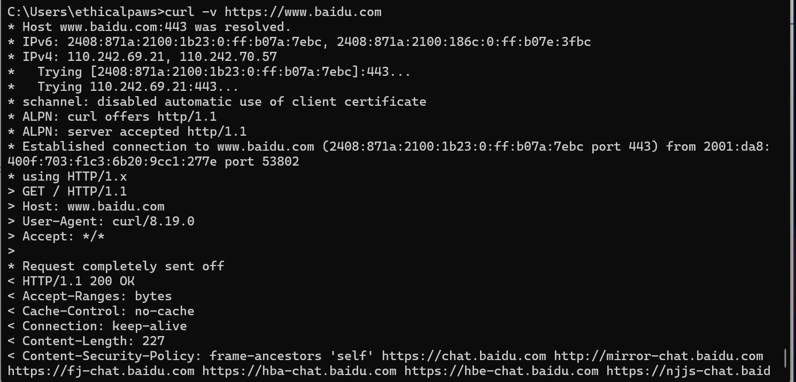
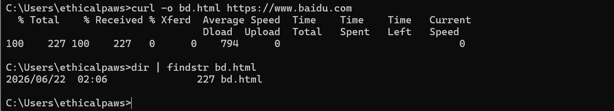
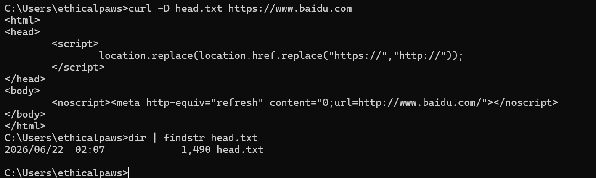

# 应用层
> 应用层为应用程序提供网络服务接口，是日常使用的所有网络应用（网页、邮件、文件传输、域名解析）的“顶层协议”。


## DNS协议
1. 一句话核心：DNS把人类易记的域名（www.baidu.com）转换成机器识别的IP地址
2. 解析流程
   
   ```mermaid
   sequenceDiagram
      客户端->>本地DNS服务器: 1. 查询 www.baidu.com
      本地DNS服务器->>根DNS服务器: 2. 问 .com 在哪？
      根DNS服务器-->>本地DNS服务器: 3. 去问 .com 权威服务器
      本地DNS服务器->>.com 权威服务器: 4. 问 baidu.com 在哪？
      .com 权威服务器-->>本地DNS服务器: 5. 去问 baidu.com 权威服务器
      本地DNS服务器->>baidu.com 权威服务器: 6. 问 www 的记录？
      baidu.com 权威服务器-->>本地DNS服务器: 7. www 的 IP 是 14.215.177.39
      本地DNS服务器-->>客户端: 8. 返回 IP 地址
   ```

3. 关键概念
   ```
   递归查询：客户端只问一次，DNS服务器帮你层层追问到底（客户端→本地DNS）
   迭代查询：DNS服务器一层层告诉你“去问谁”（客户端→本地DNS→根→顶级域→权威）
   DNS缓存：解析结果会缓存，下次查询更快（TTL控制缓存时间）
   ``` 
4. 记录类型
   ```
   A:域名 → IPv4地址
   AAAA:域名 → IPv6地址
   CNAME:别名 → 规范域名
   MX:邮件交换记录
   NS:权威DNS服务器
   TXT:文本记录
   ``` 
## HTTP协议
1. HTTP一句话核心：HTTP是浏览器和Web服务器之间的“对话语言”，定义请求和响应的格式。
2. 请求方法
   ```
   GET:获取资源（参数在URL）	明文，不适用于敏感数据
   POST:提交数据（参数在Body）	比GET略安全，但仍明文
   PUT:上传/替换资源	不安全，需严格鉴权
   DELETE:删除资源	不安全，需严格鉴权
   HEAD:同GET但只返回头部	安全（用于探测）
   OPTIONS:查询服务器支持的请求方法	安全
   ``` 
3. 状态码
   ```
   1xx：信息性响应【100 Continue】
   2xx：成功【200 OK】
   3xx：重定向【301永久移动、302临时移动、304未修改】
   4xx：客户端错误【400错误请求、401未认证、403权限不够、404未找到】
   5xx：服务端错误【500服务器内部错误、502网关错误、503服务器不可用】
   ``` 
4. 常用头部字段
   ```
   Host：请求的目标域名
   Cookie：会话凭证
   Referer：来源页面
   User-Agent：客户端代理
   Content-Type：数据类型
   Location：重定向目标（响应头）
   Content-Length：数据长度
   ``` 
   
## HTTPS
1. 本质：HTTP+TLS/SSL加密，防止数据被窃听和篡改
2. 核心机制
   ```
   证书验证：浏览器验证服务器证书是否可信（CA签发）
   非对称加密：用于协商对称密钥（握手阶段）
   对称加密：实际数据传输使用对称加密（更快）
   ``` 
3. 渗透测试关联
   ```
   未加密的HTTP传输会泄露cookie、密码等敏感信息
   HTTS可以防御中间人攻击（证书伪造除外）
   ``` 
## 邮件协议
```
SMTP	25 (TCP)	发送邮件	邮件伪造、SPF绕过
POP3	110 (TCP)	接收邮件（下载后删除服务器）	信息收集
IMAP	143 (TCP)	接收邮件（保留服务器副本）	信息收集
```
## 实战应用
1. DNS侦查：dig example.com ANY 收集子域名、MX、TXT
2. DNS劫持：修改受害者的DNS设置，指向恶意DNS服务器
3. DNS带外探测：用于检测无回显的SQL注入、XXE、SSRF、java反序列化等
4. HTTP信息收集：curl -I url,看Server、X-Powered-By等
5. HTTP攻击：GET/POST/SQL注入
6. FTP匿名登录：ftp 目标IP → 用户名 anonymous，密码空
7. SMTP邮件伪造：SMTP没有强认证，使用 swaks 工具伪造发件人

## 常用命令
### windows
1. DNS解析：
   ``` 
   # 基本查询
   nslookup www.baidu.com

   # 指定DNS服务器查询
   nslookup www.baidu.com 8.8.8.8

   # 查询特定记录类型（如MX记录）
   nslookup -type=MX example.com

   # 进入交互模式
   nslookup
   > set type=MX
   > example.com
   ```
2. 查看DNS缓存：ipconfig /displaydns
3. 清空DNS缓存：ipconfig /flushdns
4. HTTP请求命令curl
   ```
   # 基本GET请求
   curl https://www.baidu.com

   # 查看响应头（仅显示头部）
   curl -I https://www.baidu.com

   # 查看详细通信过程（包含TLS握手信息）
   curl -v https://www.baidu.com

   # 发送POST请求
   curl -X POST https://api.example.com/login -d "username=admin&password=123"

   # 设置请求头（如User-Agent）
   curl -H "User-Agent: Mozilla/5.0" https://www.baidu.com

   # 跟随重定向
   curl -L https://example.com

   # 输出响应头到文件
   curl -D headers.txt https://www.baidu.com

   # 保存响应到文件
   curl -o baidu.html https://www.baidu.com
   ``` 
   
   
   
   
### linux
1. DNS解析：
   ```
   # 基本查询
   dig www.baidu.com

   # 指定DNS服务器
   dig @8.8.8.8 www.baidu.com

   # 查询特定记录类型
   dig www.baidu.com A
   dig example.com MX
   dig example.com NS

   # 显示完整DNS查询过程（考试画图题的现实版）
   dig +trace www.baidu.com

   # 只显示简要答案（省去额外信息）
   dig +short www.baidu.com
   ```
2. 查看/清空DNS缓存
   ```
   # systemd-resolved（Ubuntu 18.04+）
   systemd-resolve --statistics   # 查看缓存统计
   sudo systemd-resolve --flush-caches   # 清空缓存

   # dnsmasq（如果使用）
   sudo systemctl restart dnsmasq   # 重启即清空

   # nscd
   sudo /etc/init.d/nscd restart
   ``` 
3. curl
   ```
   # 基本用法同Windows
   curl https://www.baidu.com

   # 查看响应头
   curl -I https://www.baidu.com

   # 查看详细过程
   curl -v https://www.baidu.com

   # 发送POST请求（JSON格式）
   curl -X POST https://api.example.com/login -H "Content-Type: application/json" -d '{"username":"admin","password":"123"}'

   # 使用Cookie
   curl -b "sessionid=abc123" https://example.com/profile

   # 保存Cookie
   curl -c cookies.txt https://example.com/login
   ``` 
4. 文件下载工具wget
   ```
   # 下载文件
   wget https://example.com/file.zip

   # 下载到指定文件名
   wget -O myfile.zip https://example.com/file.zip

   # 递归下载整个网站
   wget -r -l 2 -np https://example.com/docs/

   # 使用cookie下载
   wget --header="Cookie: sessionid=abc123" https://example.com/private
   ``` 
5. 端口扫描nmap
   ```
   # 基本端口扫描（TCP SYN扫描）
   nmap -sS -p- 192.168.162.129

   # 扫描指定端口 
   nmap -p 3389 192.168.162.129

   # UDP扫描
   nmap -sU -p- 192.168.162.129

   # 探测操作系统
   nmap -o 10.198.238.75

   ``` 