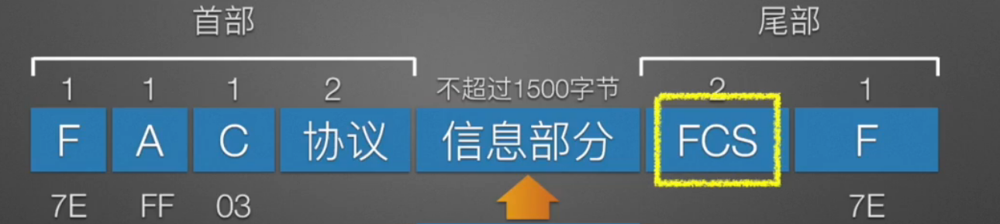
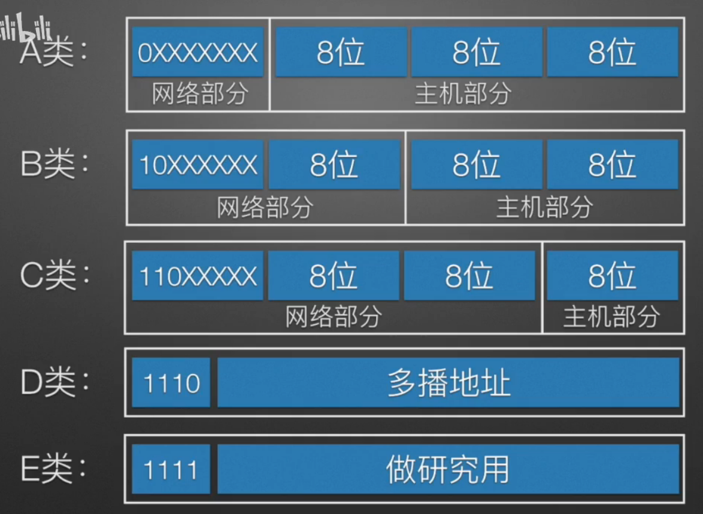
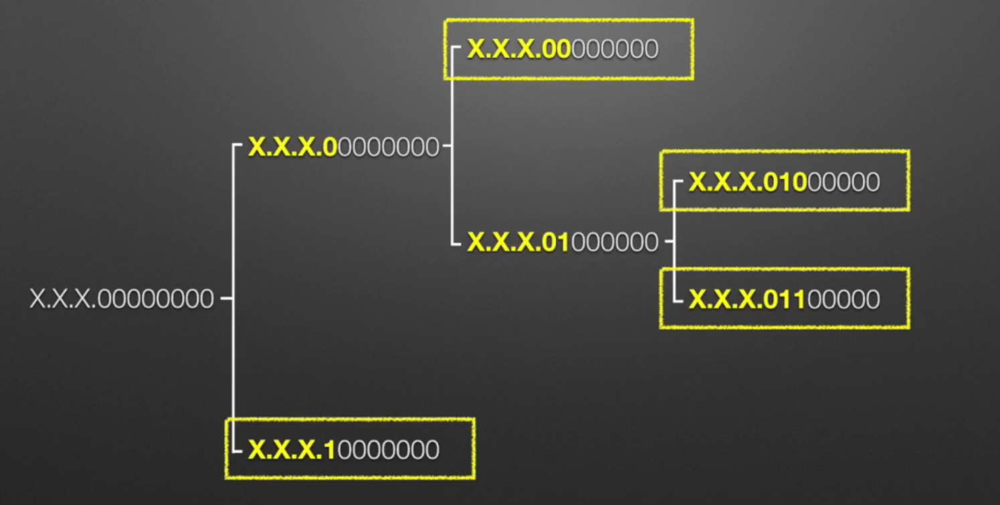
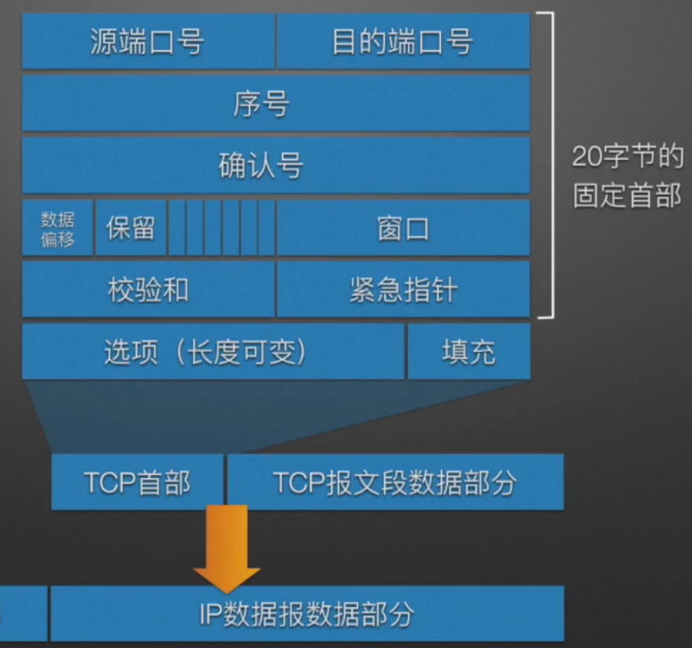

## 核心基础概念
1. 计算机网络：利用通信线路和交换设备将地理位置分散的具有独立功能的多台计算机联系到一起，按照某种协议实现数据通信和资源共享的信息系统
### 分层体系结构
1. OSI七层参考模型
   ```
    应用层：所有能和用户交互产生网络流量的应用程序
    |
    表示层：处理两个通信系统中交换信息的不同的表示方式
    |
    会话层：建立会话，向表示层实体/用户数据提供建立连接，并在此连接上实现有序传输数据
    |
    传输层：负责两台主机上的进程通信【即端到端的通信】，传输单位是报文段或数据报【即分组】
    |
    网络层：将分组从源端传到目的端，为分组交换网上的不同主机提供通信服务
    |
    数据链路层：将网络层的数据报组装成帧
    |
    物理层：在物理媒体中实现比特流的透明传输
   ```  
   OSI定义三点：服务，协议，接口

2. TCP/IP模型
   ```
    应用层
    |
    传输层
    |
    网际层
    |
    网络接口层
   ``` 
3. 五层参考模型
   ```
    应用层
    |
    传输层
    |
    网际层
    |
    数据链路层
    |
    物理层
   ``` 
4. 实体：传输的内容
5. 协议：层与层之间使用相同的协议（三要素：语义，语法，同步）
6. 服务：下层向上层提供服务
7. SAP服务访问点  
### 分组转发
## 数据链路层
### 功能
1. 组帧（帧定界）
   ```
    SOH
    EOT   
   ``` 
2. 透明传输（ESC）
3. 差错控制
   1. 奇偶校验码
   2. 海明码（纠错一位）
   3. 循环冗余校验（CRC）
4. 介质访问控制（MAC）
   1. 随机MAC协议
       
        ALOHA

        CSMA

         - 非坚持CSMA
     
         - 1-坚持CSMA
          
         - P-坚持CSMA
          
        CSMA/CD
         - 确定基本推迟时间：争用期2t
         
         - 定义参数k=min（重传次数，10）
         
         - 从（0,1,2...2的k次方-1）中取出一个数r，重传退避时间=2rt
         
         - 若重传次数达到16次则认为此时网络拥堵，丢弃该帧后向上层报告出错
         
         - 最小帧长2*数据传输速率*传输时间
   2. 受控介入MAC协议
      1. 轮询访问技术
      2. 令牌传递技术
### 点对点链路协议-PPP
1. 功能
   - 身份验证
   
   - 连接时协商IP地址
   
   - 差错检测（不纠错） 
   
   - 支持多种上层协议
2. 要求
   - 简单
   - 组帧
   - 多种网络层协议支持
   - 差错检测
   - 透明传输
   - 数据压缩协商
   - IP地址协商
   - 检测连接状态
   - 确定最大传输单元
   - 支持多种链路类型
3. 组成
   1. 组帧方法
   2. LCP
   3. NCP
4. PPP协议的帧格式
    
### ARP
1. MAC地址：全球唯一，每个接口一个，48位，前24位为厂商标识（IEEE分配），后24位是接口标识
2. ARP协议作用：地址解析协议，通过ip地址找MAC地址
### ARP缓存表
1. 位置：存在于主机中
2. 作用：记录了ip地址与MAC地址的映射关系，避免每次通信都广播ARP请求
### 以太网：
   - 快速以太网
   
   - 千兆、万兆以太网 
   
   - 最小帧长64B（包含14字节头部+4字节FCS+46字节数据）。这是为了确保CSMA/CD协议能检测到冲突 
### 交换机：
1. 作用：转发与过滤
2. MAC地址表
   - 位置：存在于交换机中
   - 作用：记录MAC地址和接口的对应关系，让交换机知道某目的MAC地址确定的数据包从交换机哪个端口转发出去   
   - 交换机自学习填表 
3. 交换机自学习过程：交换机通过源MAC地址来学习，建立MAC地址表。过程是：收到帧 -> 记录源MAC地址和端口 -> 查目的MAC地址表转发。
4. 优点
   
   - 无碰撞，性能好
   
   - 支持不同链路连接  
   
   - 方便网络管理

### 虚拟局域网（VLAN）
1. 把局域网通过交换机进行逻辑上的分割，形成一个个VLAN，每个VLAN是一个广播域
2. 分割是逻辑上的与物理位置无关
3. 抑制广播风暴，提高网络的安全性

## 网络层
### 基础概念
1. 虚电路服务
2. 数据报服务
3. 虚拟互联网
### IP协议
1. IP地址：32位，10进制网络部分，网络号+主机号
2. IP地址类别
   1. A类：网络部分8位+主机部分24位
      - 有126个可指派的网络号，全0为本网络，网络号为127表示本机环回测试
      - 每个网络有2的24次方-2个主机号【主机号全零表示网段ip地址，全一表示广播地址】
   2. B类：网络部分16位+主机部分16位
      - 可指派的网络号128.1-191.255
      - 每个网络有主机号有2的16次方-2 
      - 128.0不指派
   3. C类：网络部分24位+主机部分8位
      - 可指派的网络号192.0.1-223.255.255
      - 每个网络有主机号254个 
      - 192.0.0不指派
   4. D类：多播
   5. E类：研究用
    
3. 子网掩码：
   1. 标准的ABC类网络可以一眼看出网络号，但是一旦有了子网划分就需要借助子网掩码确定网络号
   2. 与ip地址做与运算能够得出该IP地址的网络号
4. 划分子网
5. 点对点子网【只有两个可分配的IP地址】
6. 变长子网划分
   
7. 构造超网（CIDR）【划分子网的逆过程】 
### IP地址与MAC地址
变与不变：从源主机到目的主机可能经过多个路由器转发，在这个过程中IP地址不变，MAC地址每一跳都变。IP地址决定目的地，MAC地址决定下一跳
### 路由算法
1. RIP（路由信息协议）：基于跳数，最大15跳，每30秒广播一次，距离矢量算法，慢收敛。
2. OSPF（开放最短路径优先）：基于带宽/代价，链路状态算法，快收敛，使用Dijkstra算法
## 传输层
### 分用和复用
### UDP
1. 
2. 无连接，不保证可靠交付；可一对一，一对多，多对一，多对多；无拥塞控制
3. 停止等待协议
4. 滑动窗口协议
   ```
   后退N帧协议【出错乱序都会引起发送方后退N帧重发】
   选择重传协议【接收窗口大小不为1】
   ``` 
### TCP
1. 面向连接，点对点，可靠交付，全双工，字节流，流量控制，拥塞控制
2. 段结构【20字节的固定首部】
    
3. 流量控制【接收、发送窗口大小】
4. 拥塞控制【慢开始算法，拥塞避免算法，快重传算法，快恢复算法】
## 应用层
### 网络应用模型
1. C/S架构
2. P2P（点对点）结构
### DNS系统
1. 作用：负责域名->IP地址的解析映射
2. 具体服务
   ```
   域名到IP地址的翻译
   主机别名
   邮件服务器别名
   负载均衡：web服务器
   ```
3. 分布式服务器 
4. 层次域名空间
### 文件
### 邮件