# 数据链路层
## 常用命令
### MAC地址查看
1. windows
   1. ipconfig /all
      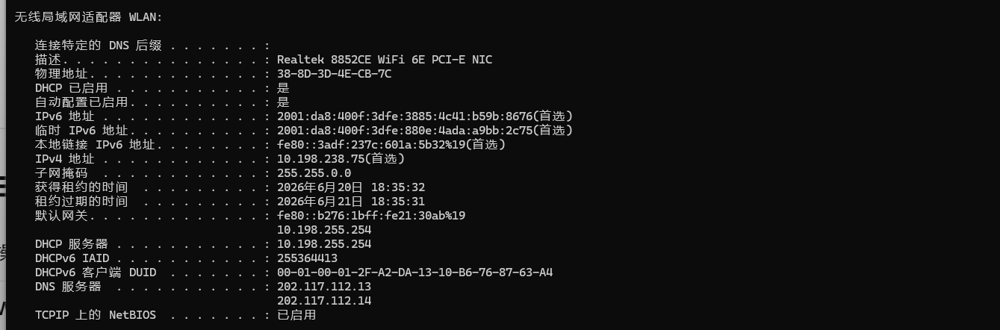 
   2. getmac /v 
      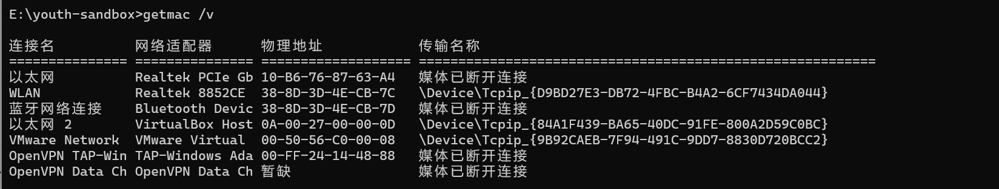 
2. linux
   1. ip link show
      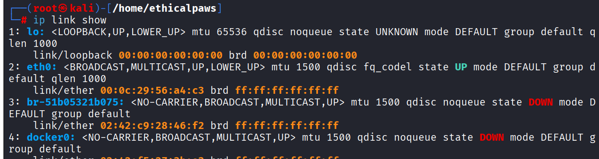 
   2. ifconfig -a 
      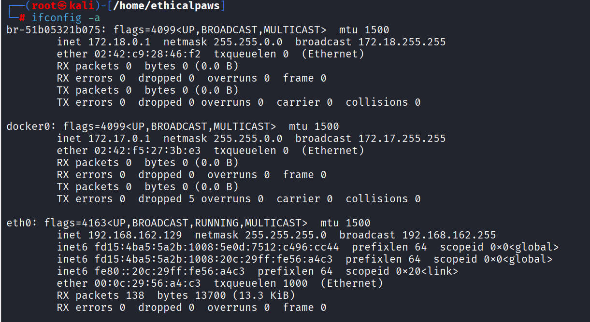  
### arp缓存
1. windows命令：
   - 查看缓存：arp -a
     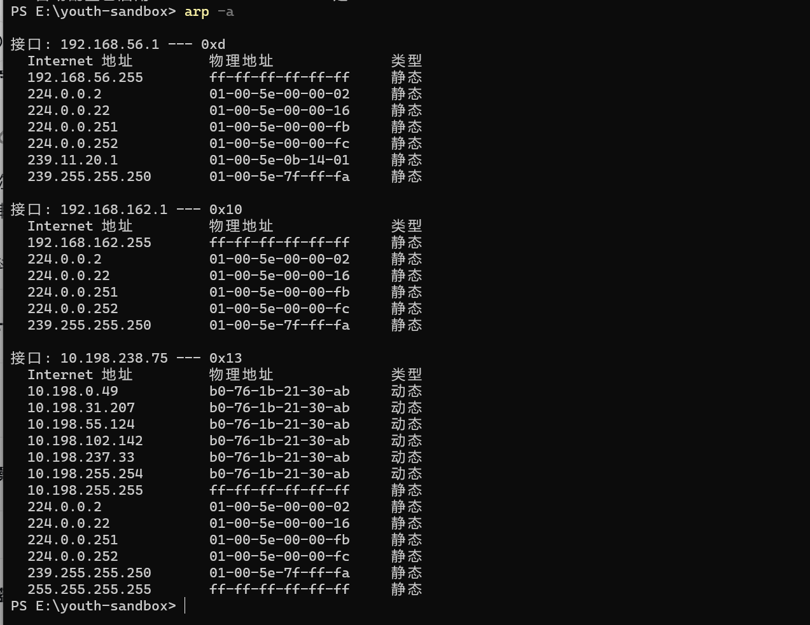 

   - 清除缓存：arp -d
   
   - 添加静态条目（需要管理员权限）：arp -s IP MAC

   动态条目：设备间通信的痕迹

   静态条目：系统预留或手动添加
2. linux命令：
   - 查看缓存：arp -n
     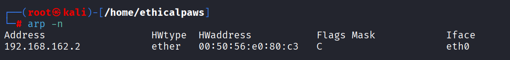 

   - 查看邻居表：ip neigh show
     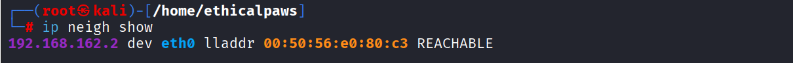
   
   - 清空arp缓存表：ip neigh flush all
     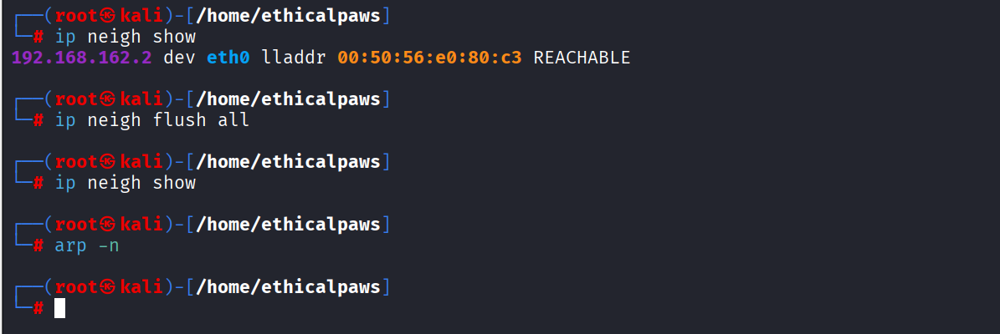   
   
   - 添加静态条目（需要root权限）：arp -s IP MAC
   
   - 删除指定ip的arp条目：arp -d IP
### 网络接口状态
1. windows
   1. 显示所有网络接口的状态（启用/禁用）：netsh interface show interface
   2. 禁用指定接口（需管理员）：netsh interface set interface "接口名" admin=disable
   3. 启用指定接口（需管理员）：netsh interface set interface "接口名" admin=enable 
2. linux
   1. 禁用指定接口：ip link set eth0 down
      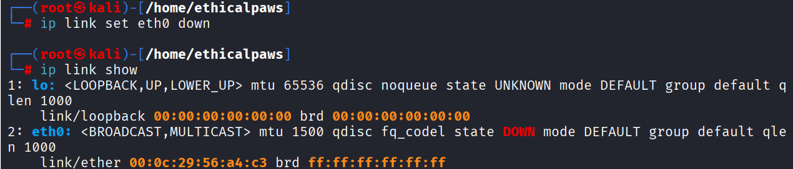 
   2. 启用指定接口：ip link set eth0 up
      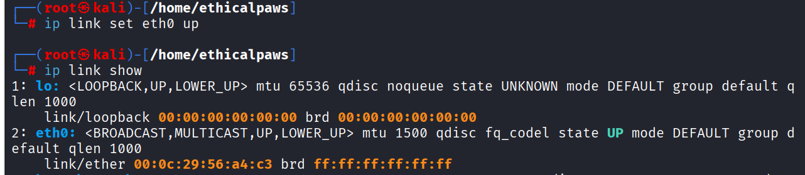 
   3. 开启混杂模式（接收所有流量，用于抓包）：ip link set eth0 promisc on
      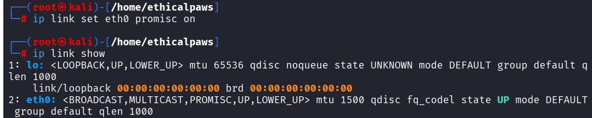 
   4. 关闭混杂模式：ip link set eth0 promisc off
      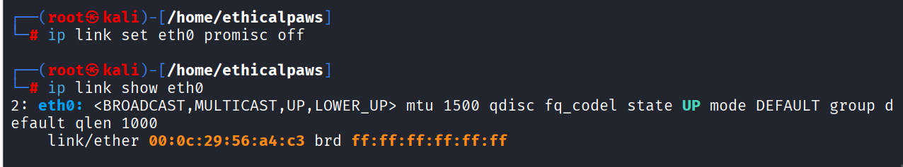 
### 查看网络连接与流量统计
1. windows
   1. 显示以太网统计信息（发送/接收的字节数、帧数）：netstat -e
      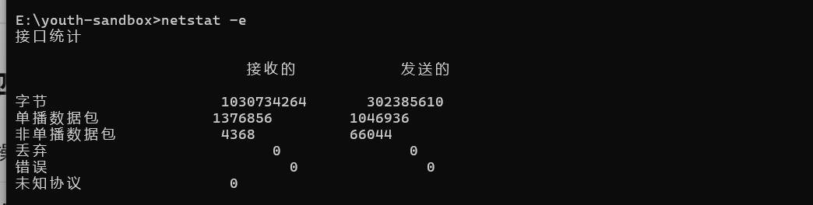 
   2. 显示各协议（IPv4、IPv6、TCP、UDP）的详细统计 ：netstat -s
      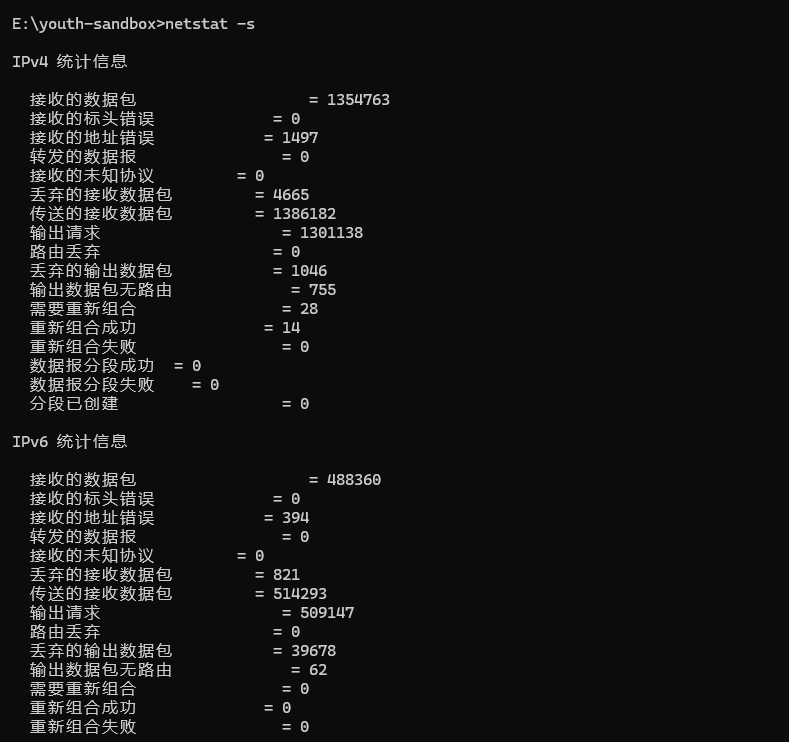 
2. linux
   1. 显示指定接口的详细流量统计：ip -s link show eth0 
      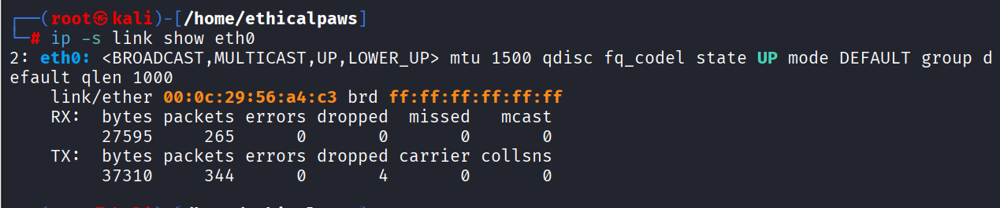 
   2. 显示接口流量统计（传统命令）：ifconfig eth0
      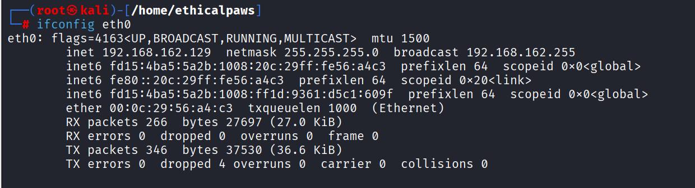 
   3. 显示所有网络接口的收发数据包统计：netstat -i
      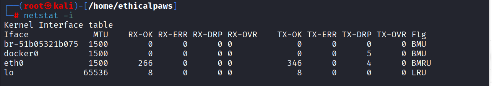 
### 数据链路层抓包相关（实战核心）
1. tcpdump
   1. 列出所有可用的网络接口（Linux）：tcpdump -D
      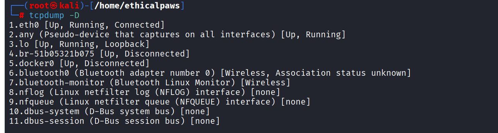 
   2. 抓取指定接口的所有数据包（需权限）：tcpdump -i eth0
   3. 抓包并显示数据链路层头部（包含源/目的MAC地址）：tcpdump -i eth0 -e
      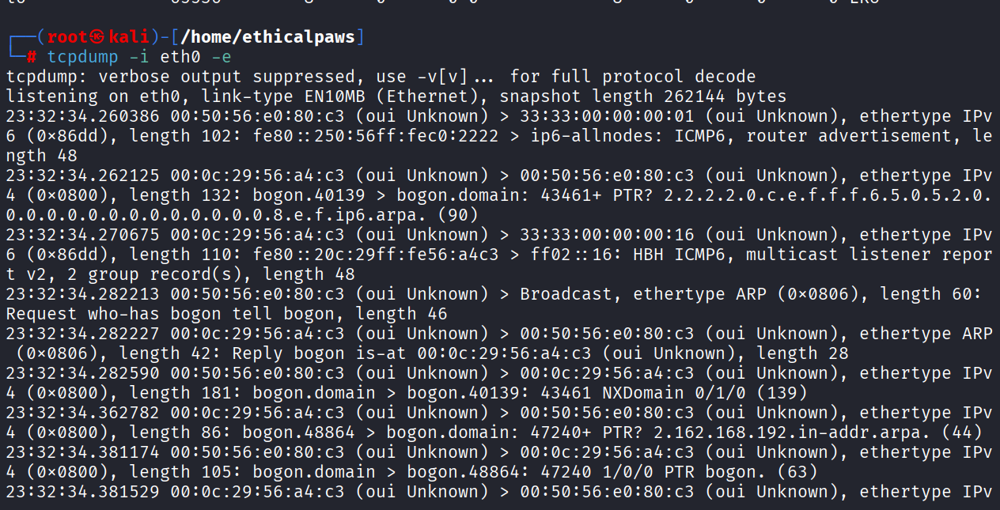 
   4. 只抓ARP包：tcpdump -i eth0 arp
   5. 只抓4个包：tcpdump -i eth0 -c 4
      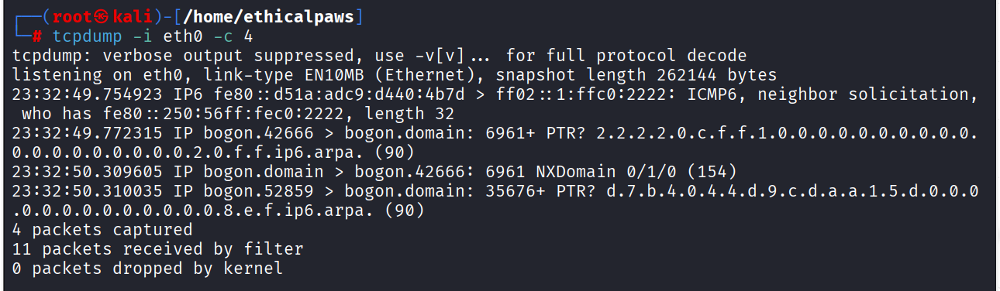 
2. wireshark
## 功能
1. 组帧（帧定界）
2. 透明传输（ESC）
3. 差错控制
4. 介质访问控制（MAC）
## ARP
1. MAC地址：全球唯一，每个接口一个，48位，前24位为厂商标识（IEEE分配），后24位是接口标识
2. ARP协议作用：地址解析协议，通过ip地址找MAC地址
## ARP缓存表
1. 位置：存在于主机中
2. 作用：记录了ip地址与MAC地址的映射关系，避免每次通信都广播ARP请求
## 以太网：
   - 快速以太网
   
   - 千兆、万兆以太网 
   
   - 最小帧长64B（包含14字节头部+4字节FCS+46字节数据）。这是为了确保CSMA/CD协议能检测到冲突 
## 交换机：
1. 作用：转发与过滤
2. MAC地址表
   - 位置：存在于交换机中
   - 作用：记录MAC地址和接口的对应关系，让交换机知道某目的MAC地址确定的数据包从交换机哪个端口转发出去   
   - 交换机自学习填表 
3. 交换机自学习过程：交换机通过源MAC地址来学习，建立MAC地址表。过程是：收到帧 -> 记录源MAC地址和端口 -> 查目的MAC地址表转发。
4. 优点
   
   - 无碰撞，性能好
   
   - 支持不同链路连接  
   
   - 方便网络管理

## 虚拟局域网（VLAN）
1. 把局域网通过交换机进行逻辑上的分割，形成一个个VLAN，每个VLAN是一个广播域
2. 分割是逻辑上的与物理位置无关
3. 抑制广播风暴，提高网络的安全性
