## 实验主题
• 防火墙
• Netfilter
• 使用 iptables 设置防火墙规则
• iptables 的各种应用
## 实验目的
1.理解iptables防火墙的工作原理及配置方法。
2.掌握防火墙规则的设计与应用，提升网络安全防护能力。
3.学习使用Docker构建虚拟网络实验环境。
4.掌握网络访问控制、流量限制和负载均衡等技术。
## 实验环境
网络拓扑
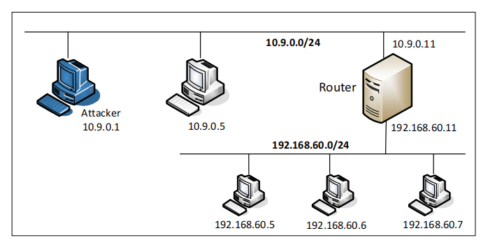
## 实验任务

### 任务一：防火墙规则的实验【iptables】
#### iptables使用方法
1. 三层结构
   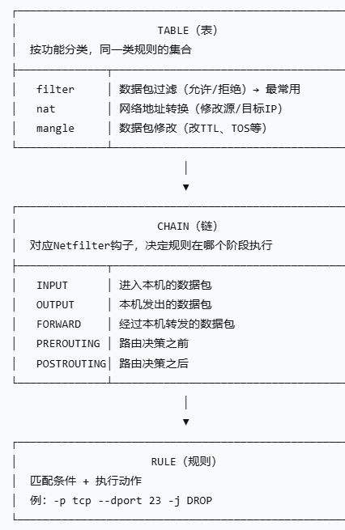 
2. 基本格式：`iptables -t 表名 -操作 链名 匹配规则 -j 动作`
#### A：保护路由器
1. 目标：
   在路由器上设置规则，实现：
   外部机器可以ping路由器
   外部机器不能telnet进入路由器
   其他所有流量默认拒绝
2. 规则解析
   ```bash
    # 1. 允许进入的ICMP回显请求（ping请求）
    iptables -A INPUT -p icmp --icmp-type echo-request -j ACCEPT

    # 2. 允许发出的ICMP回显回复（ping响应）
    iptables -A OUTPUT -p icmp --icmp-type echo-reply -j ACCEPT

    # 3. 设置OUTPUT链默认策略为DROP（默认丢弃所有发出的包）
    iptables -P OUTPUT DROP

    # 4. 设置INPUT链默认策略为DROP（默认丢弃所有进入的包）
    iptables -P INPUT DROP
   ```
3. 为什么默认规则要设为DROP
   安全原则：默认丢弃，只开放必要的服务 
   如果不设DROP，所有未匹配的包都会被默认ACCEPT
   这里我们只允许ICMP，其他所有流量（如telnet、ssh等）都会被拒绝
4. 具体操作
   进入路由器容器并配置iptables规则
   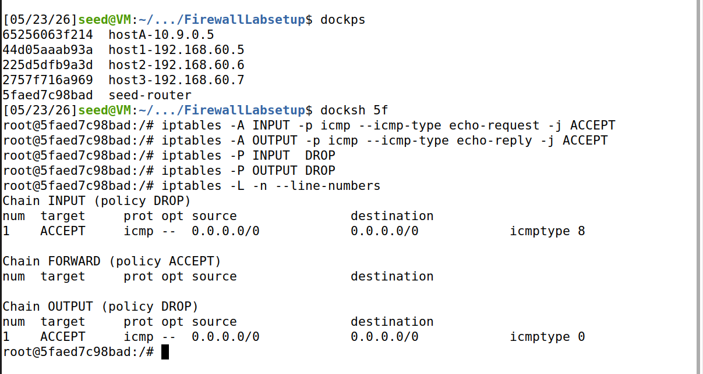
   查看iptables构造确认已经添加完成
5. 验证iptables配置是否生效
   进入攻击者容器执行`ping 10.9.0.11` 可以ping通
   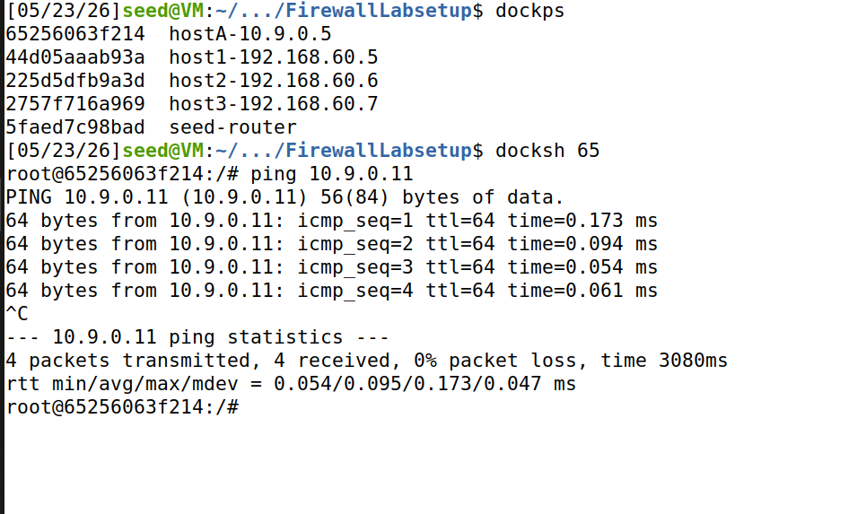
   尝试telnet连接`telnet 10.9.0.11` 显示超时因为INPUT默认DROP，telnet包被丢弃
   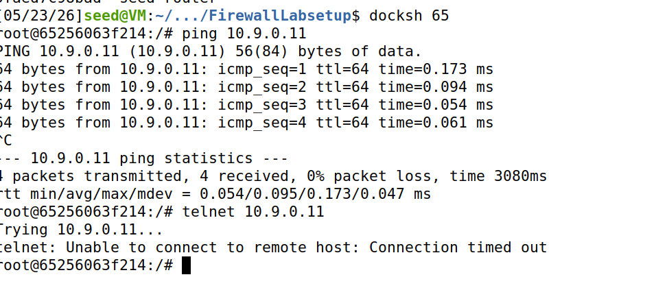
   全部符合预期
6. 清理规则:在继续下一个任务前，将 filter 表恢复到初始状态
   ```bash
   iptables -F
   iptables -P INPUT  ACCEPT
   iptables -P OUTPUT ACCEPT
   ``` 
#### B：保护内部网络
1. 目标
   在路由器上设置FORWARD链规则，实现：
   外部主机不能ping内部主机
   外部主机可以ping路由器
   内部主机可以ping外部主机
   其他所有转发流量默认阻止
2. 数据包流向分析
   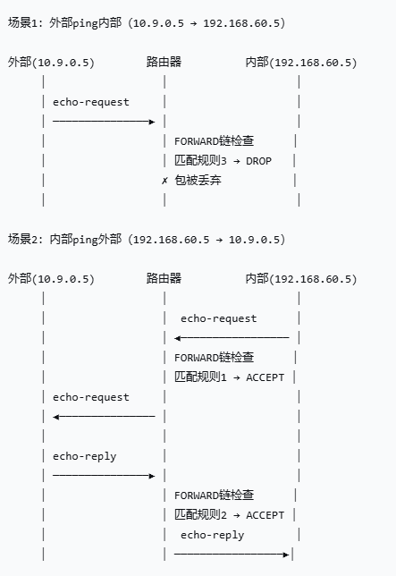 
3. 规则解析
   ```bash
    # 1. 允许内部主机发出的ping请求（从内部到外部）
    iptables -A FORWARD -s 192.168.60.0/24 -p icmp --icmp-type echo-request -j ACCEPT

    # 2. 允许返回的ping响应（从外部到内部）
    iptables -A FORWARD -d 192.168.60.0/24 -p icmp --icmp-type echo-reply -j ACCEPT

    # 3. 阻止外部发起的ping请求（从外部到内部）
    iptables -A FORWARD -d 192.168.60.0/24 -p icmp --icmp-type echo-request -j DROP

    # 4. 设置FORWARD链默认策略为DROP
    iptables -P FORWARD DROP
   ``` 
4. 具体操作
   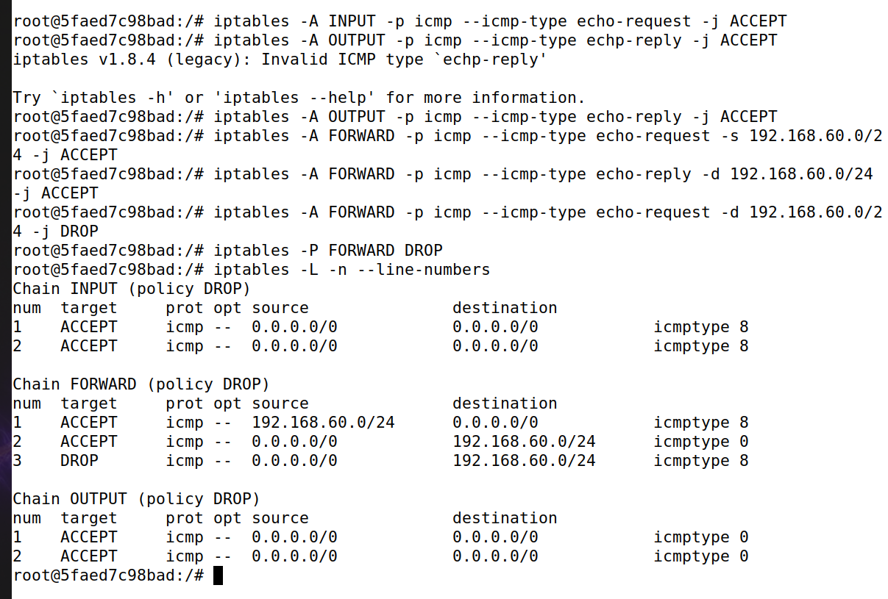 
5. 验证配置是否有效
   在攻击者容器中执行`ping -c 4 192.168.60.5`,请求超时ping不通
   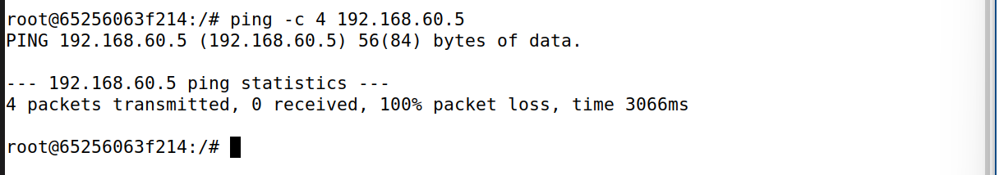
   在攻击者容器中执行`ping 10.9.0.11`,可以ping通
   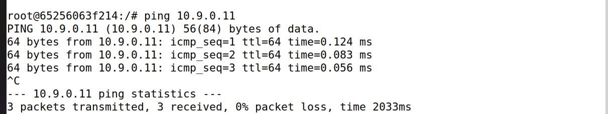
   进入内网容器执行`ping 10.9.0.5`,可以ping通
   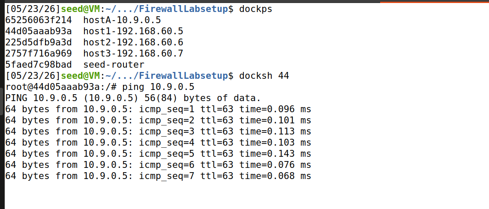
6. 清理规则:在继续下一个任务前，将 filter 表恢复到初始状态
   ```bash
   iptables -F
   iptables -P FORWARD ACCEPT
   ``` 
   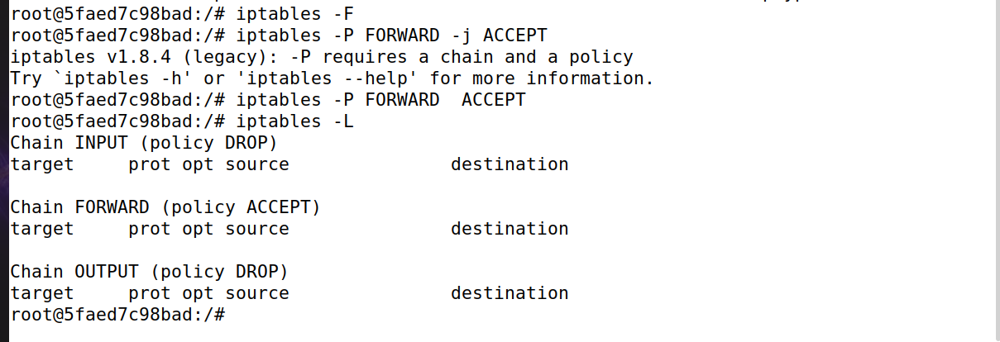
#### 保护内部服务器
1. 目标：实现精细的TCP访问控制
   外部只能访问192.168.60.5的telnet服务（端口23）
   外部不能访问其他内部服务器
   内部主机可以互访
   内部主机不能访问外部服务
2. 规则：
   ```bash
    # 1. 允许外部到192.168.60.5:23的请求（从外部到内部）
    iptables -A FORWARD -i eth0 -p tcp -d 192.168.60.5 --dport 23 -j ACCEPT

    # 2. 允许192.168.60.5:23返回的响应（从内部到外部）
    iptables -A FORWARD -i eth1 -p tcp -s 192.168.60.5 --sport 23 -j ACCEPT

    # 3. 允许内部主机之间的所有流量
    iptables -A FORWARD -s 192.168.60.0/24 -d 192.168.60.0/24 -j ACCEPT

    # 4. 设置FORWARD链默认策略为DROP
    iptables -P FORWARD DROP

   ``` 
3. 具体操作
   先查看网络接口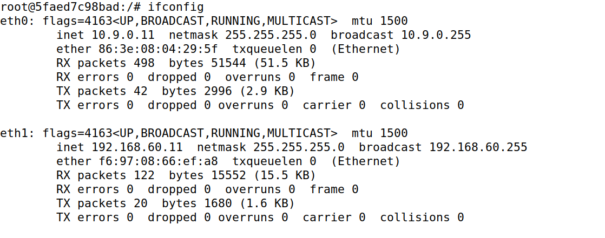
   eth0对应外部网络，eth1对应内部网络 
   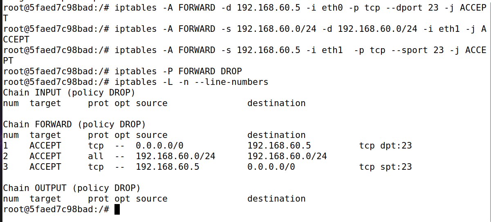
4. 验证配置
   在攻击者容器中执行`telnet 192.168.60.5`可以连接成功
   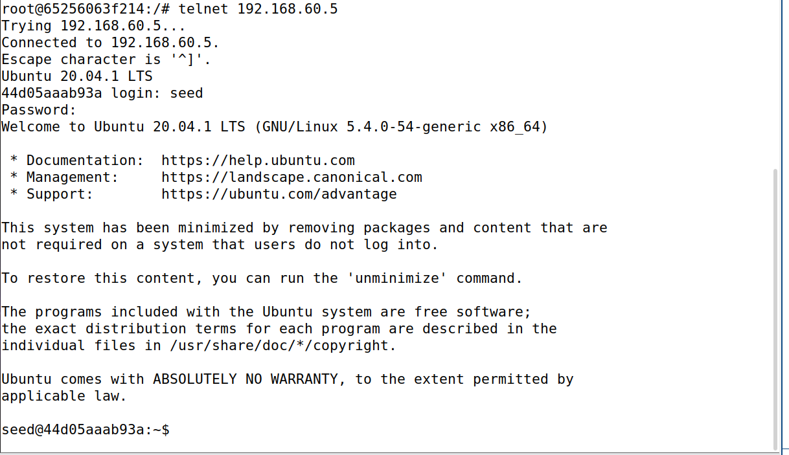
   尝试执行`telnet 192.168.50.6`访问内网中的其他服务器的telnet服务，超时连接失败
   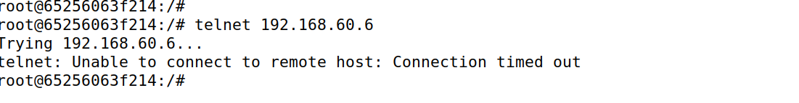 
   在内网服务器中执行`telnet 192.168.60.6`尝试访问内网其他服务器的telnet服务，访问登录成功
   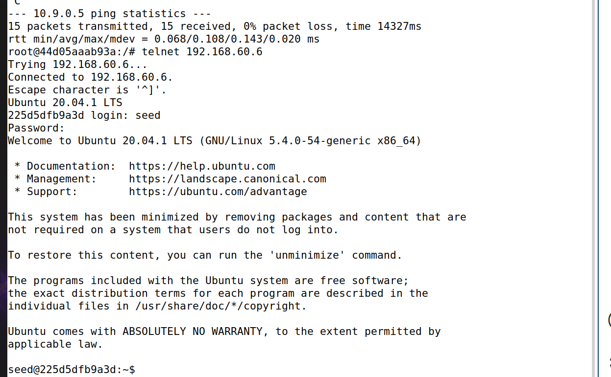
   在内网服务器中执行`telnet 10.9.0.5`尝试访问外网服务器的telnet服务，超时连接失败
   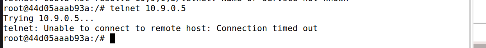
5. 清理规则
   ```bash
    iptables -F
    iptables -P Forward ACCEPT
   ``` 
   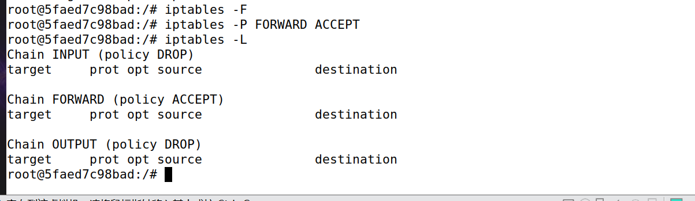
### 任务二：连接追踪与有状态防火墙
在上一个任务中，我们只设置了无状态防火墙，逐个检查每个数据包。然而，数据包通常不是独立的；它们可能是某个 TCP 连接的一部分，或者它们可能是由其他数据包触发的 ICMP 数据包。将数据包独立处理并不会考虑其上下文，因此可能导致不准确、不安全或复杂的防火墙规则。例如，如果我们希望仅允许在建立连接之后才能进入网络的 TCP 数据包，使用无状态数据包过滤器是无法轻松实现的，因为当防火墙检查每个单独的 TCP 数据包时，它无法知道该数据包是否属于一个已建立的连接，除非防火墙为每个连接维护一些状态信息,这样做，它就变成了有状态防火墙
#### A：连接追踪实验
通过内核中的 conntrack 模块来实现追踪连接
`conntrack -L`检查路由器容器上的连接追踪信息
目标:通过一系列实验帮助理解此追踪机制中的连接概念，特别是对于 ICMP 和UDP 协议，因为与 TCP 协议不同，它们没有连接。请进行以下实验。每个实验后，描述观察结果并解释
1. ICMP 实验：运行以下命令并检查路由器上的连接追踪信息。描述ICMP 连接状态保持多久？
    ```bash
    // 在 10.9.0.5 上，发送 ICMP 数据包
    ping 192.168.60.5
    ```
    1. 在路由器容器中执行命令`watch -n 1 "conntrack -L | grep -E 'icmp|192.168.60.5'"`持续监视conntrack
       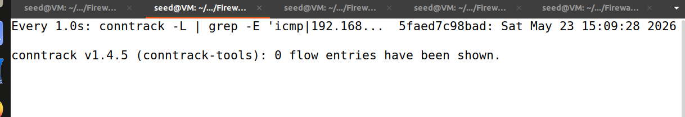
    2. 在攻击者容器中执行`ping 192.168.60.5` 
       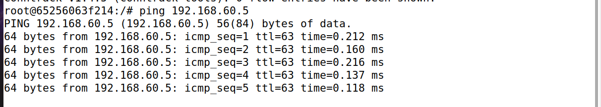
    3. 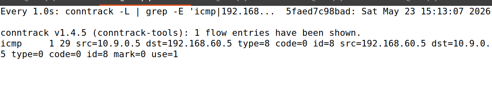
       ```
       icmp     1 29 src=10.9.0.5 dst=192.168.60.5 type=8 code=0 id=10 src=192.168.60.5 dst=10.9.0.5 type=0 code=0 id=10 mark=0 use=1
       ``` 
       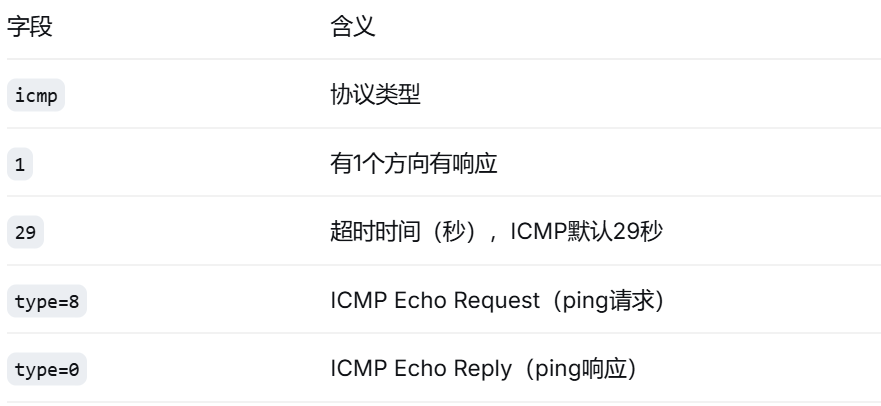 
    4. 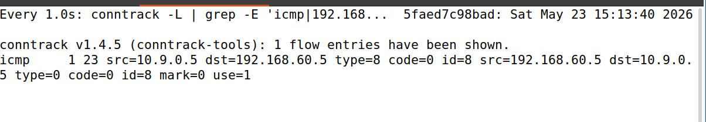
       ICMP虽然没有真正的"连接"，但conntrack会创建临时条目,默认超时时间：约30秒.ping完成后，条目仍会保留一段时间才消失
2. UDP实验：运行以下命令并检查路由器上的连接追踪信息。描述UDP 连接状态保持多久？
    ```bash
    // 在 192.168.60.5 上，启动一个 netcat UDP 服务器
    nc -lu 9090
    // 在 10.9.0.5 上，发送 UDP 数据包
    nc -u 192.168.60.5 9090
    输入一些内容，然后回车
    ```
    1. 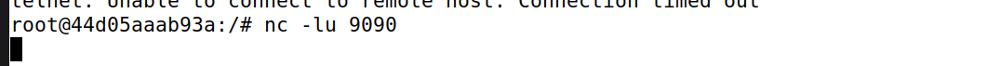
    2. 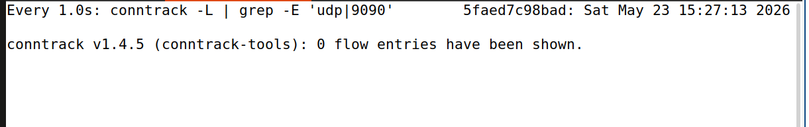
    3. 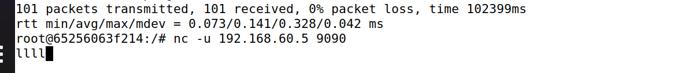
    4. 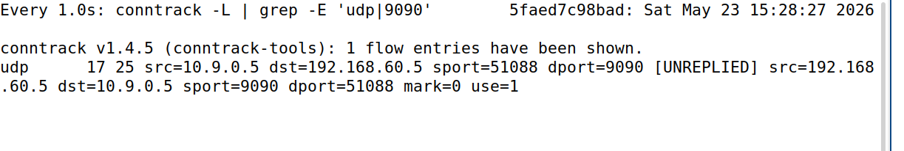
       ```bash
        udp      17 29 src=10.9.0.5 dst=192.168.60.5 sport=51088 dport=9090
          [UNREPLIED] src=192.168.60.5 dst=10.9.0.5 sport=9090 dport=51088s mark=0 use=1
       ```
        
    5. UDP是"无连接"协议，但conntrack仍会创建伪连接,默认超时时间：约30秒（比TCP短）发送数据后，条目立即创建，约30秒后消失    
3. TCP实验：运行以下命令并检查路由器上的连接追踪信息。描述TCP 连接状态保持多久？
    ```bash
    // 在 192.168.60.5 上，启动一个 netcat TCP 服务器
    nc -l 9090
    // 在 10.9.0.5 上，发送 TCP 数据包
    nc 192.168.60.5 9090
    输入一些内容，然后回车
    ```
    1. 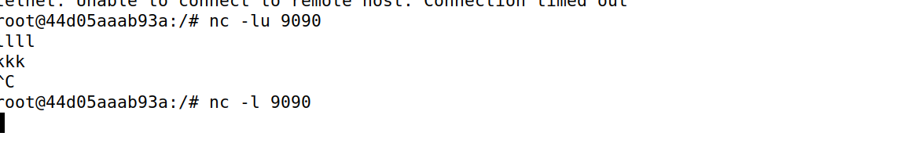
    2. 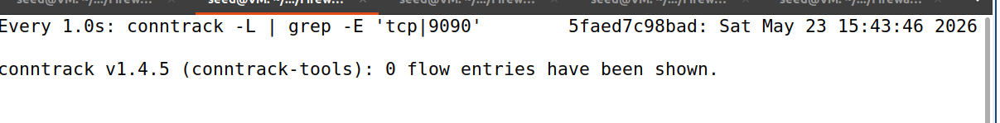
    3. 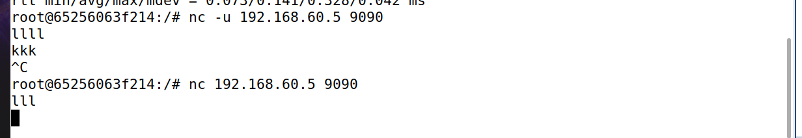
    4. 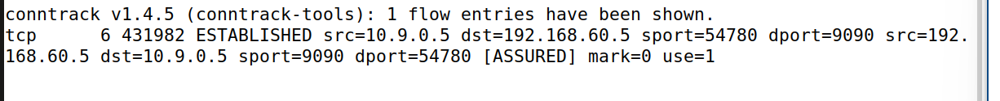
    5. 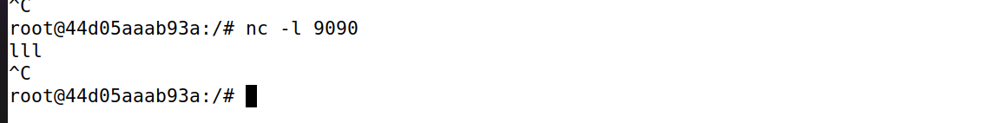
    6. 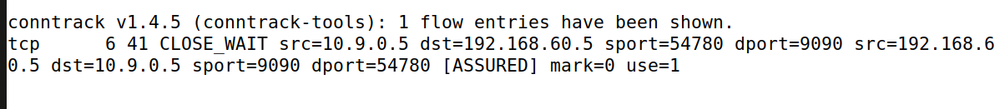
    7. 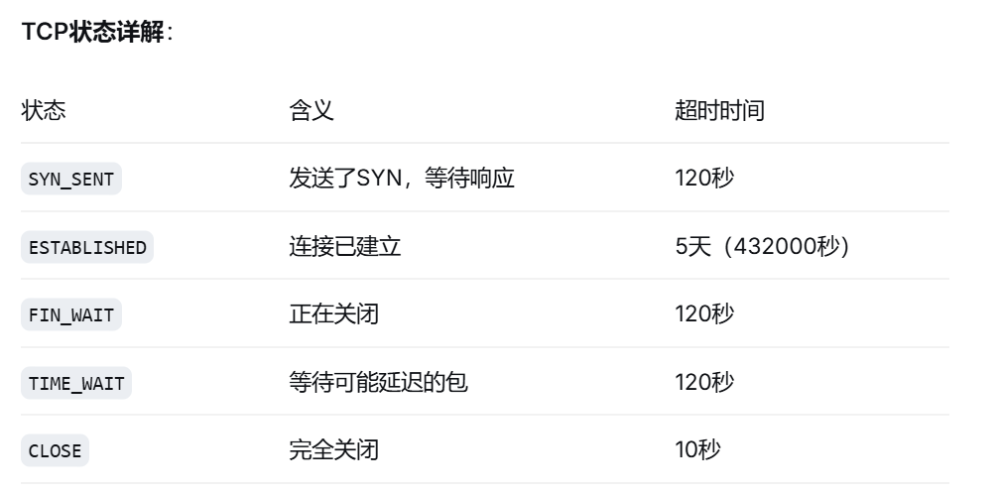
       TCP连接有完整的状态机,ESTABLISHED状态超时时间非常长（5天），适合长连接,conntrack会跟踪TCP的每个状态转换 
#### B：设置有状态防火墙
任务要求
在任务2.C的基础上，新增一个功能
允许内部主机访问任何外部服务器
同时保留任务2.C的所有原有要求：
外部只能访问 192.168.60.5:23（telnet）
外部不能访问其他内部主机
内部主机可以互访
```bash
# 规则1：外部访问特定内部服务器
iptables -A FORWARD -i eth0 -p tcp -d 192.168.60.5 --dport 23 \
         -m conntrack --ctstate NEW -j ACCEPT

# 规则2：内部访问外部
iptables -A FORWARD -i eth1 -s 192.168.60.0/24 \
         -m conntrack --ctstate NEW -j ACCEPT

# 规则3：已建立和相关连接
iptables -A FORWARD -m conntrack --ctstate ESTABLISHED,RELATED -j ACCEPT

# 规则4：内部互访
iptables -A FORWARD -s 192.168.60.0/24 -d 192.168.60.0/24 -j ACCEPT

# 规则5：默认拒绝
iptables -P FORWARD DROP
```
具体操作
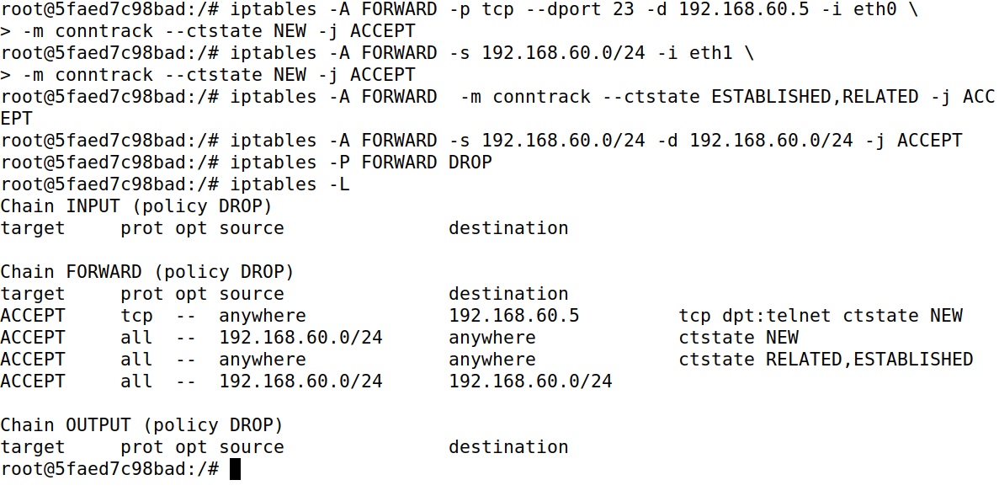
检测配置是否生效
外部只能访问内部特定服务器
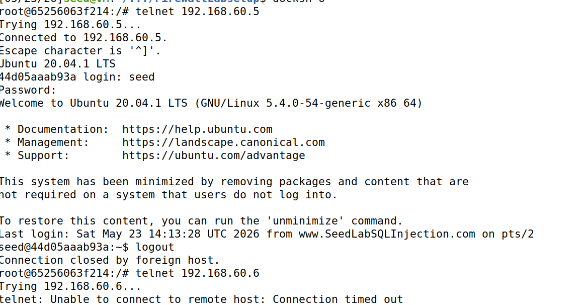
内部可以访问外部
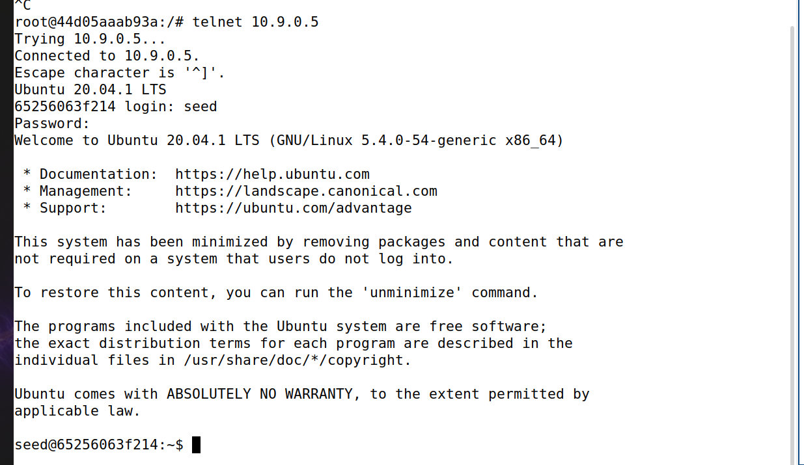
内部可以访问内部
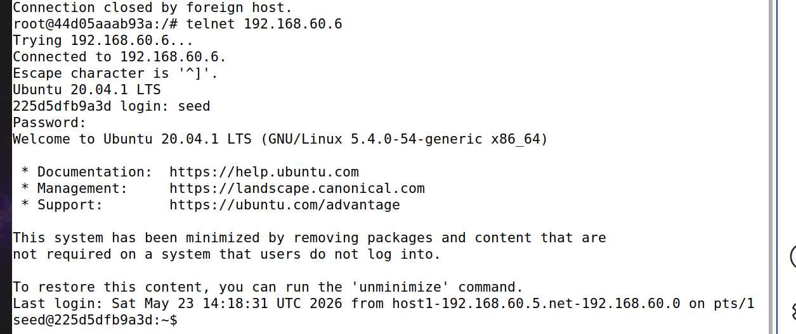
如果不使用连接追踪，如何实现内部访问外部？需要为每个目标IP、每个端口写规则，不可行
端口数量巨大：TCP/UDP各有65535个端口
外部IP无限：无法枚举所有外部服务器
动态端口：很多服务使用随机端口（如RPC、FTP）
规则爆炸：防火墙性能会严重下降
清除规则
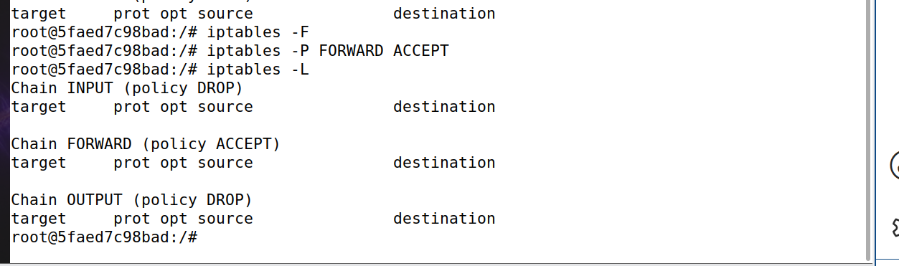
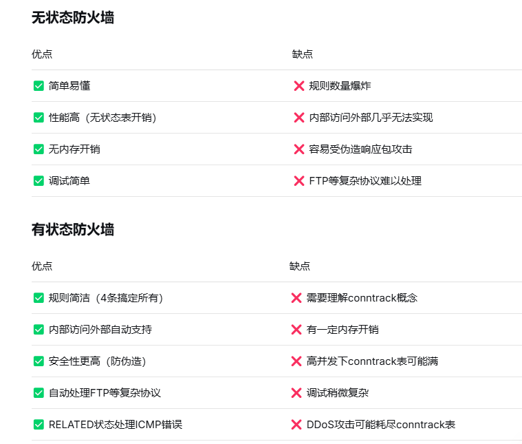
### 任务三：限制网络流量
规则
```bash
//限流规则
iptables -A FORWARD -s 10.9.0.5 -m limit --limit 10/minute --limit-burst 5 -j ACCEPT
//丢弃规则
iptables -A FORWARD -s 10.9.0.5 -j DROP
```
1. 只设置第一条规则，不设置第二条规则
   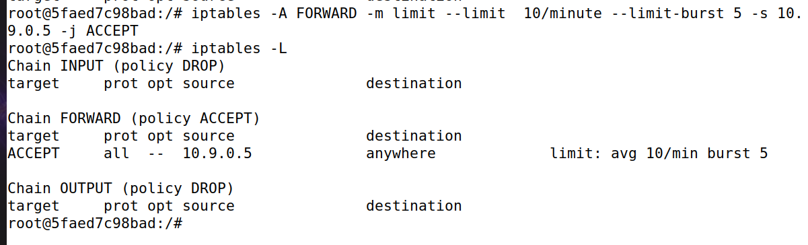 
   ping 192.168.60.5
   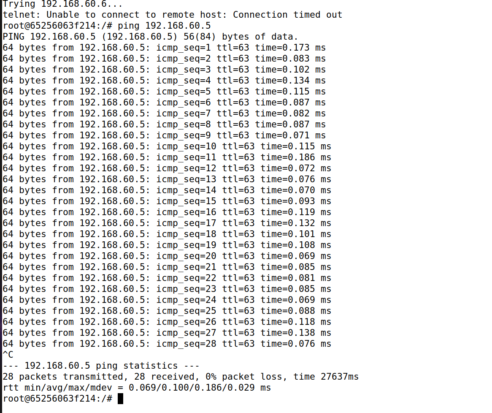没有达到限流效果，因为默认不匹配的包也会转发
2. 配置第二条规则
   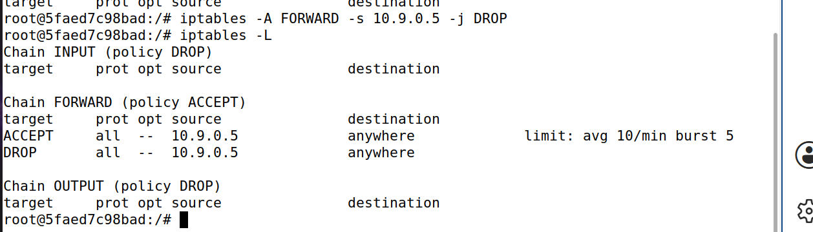
   ping 192.168.60.5 
   可以看到前五个包seq号是连续的后面就开始出现丢包现象，说明达到了限流效果
   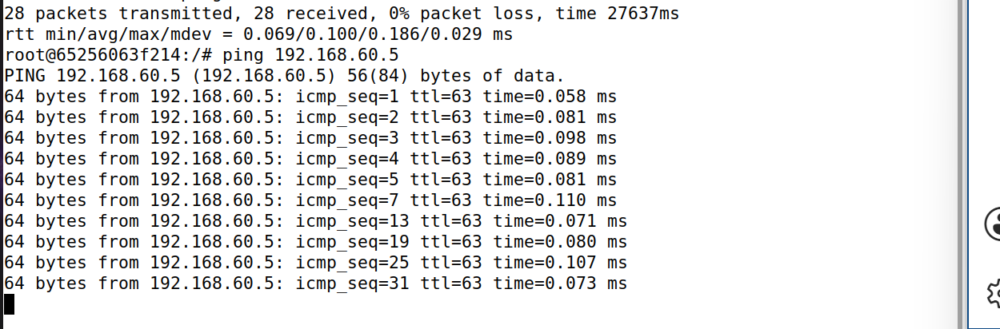
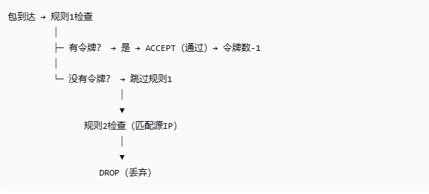

清除规则
```bash
iptables -F
iptables -P FORWARD
```
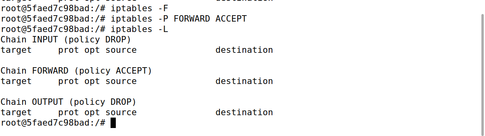
### 任务四：负载均衡
分别在三个主机中启动服务器
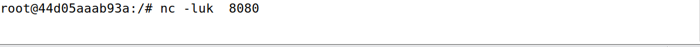
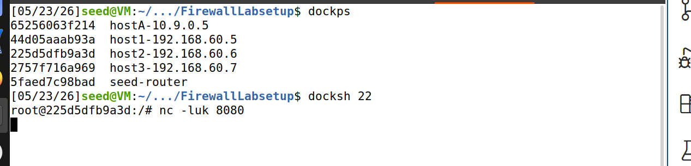
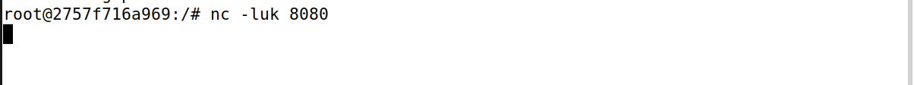
#### 使用 nth 模式（轮询）
1. 原理：nth模式按照固定顺序分发数据包，实现轮询负载均衡。
    数据包到达顺序：
   包1 ──► 匹配 packet=0 ──► 转发到 192.168.60.5
   包2 ──► 匹配 packet=1 ──► 转发到 192.168.60.6
   包3 ──► 匹配 packet=2 ──► 转发到 192.168.60.7
   包4 ──► 匹配 packet=0 ──► 转发到 192.168.60.5
   包5 ──► 匹配 packet=1 ──► 转发到 192.168.60.6
   包6 ──► 匹配 packet=2 ──► 转发到 192.168.60.7
   ...
2. 完整规则
   ```bash
    # 规则1：每3个包中的第0个（第1个）→ 服务器1
    iptables -t nat -A PREROUTING -p udp --dport 8080 \
            -m statistic --mode nth --every 3 --packet 0 \
            -j DNAT --to-destination 192.168.60.5:8080

    # 规则2：由于没有被第一条规则匹配的数据包不会被丢弃，所以第二条规则接着去匹配未被第一条匹配的数据包，每两个数据包这的第一个被匹配转发给服务器2
    iptables -t nat -A PREROUTING -p udp --dport 8080 \
            -m statistic --mode nth --every 2 --packet 0 \
            -j DNAT --to-destination 192.168.60.6:8080

    # 规则3：前两条都没有匹配上的数据包直接设置默认匹配给服务器三
    iptables -t nat -A PREROUTING -p udp --dport 8080 \
            -j DNAT --to-destination 192.168.60.7:8080
   ``` 
3. 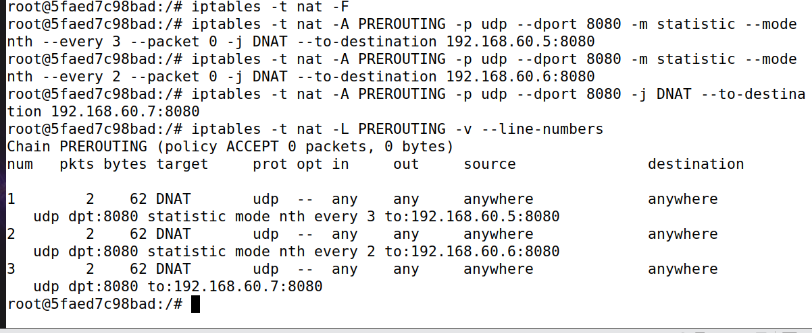
4. 检验配置是否生效
   发送6个数据包
   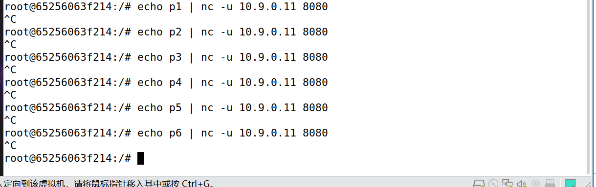
   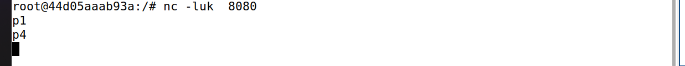
   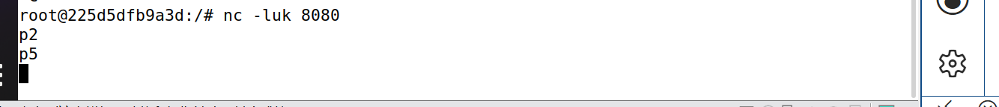
   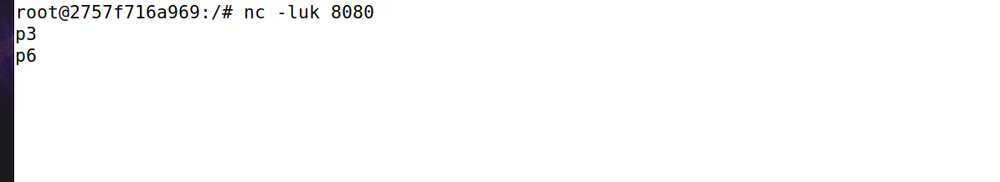
   三台主机分别收到了两个数据包
#### 使用 random 模式
规则
```bash
# 规则1：33%的流量 → 服务器1
iptables -t nat -A PREROUTING -p udp --dport 8080 \
         -m statistic --mode random --probability 0.33 \
         -j DNAT --to-destination 192.168.60.5:8080

# 规则2：剩余流量的50% → 服务器2
iptables -t nat -A PREROUTING -p udp --dport 8080 \
         -m statistic --mode random --probability 0.5 \
         -j DNAT --to-destination 192.168.60.6:8080

# 规则3：剩余的流量 → 服务器3（不需要probability）
iptables -t nat -A PREROUTING -p udp --dport 8080 \
         -j DNAT --to-destination 192.168.60.7:8080
```
路由器配置
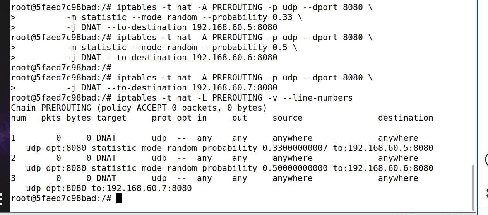
目标：三台服务器各约33%的流量
第1条规则 (P=0.33)：
  33%的包 → 服务器1
  67%的包继续
第2条规则 (P=0.5，但只针对剩下的67%的包)：
  67% × 0.5 = 33.5%的包 → 服务器2
  剩下的33.5%的包继续
第3条规则（无概率）：
  剩下的约33.5%的包 → 服务器3
最终分布：~33% / ~33% / ~33%
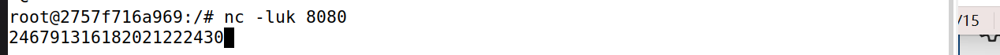
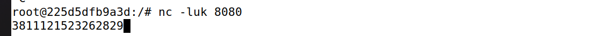
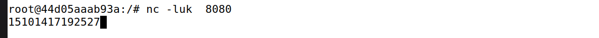
发现主机三收到的数据包数量要多于主机二和一一点，可能数据包量太少了，在尝试发送多一些数据包
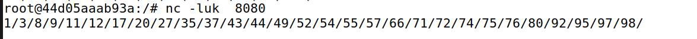
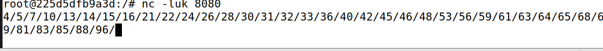
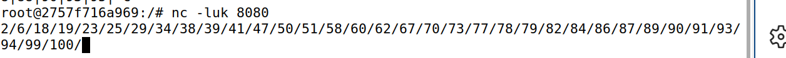
这次三个数据收到的数据包的数量差的就更小了
#### 两种模式对比
nth模式（轮询）
特性	    说明
分布特性	完全均匀，严格轮转
短期分布	非常均匀（1,2,3,1,2,3...）
适合场景	请求处理时间相近的服务
优点	    预测性强，完全公平
缺点	    如果某台服务器慢，会拖慢整体
random模式（随机）
特性	    说明
分布特性	概率均匀，长期接近相等
短期分布	可能有波动（连续分到同一台）
适合场景	请求处理时间差异大，或服务器性能不同
优点	    实现简单，可配合权重
缺点	    短期可能不均衡
### 问题与思考
1. 在1.C实验中为什么iptables规则要-i指定网络接口
   因为FORWARD链处理的是双向流量，需要明确区分数据包的“进入方向”来精确控制规则，-i 指定数据包从哪个网络接口进入路由器，这决定了数据包的来源是外部网络还是内部网络
   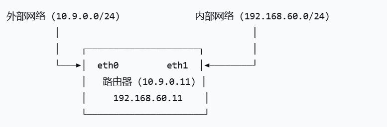 
   如果没有 -i 会怎样
   ```bash
    # 错误写法：没有指定接口
    iptables -A FORWARD -p tcp -d 192.168.60.5 --dport 23 -j ACCEPT
    iptables -A FORWARD -p tcp -s 192.168.60.5 --sport 23 -j ACCEPT
    ```
   问题：这两条规则会匹配任何方向的流量，可能导致
   内部主机伪造源IP绕过规则
   无法精确控制谁可以发起连接
