# 网络层
>网络层的核心就一句话：让数据包从源主机到达目的主机

## 常用命令
### windows
1. 查看IP地址与子网掩码：ipconfig 
   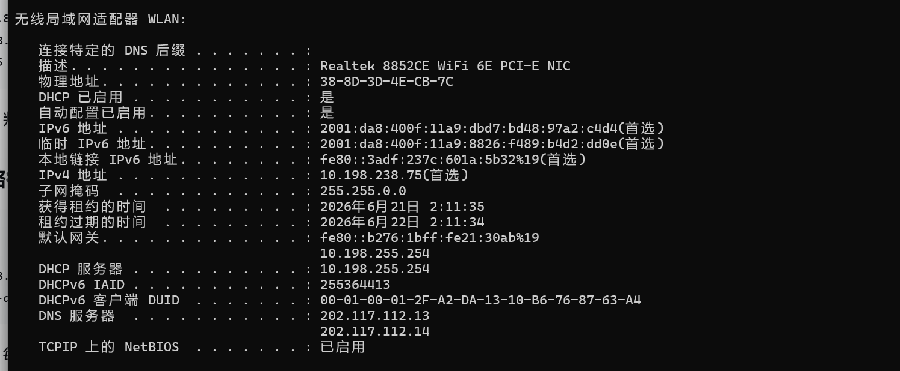 
2. 查看完整网络配置（含DHCP、DNS）：ipconfig /all
    
3. 查看路由表：route print
   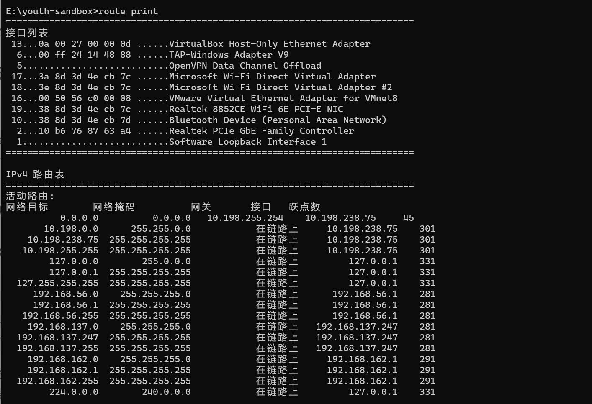 
4. 操作路由表（管理员权限）
    
   ```
   # 添加静态路由（持久化：-p）
   route add -p 192.168.10.0 mask 255.255.255.0 192.168.1.1

   # 删除指定路由
   route delete 192.168.10.0

   # 修改默认网关
   route change 0.0.0.0 mask 0.0.0.0 192.168.1.254
   ```
   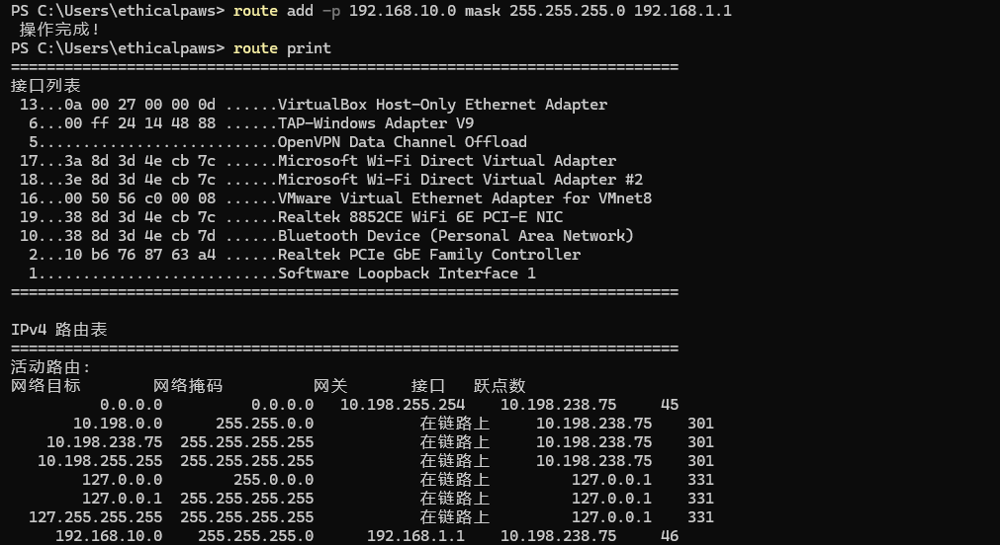
   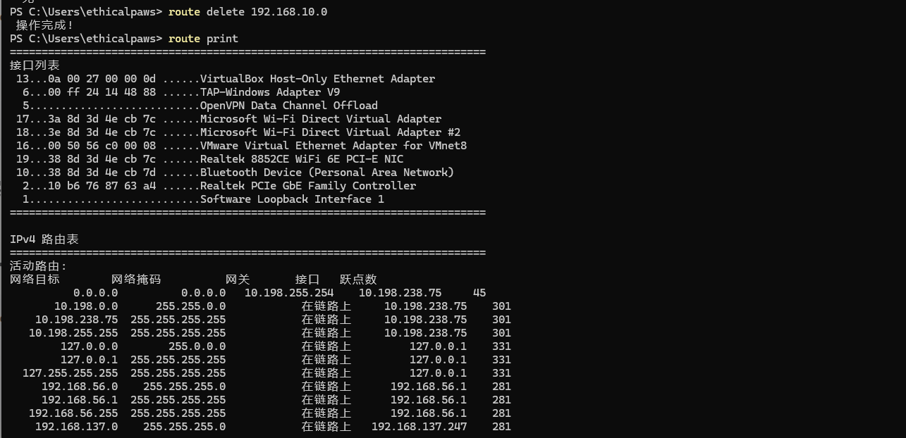
   实战场景
   默认网关劫持：如果已获得管理员权限，可以将目标的默认网关改为自己的IP（假设为 192.168.1.100），同时开启IP转发。之后，目标所有外网流量都会先经过自己
   注意：此操作会中断未开启转发时的所有外网访问，容易被发现。通常更隐蔽的做法是ARP欺骗，而非修改路由表
5. 测试连通性
   ```
   ping 8.8.8.8
   ping -t 8.8.8.8   # 持续ping，Ctrl+C停止
   ping -n 6 8.8.8.8 # 只发6个包
   ```  
   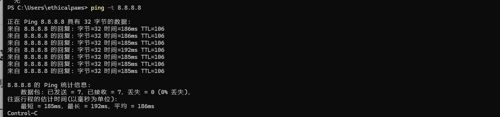
   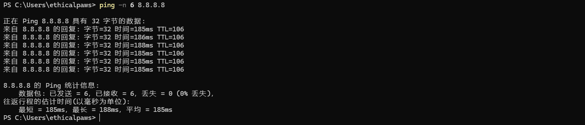
6. 追踪路径
   ```
   tracert 8.8.8.8
   tracert -d 8.8.8.8 # 不解析主机名，更快
   ``` 
   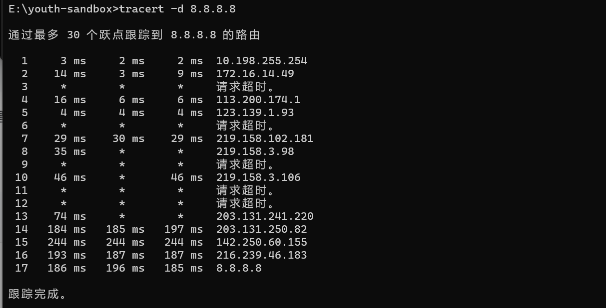
### linux
1. 查看IP地址与子网掩码：ifconfig、ip addr show、ip a
   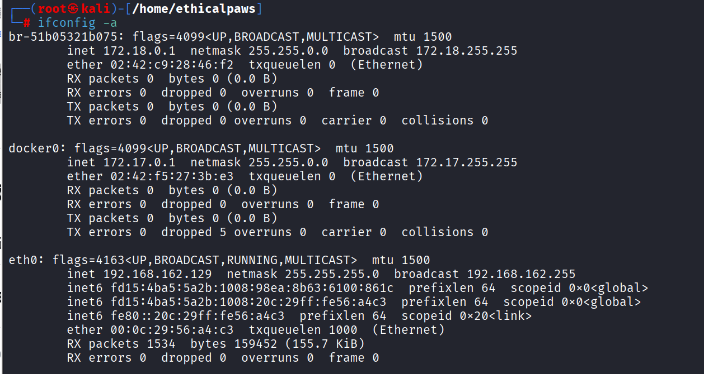 
   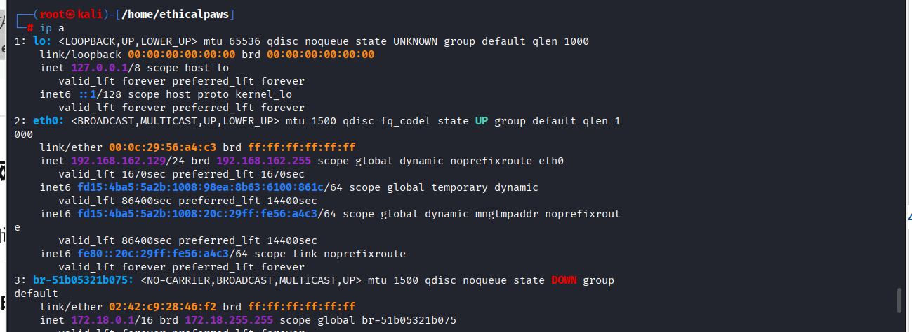
   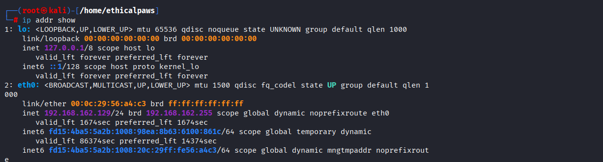
2. 查看路由表（核心）：ip route show、ip r、rpute -n
   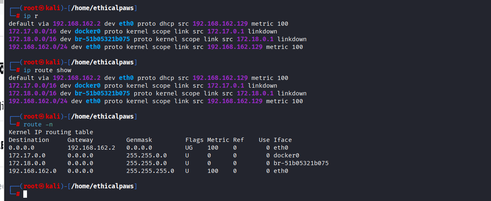 
   ```
   default via 那一行就是默认网关
   192.168.1.0/24 dev eth0 表示直连网段
   via表示下一跳IP
   ``` 
3. 操作路由表（需要root权限）
   ```
   # 添加静态路由
   sudo ip route add 192.168.10.0/24 via 192.168.1.1

   # 删除路由
   sudo ip route del 192.168.10.0/24

   # 修改默认网关
   sudo ip route change default via 192.168.1.254

   # 传统方式（route命令）
   sudo route add -net 192.168.10.0 netmask 255.255.255.0 gw 192.168.1.1
   ```
   
   
   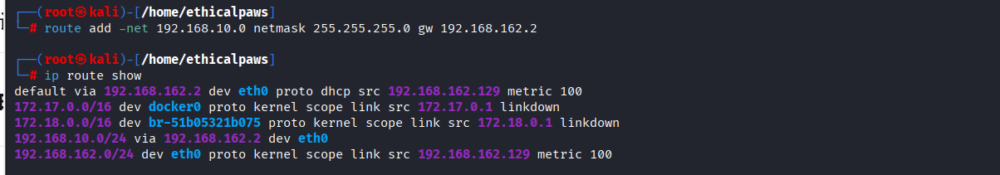
   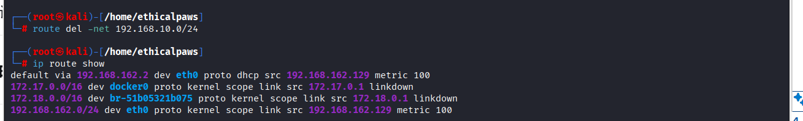
4. 查看IP转发状态（渗透测试常用）
   ```
   # 查看当前状态（0=关闭，1=开启）
   cat /proc/sys/net/ipv4/ip_forward

   # 临时开启（重启后失效）
   echo 1 > /proc/sys/net/ipv4/ip_forward

   # 永久开启
   # 编辑 /etc/sysctl.conf，取消注释或添加：
   net.ipv4.ip_forward=1
   # 然后执行
   sudo sysctl -p
   ``` 
   
   
   实战意义：当做流量转发或搭建VPN时，必须开启IP转发
5. 测试连通性
   ```
   # 指定次数
   ping -c 6 8.8.8.8

   # 指定间隔（秒）
   ping -i 2 8.8.8.8
   ```
   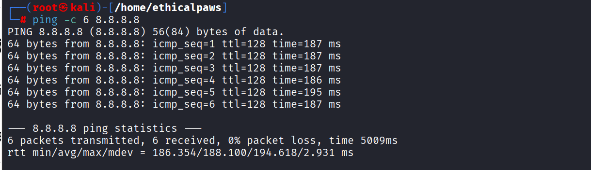

6. 追踪路径
   ``` 
   # 不解析主机名
   traceroute  -n 8.8.8.8 

   # 使用ICMP而非UDP（某些网络环境需要）
   traceroute -I 8.8.8.8
   ```
   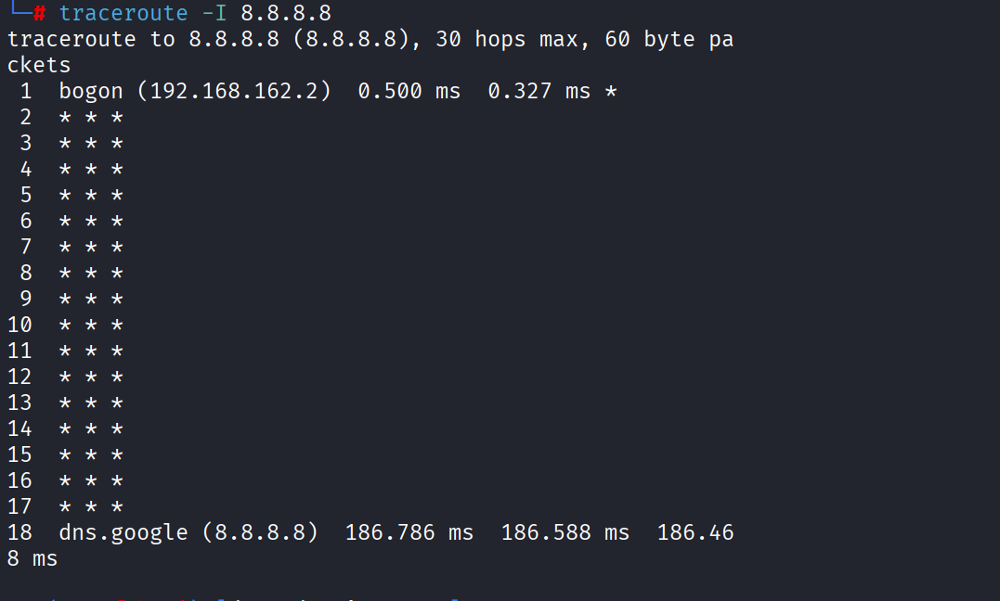
   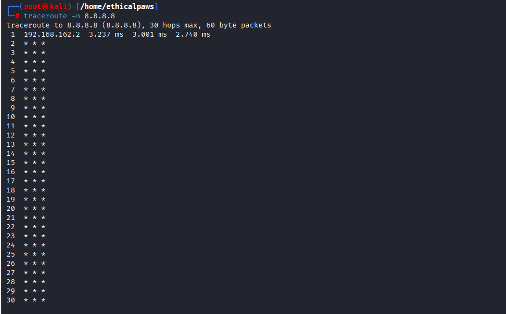
## IP协议
1. IP地址与子网掩码
2. IP数据报格式【wireshark抓包查看】
## ARP协议具体工作过程
1. 主机A在局域网中发送ARP请求报文，内容是我想要与IP地址为xx的主机通信，但不知道你的MAC地址，请告诉我你的MAC地址
2. 交换机将广播包从除了与主机A相对应接口的其他接口发送出去
3. 只有与目的IP地址一致的主机（假设为主机B）才会返回ARP响应报文，告诉主机A自己的MAC地址，其他主机收到广播报文后会自动丢弃
4. 主机A收到响应报文后会在自己的ARP缓存表中记录主机B的ip和MAC地址的映射关系
5. 主机B收到主机A的ARP请求报文后会记录主机A的ip和MAC地址的映射关系
6. 如果目录通信主机与主机A不在同一局域网中，那么找到的就是网关
## 其他重要协议
### DHCP协议
1. 作用：为网络中的主机自动分配IP地址
2. 工作流程
   ```
   1. 发现阶段（Discover）：DHCP客户机发送广播请求寻找DHCP服务器
   2. 提供阶段（Offer）：DHCP服务器收到客户机的广播请求后向客户机提供IP地址和其他配置信息
   3. 选择阶段（Request）：客户机选择某一DHCP服务器提供的IP地址
   4. 确认阶段（Ask）：被选择的DHCP服务器确认所提供的IP地址
   ```
3. 细节 
   ```
   1. 端口：DHCP服务器监听 UDP 67，客户端使用 UDP 68。
   2. 租约（Lease）：IP不是永久分配给你的，有租约时间（默认通常是24小时）。租约过半时，客户端会尝试续租。
   3. 广播 vs 单播：Discover和Request通常是广播（因为客户端还不知道DHCP服务器在哪），Offer和Ack可以是广播或单播。
   4. 多台DHCP服务器：客户端可能收到多个Offer，但只会选一个，然后通过Request广播告知所有DHCP服务器自己的选择。
   ```
4. 实战
   1. DHCP欺骗：在内网里，如果攻击者运行一个伪造的DHCP服务器（如dnsmasq），可以给客户端分配恶意IP（指向攻击者）或恶意DNS，实现中间人攻击。
   2. 判断网络环境：ipconfig、ip addr显示IP是自动获取的（DHCP Enabled: Yes），说明网络有DHCP服务
   3. 发现网关、DNS：ipconfig /all 、ip addr show可以看到DHCP下发的默认网关和DNS服务器，属于内网信息收集的一部分
   4. 环节ipv4短缺：DHCP是缓解IPv4地址不足的重要手段（动态分配，IP可以回收再利用）
### ICMP协议
1. 不传输用户数据，而是传递网络本身的状态信息。由于ip协议只是尽可能交付但不保证可靠，icmp协议可以提高ip数据报成功交付的几率
2. 功能
   1. 确认ip包是否到达目的地
   2. 提供ip数据包未成功交付的原因
3. 类型
   1. 差错报告报文【终点不可达、源点抑制、超时、参数问题、改变路由（重定向）】
   2. 询问报文【回送请求和回答（ping）、时间戳请求和回答（用于网络时钟同步）】
4. 差错报告报文格式
   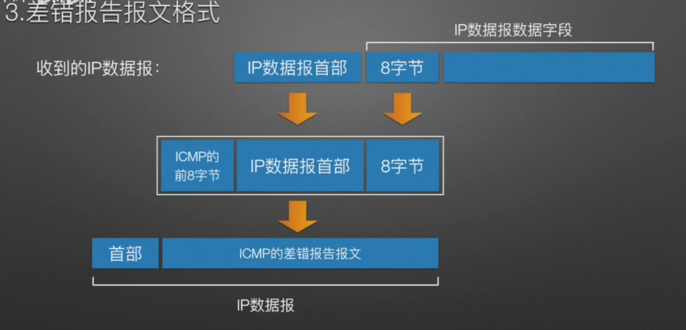 
5. 应用示例
   1. ping：ping命令是应用层直接使用网络层icmp的例子（没有经过传输层UDP或tcp）
   2. tracert：用来追踪一个数据包从源主机到目的主机经过的路径（利用TTL【生存时间】字段）
      ```
      先将ttl设为1，然后数据包中封装不可交付的udp数据，ttl减少为0还未到达目的主机就会给源主机返回一个超时的icmp报文收到该报文后将ttl加1后再次发送报文，以此类推直到数据包可以到达目的主机，由于封装不可交付的udp数据，因此目的主机会返回一个终点不可达的icmp报文，源主机收到该报文后就知道数据包已经到达目的主机由此就探测出路径
      ``` 
6. 实战关联
   ```
   1. 内网主机发现：ping【用 ping 扫整个网段：for /l %i in (1,1,254) do ping -n 1 192.168.1.%i，看哪些IP有回复】
   2. 网络路径探测：ttl【用 tracert / traceroute 了解网络拓扑，判断经过多少跳、是否有防火墙】
   3. icmp隧道绕过防火墙：将数据封装在ICMP Echo报文中【防火墙常放行ICMP，可用工具如 icmptunnel 或 ptunnel 建立隐蔽通道，实现数据外传或远程访问】
   4. DoS：ICMP Flood【发送大量ICMP请求，耗尽目标带宽或CPU资源】
   5. ICMP重定向：中间人攻击【攻击者伪造路由器的重定向报文，告诉受害者“所有去往外网的流量都发给攻击者”，实现流量劫持（类似ARP欺骗的效果，但发生在网络层）】
   ```
### NAT协议
1. 网络地址转换协议——使主机能够通过私有IP地址访问互联网
   
2. 类型
   ```
   1. 静态NAT：一个私网IP ↔ 一个公网IP（一对一固定映射）
   2. 动态NAT：私网IP从公网IP池中随机获取映射（用完即释放）
   3. NAPT（端口多路复用）：多个私网IP共享一个公网IP，用端口号区分不同连接
   ```
3. NAT表：公网ip:端口 <————>私有ip:端口
4. 工作原理（关键点：外网看到的永远是路由器的IP（1.2.3.4），内网IP对外完全不可见）：
   ```
   1. 发送：你的电脑发出请求包 → 源IP: 192.168.1.100:12345，目的IP: 14.215.177.39:80
   2. 转换（NAT）：路由器收到包，把源IP换成自己的公网IP（比如 1.2.3.4），并分配一个新端口号（比如 56789）。同时，它在NAT表里记下一笔：
   3. 发送到外网：百度收到的请求源地址是 1.2.3.4:56789
   4. 响应返回：百度响应包发给 1.2.3.4:56789
   5. 反向转换：路由器查NAT表，把包再发给你的电脑 192.168.1.100:12345
   ```
5. 优点
   1. 不同网关NAT路由器对应的私有IP地址可以重复，大大减缓了ipv4地址不够用的压力
   2. 提高本地网络的安全性 
6. 实战关联
   ```
   1. 内网信息收集：你在内网里，通过 ipconfig 看到的是私有IP（如192.168.x.x），说明你在NAT后面【需要通过上线C2、端口转发等方式打通出网通道】
   2. 反向shell：因为NAT，外网主动连接不了内网机器【反向连接是标配：主动连C2服务器，利用NAT的出网特性建立通道】
   3. 判断是否存在NAT：tracert看第一跳是不是私有IP（如192.168.1.1）【如果是，就知道自己在一个NAT网络里】
   4. 端口映射：如果想从外网访问内网某台机器的端口（如RDP），需要在路由器上做端口转发【内网穿透的基本思路，域渗透中常见】
   ```
## 路由
1. 默认路由
   ``` 
   网络目标 0.0.0.0：匹配所有IP地址

   网关 10.198.255.254：所有无法匹配更精确路由的流量，都发到这个IP。

   接口 10.198.238.75：从本机的这个IP发出。
   ```
2. 直连网络路由
   ```
   网络目标 10.198.0.0/16：匹配所有 10.198.x.x 的IP。

   网关 在链路上：表示这个网段是直接连接在接口上的，不需要经过路由器转发。

   当你想访问 10.198.100.50 时，系统匹配到这条路由，直接在局域网内发ARP请求找目标，不经过网关。
   ``` 
### 路由表
1. 当系统要发送一个数据包时，它按以下顺序做决策：
   ```
   最长前缀匹配：从路由表中找出所有能匹配目的IP的条目，选择子网掩码最长（即最精确）的一条。

   如果没有匹配的：使用默认路由（0.0.0.0/0）。

   ARP请求：确定下一跳IP后，查ARP缓存找MAC地址，然后封装成帧发送。
   ```
2. 实战关联
   ```
   1. 信息收集：了解目标主机的网络拓扑：它连接了哪些网段？默认网关是谁？有没有其他网段的路由？
   2. 判断网络环境：判断目标是在公网还是内网。如果网关是 192.168.x.x、10.x.x.x、172.16-31.x.x，说明它在一个内网里。
   3. 横向移动准备：如果路由表里有到 192.168.10.0/24 的路由，说明这台主机能访问该网段，可以作为跳板。
   4. 添加路由（已控跳板）：让已控主机能访问原本不可达的内网段，扩大攻击面。
   5. 流量劫持：将攻击者主机添加为默认网关需要管理员权限，把所有外网流量引向攻击者（需开启IP转发），实现中间人。
   ```

