# 传输层
> 传输层解决的是 “数据如何从一台机器的应用程序，可靠或高效地交给另一台机器的应用程序”。核心是两种协议：TCP（可靠） 和 UDP（不可靠）

## 常用命令
### windows
1. 查看所有TCP和UDP连接（包括监听和已建立）：netstat -an
   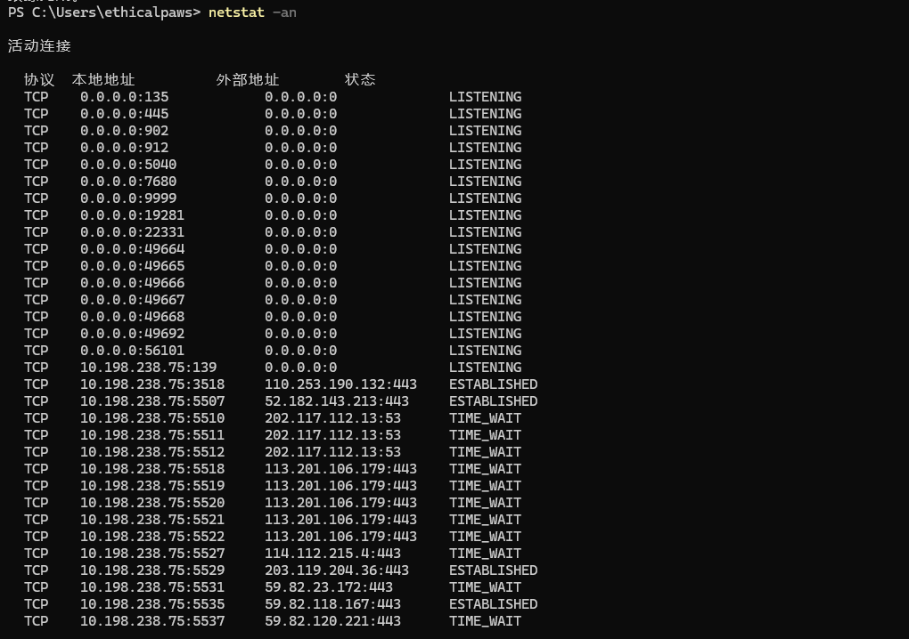 
   实战价值：
   
   - 快速判断哪些服务在运行（3389说明RDP开启，445说明SMB开启）

   - 检测异常连接（如后门程序连接外网C2）

2. 查看进程占用的端口，在 -an 基础上增加 -o 显示每个连接所属的进程ID（PID）：netstat -ano
   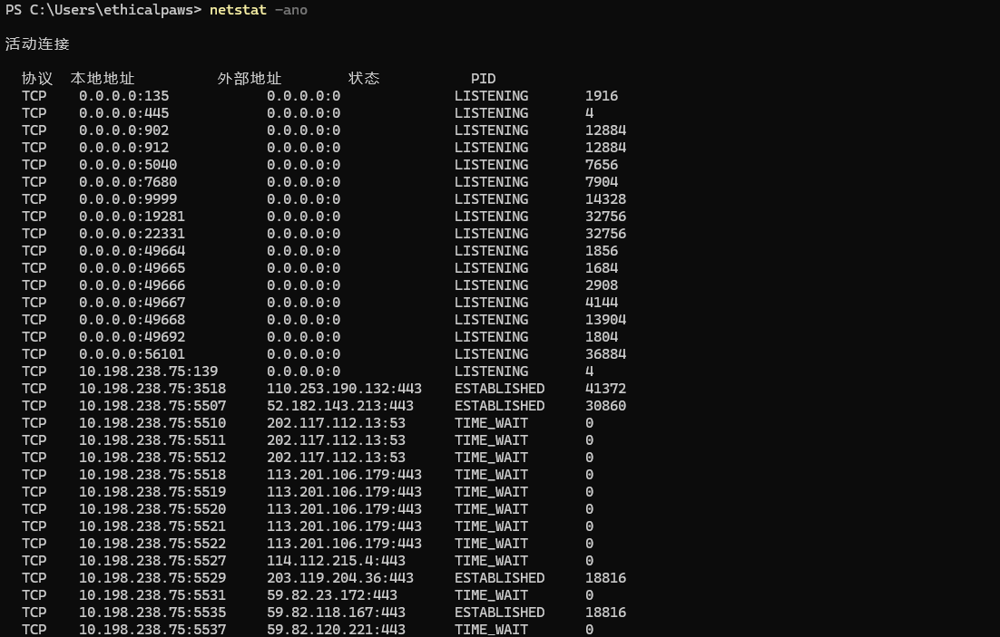 
   实战价值：

   - 找到异常端口后，用 tasklist | findstr PID 定位具体进程

   - 例如：tasklist | findstr 1234 → svchost.exe，可以进一步判断是否是正常系统进程

3. 查看端口归属进程：tasklist | findstr PID
   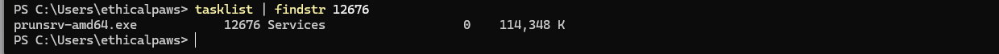 
4. 显示进程名称，需管理员权限：netstat -b【-b 需要管理员权限，且运行较慢。实战中通常先用 -ano 获取PID，再用 tasklist 查进程名】
5. 测试TCP连接：telnet IP 端口
   PowerShell原生命令：Test-NetConnection IP -port 端口 
6. 端口转发/代理：netsh interface portproxy
   ```
   # 添加转发：本机8888端口 → 转发到 10.198.238.100:3389
   netsh interface portproxy add v4tov4 listenport=8888 connectaddress=10.198.238.100 connectport=3389

   # 查看转发规则
   netsh interface portproxy show all

   # 删除转发规则
   netsh interface portproxy delete v4tov4 listenport=8888
   ``` 
   实战价值：

   - 跳板：拿到一台Windows主机后，用它做流量转发，访问内网其他机器的RDP/Web服务

   - 隐藏C2：将流量转发到内网隐蔽端口

### linux
1. 查看所有连接/端口（加 -p 显示进程名和PID）
   ```
   netstat -an
   netstat -anp
   ss -tuln
   ss -tulnp
   ``` 
   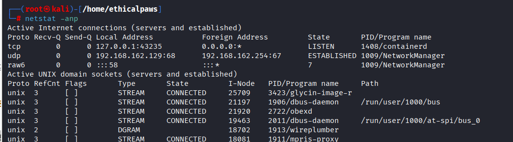
   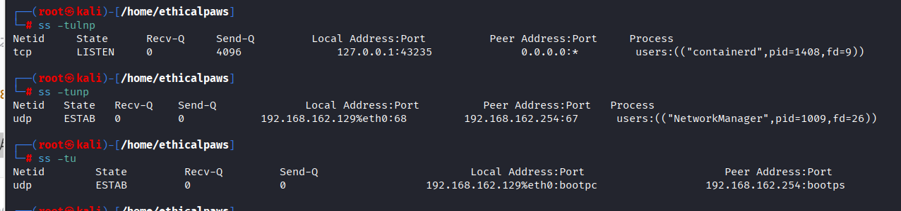
2. 查看端口对应的进程
   ```
   lsof -i :端口号
   ``` 
   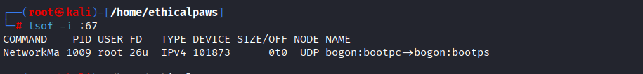
   实战价值：

   - 快速确认某个端口（如 443）是哪个程序在监听
   
   - 在渗透测试中，判断目标端口背后的服务类型（如Nginx、Apache、自定义后门）
3. 测试TCP、UDP连接
   ```
   nc -vz IP 端口号
   nc -uvz IP 端口号
   ```
   -v 显示详细信息

   -z 仅测试连通性，不发送数据

   需要安装 netcat：sudo apt install netcat-traditional
   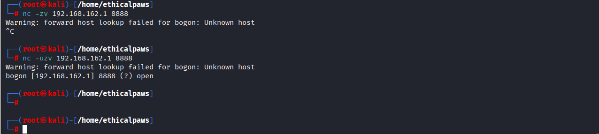

4. socat（端口转发/代理），比 netcat 更强大的网络工具，常用于渗透测试中的流量转发和隧道搭建。
   ```
   # 监听本机8888端口，转发到目标10.198.238.100:3389
   socat TCP-LISTEN:8888,fork TCP:目标ip:端口

   # 将本机80端口转发到本地8080端口（常用于端口复用）
   socat TCP-LISTEN:80,fork TCP:127.0.0.1:8080
   ``` 
   实战价值：

   - 搭建跳板，将外网访问转为内网访问

   - 反向Shell的流量转发

   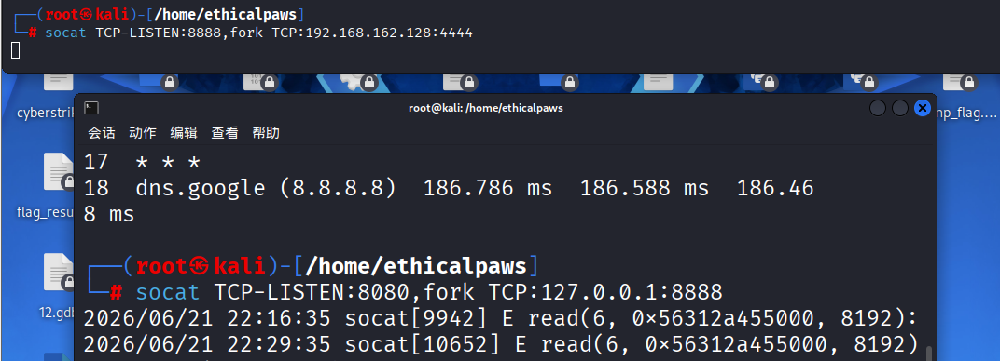
5. iptables（NAT/端口转发）,Linux内核防火墙，可用于端口转发
   ```
   # 将本机8888端口的TCP流量转发到目标ip端口
   sudo iptables -t nat -A PREROUTING -p tcp --dport 8888 -j DNAT --to-destination 目标ip:端口号

   # 启用IP转发（必须
   sudo sysctl -w net.ipv4.ip_forward=1
   ``` 
6. tcpdump（抓包验证传输层）
   ```
   tcpdump -i 网络接口 tcp -n

   tcpdump -i 网络接口 udp -n

   tcpdump -i 网络接口 port 80 -n
   ``` 
   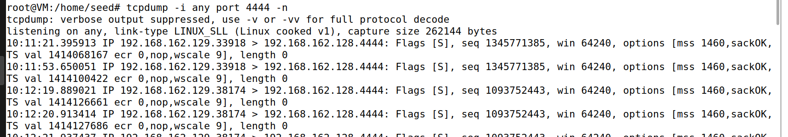
## 端口号
1. 标识每台主机上的每个进程的“门牌号”，0-65535
   常用端口号
   ```
   80：HTTP
   443：HTTPS
   22：SSH
   20：FTP（数据）
   21：FTP（控制）
   23 ：Telnet
   25：SMTP
   53：DNS
   67：DHCP
   110：POP3
   143：IMAP
   1099：RMI
   1389：LDAP
   3389：RDP
   445：SMB
   3306：MySQL
   1433：SQL Server
   1521：Oracle
   6379：Redis
   ``` 
2. nmap扫描端口判断开放的服务
## TCP
1. 特点：面向连接，可靠，有序，流量控制，拥塞控制，差错控制，首部最少20字节
2. 重要字段
   ```
   源端口/目的端口
   序号（SN）
   确认号（AN）
   标志位（URG/ACK/PSH/RST/SYN/FIN）
   数据偏移
   窗口
   ``` 
3. 三次握手
   ```
   主机A（客户端）                             主机B（服务器）
   |                                              |
   |  1. SYN=1, SN=100, AN=0                      |
   |  ------------------------------------------> |
   |          (请求建立连接)                       |
   |                                              |
   |  2. SYN=1, ACK=1, SN=200, AN=101             |
   |  <------------------------------------------ |
   |          (同意建立连接，确认你的SN+1)          |
   |                                              |
   |  3. ACK=1, SN=101, AN=201                    |
   |  ------------------------------------------> |
   |          (确认收到服务器的SYN)                 |
   |                                              |
   |         连接建立，开始传输数据                 |
   ```    
4. 四次挥手
   ```
   主机A                                       主机B
   |                                            |
   |  1. FIN=1, ACK=1, SN=101, AN=201           |
   |  --------------------------------------->  |
   |        (A说：我数据发完了，要关了)           |
   |                                            |
   |  2. ACK=1, SN=201, AN=102                  |
   |  <---------------------------------------  |
   |        (B说：我知道了，但我可能还有数据要发)  |
   |                                            |
   |        (B可能继续发数据，此时A处于等待状态)   |
   |                                            |
   |  3. FIN=1, ACK=1, SN=201, AN=102           |
   |  <---------------------------------------  |
   |        (B说：我数据也发完了，可以关了)        |
   |                                            |
   |  4. ACK=1, SN=102, AN=202                  |
   |  --------------------------------------->  |
   |        (A说：收到，那就关吧)                 |
   |                                            |
   |  连接完全关闭                               |

   ``` 
5. 常用的状态
   ```
   1	ESTABLISHED	连接已建立，正在传输数据	看目标机器上有哪些活跃连接
   2	LISTEN / LISTENING	服务在监听端口，等待连接	发现目标开放了哪些服务
   3	SYN_RECV	收到SYN，等待ACK（半连接）	SYN Flood攻击、端口扫描
   4	TIME_WAIT	主动关闭后等待2MSL	大量短连接时可能出现
   5	CLOSE_WAIT	被动关闭，等待本地应用关闭	判断是否有程序未正确关闭连接
   其余状态（SYN_SENT、FIN_WAIT1、FIN_WAIT2、CLOSING、LAST_ACK、CLOSED）——考试可能考，实战极少关注。
   ``` 
## UDP
1. 特点：无连接，不可靠，无序，无流量控制，首部小仅8字节 
2. 应用场景
   ```
   DNS解析查询：默认使用UDP 53，响应小（<512字节）时用UDP，大响应切TCP
   DHCP查询：使用UDP 67/68
   UDP端口扫描：发送UDP包到关闭端口会返回ICMP端口不可达，开放端口通常无响应（比TCP扫描慢且不准）
   DNS放大攻击：利用UDP无连接特性，伪造源IP发起大流量攻击
   SNMP：UDP 161，常用于内网信息收集（community字符串泄露）
   ``` 
## 套接字
1. 组成部分
   ``` 
   IP地址	标识网络中的哪台主机
   端口号	标识该主机上的哪个进程/服务
   协议	标识使用哪种传输方式（TCP/UDP）
   ```
2. 套接字对（Socket Pair）—— 完整连接
   一个完整的TCP连接由四个要素唯一确定：(源IP, 源端口, 目的IP, 目的端口)
3. 类型
   ```
   流套接字（SOCK_STREAM）	TCP	可靠、有序、面向连接	  SSH、HTTP、nc/socat 隧道
   数据报套接字（SOCK_DGRAM）	UDP	不可靠、无连接、快速	  DNS查询、UDP隧道封装
   原始套接字（SOCK_RAW）	IP	  直接操作IP层数据包	  Scapy、tcpdump、构造伪造包
   ``` 
4. 具体操作
   ```
   nc -lnvp 4444	  创建一个服务端套接字，绑定到 0.0.0.0:4444，等待连接
   nc -zv 192.168.162.128 4444	创建一个客户端套接字，向 192.168.162.128:4444 发起连接
   netstat -ano	 查看本机所有活跃的套接字（每个连接都是一个套接字对）
   socat TCP-LISTEN:8080,fork TCP:192.168.162.128:8888	创建两个套接字，一个监听本地，一个连接远端，做流量转发
   ``` 
## 实战关联
### UDP 端口扫描的误报与验证
1. 现象：使用 nc -uzv 目标IP 端口 扫描 UDP 服务，可能得到“端口开放”的提示，但实际该端口可能并未开放。
   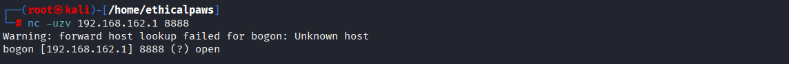
2. 原因：nc 判断 UDP 端口是否开放的原理是“是否收到 ICMP 端口不可达”消息。如果目标网络丢弃了此类 ICMP 包，nc 就会将端口误判为“开放”（open）。

3. 对策：
   - 不要轻信单一 UDP 扫描结果。
   
   - 交叉验证：使用多种工具进行验证，例如专业的 nmap UDP 扫描 (nmap -sU -p 8888 192.168.162.1)，或使用应用层协议专用探测工具。
   
   - 理解原理：记住 ICMP 端口不可达是 UDP 端口是否开放的关键判断依据，但在防火墙/IDS 环境下经常被阻断。
### 内网流量转发demo（端口转发与隧道雏形）
1. 攻击者（Windows）：尝试连接 Kali:8080。

2. 跳板机（Kali）：socat 监听 8080 端口。收到连接后，它创建一个新的连接到 Ubuntu:4444

3. 目标（Ubuntu）：nc 在 4444 端口监听。收到连接后，与 socat 建立通道。

4. 双向转发：socat 在“攻击者-Kali”和“Kali-目标”这两个连接之间复制数据，实现流量的转发。fork 参数使得它能够处理多个并发连接。

5. 关键价值：它实现了从一个可达主机（Kali）向另一个不可达主机（Ubuntu）的端口映射。这是内网穿透的基础，相当于一个简化版的 frp 或 EarthWorm 客户端。
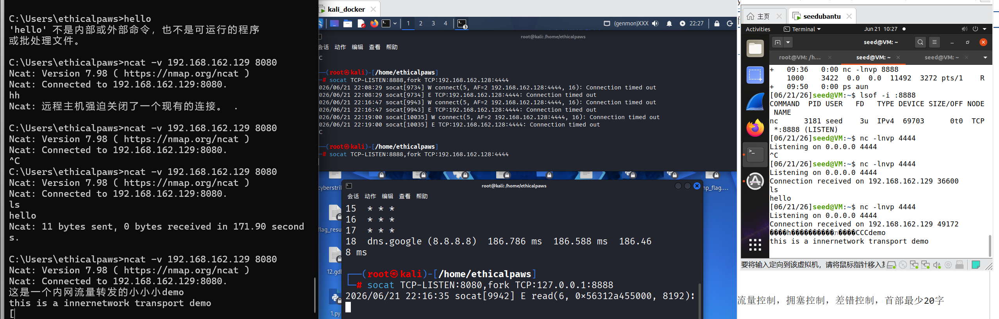