# VPN 隧道实验
## 实验目的
1. 理解VPN隧道的基本原理及实现方法。
2. 掌握使用Docker搭建网络环境和配置虚拟网络接口的技能。
3. 掌握TUN/TAP设备的创建与配置。
4. 理解并实现IP数据包的封装、发送与接收过程。
5. 能够通过抓包工具验证隧道通信的有效性和数据包流向
## 实验任务
### 使用socat构建基于TUN的虚拟网络
1. 网络拓扑图
   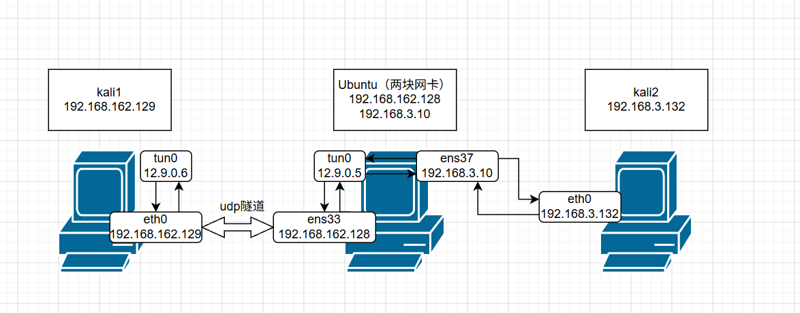
   [](vpn-tunnel/网络拓扑图.drawio)
2. 网络拓扑说明
    | 角色 | 身份 | 关键接口 | 作用 |
    |------|------|----------|------|
    | kali1 | VPN 客户端 | tun0（虚拟）+ eth0（真实） | 发起请求，把原始包封装进隧道 |
    | Ubuntu | VPN服务器 网关/转发器 | tun0（虚拟）+ ens33（真实） | 解封装 + 转发到私网 |
    | kali2 | 私网内目标主机 | eth0 | 接收请求并回复 |

    --- 

3. 使用socat生成TUN设备
    客户端（kali1）：sudo socat TUN:12.9.0.6/24,up UDP:192.168.162.128:9090
    
    服务端（Ubuntu）：sudo socat -d -d TUN:12.9.0.5/24,up UDP-LISTEN:9090,reuseaddr
    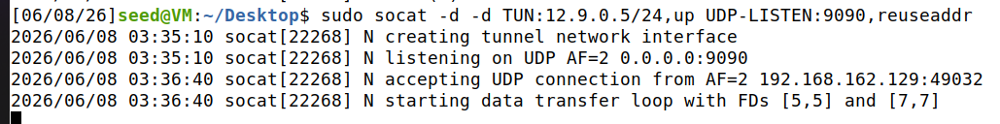
    添加路由：sudo ip route add 192.168.3.0/24 dev tun0
    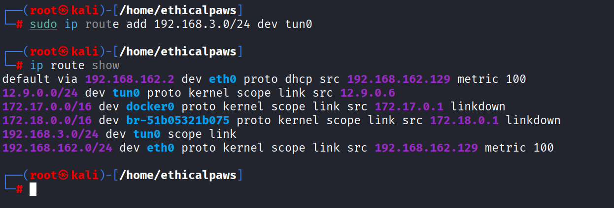
    验证隧道是否通了
    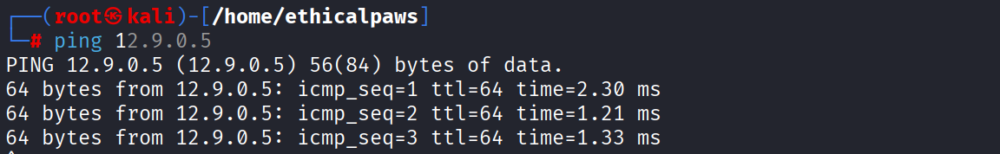
    在Ubuntu上开启ip转发
    
    设置防火墙策略为默认转发
    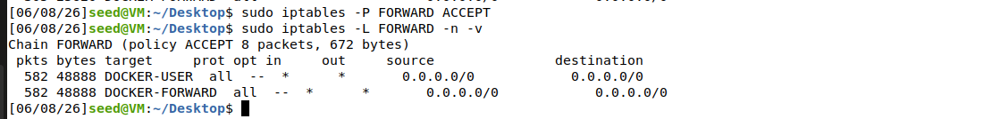
    在Ubuntu上开启SNAT，把来自隧道的包的源 IP 改成自己的 ens37 IP
    【让kali2收到包后知道如何处理，如果kali2收到源ip还是12.9.0.6的数据包，路由表中没有相关路由就会把包丢弃，那么kali1就不会收到回复】
    
    在kali上ping kali2测试VPN是否生效
    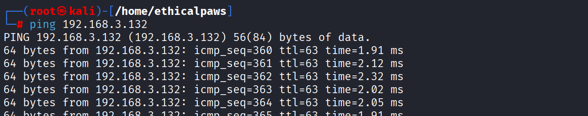
    成功
4. 完整的数据流向
   ```
   Kali 1 (12.9.0.6)
      │
      │ ping 192.168.3.132
      │ 原始包: src=12.9.0.6, dst=192.168.3.132
      ↓
   tun0 → socat 封装 → UDP → Ubuntu ens33
      │
   Ubuntu 解封装，写入 tun0
      │
   Ubuntu 路由：192.168.3.132 走 ens37
      │
   Ubuntu 做 SNAT：src 从 12.9.0.6 改成 192.168.3.10
      │
   ens37 发出：src=192.168.3.10, dst=192.168.3.132
      ↓
   Kali 2 收到，回复：src=192.168.3.132, dst=192.168.3.10
      ↓
   Ubuntu 收到回复，反向 SNAT：dst 改回 12.9.0.6
      │
   Ubuntu 路由：12.9.0.6 走 tun0
      │
   socat 封装 → UDP → Kali 1
      ↓
   Kali 1 收到 reply 
   ``` 
5. 抓包分析
   在kali1上开启tcpdump抓包
   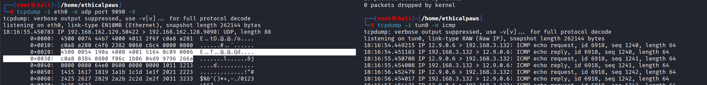
   - 左侧`sudo tcpdump -i eth0 -n udp port 9090 -X`是抓取eth0网卡上端口号为9090的udp数据包，-X是以十六进制格式显示udp负载内容
   - 右侧`sudo tcpdump -i tun0 -n icmp`是抓取tun0上的icmp数据包
   - 分析左侧udp数据包
     - `IP 192.168.162.129.50422 > 192.168.162.128.9090: UDP`源ip是kali1的eth0网卡的ip，目的ip是Ubuntu（vpn服务器）ens33网卡的ip，目的端口9090是Ubuntu的监听端口
     - `4500 0054 190a 4000 4001 5164 0c09 0006 c0a8 0384`图中标白的数据，这是udp数据包负载的关键部分——封装的内层ip数据包
         | 十六进制 | 含义 | 值 |
         |----------|------|-----|
         | 0800 | 以太网类型（不是重点） | - |
         | 45 | IP 版本 4，头长度 5 | IPv4 * |
         | 00 | 服务类型 | - |
         | 0054 | 总长度 | 84 字节 |
         | 190a | 标识 | - |
         | 4000 | 标志 | DF=1 |
         | 4001 | TTL(64) + 协议(1=ICMP) | ICMP * |
         | 5164 | 校验和 | - |
         | 0c09 0006 | 源 IP | 12.9.0.6（Kali 1 的 TUN IP） |
         | c0a8 0384 | 目标 IP | 192.168.3.132（Kali 2） |        

   - 分析右侧icmp数据包
     - `IP 12.9.0.6 > 192.168.3.132: ICMP`源ip是kali1的tun0的ip，目的ip是kali2的eth0网卡ip
   - udp数据包的负载中的ip数据包信息刚好和右侧数据包一致，验证了VPN的封装功能  
### 完成创建和配置 TUN 接口实验
1. 创建 TUN 接口
   tun_create.py脚本
   ```python
   #!/usr/bin/env python3
   import fcntl
   import os
   import struct
   import time

   # 常量定义
   TUNSETIFF = 0x400454ca
   IFF_TUN = 0x0001
   IFF_NO_PI = 0x1000

   # 1. 打开 TUN 设备
   tun = os.open("/dev/net/tun", os.O_RDWR)
   print("Step 1: Opened /dev/net/tun")

   # 2. 创建 TUN 接口
   ifr = struct.pack('16sH', b'li%d', IFF_TUN | IFF_NO_PI)
   ifname_bytes = fcntl.ioctl(tun, TUNSETIFF, ifr)
   ifname = ifname_bytes.decode('UTF-8')[:16].strip('\x00')
   print(f"Step 2: Created TUN interface: {ifname}")

   # 3. 分配 IP 地址
   os.system(f"ip addr add 12.9.0.6/24 dev {ifname}")
   print(f"Step 3: Assigned IP 12.9.0.6 to {ifname}")

   # 4. 启用接口
   os.system(f"ip link set dev {ifname} up")
   print(f"Step 4: {ifname} is UP")

   print("TUN interface is ready. Press Ctrl+C to exit.")
   while True:
      time.sleep(10)
   ```
   - 运行脚本创建tun
      
   - 验证是否成功创建tun 
      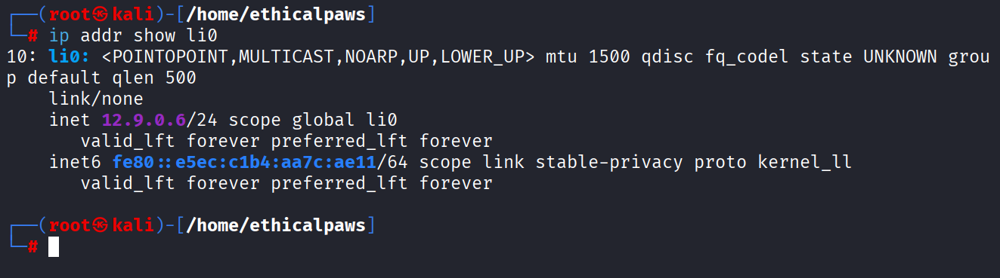 
      创建成功
2. 从 TUN 读取数据包
   tun_read.py脚本
   ```python
   #!/usr/bin/env python3
   import fcntl
   import os
   import struct
   from scapy.all import *

   TUNSETIFF = 0x400454ca
   IFF_TUN = 0x0001
   IFF_NO_PI = 0x1000

   # 创建 TUN 接口
   tun = os.open("/dev/net/tun", os.O_RDWR)
   ifr = struct.pack('16sH', b'li%d', IFF_TUN | IFF_NO_PI)
   ifname_bytes = fcntl.ioctl(tun, TUNSETIFF, ifr)
   ifname = ifname_bytes.decode('UTF-8')[:16].strip('\x00')
   print(f"TUN Interface: {ifname}")

   os.system(f"ip addr add 12.9.0.6/24 dev {ifname}")
   os.system(f"ip link set dev {ifname} up")
   print("TUN is ready. Reading packets...\n")

   while True:
      packet = os.read(tun, 2048)
      if packet:
         ip = IP(packet)
         print(f"Received: {ip.summary()}")
   ``` 
   - 运行脚本
      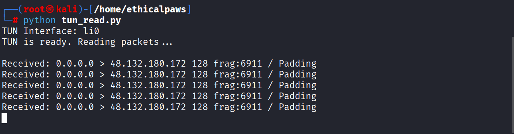
   - 在另一个终端ping 12.9.0.1验证脚本是否运行正确
      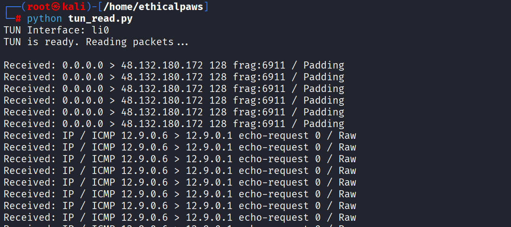
      脚本成功读取内核转发来的数据包
3. 写入 TUN
   tun_reply.py
   ```python
   #!/usr/bin/env python3
   import fcntl
   import os
   import struct
   from scapy.all import *

   TUNSETIFF = 0x400454ca
   IFF_TUN = 0x0001
   IFF_NO_PI = 0x1000

   # 创建 TUN 接口
   tun = os.open("/dev/net/tun", os.O_RDWR)
   ifr = struct.pack('16sH', b'li%d', IFF_TUN | IFF_NO_PI)
   ifname_bytes = fcntl.ioctl(tun, TUNSETIFF, ifr)
   ifname = ifname_bytes.decode('UTF-8')[:16].strip('\x00')
   print(f"TUN Interface: {ifname}")

   os.system(f"ip addr add 12.9.0.6/24 dev {ifname}")
   os.system(f"ip link set dev {ifname} up")
   print("TUN is ready. Press Ctrl+C to stop.\n")

   while True:
      packet = os.read(tun, 2048)
      if packet:
         ip = IP(packet)
         print(f"Received: {ip.summary()}")
         
         # 如果是 ICMP echo request，伪造 echo reply
         if ICMP in ip and ip[ICMP].type == 8:
               reply = IP(src=ip.dst, dst=ip.src) / ICMP(type=0, id=ip[ICMP].id, seq=ip[ICMP].seq) / ip[ICMP].payload
               os.write(tun, bytes(reply))
               print(f"  -> Sent fake reply to {ip.src}")
   ```
   - 运行脚本
     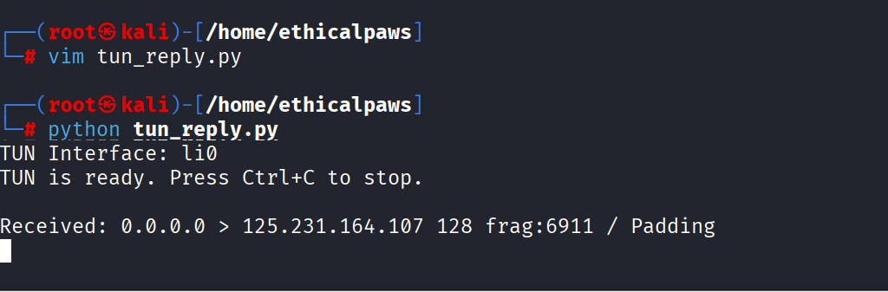 
   - ping 12.9.0.6验证脚本是否能够完成回复
     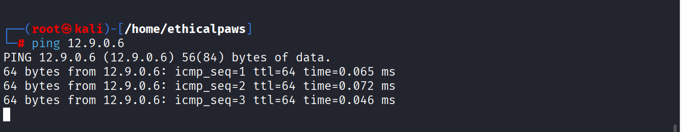
     收到回复，脚本运行正常  
### 通过隧道将 IP 数据包发送到 VPN 服务器
1. 客户端tun读取+udp封装发送
   client.py
   ```python
   #!/usr/bin/env python3
   import fcntl
   import os
   import socket
   import struct
   from scapy.all import *

   TUNSETIFF = 0x400454ca
   IFF_TUN = 0x0001
   IFF_NO_PI = 0x1000

   # 创建 TUN 接口
   tun = os.open("/dev/net/tun", os.O_RDWR)
   ifr = struct.pack('16sH', b'li%d', IFF_TUN | IFF_NO_PI)
   ifname_bytes = fcntl.ioctl(tun, TUNSETIFF, ifr)
   ifname = ifname_bytes.decode('UTF-8')[:16].strip('\x00')
   print(f"TUN Interface: {ifname}")

   os.system(f"ip addr add 12.9.0.6/24 dev {ifname}")
   os.system(f"ip link set dev {ifname} up")

   # UDP 配置
   SERVER_IP = "192.168.162.128"   # Ubuntu 的 ens33 IP
   SERVER_PORT = 9090

   sock = socket.socket(socket.AF_INET, socket.SOCK_DGRAM)
   print(f"Will send tunnel packets to {SERVER_IP}:{SERVER_PORT}\n")

   while True:
      packet = os.read(tun, 2048)
      if packet:
         pkt = IP(packet)
         print(f"Read from TUN: {pkt.summary()}")
         sock.sendto(packet, (SERVER_IP, SERVER_PORT))
         print(f"  -> Sent to server via UDP")
   ``` 
2. 服务端udp接收
   ```python
   #!/usr/bin/env python3
   import socket
   from scapy.all import *

   IP_A = "0.0.0.0"
   PORT = 9090

   sock = socket.socket(socket.AF_INET, socket.SOCK_DGRAM)
   sock.bind((IP_A, PORT))
   print(f"Server listening on UDP port {PORT}\n")

   while True:
      data, (ip, port) = sock.recvfrom(2048)
      pkt = IP(data)
      print(f"Received from {ip}:{port}")
      print(f"  Inner packet: {pkt.src} --> {pkt.dst}")
   ``` 
3. 验证
   - 运行两个脚本
     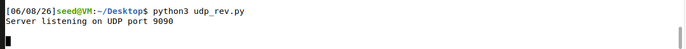
     
   - kali1中添加路由：`sudo ip route add 192.168.3.0/24 dev li0` 
     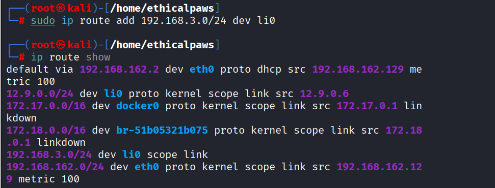   
   - 在kali另一个终端ping 192.168.3.132
     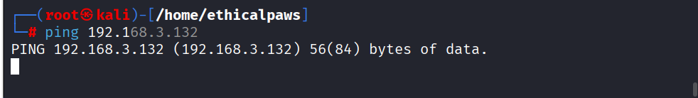
   - Ubuntu中成功收到经过封装的数据包
     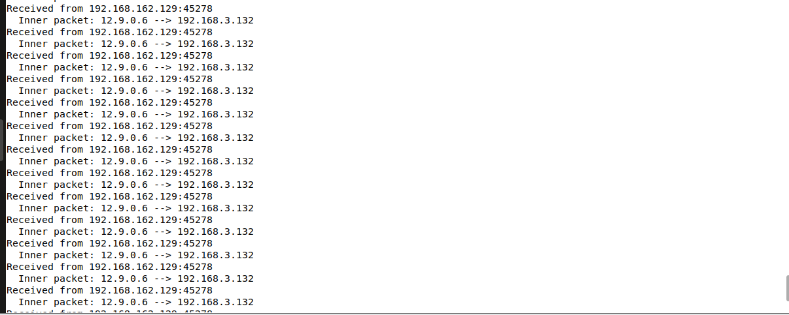     
### 设置 VPN 服务器
1. 服务端udp接收+tun写入
   server.py
   ```python
   #!/usr/bin/env python3
   import fcntl
   import os
   import socket
   import struct
   from scapy.all import *

   TUNSETIFF = 0x400454ca
   IFF_TUN = 0x0001
   IFF_NO_PI = 0x1000

   # ========== 创建 TUN 接口 ==========
   tun = os.open("/dev/net/tun", os.O_RDWR)
   ifr = struct.pack('16sH', b'tun0', IFF_TUN | IFF_NO_PI)
   ifname_bytes = fcntl.ioctl(tun, TUNSETIFF, ifr)
   ifname = ifname_bytes.decode('UTF-8')[:16].strip('\x00')
   print(f"Server TUN Interface: {ifname}")

   os.system(f"ip addr add 12.9.0.5/24 dev {ifname}")
   os.system(f"ip link set dev {ifname} up")
   print("TUN configured and UP")

   # ========== UDP 服务器 ==========
   PORT = 9090
   sock = socket.socket(socket.AF_INET, socket.SOCK_DGRAM)
   sock.bind(('0.0.0.0', PORT))
   print(f"Listening on UDP port {PORT}\n")

   while True:
      data, (client_ip, client_port) = sock.recvfrom(2048)
      pkt = IP(data)
      print(f"Received from {client_ip}:{client_port}")
      print(f"  Inner: {pkt.src} --> {pkt.dst}")
      
      # 写入 TUN 接口
      os.write(tun, data)
      print(f"  -> Written to {ifname}")
   ``` 
2. 验证
   - kali1上运行client.py
      
   - 在Ubuntu上开启ip转发`sudo sysctl -w net.ipv4.ip_forward=1`
      
   - Ubuntu上运行server.py  
      
   - 在kali1中ping 192.168.3.132
      
   - 在kali2中开启tcpdump抓包
     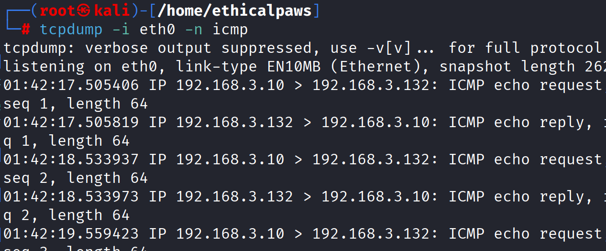
     成功抓到来自Ubuntu转发的数据包
### 处理双向流量
1. final_client.py
   ```python
   #!/usr/bin/env python3
   import fcntl
   import os
   import socket
   import struct
   import select
   from scapy.all import *

   TUNSETIFF = 0x400454ca
   IFF_TUN = 0x0001
   IFF_NO_PI = 0x1000

   # 创建 TUN 接口
   tun = os.open("/dev/net/tun", os.O_RDWR)
   ifr = struct.pack('16sH', b'li%d', IFF_TUN | IFF_NO_PI)
   ifname_bytes = fcntl.ioctl(tun, TUNSETIFF, ifr)
   ifname = ifname_bytes.decode('UTF-8')[:16].strip('\x00')
   print(f"Client TUN: {ifname}")

   os.system(f"ip addr add 12.9.0.6/24 dev {ifname}")
   os.system(f"ip link set dev {ifname} up")

   # 添加路由（去往 Kali 2 的网络）
   os.system(f"ip route add 192.168.3.0/24 dev {ifname}")

   # UDP socket
   SERVER_IP = "192.168.162.128"
   SERVER_PORT = 9090
   sock = socket.socket(socket.AF_INET, socket.SOCK_DGRAM)

   print("Client ready. Press Ctrl+C to stop.\n")

   while True:
      ready, _, _ = select.select([sock, tun], [], [])
      
      for fd in ready:
         if fd == sock:
               data, _ = sock.recvfrom(2048)
               pkt = IP(data)
               print(f"[UDP->TUN] {pkt.src} --> {pkt.dst}")
               os.write(tun, data)
               
         elif fd == tun:
               packet = os.read(tun, 2048)
               pkt = IP(packet)
               print(f"[TUN->UDP] {pkt.src} --> {pkt.dst}")
               sock.sendto(packet, (SERVER_IP, SERVER_PORT))
   ``` 
2. final_server.py
   ```python
   #!/usr/bin/env python3
   import fcntl
   import os
   import socket
   import struct
   import select
   from scapy.all import *

   TUNSETIFF = 0x400454ca
   IFF_TUN = 0x0001
   IFF_NO_PI = 0x1000

   # 创建 TUN 接口
   tun = os.open("/dev/net/tun", os.O_RDWR)
   ifr = struct.pack('16sH', b'tun0', IFF_TUN | IFF_NO_PI)
   ifname_bytes = fcntl.ioctl(tun, TUNSETIFF, ifr)
   ifname = ifname_bytes.decode('UTF-8')[:16].strip('\x00')
   print(f"Server TUN: {ifname}")

   os.system(f"ip addr add 12.9.0.5/24 dev {ifname}")
   os.system(f"ip link set dev {ifname} up")

   # UDP 服务器
   PORT = 9090
   sock = socket.socket(socket.AF_INET, socket.SOCK_DGRAM)
   sock.bind(('0.0.0.0', PORT))
   print(f"Listening on UDP port {PORT}")

   # 记录客户端地址
   client_addr = None

   # 开启 IP 转发
   os.system("sysctl -w net.ipv4.ip_forward=1")

   # 添加 SNAT（让 Kali 2 的回包能回来）
   os.system("iptables -t nat -A POSTROUTING -s 192.168.53.0/24 -o ens37 -j MASQUERADE")
   os.system("iptables -P FORWARD ACCEPT")

   print("Server ready. Press Ctrl+C to stop.\n")

   while True:
      ready, _, _ = select.select([sock, tun], [], [])
      
      for fd in ready:
         if fd == sock:
               data, addr = sock.recvfrom(2048)
               client_addr = addr
               pkt = IP(data)
               print(f"[UDP->TUN] {pkt.src} --> {pkt.dst}")
               os.write(tun, data)
               
         elif fd == tun:
               packet = os.read(tun, 2048)
               pkt = IP(packet)
               print(f"[TUN->UDP] {pkt.src} --> {pkt.dst}")
               if client_addr:
                  sock.sendto(packet, client_addr)
   ```
3. 验证
   - 运行两个脚本
     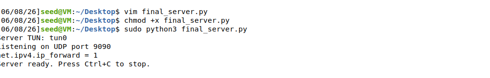
      
   - kali1上ping 192.168.3.132
     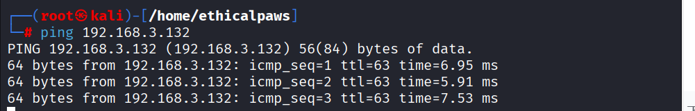
     成功收到回复 
   - kali2上开启抓包
     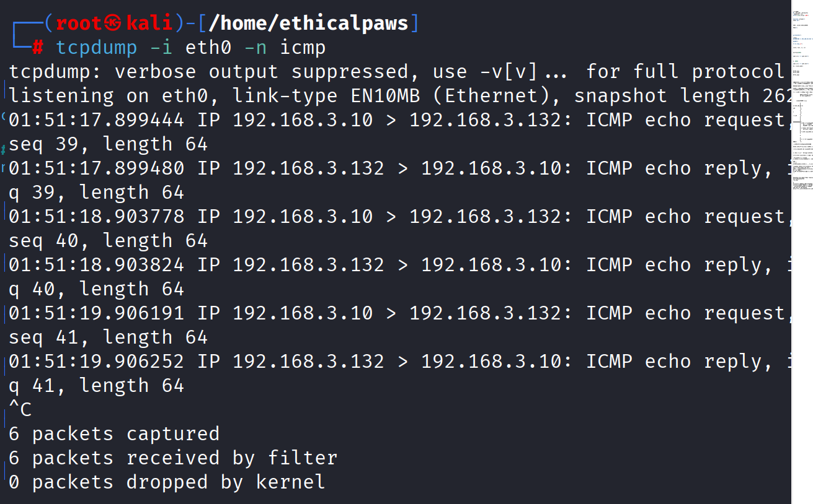
     成功抓到包，证明双向流量处理正确  
## 实验总结
### 问题与思考
1. 为什么要建立一个TUN接口
   1. 建立 TUN 接口，是为了让操作系统的内核“主动”把 IP 包交给用户态VPN程序 
   2. VPN的实现需要对原始数据包进行封装转发的操作，这就需要我们的VPN程序能够从内核拿到数据包
   3. 但是正常情况下数据包在内核中就处理完了（路由、转发、丢弃），用户态的VPN程序根本接触不到数据包
   4. 有了TUN接口后，配置路由告诉内核某些流量走TUN虚拟接口，这样内核就会把数据包从内核态转发到用户态程序，然后VPN程序就可以对数据包进行封装转发了
   ```
   应用程序（ping）→ 内核构造 IP 包 → 路由表 → 发现走 tun0 → 交给 TUN 设备
                                                         ↓
                                             你的程序（tun_client.py）
                                             从 TUN 读到这个包
   ``` 
2. VPN到底是如何工作的
   ```
   咖啡厅（客户端）                    公司（VPN服务器）                公司内网
      │                                      │                        │
      │ ① ping 192.168.60.5                  │                        │
      │    (原始包：src:10.0.0.2 dst:192.168.60.5)                    │
      │                                      │                        │
      │ ② 路由表说：去这个网段走 tun0         │                        │
      │    原始包被交给 TUN 接口              │                        │
      │                                      │                        │
      │ ③ 你的程序从 TUN 读到原始包           │                        │
      │    封装成 UDP：                       │                        │
      │    ┌────────────────────┐            │                        │
      │    │ 外层IP: 咖啡厅IP → 服务器IP      │                        │
      │    │ UDP端口: 11443                  │                        │
      │    │ 负载: 原始ICMP包                │                        │
      │    └────────────────────┘            │                        │
      │                                      │                        │
      │ ④ 通过真实网卡发出 ──────────────────→│                        │
      │                                      │ ⑤ 服务器程序收到UDP     │
      │                                      │    取出原始ICMP包       │
      │                                      │    写入服务器的 TUN     │
      │                                      │                        │
      │                                      │ ⑥ 内核从 TUN 收到包     │
      │                                      │    查路由：转发到 eth0  │
      │                                      │                        │
      │                                      │ ⑦ eth0 发给打印机 ─────→│
      │                                      │                        │ ⑧ 打印机收到
      │                                      │                        │    回复ICMP reply
      │                                      │                        │
      │                                      │ ⑨ 回复包反向走隧道 ────→│
      │                                      │                        │
      │ ⑩ 客户端收到 reply → ping 成功 ✅      │                        │
   ``` 
3. 为什么不直接把VPN服务器设为网关转发数据包，偏要走vpn隧道呢？
   1. 隔离和抽象
      - 网关方式：Kali 1 的真实 IP（162.129）暴露给 Kali 2。如果 162 网段变化，所有配置都要改。
      - VPN 方式：Kali 2 只知道 12.9.0.x，不关心 162 网段。VPN 隧道把两端解耦了。
   2. 多客户端支持
      - 网关方式：每个客户端都需要在 Kali 2 上配一条回指路由（162.129、162.130、162.131...），管理麻烦。
      - VPN 方式：所有客户端共享 12.9.0.0/24 网段，Kali 2 只需一条路由。
   3. 安全性
      - 网关方式：Kali 1 的真实 IP 暴露给整个 3.x 网段。
      - VPN 方式：Kali 2 只知道隧道 IP（12.9.0.6），不知道真实 IP。

   VPN 隧道的作用

   | 作用 | 说明 | 你的实验中是否体现 |
   |------|------|---------------------|
   | 1. 跨网段通信 | 让两个本来无法直接通信的网络（162.x 和 3.x）能互通 | ✅ Kali 1 ping 通 Kali 2 |
   | 2. 隐藏真实 IP | 目标网络只能看到隧道 IP（12.9.0.6）或网关 IP（3.10），看不到客户端真实 IP（162.129） | ✅ Kali 2 抓包看不到 162.129 |
   | 3. 统一虚拟网络 | 所有客户端共享同一个隧道网段（12.9.0.0/24），后端只需配置一次路由 | ✅ 只加了一条路由就支持所有客户端 |
   | 4. 绕过网络限制 | 防火墙只看到 UDP 包，不会拦截“去往 3.x 的包” | ✅ 真实网络上只有 162.129 → 162.128 的 UDP |

### 知识点
1. TUN/TAP 虚拟网络接口是什么
    Linux 内核提供的纯软件实现的网络接口，一端连着内核网络协议栈，另一端连着用户态程序
    什么时候用TUN，什么时候用TAP

    | 场景 | 推荐 | 原因 |
    |------|------|------|
    | 点对点 VPN（本实验） | TUN | 简单，只关心 IP 层，不需要处理 MAC 和 ARP |
    | 需要桥接两个局域网 | TAP | 要传递 ARP、广播等二层流量 |
    | 移动设备 VPN（如手机连公司） | TUN | 点对点，不需要二层 |
    | 虚拟机能通过 VPN 被访问 | TAP | 要让虚拟机像在本地一样收到 ARP |

    ---

    **数据流向**：
    ```
    内核 → 用户程序：路由表决定某类包走 TUN 接口 → 内核交给 TUN 设备 → 用户程序 read() 拿到原始 IP 包
    用户程序 → 内核：用户 write() 一个 IP 包到 TUN 设备 → 内核就像从网卡收到包一样处理它（路由、转发、响应）
    ```
2. 隧道（Tunneling）是什么：
   把一个网络协议的数据包，整个装进另一个协议的负载里传输。
3. 路由控制（Routing）
    为什么需要：
    操作系统不知道哪些流量应该进 TUN 隧道，必须手动告诉它
    核心命令：
    ```bash
    ip route add <目标网络> dev <接口> via <下一跳>
    ```
4. IP over UDP 封装
    为什么用 UDP：
    - 简单、无连接、适合封装 IP 包。TCP 会引入额外重传和延迟。
    封装格式（从内到外）：
    ```
    [原始IP包（含ICMP/TCP等）]
    ↓ 作为负载
    [UDP头（源端口随机，目标端口9090）]
    ↓ 再加上
    [外层IP头（源=U的公网IP，目标=VPN服务器的公网IP）]    
    ```
5. 双向转发与 I/O 多路复用（select）
    **问题**：
    VPN 程序需要同时处理两个方向的数据：
    ```
    从网络（UDP socket）收到包 → 写入 TUN
    从 TUN 读到包 → 发往网络
    如果用普通的阻塞 read()，程序会卡在一个接口上，错过另一个接口的数据。
    ```
    **解决方案**：select() 系统调用
    它同时监控多个文件描述符（TUN 和 socket），只要任何一个有数据，就返回并告诉你是哪个

    ```python
    ready, _, _ = select.select([sock, tun], [], [])
    ```
6. IP 转发（IP Forwarding）
    >让一台 Linux 机器像路由器一样，在不同网卡之间转发 IP 包。

    为什么 VPN 服务器需要：
    它一边连接互联网（与客户端通信），一边连接私有网络（与主机V通信）。收到来自隧道的包后，必须能转发给主机V。
    **开启命令**（实验环境已默认开启）：
    ```bash
    sysctl net.ipv4.ip_forward=1    
    ```
 7. socat是什么
    >socat 是一个强大的网络瑞士军刀，名字来源于 "SOcket CAT"。你可以把它理解为 netcat 的超级增强版，功能更强大，能连接几乎任何两个数据源
    
    socat 可以在两个数据通道之间建立双向数据传输连接。
    1. 两个通道可以是：文件、管道、设备（如 TUN）、TCP 连接、UDP 连接、SSL 连接、Unix socket 等 
    2. socat 常见用法示例

        | 用途 | 命令 |
        |------|------|
        | 监听 TCP 端口转发到另一个端口 | `socat TCP-LISTEN:8080,fork TCP:localhost:80` |
        | 建立双向 UDP 隧道 | `socat UDP-LISTEN:9090,fork TUN:192.168.53.1/24,up` |
        | 将串口数据转发到网络 | `socat /dev/ttyUSB0 TCP:server:1234` |
        | 加密传输 | `socat OPENSSL-LISTEN:443,cert=server.pem TCP:localhost:80` |    

        ---
### 踩坑
1. 注意检查Ubuntu（vpn服务器）的防火墙策略是不是默认丢弃经过Ubuntu转发的数据包，如果是那么就算开启内核ip转发规则也会被防火墙策略覆盖
   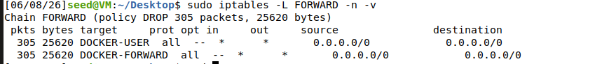 
### 收获
1. 通过 socat 快速搭建 VPN 隧道验证
   - TUN 接口：创建虚拟网卡，让内核能把特定流量交给用户程序处理。
   - 隧道网段（12.9.0.0/24）：VPN 虚拟网络，隐藏客户端真实 IP，统一管理多客户端。
   - 封装：原始 IP 包作为 UDP 负载传输，抓包可看到两层 IP 地址。
   - 路由：添加路由规则，让目标网段的流量进入 TUN 接口。
   - IP 转发 + SNAT：VPN 服务器在不同网卡间转发包，并解决回包路由问题。