## 什么是文件上传漏洞
Web服务器允许用户上传文件，但未充分校验文件的属性【文件名、文件类型、文件内容、文件大小】导致用户可以上传可执行脚本文件，从而导致远程任意代码执行。（某些情况下，上传的文件无法自动触发，需要配合其他操作触发【如http请求】才能完成攻击）
## 有什么影响
1. 影响程度取决于两大因素
   1. 验证缺陷：未对文件名称、类型、内容、大小进行验证
   2. 上传后的限制：文件存储位置、是否可执行、是否可访问
2. 严重后果：上传服务端脚本（如 .php）并被服务器执行 → 获得 Web Shell → 完全控制服务器
3. 其他后果：
   1. 文件名未验证 → 覆盖关键文件
   2. 存在路径遍历 → 上传到非预期目录
   3. 文件大小未验证 → DoS 攻击（填满磁盘空间）
## 产生该漏洞的原因
1. 依赖客户端控制的数据：仅检查 Content-Type 头部，可被轻松篡改
    服务器信任了客户端可以完全控制的一个数据字段，没有对它进行独立核实。
    攻击者用 Burp Suite 可以把 Content-Type 从 text/plain 改成 image/jpeg，服务器就信了。
2. 黑名单过滤：禁止危险扩展名，但容易遗漏（如 .php5、.phtml）
3. 验证逻辑不一致：不同目录、不同服务器组件的验证逻辑存在差异
## Web服务器如何处理静态文件
1. 处理流程
   ```
   收到HTTP请求
   |
   解析URL路径      --->/images/logo.jpg
   |
   映射到文件系统路径 --->/var/www/html/images/logo.jpg
   |
   提取后缀名        --->.jpg
   |
   查询MIME类型映射表    --->image/jpeg
        |
        判断是否可执行
                |
                |---否————>读取并返回原文件
                |---是————>检查是否配置了执行处理器
                                |
                                |-----否————>返回源码或报错
                                |-----是————>执行文件
   ``` 
2. MIME 类型映射机制
   1. Apache 的 MIME 映射【配置文件 mime.types 或 httpd.conf】
      ```apache
        # 扩展名 → MIME 类型的映射
        AddType text/html .html .htm
        AddType image/jpeg .jpg .jpeg
        AddType application/x-httpd-php .php
        AddType text/plain .txt      
      ``` 
   2. Nginx 的 MIME 映射
       ```nginx
        types {
            text/html    html htm;
            image/jpeg   jpg jpeg;
            application/x-httpd-php php;
        }
       ``` 
   3. IIS 的 MIME 映射
      ```xml
        <staticContent>
            <mimeMap fileExtension=".jpg" mimeType="image/jpeg" />
            <mimeMap fileExtension=".php" mimeType="application/x-httpd-php" />
        </staticContent>
      ```  
3. 三种执行行为分析
   1. 非可执行文件 → 直接返回内容
      1. 条件：
         1. 扩展名不在可执行列表
         2. 或 MIME 类型不属于 application/x-httpd-*、text/x-* 等
      2. 处理过程：
         ```
            客户端请求：GET /images/photo.jpg HTTP/1.1

            服务器处理：
            1. 读取 /var/www/images/photo.jpg
            2. 添加响应头：Content-Type: image/jpeg
            3. 发送二进制内容（不解析、不执行）

            响应：
            HTTP/1.1 200 OK
            Content-Type: image/jpeg
            Content-Length: 45678

            [图片二进制数据]
         ```
   2. 可执行文件 + 配置执行 → 解析执行
      1. 条件：
         1. 文件扩展名在可执行列表【被映射到脚本处理器（如 .php → PHP 模块）】
         2. 服务器配置了对应的执行引擎
      2. 处理过程：
         ```apache
            # 加载 PHP 模块
            LoadModule php_module modules/libphp.so

            # 将 .php 文件交给 PHP 处理
            AddHandler application/x-httpd-php .php         
         ``` 
         ```
            客户端请求：GET /shell.php?cmd=id HTTP/1.1

            服务器处理：
            1. 识别 .php 扩展名
            2. 将请求交给 PHP 模块/FPM
            3. PHP 解析 <?php system($_GET['cmd']); ?>
            4. 执行系统命令 "id"
            5. 返回输出

            响应：
            HTTP/1.1 200 OK
            Content-Type: text/html

            uid=33(www-data) gid=33(www-data)
         ``` 
   3. 可执行文件 + 未配置执行 → 返回错误/明文
      1. 条件
         1. 上传了 .php 文件
         2. 但服务器没有配置 PHP 处理器或者上传目录被明确禁止执行
      2. 返回场景
         场景一：报错
         ```
         HTTP/1.1 403 Forbidden
         Content-Type: text/html

         You don't have permission to access /uploads/shell.php on this server.
         ``` 
         场景二：返回明文源码
         ```
         HTTP/1.1 200 OK
         Content-Type: text/plain
         Content-Length: 39

         <?php echo system($_GET['command']); ?>
         ```
         为什么会出现返回明文的情况？
         某些 Web 服务器默认配置下，遇到不认识扩展名时：
         Apache：可能当作 text/plain 返回
         Nginx：可能下载文件而不是执行
         IIS：可能返回 404
4. 不同目录配置差异【这是文件上传漏洞中最重要的绕过思路。】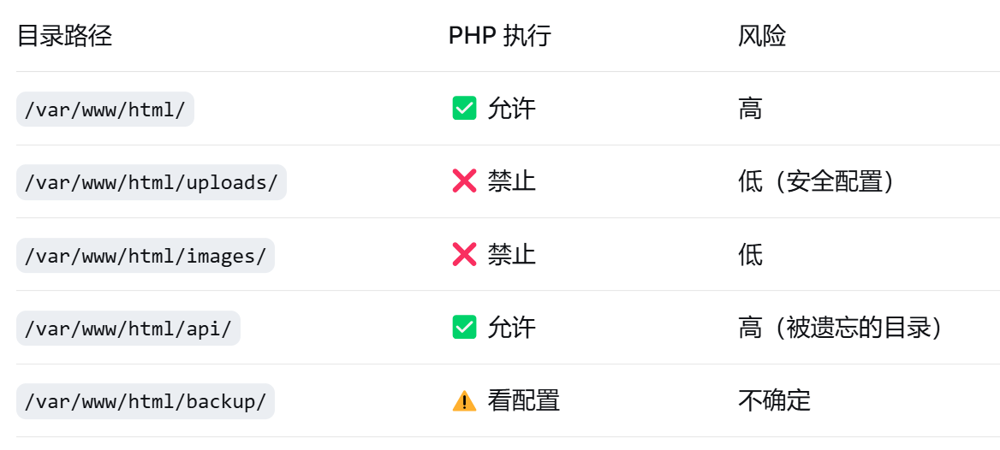
   1. 全局 vs 目录级配置
   2. 利用路径遍历更改上传目录
5. 利用场景
   1. 上传目录禁止执行，但可以目录穿越
   2. 上传自己的配置文件覆盖目录配置
   3. 利用 CGI 或其他可执行扩展
## 文件上传漏洞的常见利用技术
1. 无任何限制的文件上传
   1. 实战演练：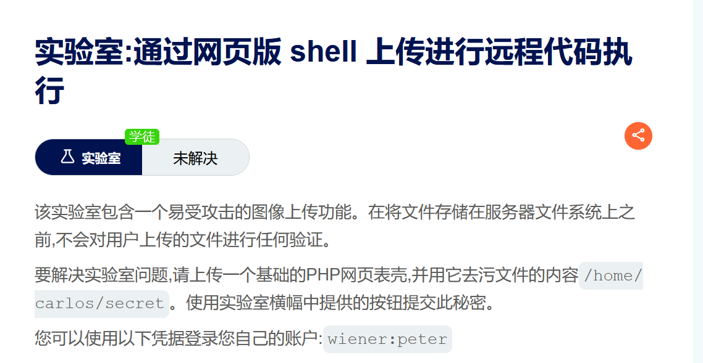
   2. 找到上传点，上传一个正常照片测试一下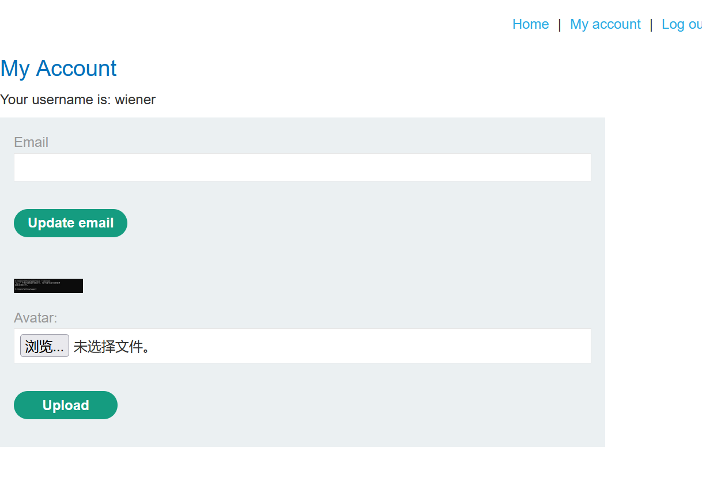发现会显示照片，说明在该页面上应该会有img标签请求访问了该照片
   3. 开发者工具查找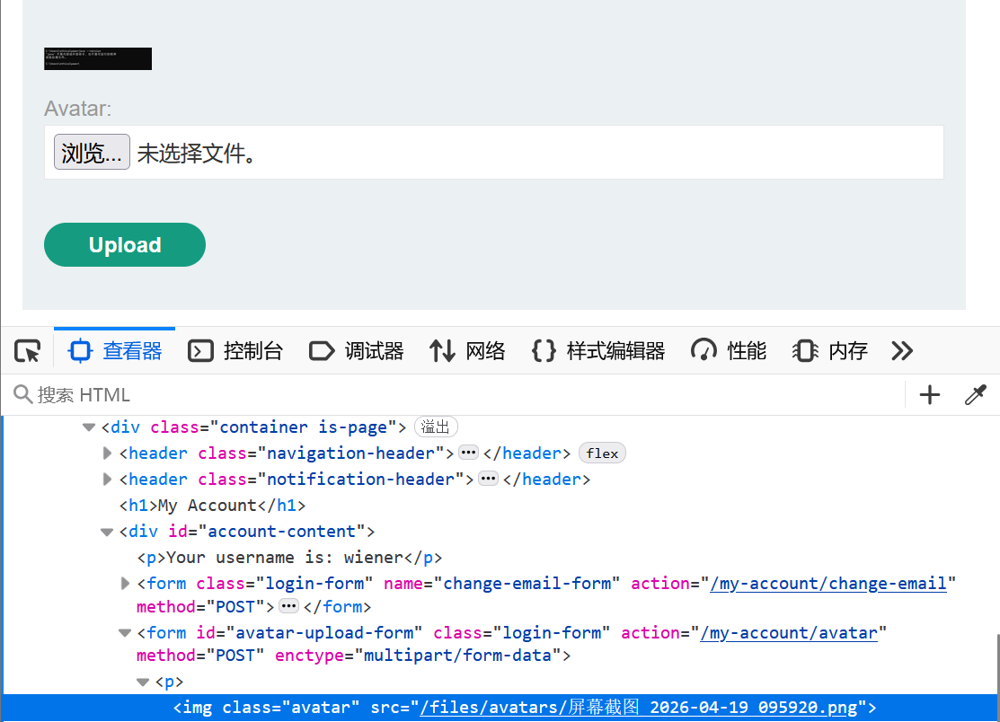发现了照片存放的目录
   4. 接下来上传php脚本文件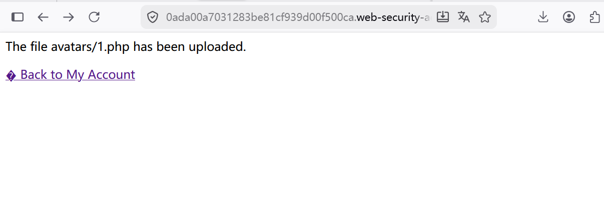
   5. 然后访问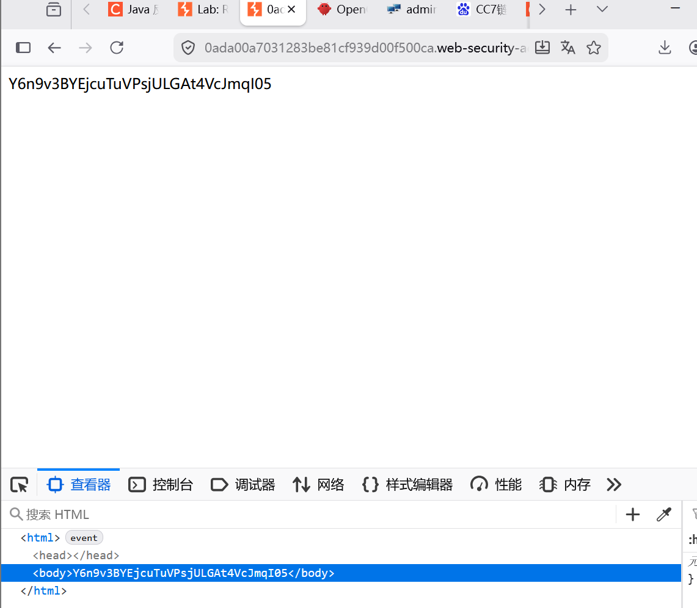成功输入目标文件的内容
   6. 提交即可通过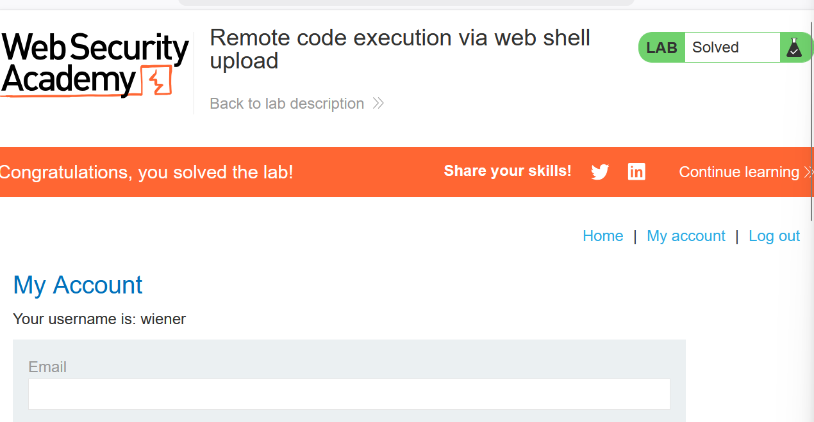
2. 需要绕过的文件上传
   1. 绕过有缺陷的文件类型验证（Content-Type）
      1. 提交 HTML 表单时，浏览器通常会以 POST 请求的形式发送所提供的数据，其内容类型（Content-Type）为 application/x-www-form-urlencoded。这种方式适用于传输姓名或地址等简单文本数据。然而，它并不适合传输大量二进制数据（例如整张图像文件或 PDF 文档）。此时，更推荐使用 multipart/form-data 内容类型
      2. 考虑一个包含上传图片、提供图片描述以及输入用户名等字段的表单。提交此类表单可能会生成如下所示的请求
         ```http
         POST /images HTTP/1.1
            Host: normal-website.com
            Content-Length: 12345
            Content-Type: multipart/form-data; boundary=---------------------------012345678901234567890123456

            ---------------------------012345678901234567890123456
            Content-Disposition: form-data; name="image"; filename="example.jpg"
            Content-Type: image/jpeg

            [...binary content of example.jpg...]

            ---------------------------012345678901234567890123456
            Content-Disposition: form-data; name="description"

            This is an interesting description of my image.

            ---------------------------012345678901234567890123456
            Content-Disposition: form-data; name="username"

            wiener
            ---------------------------012345678901234567890123456--
         ```
         消息正文被分割成每个表单输入的不同部分。每个部分都包含一个Content-Dispositionheader,它提供了有关输入字段的一些基本信息。这些各个部分也可能包含它们自己的Content-Typeheader,它向服务器发送使用此输入提交的 MIME 类型数据。
         网站可能尝试验证文件上传的一种方法是检查是否针对特定输入Content-Type头球匹配的是预期的MIME类型。例如,如果服务器只期望镜像文件,则可能只允许类似类型image/jpeg而且image/png
      3. 当服务器隐式信任此请求头的值时，可能会引发问题。如果未进一步验证文件内容是否确实与所声称的 MIME 类型匹配，则攻击者可轻易借助 Burp Repeater 等工具绕过该防护措施。
      4. 实战演练：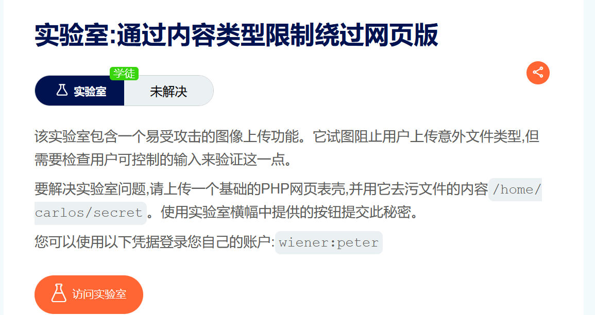
         1. 寻找上传点上传正常照片抓包查看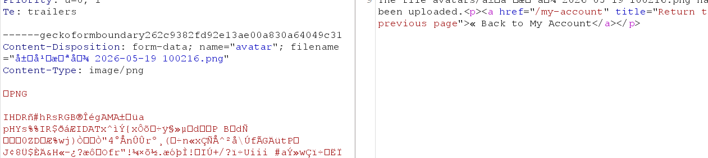
         2. 在上传一个php脚本文件测试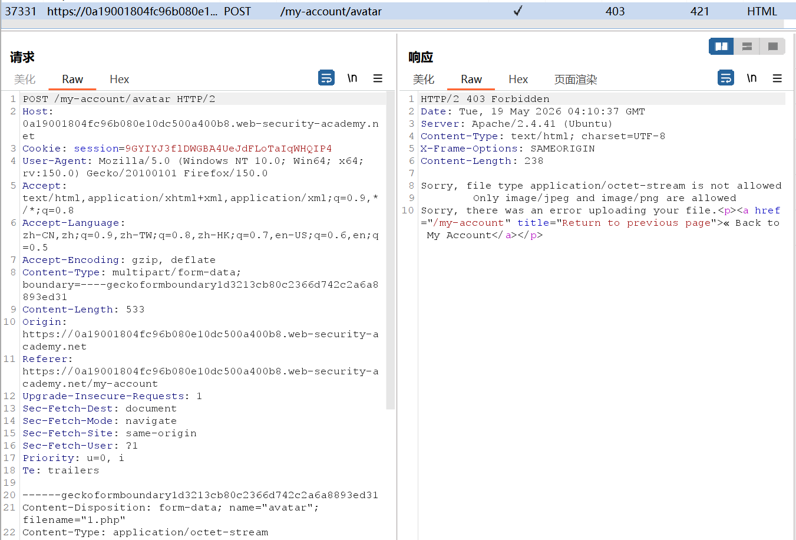发现只允许上传image/jpeg 和 image/png类型的文件
         3. 修改文件后缀为.jpg欺骗浏览器让它误以为上传的脚本文件是image/jpeg类型的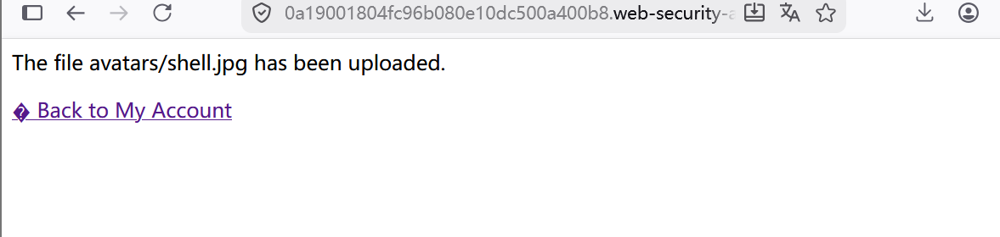成功上传
         4. 但刚刚上传的文件后缀名是.jpg服务器并不会把它交给php解析器继续执行一个还需要抓包把后缀名改回.php再上传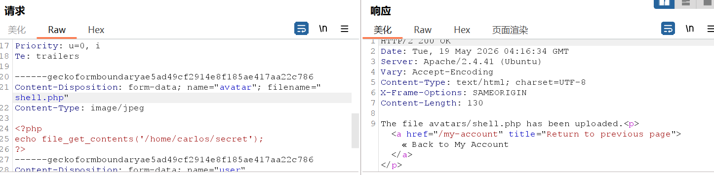
         5. 访问上传的脚本文件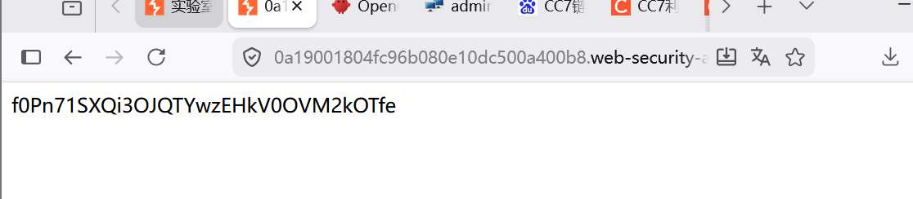
         6. 提交输出的内容即可通关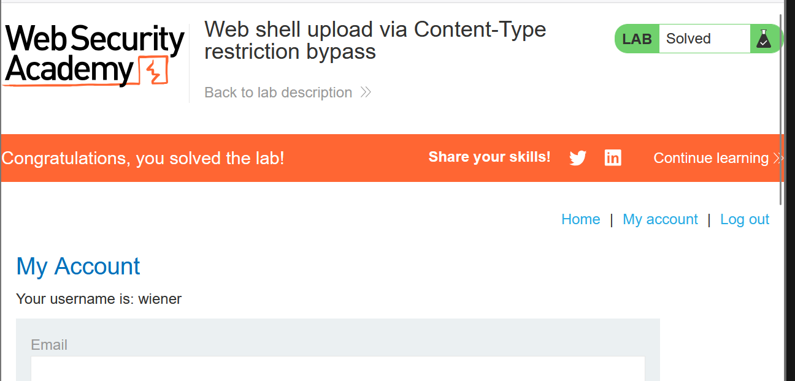
   2. 绕过黑/白名单扩展名限制
      1. 防止用户上传恶意脚本的一种较为明显的方法是将潜在危险的文件扩展名（例如 .php）加入黑名单。然而，黑名单机制本身存在固有缺陷，因为很难明确地屏蔽所有可能用于执行代码的文件扩展名。此类黑名单有时可通过使用较少为人知但依然可执行的替代文件扩展名（例如 .php5、.shtml 等）来绕过。
      2. 绕过手法
         1. 覆盖服务器配置文件
            1. 服务器通常不会执行文件，除非已对其进行相应配置。例如，在 Apache 服务器执行客户端请求的 PHP 文件之前，开发人员可能需要在 `/etc/apache2/apache2.conf` 文件中添加以下指令。
               ```
               LoadModule php_module /usr/lib/apache2/modules/libphp.so
                  AddType application/x-httpd-php .php
               ```
            2. 开发人员可以使用 web.config 文件在 IIS 服务器上进行目录特定的配置。例如，以下指令允许向用户提供 JSON 文件
               ```
               <staticContent>
                  <mimeMap fileExtension=".json" mimeType="application/json" />
                  </staticContent>
               ``` 
            3. 许多服务器还允许开发者在各个目录中创建特殊的配置文件，以覆盖或添加一项或多项全局设置。例如，Apache 服务器会在存在名为 .htaccess 的文件时，加载该目录特定的配置。 
            4. Web服务器在存在这类配置文件时会使用它们，但通常不允许攻击者通过HTTP请求访问这些文件。然而，攻击者偶尔可能会发现一些服务器未能阻止上传恶意的自定义配置文件。在这种情况下，即使所需的文件扩展名已被列入黑名单，仍可能诱使服务器将任意自定义文件扩展名映射到可执行的MIME类型。
            5. 实战演练：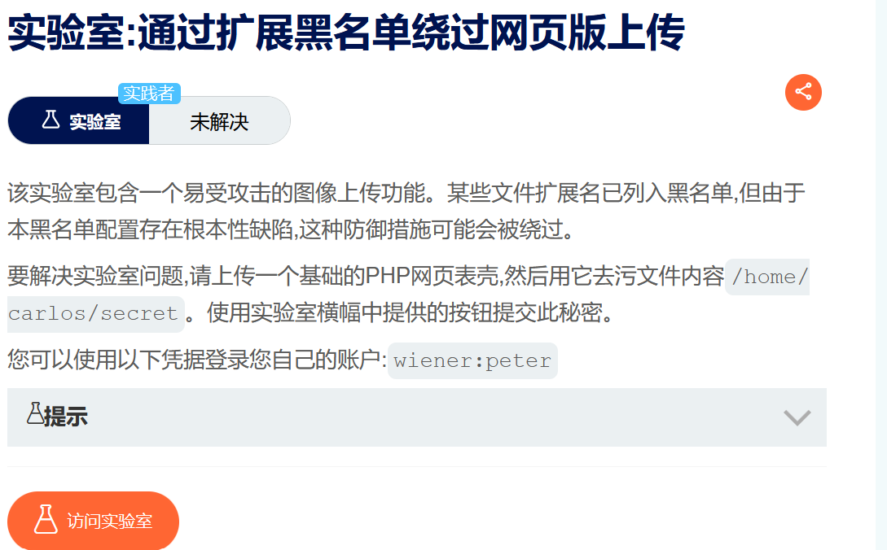
               1. 后缀名.php在黑名单中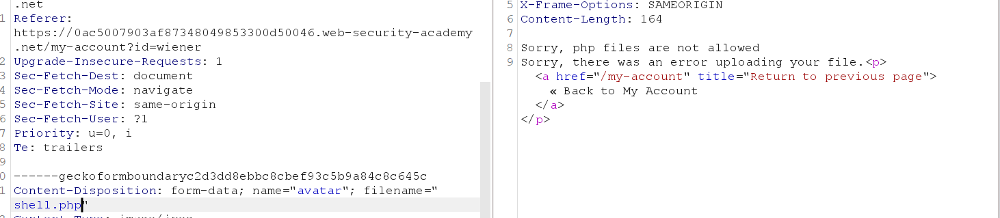
               2. 尝试上层.htaccess文件发现没有在黑名单中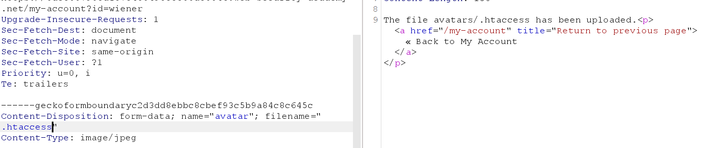
               3. 上传配置文件，将.jpg映射为php脚本文件
                  ```
                  <FilesMatch "shell.jpg">
                     SetHandler application/x-httpd-php
                  </FilesMatch>
                  ``` 
                  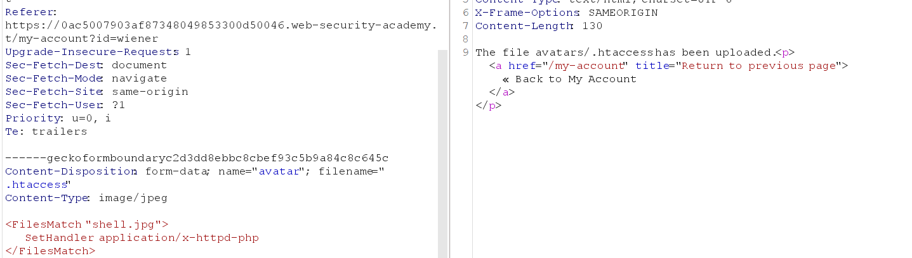
               4. 上传文件名为shell.jpg的脚本文件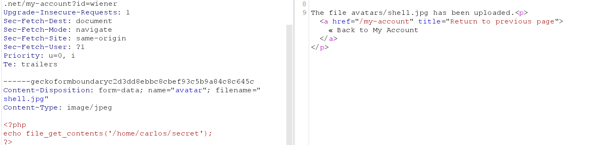
               5. 访问该文件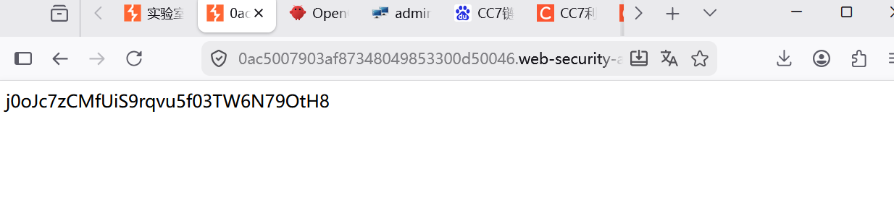
               6. 提交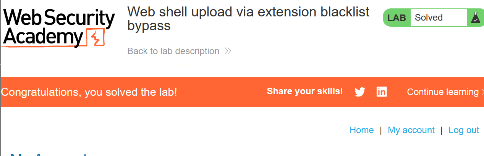
         2. 混淆文件扩展名:即使是最详尽的黑名单，也可能通过经典的混淆技术被绕过。【**核心思想是：利用验证逻辑与实际存储/执行逻辑之间的解析差异。**】
            1. 实战演练：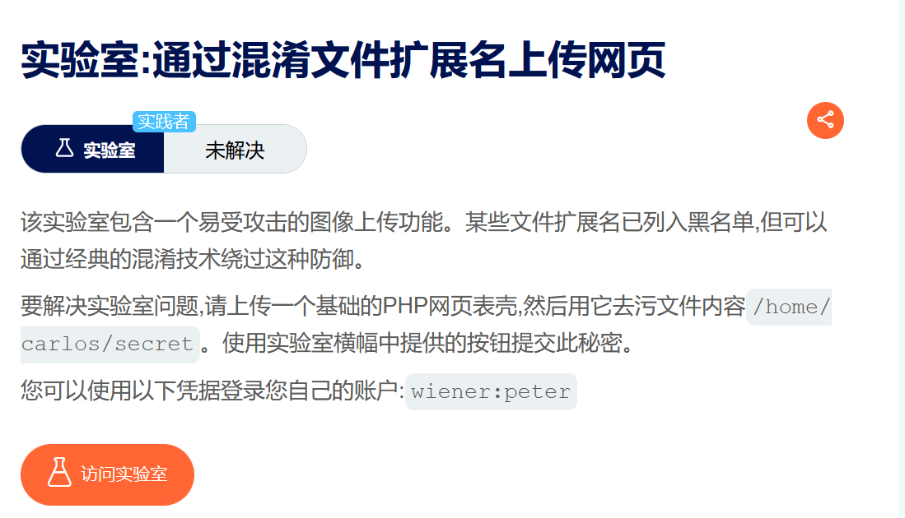
            2. 大小写绕过双写绕过：
            假设验证代码区分大小写，因而无法识别“exploit.pHp”实际上是一个“.php”文件；而后续将文件扩展名映射为MIME类型的代码却不区分大小写。这种不一致性便使得恶意PHP文件得以绕过验证，最终可能被服务器执行。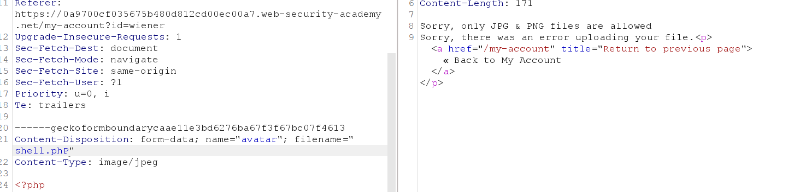发现这是白名单过滤
            3. 添加尾随字符
               示例：`exploit.php. 或 exploit.php[空格]`
               原理：
               Windows 特性： 在 Windows 文件系统中，文件名末尾的点或空格通常会被自动忽略或去除`test.php.`实际上会被保存为`test.php`
               字符串处理差异：验证代码可能使用了严格的字符串比较（例如 in_array 或 strpos），而文件系统在创建文件时会自动 trim 掉这些字符。
               利用：如果黑名单有`.php`后端直接保存`exploit.php.`绕过了检查，但操作系统保存为`exploit.php`导致可以被执行。
            4. URL 编码（或双重编码）
               示例：`exploit%2Ephp`
               原理：输入与输出,当上传文件名 exploit%2Ephp 时，Web 应用防火墙（WAF）或验证逻辑会解码并检查 exploit.php，然后拦截。
               绕过技巧：如果服务器在验证阶段不解码（即直接把 %2E 当作普通字符检查），而在存储阶段或打开文件时解码，就会产生差异。
               双重编码：exploit%252Ephp（即 % 被编码为 %25）。验证逻辑解码一次变成 exploit%2Ephp，发现没有危险字符；后端处理再解码一次变成 exploit.php。 
            5. 多字节 Unicode 字符
               示例：特殊字符`xC0 x2E`（Unicode 规范化为`.`）
               原理：
               规范化攻击： 某些 Unicode 字符序列在视觉上是一个点，或者经过 Unicode 规范化（Normalization）后会被转换成 ASCII 的点（.）
               绕过场景：假设黑名单过滤了`.php`
               提交的文件名包含特殊字符，例如`xC0 xAE`（在某些编码下表示长音符或特殊符号）
               验证代码检查时，没有将其识别为点，所以没匹配到 .php，允许上传。
               服务器在处理路径时，执行了 Unicode 规范化（Normalization Form Canonical Decomposition，NFD，即标准分解化），将`xC0 xAE`转换成了普通的`ASCII`点`.`
               原本`filexC0 xAEphp`变成了`file.php`从而被执行。
            6. 提供多个扩展名
               示例：`exploit.php.jpg`
               原理：
               黑名单/白名单检查中很多验证函数会用 substr($filename, -3) 或类似方法获取最后几个字符（即 .jpg）。如果只检查最后一个扩展名，它会通过图片检查。
               服务器解析：针对 Apache 或某些配置不当的服务器，处理程序（Handler）可能会从左到右依次识别扩展名，或者特定的 mod_mime 配置可能会将 .php 识别为可执行文件。
               结果： 验证阶段看到的是图片，执行阶段看到的是脚本。
               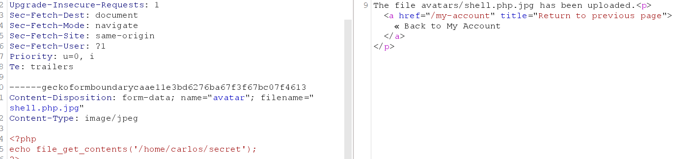上传成功尝试访问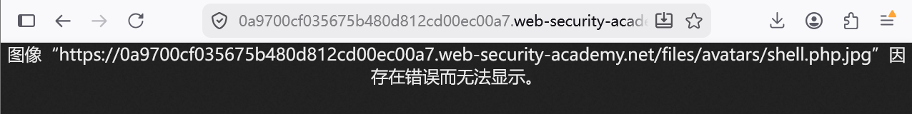未被识别为php脚本文件，本题无法用该方法绕过
            7. 使用分号或空字节（Null Byte）
               这是旧版 PHP 中非常经典的绕过方式。
               示例 A（分号）：`exploit.asp;.jpg`
               解析逻辑：在 IIS（Internet Information Services，微软的 Web 服务器） 6.0 或特定配置中，服务器在处理文件路径时，可能会忽略分号及其后面的内容。
               结果：验证逻辑看到`.jpg`放行，IIS 实际执行 `exploit.asp`
               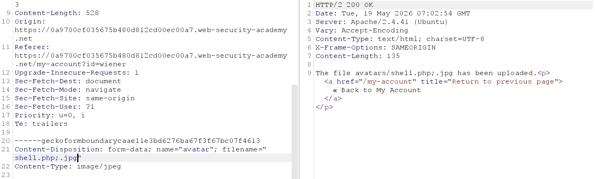
               尝试访问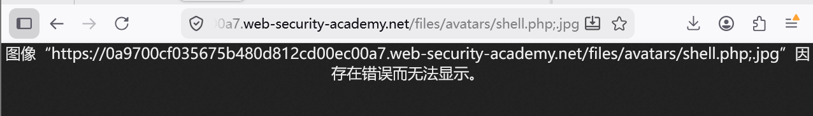还是无法被解析
               示例 B（空字节）：`exploit.asp%00.jpg`
               漏洞背景： 在 PHP 5.3 版本之前，处理文件路径的底层函数是用 C 语言编写的。在 C 语言中，\0（空字节）代表字符串的终结符。
               解析差异：
               PHP 验证层：使用 $_FILES['name'] 获取文件名，此时 %00 可能还未被解析，或者被视为普通字符，读取整个字符串`exploit.asp[NULL].jpg`看到`.jpg`允许上传。
               C 底层文件操作：当执行`fopen()`或`move_uploaded_file()`时，C 语言读到`\x00` 就认为字符串结束了。
               结果：最终保存/执行的文件名是`exploit.asp` 
               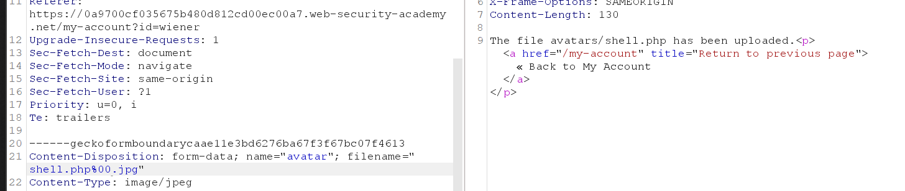可以看到被保存为shell.php大概率是成功了。尝试访问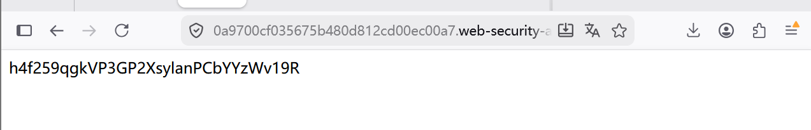成功输出文件内容
            8. 提交文件内容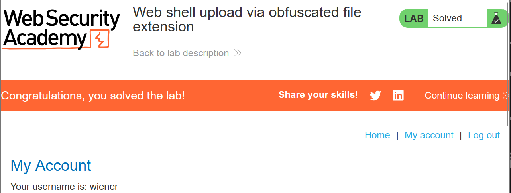 
            9.  总结：
               ```
               攻击者输入 --> [ 验 证 逻 辑 ] --> 判定为安全 --> [ 文 件 系 统 / 解 析 器 ] --> 执行恶意代码
                              ( 看 不 懂 )                           ( 看 懂 了 )
               ```
               验证逻辑：通常使用严格的字符串匹配、正则表达式或开发者写的黑名单数组。
               执行逻辑：涉及操作系统的文件系统规则（如 Windows 去点）、Web 服务器的模块识别（如 Apache 的 AddHandler）、或底层编程语言（如 C 语言的 Null Byte 处理）。
   3. 绕过内容验证（文件签名/魔术字节）
      1. 更安全的服务器不会隐式信任请求中指定的 Content-Type，而是会尝试验证文件内容是否确实符合预期。
      2. 在图像上传功能中，服务器可能会尝试验证图像的某些固有属性，例如其尺寸。例如，如果尝试上传一个PHP脚本，该文件根本不存在任何尺寸信息，因此服务器便可推断它绝不可能是图像，从而相应地拒绝该上传请求。类似地，某些文件类型通常会在其文件头或文件尾包含特定的字节序列，这些序列可被用作“指纹”或“签名”，以判断文件内容是否符合预期的文件类型。例如，JPEG文件总是以字节序列FF D8 FF开头
      这是一种更为可靠的文件类型验证方法，但即便如此，它也并非万无一失。借助ExifTool等专用工具，可以轻而易举地将恶意代码嵌入JPEG文件元数据中
      3. 实战演练：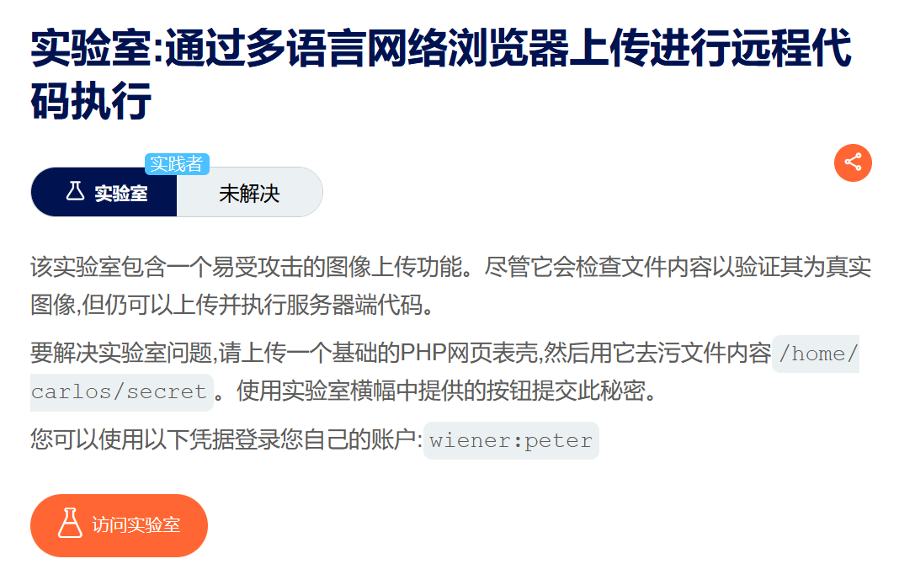
         1. 发现本题果然仅仅通过修改文件名无法通过校验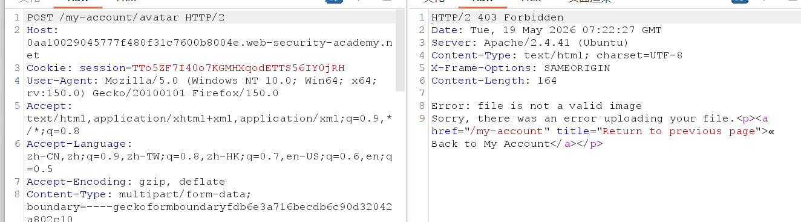
         2. 简单制作一个图片马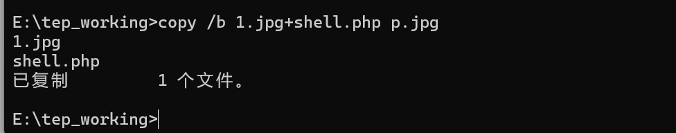
         3. 上传成功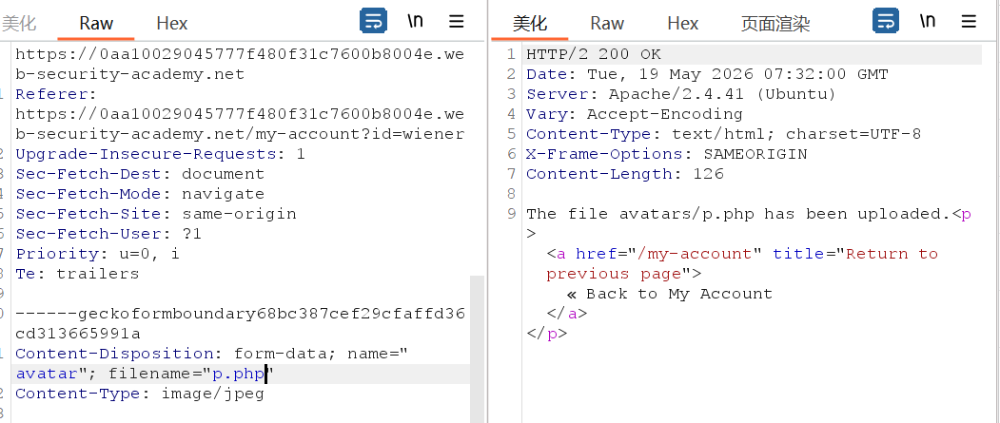
         4. 尝试访问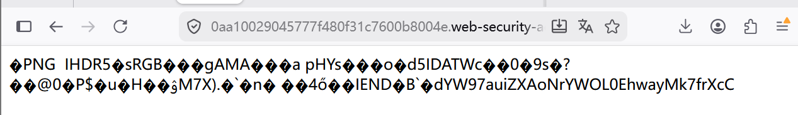成功输出目标文件内容【前面的乱码是图片马的前半部分图片内容，因为二进制数据所以输出为乱码】
         5. 将后半部分文本提交即可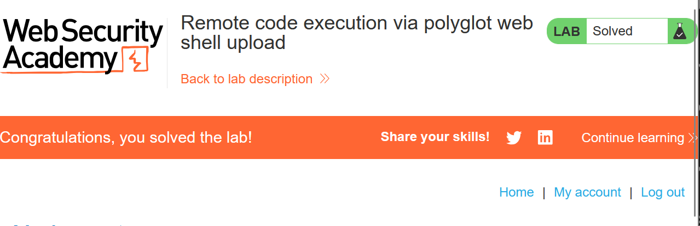
   4. 利用路径遍历更改上传目录
      1. 预防措施：服务器通常仅运行其 MIME 类型已被明确配置为可执行的脚本。否则，服务器可能会返回某种错误消息，或者在某些情况下，直接以纯文本形式提供该文件的内容：
      ```http
      GET /static/exploit.php?command=id HTTP/1.1
         Host: normal-website.com


         HTTP/1.1 200 OK
         Content-Type: text/plain
         Content-Length: 39

         <?php echo system($_GET['command']); ?>      
      ```    
      这种行为本身可能颇具研究价值，因为它可能导致源代码泄露；但与此同时，它也会使任何构建Web Shell的尝试失效。
      2. 绕过手法：此类配置在不同目录之间往往存在差异。用户上传文件的目录通常比文件系统中其他被假定为终端用户无法访问的位置具有更为严格的控制措施。如果能找到一种方法，将脚本上传至本不应存放用户提交文件的其他目录，服务器最终仍可能执行脚本。
      3. 实战演练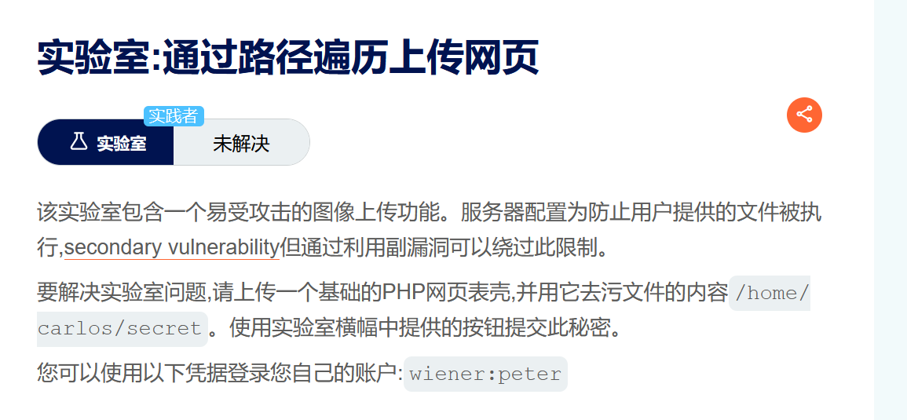
         1. 上传脚本文件到原目录下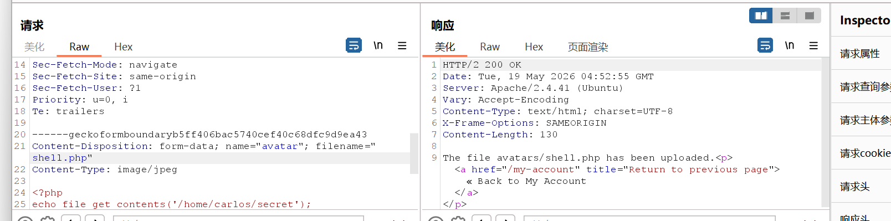
         2. 访问文件，发现服务器原样输出文件内容，并不会把它当做php脚本解析执行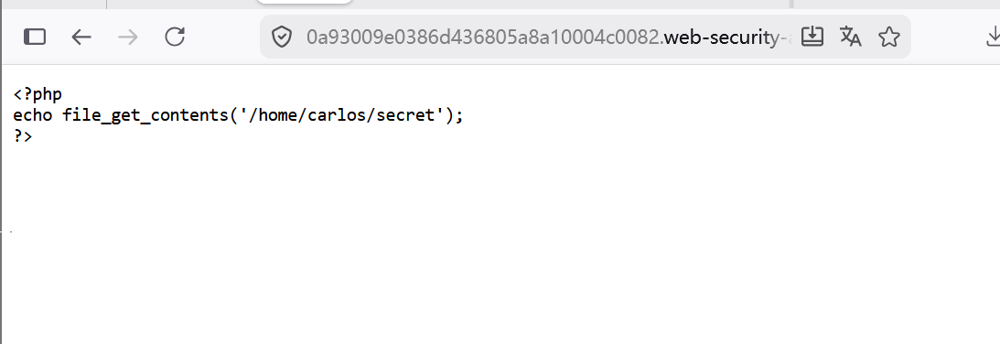
         3. 通过../遍历目录将脚本上传到别的目录下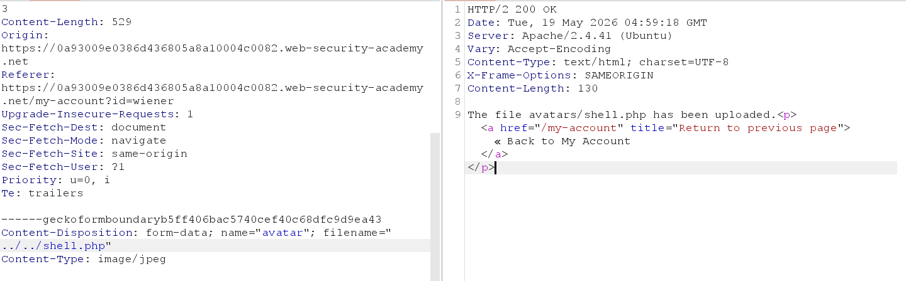发现../应该是被过滤了
         4. 将/进行url编码尝试绕过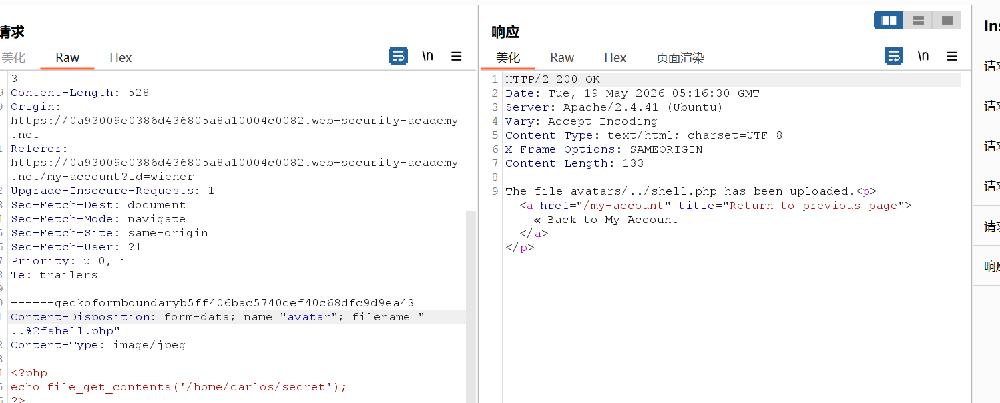
         5. 访问脚本文件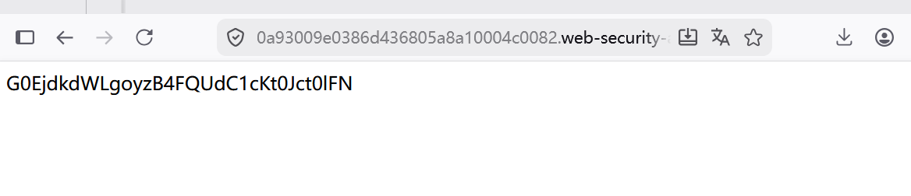成功获取文件内容
         6. 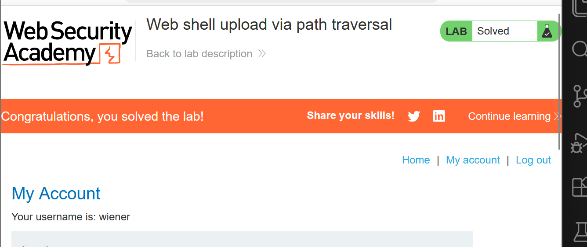
   5. 利用条件竞争（Race Condition）
      1. 现代框架对这类攻击的防护能力更强。它们通常不会直接将文件上传到文件系统中预设的目标位置，而是采取一些预防措施，例如先将文件上传至临时的、沙箱化的目录，并随机化文件名以避免覆盖现有文件。随后，框架会对该临时文件执行验证，仅在确认其安全后，才将其转移至最终目标位置
      2. 话虽如此，开发人员有时会脱离任何框架，自行实现文件上传处理。这不仅实现起来相当复杂，还可能引入危险的竞争条件，使攻击者能够完全绕过即使是最严格的验证措施
      3. 例如，某些网站会直接将文件上传至主文件系统，然后在文件未通过验证时再次将其删除。这种行为常见于依赖杀毒软件等工具来检测恶意软件的网站。整个过程可能仅需几毫秒，但在文件短暂存在于服务器上的这段时间内，攻击者仍有可能执行该文件
      4. 实战演练：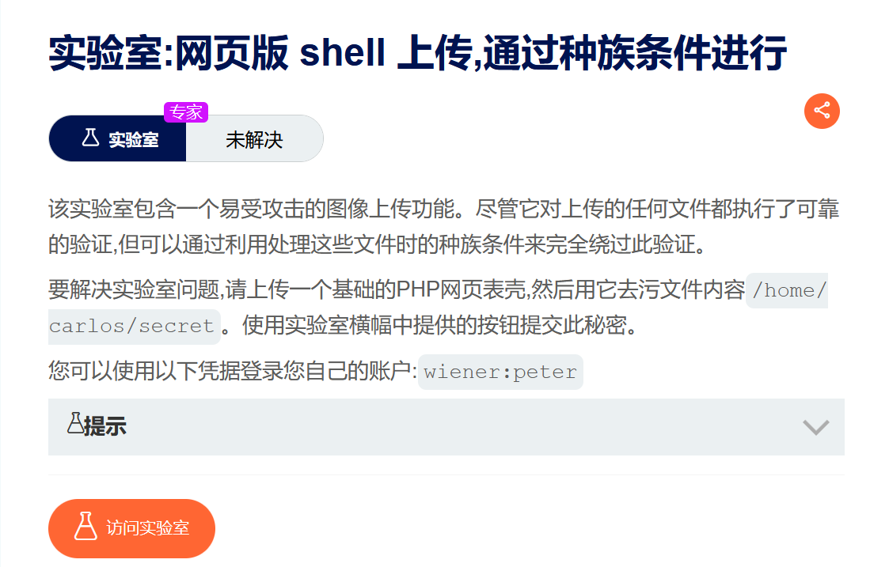
         1. 试了很多绕过发现过滤很严格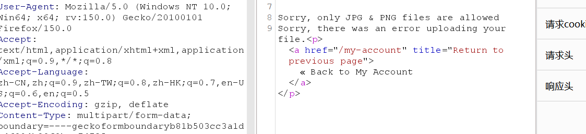
         2. 尝试条件竞争，抓一个上传文件的数据包放入intruder中并进行如下配置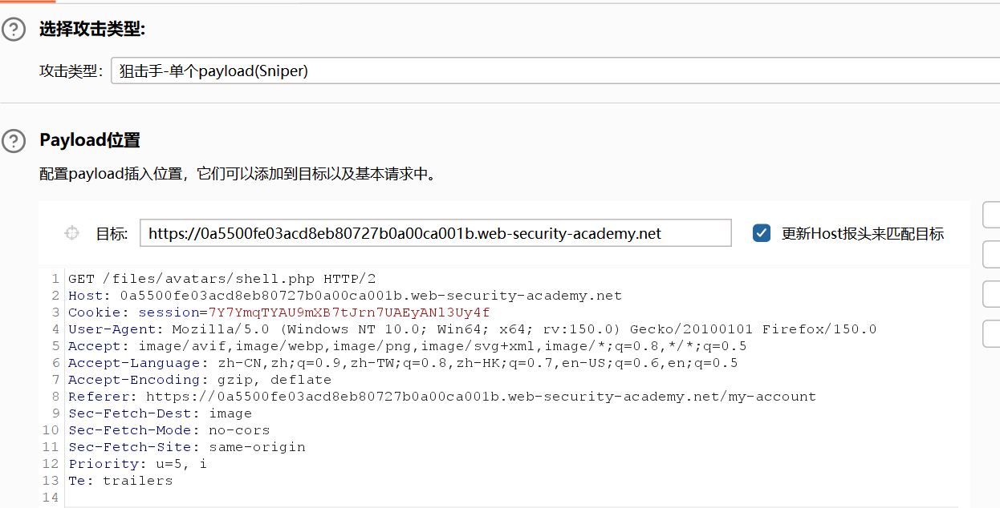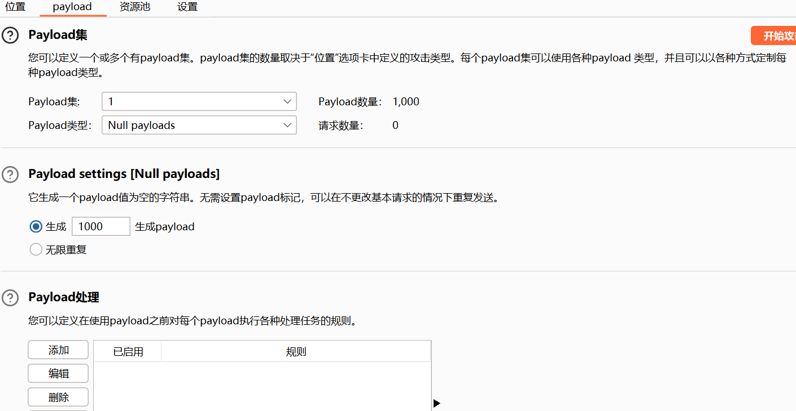
         3. 抓一个访问文件的数据包放入intruder中并进行如上配置，然后先开始上传文件的数据包重发接着快速开始访问文件的数据包重发
         4. 然后查看结果发现有可以成功访问的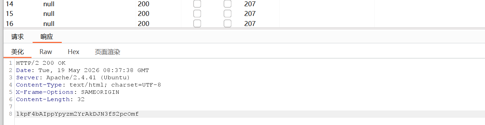
         5. 提交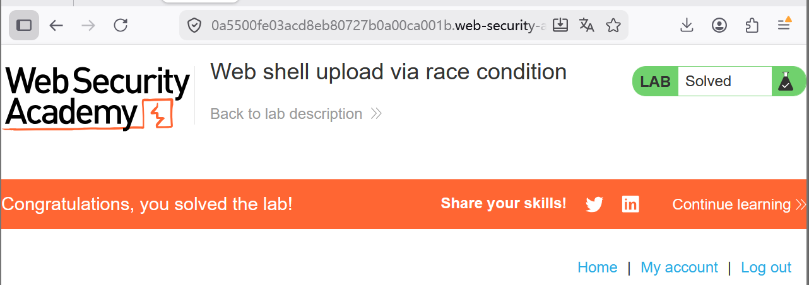
   6. 基于 URL 的文件上传竞争条件
      1. 类似的竞态条件也可能出现在允许通过提供URL上传文件的函数中。在这种情况下，服务器必须先通过互联网获取该文件，并创建一个本地副本，然后才能执行任何验证操作。
      2. 由于文件是通过HTTP加载的，开发人员无法使用其框架内置的安全文件验证机制。相反，他们可能需要手动创建临时存储和验证文件的流程，而这种方式的安全性可能略显不足。
      3. 例如，如果文件被加载到一个具有随机名称的临时目录中，理论上攻击者将无法利用任何竞争条件进行攻击。由于他们不知道该目录的名称，因此无法请求该文件以触发其执行。但另一方面，如果该随机目录名是使用诸如 PHP 的 uniqid() 这类伪随机函数生成的，则有可能被暴力破解。
      4. 为使此类攻击更容易实施，您可以尝试延长文件处理所需的时间，从而扩大暴力破解目录名的时间窗口。一种方法是上传一个更大的文件。如果该文件以分块方式处理，您可借此机会构造一个恶意文件：将有效载荷置于文件开头，其后紧跟大量任意填充字节。
## 无RCE时的其他利用方式
1. 客户端攻击（XSS）
   1. 尽管您可能无法在服务器上执行脚本，但仍有可能上传用于客户端攻击的脚本。例如，如果您能够上传 HTML 文件或 SVG 图像，则可能利用 `<script>` 标签构造存储型跨站脚本（XSS）攻击载荷。
   2. 如果上传的文件随后出现在其他用户访问的网页上，当其浏览器尝试渲染该页面时，便会执行该脚本。请注意，由于同源策略的限制，此类攻击仅在上传的文件由与上传目标相同的源提供服务时才有效。
2. 利用文件解析漏洞
   如果上传的文件看似既被安全存储又被安全提供服务，那么最后的手段便是尝试利用针对不同文件格式解析或处理过程中的特定漏洞。例如，若已知服务器会解析基于XML的文件（如Microsoft Office的.doc或.xls文件），这可能成为XXE注入攻击的潜在攻击向量。 
3. 使用 PUT 方法上传
   值得注意的是，某些Web服务器可能被配置为支持PUT请求。如果未采取适当的安全防护措施，即使Web界面未提供文件上传功能，攻击者仍可能利用此方式上传恶意文件。
   ```
   PUT /images/exploit.php HTTP/1.1
   Host: vulnerable-website.com
   Content-Type: application/x-httpd-php
   Content-Length: 49

   <?php echo file_get_contents('/path/to/file'); ?>
   ``` 
   **可以尝试向不同的端点发送 OPTIONS 请求，以测试哪些端点声明支持 PUT 方法。**
## 如何防御文件上传漏洞
1. 用白名单不用黑名单
2. 确保文件名不包含任何可能被解释为目录或遍历序列（如“../”）的子字符串。
3. 重命名已上传的文件，以避免发生文件名冲突，防止现有文件被覆盖
4. 在文件经过完整验证之前，请勿将其上传至服务器的永久文件系统。
5. 尽可能使用已有的文件上传预处理框架，而不是尝试自行编写验证机制。