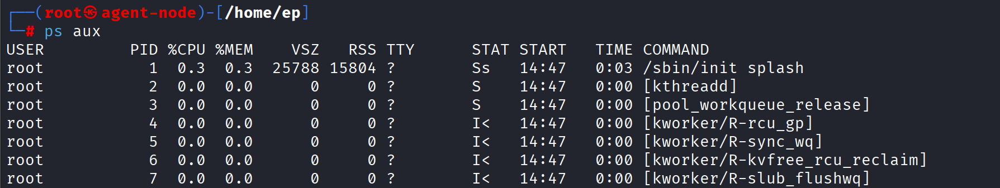
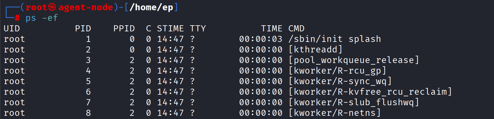
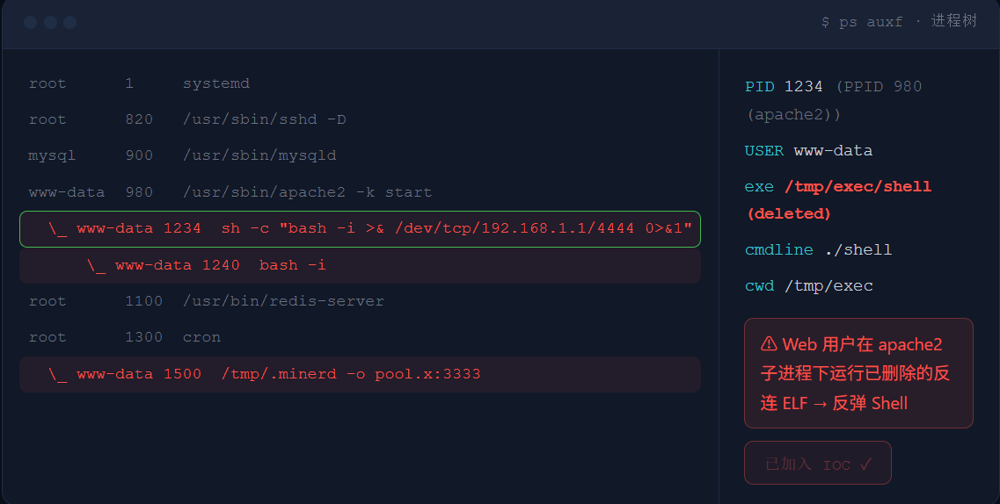
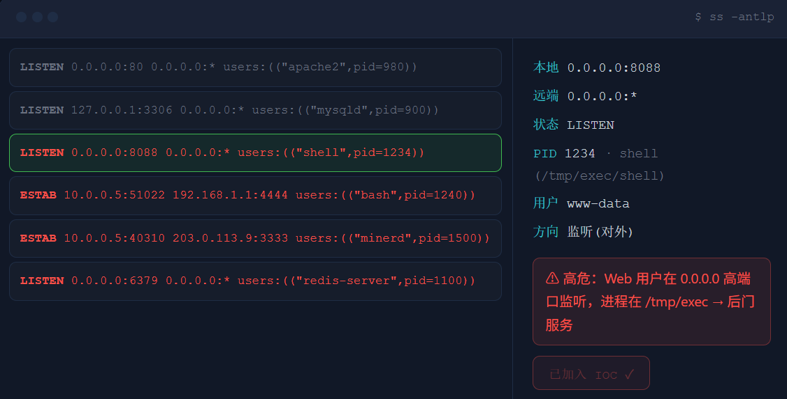

# 查找可疑进程
>从磁盘文件侧能够发现可疑样本，但攻击者的后门可能已经执行,甚至删掉磁盘文件后仍在内存里运行。因此需要进行运行时排查:进程在不在、从哪启动、由谁启动、是否还攥着已删除的文件。

## 进程树、deleted进程、/proc

**关键命令**

- 用 ps aux / ps -ef / ps auxf 查看进程

- 用 lsof | grep deleted 找已删除仍运行的程序

- 查 /proc/<pid> 的 exe/cmdline/cwd/environ

### ps aux / ps -ef：基础查看




| 字段 | 含义 | 排查价值 |
|------|------|----------|
| USER | 进程所属用户 | Web 用户启动的 shell/miner 高危 |
| PID | 进程 ID | 后续查 `/proc/<pid>` |
| PPID | 父进程 ID | 判断由 Web / SSH / cron / systemd 启动 |
| CMD | 启动命令 | 是否伪装、是否有可疑参数 |

>www-data / apache / nginx / tomcat 这类 Web 用户启动的 bash / sh / python / perl / nc / curl / wget、矿机、未知 ELF,都要优先关注——正常情况下 Web 用户不该去跑这些。

### ps auxf：顺着进程树,揪出"谁启动了谁"


*:apache2 → sh -c → bash -i >& /dev/tcp/...。Web 服务进程下面挂着 bash 反弹 Shell,几乎可以确定是 WebShell 触发了命令执行。进程树最大的价值,就是一眼看出这种"不该有的父子关系"*

### deleted 进程：删了文件,进程还在
>攻击者常常先执行恶意程序、再删掉磁盘文件,想让你找不到样本。但 Linux 进程仍持有已删除文件的句柄,lsof 和 /proc 照样能看到 deleted 线索。


>Web 用户 / 低权限用户运行 deleted ELF,是高危入侵迹象——正常程序不会把自己的可执行文件删掉还继续跑。

### /proc/<pid> 四个关键入口

- /proc/<pid>/exe   进程实际可执行文件(deleted 也能看出来)

- /proc/<pid>/cmdline   完整启动参数

- /proc/<pid>/cwd   进程当前工作目录

- /proc/<pid>/environ   环境变量,可能泄露路径 / 密钥 / 上下文

>关键纪律:不要第一时间 kill 进程。先记录 PID、命令行、exe、cwd、网络连接、父进程——证据保全优先,处置在后。一 kill,内存里的现场就没了。

### IOC清单

可疑进程：

- PID 1240 · www-data · bash -i · 父进程为反连 shell 1234

- PID 1234 · www-data · /tmp/exec/shell (deleted) · bash -i /dev/tcp/192.168.1.1/4444

- PID 1500 · www-data · /tmp/.minerd · 挖矿外连 pool.x:3333

可疑原因：

- Web/低权限用户启动 Shell 或未知 ELF

- 进程文件已 deleted

- 父进程链指向 Web 服务或 cron

下一步（后续章节）：

- 检查端口和外联连接

- 检查启动来源日志

- 保留样本和命令输出

>进程排查的核心不是"看到陌生进程就杀",而是先还原:谁启动、从哪启动、执行了什么、是否 deleted、是否关联网络连接。证据记录完整后再处置

## 端口、连接、进程关联
>WebShell、反弹 Shell、矿机、远控,几乎都要监听端口或对外连接。端口排查的目标,就是把 IP、端口、PID、进程串成一条线。

### ss -antlp：看监听和连接

-a	所有连接	
-l	仅监听
-n	不解析域名/服务名	
-p	显示进程
-t	TCP



>陌生高端口监听、Web 用户进程监听、对外 ESTABLISHED 到异常 IP,都需要进一步排查。注意:非 root 执行 netstat/ss 可能看不到 PID/程序名,需切到有权限账号或 sudo。

### lsof -i：端口 ↔ 进程双向查 
>$ lsof -i :8088 # 从端口查进程
```
 COMMAND PID USER FD TYPE NODE NAME shell 1234 www-data 3u IPv4 ... *:8088 (LISTEN) 
```

>lsof 既能从端口查进程(lsof -i :8088),也能从进程查连接(lsof -p <pid> -i)。现场工具不全时,ss / netstat / lsof 三个都要会——不一定每台机器都装齐。

### 连接状态含义

| 状态 | 含义 | 排查意义 |
|------|------|----------|
| LISTEN | 本机在某端口监听等待连入 | 陌生高端口 / Web 用户监听 → 后门服务 |
| ESTABLISHED | 已建立的双向连接 | 连到外部异常 IP → 反弹 / C2 / 矿池 |
| TIME_WAIT | 连接刚关闭的收尾状态 | 一般正常，大量出现看业务 |

| 可疑网络现象 | 可能含义 |
|--------------|----------|
| `www-data` 连外部 IP 高端口 | WebShell 反弹 |
| `/tmp` 下 ELF 监听端口 | 后门服务 |
| `bash`/`sh` 出现在网络连接进程里 | 高危 |
| 大量外联未知 IP | 矿机 / 扫描 / C2 |
| Redis/MySQL 对外开放 | 未授权 / 弱口令风险 |

### IOC清单

网络 IOC：
- LISTEN 0.0.0.0:8088 · pid 1234 shell · www-data · /tmp/exec/shell

- ESTAB 10.0.0.5 → 192.168.1.1:4444 · pid 1240 bash · www-data · 反弹Shell

- ESTAB 10.0.0.5 → 203.0.113.9:3333 · pid 1500 .minerd · www-data · 矿池外连

- LISTEN 0.0.0.0:6379 · pid 1100 redis · 对外开放（未授权风险）

可疑原因：

- Web/低权限用户进程存在网络连接

- 连接远端 IP/端口异常

- 进程路径位于 /tmp 或 Web 上传目录

>端口排查不是只看"开了什么端口",而是把端口、连接、PID、进程路径、启动来源串起来。只有完成关联,才能判断它是正常服务还是后门通信