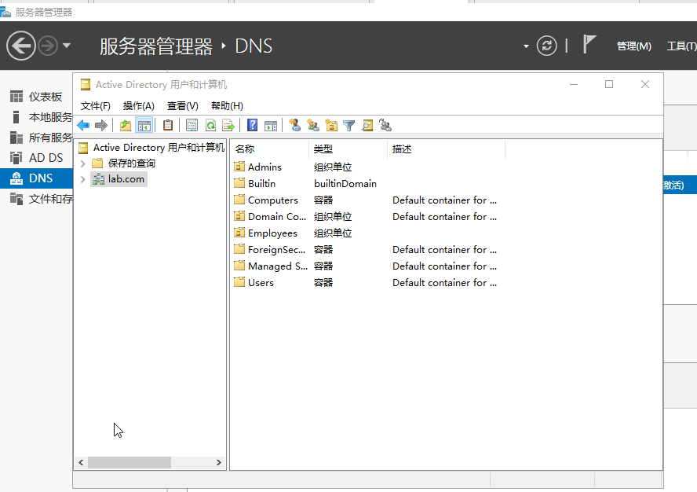
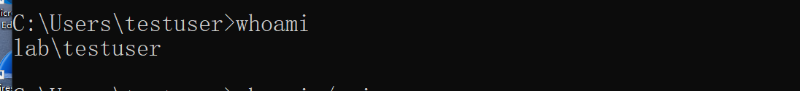
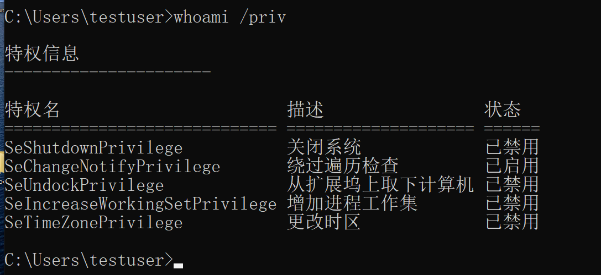
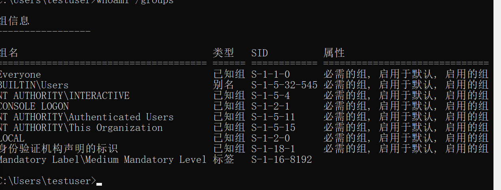
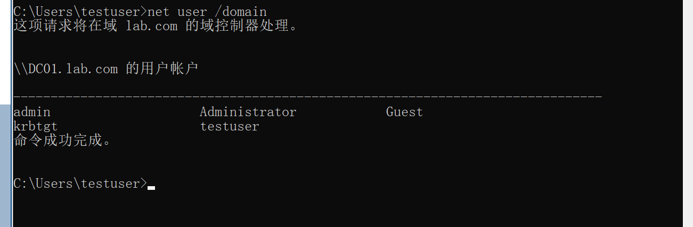
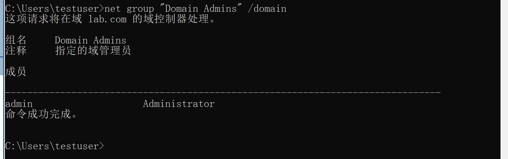
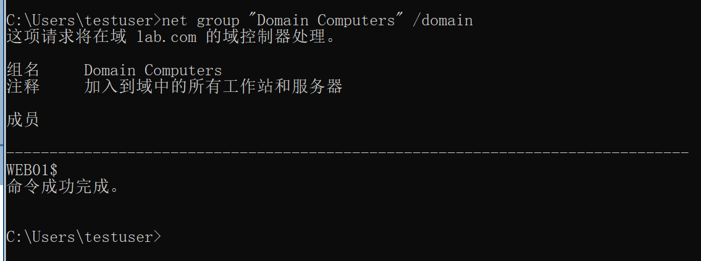
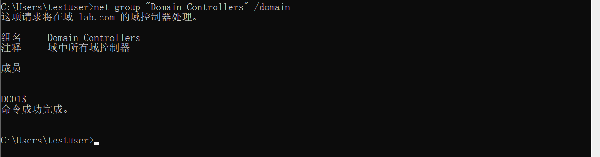

## Windows Domain
1. 为什么需要域
   - 小网络（5台电脑、5人）：手动登录每台电脑、为每个员工创建账户、单独配置策略、现场修机器——这些都可行。
   - 大网络（157台电脑、320人、4个地点）：不可能。因为：
     - 每台电脑上都要维护所有人的账户和权限，工作量巨大。
     - 安全策略（如禁止访问控制面板）难以统一部署。
     - 用户换电脑后，其账号和设置无法自动同步。 
2. Windows域的核心概念
   - Windows域：一组用户和计算机，由同一家企业集中管理
   - Active Directory（AD）：存储域内所有用户、计算机、策略等信息的中心数据库
   - 域控（Domain Controller，DC）：运行 AD 服务的服务器。负责：
     - 验证用户登录（无论用户使用哪一台域内电脑）
     - 下发安全策略
     - 管理所有对象（用户、组、计算机等）
3. 关键术语
   - Domain Controller (DC)：运行 AD 的服务器，负责认证和策略下发
   - Active Directory (AD)：目录服务数据库，存储所有对象
   - Organizational Unit (OU)：组织单位，用于对用户/计算机分组管理
   - Group Policy Object (GPO)：组策略对象，定义一组安全或配置规则
   - Domain Local / Global / Universal Group：不同作用域的组，用于权限管理 
## Active Directory
### AD DS是什么
Active Directory 域服务 (AD DS)：存储了网络中所有“对象”的信息。对象包括用户、计算机、组、打印机、共享文件夹等。
### 三种核心对象类型
1. 用户 (User) — 安全主体
   安全主体 = 可以被域认证、并可以被赋予资源（文件/打印机）权限的对象。
   用户分为两类： 
    | 类型 | 用途 | 特点 |
    |------|------|------|
    | 人员 | 员工登录网络 | 有正常访问权限 |
    | 服务 | 运行 IIS、MSSQL 等服务 | 只有运行特定服务所需的最小权限 |   

    ---

2. 计算机 (Machine) — 安全主体
   - 每台加入域的计算机都会自动创建一个计算机账户
   - 计算机账户的命名规则：计算机名+$
     例如：一台名为DC01的计算机，其账户名是DC01$
   - 计算机账户密码：自动定期更换，通常为 120 位随机字符，用户无法直接登录。
   - 权限：默认是它所在计算机的本地管理员。 
3. 安全组 (Security Group)
   - 用于批量分配权限：把用户加入组，组拥有的权限会自动继承。
   - 组的成员可以是：用户、计算机、甚至其他组。
   - 组也是安全主体
   - 常见的默认安全组
     
    | 组名 | 权限说明 |
    |------|----------|
    | Domain Admins | 整个域的超级管理员，可管理任何计算机（包括域控制器） |
    | Server Operators | 可管理域控制器，但不能修改管理员组成员 |
    | Backup Operators | 可无视文件权限，访问任何文件（用于备份） |
    | Account Operators | 可创建或修改域中的其他账户 |
    | Domain Users | 包含域中所有用户账户 |
    | Domain Computers | 包含域中所有计算机账户 |
    | Domain Controllers | 包含所有域控制器 |      

    ---

4. *用户账户*vs*计算机账户*核心对比
 
    | 特性 | 用户账户 | 计算机账户 |
    |------|----------|-------------|
    | 代表对象 | 一个人或一个服务（如 IIS、SQL Server） | 一台加入到域的物理机或虚拟机 |
    | 命名规则 | 用户名（如 john.doe） | 计算机名 + $ 符号（如 PC-001**$**） |
    | 身份验证 | 由人输入用户名和密码进行交互式登录 | 由操作系统在后台使用账户密码自动进行 |
    | 密码管理 | 管理员或用户可更改密码；密码有过期策略 | 系统自动维护，随机生成 120 位复杂密码，定期自动更换 |
    | 交互式登录 | ✅ 可以。直接登录到桌面操作 | ❌ 不能。无法用 COMPUTERNAME$ 账号登录电脑桌面 |
    | 默认权限 | 普通用户权限（在域和本地计算机上受限） | 其所在计算机的本地管理员权限 |
    | 主要用途 | 访问资源（文件、打印机、邮箱）、执行应用 | 建立计算机与域的信任关系、接收组策略、访问域内资源 |
    | 能否被禁用 | ✅ 可以。禁用后该用户无法登录任何域内电脑 | ✅ 可以。禁用后该计算机无法访问域资源，相当于被踢出域 |

    计算机账户让电脑“有资格进入公司网络”，用户账户让人“有资格使用公司资源”。
    两者配合，人通过电脑，完成登录。
    
    ---

### 组织单元 (OU)
OU (Organizational Unit) = 容器对象，用于按策略需求对用户/计算机进行分类
- 一个用户同时只能属于一个 OU（这很重要）
- OU 主要用于下发组策略 (GPO)，而不是用于权限分配。
### AD 用户和计算机管理工具
在域控制器上，打开 Active Directory 用户和计算机

| 容器 | 内容 |
|------|------|
| Builtin | 默认安全组（如 Backup Operators） |
| Computers | 新加入域的计算机（默认放这里，可移动） |
| Domain Controllers | 域控制器账户 |
| Users | 默认用户和全局安全组 |
| Managed Service Accounts | 服务账户 |

---

### 安全组 vs OU
| 对比项 | 安全组 (Security Group) | 组织单元 (OU) |
|--------|-------------------------|----------------|
| 主要用途 | 分配资源权限（共享文件夹、打印机） | 应用策略（密码策略、桌面限制） |
| 成员数量限制 | 一个用户可属于多个组 | 一个用户只能属于一个 OU |
| 能否用于权限控制 | ✅ 是（设置 ACL） | ❌ 否（除非结合组策略循环处理） |
| 范围 | 域级别或本地 | 仅域内组织 |

---

举例说明区别
**OU**：把销售部的人放在 Sales OU 下 → 对他们统一应用“禁用控制面板”的策略。
**安全组**：创建 Sales Share Access 组 → 把销售部员工加进去 → 给这个组分配访问 `\\server\sales `共享文件夹的权限。
一个用户可以：
- 属于 Sales OU（控制策略）
- 同时属于 Share Access 组（控制权限）
- 还属于 Remote Desktop Users 组（另一个权限）
## 组策略

## 树、森林、信任关系
>从单域到树、再到森林，以及它们之间的信任关系，决定了攻击面的大小和横向移动的路径。
### 为什么需要多个域
**单域具有局限性**
  - 法律合规：不同国家的数据法律不同（如 GDPR），需要独立的组策略。
  - 管理独立：各地 IT 团队需要互不干扰地管理本地资源。
  - 避免单一故障点：一个域出问题（如误删 OU），不会影响整个公司。
**解决方案**：将网络拆分成多个域，形成树和森林。
### 树
## 常用命令
1. `whoami`
    | 输出 | 含义 |
    |----------|------|
    | `lab\testuser` | ✅ 当前登录的是域用户 testuser，属于 lab.com 域 |
    | `desktop-xxx\user1` | ❌ 当前是本地用户，不是域用户 |

    ---

    
2. `whoami /priv`
   查看当前用户的特权信息 
   
3. `whoami /groups`
    查看当前用户的SID和所属组 
    
4. `net user /domain`
   查看所有域用户 
    
   - admin — 创建的备用域管理员
   - Administrator — 默认域管理员
   - Guest — 默认禁用来宾账户
   - krbtgt — Kerberos 服务账户，不能删除/修改
   - testuser — 创建的测试用户
5. `net group "Domain Admins" /domain`
   查看Domain Admins组中的成员 （域管理员成员）
   
   **渗透价值**：这是域渗透的终极目标——拿到域管理员组的成员列表，然后想办法把自己加进去。
6. `net group "Domain Computers" /domain`
   查看所有域内计算机
    
7. `net group "Domain Controllers" /domain`
   查看域内所有域控制器
    
## 小结