# 域环境搭建

## 环境信息
| 项目 | 配置 |
|------|------|
| 虚拟机软件 | VMware Workstation Pro |
| 域控（DC） | Windows Server 2019 |
| 域成员 | Windows 10 |
| 攻击机 | Kali Linux |
| 域名 | `lab.com` |
| 域控IP | `192.168.162.10` |
| 域成员IP | `192.168.162.20` |

---

## 搭建步骤
### 安装域控（Windows Server 2019）
1. 安装Windows Server2019操作系统并初始化
   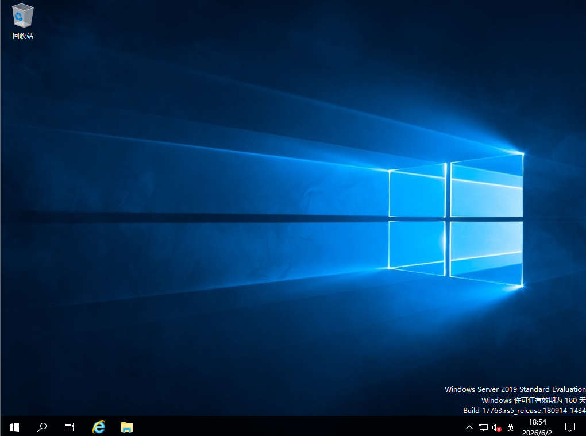 
2. 配置固定IP地址
   ```
    IP地址：    192.168.162.10
    子网掩码：  255.255.255.0
    默认网关：  192.168.162.2   （VMware NAT模式的默认网关）
    DNS服务器： 127.0.0.1        （先用本机）
    备用DNS：   8.8.8.8
   ```
   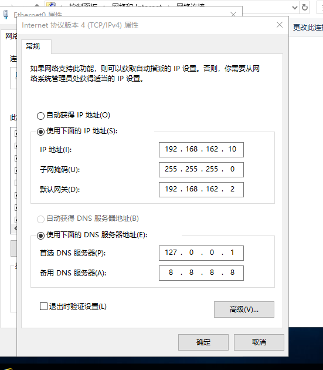 
3. 安装Active Directory域服务
   1. 打开服务器管理器
   2. 点击右上角"管理" → "添加角色和功能"
   3. 到"服务器角色"这一步：
      - 勾选 Active Directory域服务
      - 勾选 DNS服务器（会弹出依赖功能提示，点击"添加功能"）
    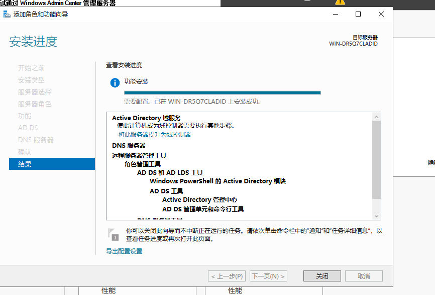 
4. 提升为域控，新建域`lab.com`
   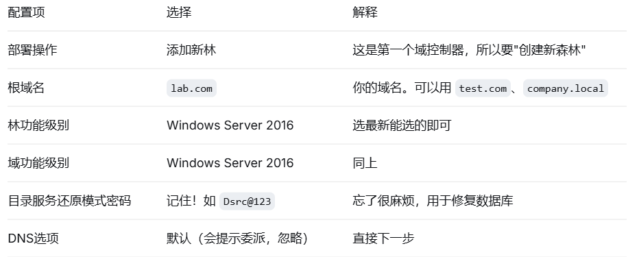 
   配置完成后重启
5. 验证域控是否正常
   ```cmd
   # 查看当前域名
   whoami
   # 查看DNS是否正常
   nslookup lab.com
   # 查看域用户
   net user /domain
   ``` 
   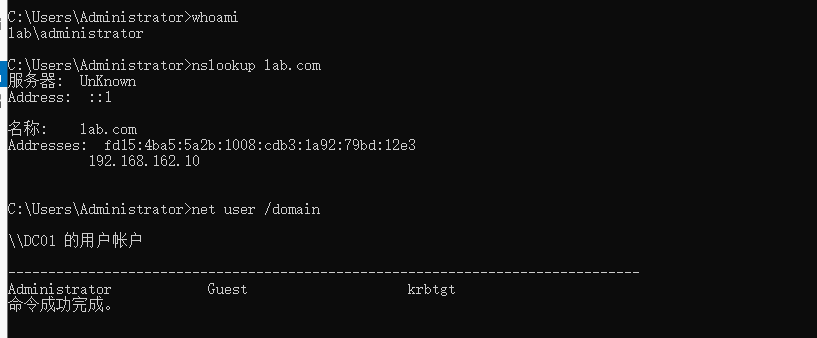
6. 创建域管理员 
   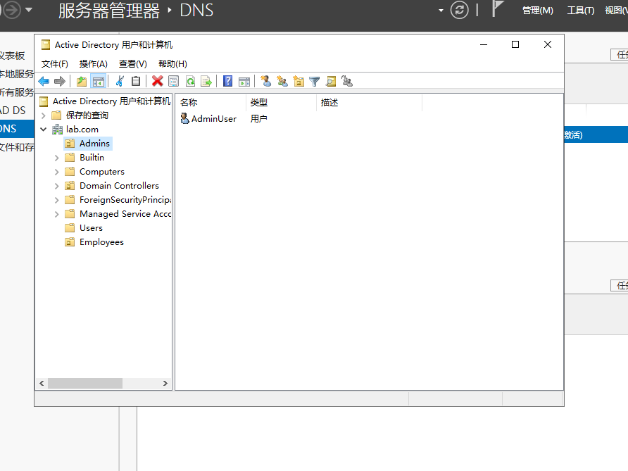 
7. 创建测试域用户
   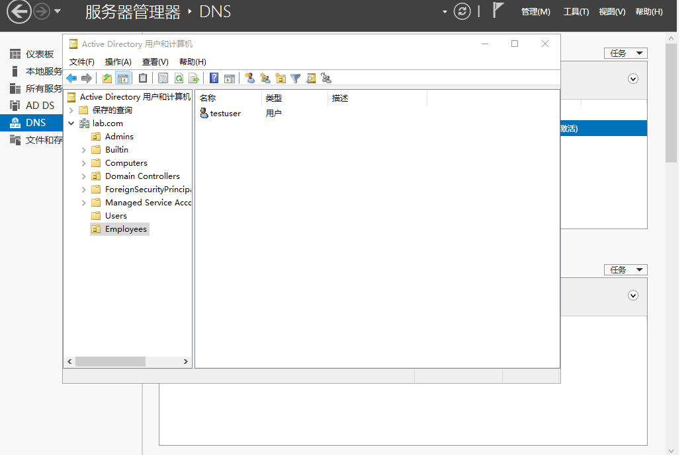 
   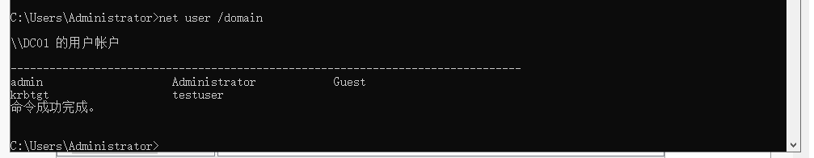
### 加入域成员（Windows 10）
1. 安装Windows 10
2. 配置DNS
   ```
    控制面板 → 网络和共享中心 → 更改适配器设置
    → 右键"以太网" → 属性 → IPv4
    → 首选 DNS：192.168.162.10（域控 IP）
   ``` 
   ipconfig /all 查看DNS配置
   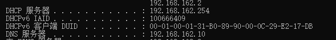
   手动配置ip`192.168.162.20`
   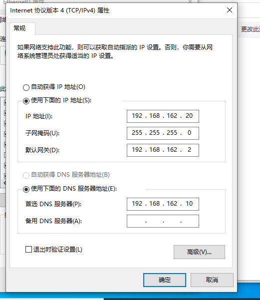
3. 加入域
   ```
    右键"此电脑" → 属性 → 更改设置
    → 计算机名选项卡 → 更改
    → 隶属于：域 → 输入 lab.com
    → 输入域管理员凭证(用 lab\Administrator 和密码认证)
    → 重启
   ```
   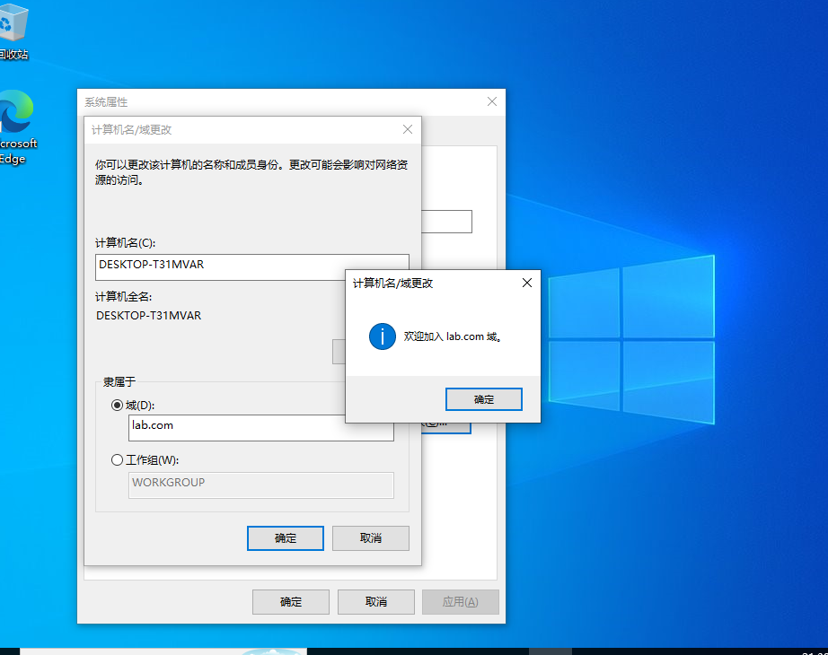 
   使用域账户testuser登录
   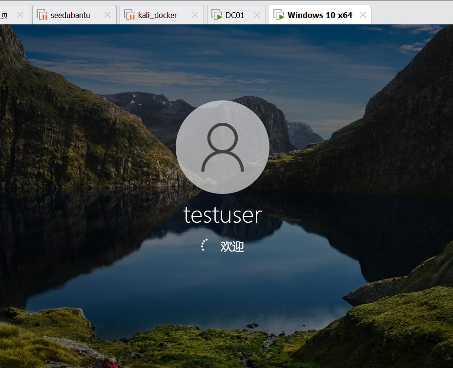
### 验证环境
1. 域成员能否解析域控`ping dc01.lab.com`【可以】
   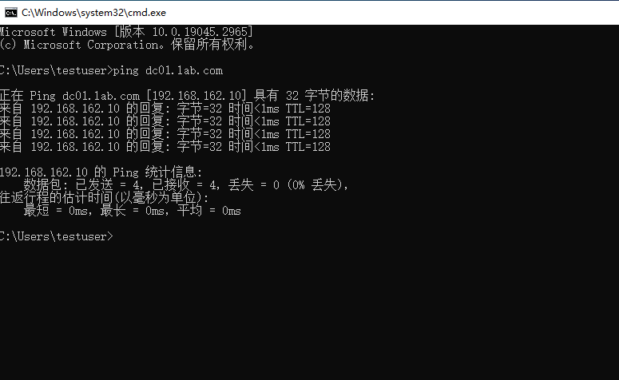
2. 能否用域用户登录 
   登录域用户testuser成功
   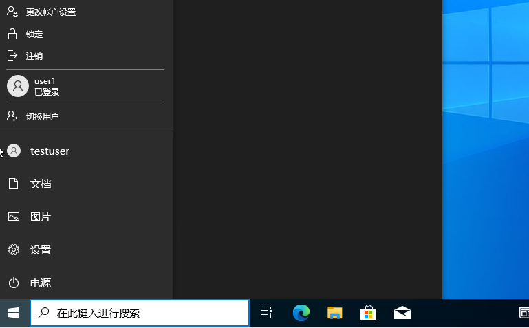 
3. 查看当前域为lab
   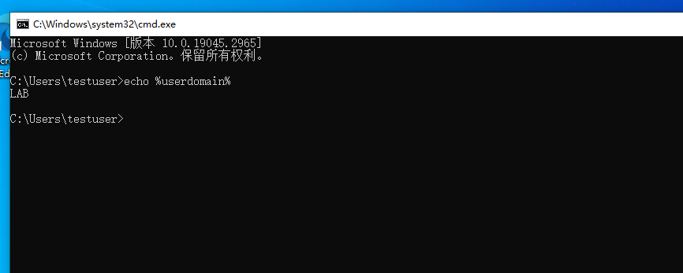 
4. 域控上查看域成员 
   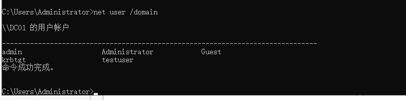
## 网络拓扑
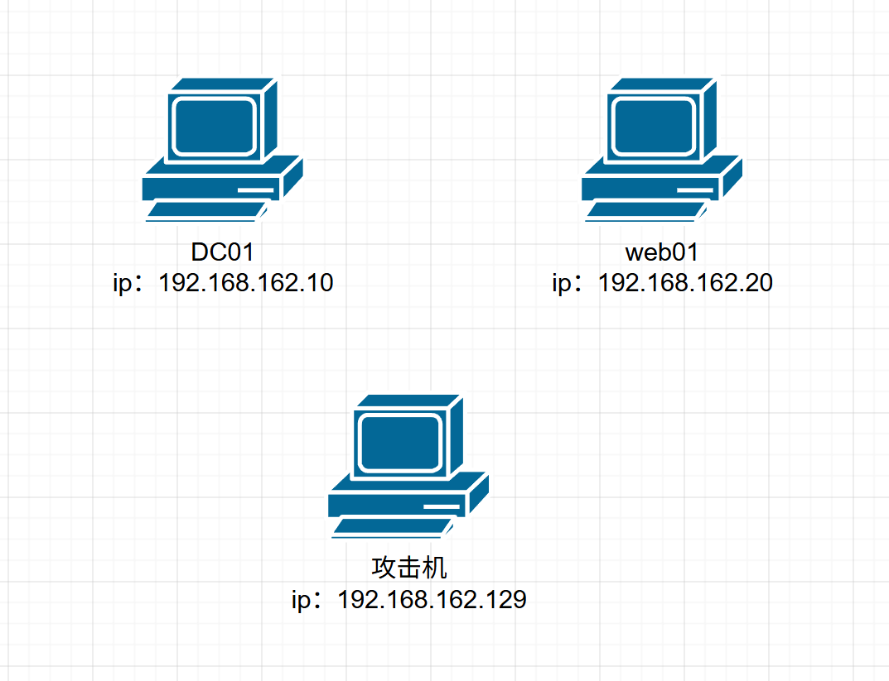
[最小域环境网络拓扑图](./small-net-topology.drawio)
## 快照备份
DC01
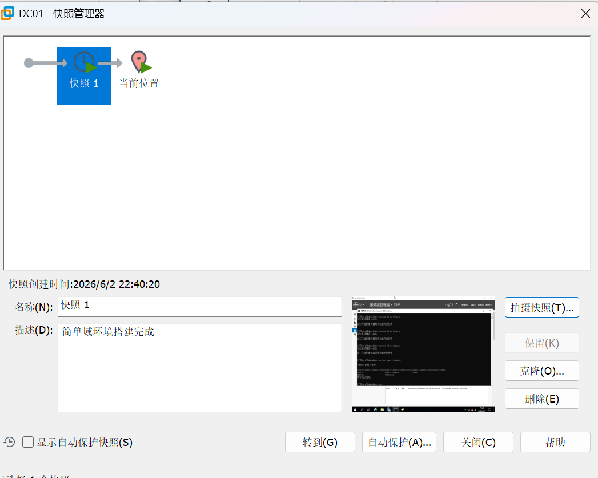
web01
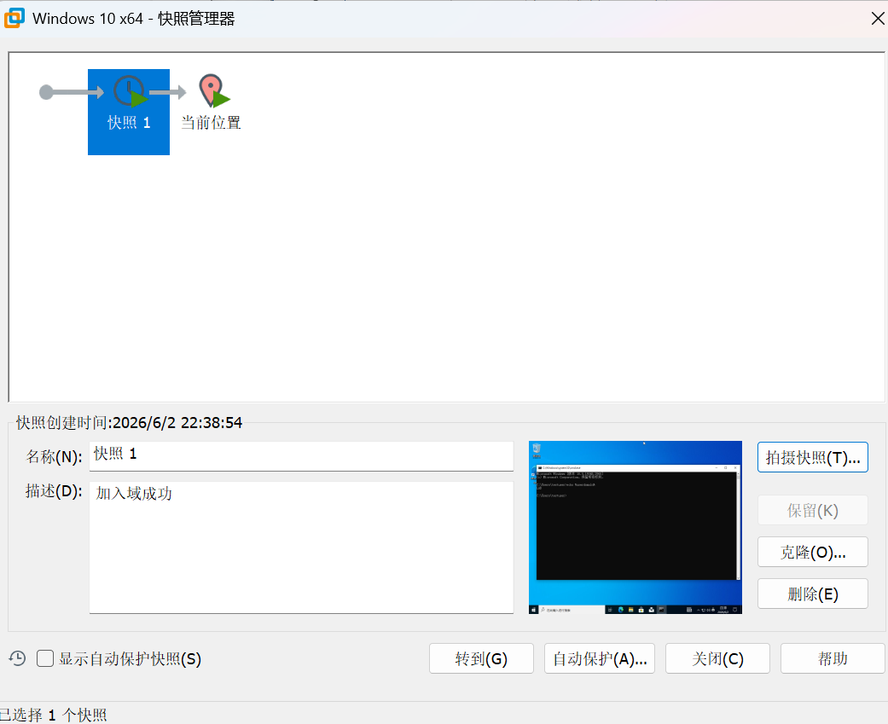
