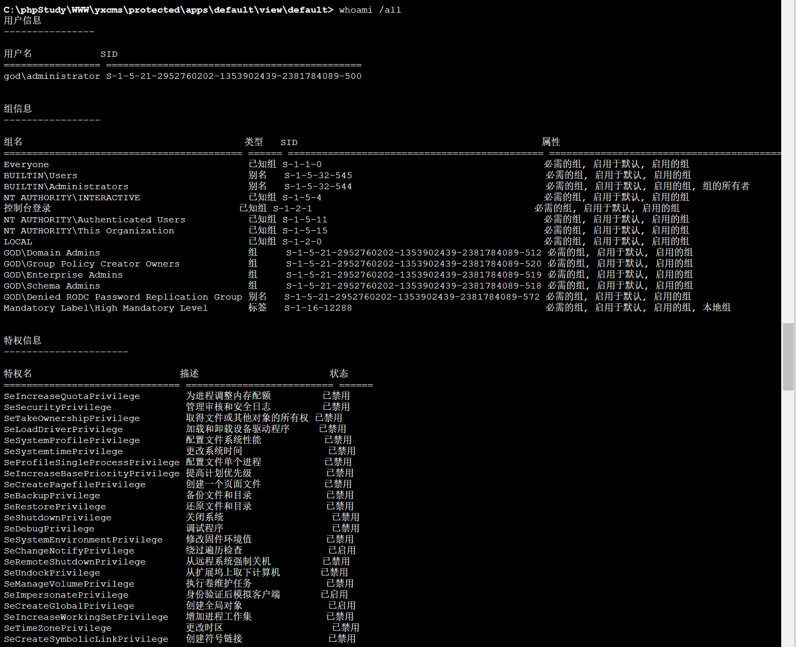
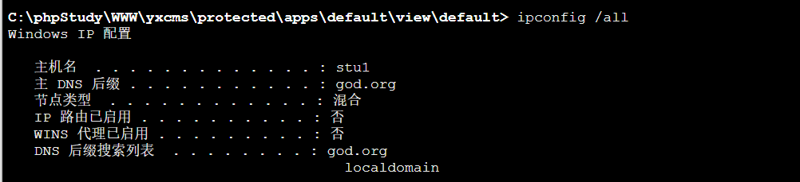
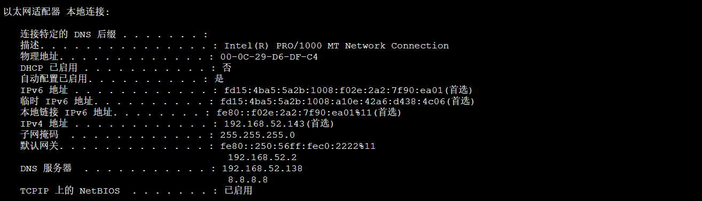
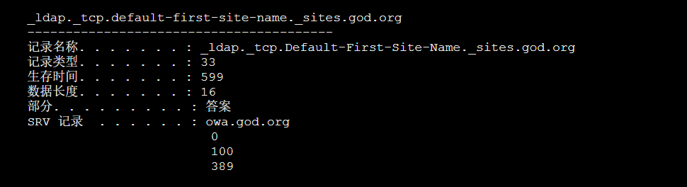
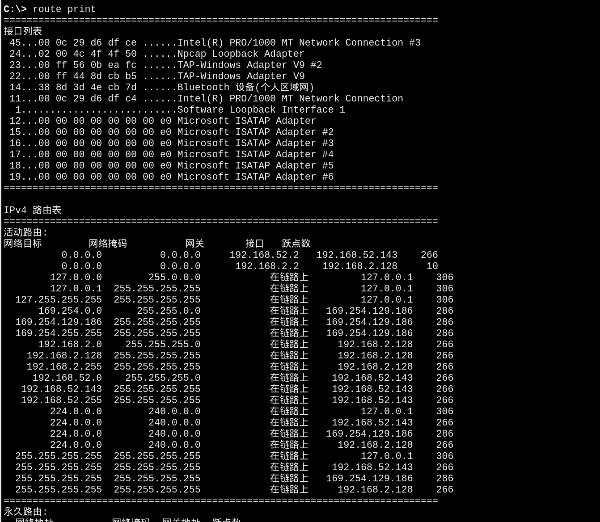
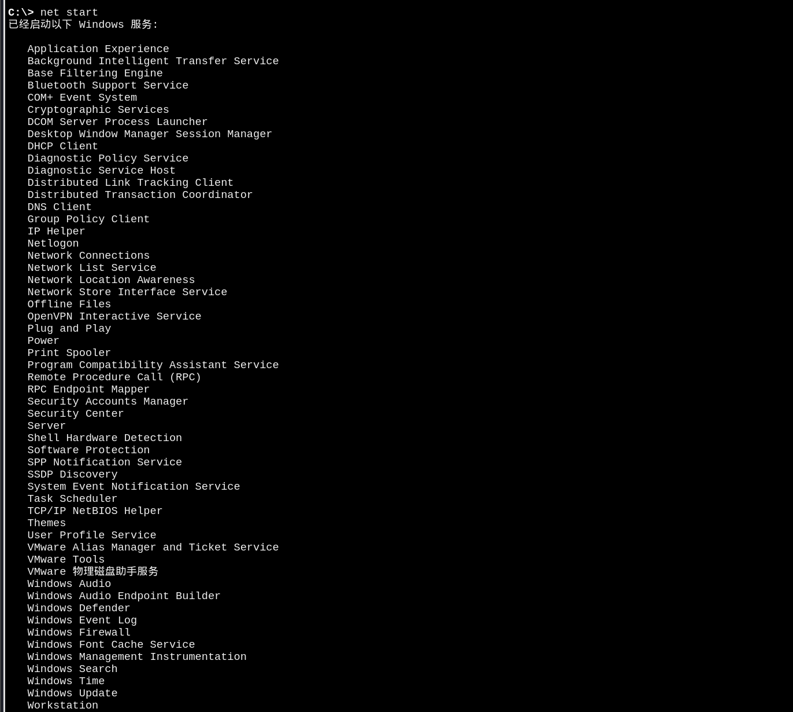
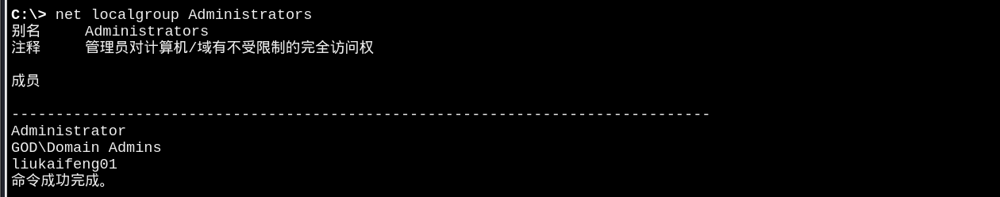

# 信息收集

## whoami /all:用户身份信息



**用户名和SID**

`用户名            SID                                          
================= =============================================
god\administrator S-1-5-21-2952760202-1353902439-2381784089-500`

| 字段 | 值 | 含义 |
|------|-----|------|
| 用户名 | `god\administrator` | 域 `god.org` 的内置管理员账户 |
| SID | `S-1-5-21-...-500` | SID 后缀 `-500` 是 Administrator 账户的固定标识，说明这是真正的内置管理员，不是伪装的 |
| SID 前缀 | `S-1-5-21-2952760202-1353902439-2381784089` | 域 SID，域内所有用户共享这个前缀，后续黄金票据需要用到 |

**组信息**

| 组名 | SID | 权限含义 |
|------|-----|----------|
| `BUILTIN\Administrators` | `S-1-5-32-544` | 本地管理员，可以操作本机任何资源 |
| `GOD\Domain Admins` | `S-1-5-21-...-512` | 域管理员，可以管理域内所有计算机 |
| `GOD\Enterprise Admins` | `S-1-5-21-...-519` | 企业管理员，可以管理整个 AD 森林（如果有多个域） |
| `GOD\Schema Admins` | `S-1-5-21-...-518` | 架构管理员，可以修改 AD 的底层架构 |
| `GOD\Group Policy Creator Owners` | `S-1-5-21-...-520` | 可以创建和修改组策略对象（GPO） |
| `Everyone` | `S-1-1-0` | 任何用户（包括匿名）都在此组，无特殊权限 |
| `NT AUTHORITY\Authenticated Users` | `S-1-5-11` | 所有通过认证的用户，基础组 |
| `Mandatory Label\High Mandatory Level` | `S-1-16-12288` | 高完整性级别，表示进程运行在高权限上下文中 |

**特权信息**

| 特权名 | 状态 | 攻击用途 |
|--------|------|----------|
| `SeDebugPrivilege` | ⚠️ 已禁用（但可启用） | 调试进程权限——可以读写 `lsass.exe` 内存，用于 Mimikatz 抓密码 |
| `SeImpersonatePrivilege` | ✅ 已启用 | 模拟客户端权限——可以伪造其他用户的令牌，用于令牌窃取和横向移动 |
| `SeCreateGlobalPrivilege` | ✅ 已启用 | 创建全局对象权限——可用于某些持久化技术 |
| `SeChangeNotifyPrivilege` | ✅ 已启用 | 绕过遍历检查——可以访问任意路径，即使没有明确权限 |

## net user:本地用户


| 用户名 | 类型 | 攻击价值 |
|--------|------|----------|
| `Administrator` | 本地管理员 | 本机最高权限账户 |
| `Guest` | 内置访客账户 | 默认禁用，如被启用可能有风险 |
| `liukaifeng01` | 普通用户 | 可能是网站管理员或开发人员，可作为后续横向移动的跳板 |

## ipconfig /all:网络配置信息

**主机名和域名**



```
主机名: stu1
DNS后缀: god.org
```

**网络接口**



| 字段 | 值 | 含义 |
|------|-----|------|
| IP 地址 | `192.168.52.143` | VM2 在域内网络中的 IP，这是横向移动的入口 |
| 子网掩码 | `255.255.255.0` | 子网是 `/24`，IP 范围 `192.168.52.1 - 192.168.52.254` |
| DNS 服务器 | `192.168.52.138` | 这是域控（DC）的 IP！ |


## ipconfig /displaydns:DNS缓存记录
>ipconfig /displaydns 显示的是 本机 DNS 解析缓存，即这台机器（stu1）在过去一段时间内，曾经向 DNS 服务器查询过的域名记录。
>
>攻击价值：通过 DNS 缓存，你可以发现这台机器访问过哪些内网域名，从而推断出域内存在哪些服务器（域控、文件服务器、邮件服务器等）

**域控的 SRV 记录**



```
记录名称: _ldap._tcp.Default-First-Site-Name._sites.god.org
记录类型: 33                        ← SRV 记录（服务定位记录）
SRV 记录  . . . . . . : owa.god.org
                        0          ← 优先级
                        100        ← 权重
                        389        ← 端口（LDAP 服务）
记录名称: owa.god.org
记录类型: 1                         ← A 记录
A (主机)记录: 192.168.52.138        ←  域控 IP！
```

如何判断这是域控？
原理：域控制器必须向 DNS 注册 LDAP 服务的 SRV 记录，以便客户端（如本机）通过 ipconfig /displaydns 查询时能找到它。记录明确将 LDAP 服务指向了 owa.god.org。

## route print:打印路由表




## net start:查看开启了哪些服务


## net share:查看开启了哪些共享


## net user /domain:查看域用户

## net localgroup administrators:查看本地管理员组

```
## net view:查看局域网内其他主机名

## net view /domain:查看有几个域

## net group "domain admins" /domain:查看域管理员的名字
## net group "domain computers" /domain:查看域中的其他主机名
## net group "domain controllers" /domain:查看域控制器（可能有多台）
## net share ipc$:开启ipc共享
## net share c$:开启c盘共享
```
## 查看可利用进程或访问端口

**netstat -ano | find "3389"**