## 前置知识
1. port88：Kerberos认证端口
   是Kerberos协议使用的默认端口，KDC在该端口上监听等待客户端的认证请求
   传输Kerberos认证过程中的6个核心数据包（AS-REQ,AS-REP,TGS-REQ,TGS-REP,AP-REQ,AP-REP） 
2. port464：kpasswd服务端口
   是Kerberos的密码修改服务端口，是Kerberos环境中的客户端在使用，当用户要修改域密码时会连接KDC的该端口  
   传输修改密码的请求和响应的
3. 清除本地票据缓存（klist purge）
   1. 什么是票据：Kerberos 认证成功后，KDC 会发给客户端一个 TGT（Ticket Granting Ticket，票据授权票据）。这个票据会被缓存在本地内存中，下次访问域内服务时直接用，不需要再输入密码。
   2. 票据存在哪
      当前登录用户的票据，存储在 lsass.exe 进程的内存中
      相关命令
      - 查看当前票据：klist 
      - 只看TGT票据：klist tgt
      - 清除当前用户票据缓存：klist purge
      - 清除系统账户票据缓存：klist purge -li 0x37（需要管理员权限，0x3e7 是 SYSTEM 的 LogonId）
   3. 为什么要清除缓存
        | 场景 | 原因 |
        |------|------|
        | 抓包实验 | 如果不清除，票据还在缓存里，访问共享时会直接用旧票据，不会重新发起 Kerberos 认证流程，你就抓不到 AS-REQ/AS-REP 等包了 |
        | 权限切换 | 你用一个用户登录，想测试另一个用户的 Kerberos 流程，需要先清除旧用户的票据 |
        | 渗透测试（票据清理） | 拿到一个用户的票据后用完要清理，避免留下痕迹 |    

        ---   
    

   4. 清除前 vs 清除后
        | 状态 | 访问 `dir \\DC01\c$` 时的行为 |
        |------|-------------------------------|
        | 清除前（有票据缓存） | 直接用缓存的 Service Ticket 访问服务 → 抓不到 AS/TGS 包 |
        | 清除后（无票据缓存） | 重新发起完整 Kerberos 流程：AS-REQ → AS-REP → TGS-REQ → TGS-REP → AP-REQ → 抓包成功 |

        ---

4. 理解 C$ 是什么
   C是Windows自动创建的隐藏管理共享，末尾的$使其在常规网络浏览中不可见 
    | 共享 | 指向路径 | 用途 |
    |------|----------|------|
    | C$ | C:\ 根目录 | 远程管理系统盘 |
    | ADMIN$ | C:\Windows | 远程管理系统目录 |
    | IPC$ | 命名管道 | 进程间通信，不指向具体文件 |   

    >这些共享默认只有 Administrators 组成员能访问

    ---

5. Windows 为了性能和体验，会复用已有的连接。
   如果之前通过 `dir \\DC01.lab.com\c$ `已经成功访问过共享，系统会：
   - 记住这个连接
   - 哪怕你行 klist purge 清除了票据，连接仍然可以被复用
   - 下次访问时，不会重新发起完整的 Kerberos 认证
6. Kerberos vs NTLM
    | 场景 | 使用的认证协议 | 说明 |
    |------|----------------|------|
    | 用 IP 访问（`\\192.168.1.10\c$`） | NTLM | Kerberos 要求用域名，所以这不会触发 Kerberos 流程 |
    | 用域名访问（`\\DC01.corp.lab\c$`） | Kerberos | 这才是我们抓包想要的！ |

    > Kerberos 依赖域名。只有用 DNS 名称（如 主机名.域名）访问时，客户端才会向 KDC 请求票据，触发 AS-REQ/AS-REP/TGS-REQ/TGS-REP 流程

    ---

7. 当访问一个服务时，AP-REQ（服务请求）不是独立发送的，而是被封装在应用层协议内部
    | 访问的服务 | 使用的协议 | AP-REQ 藏在哪？ |
    |--------------|------------|-----------------|
    | 文件共享（`\\DC01\c$`） | SMB | SMB 协议的 Session Setup 请求内部 |
    | LDAP 查询 | LDAP | LDAP 的 Bind Request 内部 |
    | HTTP（IIS） | HTTP | HTTP 的 `Authorization: Negotiate` 头部 |
    | RDP（远程桌面） | RDP | RDP 的认证阶段 |

    ---

## 实验环境搭建
1. 环境拓扑
    | 角色 | 主机名 | IP地址 | 说明 |
    |------|--------|--------|------|
    | 域控/KDC | DC01.lab.com | 192.168.162.10 | 同时扮演 AS 和 TGS |
    | 客户端 | WIN10.lab.com | 192.168.162.20 | 域成员，进行认证测试 |
    | 目标服务 | DC01.lab.com | 192.168.162.10 | 提供共享服务（可选） |   

    ---


2. 抓包前准备
   1. 在DC01上执行命令`net share`,检查DC01是否开启C$共享服务
      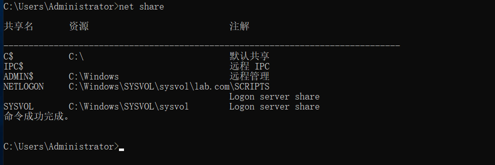
   2. 在web01上执行命令`klist purge`,清除票据缓存 
      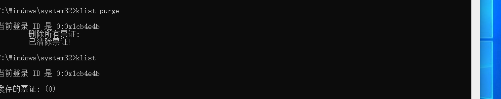
   3. 在web01上执行命令`net use * /delete`删除所有已建立的网络连接
      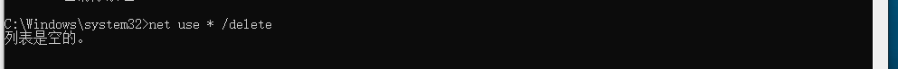 
   4. 确保时间同步（Kerberos对时间敏感，默认允许偏差5分钟）
      在域控上执行命令`w32tm /query /status`检查时间服务状态
      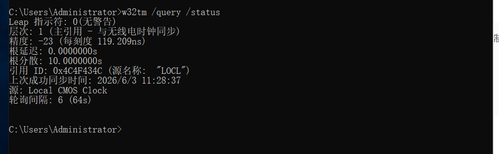
      在客户端执行命令`w32tm /resync /force`强制同步时间【注意要以管理员身份，普通用户没有权限强制同步系统时间】
      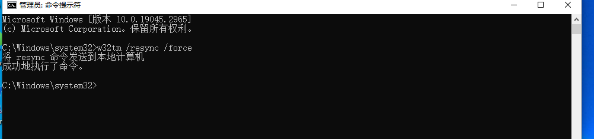 

## 进行抓包
1. 设置wireshark捕获过滤器`(ip.addr==192.168.162.10 or ip.addr==192.168.162.20) and (tcp.port==88 or tcp.port==464) and kerberos`并开始抓包
2. 以管理员身份运行【不然会拒绝访问】cmd然后执行命令`dir \\DC01.lab.com\c$`访问c$
3. 检查wireshark中的抓包记录，成功抓到域认证的数据包
   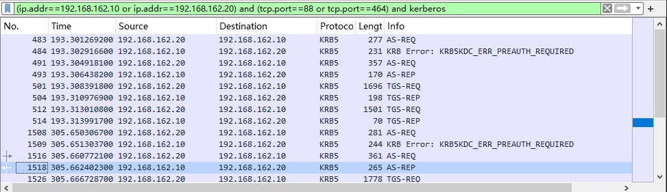
4. 将过滤条件改为smb2就可以查找到AP-REQ和AP-REP
   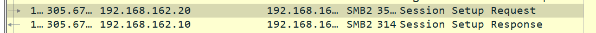 
5. 验证本地票据klist
   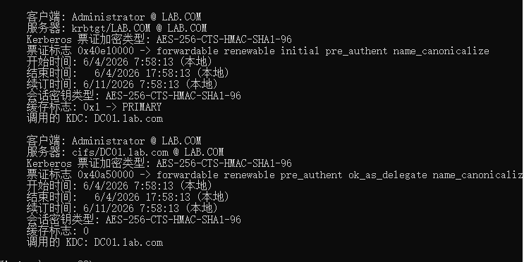 
## 数据包分析
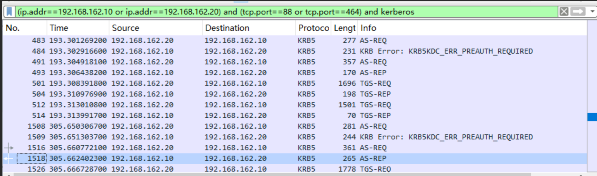
先看第484号包是KDC返回给客户端的KRB5KDCERR_PREAUTH_REQUIRED 错误包，意思是需要预认证，如果没有这一步就说明该账户就是一个存在漏洞、可以进行 AS-REP Roasting 攻击的用户账户
1. AS-REQ
   ```
    Kerberos
    ├── as-req
        ├── pvno: 5
        ├── msg-type: AS-REQ (10)
        └── req-body
                ├── cname (客户端名称) ← 这里面是用户名
                │    └── realm: LAB.COM
                └── etype (加密类型列表) ← 客户端支持的加密算法
   ```
   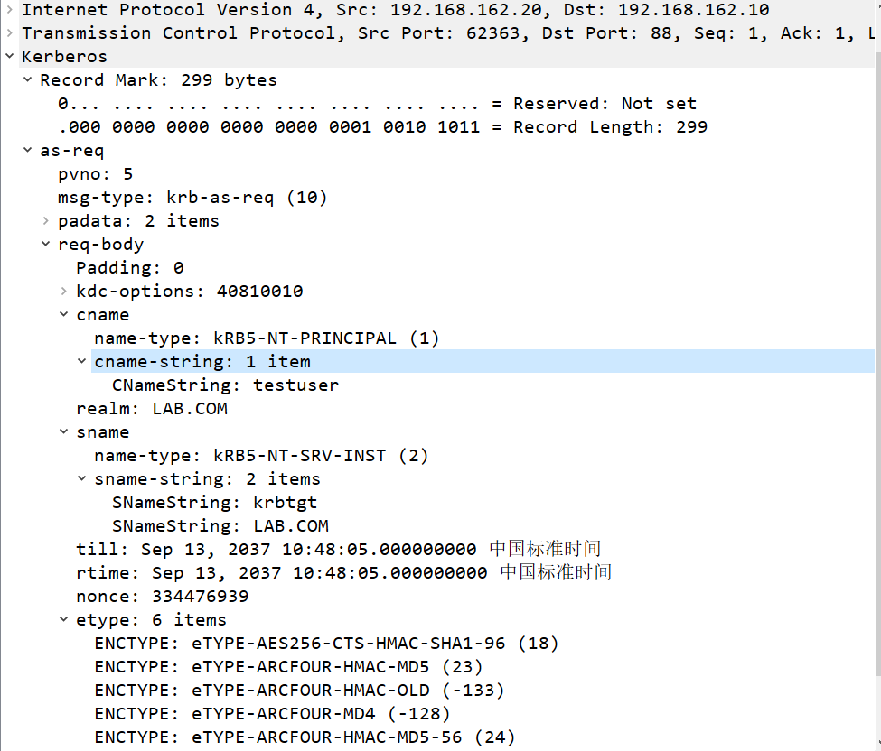 
2. AS-REP
   ```
    Kerberos
    ├── as-rep
        ├── pvno: 5
        ├── msg-type: AS-REP (11)
        ├── crealm: LAB.COM
        ├── cname ← 确认是你的用户名
        ├── ticket (这是最重要的！)
        │    ├── tkt-vno: 5
        │    ├── realm: LAB.COM
        │    ├── sname (服务名称)
        │    │    └── name-string: krbtgt ← 关键！这是 TGT 票据
        │    └── enc-part ← 加密的部分（用 krbtgt 的 Hash 加密的）
        └── enc-part ← 这个是用你的密码 Hash 加密的，包含 Session Key
   ``` 
   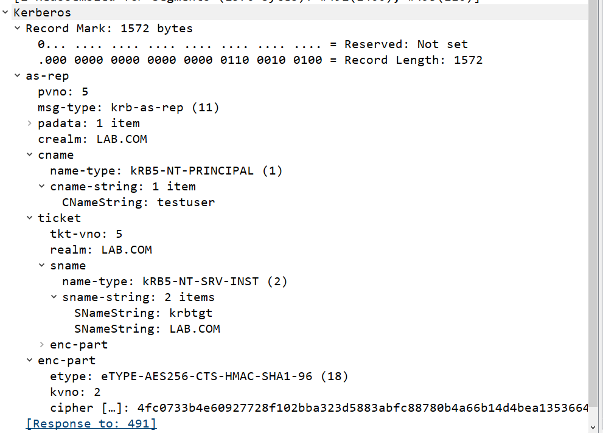
   sname:krbtgt证明该包返回的是TGT票据
3. TGS-REQ
   ```
    Kerberos
    ├── tgs-req
        ├── pvno: 5
        ├── msg-type: TGS-REQ (12)
        └── req-body
                ├── sname (你想要访问的服务)
                │    └── name-string: cifs ← 文件共享服务！
                │         └── DC01.lab.com ← 你要访问的目标
                └── etype
   ``` 
   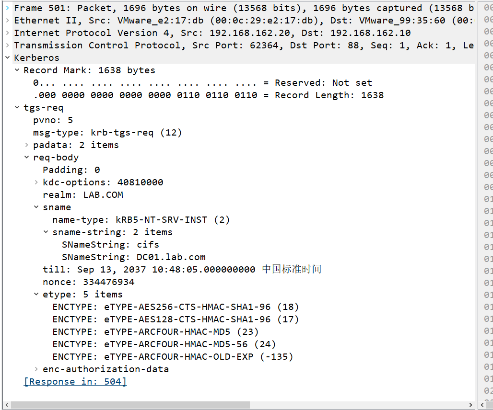
   sname: cifs/DC01.lab.com 说明在请求访问域控的文件共享服务
4. TGS-REP
   ```
    Kerberos
    ├── tgs-rep
        ├── pvno: 5
        ├── msg-type: TGS-REP (13)
        ├── ticket
        │    ├── sname
        │    │    └── name-string: cifs ← 这是服务票据！
        │    │         └── DC01.lab.com
        │    └── enc-part ← 用目标服务（DC01）的密码 Hash 加密
        └── enc-part ← 用 TGT 中的 Session Key 加密
   ``` 
   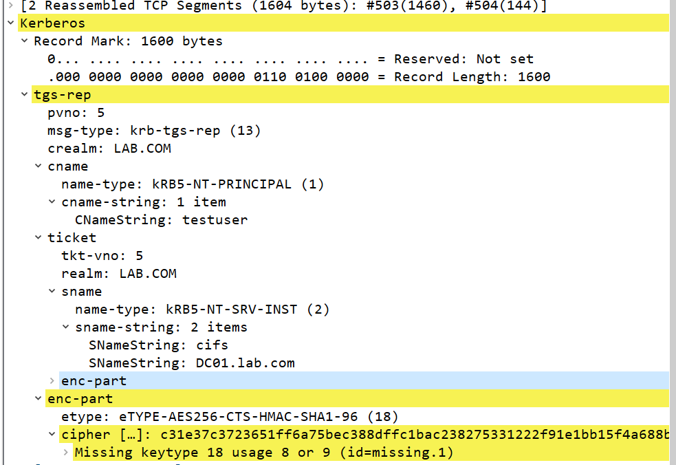
   sname: cifs/DC01.lab.com 证明了这个包返回的就是 ST 服务票据，用来访问指定的目标服务
5. AP-REQ
   ```
    SMB2 (Server Message Block Protocol Version 2)
    └── SMB2 Header
        └── Command: SMB2_COM_SESSION_SETUP (1)
                └── Session Setup Request
                    └── Security Buffer
                        └── GSS-API
                            └── OID: 1.2.840.113554.1.2.2 (Kerberos 5)
                                    └── Kerberos Ticket
                                        └── ap-req ← 这就是要找的
   ``` 
   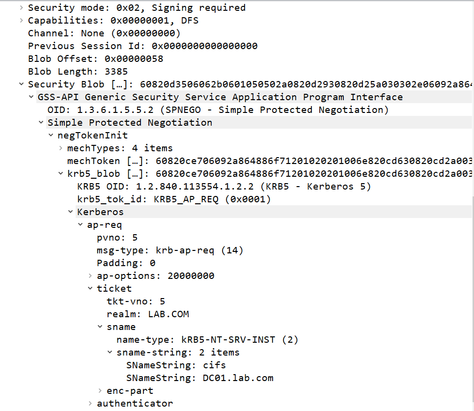
6. AP-REP
   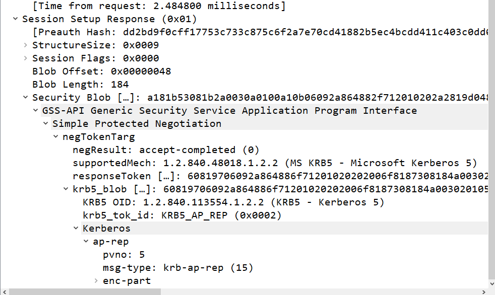 
7. PAC藏在AP-REP和TGS-REP的ticket中的enc-part部分，由于wireshark无法解密所有只能看到占位符看不到具体内容
   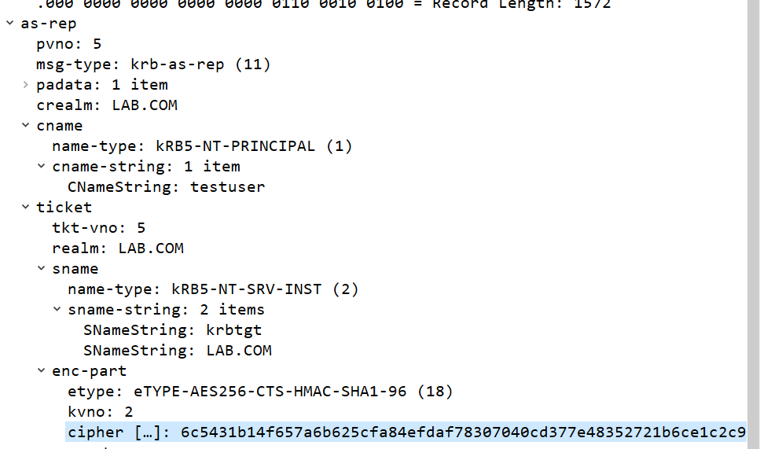 
## 域认证完整认证流程图
```
用户登录
    │
    ▼
[AS_REQ] ──────► KDC ──────► [AS_REP] (返回TGT，用krbtgt加密)
    │
    ▼
[TGS_REQ] ─────► KDC ──────► [TGS_REP] (返回ST，用目标服务密码加密)
    │
    ▼
[AP_REQ] ──────► 目标服务器 ──────► [AP_REP] (访问成功)
```
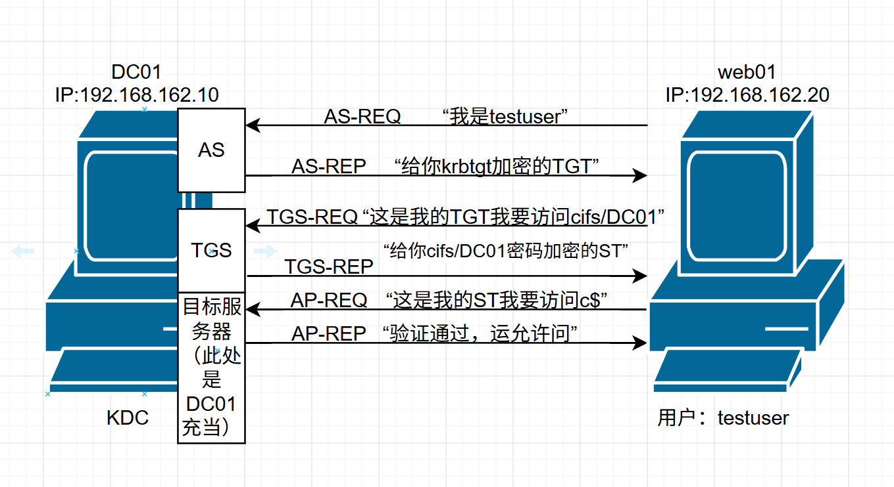
[域认证完整认证流程图](./auth-flow.drawio)
## 踩坑记录
1. 刚开始抓包一直抓不到域认证数据包
   1. 先查看自己是不是域成员
   2. 在检查DNS解析是否正确
      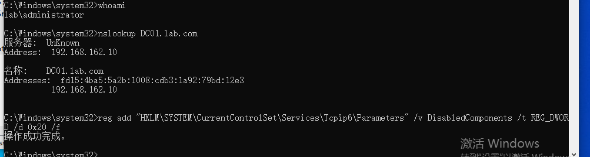
      发现DNS 响应里出现了两条记录：
      - 192.168.162.10（IPv4）
      - fd15:4ba5:...（IPv6）
      在 Windows / Kerberos 的行为逻辑中，IPv6 优先级高于 IPv4
   3. 在web01中禁用ipv6【仅限于实验环境，生成环境不用这样做】
      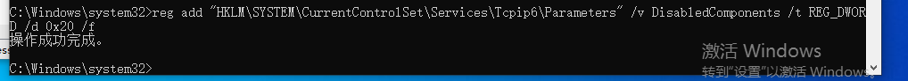
      然后重启web01
