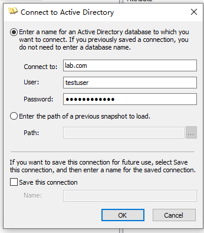
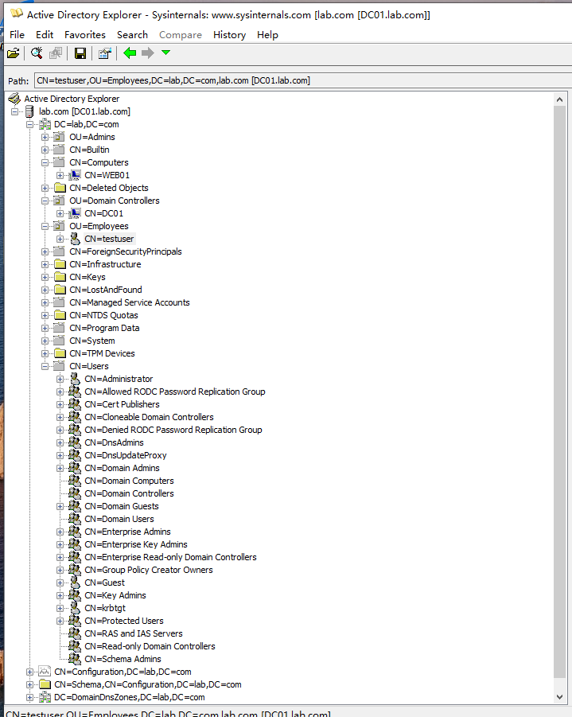
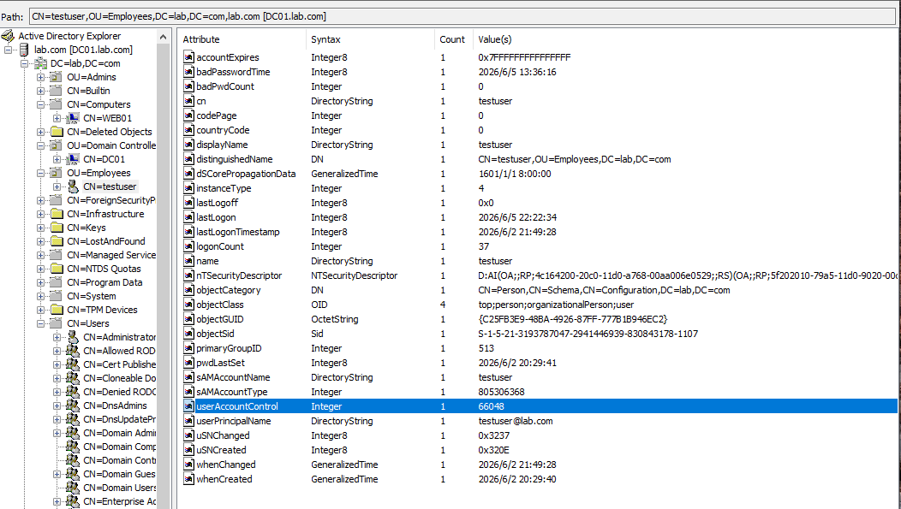
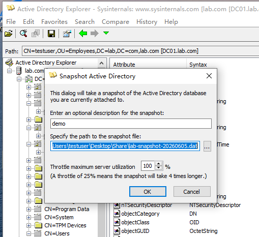

## 工具简介
AdExplorer 是微软 Sysinternals 套件中的 Active Directory 浏览器，无需安装，图形化界面，适合快速了解 AD 结构。
- 获取方式	https://live.sysinternals.com/ADExplorer.exe（可直接从微软服务器运行）
- 运行方式	双击或从 UNC 路径 `\\live.sysinternals.com\tools\ADExplorer.exe` 加载到内存
- 权限要求	任何域用户均可连接（查看权限取决于账户权限）
- 特色功能	快照拍摄、离线分析、LDAP 搜索、属性编辑
## 连接域

## AD结构概览

## 收集关键信息
1. 查看域用户
    展开 CN=Users 节点（点击左边的 + 号），查看系统内置用户。
    **关注重点**：
    - Administrator
    - Guest
    - Domain Admins（这是一个组，不是用户）
    展开 OU=Employees（如果有），查看员工用户。
    点一下 testuser，右侧会显示这个用户的所有属性。
2. 查看域管组成员
    找到 CN=Users 下的 CN=Domain Admins 组，点击它。右侧属性中找 member（成员列表），双击打开，查看谁是域管理员。
3. 查看域控
    展开 OU=Domain Controllers，点击下面的 DC01 计算机对象。
    右侧查看：
    - dNSHostName（域名）
    - operatingSystem（系统版本）
    - memberOf（所属组）
4. 查看加入域的计算机
    找到 CN=Computers 节点（注意：不是 OU=Domain Controllers，那是专门的域控容器）。点击它，看有没有 WIN10 或其他计算机。
5. 导出一个关键属性的截图
选择 testuser，在右侧属性中找到以下字段并截图：
| 重要属性 | 说明 |
|----------|------|
| sAMAccountName | 用户登录名 |
| userPrincipalName | 用户主体名称（UPN） |
| memberOf | 所属组（最关键！） |
| lastLogon | 最后登录时间 |
| pwdLastSet | 密码最后设置时间 |
| userAccountControl | 账户状态/512（正常） / 514（禁用） / 66048（密码永不过期） |

> `memberOf` 属性双击可以打开详细列表，看看 testuser 属于哪些组（Domain Users 或 Domain Admins）

---

## 导出快照
File → Create Snapshot → 保存到 C:\Users\testuser\Desktop\Share\lab-snapshot-20260605.dat
以后可以离线打开这个文件分析 AD 结构，不用每次都连域控
