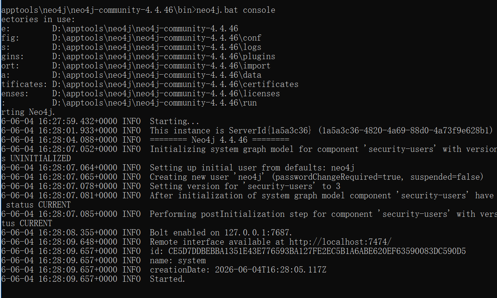
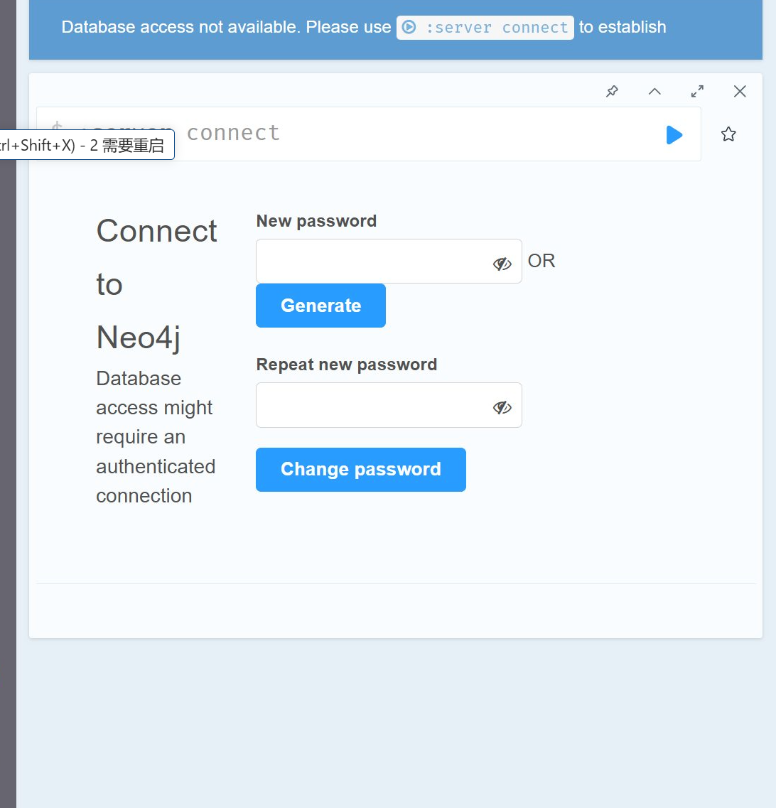
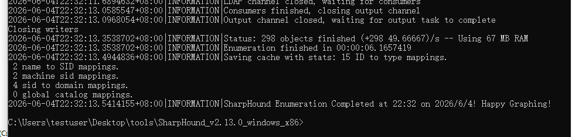
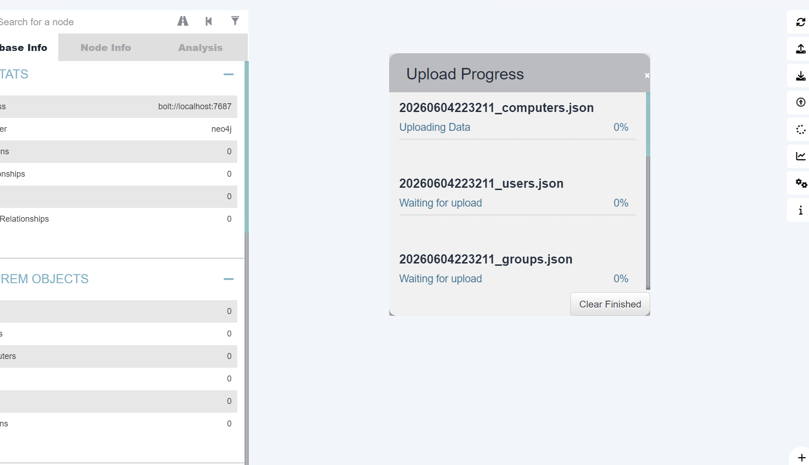

---

---
>BloodHound 是域渗透的“地图绘制工具”，通过分析域内用户、组、计算机、会话等关系，找出最短攻击路径。

## 环境配置
### 机器配置
| 机器 | 角色 | 需要做什么 | 是否必须 |
|------|------|------------|----------|
| Windows 10 | 数据采集器 | 运行 SharpHound.exe，采集域内信息，生成 .zip 文件 | ✅ 必须 |
| DC01（域控） | 数据来源 | 被 SharpHound 查询，提供 AD 数据库中的用户、组、计算机等信息 | ✅ 必须 |
| 宿主机 | 在线版BloodHound | 使用在线版BloodHound进行域数据分析 | ✅ 必须 |

---

### 网络要求
| 通信方向 | 是否需要 | 说明 |
|----------|----------|------|
| Win10 → DC01 | ✅ 必须 | SharpHound 需要查询 AD |
| Win10 → 宿主机 | ✅ 需要 | 只需要传一次 .zip文件 |

--- 

### BloodHound的整体架构
[]()

## 使用BloodHound 进行分析
1. 下载BloodHound：https://github.com/SpecterOps/BloodHound-Legacy/releases/tag/v4.3.1
2. 下载neo4j-4.4.46：https://dist.neo4j.org/neo4j-community-4.4.46-windows.zip
   - 启动：以管理员身份打开 CMD，进入解压后的 bin 目录，运行 neo4j.bat console
    
   - 访问：浏览器打开 http://localhost:7474，用 neo4j/neo4j 登录并修改密码。 
    
   *新密码：neo4jnew*
3. 在web01上使用SharpHound进行数据采集
   SharpHound下载地址：https://github.com/SpecterOps/SharpHound/releases 
   ```cmd
   SharpHound.exe -c All --Domain lab.com
   ```  
   
   成功收集到数据
   接下来找到生成的zip文件然后把数据导入BloodHound中进行分析
4. 分析数据
   1. 运行BloodHound，连接neo4j数据库然后导入刚刚的zip包
      
      等待上传完成
   2.  
## 查询命令

### 基础查询
### 自定义查询

## 问题与坑
1. win10中解压缩SharpHound时有的文件路径太长，超过 Windows 默认的 260 字符限制
   解决方案：用 7-Zip 解压（比 Windows 自带工具更友好）Windows 自带的解压工具对长路径支持不好。7-Zip 能更好地处理长路径
2. 注意运行SharpHound时windows的杀毒软件会拦截，所以要提前关闭杀毒软件或者添加排除项