# 红队实战1
## 网络拓扑
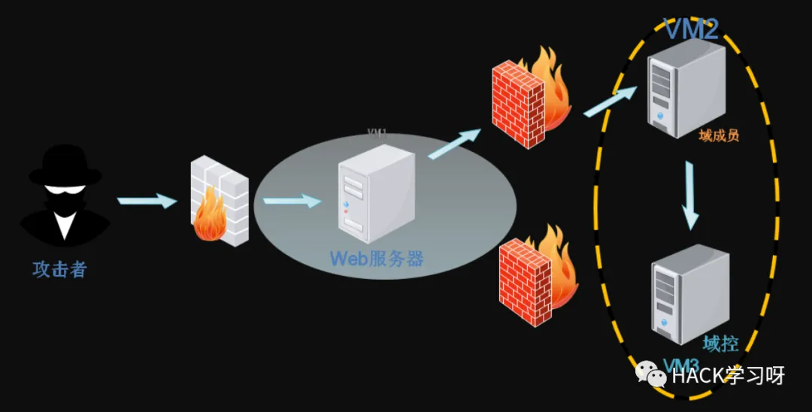

**win7**：web服务器
内网ip：192.168.52.143
外网ip：192.168.2.128

## 寻找突破入口

**web应用服务器漏洞-->getshell**

*公告暴露后台端点和默认账号密码*


*编辑前台模版文件插入php马*

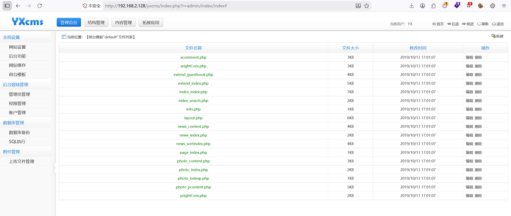
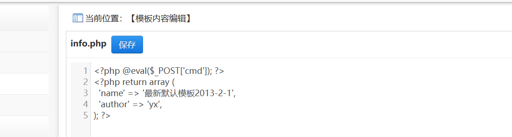

*目录爆破查找模版文件路径*

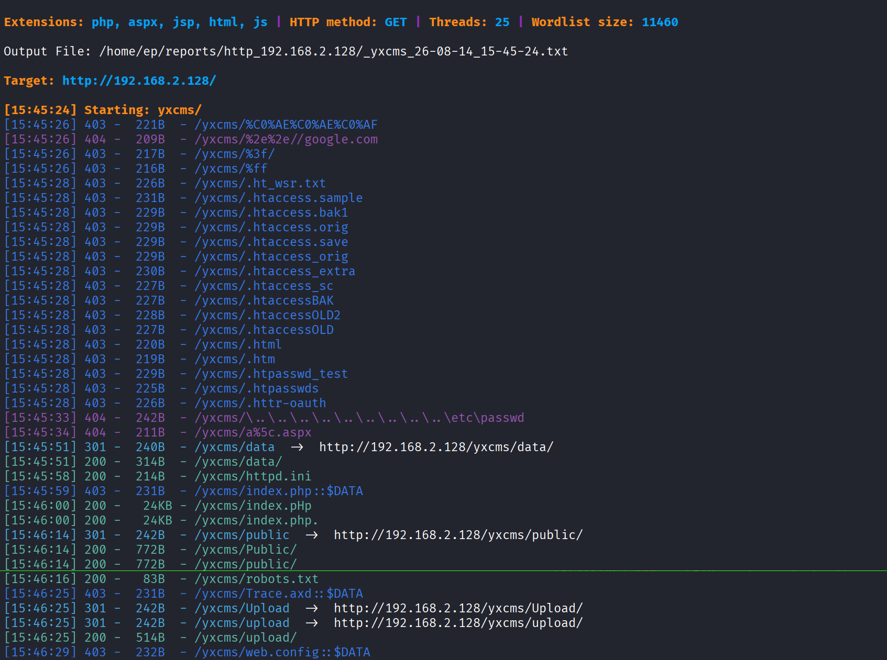

*访问/robots.txt*

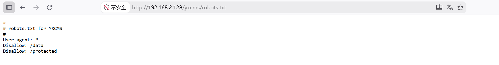

*访问/protected，找到webshell的路径*

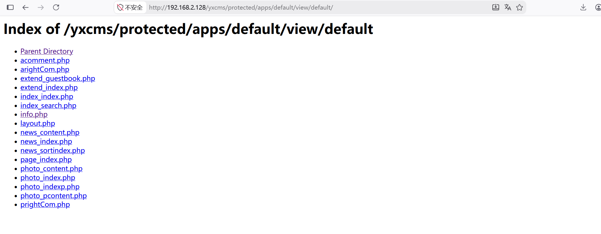

*蚁剑连接webshell*

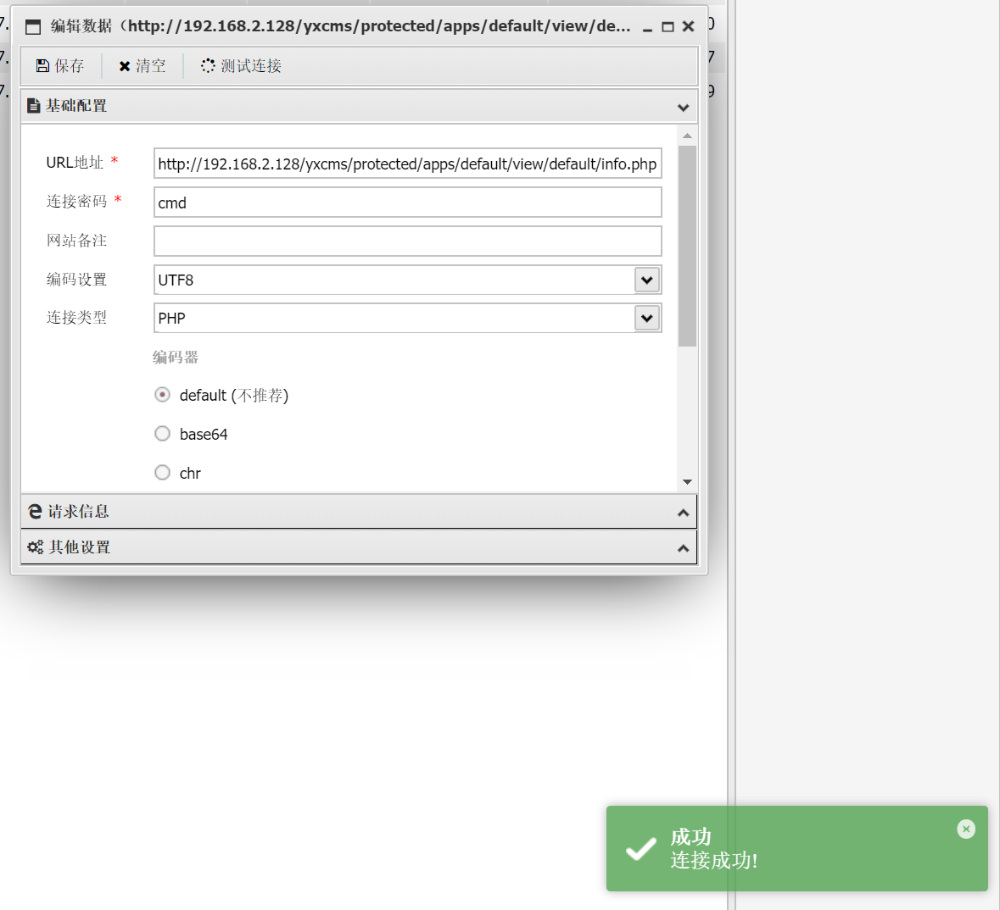
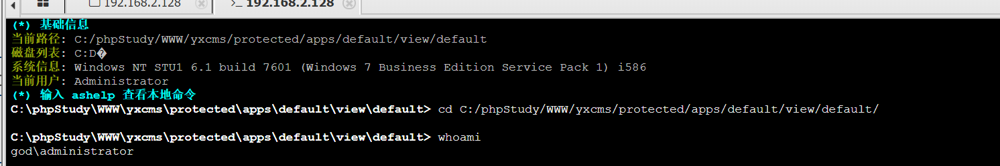

## 内网信息收集

**whoami /all 查看当前用户权限和组信息**

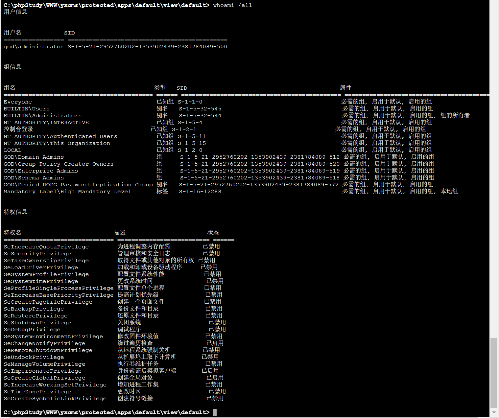

*用户身份：god\administrator*

*S-1-5-21-2952760202-1353902439-2381784089-500*

```
所属域：god
域内最高权限：administrator
SID后缀：-500【域管理员的固定标识】
```

*组信息*

```
GOD\Domain Admins	     域管理员组，域内最高权限
GOD\Enterprise Admins	 企业管理员，可以管理整个域林
GOD\Schema Admins	     架构管理员，可以修改AD架构
BUILTIN\Administrators	 本地管理员权限
```

*启用的权限*

`SeImpersonatePrivilege`  模拟客户端权限——可以伪造其他用户的令牌，用于令牌窃取和横向移动 

`SeCreateGlobalPrivilege` 创建全局对象权限——可用于某些持久化技术 

`SeChangeNotifyPrivilege` 绕过遍历检查——可以访问任意路径，即使没有明确权限

**ipconfig /displaydns 查询dns记录**

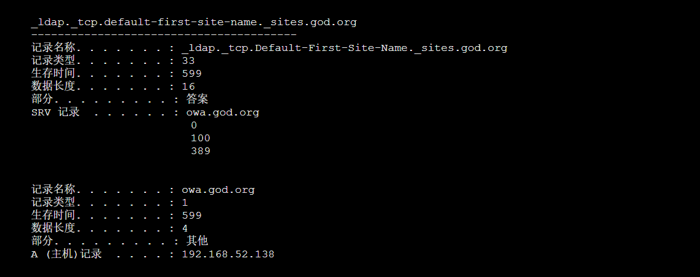

域控IP：192.168.52.138
子网：192.168.52.0/24

**nmap -sn 192.168.52.0/24 扫描子网**

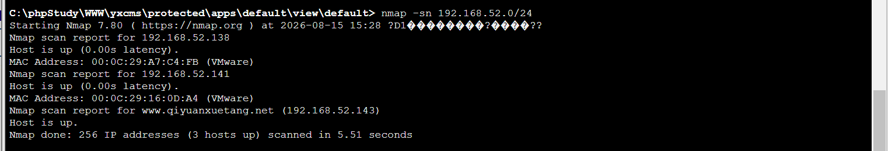

发现另一个域用户ip 192.168.52.141

**域内网络拓扑**

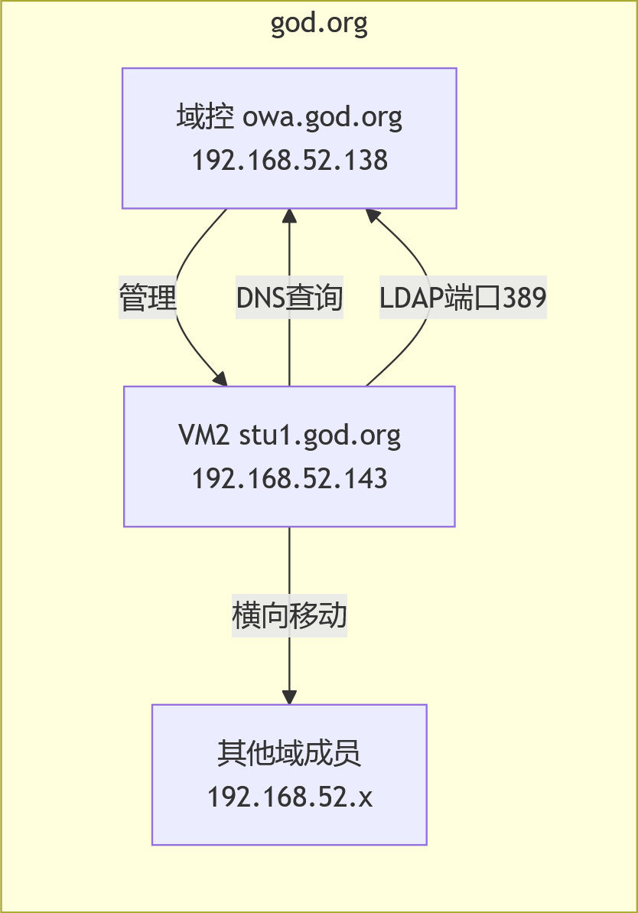

## 横向移动


## 提权
## 权限维持
